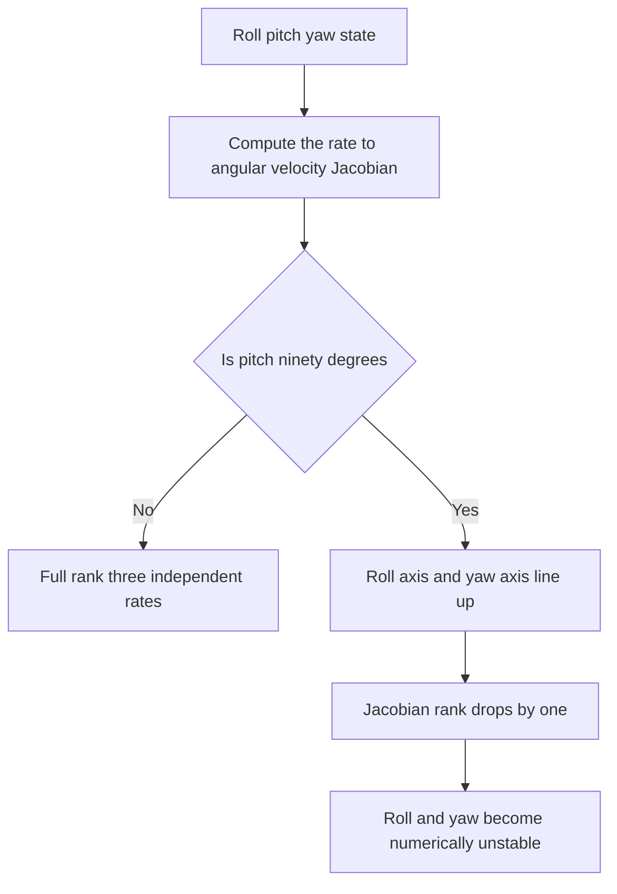
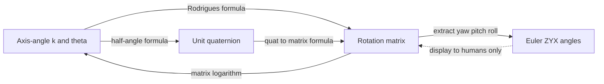

# Lecture 1 — Rotations Are a Group, Not a Bag of Numbers

> **Duration:** ~2 hours of reading + hands-on.
> **Outcome:** You can rotate a vector by a matrix, an axis-angle pair, and a quaternion; prove the three agree; explain why rotation matrices form the group SO(3); convert among all four representations; and demonstrate why ZYX Euler angles fail at pitch = ±90°.

If you remember one sentence from this entire week, remember this one:

> **A rotation is an element of a group. The three-number representations you reach for first — roll, pitch, yaw — are a chart on that group, and like every chart, they have places where they lie to you.**

Everything in robotics that involves "where is the robot pointing" sits on top of this. The orientation of the base, the pose of the camera, the attitude estimate from the IMU, the goal you send the arm — all of them are rotations, and all of them go wrong in the same handful of ways when an engineer treats orientation as three loose numbers instead of a single structured object. This lecture makes you immune.

---

## 1. Warm up in 2D: SO(2)

Start where intuition is free. A rotation of the plane by angle `θ` (counter-clockwise, the positive convention) is the linear map

```
        ⎡ cos θ   −sin θ ⎤
R(θ) =  ⎢                ⎥
        ⎣ sin θ    cos θ ⎦
```

Apply it to a column vector `v = [x, y]ᵀ` and you get `v' = R(θ) v`, the rotated vector. Three facts are worth stating precisely because they generalize:

1. **Orthogonality.** `R(θ)ᵀ R(θ) = I`. The columns are orthonormal: each has unit length and they are perpendicular. Geometrically: a rotation preserves lengths and angles.
2. **The inverse is the transpose.** `R(θ)⁻¹ = R(θ)ᵀ = R(−θ)`. Undoing a rotation by `θ` is rotating by `−θ`, and that is just the transpose. You will use this constantly: inverting a rotation is *free* — no matrix solve, just a transpose.
3. **Determinant +1.** `det R(θ) = cos²θ + sin²θ = 1`. A `−1` determinant would be a *reflection* (a flip), which also satisfies `RᵀR = I` but is not a rotation. The `+1` is what makes it "special."

The set of all such matrices, under matrix multiplication, is the group **SO(2)** — the *special orthogonal group* in two dimensions. "Group" means four things hold: composition of two rotations is a rotation (closure), there's an identity (`θ = 0`), every rotation has an inverse (`−θ`), and composition is associative. In 2D the group is *commutative* — rotating by `30°` then `40°` is the same as `40°` then `30°`. **Hold onto that, because in 3D it is spectacularly false**, and that single fact is the source of half the orientation bugs you'll ever write.

---

## 2. Up to 3D: rotation matrices and SO(3)

A 3D rotation is a 3×3 matrix `R` satisfying exactly the conditions that generalize SO(2):

- `RᵀR = I` (orthonormal columns — they form a right-handed orthonormal frame),
- `det R = +1` (a proper rotation, not a reflection).

The set of all such matrices is **SO(3)**. The same free inverse holds: `R⁻¹ = Rᵀ`. The three *elementary* rotations — about the x, y, and z axes — are the building blocks:

```
        ⎡ 1     0       0    ⎤          ⎡  cos β   0   sin β ⎤          ⎡ cos γ   −sin γ   0 ⎤
Rx(α) = ⎢ 0   cos α  −sin α  ⎥   Ry(β) = ⎢   0      1    0    ⎥   Rz(γ) = ⎢ sin γ    cos γ   0 ⎥
        ⎣ 0   sin α   cos α  ⎦          ⎣ −sin β   0   cos β ⎦          ⎣  0        0      1 ⎦
```

Note the **sign pattern on `Ry`** is "backwards" relative to `Rx` and `Rz` (the `−sin` is in the top-right, not the bottom-left). That is not a typo and it is not a choice — it falls out of the right-hand rule applied consistently. A huge fraction of beginner rotation bugs are a hand-transcribed `Ry` with the signs flipped. Copy it carefully or, better, generate it from the axis-angle formula in §4 and never hand-transcribe it again.

### 2.1 The right-hand rule, stated so you can't get it wrong

Point your right thumb along the positive axis of rotation. Your fingers curl in the direction of positive angle. So a positive `Rz` rotation carries the `+x` axis *toward* `+y`. Check it against `Rz(90°)`: it sends `[1,0,0]ᵀ → [0,1,0]ᵀ`. Yes — `x` went to `y`. Every convention in this course is right-handed, and ROS, tf2, Gazebo, and rviz2 are all right-handed with **x-forward, y-left, z-up** for a mobile robot's body frame (REP 103). Memorize that triple now; it never changes.

### 2.2 Why "it's a group" is a load-bearing statement, not pedantry

Because SO(3) is a group, every rotation has an exact inverse and you can compose rotations without ever leaving the set of valid rotations — *as long as you stay in the matrix (or quaternion) representation*. The moment you drop to three Euler numbers, compose, and convert back, you can land outside the well-behaved region (gimbal lock, §6). The group structure is the guarantee that "rotate, then rotate again, then undo the first one" does exactly what you mean. Lose the structure and you lose the guarantee.

### 2.3 Composition order matters — physically

In 3D, `R₁ R₂ ≠ R₂ R₁` in general. This is not a quirk of the notation; it is the geometry. Take a book on your desk. Rotate it 90° about the vertical axis, then 90° about the axis pointing away from you. Now start over and do those two in the opposite order. The book ends up in a *different* orientation. Try it with an actual book — the non-commutativity is something you can feel.

The convention that saves you: read a product **right to left**, applied to a vector. In `v' = R₁ R₂ v`, the rotation `R₂` happens *first* (it's nearest the vector), then `R₁`. When you compose transforms down a tf2 tree next week, this right-to-left reading is the whole game.

---

## 3. The skew-symmetric matrix and angular velocity

Before axis-angle, one tool you'll use everywhere: the **skew-symmetric (cross-product) matrix**. For a vector `ω = [ωx, ωy, ωz]ᵀ`, define

```
        ⎡  0    −ωz    ωy ⎤
[ω]× =  ⎢  ωz    0    −ωx ⎥
        ⎣ −ωy    ωx    0  ⎦
```

This matrix has one job: `[ω]× v = ω × v` for any `v`. It turns a cross product into a matrix multiply. Two properties matter immediately:

- `[ω]×ᵀ = −[ω]×` (that's what "skew-symmetric" means).
- For a *unit* vector `k`, `[k]׳ = −[k]×`. This periodicity is exactly what makes Rodrigues' formula (next section) a clean closed form instead of an infinite series.

It also connects to physics: if a body's orientation is `R(t)` and its angular velocity in the world frame is `ω`, then `Ṙ = [ω]× R`. You'll meet this differential equation again when you integrate gyro data in Week 9. For now, it's the bridge from "a rotation" to "the rate of a rotation."

---

## 4. Axis-angle and Rodrigues' formula

**Euler's rotation theorem** is the deep fact: *every* 3D rotation, no matter how complicated, is a single rotation by some angle `θ` about some fixed unit axis `k`. Not a sequence of three — *one*. This `(k, θ)` pair is the **axis-angle** representation, and it is the most physically honest of the four: it says exactly what a rotation *is*.

The formula that turns `(k, θ)` into a matrix is **Rodrigues' rotation formula**:

```
R = I + sin θ · [k]× + (1 − cos θ) · [k]ײ
```

where `k` is a *unit* axis and `[k]×` is its skew-symmetric matrix. This is the single most useful rotation formula in robotics. Read it as: start from the identity, add a first-order term that does the bulk of the rotation, and a second-order term that corrects the curvature. It is exact, not an approximation.

A worked check: rotate by `θ = 90°` about `k = [0,0,1]ᵀ` (the z-axis). Then `sin θ = 1`, `cos θ = 0`, and

```
        ⎡ 0  −1   0 ⎤            ⎡ −1   0   0 ⎤
[k]× =  ⎢ 1   0   0 ⎥   [k]ײ =  ⎢  0  −1   0 ⎥
        ⎣ 0   0   0 ⎦            ⎣  0   0   0 ⎦
```

so `R = I + [k]× + [k]ײ` gives the top-left 2×2 as `[[0,−1],[1,0]]` and a `1` in the bottom-right — exactly `Rz(90°)`. The formula reproduces the elementary rotation, as it must.

Rodrigues is the *exponential map* in disguise: `R = exp([k]× θ)`, the matrix exponential of the scaled skew matrix. The `[k]׳ = −[k]×` periodicity collapses the infinite Taylor series of `exp` into the two trig terms above. You don't need the series to use the formula, but knowing it's a matrix exponential is why the axis-angle vector `kθ` is sometimes called the *rotation vector* or *exponential coordinates* — and why the inverse map (matrix → axis-angle) is a matrix logarithm.

### 4.1 Recovering axis-angle from a matrix

Going backward, from `R` to `(k, θ)`:

```
θ = arccos( (trace(R) − 1) / 2 )

           1        ⎡ R₃₂ − R₂₃ ⎤
k = ───────────── · ⎢ R₁₃ − R₃₁ ⎥        (valid when sin θ ≠ 0)
       2 sin θ      ⎣ R₂₁ − R₁₂ ⎦
```

The `trace` formula is robust; the axis formula degenerates when `θ → 0` (no well-defined axis — any axis works for a zero rotation) and needs care near `θ = π`. Production code handles those edge cases explicitly; `scipy.spatial.transform.Rotation` does it for you, which is why we verify against it.

---

## 5. Quaternions: the representation you'll actually ship

Rotation matrices are nine numbers with six constraints (orthonormality). Axis-angle is four numbers with one constraint. **Unit quaternions are four numbers with one constraint** (unit norm), they compose cheaply, they interpolate beautifully, and they never gimbal-lock. This is why every serious attitude estimator, every game engine, and every line of tf2's internals stores orientation as a quaternion. Learn them properly now.

### 5.1 The algebra

A quaternion is `q = w + x i + y j + z k`, four real numbers with three imaginary units obeying Hamilton's relations:

```
i² = j² = k² = i j k = −1
i j = k,   j k = i,   k i = j   (cyclic)
j i = −k,  k j = −i,  i k = −j  (anti-cyclic — order matters!)
```

The anti-commutativity (`ij = −ji`) is the algebraic root of why 3D rotations don't commute. We write a quaternion as a scalar-plus-vector pair `q = (w, **v**)` with `**v** = (x, y, z)`. The conventions you must pin down (and that cause endless cross-library pain):

- **Order:** ROS uses `(x, y, z, w)` in the message fields, but most math is written `(w, x, y, z)`. `tf_transformations` and `geometry_msgs/Quaternion` are `(x, y, z, w)`. `scipy`'s `Rotation.from_quat` is `(x, y, z, w)` by default. **Write the order on a sticky note.** A swapped scalar component is the single most common quaternion bug in this course.
- **Hamilton vs. JPL:** there are two conventions for the multiplication sign. ROS, Eigen, and `scipy` use **Hamilton**. Some aerospace code uses JPL. We use Hamilton everywhere. If you ever import code and rotations come out *backwards*, suspect a Hamilton/JPL mismatch.

### 5.2 A unit quaternion encodes a rotation

The bridge from axis-angle to quaternion is clean and worth memorizing:

```
q = ( cos(θ/2),  k · sin(θ/2) )      for a rotation of θ about unit axis k
```

The **half-angle** is the famous surprise. A `360°` rotation gives `q = (cos 180°, …) = (−1, 0,0,0)`, *not* the identity `(1,0,0,0)`. You have to go around `720°` to return the quaternion to where it started. This is the **double cover**: the quaternions wrap SO(3) *twice*, so `q` and `−q` represent the *same* rotation. Practically, this means when you compare two orientations you must compare `q` against both `q'` and `−q'`, and when you interpolate you pick the shorter way around (the "dot-product sign flip" in SLERP).

### 5.3 Rotating a vector with a quaternion

To rotate a vector `v` by the rotation that `q` encodes, embed `v` as a *pure* quaternion `(0, v)` and conjugate:

```
v' = q · (0, v) · q⁻¹           and for a unit quaternion, q⁻¹ = q* = (w, −**v**)
```

The conjugate `q*` negates the vector part; for a *unit* quaternion the inverse equals the conjugate, so this is cheap. The sandwich `q v q⁻¹` is the quaternion analogue of `R v` — and you can prove `q v q⁻¹` produces exactly the Rodrigues matrix acting on `v`, which is Exercise 2's verification.

### 5.4 Composing rotations: the Hamilton product

To apply rotation `q₂` then `q₁`, multiply: `q = q₁ q₂` (same right-to-left reading as matrices). The Hamilton product of `q₁ = (w₁, **v₁**)` and `q₂ = (w₂, **v₂**)` is

```
w = w₁ w₂ − **v₁** · **v₂**
**v** = w₁ **v₂** + w₂ **v₁** + **v₁** × **v₂**
```

The cross-product term `**v₁** × **v₂**` is non-commutative — swap the operands and it flips sign — which is *why* quaternion composition is non-commutative, mirroring matrix composition. You'll implement this in Exercise 2 and test it against `scipy`.

### 5.5 Quaternion → rotation matrix

For a unit quaternion `q = (w, x, y, z)`, the equivalent rotation matrix is

```
     ⎡ 1 − 2(y² + z²)     2(xy − wz)       2(xz + wy)   ⎤
R =  ⎢ 2(xy + wz)       1 − 2(x² + z²)     2(yz − wx)   ⎥
     ⎣ 2(xz − wy)         2(yz + wx)     1 − 2(x² + y²) ⎦
```

Transcribe this once into your `crunch_rotations` library, test it against `scipy.spatial.transform.Rotation.from_quat(...).as_matrix()`, and never hand-write it again. The reverse (matrix → quaternion) uses Shepperd's method (pick the largest diagonal term to avoid dividing by a near-zero); `scipy` handles it and you'll lean on that.

### 5.6 SLERP at a glance

To interpolate smoothly from orientation `q₀` to `q₁` by parameter `t ∈ [0,1]`, **spherical linear interpolation** walks the great-circle arc on the unit-quaternion sphere at constant angular speed:

```
SLERP(q₀, q₁, t) = ( sin((1−t)Ω) / sin Ω ) q₀ + ( sin(tΩ) / sin Ω ) q₁,    cos Ω = q₀ · q₁
```

If `q₀ · q₁ < 0`, negate one of them first (double cover!) so you take the *short* way around. Plain linear interpolation of the four components then re-normalizing (NLERP) is cheaper and usually fine; SLERP is the constant-speed gold standard. This is how your `tumbling_pose` node could ease between keyframes instead of stepping.

---

## 6. Euler angles and why ZYX is a debugging nightmare

Euler angles represent a rotation as three sequential elementary rotations. The convention this course (and aerospace, and ROS's `rpy`) uses is **ZYX intrinsic** — yaw about z, then pitch about the *new* y, then roll about the *new* x:

```
R = Rz(yaw) · Ry(pitch) · Rx(roll)
```

They are seductive because they're human-readable: "the robot is yawed 30°, pitched up 10°." Use them for exactly that — talking to humans — and *nothing else*. Here is why.

### 6.1 They are ambiguous

The same orientation has multiple `(roll, pitch, yaw)` triples, because angles wrap and because the conversion `R → Euler` involves `atan2` branches. Two estimators can report "the same" orientation as `(179°, 0, 0)` and `(−181°, 0, 0)`. Comparison and averaging of Euler angles is a minefield. Quaternions have only the clean `q ≡ −q` double-cover ambiguity, which is trivial to handle.

### 6.2 Gimbal lock — the rank drop you can compute

Here is the failure, made concrete. The map from `(roll, pitch, yaw)` rates to angular velocity has a Jacobian. At **pitch = ±90°**, that Jacobian drops rank: two of the three axes line up, and you lose a degree of freedom. The yaw and roll axes become the same physical axis, so a combined yaw+roll motion is impossible to represent as *separate* rates. The mathematical symptom is a `cos(pitch)` in a denominator that goes to zero.

You can demonstrate it numerically (this is the challenge): take a rotation matrix, convert to ZYX Euler, and near pitch = 90° watch the roll and yaw become wildly sensitive to tiny matrix perturbations — a hair of numerical noise sends roll swinging by tens of degrees, because the decomposition is singular there. A quaternion or matrix sails through pitch = 90° with no drama whatsoever. **That is the whole argument for never storing state as Euler angles:** the storage format has a singularity that the actual rotation does not.


*Why Euler angles lose a degree of freedom exactly at pitch ninety degrees.*

### 6.3 The honest field rule

> Store orientation as a **quaternion** (or a matrix). Compute with quaternions. Convert to Euler **only at the very edge**, for a log line a human reads or a one-off operator display — and even then, know you're crossing into a representation with singularities. The instant you find yourself composing or differencing Euler angles in a control loop, stop: you have a gimbal-lock bug waiting for the day your robot pitches to vertical.

---

## 7. Putting the four representations in one table

| Representation | Numbers | Constraint | Compose | Invert | Singularity? | Use it for |
|---|---|---|---|---|---|---|
| **Rotation matrix** | 9 | `RᵀR=I`, `det=+1` | matrix multiply | transpose (free) | none | acting on vectors, tf math |
| **Axis-angle** | 4 (`k,θ`) | `‖k‖=1` | awkward | negate `θ` | at `θ=0` (axis undefined) | physical intuition, integration |
| **Quaternion** | 4 | `‖q‖=1` | Hamilton product (cheap) | conjugate (free) | none (double cover only) | **storage, estimation, shipping** |
| **Euler ZYX** | 3 | none | re-derive matrix | messy | **pitch = ±90° (gimbal lock)** | human-readable display only |

The throughline: **quaternions for storage and computation, matrices for acting on vectors and chaining transforms, axis-angle for intuition and integration, Euler only for humans.** Internalize that hierarchy and you will write rotation code that doesn't betray you.


*The formulas that move you between the four rotation representations; Euler is a one-way exit for humans, not a place to compute.*

---

## 8. A worked end-to-end example

Let's rotate the vector `v = [1, 0, 0]ᵀ` by 90° about the z-axis, three ways, and confirm they agree.

**Matrix way.** `R = Rz(90°)`, so `v' = R v = [0, 1, 0]ᵀ`. (x goes to y, right-hand rule.)

**Axis-angle / Rodrigues way.** `k = [0,0,1]ᵀ`, `θ = 90°`. Rodrigues gives the same `Rz(90°)`, so `v' = [0, 1, 0]ᵀ`.

**Quaternion way.** `q = (cos 45°, 0, 0, sin 45°) = (0.7071, 0, 0, 0.7071)`. Form `(0, v) = (0, 1, 0, 0)`, compute `q (0,v) q⁻¹`. The Hamilton products yield the pure quaternion `(0, 0, 1, 0)`, i.e. `v' = [0, 1, 0]ᵀ`.

All three give `[0, 1, 0]ᵀ`. That agreement — computed three independent ways and matching — is the sanity check you bake into Exercise 2 and the `crunch_rotations` test suite. When you trust your own implementations *because they agree with each other and with scipy*, you can debug the day they don't.

---

## 9. SLERP: interpolating orientations the right way

A practical problem you'll hit immediately when animating a pose or planning a smooth reorientation: how do you get *halfway* between two orientations `q₀` and `q₁`? The naive answer — average the four components and normalize — is *almost* right but gives non-constant angular speed (it rushes through the middle). The correct tool is **SLERP** (spherical linear interpolation), which walks the great-circle arc on the unit-quaternion sphere at constant speed.

```
SLERP(q₀, q₁, t) = ( sin((1−t)Ω) / sin Ω ) q₀ + ( sin(tΩ) / sin Ω ) q₁,    cos Ω = q₀ · q₁
```

Here `Ω` is the angle between the two quaternions on the 4-sphere (computed from their dot product), and `t ∈ [0,1]` is the interpolation parameter. At `t=0` you get `q₀`; at `t=1`, `q₁`; in between, a constant-angular-velocity sweep.

The double-cover bites here, so handle it: **if `q₀ · q₁ < 0`, negate `q₁` before interpolating.** Because `q₁` and `−q₁` are the same rotation, a negative dot product means the two quaternions are on "opposite sides" of the sphere and SLERP would take the *long* way around (up to 360° the wrong direction). Negating one flips it to the near side so you take the short arc. Forget this and your robot reorients by spinning almost all the way around — a vivid, confusing bug the first time you see it.

A worked check: SLERP from identity `q₀ = (1,0,0,0)` to a 90°-about-z `q₁ = (0.7071, 0, 0, 0.7071)` at `t = 0.5` gives a 45°-about-z quaternion `(0.9239, 0, 0, 0.3827)` — exactly halfway in *angle*, which is what "constant angular speed" means. Plain component-averaging would *not* give you a clean 45°; it'd be biased. For most robotics, the cheaper **NLERP** (linear-interpolate the components, then normalize) is close enough and avoids the trig, but SLERP is the gold standard and the one to reach for when angular-speed uniformity matters (camera gimbals, smooth arm reorientation).

---

## 10. The convention traps that cost real engineers real hours

The math above is clean. The bugs come almost entirely from *conventions*, and they're worth cataloguing because every one of them has eaten an afternoon of someone's life:

- **Quaternion component order.** Math books write `(w, x, y, z)` (scalar first); ROS `geometry_msgs/Quaternion`, `tf_transformations`, and `scipy.Rotation` all use `(x, y, z, w)` (scalar last). Mixing them swaps the scalar into a vector slot and produces a *wrong but plausible-looking* rotation. The fix is discipline: pick one internal order (we use `(w,x,y,z)`), and convert only at the library boundary, in one clearly-named adapter.
- **Hamilton vs. JPL multiplication.** Two sign conventions for the quaternion product exist. ROS, Eigen, and scipy use **Hamilton**; some aerospace and older code uses JPL. They differ by the sign of the vector part, so importing JPL code into a Hamilton pipeline makes rotations come out *backwards* or *transposed*. If a rotation is mysteriously inverted, suspect this.
- **Active vs. passive (alias vs. alibi).** Does `R` rotate the *vector* (active/alibi) or the *frame* the vector is expressed in (passive/alias)? They're transposes of each other. ROS/tf2 transforms are about expressing a point in a different frame (passive), while "rotate this object" is active. Conflating them gives you `Rᵀ` where you wanted `R`.
- **Intrinsic vs. extrinsic Euler.** ZYX *intrinsic* (each rotation about the new, rotated axis) differs from ZYX *extrinsic* (about the fixed world axes). They're related by reversing the order. `scipy`'s `from_euler` lets you pick with uppercase (intrinsic) vs lowercase (extrinsic) axis letters — read that docstring carefully.
- **Degrees vs. radians.** Every ROS and NumPy trig function is radians. A `90` where you meant `np.deg2rad(90)` is a 5156% error. Obvious, and yet.

The meta-lesson: **rotation *math* is rarely the bug; rotation *conventions* almost always are.** This is precisely why the verify-against-a-reference habit (testing your conversions against scipy, comparing up to the double-cover sign) is the most valuable thing you'll build this week. The test suite is what turns "a mysterious wrong rotation" into "an assertion that points at the exact swapped component."

---

## 11. Composing rotations down a chain: a preview of tf2

Everything above was about *one* rotation. Robots are made of *chains* of them — the camera is rotated relative to the arm wrist, which is rotated relative to the elbow, relative to the shoulder, relative to the base. Next week's tf2 is the machinery for managing those chains, but the math is the composition you already know.

If `R_world_base` is the rotation taking a vector from the base frame to the world frame, and `R_base_cam` takes it from camera to base, then the camera-to-world rotation is the product:

```
R_world_cam = R_world_base · R_base_cam
```

Read it right-to-left (§2.3): a vector in the camera frame is first lifted to the base frame, then to the world frame. The subscripts *cancel* like fractions — `world_base · base_cam → world_cam` — which is the single most useful mnemonic for not getting transform chains backwards. When the inner subscripts don't match (`world_base · cam_base`), you have a frame mismatch and you need to invert one: `R_base_cam = R_cam_base⁻¹ = R_cam_baseᵀ` (free, it's a transpose).

This "subscripts cancel, read right-to-left" discipline is what tf2 automates: you ask it for `R_world_cam` and it walks the tree multiplying the rotations (and, next week, the full transforms) along the path, inverting where it traverses an edge backwards. The reason we drilled composition order and the free transpose-inverse so hard is that they *are* the tf2 lookup, by hand. When tf2 throws `LookupException` next week because a frame is missing, you'll understand it as "a link in this product chain doesn't exist." The chain math is the same; tf2 just adds translation (making it SE(3), Week 2) and time.

A worked sanity check you can do today: if the base is yawed 90° in the world (`R_world_base = Rz(90°)`) and the camera is pitched 90° on the base (`R_base_cam = Ry(90°)`), then `R_world_cam = Rz(90°)·Ry(90°)`. Apply it to the camera's forward axis `[0,0,1]ᵀ` (camera looks down its z) and you can predict, by hand, where the camera points in the world — then verify in NumPy. Getting that prediction right is the skill that makes tf2 feel like bookkeeping instead of magic.

> **Why we front-load this much rotation math.** It can feel like a lot of theory before the robot moves. It isn't optional. Orientation is the one quantity that appears in *every* subsequent week — the IMU's attitude (Week 9), the EKF's state (Week 10), the arm's end-effector pose (Week 23), the grasp pose (Week 25), the camera extrinsics (Week 12). An engineer who is fuzzy about quaternions and composition order pays for it in *every* one of those weeks, with bugs that present as "the robot points the wrong way" and take hours to trace. An engineer who is fluent here treats all of it as routine. The two hours you spend now is the highest-leverage time in the whole track.

One last framing that ties the lecture together. Notice that the two representations we recommend for *computation* — matrices and quaternions — are exactly the two with **no singularities** (the matrix has nine redundant numbers with six constraints; the quaternion has four with one constraint and only the benign double cover). The representations we warn against for state — Euler angles — are the ones that trade redundancy for a minimal three numbers and pay for it with a singularity (gimbal lock). This is a general principle in robotics and in geometry: **a globally well-behaved representation of a curved space needs more numbers than the space's dimension, plus constraints to keep them on the manifold.** SO(3) is a 3-dimensional curved space; any *3-number* chart on it must be singular somewhere (a theorem, not bad luck). Quaternions buy global smoothness with one extra number and one constraint — the cheapest possible insurance. When you reach for a quaternion instead of three Euler angles, you're buying out of an entire category of bug for the price of one redundant float. That's the deal, and it's always worth taking.

---

## 12. Recap

You should now be able to:

- State the two conditions (`RᵀR = I`, `det R = +1`) that define SO(3) and why the inverse is the transpose.
- Write the three elementary rotation matrices (watching the `Ry` sign pattern) and read a rotation product right-to-left.
- Build a rotation matrix from axis-angle with Rodrigues' formula, and recover axis-angle from a matrix.
- Convert axis-angle ↔ quaternion via the half-angle, rotate a vector with `q v q⁻¹`, and compose with the Hamilton product.
- Explain the double cover (`q ≡ −q`) and why quaternions are the right storage format.
- Demonstrate gimbal lock as a rank drop at pitch = ±90° and articulate why state is never stored as Euler angles.
- Interpolate orientations with SLERP (handling the double cover), compose rotations down a frame chain, and name the convention traps (component order, Hamilton/JPL, active/passive, intrinsic/extrinsic, degrees/radians).
- Explain why a singularity-free representation of SO(3) needs more than three numbers, and why quaternions are the cheapest such insurance.

Next: how to get a ROS2 system running and publish your first message. Continue to [Lecture 2 — ROS2 First Contact](./02-ros2-first-contact.md).

---

## References

- *Quaternion kinematics for the error-state Kalman filter* (Solà), §1–2 — conventions, Hamilton product, double cover: <https://arxiv.org/abs/1711.02508>
- *Modern Robotics* (Lynch & Park), Ch. 3 — SO(3), the exponential map, Rodrigues: <https://hades.mech.northwestern.edu/index.php/Modern_Robotics>
- *3Blue1Brown — interactive quaternions*: <https://eater.net/quaternions>
- *Gimbal lock* — Wikipedia, the ZYX singularity: <https://en.wikipedia.org/wiki/Gimbal_lock>
- *`scipy.spatial.transform.Rotation`* — the reference implementation you verify against: <https://docs.scipy.org/doc/scipy/reference/generated/scipy.spatial.transform.Rotation.html>
- *REP 103 — coordinate conventions* (x-forward, y-left, z-up): <https://www.ros.org/reps/rep-0103.html>
- *3Blue1Brown — interactive quaternions* (geometric intuition): <https://eater.net/quaternions>
- *`tf_transformations`* — the ROS2 quat/Euler/matrix conversion helpers: <https://github.com/DLu/tf_transformations>

---

*Practice prompt before the exercises:* take the rotation "yaw 30°, then pitch 45° about the new axis," write it as a quaternion product, convert to a matrix by hand and in scipy, and confirm they agree up to the double-cover sign. If you can do that without a reference, you're ready for Exercise 2.
