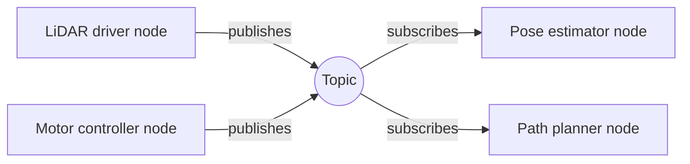
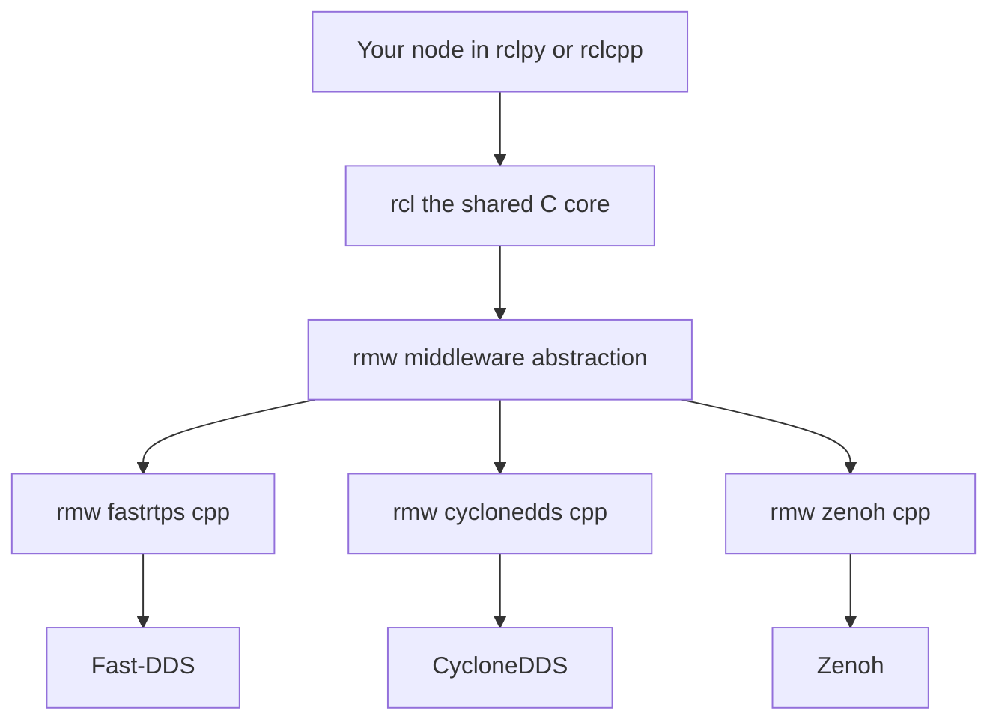

# Lecture 2 — ROS2 First Contact: Architecture, Install, and Your First Node

> **Duration:** ~2 hours of reading + hands-on.
> **Outcome:** You can explain the ROS2 architecture (nodes, topics, the DDS layer) and why ROS1 is dead, install ROS2 Jazzy cleanly, set up a colcon workspace, and write + run a 50 Hz `rclpy` publisher that emits a rotating `geometry_msgs/PoseStamped` you visualize in rviz2.

Lecture 1 gave you the math object you'll publish — a rotation, stored as a quaternion. This lecture gives you the *machinery* that carries it between processes: ROS2. Three parts: (1) the architecture and why ROS1 died, (2) the install and workspace hygiene, (3) your first publisher, built and visualized.

---

## Part 1 — The ROS2 architecture, and why ROS1 is dead

### 1.1 What a robot's software actually is

A robot's software is not one program. It is *dozens* of small programs — one reading the LiDAR, one running the motor controller, one estimating pose, one planning a path — that must share data continuously, in real time, often across multiple machines. The hard problem ROS solves is **how those programs find each other and exchange typed messages** without you hand-rolling sockets for every pair.

ROS2's answer is a **publish/subscribe graph**:

- A **node** is one participant — usually one process, conceptually one responsibility ("the LiDAR driver," "the pose estimator").
- A **topic** is a named, strongly-typed channel. A node *publishes* messages to a topic; any number of nodes *subscribe* to it. The publisher doesn't know or care who's listening.
- A **message** is a typed data structure (e.g. `geometry_msgs/PoseStamped`) defined in a `.msg` file and code-generated into every language.

So "publish the robot's pose at 50 Hz so anyone who needs it can have it" becomes: a node that creates a publisher on the `/tumbling_pose` topic with type `PoseStamped` and a 50 Hz timer. That is *exactly* what you build today.


*Publishers and subscribers never talk directly; they only meet through a named topic.*

### 1.2 Why ROS1 is dead

ROS1 (2007–) ran on a central **master** (`roscore`) plus point-to-point TCP. Every node registered with the master to discover peers, then opened direct TCP connections. This worked for a decade and shipped real robots, but it had three fatal limitations for modern, multi-robot, safety-relevant systems:

1. **Single point of failure.** Kill the master and discovery freezes. No master, no new connections. Unacceptable for a fleet.
2. **No real-time, no QoS.** TCP gives you reliable, in-order delivery and *nothing else* — no way to say "this sensor stream should drop stale data rather than retransmit it," no deadline monitoring, no configurable durability. A 30 Hz LiDAR and a one-shot map got the same transport.
3. **Weak multi-robot and security story.** Namespacing was bolted on; there was no standard transport-level security.

ROS2 (2017–) replaced the master + TCP with **DDS** (Data Distribution Service), an OMG-standardized pub/sub middleware:

- **No master.** Nodes discover each other by a fully distributed protocol baked into DDS. Any node can start or stop at any time; the graph heals.
- **Rich Quality of Service.** Reliability, durability, history, deadline, liveliness — per topic. (This is an entire week of its own: Week 5.)
- **Real-time and security capable**, multi-robot native via domains.

ROS1's final LTS (Noetic) reached end-of-life in **May 2025**. New robotics work is ROS2, full stop. That's why this track is ROS2 from line one.

### 1.3 The layer cake

When you call `node.create_publisher(...)` in Python, here is the stack underneath:

```
your node (Python)            your node (C++)
   │                             │
rclpy                         rclcpp                 (client libraries)
   │                             │
   └──────────► rcl ◄────────────┘                   (C, the common client library)
                 │
                rmw                                   (ROS middleware interface — an abstraction)
                 │
   ┌─────────────┼──────────────────┐
rmw_fastrtps_cpp   rmw_cyclonedds_cpp   rmw_zenoh_cpp (vendor wrappers)
   │                  │                    │
Fast-DDS          CycloneDDS            Zenoh          (the actual middleware on the wire)
```

You write against `rclpy` (or `rclcpp` in C++). It calls `rcl`, the shared C core. `rcl` calls `rmw`, an *abstraction* over the middleware, so your code doesn't change when you swap vendors. The default on Jazzy is **Fast-DDS** (`rmw_fastrtps_cpp`); you can switch to CycloneDDS with one environment variable (Week 5 covers this). The key takeaway today: **your `rclpy` code is portable across DDS vendors** because of the `rmw` abstraction.


*Your rclpy code stays the same while the rmw layer swaps which DDS vendor sits underneath.*

---

## Part 2 — Installing ROS2 Jazzy and setting up a workspace

### 2.1 The platform

We run **ROS2 Jazzy Jalisco** on **Ubuntu 24.04 LTS**. Jazzy is the LTS aligned with 24.04 and supported into 2029. Three ways to get there:

- **Native Ubuntu 24.04** — best experience, recommended.
- **WSL2 on Windows 11** — fully supported; `rviz2` works with WSLg's GUI passthrough.
- **Docker** — the official `ros:jazzy` images; great for reproducibility, slightly more friction for GUI tools.

Apple Silicon users: run Ubuntu 24.04 arm64 in a VM (UTM/Parallels) or a container. CPU-only labs (this week) run fine.

### 2.2 The install (deb packages)

Follow the official guide exactly — it is the source of truth and it changes faster than any lecture. The shape of it:

```bash
# Set locale to UTF-8
sudo apt update && sudo apt install locales
sudo locale-gen en_US en_US.UTF-8
sudo update-locale LC_ALL=en_US.UTF-8 LANG=en_US.UTF-8

# Add the ROS2 apt repository (key + source list, per the docs)
sudo apt install software-properties-common curl -y
sudo add-apt-repository universe
# ... add the ROS2 GPG key and repo as the official guide specifies ...

# Install the desktop bundle (includes rviz2, demos, tutorials)
sudo apt update
sudo apt install ros-jazzy-desktop -y

# Build tools
sudo apt install ros-dev-tools python3-colcon-common-extensions -y
```

> Do not copy a key/URL from a lecture that may be months stale. Use the live page in `resources.md`. The *concepts* below are what matter and don't change.

### 2.3 Sourcing: the thing that bites every beginner

ROS2 lives in `/opt/ros/jazzy`. Nothing works until you **source** its setup script in each terminal:

```bash
source /opt/ros/jazzy/setup.bash
```

Half of all "command not found: ros2" and "package not found" pain is an unsourced terminal. You can add the line to your `~/.bashrc` so every new shell has it — but be aware that once you have *workspace overlays*, you'll want to source those too, and sometimes you deliberately want a clean shell. The convention in this course: source the base in `.bashrc`, source your *overlay* manually per project.

Sanity-check the install:

```bash
ros2 doctor          # should report "All checks passed"
ros2 run demo_nodes_cpp talker     # terminal 1
ros2 run demo_nodes_py listener    # terminal 2 — should print "I heard: Hello World"
```

If the talker/listener pair talks, your install and discovery work. If not, fix that *before* writing any code — debugging your own node on a broken install is misery.

### 2.4 The colcon workspace and overlay model

Your code lives in a **workspace** — a directory with a `src/` folder of packages that `colcon` builds:

```bash
mkdir -p ~/crunch_ws/src
cd ~/crunch_ws
# (packages go in src/)
colcon build --symlink-install
source install/setup.bash       # this is your "overlay"
```

The **underlay** is `/opt/ros/jazzy` (the base install). Your workspace is the **overlay** layered on top — sourcing `install/setup.bash` puts your packages ahead of the base. `--symlink-install` symlinks Python files instead of copying them, so you can edit a node and re-run without rebuilding (a real time-saver for Python packages).

A minimal Python package has this shape:

```
crunch_pose/
├── package.xml          # metadata + dependencies
├── setup.py             # entry points (so `ros2 run crunch_pose tumbling_pose` works)
├── setup.cfg
├── resource/crunch_pose
└── crunch_pose/
    ├── __init__.py
    └── tumbling_pose.py # your node
```

You scaffold it with `ros2 pkg create --build-type ament_python crunch_pose`. The build type `ament_python` is the Python flavor; `ament_cmake` is the C++ flavor you meet in Week 4.

---

## Part 3 — Your first node: a 50 Hz PoseStamped publisher

Now we tie Lecture 1 to ROS2. We publish a `geometry_msgs/PoseStamped` whose orientation is a quaternion rotating about the z-axis at a steady rate, at 50 Hz, in the `world` frame, and watch it tumble in rviz2.

### 3.1 The message

`geometry_msgs/PoseStamped` is:

```
std_msgs/Header header        # stamp + frame_id
geometry_msgs/Pose pose
  geometry_msgs/Point position       # x, y, z
  geometry_msgs/Quaternion orientation  # x, y, z, w   (note ROS order!)
```

Two disciplines from Lecture 1 and from the message-design idioms you'll formalize in Week 5:

- **Stamp at acquisition time.** Set `header.stamp = self.get_clock().now().to_msg()` the instant you compute the pose, not after slow work. On a moving robot a stale stamp injects error that downstream consumers trust.
- **Set `frame_id` honestly.** The orientation is expressed in some frame; name it. We use `world`. Never leave `frame_id` empty — that's a landmine for any consumer that tries to transform it.

And the quaternion order trap: `geometry_msgs/Quaternion` fields are `x, y, z, w`. If you computed `(w, x, y, z)` in your math, you assign them in the right slots, not in order.

### 3.2 The node

```python
#!/usr/bin/env python3
"""A 50 Hz PoseStamped publisher whose orientation rotates about z.

The quaternion is computed by hand from the axis-angle half-angle formula
(Lecture 1 §5.2): q = (cos(θ/2), k·sin(θ/2)) for axis k, angle θ.
"""
import math

import rclpy
from rclpy.node import Node
from geometry_msgs.msg import PoseStamped


class TumblingPose(Node):
    def __init__(self) -> None:
        super().__init__("tumbling_pose")
        # Default profile is fine here: low-rate-ish, reliable. (QoS is Week 5.)
        self.pub = self.create_publisher(PoseStamped, "tumbling_pose", 10)
        self.rate_hz = 50.0
        self.angular_speed = 0.5          # rad/s about +z
        self.timer = self.create_timer(1.0 / self.rate_hz, self.tick)
        self.theta = 0.0
        self.get_logger().info(
            f"publishing PoseStamped on /tumbling_pose at {self.rate_hz:.0f} Hz, "
            f"frame_id=world"
        )

    def tick(self) -> None:
        # Advance the rotation angle by one timestep.
        self.theta += self.angular_speed / self.rate_hz
        self.theta = math.fmod(self.theta, 2.0 * math.pi)

        # Axis-angle -> quaternion (half-angle). Axis = +z.
        half = self.theta / 2.0
        qw = math.cos(half)
        qx = 0.0
        qy = 0.0
        qz = math.sin(half)

        msg = PoseStamped()
        # Stamp at acquisition time, set an honest frame_id (Week 5 idioms, early).
        msg.header.stamp = self.get_clock().now().to_msg()
        msg.header.frame_id = "world"
        msg.pose.position.x = 0.0
        msg.pose.position.y = 0.0
        msg.pose.position.z = 0.0
        # ROS Quaternion field order is x, y, z, w — assign by name, not by tuple order.
        msg.pose.orientation.x = qx
        msg.pose.orientation.y = qy
        msg.pose.orientation.z = qz
        msg.pose.orientation.w = qw
        self.pub.publish(msg)


def main() -> None:
    rclpy.init()
    node = TumblingPose()
    try:
        rclpy.spin(node)
    except KeyboardInterrupt:
        pass
    finally:
        node.destroy_node()
        rclpy.shutdown()


if __name__ == "__main__":
    main()
```

A few things to notice, because they're idioms you'll repeat for a year:

- **`rclpy.init()` / `rclpy.shutdown()`** bracket every node program. `init` brings up the ROS2 context; `shutdown` tears it down cleanly.
- **`create_timer(period, callback)`** is how you do periodic work. A 50 Hz publisher is a `1/50 = 0.02 s` timer. Do *not* `time.sleep()` in a loop — the timer integrates with the executor and the spin loop properly.
- **`rclpy.spin(node)`** hands control to ROS2's executor, which fires your timer and any subscription callbacks. It blocks until shutdown.
- **`destroy_node()` then `shutdown()`** in a `finally` so Ctrl+C exits cleanly instead of dumping a stack trace.

Because the quaternion is built from the half-angle formula with a unit axis, it is **always unit-norm by construction** — `cos²(θ/2) + sin²(θ/2) = 1`. That's why the tumble is smooth. If you instead lerp'd four numbers without re-normalizing, the norm would drift and rviz2 would render a *stuttering* pose. The smoothness is the visible payoff of doing the math right.

### 3.3 Build, run, visualize

```bash
cd ~/crunch_ws
colcon build --symlink-install --packages-select crunch_pose
source install/setup.bash
ros2 run crunch_pose tumbling_pose
```

In another sourced terminal, confirm the stream:

```bash
ros2 topic hz /tumbling_pose      # expect ~50.0
ros2 topic echo /tumbling_pose    # watch w and z oscillate as cos/sin of half-angle
```

Then visualize:

```bash
ros2 run rviz2 rviz2
```

In rviz2: set **Fixed Frame** (Global Options) to `world`; click **Add → By topic → /tumbling_pose → Pose**. You'll see an arrow/axis at the origin rotating smoothly. **That smooth tumble is the week's promise.** If it jumps or snaps, your quaternion isn't normalized, or you assigned `(w,x,y,z)` into the `(x,y,z,w)` slots — go fix the math, not rviz2.

> rviz2 needs a transform from its Fixed Frame to the message's `frame_id`. Since both are `world` here, the identity transform suffices and rviz2 is happy. Next week, when frames differ, you'll publish a tf2 transform to connect them — and rviz2's "No transform from [X] to [world]" error becomes a familiar friend.

---

## Part 4 — Verify your math against a library

A core C24 habit, established this week: **trust your own implementation only after it agrees with a reference.** Before you ship `crunch_rotations`, cross-check its quaternion-to-matrix against `scipy` and `tf_transformations`:

```python
import numpy as np
from scipy.spatial.transform import Rotation

# Your hand-written quat (w, x, y, z) for 90 deg about z:
import math
w, x, y, z = math.cos(math.pi/4), 0.0, 0.0, math.sin(math.pi/4)

# scipy uses (x, y, z, w) order — mind the convention!
R_scipy = Rotation.from_quat([x, y, z, w]).as_matrix()

# Your library's quat_to_matrix(w, x, y, z) -> 3x3:
# R_mine = crunch_rotations.quat_to_matrix(w, x, y, z)
# assert np.allclose(R_mine, R_scipy, atol=1e-9)

print(np.round(R_scipy, 6))   # should be Rz(90 deg): [[0,-1,0],[1,0,0],[0,0,1]]
```

When `np.allclose(R_mine, R_scipy)` passes, you *know* your formula transcription is right — and the day it fails, you have a bug isolated to your code, not a mystery. This verify-against-reference reflex is what separates engineers who debug rotation code in minutes from those who lose a day to a swapped sign.

---

## 5. Recap

You should now be able to:

- Explain the ROS2 pub/sub graph (nodes, topics, messages) and why DDS-with-no-master replaced ROS1's master + TCP.
- Name the `rclpy → rcl → rmw → DDS` layer cake and why your Python code is vendor-portable.
- Install ROS2 Jazzy, source the underlay, build a colcon workspace, and source the overlay.
- Write a `rclpy` node with a 50 Hz timer that publishes a stamped, framed `PoseStamped` with a unit quaternion.
- Visualize it in rviz2 with the right Fixed Frame, and read a *jerky* pose as a "your quaternion is wrong" signal.
- Cross-check your rotation math against `scipy` / `tf_transformations`.

Next: the exercises put the math in your fingers and the node on your screen. Continue to [the exercises](../exercises/README.md).

---

## References

- *ROS2 Jazzy installation*: <https://docs.ros.org/en/jazzy/Installation/Ubuntu-Install-Debs.html>
- *Configuring your ROS2 environment* (sourcing, overlays): <https://docs.ros.org/en/jazzy/Tutorials/Beginner-CLI-Tools/Configuring-ROS2-Environment.html>
- *Writing a simple Python publisher*: <https://docs.ros.org/en/jazzy/Tutorials/Beginner-Client-Libraries/Writing-A-Simple-Py-Publisher-And-Subscriber.html>
- *Why ROS 2?* (design rationale): <https://design.ros2.org/articles/why_ros2.html>
- *`geometry_msgs/PoseStamped`*: <https://docs.ros.org/en/jazzy/p/geometry_msgs/msg/PoseStamped.html>
- *`rclpy` API reference*: <https://docs.ros.org/en/jazzy/p/rclpy/>
- *REP 103 — coordinate conventions*: <https://www.ros.org/reps/rep-0103.html>
