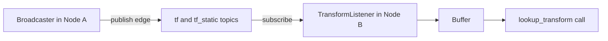
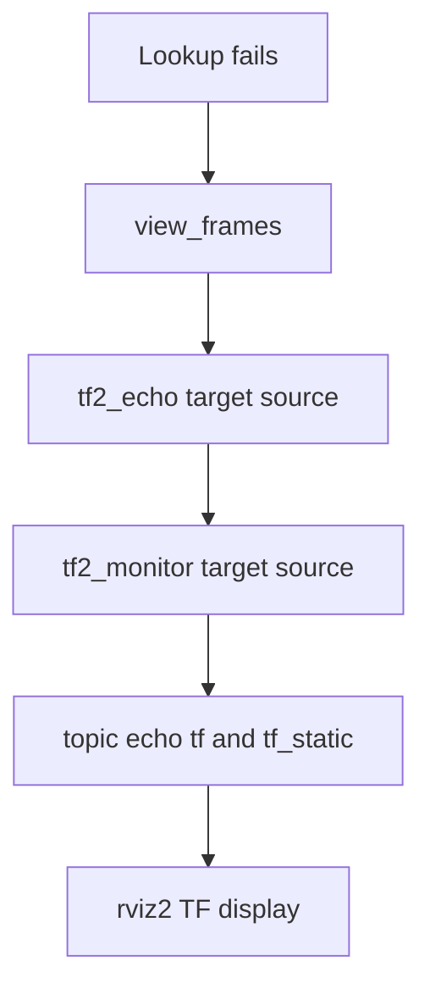

# Lecture 1 — Every Transform Problem Is a Tree Problem

> **Reading time:** ~70 minutes. **Hands-on time:** ~60 minutes (you stand up a broadcaster and a listener, break the tree, and read the exception).

This is the lecture that turns tf2 from magic into machinery. tf2 is the most-used subsystem in ROS2 and the one that produces the most confused Slack threads. The confusion is always the same shape: "my robot thinks the wall is two meters to the left," "my marker shows up at the origin," "my listener throws an exception about extrapolation into the future." Every one of these is a *tree* problem — either the tree is shaped wrong, the data is stamped wrong, or you asked for a time the tree doesn't have. Once you hold the tree model in your head, every tf2 bug becomes a five-minute diagnosis instead of a two-hour guessing game.

We will build the mental model first, then the API, then the failure modes. By the end you can stand up a broadcaster, write a listener, and — most importantly — read an `ExtrapolationException` and know which of three things broke.

## 1.1 — Why a transform library exists at all

A robot is a pile of coordinate frames. The base of the robot has a frame. Each wheel has a frame. The LiDAR has a frame. The camera has a frame. The end of the arm has a frame. The map has a frame. The odometry origin has a frame. A four-link arm alone is five frames (`base`, `shoulder`, `elbow`, `wrist`, plus whatever the gripper adds). A real mobile manipulator has thirty or forty.

Every useful question about the robot is a question *across* frames:

- "Where is the obstacle the LiDAR sees, expressed in the map frame, so the planner can avoid it?"
- "Where is the cup the camera sees, expressed in the arm's base frame, so MoveIt2 can plan a grasp?"
- "What is the robot's pose in the map, given wheel odometry that only knows `odom → base_link`?"

Each of these requires composing several transforms. The LiDAR returns a point in `lidar_link`. To get it into `map` you need `map → odom`, `odom → base_link`, `base_link → lidar_link`. Three transforms, two of which change every tick (the robot moves) and one of which is fixed (the LiDAR is bolted on). Computing this by hand, everywhere you need it, with the right timestamps, is the kind of error-prone bookkeeping that eats robotics teams alive.

tf2 is the bookkeeping, done once, correctly, for everyone. You publish the *edges* of the tree — each node publishes the transform from itself to its parent — and tf2 answers any cross-frame query by walking the tree and composing the edges. That is the entire value proposition. **You never compose transforms by hand again; you publish edges and ask tf2 for paths.**

## 1.2 — The tree, precisely

A tf2 tree is a directed tree of frames. Each frame has exactly **one parent** (except the root, which has none). The edge from a child to its parent carries a `geometry_msgs/TransformStamped`: the transform that takes a point in the *child* frame and expresses it in the *parent* frame, plus a timestamp and the two frame names.

The "exactly one parent" rule is not a suggestion. tf2 enforces it. If two different broadcasters both claim to be the parent of `base_link`, you get a tree with a contested edge, and tf2 will print `TF_OLD_DATA` or `frame already has a parent` warnings and pick one nondeterministically. The single-parent rule is what makes the structure a *tree* (one path between any two nodes) rather than a *graph* (potentially many paths, no canonical answer).

Here is the four-link arm tree we build this week, drawn the way tf2 stores it:

```text
        base
          │  (base → shoulder: static)
       shoulder
          │  (shoulder → elbow: dynamic, the rotating joint)
        elbow
          │  (elbow → wrist: static)
        wrist
```

Each arrow is one `TransformStamped`. Three edges, four nodes. The arrow points from parent to child — that is the direction of the *broadcast*. A broadcaster says "I am `shoulder`, my parent is `base`, here is `base → shoulder`." (More precisely: `header.frame_id = "base"`, `child_frame_id = "shoulder"`, and the transform expresses the shoulder *in* the base.)

### The lookup is a tree walk

When you ask tf2 for the transform from `wrist` to `base` — "give me `T_base_wrist`, the transform that takes a point in the wrist frame and puts it in the base frame" — tf2 does this:

1. Walk up from `wrist` to the root, recording the path: `wrist → elbow → shoulder → base`.
2. Walk up from `base` to the root: `base` is already the root, path is just `base`.
3. Find the common ancestor — here it is `base` itself.
4. Compose the edges along the path: `T_base_wrist = T_base_shoulder @ T_shoulder_elbow @ T_elbow_wrist`. Edges traversed "upward" (child to parent) are used as-is; edges traversed "downward" (parent to child) are inverted.

For a more general lookup where neither frame is the ancestor — say `lidar_link` to `camera_link` on a robot whose tree is `base_link → lidar_link` and `base_link → camera_link` — the common ancestor is `base_link`, and `T_camera_lidar = inv(T_base_camera) @ T_base_lidar`. tf2 walks both branches up to `base_link` and composes through it.

This is *exactly* the SE(3) composition from lecture 2, with the timestamps managed for you. Internally, tf2 stores each transform as a `tf2::Transform` (a rotation quaternion + a translation vector) and composes with quaternion multiplication and vector rotation — the same math, never building a 4×4 unless you ask `tf2_geometry_msgs` to.

## 1.3 — The four moving parts of the tf2 API

Four classes do all the work. Learn what each one *is for* and the API stops being a maze.

| Class | Role | Topic | When you use it |
|-------|------|-------|-----------------|
| `TransformBroadcaster` | Publishes **dynamic** transforms | `/tf` | A joint or link that moves over time |
| `StaticTransformBroadcaster` | Publishes **static** transforms | `/tf_static` (latched) | A bolt-on sensor or fixed joint, published once |
| `Buffer` | Stores a time-windowed history of all transforms | (subscribes) | Held by anyone who needs to look up transforms |
| `TransformListener` | Fills a `Buffer` by subscribing to `/tf` and `/tf_static` | (subscribes) | Created once alongside a `Buffer` in a listener node |

The relationship: **broadcasters publish edges; listeners fill buffers; you query buffers.** A broadcaster and a listener never talk directly — they communicate through the `/tf` and `/tf_static` topics, like any other ROS2 pub/sub. This is why two processes on the same DDS network share a TF tree automatically: the broadcaster in node A publishes to `/tf`, and the `TransformListener` in node B subscribes to `/tf` and fills B's buffer. No special plumbing.


*How a broadcast edge reaches a listener's buffer and answers a query, with no direct node-to-node coupling.*

### A minimal dynamic broadcaster

This node broadcasts a single `base → spinner` transform whose yaw advances every tick, so `spinner` rotates in place. Watch the structure: build a `TransformBroadcaster`, fill a `TransformStamped`, stamp it with `now()`, send it.

```python
#!/usr/bin/env python3
"""Broadcast base -> spinner, a frame that yaws at a constant rate."""
import math

import rclpy
from rclpy.node import Node
from geometry_msgs.msg import TransformStamped
from tf2_ros import TransformBroadcaster
from tf_transformations import quaternion_from_euler


class SpinnerBroadcaster(Node):
    def __init__(self) -> None:
        super().__init__("spinner_broadcaster")
        self.br = TransformBroadcaster(self)
        self.start = self.get_clock().now()
        # 50 Hz: a sensible default for a moving frame in rviz2.
        self.timer = self.create_timer(0.02, self.on_timer)

    def on_timer(self) -> None:
        elapsed = (self.get_clock().now() - self.start).nanoseconds * 1e-9
        yaw = 0.5 * elapsed  # 0.5 rad/s

        t = TransformStamped()
        # CRITICAL: stamp with the current time, or the listener can't use it.
        t.header.stamp = self.get_clock().now().to_msg()
        t.header.frame_id = "base"          # parent
        t.child_frame_id = "spinner"        # child
        t.transform.translation.x = 0.5
        t.transform.translation.y = 0.0
        t.transform.translation.z = 0.0
        qx, qy, qz, qw = quaternion_from_euler(0.0, 0.0, yaw)
        t.transform.rotation.x = qx
        t.transform.rotation.y = qy
        t.transform.rotation.z = qz
        t.transform.rotation.w = qw

        self.br.sendTransform(t)


def main() -> None:
    rclpy.init()
    node = SpinnerBroadcaster()
    try:
        rclpy.spin(node)
    except KeyboardInterrupt:
        pass
    finally:
        node.destroy_node()
        rclpy.shutdown()


if __name__ == "__main__":
    main()
```

Two lines in here are where 90% of beginner tf2 bugs live, and we will keep coming back to them:

- `t.header.stamp = self.get_clock().now().to_msg()` — the transform is **valid as of this instant**. If you forget this and leave the stamp at zero, the listener's buffer thinks the transform is from time 0 (the epoch), and every lookup at "now" will throw `ExtrapolationException` because "now" is hours past the only data point.
- `t.header.frame_id` is the **parent**; `t.child_frame_id` is the **child**. Swap them and your tree is upside down. The transform itself describes the child's pose *in* the parent.

### A minimal static broadcaster

A static transform is published **once** and **latched**. The `StaticTransformBroadcaster` uses `TRANSIENT_LOCAL` QoS on `/tf_static`, which means a subscriber that connects *after* the message was sent still receives the last value. That is the whole point: a sensor bolted to the chassis does not move, so re-publishing its transform 50 times a second is wasteful. Publish it once at startup; latch it forever.

```python
#!/usr/bin/env python3
"""Broadcast base -> imu_link once, latched, on /tf_static."""
import rclpy
from rclpy.node import Node
from geometry_msgs.msg import TransformStamped
from tf2_ros import StaticTransformBroadcaster


class ImuStaticBroadcaster(Node):
    def __init__(self) -> None:
        super().__init__("imu_static_broadcaster")
        self.static_br = StaticTransformBroadcaster(self)

        t = TransformStamped()
        t.header.stamp = self.get_clock().now().to_msg()
        t.header.frame_id = "base"
        t.child_frame_id = "imu_link"
        t.transform.translation.x = 0.10
        t.transform.translation.y = 0.0
        t.transform.translation.z = 0.05
        t.transform.rotation.w = 1.0  # identity rotation (x=y=z=0 default)

        # Sent exactly once. Latched. No timer.
        self.static_br.sendTransform(t)
        self.get_logger().info("Published static base -> imu_link")


def main() -> None:
    rclpy.init()
    node = ImuStaticBroadcaster()
    try:
        rclpy.spin(node)
    except KeyboardInterrupt:
        pass
    finally:
        node.destroy_node()
        rclpy.shutdown()


if __name__ == "__main__":
    main()
```

Note there is **no timer**. The static broadcaster sends once in `__init__` and then the node just spins to stay alive (so the latched publisher keeps serving late subscribers). If you find yourself publishing a static transform on a timer, you have made it dynamic for no reason, and you are putting 50 messages a second of identical data onto the bus.

### The `static_transform_publisher` CLI

For a fixed transform you don't even need to write a node. ROS2 ships a tool:

```bash
# args: x y z yaw pitch roll parent child   (Jazzy: named --frame-id / --child-frame-id also work)
ros2 run tf2_ros static_transform_publisher \
  --x 0.10 --y 0 --z 0.05 \
  --yaw 0 --pitch 0 --roll 0 \
  --frame-id base --child-frame-id imu_link
```

This is exactly the static broadcaster above, as a one-liner. In a launch file it becomes a `Node` with these as arguments — which is what exercise 1 does for all three static joints of the arm. The CLI takes Euler `yaw pitch roll` (ZYX) and converts to a quaternion for you; remember from week 1 that this is the convenient-but-dangerous input form, fine for a fixed bolt-on, dangerous for anything that interpolates near gimbal lock.

## 1.4 — The listener and the buffer

The other half of tf2 is querying. You hold a `Buffer`, you attach a `TransformListener` to fill it, and you call `lookup_transform`.

```python
#!/usr/bin/env python3
"""Look up wrist in the base frame at 10 Hz and log it."""
import rclpy
from rclpy.node import Node
from rclpy.time import Time
from tf2_ros import Buffer, TransformListener
from tf2_ros import LookupException, ConnectivityException, ExtrapolationException


class WristListener(Node):
    def __init__(self) -> None:
        super().__init__("wrist_listener")
        self.buffer = Buffer()
        # The listener subscribes to /tf and /tf_static and fills self.buffer.
        self.listener = TransformListener(self.buffer, self)
        self.timer = self.create_timer(0.1, self.on_timer)

    def on_timer(self) -> None:
        try:
            tf = self.buffer.lookup_transform(
                target_frame="base",    # I want the answer expressed in base
                source_frame="wrist",   # of a point defined in wrist
                time=Time(),            # Time() == Time(seconds=0) == "latest available"
            )
        except (LookupException, ConnectivityException, ExtrapolationException) as exc:
            self.get_logger().warn(f"tf lookup base<-wrist failed: {exc!r}")
            return

        tr = tf.transform.translation
        self.get_logger().info(
            f"wrist in base = ({tr.x:+.3f}, {tr.y:+.3f}, {tr.z:+.3f})"
        )
```

There are three subtleties here that you must internalize, because they are the source of essentially every tf2 lookup bug.

### Subtlety 1 — the argument order is `(target, source)` and it reads backwards

`lookup_transform(target_frame, source_frame, time)` returns the transform that takes a point expressed in `source_frame` and re-expresses it in `target_frame`. People read "target, source" and assume the result is "from target to source." It is the opposite. The returned `TransformStamped` is `T_target_source`: apply it to a point in the source frame to get its coordinates in the target frame.

The mnemonic from lecture 2 saves you: the *index closest to the point* must match the point's frame. `T_target_source @ p_source = p_target`. The `source` index cancels against the point's frame; the `target` index is what's left. If you call `lookup_transform("base", "wrist", ...)` you get `T_base_wrist`, and `T_base_wrist @ p_wrist = p_base`. That is almost always what you want: "I have something in the wrist frame, put it in the base frame."

### Subtlety 2 — `Time()` means "latest available," not "now"

`rclpy.time.Time()` constructs a zero time. Passing it to `lookup_transform` is a special sentinel that means **"give me the most recent transform you have for which all edges in the path have data,"** not "give me the transform at time zero." This is the safe default for "I just want the current pose and I don't care about exact time alignment." It will not throw `ExtrapolationException` for being slightly behind, because it asks for what's actually in the buffer.

If you instead pass `self.get_clock().now()` — the literal current time — you are asking for the transform at *this exact instant*, and if the broadcaster's most recent message is even a few milliseconds old, you can get an `ExtrapolationException` ("requested time is in the future relative to the buffer"). Time-precise lookups are a real need (we cover them in §1.6) but they require the broadcaster and listener to agree on a clock and they require a buffer timeout. For "where is the wrist right now, roughly," use `Time()`.

### Subtlety 3 — the buffer needs time to fill

A `TransformListener` created in `__init__` has not received any transforms by the time `__init__` returns. The first few `lookup_transform` calls will fail with `LookupException` ("frame wrist does not exist") simply because the subscription hasn't delivered anything yet. This is *normal* during the first ~100 ms of startup. Your listener must tolerate it — which is why the example above catches the exception and warns instead of crashing. A common, correct pattern is to look up with a small timeout, which blocks until data arrives or the timeout elapses:

```python
from rclpy.duration import Duration

tf = self.buffer.lookup_transform(
    "base", "wrist", Time(),
    timeout=Duration(seconds=0.1),  # wait up to 100 ms for the tree to be ready
)
```

The timeout matters: with no timeout, the lookup is instantaneous and fails immediately if the data isn't there yet. With a timeout, tf2 spins internally waiting for the transform to arrive, up to the limit. **You almost always want a small timeout on a lookup that runs at startup.** We will see in the challenge how a timeout is half the fix for an extrapolation bug.

## 1.5 — Static vs. dynamic: the decision, made once

The static/dynamic distinction is not academic. Choosing wrong wastes bandwidth or produces stale data. The rule:

- **Static** if the transform never changes for the lifetime of the run. A sensor bolted to the chassis. The fixed offset from `base_link` to a non-actuated mount. The `base_link → base_footprint` projection. These go on `/tf_static`, published once, latched.
- **Dynamic** if the transform changes over time. Any actuated joint. The `odom → base_link` edge (the robot moves). The `map → odom` correction from localization. These go on `/tf`, re-published every time they change, typically 10–100 Hz.

Three consequences of getting this wrong:

1. **Publishing a static transform dynamically** (on a timer at 50 Hz) floods `/tf` with redundant data. On a real robot with thirty static joints that is 1,500 messages a second of unchanging numbers, crowding out the dynamic transforms that actually matter. It also breaks the "latched" guarantee: a node that starts late misses the messages between its startup and the next timer tick.
2. **Publishing a dynamic transform statically** (once, latched) freezes the frame at its initial value. The arm joint never moves in the tree even though the motor is turning. Everything downstream computes against a stale pose. This is an *insidious* bug because nothing throws — the lookups all succeed, they just return the wrong (frozen) answer.
3. **`/tf_static` QoS is `TRANSIENT_LOCAL`.** If you try to publish a static transform on a plain publisher with default (`VOLATILE`) QoS, late subscribers miss it. Always use the `StaticTransformBroadcaster`, which sets the QoS correctly. We cover QoS in depth in week 5; for now, trust the broadcaster classes to get it right.

A subtlety that bites people: `/tf_static` accumulates. Each `sendTransform` on a `StaticTransformBroadcaster` *adds to* the latched set; it does not replace it. So you can call it multiple times to add several static edges, and they all persist. But you cannot "update" a static transform by sending a new value — tf2 will warn about a redefinition. If a transform needs updating, it was never static.

## 1.6 — Time-travel: the feature that makes tf2 special

Here is the capability that distinguishes tf2 from a dumb dictionary of transforms: it stores a **time-windowed history** of every transform and **interpolates** between samples. This is why `lookup_transform` takes a `time` argument at all.

Consider the canonical problem. A camera shutter fires at time `t_shutter`. The image takes 30 ms to process. By the time your detector outputs "there is a cup at pixel (320, 240)," it is `t_shutter + 0.030`. You back-project the pixel to a 3D point in the `camera_link` frame. Now you want that point in the `map` frame so the planner can use it. But the robot *moved* during those 30 ms. If you use the *current* `map → camera_link`, you place the cup where the camera is *now*, not where it was when the shutter fired. The cup ends up 30 ms of robot-motion away from where it actually is.

The fix is to look up the transform **at `t_shutter`**, not now:

```python
from rclpy.duration import Duration

# Where was camera_link, in the map frame, at the instant the shutter fired?
tf = self.buffer.lookup_transform(
    target_frame="map",
    source_frame="camera_link",
    time=image_msg.header.stamp,           # the shutter time, carried on the image
    timeout=Duration(seconds=0.05),        # wait a beat for the buffer to have it
)
```

Because the buffer holds the history, tf2 finds the two `map → camera_link` samples bracketing `t_shutter` and **linearly interpolates** the translation and **slerps** the rotation between them. You get the transform as it was *at the shutter instant*, even though that instant is now in the past. This is the single most important reason every message in ROS2 carries a `header.stamp`: so that downstream consumers can ask tf2 "where was everything when this datum was true."

### `lookup_transform_full`: two times and a fixed frame

There is an even more powerful form. Sometimes you want to relate two frames *at two different times* through a frame you trust to be fixed. "Where is the gripper *now*, relative to where the target was *when I detected it*, in the `map` frame?" That is:

```python
tf = self.buffer.lookup_transform_full(
    target_frame="gripper",
    target_time=self.get_clock().now(),        # gripper, now
    source_frame="target_marker",
    source_time=detection_msg.header.stamp,    # target, at detection time
    fixed_frame="map",                          # the frame both are measured against
    timeout=Duration(seconds=0.1),
)
```

tf2 computes `T_map_target` at the detection time, `T_map_gripper` at now, and composes `T_gripper_target = inv(T_map_gripper_now) @ T_map_target_then`. This is the "advanced API" in the tutorials, and it is exactly what visual-servoing and pick-and-place pipelines use. You will not need it this week, but you must know it exists — when somebody asks "how do I relate two things at two times," this is the answer, and reaching for it is a senior move.

### The buffer cache duration

The buffer does not store history forever; that would be an unbounded memory leak. The default cache is **10 seconds**. A lookup for a time older than 10 seconds ago throws `ExtrapolationException` ("requested time is older than the cache"). You can enlarge the cache when constructing the buffer:

```python
from rclpy.duration import Duration
self.buffer = Buffer(cache_time=Duration(seconds=30.0))
```

Enlarge it when your processing latency might exceed 10 seconds (rare) or when you replay bags and need a deeper window. Most robots are fine with the default. The point is to know the knob exists and what throwing past it looks like.

## 1.7 — The three exceptions, and how to tell them apart

When a lookup fails it throws exactly one of three exceptions. Knowing which is which collapses a debugging session from an hour to a minute. Memorize this table; it is the single most useful thing in the lecture.

| Exception | Meaning | Most common cause | First thing to check |
|-----------|---------|-------------------|----------------------|
| `LookupException` | A named frame is not in the buffer at all | Typo in a frame name; broadcaster not running; buffer not filled yet at startup | `ros2 run tf2_tools view_frames` — is the frame there? |
| `ConnectivityException` | Both frames exist but there is no path between them | Two disjoint trees; a missing edge in the middle | `view_frames` — is it one tree or two? |
| `ExtrapolationException` | The requested time is outside the buffered window for some edge | Unstamped or stale transforms; asking for `now()` against a slow broadcaster; time older than the cache | `ros2 run tf2_ros tf2_monitor` — what's the delay on each edge? |

### `LookupException` — "I've never heard of that frame"

```text
[WARN] tf lookup base<-wrist failed: LookupException('"wrist" passed to lookupTransform argument source_frame does not exist.')
```

The frame `wrist` is not in the buffer. Either:

- **Typo.** You wrote `"wrst"` or `"Wrist"` (frame names are case-sensitive). 40% of these.
- **No broadcaster.** Nothing is publishing the `elbow → wrist` edge. Check `ros2 topic echo /tf` and `ros2 topic echo /tf_static` — is the edge there?
- **Startup race.** The listener's buffer hasn't received the first message yet. Normal for the first ~100 ms. Tolerate it with a timeout and a try/except; don't crash.

### `ConnectivityException` — "those are two different trees"

```text
[WARN] tf lookup base<-wrist failed: ConnectivityException('Could not find a connection between "base" and "wrist" because they are not part of the same tree.')
```

Both `base` and `wrist` exist, but tf2 cannot find a path. This happens when a middle edge is missing — say the `shoulder → elbow` broadcaster died, splitting the tree into `{base, shoulder}` and `{elbow, wrist}`. Run `view_frames` and you will literally see two separate boxes. Find the missing edge; start its broadcaster.

### `ExtrapolationException` — "I don't have data for that time"

This is the one. Three flavors, with distinct messages:

```text
# Flavor A: asking for a time in the future relative to the newest data.
ExtrapolationException('Lookup would require extrapolation into the future.
  Requested time 1718900000.500 but the latest data is at time 1718900000.100')

# Flavor B: asking for a time older than the oldest data (past the cache).
ExtrapolationException('Lookup would require extrapolation into the past.
  Requested time 1718899990.000 but the earliest data is at time 1718900000.000')

# Flavor C: an edge has exactly one sample, so no interpolation is possible
# for any time other than that exact sample.
ExtrapolationException('Lookup would require extrapolation into the future ...')
```

Flavor A — "into the future" — is overwhelmingly the most common, and it almost always means one of:

1. **You looked up `now()` against a broadcaster that's a little behind.** The broadcaster's clock and your clock disagree, or its last message is 50 ms old, and "now" is past it. **Fix:** look up `Time()` (latest available) instead, or add a `timeout` so tf2 waits for fresh data.
2. **The transform is unstamped (stamp = 0).** The buffer thinks the only data is from the epoch (1970), and "now" is 56 years in the future relative to that. **Fix:** stamp every `TransformStamped` with `now()`. This is the bug we deliberately reproduce in the challenge.
3. **Two clocks.** A bag replays with `use_sim_time` but your listener uses the wall clock, so the stamps are hours apart. **Fix:** set `use_sim_time` consistently and play the bag with `--clock`.

The diagnostic habit: when you see `ExtrapolationException`, immediately run `ros2 run tf2_ros tf2_monitor base wrist`. It prints the average delay and the most-recent-transform age per edge. An edge with a delay of "55 years" is unstamped. An edge with a delay of "2.3 s" has a slow or stalled broadcaster. The number tells you which edge and which flavor.

## 1.8 — The debugging toolkit, in order of use

When a lookup fails, run these in this order. Ninety percent of tf2 bugs are diagnosed before you reach step 4.

1. **`ros2 run tf2_tools view_frames`** — generates `frames.pdf` showing the live forest. Is it one tree? Are all four frames present? Does each edge show a recent "most recent transform" timestamp and a sane rate? This single command answers `LookupException` and `ConnectivityException` immediately.

   ```bash
   ros2 run tf2_tools view_frames
   # writes frames.pdf and frames.gv in the current directory; open frames.pdf
   ```

2. **`ros2 run tf2_ros tf2_echo <target> <source>`** — prints the live transform, once a second. If this succeeds but your node fails, your node's frame names or timing are wrong, not the tree.

   ```bash
   ros2 run tf2_ros tf2_echo base wrist
   ```

3. **`ros2 run tf2_ros tf2_monitor <target> <source>`** — the rate-and-delay report. Catches stale and slow broadcasters; the go-to for `ExtrapolationException`.

4. **`ros2 topic echo /tf` and `/tf_static`** — the raw messages. Check `header.stamp` (is it zero?), `frame_id`/`child_frame_id` (swapped?), and that the edges you expect are actually being published.

5. **rviz2 TF display** — turn it on, set the fixed frame to your root (`base`), and look. Frames that show up at the origin with no orientation are usually unstamped or identity-by-accident. A frame that's missing entirely never got broadcast.


*The debugging pipeline to run, in order, when a tf2 lookup throws.*

The reflex to build: **`view_frames` first, always.** It is the `git status` of tf2. You look at the tree before you theorize about the bug.

## 1.9 — The reflexes to internalize this week

- **Every `TransformStamped` is stamped with `now()` (or the relevant data time).** A zero stamp is a guaranteed `ExtrapolationException` waiting to fire.
- **`frame_id` is the parent; `child_frame_id` is the child.** The transform describes the child *in* the parent. Swap them and the tree inverts.
- **`lookup_transform(target, source)` returns `T_target_source`.** The result puts a point from `source` into `target`. Read it backwards from how it sounds.
- **Use `Time()` for "latest available"; use a real stamp for time-precise lookups, with a `timeout`.** Never look up `now()` without a timeout against a remote broadcaster.
- **Static for fixed; dynamic for moving. Never publish a static transform on a timer.**
- **One parent per frame.** Two broadcasters fighting over a child's parent is a tree-corruption bug.
- **`view_frames` first.** Before you theorize, render the tree.
- **Catch the three exceptions and log which one fired.** Half the diagnosis is naming the failure correctly.

These reflexes are the entire methodology of senior tf2 work. The math in lecture 2 tells you *what* tf2 is composing under the hood; this lecture tells you how to make it do that correctly and how to read it when it doesn't.

## 1.10 — What we did not cover (later weeks pick it up)

This lecture is the tf2 *runtime*. We hand-publish edges with broadcasters. In week 3, `robot_state_publisher` will read a URDF and publish all the static and joint-driven edges for you — but it is publishing exactly the `TransformStamped` messages you wrote by hand here, so the mental model transfers one-to-one. In week 6, you will publish the `odom → base_link` dynamic edge from wheel odometry. In week 7, `slam_toolbox` publishes the `map → odom` correction. By the end of phase 1 your tree has a dozen edges from four different sources, and the only reason it stays legible is the model you build this week: it is one tree, every edge is a stamped `TransformStamped`, and every lookup is a tree walk.

---

## Lecture 1 — checklist before moving on

- [ ] I can draw the four-link arm tree and label which edges are static and which is dynamic.
- [ ] I can name the four tf2 API classes (`TransformBroadcaster`, `StaticTransformBroadcaster`, `Buffer`, `TransformListener`) and what each is for.
- [ ] I can explain why `lookup_transform("base", "wrist")` returns `T_base_wrist` and not the other way.
- [ ] I can explain the difference between `Time()` and `self.get_clock().now()` as the lookup time.
- [ ] I can name the three tf2 exceptions and the first diagnostic command I run for each.
- [ ] I can explain why a static transform is published once and latched, and what breaks if I publish it on a timer.
- [ ] I have actually run a broadcaster + a listener on my machine and watched a lookup succeed in the log.

If any box is unchecked, return to that section. Lecture 2 assumes you understand that tf2 composes SE(3) elements; this lecture is where that became concrete.

---

**References cited in this lecture**

- ROS2 docs — "About tf2": <https://docs.ros.org/en/jazzy/Concepts/Intermediate/About-Tf2.html>
- ROS2 docs — tf2 tutorials (Jazzy): <https://docs.ros.org/en/jazzy/Tutorials/Intermediate/Tf2/Tf2-Main.html>
- ROS2 docs — "Debugging tf2 problems": <https://docs.ros.org/en/jazzy/Tutorials/Intermediate/Tf2/Debugging-Tf2-Problems.html>
- Foote — "tf: The transform library" (TePRA 2013): <https://ieeexplore.ieee.org/document/6556373>
- `ros2/geometry2` — `BufferCore::lookupTransform` source: <https://github.com/ros2/geometry2/blob/rolling/tf2/src/buffer_core.cpp>
- REP 105 — "Coordinate Frames for Mobile Platforms": <https://www.ros.org/reps/rep-0105.html>
