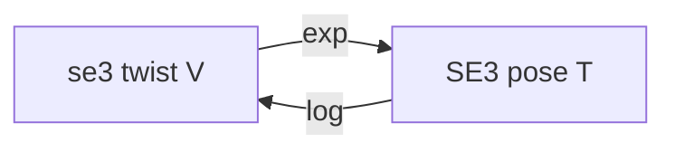
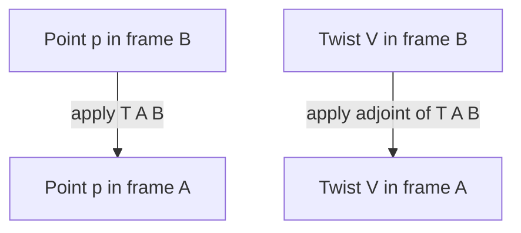

# Lecture 2 — SE(3), Twists, and Adjoints: Rigid-Body Motion as Exponential Coordinates

> **Duration:** ~2 hours of reading + hands-on with a Python REPL and NumPy open.
> **Outcome:** You can build a 4×4 homogeneous transform by hand, compose and invert SE(3) elements without a generic matrix inverse, write a twist in the ROS `[v, ω]` ordering, exponentiate a twist into a transform with the closed-form SE(3) exponential, and use the adjoint to move a twist between frames. You can explain, without hand-waving, why a point transforms with `T` but a velocity transforms with `Ad_T`.

If you remember one sentence from this lecture, make it this:

> **SE(3) is what tf2 is doing under the hood.** Every edge in the tree is an element of SE(3). Every lookup composes them. The exponential map is how a constant velocity becomes a pose, and the adjoint is how a velocity in one frame becomes the same velocity expressed in another. Hold those three ideas and the rest of the year — Jacobians, MoveIt2 velocity IK, factor-graph SLAM — is bookkeeping on top of them.

Last week you proved that a rotation is a group element, not a bag of numbers. This week we add translation. A rotation alone cannot describe a robot arm: the elbow is not just *oriented* relative to the shoulder, it is *displaced* from it. The mathematics that handles rotation and translation together — as a single group, with a single composition rule — is **SE(3)**, the special Euclidean group. Keep a Python REPL open; every formula in this lecture is three lines of NumPy and you should check each one as you read.

---

## 1. Homogeneous coordinates: the trick that makes it linear

Start with the thing you already know how to do: take a point `p` in frame B, and you want it in frame A. Frame B is rotated by `R` and translated by `t` relative to A. The honest formula is affine:

```
p_A = R @ p_B + t
```

That is correct, and it is annoying. Composition of two such steps is `R1 @ (R2 @ p + t2) + t1 = R1 @ R2 @ p + R1 @ t2 + t1` — the rotations multiply but the translations get tangled with a rotation. You cannot write the whole operation as a single matrix multiply, which means you cannot chain N of them by multiplying N matrices. tf2 walks trees of depth ten; we need chaining to be one operation.

The fix is a coordinate trick that is older than robotics: **homogeneous coordinates.** Append a `1` to every point:

```
p̃ = [px, py, pz, 1]ᵀ      (a 4-vector)
```

and pack `R` and `t` into a single 4×4 matrix:

```
T = [ R  t ]      a 4×4 matrix, R is 3×3, t is 3×1,
    [ 0  1 ]      the bottom row is [0 0 0 1]
```

Now the affine map *is* a matrix multiply:

```
T @ p̃ = [ R  t ] [ p ]   =  [ R@p + t ]
        [ 0  1 ] [ 1 ]      [    1    ]
```

The top three rows give exactly `R @ p + t`; the bottom row keeps the `1` so the result is again a homogeneous point. Affine became linear by lifting into one higher dimension. That is the entire reason for the 4×4 form, and it is the reason the bottom row is `[0 0 0 1]`: it is what makes the last coordinate pass through unchanged.

```python
import numpy as np

def make_T(R, t):
    """Pack a 3x3 rotation and a 3-vector translation into a 4x4 SE(3) element."""
    T = np.eye(4)
    T[:3, :3] = R
    T[:3, 3] = t
    return T

R = np.array([[0.0, -1.0, 0.0],
              [1.0,  0.0, 0.0],
              [0.0,  0.0, 1.0]])   # +90 deg about z
t = np.array([2.0, 0.0, 0.0])
T = make_T(R, t)

p_B = np.array([1.0, 0.0, 0.0, 1.0])   # a point in frame B, homogeneous
p_A = T @ p_B
print(p_A[:3])   # [2. 1. 0.]  -> rotated 90 deg, then shifted +2 in x
```

### What appending a 0 means instead

Append a `1` to a **point** and `T` translates it. Append a `0` to a **direction** (a free vector — a velocity, a surface normal, an axis) and `T` rotates it but does *not* translate it:

```
T @ [d, 0]ᵀ = [ R@d + t·0 ]  =  [ R@d ]
              [    0      ]     [  0  ]
```

This is not a curiosity; it is a correctness rule. A position gets translated; a direction does not. If you back-project a LiDAR ray direction and accidentally translate it, your obstacle is in the wrong place. The homogeneous `1`-vs-`0` is how you tell the math which kind of thing you have. **Points get a 1, directions get a 0.**

---

## 2. SE(3): the group of rigid-body motions

The set of all 4×4 matrices of the form `[[R, t], [0, 1]]` with `R ∈ SO(3)` and `t ∈ ℝ³` is the **special Euclidean group SE(3)**. As with SO(3) last week, "group" is not decoration. Each axiom means something operational:

| Group axiom | In SE(3) | What it buys you |
|-------------|----------|------------------|
| **Closure** | `T₁ T₂ ∈ SE(3)` | Compose two rigid motions, you get a rigid motion. The tree walk never produces "almost a transform." |
| **Associativity** | `(T₁ T₂) T₃ = T₁ (T₂ T₃)` | You can group a chain of edges any way you like. tf2's tree composition relies on this. |
| **Identity** | `I₄ ∈ SE(3)` | "Stay put" is a rigid motion: `R = I`, `t = 0`. |
| **Inverse** | `T⁻¹ ∈ SE(3)` | Every motion has an exact undo. The formula is *not* a generic 4×4 inverse — see §4. |

And as with SO(3), **SE(3) is not commutative.** `T₁ T₂ ≠ T₂ T₁`. "Drive forward then turn" is a different pose than "turn then drive forward." Every mobile-robot trajectory error you will ever debug is downstream of this fact.

SE(3) is a six-dimensional object: three numbers for rotation, three for translation. Like SO(3) it is a curved manifold, not a flat vector space — you cannot add two transforms and get a meaningful transform. (`T₁ + T₂` has a bottom row of `[0 0 0 2]`; it is not in SE(3) at all.) You *compose* with matrix multiply; you never add. The moment you find yourself averaging two poses by adding their matrices, stop: that is the manifold biting you, and §6 (the log map) is the correct tool.

```python
def is_SE3(T, tol=1e-9):
    R = T[:3, :3]
    return (np.allclose(R.T @ R, np.eye(3), atol=tol)
            and np.isclose(np.linalg.det(R), 1.0, atol=tol)
            and np.allclose(T[3, :], [0, 0, 0, 1], atol=tol))

print(is_SE3(T))                 # True
print(is_SE3(T + T))             # False: bottom row is [0 0 0 2]
```

---

## 3. Frame naming: the convention that makes composition trivial

This single convention will save you more debugging hours than any formula in the lecture. Name every transform `T_target_source`, read as "the transform that re-expresses a point from the **source** frame into the **target** frame":

```
T_A_B  @  p_B  =  p_A
```

The mnemonic: **the index nearest the point must match the point's frame.** `T_A_B @ p_B` — the `B` on the transform is adjacent to `p_B`, they "cancel," and you are left with `A`. If the indices do not touch correctly, you have the wrong transform or you need its inverse.

Composition then becomes "cancel the middle index":

```
T_A_C  =  T_A_B  @  T_B_C
              └────┘  the inner B's cancel; outer A and C remain
```

This is exactly the tree walk from Lecture 1. The path `wrist → elbow → shoulder → base` composes as:

```
T_base_wrist = T_base_shoulder @ T_shoulder_elbow @ T_elbow_wrist
```

Read the indices left to right: `base_shoulder`, `shoulder_elbow`, `elbow_wrist` — each inner pair cancels, leaving `base_wrist`. If you keep your variable names in `T_target_source` form, the code reads like the math and the bugs become visible. Sloppy names like `T1`, `T2`, `arm_tf` are where sign errors hide.

```python
def rotz(a):
    c, s = np.cos(a), np.sin(a)
    return np.array([[c, -s, 0], [s, c, 0], [0, 0, 1.0]])

T_base_shoulder  = make_T(np.eye(3),        np.array([0.0, 0.0, 0.10]))
T_shoulder_elbow = make_T(rotz(np.pi / 2),  np.array([0.30, 0.0, 0.0]))
T_elbow_wrist    = make_T(np.eye(3),        np.array([0.25, 0.0, 0.0]))

T_base_wrist = T_base_shoulder @ T_shoulder_elbow @ T_elbow_wrist
print(np.round(T_base_wrist[:3, 3], 4))   # the wrist origin, in base coordinates
```

That `T_base_wrist` is precisely what `buffer.lookup_transform("base", "wrist", ...)` returns at runtime. The code you just wrote *is* the tree walk; tf2 only adds timestamps and interpolation.

---

## 4. Inverting a transform the cheap way

You will invert transforms constantly — every "downward" edge in a tree walk is an inverse. The naive move is `np.linalg.inv(T)`. **Do not do this.** A generic 4×4 inverse is ~64 floating-point operations of Gaussian elimination, it accumulates numerical error, and it does not know that `T` is special. SE(3) has a closed-form inverse that is exact and cheap.

If `T = [[R, t], [0, 1]]`, then because `R⁻¹ = Rᵀ` (rotations are orthogonal, from last week):

```
T⁻¹ = [ Rᵀ   -Rᵀ t ]
      [ 0      1    ]
```

Derive it in one line: you want the `T⁻¹` such that `T⁻¹ T = I`. The rotation block must be `Rᵀ` to undo `R`. The translation must undo `t` *after* un-rotating, which is `-Rᵀ t`. Verify:

```
[ Rᵀ  -Rᵀt ] [ R  t ]  =  [ RᵀR   Rᵀt - Rᵀt ]  =  [ I  0 ]   ✓
[ 0     1  ] [ 0  1 ]     [ 0          1     ]     [ 0  1 ]
```

```python
def inv_T(T):
    """Closed-form SE(3) inverse: transpose R, re-express -t. Never use linalg.inv."""
    R = T[:3, :3]
    t = T[:3, 3]
    Ti = np.eye(4)
    Ti[:3, :3] = R.T
    Ti[:3, 3] = -R.T @ t
    return Ti

print(np.allclose(inv_T(T) @ T, np.eye(4)))          # True
print(np.allclose(inv_T(T), np.linalg.inv(T)))       # True, but inv_T is exact + cheap
```

The cheap inverse is `T_source_target = inv_T(T_target_source)`. Internally tf2 stores transforms as a quaternion plus a vector and inverts by conjugating the quaternion and rotating the negated vector — the same idea, never forming a 4×4. When you read `BufferCore::lookupTransform` in `geometry2`, this is what the "inverse" branch of the tree walk is doing.

---

## 5. The Lie algebra se(3): twists

So far everything is *static* poses. Now velocity. A robot link does not teleport from one pose to the next; it moves through a continuous family of poses, and at each instant it has an instantaneous rigid-body velocity. That velocity is a **twist**.

A twist bundles a linear velocity `v ∈ ℝ³` and an angular velocity `ω ∈ ℝ³` into a 6-vector. **Here is the convention fight, and we settle it now.** *Modern Robotics* (Lynch & Park) and the screw-theory literature write a twist angular-first: `[ω, v]`. ROS, `geometry_msgs/Twist`, and essentially all ROS code write it linear-first: `[v, ω]`. **We use the ROS ordering `[v, ω]` in code**, because that is what you will debug all year, and we flag the swap whenever we cite *Modern Robotics* so you can cross-reference the textbook without inverting a sign by accident.

```
twist (ROS order):   𝒱 = [ vx, vy, vz, ωx, ωy, ωz ]ᵀ ∈ ℝ⁶
                          └── linear ──┘ └─ angular ─┘
```

The twist is an element of **se(3)**, the **Lie algebra** of SE(3) — concretely, the tangent space at the identity. "Tangent space" means: SE(3) is a curved 6D manifold; stand at the identity element and the flat 6D space of velocities you could move off in is se(3). Twists live in that flat space, which is why — unlike transforms — **you *can* add and scale twists.** Twice the twist is twice the velocity. This is the whole reason velocity is easier than pose: velocities are vectors, poses are not.

### The wedge `^` (hat) and vee `∨` operators

To connect a twist to the 4×4 world, we map the 6-vector into a 4×4 matrix. The angular part becomes a skew-symmetric matrix (the cross-product matrix from last week), and the linear part sits in the translation column. In the ROS ordering `[v, ω]`:

```
       [  0   -ωz   ωy  vx ]
𝒱^  =  [  ωz   0   -ωx  vy ]      a 4x4 matrix in se(3)
       [ -ωy   ωx   0   vz ]
       [  0    0    0   0  ]
```

The top-left 3×3 block is `[ω]×`, the skew matrix of `ω`. The top-right column is `v`. The bottom row is all zeros (contrast SE(3), whose bottom row is `[0 0 0 1]`). The `^` operator ("wedge" or "hat") turns the 6-vector into this matrix; `∨` ("vee") extracts the 6-vector back out.

```python
def skew(w):
    """Cross-product matrix: skew(w) @ x == np.cross(w, x)."""
    wx, wy, wz = w
    return np.array([[0.0, -wz,  wy],
                     [ wz, 0.0, -wx],
                     [-wy,  wx, 0.0]])

def wedge(twist):
    """ROS-order twist [v, w] (6-vector) -> 4x4 se(3) matrix."""
    v = twist[:3]
    w = twist[3:]
    X = np.zeros((4, 4))
    X[:3, :3] = skew(w)
    X[:3, 3] = v
    return X

def vee(X):
    """Inverse of wedge: 4x4 se(3) matrix -> ROS-order twist [v, w]."""
    w = np.array([X[2, 1], X[0, 2], X[1, 0]])
    v = X[:3, 3]
    return np.concatenate([v, w])

tw = np.array([0.2, 0.0, 0.0, 0.0, 0.0, 0.5])   # +x linear, +z angular
print(np.allclose(vee(wedge(tw)), tw))           # True
```

---

## 6. The exponential map: from velocity to pose

Here is the bridge. If a body holds a constant body-twist `𝒱` for time `t`, what pose does it reach? The answer is the **matrix exponential** of the twist matrix:

```
T(t) = exp(𝒱^ · t)          where exp is the matrix exponential
```

This is the SE(3) generalization of `e^(at)` from a scalar ODE. The differential equation `Ṫ = 𝒱^ T` (the pose changes at a rate given by the twist) has solution `T(t) = exp(𝒱^ t) T(0)`, exactly as `ẋ = a x` solves to `x(t) = e^(at) x(0)`. The exponential map is `exp: se(3) → SE(3)`, and it is **surjective** — every rigid motion is the exponential of some twist (this is the screw-motion theorem: any rigid displacement is a rotation about some axis combined with a translation along it).


*The exponential map turns a constant twist into a pose; the logarithm map inverts it back to a twist.*

You could call `scipy.linalg.expm(wedge(tw))` and be done. But the closed form is cheap, exact, and worth knowing because it shows you the structure. Split into the angular and linear parts. Let `θ = ‖ω‖`.

If `θ = 0` (pure translation, no rotation), the transform is trivially `R = I`, `t = v`:

```
exp = [ I   v ]      (when ω = 0)
      [ 0   1 ]
```

If `θ ≠ 0`, the rotation block is **Rodrigues' formula** from last week (with the unit axis `ω̂ = ω/θ` and angle `θ`), and the translation block is `V @ v` where `V` is an extra 3×3 matrix:

```
R = I + sin(θ)[ω̂]× + (1 − cos θ)[ω̂]ײ              (Rodrigues, same as week 1)

V = I + (1 − cos θ)/θ · [ω̂]× + (θ − sin θ)/θ · [ω̂]ײ

t = V @ v
```

The `V` matrix is the part people forget. The translation is **not** just `v`; it is `v` filtered through `V`, which accounts for the fact that while the body translated it was *also* rotating, so the net displacement curves. `V` is sometimes called the "left Jacobian" of SO(3). When `θ → 0`, `V → I` and you recover the pure-translation case smoothly.

```python
def exp_se3(twist):
    """Closed-form SE(3) exponential of a ROS-order twist [v, w]. Returns 4x4 T."""
    v = twist[:3]
    w = twist[3:]
    theta = np.linalg.norm(w)
    T = np.eye(4)
    if theta < 1e-12:
        # Pure translation: R = I, t = v.
        T[:3, 3] = v
        return T
    w_hat = w / theta
    K = skew(w_hat)
    # Rodrigues for the rotation block.
    R = np.eye(3) + np.sin(theta) * K + (1.0 - np.cos(theta)) * (K @ K)
    # The V matrix for the translation block.
    V = (np.eye(3)
         + (1.0 - np.cos(theta)) / theta * K
         + (theta - np.sin(theta)) / theta * (K @ K))
    T[:3, :3] = R
    T[:3, 3] = V @ v
    return T

# Sanity check against scipy's generic matrix exponential.
from scipy.linalg import expm
tw = np.array([0.3, 0.1, 0.0, 0.0, 0.0, 0.7])
print(np.allclose(exp_se3(tw), expm(wedge(tw))))   # True
```

That `np.allclose(..., expm(...))` line is not optional. **Every closed-form you write this week, you check against a trusted generic implementation.** A sign error in `V` is invisible until a robot arm drifts a centimeter per second; the assertion catches it in the REPL.

### The logarithm map: from pose to velocity

The inverse, `log: SE(3) → se(3)`, answers "what constant twist, applied for one unit of time, produces this transform?" It is how you turn a *pose error* into a *velocity command* — the foundation of every pose controller and the residual in every SE(3) factor in GTSAM (week 11). You first recover `θ` and `ω̂` from `R` (the SO(3) log from week 1), build the inverse of `V`, and apply it to `t`:

```
V⁻¹ = I − ½[ω]× + (1/θ² )(1 − (θ sin θ)/(2(1−cos θ)))[ω]ײ

v = V⁻¹ @ t
```

```python
def log_se3(T):
    """Closed-form SE(3) logarithm: 4x4 T -> ROS-order twist [v, w]."""
    R = T[:3, :3]
    t = T[:3, 3]
    cos_theta = np.clip((np.trace(R) - 1.0) / 2.0, -1.0, 1.0)
    theta = np.arccos(cos_theta)
    if theta < 1e-12:
        # No rotation: the twist is pure translation.
        return np.concatenate([t, np.zeros(3)])
    # SO(3) log: axis from the skew part of R.
    w_hat = (1.0 / (2.0 * np.sin(theta))) * np.array(
        [R[2, 1] - R[1, 2], R[0, 2] - R[2, 0], R[1, 0] - R[0, 1]])
    w = w_hat * theta
    K = skew(w_hat)
    V_inv = (np.eye(3)
             - 0.5 * theta * K
             + (1.0 - (theta * np.cos(theta / 2.0)) / (2.0 * np.sin(theta / 2.0)))
             * (K @ K))
    v = V_inv @ t
    return np.concatenate([v, w])

# Round-trip: log(exp(x)) == x.
tw = np.array([0.3, -0.2, 0.1, 0.4, 0.0, 0.6])
print(np.allclose(log_se3(exp_se3(tw)), tw, atol=1e-9))   # True
```

The round-trip assertion `log(exp(x)) == x` is the gold-standard test for this whole machinery. If it round-trips to `1e-9` for ten random twists, your exp and log are correct. (One subtlety the stretch goal in the README asks you to explore: at `θ = π` the log has a sign ambiguity in the axis, exactly the same antipodal issue quaternions have. For everyday twists well below `π`, the formula above is exact.)

---

## 7. The adjoint: moving a twist between frames

This is the conceptual peak of the week. You have a twist expressed in one frame and you want the *same physical velocity* expressed in another frame. **You cannot just multiply the twist by `T`.** A twist is not a point. Multiplying its 6 numbers by a 4×4 makes no dimensional sense, and even component-wise it gives the wrong answer, because a body that is both rotating and offset from a reference frame contributes to the *linear* velocity seen at that reference (the lever-arm effect). Spin a wheel offset from your hand: the wheel's center has linear velocity that depends on the spin rate *and* the offset. Translation couples into linear velocity through the angular part. The object that captures this is the **adjoint**.

The adjoint of a transform `T = [[R, t], [0, 1]]` is a **6×6 matrix** `Ad_T`. In the ROS ordering `[v, ω]` it has this block structure:

```
            [ R    [t]× R ]
Ad_T  =     [ 0       R   ]          (6x6, ROS [v, w] ordering)
```

The lower-right `R` rotates the angular part. The upper-left `R` rotates the linear part. The off-diagonal `[t]× R` is the lever-arm coupling: the offset `t` crossed into the (rotated) angular velocity contributes to the linear velocity. The lower-left is zero — angular velocity is the same regardless of where you stand (a rigid body has one `ω`), only the linear part picks up the lever arm.

> **Convention note.** *Modern Robotics* uses `[ω, v]` ordering, so its adjoint has the blocks swapped: `Ad = [[R, 0], [[t]×R, R]]`. Same matrix, reordered to match its twist convention. If you cross-reference Lynch & Park §3.3.2, swap the blocks to match the ordering you are using. This is exactly the kind of sign/order trap the README warned you about.

The rule, stated cleanly:

```
𝒱_A = Ad_(T_A_B) @ 𝒱_B
```

"A twist expressed in frame B becomes a twist in frame A by left-multiplying with the adjoint of `T_A_B`." Compare to points: `p_A = T_A_B @ p_B`. **Points use `T`; twists use `Ad_T`.** That contrast — same source/target frames, two different operators — is the single most important takeaway of this lecture, and it is the answer to the "why does velocity transform differently than a point" question on the quiz.


*Points transform with T while twists transform with the adjoint of T, because of the lever arm.*

```python
def adjoint(T):
    """6x6 adjoint of an SE(3) element, ROS [v, w] block ordering."""
    R = T[:3, :3]
    t = T[:3, 3]
    Ad = np.zeros((6, 6))
    Ad[:3, :3] = R
    Ad[:3, 3:] = skew(t) @ R
    Ad[3:, 3:] = R
    return Ad

# Why you cannot just use T: a pure offset (no rotation) still changes the
# linear velocity seen at the reference, because of the angular part's lever arm.
T_A_B = make_T(np.eye(3), np.array([0.0, 1.0, 0.0]))   # B is 1 m in +y from A
twist_B = np.array([0.0, 0.0, 0.0, 0.0, 0.0, 2.0])      # pure spin about z, no linear
twist_A = adjoint(T_A_B) @ twist_B
print(np.round(twist_A, 4))
# [-2. 0. 0.  0. 0. 2.]  -> same spin (wz=2), but now a -2 m/s linear in x:
# the lever arm (1 m offset) times the spin (2 rad/s) shows up as linear velocity.
```

Stare at that output until it clicks. Frame B spins at 2 rad/s about z with zero linear velocity *at B*. But B is parked 1 m away from A in the y direction. From A's vantage point, that spinning frame is whipping around, so its origin has a linear velocity of `ω × r = 2 × 1 = 2 m/s`, in the `-x` direction. The adjoint computed that lever-arm term automatically through the `[t]× R` block. No amount of multiplying the raw twist by `T` would have produced it. **That is why the adjoint exists.**

### Where you will actually use the adjoint

This is not theory you file away. The adjoint is the workhorse of the back half of the course:

- **Manipulator Jacobians (week 23).** The body Jacobian and the spatial Jacobian of an arm differ by exactly an adjoint: `J_s = Ad_T J_b`. When MoveIt2 does velocity IK, it is composing adjoints up the kinematic chain.
- **Wrench transforms.** Forces and torques (wrenches) are the dual of twists and transform by the *transpose-inverse* adjoint `Ad_T⁻ᵀ`. Force-controlled and impedance-controlled manipulation (later phases) lives here.
- **SE(3) factor graphs (week 11, GTSAM).** The Jacobian of a relative-pose factor with respect to one of its pose variables is built from adjoints. When GTSAM linearizes a `BetweenFactor<Pose3>`, adjoints are in the partial derivatives.
- **Twist transport in state estimators.** Moving an IMU's measured angular/linear rate from the IMU frame to `base_link` is an adjoint.

You will not write any of those this week. But every one of them is `Ad_T @ twist` under a more impressive name, and the REPL exercise above is the kernel of all of them.

---

## 8. Tying it back to tf2

Lecture 1 was the tf2 *runtime*: buffers, lookups, broadcasters, the three exceptions. This lecture is the *content* the runtime is moving around. Make the connections explicit, because the exam — and the job — is at the seam between them:

- **Every `geometry_msgs/TransformStamped` is an SE(3) element** in disguise. Its `transform.translation` is `t`; its `transform.rotation` (a quaternion) is `R`. `tf2_geometry_msgs` will hand you the 4×4 if you ask, but tf2 stores it as quaternion + vector to avoid building 4×4s for every compose.
- **A tf2 lookup is SE(3) composition with timestamps.** `lookup_transform("base", "wrist")` returns `T_base_wrist`, computed by the exact "cancel the middle index" composition from §3, walked over the tree from Lecture 1. The only thing tf2 adds is *which* sample in time to use, and interpolation between samples.
- **tf2's time interpolation is an SE(3) interpolation.** When the buffer brackets a requested time between two samples, it does **not** linearly blend the 4×4 matrices (that would leave SE(3) — the blended `R` would not be orthogonal). It slerps the rotation and lerps the translation — which is exactly a step along the manifold, the discrete cousin of the exponential map in §6. This is why time-travel lookups stay on SE(3) and never hand you a degenerate transform.
- **A velocity published in one frame must be adjointed to be used in another.** When week 6 publishes `odom → base_link` from wheel odometry, the `geometry_msgs/Twist` in the `/odom` message is expressed in a specific frame; using it in another frame without the adjoint is a real, shipped-in-production bug. You now know the fix.

---

## 9. The reflexes to internalize this week

- **Points get a `1`, directions get a `0`** in homogeneous coordinates. Translate points; rotate-only directions.
- **Name every transform `T_target_source`.** Composition is "cancel the middle index." Sloppy names hide sign errors.
- **Invert with the block formula `[[Rᵀ, −Rᵀt], [0, 1]]`, never `np.linalg.inv`.** It is exact and cheap and it is what tf2 does.
- **Twists are vectors; poses are not.** You add and scale twists; you compose poses. Averaging poses by adding matrices is a manifold bug.
- **`exp` turns a twist into a pose; `log` turns a pose into a twist.** The translation block needs the `V` matrix — it is not just `v`.
- **Points use `T`; twists use `Ad_T`.** Velocity transforms with the adjoint because of the lever arm. This is the headline.
- **Check every closed form against `scipy.linalg.expm` / `np.linalg.inv` in the REPL.** A sign error costs an hour at runtime and a second in the REPL.

These reflexes are the mathematical floor under the entire rest of the track. Lecture 1 made tf2 legible as machinery; this lecture makes the machinery's *contents* — the SE(3) elements it composes and the twists it will one day transport — equally legible.

---

## Lecture 2 — checklist before moving on

- [ ] I can build a 4×4 `T` from an `R` and a `t` and explain why the bottom row is `[0 0 0 1]`.
- [ ] I can compose `T_A_C = T_A_B @ T_B_C` and explain the "cancel the middle index" rule.
- [ ] I can invert a transform with `[[Rᵀ, −Rᵀt], [0, 1]]` and say why it beats `np.linalg.inv`.
- [ ] I can write a twist in ROS `[v, ω]` ordering and convert it to/from its 4×4 `wedge` form.
- [ ] I can exponentiate a twist to a transform and explain what the `V` matrix corrects for.
- [ ] I have actually round-tripped `log(exp(twist)) == twist` to `1e-9` in my REPL.
- [ ] I can state why a point uses `T` but a twist uses `Ad_T`, and I have seen the lever-arm term appear in the adjoint output.

If any box is unchecked, return to that section and run the code. The exercises and the mini-project assume this math is reflexive, not freshly memorized.

---

**References cited in this lecture**

- Lynch & Park — *Modern Robotics*, Ch. 3 "Rigid-Body Motions" (free PDF + videos): <https://hades.mech.northwestern.edu/index.php/Modern_Robotics>
- Solà, Deray, Atchuthan — "A micro Lie theory for state estimation in robotics" (2018/2021): <https://arxiv.org/abs/1812.01537>
- Blanco-Claraco — "A tutorial on SE(3) transformation parameterizations and on-manifold optimization": <https://arxiv.org/abs/2103.15980>
- ROS2 docs — `geometry_msgs/Twist` and `TransformStamped`: <https://docs.ros.org/en/jazzy/p/geometry_msgs/>
- SciPy `scipy.linalg.expm` (the generic matrix exponential we cross-check against): <https://docs.scipy.org/doc/scipy/reference/generated/scipy.linalg.expm.html>
- REP 103 — Standard units and coordinate conventions: <https://www.ros.org/reps/rep-0103.html>
