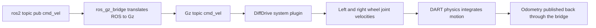
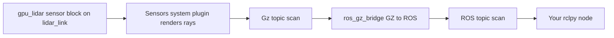

# Lecture 2 — Gz Sim Plugins for Diff-Drive, IMU, and LiDAR: How Sensors Get Into Simulation

> **Reading time:** ~80 minutes. **Hands-on time:** ~60 minutes (you wire a DiffDrive plugin, add two sensors, bridge them, and watch the topics populate).

Lecture 1 gave you a physically honest robot *body* — a tree of links with correct mass and inertia. A body just falls and sits there. This lecture gives it an **actuator** (so `/cmd_vel` makes it drive) and **two sensors** (an IMU and a 2D LiDAR, so it perceives), and then bridges all of that to ROS2 so your `rclpy` nodes can talk to it. By the end you will understand the entire path a velocity command takes from `ros2 topic pub /cmd_vel` to a wheel actually turning in DART, and the reverse path a LiDAR ray takes from the simulated world to a `sensor_msgs/LaserScan` on a ROS2 topic.

The single most important conceptual shift this week is this: **Gz Sim is not part of ROS2.** It is a separate simulator with its own transport layer (`gz-transport`, built on its own discovery and serialization), its own message types (`gz.msgs`), and its own plugin system (`gz-sim` systems written in C++). ROS2 and Gz Sim are two separate middleware universes. The thing that connects them is a **bridge** — `ros_gz_bridge` — a process whose entire job is to translate messages between the two. If you internalize "two universes plus a bridge," every confusing thing about Gazebo-ROS integration becomes obvious. If you don't, you will spend hours wondering why `ros2 topic list` doesn't show a topic that `gz topic -l` clearly does.

## 2.1 — The two-universe model

Draw this on a whiteboard and keep it there all phase:

```
   ROS 2 universe (DDS)                  Gz Sim universe (gz-transport)
 ┌───────────────────────────┐        ┌─────────────────────────────────┐
 │  your rclpy nodes          │        │  gz::sim::Server (the physics    │
 │  rviz2                     │        │    world + entities)             │
 │  /cmd_vel  (geometry_msgs) │        │  DiffDrive system  (C++ plugin)  │
 │  /scan     (sensor_msgs)   │        │  Sensors system    (C++ plugin)  │
 │  /imu      (sensor_msgs)   │        │  Imu system        (C++ plugin)  │
 │  /odom     (nav_msgs)      │        │  /cmd_vel  (gz.msgs.Twist)       │
 │  /tf       (tf2_msgs)      │        │  /scan     (gz.msgs.LaserScan)   │
 │  /clock    (rosgraph_msgs) │        │  /imu      (gz.msgs.IMU)         │
 └─────────────┬─────────────┘        └────────────────┬────────────────┘
               │                                        │
               │        ┌───────────────────────┐       │
               └───────▶│   ros_gz_bridge        │◀──────┘
                        │  translates message    │
                        │  types both directions │
                        └───────────────────────┘
```

Three facts fall out of this picture:

1. **A topic in one universe is invisible in the other until you bridge it.** `gz topic -l` lists the Gz side; `ros2 topic list` lists the ROS side. They are different namespaces in different middlewares.
2. **The plugins live entirely on the Gz side.** `DiffDrive`, `Sensors`, `Imu` are C++ `gz-sim` systems. They never touch ROS2. They read and write `gz.msgs` on `gz-transport`. The bridge is what makes them appear to be ROS2 nodes.
3. **Time has to be bridged too.** `/clock` (`rosgraph_msgs/Clock`) carries simulation time from Gz to ROS2. Every ROS2 node this week runs with `use_sim_time: true` so timestamps line up with the simulator's clock, not wall-clock. Forgetting this is the second-most-common bug after forgetting to bridge a topic.

## 2.2 — Injecting Gz content into a URDF: the `<gazebo>` tag

URDF has no concept of a plugin, a sensor, or a friction coefficient — it is a ROS format. SDF (Gazebo's format) has all of those. So how do we put a DiffDrive plugin, defined in SDF, into a URDF? The answer is the **`<gazebo>` extension tag**: any XML you put inside `<gazebo>...</gazebo>` in a URDF is passed *through* the URDF→SDF conversion verbatim and lands in the generated SDF. It is an escape hatch from the ROS format into the simulator format.

There are two forms:

```xml
<!-- Form 1: attach SDF content to a specific link (adds <sensor>, friction, etc. to that link). -->
<gazebo reference="lidar_link">
  <sensor name="lidar" type="gpu_lidar">
    <!-- ... sensor definition ... -->
  </sensor>
</gazebo>

<!-- Form 2: attach a system plugin to the whole model (no reference attribute). -->
<gazebo>
  <plugin filename="gz-sim-diff-drive-system"
          name="gz::sim::systems::DiffDrive">
    <!-- ... plugin parameters ... -->
  </plugin>
</gazebo>
```

The `reference="link_name"` form attaches its contents to a link — this is how a `<sensor>` knows which link it rides on, and how you set per-link friction. The plain `<gazebo>` form (no reference) attaches a *system plugin* to the model as a whole. You will use both this week.

## 2.3 — The DiffDrive plugin: from `/cmd_vel` to turning wheels

The differential-drive plugin is the actuator. It subscribes to a velocity command, computes per-wheel angular velocities from the diff-drive inverse kinematics, applies them to the two wheel joints, and (optionally) publishes odometry and the `odom→base_link` transform. Here is the complete block for `crunchbot`:

```xml
<gazebo>
  <plugin filename="gz-sim-diff-drive-system"
          name="gz::sim::systems::DiffDrive">
    <!-- Which joints are the driven wheels. -->
    <left_joint>left_wheel_joint</left_joint>
    <right_joint>right_wheel_joint</right_joint>

    <!-- Geometry: must match the URDF, or odometry lies. -->
    <wheel_separation>0.36</wheel_separation>
    <wheel_radius>0.05</wheel_radius>

    <!-- Command input: the Gz topic the plugin subscribes to. -->
    <topic>cmd_vel</topic>

    <!-- Odometry output. -->
    <odom_topic>odom</odom_topic>
    <tf_topic>tf</tf_topic>
    <frame_id>odom</frame_id>
    <child_frame_id>base_link</child_frame_id>
    <odom_publish_frequency>50</odom_publish_frequency>

    <!-- Safety limits (m/s and m/s^2). -->
    <max_linear_acceleration>1.0</max_linear_acceleration>
    <min_linear_acceleration>-1.0</min_linear_acceleration>
    <max_angular_acceleration>2.0</max_angular_acceleration>
    <min_angular_acceleration>-2.0</min_angular_acceleration>
  </plugin>
</gazebo>
```

Every parameter earns its place:

- **`<left_joint>` / `<right_joint>`** name the two `continuous` wheel joints from your URDF. If these names don't match exactly, the plugin silently does nothing — the robot spawns fine and ignores `/cmd_vel`. This is the most common "why won't it move" bug.
- **`<wheel_separation>` and `<wheel_radius>`** are the diff-drive kinematic constants. **They must match the URDF geometry.** If your wheel joints are at `±0.18 m` in y, the separation is `0.36 m`. If the radius here disagrees with the URDF cylinder radius, the plugin will command wheel speeds that produce a different ground speed than it reports in odometry — your odometry will drift even though the wheels never slip. In Week 6 you implement this kinematics by hand; for now, just keep these two numbers honest.
- **`<topic>cmd_vel</topic>`** is the **Gz** topic the plugin listens on. After bridging (next section) this becomes the ROS2 `/cmd_vel`.
- **`<odom_topic>` and `<tf_topic>`** make the plugin publish odometry and the `odom→base_link` transform. We let the plugin own this transform in Phase 1; in Week 6 you will turn the plugin's odometry off and publish your own from wheel joint states, to learn where drift comes from.
- The **acceleration limits** keep `/cmd_vel` step commands from producing infinite jerk, which would otherwise let an aggressive command kick the robot hard enough to slip the wheels.


*The full path a velocity command takes from a ROS2 publish through the bridge and the DiffDrive plugin to wheel motion in DART.*

The diff-drive inverse kinematics the plugin runs internally, for completeness (you derive this in Week 6):

```
v   = commanded linear  velocity (m/s)      from cmd_vel.linear.x
w   = commanded angular velocity (rad/s)    from cmd_vel.angular.z
L   = wheel_separation, R = wheel_radius

omega_left  = (v - w * L / 2) / R     # rad/s for the left  wheel joint
omega_right = (v + w * L / 2) / R     # rad/s for the right wheel joint
```

## 2.4 — The IMU: a sensor block plus the Imu system plugin

An IMU in Gz Sim takes **two** pieces, and forgetting either gives you silence:

1. A **`<sensor type="imu">`** block attached to a link (via `<gazebo reference="imu_link">`). This declares *that there is an IMU here*, at what rate, with what noise.
2. The **`Imu` system plugin** attached to the world (or model). The sensor block describes the sensor; the system plugin is the code that actually computes the readings and publishes them. Without the system, the sensor block is inert.

The sensor block:

```xml
<gazebo reference="imu_link">
  <sensor name="imu" type="imu">
    <always_on>true</always_on>
    <update_rate>100</update_rate>
    <topic>imu</topic>
    <gz_frame_id>imu_link</gz_frame_id>
    <imu>
      <angular_velocity>
        <x><noise type="gaussian"><mean>0.0</mean><stddev>0.0002</stddev></noise></x>
        <y><noise type="gaussian"><mean>0.0</mean><stddev>0.0002</stddev></noise></y>
        <z><noise type="gaussian"><mean>0.0</mean><stddev>0.0002</stddev></noise></z>
      </angular_velocity>
      <linear_acceleration>
        <x><noise type="gaussian"><mean>0.0</mean><stddev>0.017</stddev></noise></x>
        <y><noise type="gaussian"><mean>0.0</mean><stddev>0.017</stddev></noise></y>
        <z><noise type="gaussian"><mean>0.0</mean><stddev>0.017</stddev></noise></z>
      </linear_acceleration>
    </imu>
  </sensor>
</gazebo>
```

Note the **noise**. A noiseless IMU is a fiction that will make your Week 9 calibration lab meaningless and your Week 10 EKF tuning trivial in a way that does not transfer to hardware. The `stddev` values above are loosely modeled on a consumer MEMS IMU (a BNO085-class part): roughly `2e-4 rad/s` gyro noise and `0.017 m/s²` accelerometer noise. We add honest noise now so that the fusion you build later has something real to fight.

The system plugin (anywhere in the model, once):

```xml
<gazebo>
  <plugin filename="gz-sim-imu-system"
          name="gz::sim::systems::Imu">
  </plugin>
</gazebo>
```

The IMU rides on a dedicated `imu_link` attached to the chassis with a `fixed` joint. Mount it at the center of rotation when you can; an IMU mounted far from the rotation center reads centripetal acceleration during turns, which is physically correct but adds a term your fusion has to model. For `crunchbot` we mount it near the geometric center.

## 2.5 — The 2D LiDAR: a `gpu_lidar` sensor plus the Sensors system

A 2D LiDAR is a `gpu_lidar` sensor (it uses the GPU to cast rays — far faster than the CPU `lidar` type) configured with a *single* vertical sample (one ray-plane = 2D). It rides on a `lidar_link` and, like every rendering sensor, requires the **`Sensors` system plugin** (which owns the rendering pipeline that camera, depth, and lidar sensors share).

The sensor block:

```xml
<gazebo reference="lidar_link">
  <sensor name="lidar" type="gpu_lidar">
    <always_on>true</always_on>
    <update_rate>10</update_rate>
    <topic>scan</topic>
    <gz_frame_id>lidar_link</gz_frame_id>
    <lidar>
      <scan>
        <horizontal>
          <samples>360</samples>
          <resolution>1.0</resolution>
          <min_angle>-3.14159</min_angle>
          <max_angle>3.14159</max_angle>
        </horizontal>
        <vertical>
          <samples>1</samples>
          <resolution>1.0</resolution>
          <min_angle>0.0</min_angle>
          <max_angle>0.0</max_angle>
        </vertical>
      </scan>
      <range>
        <min>0.12</min>
        <max>12.0</max>
        <resolution>0.01</resolution>
      </range>
      <noise>
        <type>gaussian</type>
        <mean>0.0</mean>
        <stddev>0.01</stddev>
      </noise>
    </lidar>
  </sensor>
</gazebo>
```

Read the scan geometry carefully:

- **`<horizontal><samples>360</samples>`** with `min_angle=-π`, `max_angle=π` is a full 360° scan at 1° resolution — an RPLIDAR A2-class sensor, which is exactly what you would put on a hobby diff-drive base. The published `LaserScan.angle_increment` will be `2π / 360 ≈ 0.01745 rad`.
- **`<vertical><samples>1</samples>`** with `min_angle = max_angle = 0` is what makes it *2D*: a single horizontal ray-plane. A 3D LiDAR (Week 15) sets `vertical samples` to 16, 32, or 64.
- **`<range><min>` and `<max>`** clip the scan. The `min` of `0.12 m` models the real dead zone where the sensor cannot measure; readings inside it come back as `inf` or `0` and your downstream code must handle them.
- **`<noise>`** with `stddev=0.01` adds ±1 cm of range noise — again, honest, so SLAM in Week 7 has something realistic to scan-match against.

The Sensors system plugin (once, on the world — it is usually placed in the world SDF, but can be on the model):

```xml
<gazebo>
  <plugin filename="gz-sim-sensors-system"
          name="gz::sim::systems::Sensors">
    <render_engine>ogre2</render_engine>
  </plugin>
</gazebo>
```

**The Sensors-system-placement gotcha.** The `Sensors` system that drives `gpu_lidar` (and cameras) is normally attached to the **world**, not the model, because it owns a rendering context shared across all sensors in the world. The standard `ros_gz_sim` empty world SDF already includes it. If you instead put it only on your model and spawn two robots, you can end up with two rendering contexts fighting. For a single robot in Phase 1, either placement works; just know that in Week 35 (multi-robot) the world-level placement is the correct one.

## 2.6 — Bridging: making Gz topics appear in ROS2

Now both universes have the topics; the bridge connects them. `ros_gz_bridge` is configured with a list of topic mappings. The modern, maintainable way is a YAML file, one entry per topic:

```yaml
# crunchbot_bridge.yaml — Gz <-> ROS2 topic bridge for crunchbot.
- ros_topic_name: "/cmd_vel"
  gz_topic_name: "/cmd_vel"
  ros_type_name: "geometry_msgs/msg/TwistStamped"
  gz_type_name: "gz.msgs.Twist"
  direction: ROS_TO_GZ          # commands flow ROS -> Gz

- ros_topic_name: "/odom"
  gz_topic_name: "/odom"
  ros_type_name: "nav_msgs/msg/Odometry"
  gz_type_name: "gz.msgs.Odometry"
  direction: GZ_TO_ROS          # odometry flows Gz -> ROS

- ros_topic_name: "/scan"
  gz_topic_name: "/scan"
  ros_type_name: "sensor_msgs/msg/LaserScan"
  gz_type_name: "gz.msgs.LaserScan"
  direction: GZ_TO_ROS

- ros_topic_name: "/imu"
  gz_topic_name: "/imu"
  ros_type_name: "sensor_msgs/msg/Imu"
  gz_type_name: "gz.msgs.IMU"
  direction: GZ_TO_ROS

- ros_topic_name: "/tf"
  gz_topic_name: "/tf"
  ros_type_name: "tf2_msgs/msg/TFMessage"
  gz_type_name: "gz.msgs.Pose_V"
  direction: GZ_TO_ROS

- ros_topic_name: "/clock"
  gz_topic_name: "/clock"
  ros_type_name: "rosgraph_msgs/msg/Clock"
  gz_type_name: "gz.msgs.Clock"
  direction: GZ_TO_ROS
```

A few things that trip people up:

- **The `direction` matters.** A command (`/cmd_vel`) goes `ROS_TO_GZ`; sensor data goes `GZ_TO_ROS`. Bridging a sensor as bidirectional wastes cycles and can create feedback loops on `/tf`. Be deliberate.
- **The type names must match what each side actually publishes.** On Jazzy, `/cmd_vel` is `geometry_msgs/msg/TwistStamped` (the unstamped `Twist` was deprecated for command interfaces) and the Gz DiffDrive subscribes to `gz.msgs.Twist`. The bridge handles the stamped/unstamped difference. If you bridge a wrong type, the bridge logs an error at startup — read its log.
- **`/clock` is not optional.** Without it, your ROS2 nodes use wall-clock time while the simulator uses sim-time, and every `tf2` lookup throws an extrapolation exception (the same one you debugged in Week 2). Bridge `/clock`, and set `use_sim_time: true` on every node.


*How a LiDAR ray becomes a bridged ROS2 topic your node can subscribe to.*

Launch the bridge with:

```bash
ros2 run ros_gz_bridge parameter_bridge \
  --ros-args -p config_file:=crunchbot_bridge.yaml
```

## 2.7 — The launch file: the whole system in one command

A launch file ties it together: start Gz Sim with an empty world, publish the robot description, spawn the robot, start the bridge, and (optionally) start rviz2. Here is the canonical `ros_gz_sim` launch pattern for 2026, in Python:

```python
#!/usr/bin/env python3
"""crunchbot.launch.py — spawn crunchbot into an empty Gz Sim world and bridge it."""
import os
from ament_index_python.packages import get_package_share_directory
from launch import LaunchDescription
from launch.actions import IncludeLaunchDescription, ExecuteProcess
from launch.launch_description_sources import PythonLaunchDescriptionSource
from launch_ros.actions import Node
from launch_ros.parameter_descriptions import ParameterValue
from launch.substitutions import Command


def generate_launch_description() -> LaunchDescription:
    pkg = get_package_share_directory("crunchbot_description")
    xacro_file = os.path.join(pkg, "urdf", "crunchbot.urdf.xacro")
    bridge_cfg = os.path.join(pkg, "config", "crunchbot_bridge.yaml")
    ros_gz_sim = get_package_share_directory("ros_gz_sim")

    # 1. Expand the xacro into a robot_description string at launch time.
    robot_description = ParameterValue(
        Command(["xacro ", xacro_file]), value_type=str
    )

    # 2. Start Gz Sim with an empty world (the -r flag runs it immediately).
    gz_sim = IncludeLaunchDescription(
        PythonLaunchDescriptionSource(
            os.path.join(ros_gz_sim, "launch", "gz_sim.launch.py")
        ),
        launch_arguments={"gz_args": "-r -v 4 empty.sdf"}.items(),
    )

    # 3. robot_state_publisher: publishes /robot_description and the TF tree.
    rsp = Node(
        package="robot_state_publisher",
        executable="robot_state_publisher",
        output="screen",
        parameters=[{
            "robot_description": robot_description,
            "use_sim_time": True,
        }],
    )

    # 4. Spawn the robot into the running world from /robot_description.
    spawn = Node(
        package="ros_gz_sim",
        executable="create",
        output="screen",
        arguments=[
            "-topic", "/robot_description",
            "-name", "crunchbot",
            "-z", "0.1",            # spawn 10 cm up so it settles, not interpenetrates
        ],
    )

    # 5. The ROS <-> Gz bridge.
    bridge = Node(
        package="ros_gz_bridge",
        executable="parameter_bridge",
        output="screen",
        parameters=[{"config_file": bridge_cfg, "use_sim_time": True}],
    )

    return LaunchDescription([gz_sim, rsp, spawn, bridge])
```

The ordering is load-bearing in one place: `robot_state_publisher` must be up and publishing `/robot_description` *before* the `create` node tries to spawn from that topic. In practice the topic is latched (`TRANSIENT_LOCAL`, which you study formally in Week 5), so a late subscriber still gets the description; but if you ever spawn and the robot appears with no geometry, suspect a race here and add a small `TimerAction` delay before `spawn`.

## 2.8 — The thirty-second spawn smell test

You launched. Is it actually working? A senior robotics engineer runs these checks in the first thirty seconds, before touching `/cmd_vel`:

```bash
# 1. Did the entity spawn? Ask Gz directly.
gz model --list
# expect: crunchbot

# 2. Do the ROS topics exist?
ros2 topic list
# expect: /cmd_vel /odom /scan /imu /tf /clock /robot_description

# 3. Are the sensors publishing at the right rate?
ros2 topic hz /scan      # expect ~10 Hz
ros2 topic hz /imu       # expect ~100 Hz
ros2 topic hz /odom      # expect ~50 Hz

# 4. Is the LiDAR returning sane ranges (not all inf, not all 0)?
ros2 topic echo /scan --once
# expect ranges around the world size, angle_min ~ -3.14, angle_max ~ 3.14

# 5. Is the robot SITTING STILL? Watch odom with no command sent.
ros2 topic echo /odom --field pose.pose.position
# expect x, y, z essentially constant. Drift here = a description bug.
```

If `/scan` is all `inf`, the LiDAR is fine but the world is empty (no walls to hit) — drive near a wall or spawn the `shapes.sdf` world to confirm. If `/odom` position drifts while you send nothing, you have a tilted ground contact or a center-of-mass offset — a Lecture 1 problem, not a plugin problem. If a topic is missing from `ros2 topic list` but present in `gz topic -l`, your bridge entry for it is wrong.

## 2.9 — Driving it

Now the payoff. Send a velocity command:

```bash
# Drive forward at 0.2 m/s.
ros2 topic pub --rate 10 /cmd_vel geometry_msgs/msg/TwistStamped \
  "{header: {frame_id: 'base_link'}, twist: {linear: {x: 0.2}, angular: {z: 0.0}}}"

# Turn in place at 0.5 rad/s (Ctrl-C the previous one first).
ros2 topic pub --rate 10 /cmd_vel geometry_msgs/msg/TwistStamped \
  "{header: {frame_id: 'base_link'}, twist: {linear: {x: 0.0}, angular: {z: 0.5}}}"
```

The robot should glide forward smoothly and turn on the spot. If it lurches, jitters, or one wheel drags, check (in order): wheel joint names match the plugin, `wheel_separation`/`wheel_radius` match the URDF, the wheel friction is non-zero, and the inertials pass Lecture 1's checks. Driving is the integration test for everything you built this week.

## 2.10 — The reflexes to internalize this week

- **Two universes plus a bridge.** ROS2 and Gz are separate; the bridge connects them; an unbridged topic is invisible across the boundary.
- **A sensor needs both a `<sensor>` block and its system plugin.** The block declares it; the plugin computes it. Missing the plugin = silent sensor.
- **Bridge `/clock` and set `use_sim_time: true` everywhere.** Otherwise every tf2 lookup throws.
- **DiffDrive joint names and wheel geometry must match the URDF exactly.** Mismatched names = robot ignores `/cmd_vel`; mismatched geometry = odometry drifts with no slip.
- **Add honest sensor noise now.** Noiseless sensors make the fusion weeks meaningless.
- **Run the thirty-second smell test before driving.** `gz model --list`, `ros2 topic list`, `ros2 topic hz`, `echo /scan --once`, watch `/odom` sit still.

These reflexes plus Lecture 1's inertia discipline are everything you need to spawn a clean, drivable, sensing robot. The mini-project assembles all of it into `crunchbot`.

---

## Lecture 2 — checklist before moving on

- [ ] I can draw the two-universe diagram and explain what the bridge does.
- [ ] I can attach a DiffDrive plugin and explain every parameter, especially why wheel names and geometry must match the URDF.
- [ ] I can add an IMU (sensor block + Imu system) and a 2D LiDAR (gpu_lidar block + Sensors system) and explain why each needs two pieces.
- [ ] I can write a `ros_gz_bridge` YAML with correct types and directions for `/cmd_vel`, `/scan`, `/imu`, `/odom`, `/tf`, `/clock`.
- [ ] I can write a `ros_gz_sim` launch file that spawns the robot and starts the bridge.
- [ ] I can run the thirty-second smell test and interpret each result.
- [ ] I have actually driven a spawned robot with `ros2 topic pub /cmd_vel`.

If any box is unchecked, return to that section. The exercises and the mini-project assume you can spawn, bridge, and drive.

---

**References cited in this lecture**

- Gazebo Harmonic — ROS 2 integration overview: <https://gazebosim.org/docs/harmonic/ros2_integration/>
- `ros_gz_bridge` — message-type mapping table: <https://github.com/gazebosim/ros_gz/blob/jazzy/ros_gz_bridge/README.md>
- DiffDrive system plugin API: <https://gazebosim.org/api/sim/8/classgz_1_1sim_1_1systems_1_1DiffDrive.html>
- Sensors system plugin API: <https://gazebosim.org/api/sim/8/classgz_1_1sim_1_1systems_1_1Sensors.html>
- Imu system plugin API: <https://gazebosim.org/api/sim/8/classgz_1_1sim_1_1systems_1_1Imu.html>
- GPU LiDAR sensor tutorial (Harmonic): <https://gazebosim.org/docs/harmonic/sensors/>
- `ros_gz_sim` launch + `create` source: <https://github.com/gazebosim/ros_gz/tree/jazzy/ros_gz_sim>
- SDFormat 1.11 `<sensor>` spec: <http://sdformat.org/spec?ver=1.11&elem=sensor>
