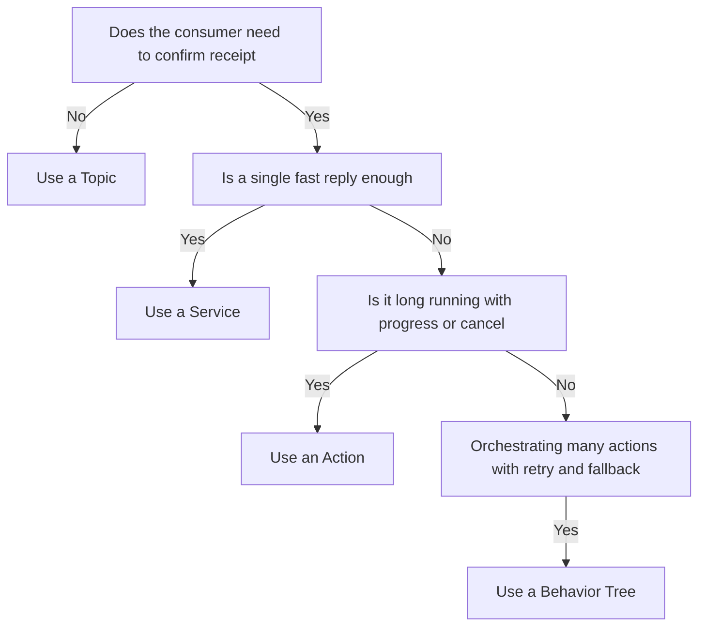
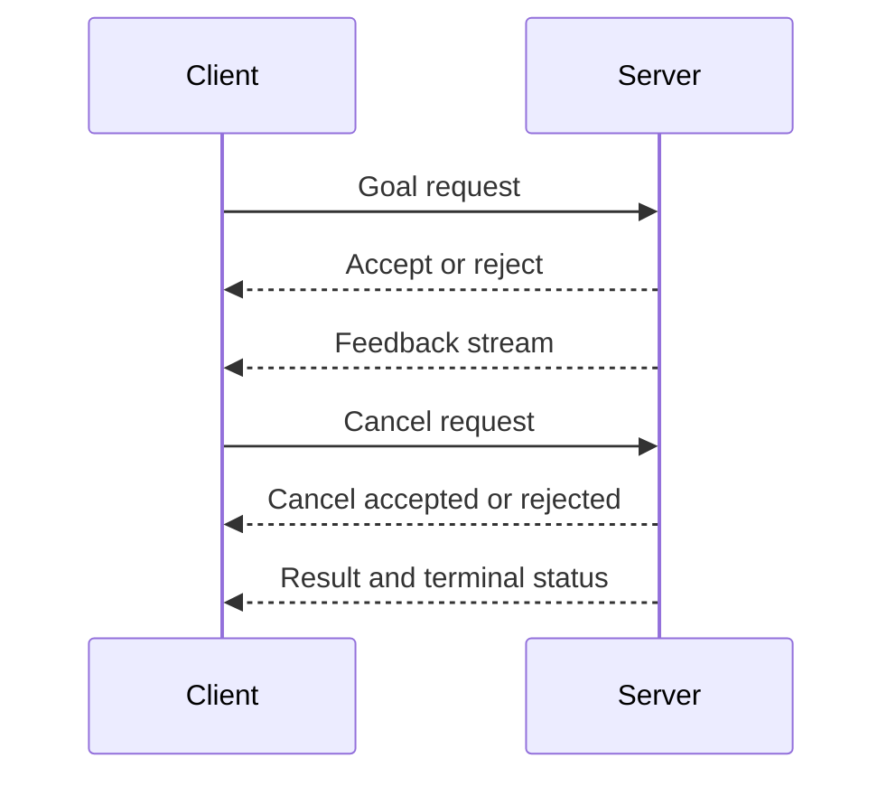

# Lecture 1 — The Decision Ladder: Topic, then Service, then Action, then Behavior Tree

> **Reading time:** ~75 minutes. **Hands-on time:** ~60 minutes (you write a service server + client and an action server skeleton).

This is the lecture that earns you the right to make architecture decisions in a ROS2 system. Every node you have written so far has been a publisher or a subscriber. That is the bottom rung of a ladder, and most of a robot's communication lives there — and should. But the moment a node needs a *reply*, a *result*, *progress*, *cancellation*, or *composition*, you climb. The skill this lecture builds is knowing exactly how far to climb, and stopping there. By the end you can classify any communication problem on the ladder, write a service correctly, recognize when a service is the wrong tool, and have the skeleton of an action server in your hands.

## 1.1 — The four rungs

ROS2 gives you four communication primitives. They are not interchangeable; they form a ladder of increasing capability and increasing machinery.

```
                        ┌─────────────────────────────────────────┐
  rung 4: BEHAVIOR TREE │ orchestrate many actions/conditions      │  compose, audit,
                        │ with sequence/fallback/parallel logic    │  retry, recover
                        └─────────────────────────────────────────┘
                        ┌─────────────────────────────────────────┐
  rung 3: ACTION        │ long-running, cancellable, with feedback │  + progress
                        │ goal → (feedback...) → result            │  + cancellation
                        └─────────────────────────────────────────┘
                        ┌─────────────────────────────────────────┐
  rung 2: SERVICE       │ request → response, one shot, blocking   │  + a reply
                        │ caller waits for the answer              │
                        └─────────────────────────────────────────┘
                        ┌─────────────────────────────────────────┐
  rung 1: TOPIC         │ publish → subscribe, fire and forget     │  streaming data
                        │ many-to-many, no reply                   │
                        └─────────────────────────────────────────┘
```

The senior heuristic, stated as a single sentence: **use a topic until you can't; then use a service; then use an action; then use a behavior tree.** Every rung up costs you setup, introspection complexity, and failure modes. You climb only when the problem forces you to.

There are exactly five questions that move you up a rung. Ask them in order:

1. **Does the producer need to know the consumer received it?** If no — a sensor stream, a `cmd_vel` command, a TF broadcast — stay on a **topic**. Topics are fire-and-forget, many-to-many, and the cheapest thing in ROS2.
2. **Does the caller need a single reply, computed quickly?** "What is your current battery percentage?" "Reset the odometry to zero." "Is the gripper open?" If yes, and the work is *fast* (sub-100 ms, ideally sub-millisecond), use a **service**. A service is a synchronous request/response.
3. **Does the operation take a while, and does the caller want progress or the ability to cancel?** "Drive to the kitchen." "Rotate ninety degrees." "Pick up the cup." If yes, use an **action**. An action gives you a goal, a stream of feedback, a final result, and — the part that matters most — cancellation.
4. **Are you orchestrating many actions and conditions with retry, fallback, and recovery logic?** "Patrol three waypoints, but if you see a person, pause; if the pause exceeds sixty seconds, retreat to the dock." If yes, you have outgrown imperative code and want a **behavior tree** (Week 19). The behavior tree's leaves are usually action clients.


*The four questions that move you up the decision ladder, one rung at a time.*

That is the whole ladder. The rest of this lecture is about the rungs you have not used yet (service, action) and the discipline of not climbing too far.

## 1.2 — Topics: the rung you already know, and why you stay on it

You wrote topic publishers in Week 1. The IMU node publishes `sensor_msgs/Imu` at 200 Hz; nobody acknowledges each message, and that is correct — if one IMU sample is dropped, the next one arrives in 5 ms. A `cmd_vel` publisher sends `geometry_msgs/Twist`; the base controller subscribes; there is no reply, and there should not be — the controller acts on the latest command and the publisher does not wait.

The reason topics are the default is that they are **decoupled in three dimensions**: in *space* (publisher and subscriber discover each other through DDS; neither needs the other's address), in *time* (a subscriber that starts late simply misses earlier messages; a publisher does not block waiting for subscribers), and in *synchronization* (the publisher's thread never waits on the subscriber's thread). That decoupling is what lets you bring nodes up and down independently, restart a subscriber without restarting the publisher, and run twelve nodes that have never heard of each other.

The temptation, when you first learn services and actions, is to "upgrade" topics into them for safety. Resist it. A 200 Hz sensor stream over a service would be a catastrophe: every sample would block the producer until the consumer replied, you would lose the many-to-many fan-out, and a slow consumer would back-pressure the sensor. Topics are not a weaker primitive; they are the *right* primitive for streaming, broadcast, and command data where the latest value is what matters and history does not.

**When a topic is wrong:** the moment the producer must know the consumer acted, or the caller needs a computed answer back. A topic cannot deliver "the odometry has been reset" as a confirmation. That is a service.

## 1.3 — Services: request, response, and the rule that forces you up the ladder

A service is a **synchronous remote procedure call**. A client sends a `Request`, the server runs a callback, the server returns a `Response`, the client receives it. One caller, one server, one round trip. The interface is defined in a `.srv` file:

```
# ResetOdometry.srv
# Request
geometry_msgs/Pose2D pose   # the pose to reset odometry to (usually 0,0,0)
---
# Response
bool success
string message
```

The `---` separates the request fields (above) from the response fields (below). After building the package, `rosidl` generates `ResetOdometry.Request` and `ResetOdometry.Response` types in both Python and C++.

A service server in `rclpy` looks like this:

```python
import rclpy
from rclpy.node import Node
from crunch_interfaces.srv import ResetOdometry


class OdometryService(Node):
    def __init__(self) -> None:
        super().__init__("odometry_service")
        self._x = 0.0
        self._y = 0.0
        self._theta = 0.0
        # The third argument is the callback the server runs on each request.
        self._srv = self.create_service(
            ResetOdometry, "reset_odometry", self.reset_callback
        )
        self.get_logger().info("reset_odometry service ready")

    def reset_callback(
        self,
        request: ResetOdometry.Request,
        response: ResetOdometry.Response,
    ) -> ResetOdometry.Response:
        # This callback must be FAST. It runs on the executor thread and blocks
        # it until it returns. Resetting three floats is fine; calling a motor
        # controller over a network and waiting 2 seconds is NOT.
        self._x = request.pose.x
        self._y = request.pose.y
        self._theta = request.pose.theta
        response.success = True
        response.message = (
            f"odometry reset to ({self._x:.2f}, {self._y:.2f}, {self._theta:.2f})"
        )
        self.get_logger().info(response.message)
        return response


def main() -> None:
    rclpy.init()
    node = OdometryService()
    try:
        rclpy.spin(node)
    except KeyboardInterrupt:
        pass
    finally:
        node.destroy_node()
        rclpy.shutdown()


if __name__ == "__main__":
    main()
```

The client side has two forms, and the difference between them is the most common source of confusion for people new to ROS2 services.

**The asynchronous form (`call_async`) is the only correct form inside a node.** It returns a `Future`; you do not block the executor waiting on it:

```python
import rclpy
from rclpy.node import Node
from geometry_msgs.msg import Pose2D
from crunch_interfaces.srv import ResetOdometry


class OdometryClient(Node):
    def __init__(self) -> None:
        super().__init__("odometry_client")
        self._client = self.create_client(ResetOdometry, "reset_odometry")
        while not self._client.wait_for_service(timeout_sec=1.0):
            self.get_logger().info("waiting for reset_odometry service...")

    def reset(self, x: float, y: float, theta: float) -> None:
        request = ResetOdometry.Request()
        request.pose = Pose2D(x=x, y=y, theta=theta)
        future = self._client.call_async(request)
        future.add_done_callback(self._on_response)

    def _on_response(self, future) -> None:
        response = future.result()
        self.get_logger().info(
            f"server replied: success={response.success}, msg='{response.message}'"
        )


def main() -> None:
    rclpy.init()
    node = OdometryClient()
    node.reset(0.0, 0.0, 0.0)
    rclpy.spin(node)
    node.destroy_node()
    rclpy.shutdown()


if __name__ == "__main__":
    main()
```

The synchronous form, `call(request)`, blocks the calling thread until the response arrives. **Calling `call()` from inside a node callback that runs on the same single-threaded executor is the classic ROS2 deadlock**: the service response cannot be processed because the only executor thread is blocked waiting for it. You will see this in Lecture 2 in a different guise (the cancel deadlock); the underlying cause is the same — *a callback that blocks the only thread that could unblock it*. The rule is simple: inside a node, always `call_async` and handle the `Future`. Use synchronous `call()` only from a throwaway script outside the executor, or from a thread you control.

### The rule that forces you up the ladder

Here is the single most important thing this lecture teaches about services:

> **A service callback must not block for more than a few milliseconds. If the work takes longer, you do not have a service — you have an action.**

The reason is structural. The service callback runs on the executor thread. While it runs, that thread is busy and cannot process anything else — no other service requests, no subscriptions, no timers, nothing in the same callback group. If your "service" drives the robot forward two meters, the callback runs for ten seconds, the node is deaf for ten seconds, the caller has no way to cancel, no way to see progress, and no way to know if the robot wedged against a wall halfway through. Every one of those is a defect, and every one of them is *solved* by the next rung up.

The smell test: **if you are tempted to put a `while` loop, a `sleep`, or any I/O that could take more than a few milliseconds in a service callback, stop. You want an action.** "Reset odometry" is a service (three assignments, microseconds). "Drive forward two meters" is an action (a control loop, seconds, cancellable). "What is the battery level?" is a service. "Charge the battery to 80%" is an action. The duration and cancellability of the operation, not the shape of the API, decides the rung.

## 1.4 — Actions: the rung for everything that takes a while

An action is the ROS2 primitive for a **long-running, goal-oriented operation that the caller wants to monitor and may want to cancel.** It is the rung you will spend most of this week on, because almost every interesting robot behavior lives here: navigate to a pose, rotate by an angle, follow a trajectory, pick up an object, dock at a charger.

An action bundles five interactions, and understanding them is understanding actions:

1. **Goal request.** The client sends a `Goal` (e.g., "rotate 90°"). The server's `goal_callback` returns `ACCEPT` or `REJECT`. Rejecting a goal — because the node is busy, the goal is invalid, or the hardware is not ready — is a first-class, expected outcome. (A lifecycle node that is `inactive` rejects every goal; that is the whole point of the challenge this week.)
2. **Goal response.** The client learns whether the goal was accepted, and gets a **goal handle** — the object through which all further interaction happens.
3. **Feedback stream.** While executing, the server publishes `Feedback` messages (e.g., "current yaw error: 43°"). The client subscribes to this stream and can show progress. Feedback is best-effort progress, *not* the result.
4. **Result.** When the goal terminates, the server returns a `Result` and a **terminal status**. There are exactly three terminal statuses you care about: `SUCCEEDED` (the goal completed), `CANCELED` (the client cancelled and the server honored it), `ABORTED` (the server gave up — hardware fault, timeout, invalid state).
5. **Cancel request.** At any point the client can request cancellation. The server's `cancel_callback` returns `ACCEPT` or `REJECT`; if accepted, the execute method is expected to notice (`goal_handle.is_cancel_requested`), stop the work, call `goal_handle.canceled()`, and return.


*The five interactions that make up an action: goal, feedback, cancel, and result.*

Under the hood — and this is worth knowing — an action is **not a fourth DDS primitive. It is built out of services and topics.** The goal request, cancel request, and result query are three services; the feedback and status are two topics. The ROS2 design article on actions walks through exactly which is which. You almost never touch this layer directly — the `ActionServer` / `ActionClient` classes hide it — but knowing it explains the behavior: feedback can be dropped (it's a topic), but the goal acceptance and result are reliable (they're services).

The `.action` file format mirrors the service file, with two separators instead of one:

```
# Spin90Degrees.action
# Goal — what the client asks for
float64 target_relative_yaw   # radians to rotate, relative to current heading (+ = CCW)
---
# Result — what the server returns when done
float64 final_yaw_error       # radians of residual error at termination
bool reached                  # true if within tolerance
---
# Feedback — streamed while executing
float64 remaining_yaw         # radians still to rotate
float64 current_yaw_error     # current heading error in radians
```

The three sections — Goal, Result, Feedback — are separated by `---`. After building, `rosidl` generates `Spin90Degrees.Goal`, `Spin90Degrees.Result`, `Spin90Degrees.Feedback`, plus the service and topic types the protocol uses internally.

Here is the *skeleton* of an action server in `rclpy`. We fill in the closed-loop control and preemption in Exercise 2; this is the structure you must recognize:

```python
import rclpy
from rclpy.action import ActionServer, CancelResponse, GoalResponse
from rclpy.node import Node
from crunch_interfaces.action import Spin90Degrees


class Spin90Server(Node):
    def __init__(self) -> None:
        super().__init__("spin90_server")
        self._action_server = ActionServer(
            self,
            Spin90Degrees,
            "spin90",
            execute_callback=self.execute_callback,
            goal_callback=self.goal_callback,
            cancel_callback=self.cancel_callback,
        )

    def goal_callback(self, goal_request) -> GoalResponse:
        # Accept or reject the goal. Reject if the node is busy, the goal is
        # invalid, or the hardware is not ready. Here we accept anything.
        self.get_logger().info(
            f"received goal: rotate {goal_request.target_relative_yaw:.3f} rad"
        )
        return GoalResponse.ACCEPT

    def cancel_callback(self, goal_handle) -> CancelResponse:
        # Accept the cancel request. The execute_callback is responsible for
        # actually noticing and stopping.
        self.get_logger().info("cancel requested — accepting")
        return CancelResponse.ACCEPT

    def execute_callback(self, goal_handle):
        # This runs the closed-loop rotation. Exercise 2 fills it in.
        # It must: read IMU yaw, command cmd_vel, publish feedback, check
        # is_cancel_requested every tick, and ALWAYS stop the robot on exit.
        result = Spin90Degrees.Result()
        goal_handle.succeed()
        return result
```

Three things to lock in from this skeleton:

- **The three callbacks have three jobs.** `goal_callback` decides *whether* to do the work. `execute_callback` *does* the work and is the only long-running one. `cancel_callback` decides whether to *honor* a cancel. They are separate because they have different concurrency needs — `cancel_callback` must be able to run *while* `execute_callback` is running, which is exactly the callback-group problem of Lecture 2.
- **`goal_handle` is the object that ties it all together.** You call `goal_handle.publish_feedback(...)` to stream progress, `goal_handle.is_cancel_requested` to check for cancellation, `goal_handle.succeed()` / `goal_handle.canceled()` / `goal_handle.abort()` to set the terminal status.
- **`execute_callback` is the long-running one, and it is the one that needs the right executor.** Under a `SingleThreadedExecutor`, while `execute_callback` is spinning its control loop, *nothing else on that node runs* — including the cancel handler. That is the deadlock. Lecture 2 fixes it.

### Driving and introspecting an action from the CLI

You do not need a client node to test an action server. `ros2 action` is your friend:

```bash
# List the available actions.
ros2 action list

# Show the goal/result/feedback types of an action.
ros2 action info /spin90 -t

# Send a goal and stream feedback until it terminates.
ros2 action send_goal /spin90 crunch_interfaces/action/Spin90Degrees \
  "{target_relative_yaw: 1.5708}" --feedback
```

The `--feedback` flag is the one you reach for constantly this week: it prints every feedback message as it arrives, so you can watch the yaw error shrink in real time. To test cancellation, send a goal in one terminal and `Ctrl-C` it — the CLI client sends a cancel request, and you watch your server honor it.

## 1.5 — Behavior trees: the top rung (preview, not a deliverable)

The fourth rung is the behavior tree, and we are only previewing it — the BT.CPP authoring, Groot 2 visualization, and the control/decorator/condition node taxonomy are Week 19. What matters *now* is recognizing when you have climbed past imperative code into orchestration.

Consider the patrol task from the syllabus: "patrol three waypoints; if you see a person, pause and wait until they leave; if the pause exceeds sixty seconds, retreat to the charging station." Each verb — "navigate to waypoint," "wait," "retreat" — is an action. The *structure* connecting them — the sequence of waypoints, the fallback to pausing when a person appears, the timeout that triggers retreat — is control flow that you could write as a giant `if/while` state machine in Python, and people do, and it becomes unmaintainable by the fourth recovery branch.

A behavior tree is **a state machine you can audit.** Its leaves are action clients and condition checks; its internal nodes are `Sequence` (do these in order, fail if any fails), `Fallback` (try these in order, succeed if any succeeds), and `Parallel` (run several at once). It ticks at a fixed rate, evaluating the tree top-down, and each leaf reports `SUCCESS`, `FAILURE`, or `RUNNING`. The retry, the recovery, the "pause if a person appears" — all become tree structure you can visualize and reason about, instead of nested conditionals you have to trace by hand.

The heuristic for the top rung: **you have outgrown imperative orchestration when your task has more than two or three recovery branches, when "what is the robot doing right now and why" stops being answerable by reading a stack trace, or when a non-programmer (a robotics operator) needs to read and modify the task logic.** Nav2's navigation logic is a behavior tree for exactly these reasons. This week, your actions are the *leaves* a future behavior tree will tick. Build them well and the tree is easy; build them badly — non-cancellable, no feedback, ambiguous terminal status — and the tree inherits every defect.

## 1.6 — The decision ladder as a table

Here is the ladder as a lookup table you can paste into a design doc. The columns are the five questions; the rows are the rungs.

| Primitive | Reply? | Result? | Feedback? | Cancel? | Compose? | Use it for |
|-----------|:------:|:-------:|:---------:|:-------:|:--------:|------------|
| **Topic** | no | no | no | no | no | sensor streams, `cmd_vel`, TF, anything where the latest value is what matters |
| **Service** | yes | yes (fast) | no | no | no | quick queries and quick commands: reset odometry, get battery %, toggle a relay |
| **Action** | yes | yes | yes | **yes** | no | long-running goals: navigate, rotate, drive a distance, pick, dock |
| **Behavior tree** | — | — | — | — | **yes** | orchestrating many actions with retry, fallback, recovery, and timeouts |

The most important column is **Cancel**. It is the line that separates a service from an action, and it is the line that separates a toy from a safe robot. Any operation that commands actuators for more than a moment *must* be cancellable, because the operator, the safety system, or a changed world state must be able to stop it. That is why "drive forward" is never a service: not because the API is awkward, but because a non-cancellable drive command is a hazard.

## 1.7 — Worked classification: ten problems on the ladder

Classifying problems on the ladder is the core skill, and it is the first half of Exercise 1. Here are ten worked examples with the reasoning, so you have a model to imitate.

1. **"Publish the IMU at 200 Hz."** — **Topic.** Streaming sensor data, no reply needed, latest value matters.
2. **"Command the base velocity."** — **Topic** (`cmd_vel`). The controller acts on the latest command; no acknowledgment.
3. **"Reset the wheel odometry to zero."** — **Service.** A quick state change with a confirmation; microseconds of work; no progress to report.
4. **"What is the current battery percentage?"** — **Service.** A quick query with an answer; no long-running work.
5. **"Rotate the robot 90 degrees in place."** — **Action.** Takes a few seconds, the caller wants progress, and it *must* be cancellable. (This is your week's deliverable.)
6. **"Drive forward two meters."** — **Action.** Same reasoning as rotation: long-running, cancellable, feedback-worthy.
7. **"Navigate to the kitchen."** — **Action** (this is literally Nav2's `NavigateToPose`). Long, cancellable, streams the distance remaining.
8. **"Toggle the LED ring on or off."** — **Service.** Instant state change with a confirmation. (You *could* use a topic if you don't need the confirmation; the confirmation is what tips it to a service.)
9. **"Pick up the red cup, then place it on the left bench, retrying the grasp up to three times."** — **Behavior tree.** Multiple actions (detect, grasp, place), retry logic, a recovery branch — orchestration.
10. **"Stream the camera image."** — **Topic.** High-rate data, many subscribers, best-effort, latest frame matters.

Notice the pattern: the *duration* and *cancellability* of the operation, plus *whether the caller needs an answer*, decide the rung — not the complexity of the payload or how "important" the operation feels. A simple-sounding "rotate 90°" is an action because it takes time and must be stoppable; a fancy-sounding "compute the optimal grasp pose" might be a service if it is a fast pure computation with one answer.

## 1.8 — The reflexes to internalize this week

- **Start at the bottom of the ladder and climb only when forced.** Default to a topic. Reach for a service only when you need a reply. Reach for an action only when the work is long *and* cancellable. Reach for a behavior tree only when you are orchestrating.
- **Never block in a service callback.** More than a few milliseconds of work in a service callback is a design error; the operation wants to be an action.
- **Inside a node, always `call_async`.** Synchronous `call()` from a callback deadlocks the executor. The `Future` + done-callback pattern is the only correct in-node form.
- **Any actuator-commanding operation that takes time is an action, because it must be cancellable.** Cancellability is a safety property, not a convenience.
- **An action has three callbacks for three jobs:** accept-or-reject (`goal_callback`), do-the-work (`execute_callback`), honor-the-cancel (`cancel_callback`). They have different concurrency needs, which is why Lecture 2 exists.
- **Test actions from the CLI before you write a client.** `ros2 action send_goal ... --feedback` and `Ctrl-C` for cancellation will catch most server bugs before a single client line is written.

## 1.9 — What we did not cover (Lecture 2 picks it up)

This lecture is the *what* and *when* of the ladder. It deliberately left two things for Lecture 2, because they are about *how the node runs*, not *which primitive you chose*:

- **The cancel deadlock and its fix.** We said the cancel handler must run *while* the execute handler runs. Under the default single-threaded executor, it cannot. The fix — a multi-threaded executor plus callback groups — is Lecture 2's first half.
- **Lifecycle and the "refuse goals while inactive" property.** We said a lifecycle node rejects goals while inactive. *How* that state machine works, and why Nav2 is built on it, is Lecture 2's second half.

You now know which rung to climb. Lecture 2 makes the climb safe under concurrency and orchestration.

---

## Lecture 1 — checklist before moving on

- [ ] I can state the decision ladder from memory: topic → service → action → behavior tree.
- [ ] I can name the five questions that move me up a rung (reply, result, feedback, cancel, compose).
- [ ] I can write a `rclpy` service server and an async client, and explain why synchronous `call()` from a callback deadlocks.
- [ ] I can state the "never block in a service callback" rule and explain that the fix is an action.
- [ ] I can read a `.action` file and name its three sections (Goal, Result, Feedback).
- [ ] I can name the three terminal statuses (`SUCCEEDED`, `CANCELED`, `ABORTED`) and what each means.
- [ ] I can drive an action from the CLI with `ros2 action send_goal --feedback` and cancel it.
- [ ] I have classified the ten problems in §1.7 and agree with the reasoning.

If any box is unchecked, return to that section. Lecture 2 assumes you can place a problem on the ladder without hesitating.

---

**References cited in this lecture**

- ROS2 design — "Topics vs Services vs Actions": <https://design.ros2.org/articles/ros_on_dds.html>
- ROS2 design — "Actions": <https://design.ros2.org/articles/actions.html>
- ROS2 Jazzy — "Understanding services": <https://docs.ros.org/en/jazzy/Tutorials/Beginner-CLI-Tools/Understanding-ROS2-Services/Understanding-ROS2-Services.html>
- ROS2 Jazzy — "Understanding actions": <https://docs.ros.org/en/jazzy/Tutorials/Beginner-CLI-Tools/Understanding-ROS2-Actions/Understanding-ROS2-Actions.html>
- ROS2 Jazzy — "Writing an action server and client (Python)": <https://docs.ros.org/en/jazzy/Tutorials/Intermediate/Writing-an-Action-Server-Client/Py.html>
- ROS2 Jazzy — "Creating an action": <https://docs.ros.org/en/jazzy/Tutorials/Intermediate/Creating-an-Action.html>
