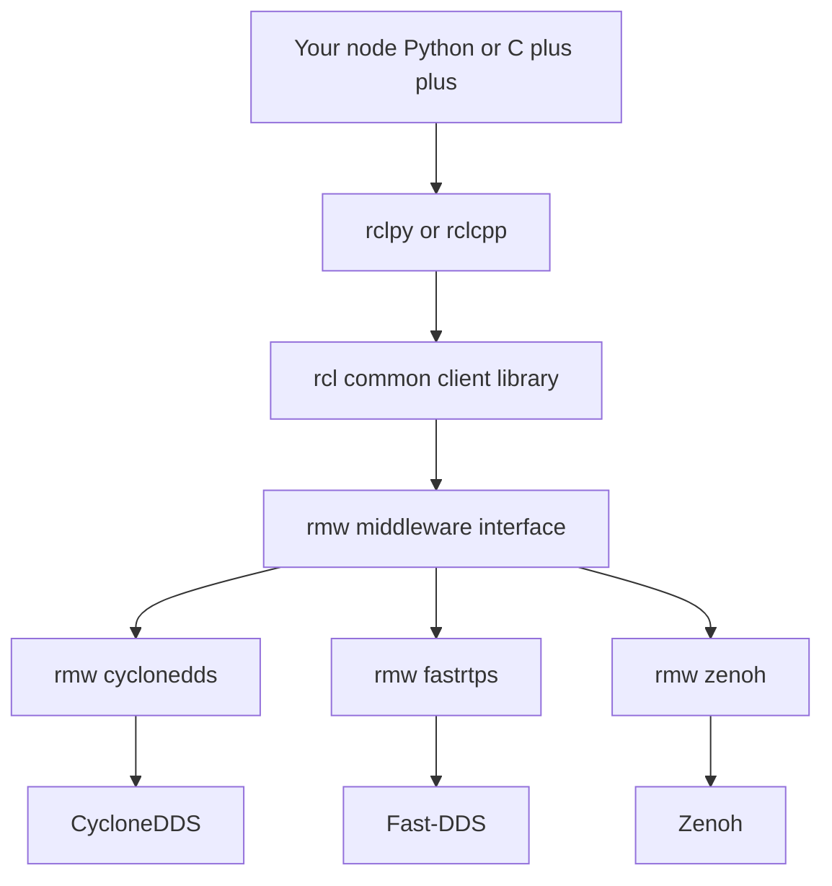
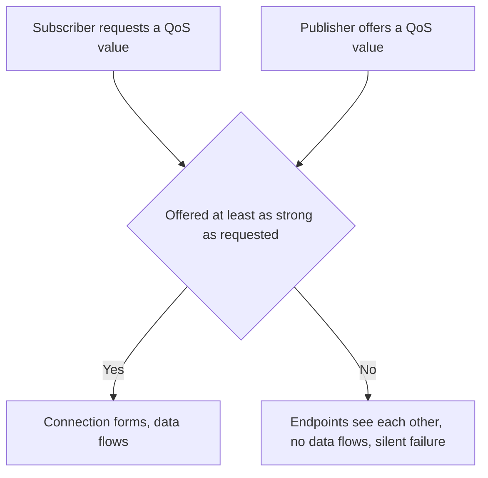

# Lecture 1 — QoS Is Not Optional: The Defaults Are Wrong for Half Your Topics

> **Duration:** ~2 hours of reading + hands-on.
> **Outcome:** You can name the six QoS policies, state their defaults and legal values, predict whether two endpoints are compatible *before* you run them, and assign the correct profile to any topic given only its class.

If you remember one sentence from this entire week, remember this one:

> **QoS is the contract between a publisher and a subscriber. The ROS2 default profile signs a contract that is wrong for most of the topics on a real robot, and when the contract is violated the failure is silent — no exception, no error, just two nodes that never talk.**

ROS1 had no concept of this. A publisher published, a subscriber subscribed over TCP, and either it worked or the topic name was wrong. ROS2 replaced the master + TCP transport with **DDS**, a pub/sub middleware standardized by the OMG that ships with a rich Quality-of-Service model. That model is the single biggest source of "it works on my machine but not in the demo" in the entire ecosystem. This lecture makes you immune.

---

## 1. Where QoS lives in the stack

Recall the Week 1 layering. From the top:

```
your node  (Python)         your node  (C++)
   │                            │
rclpy                        rclcpp
   │                            │
   └──────────► rcl ◄───────────┘      (C, the common client library)
                 │
                rmw                      (ROS middleware interface, an abstraction)
                 │
   ┌─────────────┼─────────────────┐
rmw_cyclonedds   rmw_fastrtps_cpp   rmw_zenoh_cpp   (vendor wrappers)
   │                 │                  │
CycloneDDS       Fast-DDS            Zenoh           (the actual middleware)
```

QoS is defined at the `rcl` level as a `rmw_qos_profile_t` struct and handed down to whichever DDS vendor `rmw` is wrapping. The vendor enforces it on the wire. This matters because **QoS is portable** — the same `QoSProfile` object behaves the same whether you're on CycloneDDS or Fast-DDS — but the *failure messages* and the *tuning knobs* below QoS are vendor-specific. We cover the vendors in Lecture 2; here we stay at the portable QoS layer.


*The QoS profile you set on a publisher or subscription flows down through rcl and rmw to whichever DDS vendor is wrapped.*

A QoS profile is attached at the moment you create a publisher or a subscription. In `rclpy`:

```python
import rclpy
from rclpy.node import Node
from rclpy.qos import QoSProfile, ReliabilityPolicy, HistoryPolicy, DurabilityPolicy
from sensor_msgs.msg import LaserScan


class ScanPublisher(Node):
    def __init__(self) -> None:
        super().__init__("scan_publisher")
        qos = QoSProfile(
            reliability=ReliabilityPolicy.BEST_EFFORT,
            durability=DurabilityPolicy.VOLATILE,
            history=HistoryPolicy.KEEP_LAST,
            depth=5,
        )
        self.pub = self.create_publisher(LaserScan, "scan", qos)
```

In `rclcpp` it's the same idea with a `rclcpp::QoS` object:

```cpp
#include "rclcpp/rclcpp.hpp"
#include "sensor_msgs/msg/laser_scan.hpp"

class ScanPublisher : public rclcpp::Node
{
public:
  ScanPublisher() : Node("scan_publisher")
  {
    auto qos = rclcpp::QoS(rclcpp::KeepLast(5))
                 .best_effort()
                 .durability_volatile();
    pub_ = this->create_publisher<sensor_msgs::msg::LaserScan>("scan", qos);
  }

private:
  rclcpp::Publisher<sensor_msgs::msg::LaserScan>::SharedPtr pub_;
};
```

Note the C++ `rclcpp::QoS` constructor *requires* a history argument (`KeepLast(n)` or `KeepAll()`) — there's no default-constructed QoS. That's deliberate. The library is forcing you to make the history decision. Python lets you default it, which is why Python is where most accidental-default bugs live.

---

## 2. The six policies that matter

DDS defines more than twenty QoS policies. ROS2 exposes a curated subset, and in practice you will touch six. Here is the whole table, with defaults as of ROS2 Jazzy.

| Policy | Legal values | ROS2 default | What it controls |
|---|---|---|---|
| **Reliability** | `RELIABLE`, `BEST_EFFORT` | `RELIABLE` | Whether lost samples are retransmitted |
| **Durability** | `VOLATILE`, `TRANSIENT_LOCAL` | `VOLATILE` | Whether late-joining subscribers get past samples |
| **History** | `KEEP_LAST`, `KEEP_ALL` | `KEEP_LAST` | The queuing strategy for outgoing/incoming samples |
| **Depth** | any non-negative int | `10` | Queue size when `History = KEEP_LAST` |
| **Deadline** | a `Duration` | infinite (disabled) | Maximum expected gap between consecutive samples |
| **Liveliness** | `AUTOMATIC`, `MANUAL_BY_TOPIC` + lease | `AUTOMATIC`, infinite lease | How a writer asserts it is still alive |

There are two more you will occasionally meet — **Lifespan** (how long a sample is valid before it's purged) and **Liveliness lease duration** (paired with the liveliness kind) — but the six above carry 95% of the weight. Let's take them one at a time.

### 2.1 Reliability — `RELIABLE` vs `BEST_EFFORT`

This is the policy people get wrong most often.

- **`RELIABLE`** — the middleware guarantees delivery. If a sample is lost on the wire (UDP packet drop, buffer overflow), DDS retransmits it. The publisher holds samples until they're acknowledged; if the subscriber's queue is full, the publisher *blocks* (or drops, depending on history). This is TCP-like semantics over UDP.
- **`BEST_EFFORT`** — fire and forget. A lost sample is gone. No retransmit, no acknowledgement, no backpressure. This is UDP semantics.

The instinct of every engineer coming from web backends is "reliable is obviously better; why would I ever drop data?" That instinct is **wrong for sensor streams**, and here is why:

A 30 Hz LiDAR publishes a fresh scan every 33 ms. Suppose one scan's packets get dropped. Under `RELIABLE`, DDS retransmits the lost scan — but by the time the retransmit arrives, the *next* scan is already available, and that scan is fresher and more useful. You paid latency and bandwidth to deliver stale data nobody wants. Worse, the retransmit machinery adds head-of-line blocking: a reliable writer won't send sample N+1 until it has dealt with sample N, so one dropped packet can stall the *entire* stream. For high-rate sensor data, **`BEST_EFFORT` is not a compromise — it is the correct choice.** Drop the stale scan, take the next one.

Conversely, a one-shot occupancy grid published once at startup is exactly the kind of data you *must* deliver reliably. There's no "next one" coming in 33 ms. Lose it and the subscriber has a hole.

> **Rule of thumb:** high-rate, time-sensitive, "the next one fixes it" data → `BEST_EFFORT`. Low-rate, must-arrive, "there is no next one" data → `RELIABLE`.

### 2.2 Durability — `VOLATILE` vs `TRANSIENT_LOCAL`

Durability answers one question: *when a subscriber joins after the publisher already sent some samples, does it get the old ones?*

- **`VOLATILE`** — no. You only get samples published *after* you subscribed. This is the default and the right answer for streams.
- **`TRANSIENT_LOCAL`** — yes, up to `depth` samples. The publisher caches its last `depth` samples and replays them to any late-joining subscriber. This is ROS2's replacement for ROS1's **latched topics**.

This is the policy that produces the most baffling silent failures. Picture a map server that publishes `/map` exactly once at startup, with default (`VOLATILE`) durability. Your localization node starts ten seconds later, subscribes to `/map`, and... receives nothing. Ever. The map was published before it subscribed and `VOLATILE` doesn't replay. The map server has no errors. The localization node has no errors. You spend an afternoon adding print statements to the wrong node.

The fix is one line: the map server publishes with `TRANSIENT_LOCAL`, so the late subscriber gets the cached map. This is why **every latched-style topic in ROS2 — `/map`, `/robot_description`, static transforms, parameters — uses `TRANSIENT_LOCAL`.**

> **Both endpoints participate.** For durability to work, the *subscriber* must also request `TRANSIENT_LOCAL`. A `VOLATILE` subscriber against a `TRANSIENT_LOCAL` publisher will still get live samples (the request–offered rule, §3) but won't get the replay. The replay is a two-sided handshake.

### 2.3 History and Depth — `KEEP_LAST(n)` vs `KEEP_ALL`

History is the queuing strategy.

- **`KEEP_LAST(n)`** — keep a ring buffer of the last `n` samples (`n` = `depth`). When the buffer is full and a new sample arrives, the oldest is dropped. This is what you want almost always.
- **`KEEP_ALL`** — keep *every* sample until it is delivered (subject to a vendor-configured resource limit). Combined with `RELIABLE`, this gives lossless, ordered delivery — at the cost of unbounded memory if the subscriber can't keep up.

`Depth` only applies to `KEEP_LAST`. A depth of 1 means "I only care about the latest value" (a setpoint, a latched map). A depth of 5–10 means "give me a small buffer so a momentary scheduling hiccup doesn't drop the sample I'm about to process." For sensor streams you rarely want a deep queue — a deep queue just means you process stale data after a hiccup. Depth 5 is a sane sensor default; depth 1 is right for "only the latest matters" topics.

### 2.4 Deadline

Deadline says: "I expect a new sample at least every *D* seconds. If the gap exceeds *D*, fire an event." It does **not** cause delivery to fail — it's a *monitoring* policy. On the publisher side, a missed deadline means "you promised 30 Hz and you're not delivering it." On the subscriber side, a missed deadline means "the data I depend on has gone stale; I should degrade gracefully."

This is how you build a watchdog *into the QoS layer* instead of bolting one on with timers. A safety-relevant subscriber that reads `/scan` can set a 100 ms deadline and get a callback the moment the LiDAR stops publishing — which is exactly when you want to slam the brakes.

```python
from rclpy.qos import QoSProfile, ReliabilityPolicy, HistoryPolicy
from rclpy.duration import Duration
from rclpy.event_handler import SubscriptionEventCallbacks  # Jazzy module; rclpy.qos_event is the deprecated alias


def on_deadline_missed(event) -> None:
    # event.total_count, event.total_count_change are available
    print(f"DEADLINE MISSED on /scan: {event.total_count} total misses")


qos = QoSProfile(
    reliability=ReliabilityPolicy.BEST_EFFORT,
    history=HistoryPolicy.KEEP_LAST,
    depth=5,
    deadline=Duration(seconds=0, nanoseconds=100_000_000),  # 100 ms
)
callbacks = SubscriptionEventCallbacks(deadline=on_deadline_missed)
# node.create_subscription(LaserScan, "scan", cb, qos, event_callbacks=callbacks)
```

Deadline participates in compatibility (§3): a subscriber requesting a 100 ms deadline is only compatible with a publisher offering a deadline **≤ 100 ms**. Offer a slower deadline than the subscriber demands and the connection won't form.

### 2.5 Liveliness

Liveliness answers "is the writer still alive?" without you writing a heartbeat by hand.

- **`AUTOMATIC`** — the DDS participant asserts liveliness on behalf of all its writers as long as the process is up. If the node process dies, liveliness is lost. This is the default and it's fine for most things.
- **`MANUAL_BY_TOPIC`** — the writer must actively assert liveliness (by publishing, or by calling `assert_liveliness()`) within the **lease duration**. If it doesn't, subscribers get a liveliness-lost event even though the process is still running. Use this when "the process is up" isn't enough — e.g., a node whose publishing thread can deadlock while the process stays alive.

Like deadline, liveliness fires *events*, not delivery failures, and it participates in compatibility: a subscriber requesting a lease of 1 s is compatible only with a publisher offering a lease ≤ 1 s, and the requested kind must be ≤ the offered kind in strictness (`AUTOMATIC` < `MANUAL_BY_TOPIC`).

---

## 3. The request–offered compatibility rule (the heart of the silent failure)

Here is the mechanism behind every silent QoS failure, stated precisely.

> A subscriber **requests** a QoS profile. A publisher **offers** a QoS profile. A connection forms only if, for every policy, **the offered value is at least as strong as the requested value.** If any policy fails this test, the endpoints discover each other but **no data flows**, and (in Jazzy) an incompatible-QoS event fires that almost nobody is listening for.


*The request-offered rule: every policy must pass or the connection never forms, with no error raised.*

"At least as strong as" has a direction for each policy. The two that bite you constantly:

| Policy | Compatible iff | Mnemonic |
|---|---|---|
| **Reliability** | offered ≥ requested, where `RELIABLE > BEST_EFFORT` | A `BEST_EFFORT` publisher **cannot** satisfy a `RELIABLE` subscriber. A `RELIABLE` publisher satisfies *either*. |
| **Durability** | offered ≥ requested, where `TRANSIENT_LOCAL > VOLATILE` | A `VOLATILE` publisher **cannot** satisfy a `TRANSIENT_LOCAL` subscriber. |
| **Deadline** | offered period ≤ requested period | Publisher must promise *at least* as often as the subscriber demands. |
| **Liveliness kind** | offered ≥ requested, `MANUAL_BY_TOPIC > AUTOMATIC` | A weaker offer can't satisfy a stronger request. |
| **Liveliness lease** | offered ≤ requested | Publisher must assert *at least* as often. |

History and depth do **not** participate in compatibility — they're local resource decisions. You can have a `KEEP_LAST(5)` publisher talking to a `KEEP_ALL` subscriber; that's fine.

Read the reliability and durability rows twice. The single most common production QoS bug is:

> **A `BEST_EFFORT` publisher (a sensor using `qos_profile_sensor_data`) and a `RELIABLE` subscriber (a node using the default profile).** The subscriber demands reliability the sensor doesn't offer. No connection. No error in your code. `ros2 topic info -v` shows the publisher and the subscriber both present, both with a count of 1, but `ros2 topic echo` on the subscriber's side shows nothing.

This is *exactly* the failure you will deliberately induce in Exercise 3. Internalize the asymmetry: **a reliable publisher is the safe default for the publisher side**, because it satisfies both reliable and best-effort subscribers. But sensors deliberately publish `BEST_EFFORT` for the latency reasons in §2.1 — so the burden falls on the *subscriber* to request `BEST_EFFORT` to match. That's why `qos_profile_sensor_data` exists and why you must use it on both ends of a sensor topic.

### Predicting compatibility without running

You can and should do this on paper. Given:

```
Publisher offers:   RELIABLE,    VOLATILE,         KEEP_LAST(5)
Subscriber requests: BEST_EFFORT, VOLATILE,         KEEP_LAST(10)
```

- Reliability: offered `RELIABLE` ≥ requested `BEST_EFFORT`? Yes. ✓
- Durability: offered `VOLATILE` ≥ requested `VOLATILE`? Yes (equal). ✓
- History/depth: don't participate. ✓
- **Compatible.** Data flows.

Now flip the reliability:

```
Publisher offers:   BEST_EFFORT, VOLATILE, KEEP_LAST(5)
Subscriber requests: RELIABLE,   VOLATILE, KEEP_LAST(10)
```

- Reliability: offered `BEST_EFFORT` ≥ requested `RELIABLE`? **No.** ✗
- **Incompatible.** Silent failure.

That's the whole game. Two minutes with this table saves you an afternoon.

---

## 4. The built-in profiles — use them, don't reinvent them

ROS2 ships a handful of named profiles. Memorize what each expands to; reaching for the right named profile is faster and less error-prone than hand-rolling.

In `rclpy` they live in `rclpy.qos`:

```python
from rclpy.qos import (
    qos_profile_system_default,
    qos_profile_sensor_data,
    qos_profile_parameters,
    qos_profile_parameter_events,
    qos_profile_services_default,
)
```

| Profile | Reliability | Durability | History/Depth | Use for |
|---|---|---|---|---|
| `qos_profile_system_default` | `RELIABLE` | `VOLATILE` | `KEEP_LAST(10)` | The ROS2 default. Commands, low-rate topics where reliability is cheap. |
| `qos_profile_sensor_data` | `BEST_EFFORT` | `VOLATILE` | `KEEP_LAST(5)` | LiDAR, cameras, IMU — anything high-rate where the next sample fixes a drop. |
| `qos_profile_parameters` | `RELIABLE` | `VOLATILE` | `KEEP_LAST(1000)` | Parameter service traffic. You rarely set this by hand. |
| `qos_profile_parameter_events` | `RELIABLE` | `VOLATILE` | `KEEP_LAST(1000)` | The `/parameter_events` topic. |
| `qos_profile_services_default` | `RELIABLE` | `VOLATILE` | `KEEP_LAST(10)` | Service request/response. |

Two important profiles are *not* in that named list because they're constructed, not constant:

- **The map / latched profile.** There is no `qos_profile_map`. You build it: `RELIABLE` + `TRANSIENT_LOCAL` + `KEEP_LAST(1)`. Nav2's map server and `slam_toolbox` both publish `/map` exactly this way.
- **The static-transform profile.** `/tf_static` uses `RELIABLE` + `TRANSIENT_LOCAL` + `KEEP_LAST` with a large depth (so a late subscriber gets *all* the static transforms, not just the last one). `/tf` (dynamic) uses `RELIABLE` + `VOLATILE`.

In C++, the equivalents are constructed from `rmw_qos_profile_t` constants:

```cpp
#include "rclcpp/qos.hpp"

auto sensor_qos = rclcpp::QoS(
    rclcpp::QoSInitialization::from_rmw(rmw_qos_profile_sensor_data),
    rmw_qos_profile_sensor_data);

// The latched-map profile, built explicitly:
auto map_qos = rclcpp::QoS(rclcpp::KeepLast(1))
                 .reliable()
                 .transient_local();
```

> **Anti-pattern:** copy-pasting a hand-built `QoSProfile(...)` into forty node files. The numbers drift, somebody fat-fingers a depth, and you get a mismatch in node #37. The mini-project this week exists to kill this anti-pattern: one module, every profile, imported everywhere.

---

## 5. The topic-class taste test

You will not memorize the right QoS for every topic by name. You will classify the topic and apply the class's profile. There are five classes on a typical mobile robot. Learn the classes.

### Class 1 — Sensor streams

LiDAR (`/scan`), cameras (`/camera/image_raw`), IMU (`/imu/data`), point clouds (`/points`), depth images. High rate (10–60 Hz), time-sensitive, "the next one fixes a drop."

> **Profile:** `BEST_EFFORT` + `VOLATILE` + `KEEP_LAST` + small depth (5). This is exactly `qos_profile_sensor_data`. Use it on **both** the publisher and every subscriber, or you'll hit the §3 reliability mismatch.

### Class 2 — Latched state (maps, descriptions)

`/map`, `/robot_description`, `/tf_static`, a published costmap that's set once. Low rate or one-shot, must-arrive, late subscribers must catch up.

> **Profile:** `RELIABLE` + `TRANSIENT_LOCAL` + `KEEP_LAST(1)` (or larger depth for `/tf_static`). The `TRANSIENT_LOCAL` is the load-bearing part — it's what makes a node that starts late still receive the map.

### Class 3 — Commands

`/cmd_vel`, joint commands, gripper open/close. Moderate rate, you want reliability (a dropped stop command is dangerous) but not history (only the latest command matters).

> **Profile:** `RELIABLE` + `VOLATILE` + `KEEP_LAST(1)`. Depth 1 because an old velocity command is worse than useless — you don't want a queue of stale `/cmd_vel` draining into the motors after a hiccup. This is the one place people wrongly use a deep queue and get "the robot kept driving after I let go of the joystick."

### Class 4 — Parameters and parameter events

`/parameter_events` and the per-node parameter services. Set by the framework. Leave them on `qos_profile_parameters` / `qos_profile_parameter_events`. You almost never touch these directly.

### Class 5 — Diagnostics and telemetry

`/diagnostics`, health topics, operator-facing status. Low rate, you'd like reliability but a dropped diagnostic isn't fatal. Often `TRANSIENT_LOCAL` with depth 1 so a dashboard that connects late immediately sees the current health.

> **Profile:** `RELIABLE` + `TRANSIENT_LOCAL` + `KEEP_LAST(1)` for "latest status sticky for late dashboards," or `qos_profile_system_default` for a plain event stream.

Here's the whole taste test as one table — print it and tape it to your monitor:

| Class | Example topics | Reliability | Durability | History/Depth |
|---|---|---|---|---|
| Sensor stream | `/scan`, `/imu/data`, `/points` | `BEST_EFFORT` | `VOLATILE` | `KEEP_LAST(5)` |
| Latched state | `/map`, `/robot_description`, `/tf_static` | `RELIABLE` | `TRANSIENT_LOCAL` | `KEEP_LAST(1)`* |
| Command | `/cmd_vel`, `/gripper_cmd` | `RELIABLE` | `VOLATILE` | `KEEP_LAST(1)` |
| Parameters | `/parameter_events` | `RELIABLE` | `VOLATILE` | `KEEP_LAST(1000)` |
| Diagnostics | `/diagnostics`, `/health` | `RELIABLE` | `TRANSIENT_LOCAL` | `KEEP_LAST(1)` |

\* `/tf_static` uses a larger depth so a late joiner gets every static transform.

---

## 6. A worked example on the week-3 robot

Your week-3 robot's diff-drive Gz Sim plugin publishes `/scan`, `/imu/data`, and `/odom`. Out of the box, the `ros_gz_bridge` and many sensor plugins publish with default (`RELIABLE`) QoS, which is the *wrong class* for `/scan` and `/imu/data`. Let's see the difference with a tiny subscriber.

A subscriber using the default profile (`RELIABLE`) against a `BEST_EFFORT` publisher gets nothing. The fix is to subscribe with the sensor profile:

```python
import rclpy
from rclpy.node import Node
from rclpy.qos import qos_profile_sensor_data
from sensor_msgs.msg import LaserScan


class ScanListener(Node):
    def __init__(self) -> None:
        super().__init__("scan_listener")
        # CORRECT: match the sensor publisher's BEST_EFFORT offer.
        self.sub = self.create_subscription(
            LaserScan, "scan", self.on_scan, qos_profile_sensor_data
        )
        self.count = 0

    def on_scan(self, msg: LaserScan) -> None:
        self.count += 1
        if self.count % 30 == 0:
            self.get_logger().info(
                f"scan #{self.count}: {len(msg.ranges)} beams, "
                f"frame_id={msg.header.frame_id}"
            )


def main() -> None:
    rclpy.init()
    node = ScanListener()
    try:
        rclpy.spin(node)
    except KeyboardInterrupt:
        pass
    finally:
        node.destroy_node()
        rclpy.shutdown()


if __name__ == "__main__":
    main()
```

Swap `qos_profile_sensor_data` for the default (just pass an integer `10` as the QoS, which `rclpy` interprets as `KEEP_LAST(10)` with the *default* `RELIABLE` reliability) and run it against a `BEST_EFFORT` publisher. The callback never fires. That is the silent failure, reproduced in twelve lines. We make this rigorous in Exercise 3.

---

## 7. Verifying QoS on a live graph

The tool you'll use constantly is `ros2 topic info -v`. The `-v` (verbose) flag prints the QoS profile of *every* endpoint:

```bash
$ ros2 topic info /scan -v
Type: sensor_msgs/msg/LaserScan

Publisher count: 1

Node name: gz_ros_bridge
Node namespace: /
Topic type: sensor_msgs/msg/LaserScan
Endpoint type: PUBLISHER
GID: 01.10.7f.00...
QoS profile:
  Reliability: BEST_EFFORT
  History (Depth): KEEP_LAST (5)
  Durability: VOLATILE
  Lifespan: Infinite
  Deadline: Infinite
  Liveliness: AUTOMATIC
  Liveliness lease duration: Infinite

Subscription count: 1

Node name: scan_listener
...
  Reliability: BEST_EFFORT
  ...
```

Read both blocks. If the publisher says `BEST_EFFORT` and the subscriber says `RELIABLE`, you've found your bug *without echoing a single message*. This is the diagnostic muscle the entire week builds. `ros2 doctor` and the rmw incompatibility events (Lecture 2) layer on top, but `ros2 topic info -v` is the first thing you reach for, every time.

---

## 8. Recap

You should now be able to:

- Name the six QoS policies, their defaults, and their legal values.
- Explain *why* `BEST_EFFORT` is correct for sensor streams and `RELIABLE` + `TRANSIENT_LOCAL` is correct for latched maps.
- Apply the request–offered compatibility rule on paper and predict whether two endpoints will talk.
- Reach for the right built-in profile instead of hand-rolling, and explain what each expands to.
- Classify any topic into one of five classes and assign its profile.
- Read `ros2 topic info -v` and spot a mismatch from the two QoS blocks alone.

Next up: how the endpoints find each other in the first place (DDS discovery), how to choose and tune a vendor, and how to design messages that don't bite you in six months. Continue to [Lecture 2 — DDS Discovery, Vendors, and Message Design](./02-dds-discovery-vendors-message-design.md).

---

## References

- *About Quality of Service settings* — ROS2 docs: <https://docs.ros.org/en/jazzy/Concepts/Intermediate/About-Quality-of-Service-Settings.html>
- *QoS compatibility* — ROS2 docs: <https://docs.ros.org/en/jazzy/Concepts/Intermediate/About-Quality-of-Service-Settings.html#qos-compatibilities>
- *`rclpy.qos` API reference*: <https://docs.ros.org/en/jazzy/p/rclpy/rclpy.qos.html>
- *`rclcpp::QoS` API reference*: <https://docs.ros.org/en/jazzy/p/rclcpp/generated/classrclcpp_1_1QoS.html>
- *DDS specification (QoS policies, §2.2.3)* — OMG: <https://www.omg.org/spec/DDS/1.4/>
- *Nav2 map server QoS* (TRANSIENT_LOCAL in the wild): <https://docs.nav2.org/configuration/packages/configuring-map-server.html>
