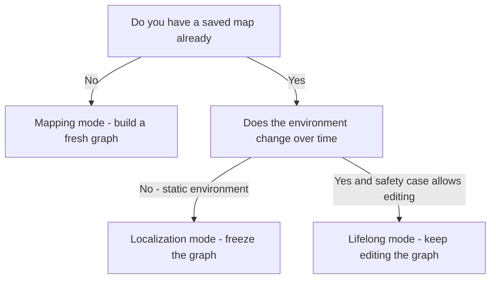
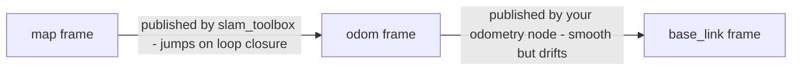

# Lecture 2 — `slam_toolbox` Modes: Mapping vs. Localization vs. Lifelong

> **Reading time:** ~75 minutes. **Hands-on time:** ~50 minutes (you write the three parameter files and trace the frame chain).

Lecture 1 gave you the theory: SLAM is a pose graph, the front-end makes constraints, the back-end optimizes them, loop closure bounds the drift. This lecture is the *practice*: `slam_toolbox` is the production-grade implementation of that theory, and it runs in three modes that are easy to confuse and expensive to confuse. By the end of this lecture you can write the parameter file for mapping mode (and choose synchronous vs. asynchronous correctly), run it against your Week 3 robot, save a map two different ways for two different consumers, restart in localization mode and verify convergence, explain when lifelong mapping is the right mode and when it is a foot-gun, and read the `map → odom → base_link` frame chain the way REP-105 intends. The package is one node with three personalities; choosing the wrong personality is a deployment bug, not a preference.

## 2.1 — The package: one node, several variants

`slam_toolbox` (Steve Macenski et al., in resources.md) is the default 2D LiDAR SLAM package in the ROS2 ecosystem. It descends from Karto (the scan matcher) and wraps it in a modern ROS2 node with a Ceres back-end, a serialization format, an RViz panel, and — the thing that makes it special — *three modes built into one codebase*. The package ships several node executables, but you launch one of these:

- **`sync_slam_toolbox_node`** — *synchronous* mapping. Processes every scan in order, blocking until each is incorporated. Deterministic; never drops a scan. Used when you replay a bag or when CPU is plentiful.
- **`async_slam_toolbox_node`** — *asynchronous* mapping. Processes scans as fast as it can and *drops* scans if it falls behind, always working on the most recent data. Used for live mapping on a robot where keeping up with real time matters more than processing every scan.
- **`localization_slam_toolbox_node`** — *localization* mode. Loads a serialized pose graph and only adds a small rolling window of new measurements to find the current pose against the fixed map. The `slam_toolbox` answer to AMCL.
- **`lifelong_slam_toolbox_node`** — *lifelong* mapping. Loads a serialized graph and *keeps editing it* — adding nodes, decaying stale ones — so the map tracks a changing building over time.

All four read the *same* style of YAML parameter file, with a `mode` field and a few mode-specific keys. You do not recompile or change code between modes; you change the launched executable and a handful of parameters. That uniformity is the design win — the graph machinery from Lecture 1 is shared; the modes differ only in *which nodes are free to move and which are frozen*.

## 2.2 — The parameter file, annotated

Here is a complete, correct mapping-mode parameter file for your Week 3 robot. Save it as `config/mapper_params_online_async.yaml`. Every parameter is annotated with what it does and which Lecture 1 concept it controls.

```yaml
slam_toolbox:
  ros__parameters:
    # ---- solver (the BACK-END, Lecture 1 section 1.5) ----
    solver_plugin: solver_plugins::CeresSolver   # the nonlinear least-squares back-end
    ceres_linear_solver: SPARSE_NORMAL_CHOLESKY  # sparse solve -> scales to a building
    ceres_preconditioner: SCHUR_JACOBI
    ceres_trust_strategy: LEVENBERG_MARQUARDT
    ceres_dogleg_type: TRADITIONAL_DOGLEG
    ceres_loss_function: None                    # robust loss can mask false loops; off for now

    # ---- frames and topics (REP-105, section 2.7) ----
    odom_frame: odom            # parent of base_link, published by YOUR Week 6 node
    map_frame: map              # the global frame; slam_toolbox publishes map -> odom
    base_frame: base_link       # the robot body frame
    scan_topic: /scan           # the sensor_msgs/LaserScan input
    use_map_saver: true
    mode: mapping               # mapping | localization (the personality switch)

    # ---- map output ----
    resolution: 0.05            # metres/cell (Lecture 1 section 1.9): 5 cm indoor default
    map_update_interval: 1.0    # seconds between published OccupancyGrid re-renders
    transform_publish_period: 0.02   # seconds; 50 Hz map->odom TF (smooth in RViz)
    transform_timeout: 0.2
    tf_buffer_duration: 30.0

    # ---- node creation (NODE SPACING, Lecture 1 section 1.9) ----
    minimum_travel_distance: 0.3    # m moved before a new graph node+scan is stored
    minimum_travel_heading: 0.3     # rad turned before a new node is stored
    max_laser_range: 12.0           # m; ignore returns beyond this (noisy long range)
    minimum_time_interval: 0.5      # s; also bound node creation in time

    # ---- scan matching (the FRONT-END, Lecture 1 section 1.4) ----
    use_scan_matching: true
    use_scan_barycenter: true
    scan_buffer_size: 10
    scan_buffer_maximum_scan_distance: 10.0
    link_match_minimum_response_fine: 0.1     # accept a sequential match above this
    link_scan_maximum_distance: 1.5
    correlation_search_space_dimension: 0.5   # m; the scan-match SEARCH WINDOW size
    correlation_search_space_resolution: 0.01 # m; the search grid step
    correlation_search_space_smear_deviation: 0.1

    # ---- loop closure (Lecture 1 section 1.6 -- the knife-edge) ----
    do_loop_closing: true
    loop_search_maximum_distance: 3.0         # m; how far back to look for a revisit
    loop_match_minimum_chain_size: 10         # nodes matched as a chain (robustness)
    loop_match_maximum_variance_coarse: 3.0
    loop_match_minimum_response_coarse: 0.35  # coarse accept threshold
    loop_match_minimum_response_fine: 0.45    # fine accept threshold (the gate)
    loop_search_space_dimension: 8.0
    loop_search_space_resolution: 0.05
    loop_search_space_smear_deviation: 0.03
```

Read the four groups. The **solver** group configures the back-end — leave it at the Ceres defaults; you almost never touch these. The **frames/topics** group is where most first-run bugs live (Section 2.7). The **node creation** group is your node-spacing knob from Lecture 1.9. The **scan matching** group sets the front-end search window — `correlation_search_space_dimension` is the window size, and it must cover your odometry error between nodes. The **loop closure** group is the knife-edge of Lecture 1.6: `loop_search_maximum_distance` is how far back to look, `loop_match_minimum_chain_size` is how many nodes to match as a chain (bigger = more robust = fewer false positives but needs more nodes), and `loop_match_minimum_response_fine` is the accept gate — lower it to catch more loops (and more false ones), raise it to reject false loops (and more true ones). Thursday's challenge is entirely about these five numbers.

## 2.3 — Mapping mode: synchronous vs. asynchronous

Mapping mode builds a fresh graph from scratch. The only real decision is **synchronous vs. asynchronous**, and the rule is about *time pressure*:

- **Synchronous (`sync_slam_toolbox_node`)** processes *every* scan, in order, blocking until each is folded into the graph. It never drops data. If it falls behind real time, it stays behind — the map keeps building from the backlog while the robot has moved on. This is correct when **you control the clock**: replaying a `ros2 bag` (the bag waits for you), or mapping with abundant CPU and a slow drive. It is also the right choice for the *reproducible* experiments in this week's exercises, because determinism matters when you compare runs.
- **Asynchronous (`async_slam_toolbox_node`)** processes scans as fast as it can and *drops* scans when it cannot keep up, always working on the freshest data. The map may skip some scans but it never lags reality. This is correct for **live mapping on a real robot**, where the `map → odom` transform must track the robot *now* — a transform that is two seconds stale because the synchronous node is grinding through a backlog is worse than a transform built from slightly fewer scans but current.

For this week's labs you will mostly use **async** for live driving (it feels responsive in RViz) and **sync** when you replay a bag for the rate-comparison exercise (it processes every scan identically each run). Both build the same kind of graph; they differ only in their scan-dropping policy under load. A common beginner mistake is to run sync on a live robot, watch the map lag the robot by seconds during a fast turn, and conclude "SLAM is broken" — it is not broken, it is faithfully processing the backlog. Switch to async.

The launch for online async mapping:

```python
# launch/online_async_mapping.launch.py
from launch import LaunchDescription
from launch_ros.actions import Node
from ament_index_python.packages import get_package_share_directory
import os


def generate_launch_description():
    pkg = get_package_share_directory("crunch_slam")
    params = os.path.join(pkg, "config", "mapper_params_online_async.yaml")
    return LaunchDescription([
        Node(
            package="slam_toolbox",
            executable="async_slam_toolbox_node",
            name="slam_toolbox",
            output="screen",
            parameters=[params, {"use_sim_time": True}],   # SIM TIME: critical in Gz Sim
        ),
    ])
```

Note `use_sim_time: True`. In Gz Sim the `/clock` topic drives ROS time; if `slam_toolbox` uses wall time while your scans are stamped with sim time, every TF lookup fails with an extrapolation error and the map never builds. This is the single most common "nothing happens" bug in simulation SLAM. Set `use_sim_time` on `slam_toolbox` and on every node in the graph, or nothing lines up.

## 2.4 — Saving a map: two formats, two consumers

When the map looks good — coverage complete, at least one loop closed, walls single-thick — you save it. There are **two** save mechanisms and you almost always want **both**, because they serve two different consumers:

### Format 1 — the occupancy grid (PGM + YAML), for Nav2/AMCL

`map_saver_cli` from `nav2_map_server` writes the *thresholded occupancy grid* to a `.pgm` image plus a `.yaml` metadata file:

```bash
# while slam_toolbox is still running and publishing /map:
ros2 run nav2_map_server map_saver_cli -f ~/maps/crunch_world
```

This produces `crunch_world.pgm` (a greyscale image: white=free, black=occupied, grey=unknown) and `crunch_world.yaml`:

```yaml
image: crunch_world.pgm
mode: trinary
resolution: 0.05
origin: [-12.2, -8.4, 0.0]     # world pose of the bottom-left pixel
negate: 0
occupied_thresh: 0.65          # pixels darker than this -> occupied
free_thresh: 0.25              # pixels lighter than this -> free
```

This is the format **Nav2 and AMCL load in Phase 3.** It is a *static snapshot* — a picture of the map at the moment you saved it. It carries no pose graph, no constraints, no loop-closure information. You cannot re-localize against it with `slam_toolbox` or continue mapping from it. It is purely the navigation-and-AMCL input. The mini-project's deliverable includes this format because Phase 3's Nav2 reuses it.

### Format 2 — the serialized pose graph (`.posegraph` + `.data`), for `slam_toolbox`

`slam_toolbox`'s own serialization saves the *entire pose graph* — nodes, scans, edges, information matrices — through a service:

```bash
# call the serialize_map service while slam_toolbox runs:
ros2 service call /slam_toolbox/serialize_map slam_toolbox/srv/SerializePoseGraph \
  "{filename: '/home/you/maps/crunch_world'}"
```

This produces `crunch_world.posegraph` (the graph structure) and `crunch_world.data` (the scans). This format **preserves everything** — you can load it back into `slam_toolbox` to *continue mapping*, to run *localization mode*, or to *lifelong-edit* it. It is the format `slam_toolbox`'s localization mode requires. The RViz SlamToolbox panel's "Serialize Map" button calls exactly this service.

**The rule:** save the **PGM/YAML** for Nav2/AMCL and save the **serialized graph** for `slam_toolbox` localization and any future editing. They are not interchangeable: AMCL cannot read a `.posegraph`; `slam_toolbox` localization cannot re-localize from a `.pgm` (it can *visualize* one, but it needs the graph to add constraints). Saving only one is the most common mini-project mistake — you save the PGM, hand it to Phase 3's AMCL, and then discover you cannot use `slam_toolbox` localization because you never serialized the graph.

## 2.5 — Localization mode: re-finding yourself against a fixed map

Once the map exists as a serialized graph, the robot's daily job is *localization*, not mapping. Mapping mode rebuilds the world every boot — wasteful and pointless when you already mapped it yesterday. Localization mode loads the fixed graph and only solves for the *current* pose against it.

How it works, in Lecture 1's terms: localization mode **freezes the loaded nodes** (they do not move) and maintains a *small rolling window* of recent measurement nodes whose only job is to be matched against the frozen map. New scans are matched against the fixed graph to produce the `map → odom` correction, but they do *not* permanently grow the map. It is a measurement-only mode — the graph machinery, but with the historical poses held constant. This is `slam_toolbox`'s answer to AMCL: where AMCL (Week 11) maintains a particle cloud over a static occupancy grid, `slam_toolbox` localization does scan matching against the saved pose graph. Both give you `map → odom`; they get there by different math.

The localization parameter file is the mapping file with three changes:

```yaml
slam_toolbox:
  ros__parameters:
    # ... all the frames/topics/scan-matching params from section 2.2 ...
    mode: localization                          # the personality switch

    # load the serialized graph you saved in section 2.4:
    map_file_name: /home/you/maps/crunch_world  # NO extension; loads .posegraph + .data
    map_start_pose: [0.0, 0.0, 0.0]             # initial guess (x, y, yaw) -- OR:
    # map_start_at_dock: true                   # start at the first node of the saved graph

    # localization-mode rolling window:
    minimum_travel_distance: 0.3
    lifelong_search_use_tree: false
```

Set the initial pose two ways. **`map_start_pose`** gives an explicit `(x, y, yaw)` guess — use it when the robot boots at a known spot. **`map_start_at_dock: true`** starts the robot at the first node of the saved graph — use it when the robot always boots at the same dock where mapping began. You can also set the pose interactively in RViz with the "2D Pose Estimate" tool, exactly as you will with AMCL in Week 11. After you set the initial pose, drive a little and watch the `map → odom` transform converge — the robot's rendered position locks onto the map, and the live scan (red points in RViz) aligns with the saved walls. That alignment, converging within a second or two, is your "localization works" proof.

The localization launch:

```python
# launch/localization.launch.py
from launch import LaunchDescription
from launch_ros.actions import Node
from ament_index_python.packages import get_package_share_directory
import os


def generate_launch_description():
    pkg = get_package_share_directory("crunch_slam")
    params = os.path.join(pkg, "config", "localization_params.yaml")
    return LaunchDescription([
        Node(
            package="slam_toolbox",
            executable="localization_slam_toolbox_node",
            name="slam_toolbox",
            output="screen",
            parameters=[params, {"use_sim_time": True}],
        ),
    ])
```

## 2.6 — Lifelong mapping: the changing building

The third mode answers a problem the first two ignore: **buildings change.** Furniture moves, doors open and close, a warehouse re-racks. A map saved in mapping mode is a snapshot; localize against it for six months and the divergence between the saved walls and the real world grows until scan matching gets unreliable. Lifelong mapping loads the saved graph and *keeps editing it*: it adds new nodes as the robot explores changed areas, and it *decays* (down-weights and eventually removes) nodes whose scans no longer match what the robot sees, so stale geometry drops out of the map.

Lifelong mode is the right choice when:

- The environment **changes slowly but persistently** (an office, a warehouse, a hospital) and you want the map to track those changes without a human re-mapping.
- You can tolerate the **extra CPU and the risk** — lifelong editing means the map is never frozen, so a bad scan-match streak can corrupt geometry that mapping-mode would have left alone.

Lifelong mode is the *wrong* choice when:

- The map is a **navigation contract** that other systems depend on being stable (Nav2's costmap layers, a safety zone). You do not want the floor plan silently re-drawing itself under a path planner.
- The environment is **static** (you mapped it once, it does not change) — then localization mode is cheaper and safer.

The decision rule, stated for a review: **map once with mapping mode; run localization mode in production against a static map; switch to lifelong only when the environment provably drifts and you have a reason the safety case can defend.** Most deployed robots in 2026 run localization mode against a periodically-human-re-mapped graph, precisely because a frozen, audited map is easier to reason about than a self-editing one. Lifelong is powerful and occasionally exactly right; it is not a default. For this week's mini-project you deliver a **mapping-mode map and a localization-mode launch** — the production-normal pair — and we discuss lifelong so you can name it in a review, not because you ship it.


*Which slam_toolbox mode to launch, decided from what you already have and how the environment behaves.*

## 2.7 — The frame chain: who owns `map → odom`

This is the section that prevents the most painful bug of the week. REP-105 defines a three-link chain, and *each link has a different owner and different properties*:

```
   map  ──(map→odom)──>  odom  ──(odom→base_link)──>  base_link
   │         │                       │
   │         │                       └── published by YOUR Week 6 odometry node.
   │         │                           Smooth, continuous, DRIFTS. Updated every
   │         │                           wheel cycle. Never jumps.
   │         │
   │         └── published by slam_toolbox (map→odom). ACCURATE, but DISCONTINUOUS:
   │             it JUMPS whenever a loop closure or scan match corrects the
   │             accumulated drift. This is the "correction" transform.
   │
   └── the global frame. The robot's pose in `map` is what Nav2 plans against.
```


*Each link in the REP-105 chain has a different owner and a different smoothness guarantee.*

The key facts, each a bug you avoid by knowing it:

1. **`slam_toolbox` publishes `map → odom`, NOT `map → base_link`.** A beginner expects the SLAM node to publish the robot's pose directly. It does not — it publishes the *correction* between the drifting `odom` frame and the accurate `map` frame. The robot's pose in `map` is the *composition* `map → odom → base_link`. If you publish `map → base_link` from `slam_toolbox` and *also* run your odometry's `odom → base_link`, `base_link` has two parents and tf2 throws `TF_MULTIPLE_AUTHORITY`. `slam_toolbox` does the right thing automatically; do not "help" it.

2. **`map → odom` jumps; that is correct.** When a loop closes (Lecture 1.6), the back-end re-optimizes and the robot's true position estimate changes discontinuously — that change appears as a *jump* in `map → odom`. The `odom → base_link` link stays smooth (your controller needs smoothness); the jump is isolated in the `map → odom` link (your planner tolerates jumps). This is REP-105's entire design: smoothness and accuracy in separate links. Plotting `map → odom` over time and seeing it step at each loop closure (the homework asks you to) is *confirmation the system works*, not a bug.

3. **You must keep publishing `odom → base_link`.** `slam_toolbox` needs your odometry as the motion prior for scan matching (Lecture 1.4) *and* as the link it corrects. If your Week 6 node dies, `slam_toolbox` loses its prior, scan matching degrades to searching the full window every time, and the chain breaks (no `odom → base_link` means no `map → base_link`). Run your odometry node *and* `slam_toolbox` together — the mini-project launch does exactly this.

Verify the chain with `ros2 run tf2_tools view_frames`: you want `map → odom → base_link → (sensors)`, each frame with exactly one parent, `slam_toolbox` listed as the `map → odom` broadcaster and your odometry node as the `odom → base_link` broadcaster. If `view_frames` shows `base_link` with two parents, you have a duplicate publisher — kill it.

## 2.8 — Hands-on: write the three parameter files and trace the chain

You will now produce the three mode configurations and confirm the frame chain, so Wednesday's lab is plumbing you have already reasoned about rather than copy-paste.

**Step 1 — the mapping file.** Copy the Section 2.2 YAML into `config/mapper_params_online_async.yaml`. Change `resolution` to `0.05`, set `minimum_travel_distance` to `0.3`. This is the file the exercise-1 mapping run uses.

**Step 2 — the localization file.** Copy the mapping file to `config/localization_params.yaml`, change `mode: mapping` to `mode: localization`, and add the `map_file_name` line pointing at where you will serialize the map. Leave the path as a placeholder for now; you fill it after the first mapping run.

**Step 3 — trace the chain on paper.** Before you run anything, write out, for your robot, the full expected `view_frames` tree. For the Week 3 diff-drive robot it is:

```
map
└── odom                       (slam_toolbox broadcasts map->odom)
    └── base_link              (your Week 6 odometry broadcasts odom->base_link)
        ├── base_scan          (static, from the URDF: the LiDAR mount)
        └── imu_link           (static, from the URDF: the IMU mount)
```

**Step 4 — the `use_sim_time` audit.** List every node you will launch (your odometry node, `slam_toolbox`, RViz, the Gz bridge) and confirm each gets `use_sim_time: True` in Gz Sim. Write the list down. The number-one "the map never builds" bug is one node on wall time while the rest are on sim time — TF lookups fail silently and `slam_toolbox` waits forever for transforms it can never get. A 60-second audit now saves a 60-minute debug Wednesday.

**Step 5 — predict the failure.** For each of these three deliberate mistakes, write one sentence predicting the symptom, then verify Wednesday: (a) `slam_toolbox` on wall time, everything else on sim time; (b) `scan_topic` set to `/laser_scan` when the robot publishes `/scan`; (c) a stray `static_transform_publisher` also publishing `map → odom`. The discipline of predicting the symptom before you see it is what turns a SLAM bug from an hour of flailing into a five-minute diagnosis.

## 2.9 — The services you will actually call

`slam_toolbox` exposes services that the RViz panel wraps but that you should know by name, because you will script them in the exercises and the mini-project:

- **`/slam_toolbox/serialize_map`** (`slam_toolbox/srv/SerializePoseGraph`) — save the full graph to `.posegraph` + `.data`. Section 2.4, Format 2.
- **`/slam_toolbox/save_map`** (`slam_toolbox/srv/SaveMap`) — save the occupancy grid (wraps the PGM/YAML write). Section 2.4, Format 1, callable as a service instead of the CLI.
- **`/slam_toolbox/deserialize_map`** (`slam_toolbox/srv/DeserializePoseGraph`) — load a serialized graph at runtime (localization and continue-mapping use this).
- **`/slam_toolbox/clear_changes`** and **`/slam_toolbox/manual_loop_closure`** — the RViz panel's interactive tools: discard pending edits, or force a loop closure between two manually-selected nodes. The manual loop closure is a debugging aid — when the front-end *misses* a loop you know is real, you can add the edge by hand to confirm the back-end would have fixed the map. Thursday's challenge uses this to *prove* a missed loop is the problem before you tune the thresholds to catch it automatically.

Calling `serialize_map` from a node (rather than the CLI) is how the mini-project saves its map programmatically; exercise 2 shows the exact client code.

## 2.10 — Summary

- `slam_toolbox` is **one codebase, four executables**: `sync`/`async` mapping, `localization`, `lifelong`. The graph machinery (Lecture 1) is shared; the modes differ in which nodes are frozen and whether the graph keeps growing.
- **Mapping mode** builds a fresh graph. **Sync** processes every scan (deterministic, replays, abundant CPU); **async** drops scans to stay current (live robots). Use async live, sync for reproducible bag replays.
- Save a map **two ways**: `map_saver_cli` → **PGM/YAML** (static snapshot for Nav2/AMCL, Phase 3) and `serialize_map` → **`.posegraph` + `.data`** (full graph for `slam_toolbox` localization and lifelong). Save both; they are not interchangeable.
- **Localization mode** freezes the loaded graph and adds a rolling measurement window to produce `map → odom`. It is `slam_toolbox`'s AMCL-equivalent. Set the initial pose via `map_start_pose`, `map_start_at_dock`, or the RViz "2D Pose Estimate" tool.
- **Lifelong mode** keeps editing the graph for a changing building. Powerful, riskier, not a default. Map once, localize in production, lifelong only when the environment provably drifts and the safety case allows.
- The **frame chain** is `map → odom → base_link`: `slam_toolbox` owns `map → odom` (accurate, *jumps* on loop closure); your Week 6 node owns `odom → base_link` (smooth, drifts). Never publish `map → base_link` yourself.
- In Gz Sim, **`use_sim_time: True` on every node** or TF lookups fail silently and the map never builds. This is the number-one simulation SLAM bug.

Next: the exercises. Exercise 1 runs mapping mode against the multi-room world and closes a loop. Exercise 2 saves the graph and restarts in localization mode. Exercise 3 compares three LiDAR rates. The challenge forces a missed loop closure and makes you fix it. Everything you tune is a parameter from Section 2.2, and every parameter is a Lecture 1 concept.

---

*Write the three parameter files and do the `use_sim_time` audit (Section 2.8) before Wednesday. The lab goes from "two hours of TF debugging" to "the map builds on the first try" entirely on the strength of that audit.*
