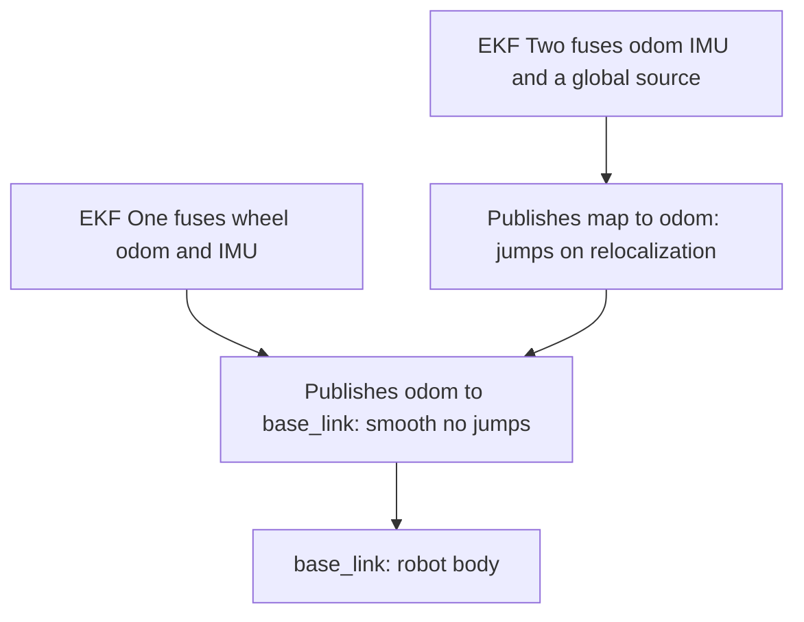
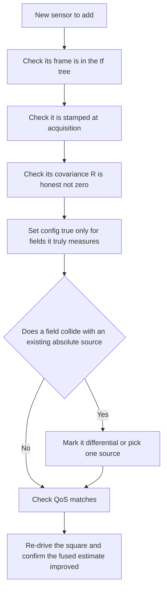

# Lecture 2 — robot_localization in Practice: Config, Frames, and Tuning

> **Duration:** ~2 hours of reading + hands-on.
> **Outcome:** You can configure `robot_localization`'s `ekf_node` to fuse wheel odometry and a calibrated IMU into `/odometry/filtered`, set the boolean `_config` matrices correctly, respect the REP 105 `map → odom → base_link` frames, avoid the classic footguns, and tune `process_noise_covariance` with a documented rationale.

Lecture 1 was the math. This lecture is the YAML — but every line of that YAML is the covariance bookkeeping made concrete, so you'll configure it understanding *why*, not by copy-paste. Three parts: (1) the `ekf_node` architecture and config, (2) the REP 105 frames, (3) fusing odom + IMU and tuning.

---

## Part 1 — The `ekf_node` architecture

`robot_localization` is the standard ROS2 state-estimation package (by Tom Moore). Its `ekf_node` is a 15-dimensional EKF whose state is:

```
x, y, z,  roll, pitch, yaw,  ẋ, ẏ, ż,  roll̇, pitcḣ, yaẇ,  ẍ, ÿ, z̈
(position) (orientation)    (linear vel)  (angular vel)     (linear accel)
```

You don't fuse all 15 from every sensor. You tell the node, per input, *which* of these 15 fields to take from *that* sensor. That selection is the famous **`_config` boolean matrix**.

### 1.1 Inputs and the boolean matrix

Each sensor input is named by type and index: `odom0`, `odom1`, `imu0`, `imu1`, `pose0`, `twist0`. For each, you give a topic and a 15-element boolean grid (laid out in the same order as the state above) saying which fields to fuse:

```yaml
ekf_filter_node:
  ros__parameters:
    frequency: 30.0
    two_d_mode: true                  # planar ground robot: zero z, roll, pitch
    publish_tf: true
    map_frame: map
    odom_frame: odom
    base_link_frame: base_link
    world_frame: odom                 # this EKF estimates odom->base_link

    odom0: /odom
    odom0_config: [false, false, false,    # x,  y,  z      -> DON'T fuse absolute position
                   false, false, false,    # roll, pitch, yaw
                   true,  true,  false,    # vx, vy, vz     -> DO fuse linear velocity
                   false, false, true,     # vroll,vpitch,vyaw -> DO fuse yaw rate
                   false, false, false]    # ax, ay, az

    imu0: /imu/data_calibrated
    imu0_config: [false, false, false,     # x, y, z
                  false, false, true,      # roll, pitch, YAW -> fuse absolute yaw (see caveats)
                  false, false, false,     # vx, vy, vz
                  false, false, true,      # vyaw -> fuse yaw rate
                  true,  false, false]     # ax -> optionally fuse forward accel
    imu0_differential: false
    imu0_remove_gravitational_acceleration: true
```

Read the `odom0_config` carefully — it is Lecture 1's fusion rules in YAML:

- **`x, y, z` are `false`** — we do *not* fuse wheel odometry's absolute position, because it drifts (Lecture 1 §7). Importing it would import the drift.
- **`vx, vy` are `true`** — we *do* fuse wheel velocity, which does *not* drift. This is the information the wheels actually have.
- **`vyaw` is `true`** — fuse the odom-derived yaw rate.

And the `imu0_config`:

- **yaw `true`, vyaw `true`** — take heading and heading-rate from the IMU (the gyro is better at these than the wheels).
- The IMU's absolute `x, y` are never present (an IMU can't measure position), so those stay `false`.

> **The cardinal rule, encoded:** each absolute quantity is fused from *exactly one* source. Velocity from odom, heading from IMU. Fuse absolute yaw from *both* odom and IMU and you double-count — the filter gets overconfident and can diverge. The boolean matrices are how you enforce "one source per absolute quantity."

### 1.2 `two_d_mode`

For a planar ground robot, set `two_d_mode: true`. It forces `z`, `roll`, `pitch`, and their derivatives to zero, so the filter doesn't chase noise in dimensions the robot can't move in. Forgetting this on a ground robot is a classic cause of a wandering, noisy estimate — the EKF tries to estimate altitude and tilt from sensor noise and feeds that garbage back into the planar estimate. Turn it on for diff-drive.

### 1.3 `frequency` and timing

`frequency` is how often the EKF runs its predict step and publishes (30 Hz is typical). Updates happen whenever a measurement arrives (asynchronously). The node buffers measurements by their *timestamp* — which is why Week 9's discipline of stamping at acquisition time matters: a mis-stamped measurement gets fused at the wrong point in the trajectory, corrupting the estimate. Honest timestamps are load-bearing for the EKF, not just good hygiene.

---

## Part 2 — REP 105 frames: who owns which transform

This is where most `robot_localization` setups go wrong, so go slow. REP 105 defines the standard frame chain for a mobile robot:

```
map  ──►  odom  ──►  base_link
```

- **`base_link`** — rigidly attached to the robot body.
- **`odom`** — a smooth, continuous, *locally accurate* frame. The `odom→base_link` transform is your *fused odometry* — it drifts slowly over time but never jumps. **This is what your `ekf_node` publishes.**
- **`map`** — a globally accurate but *discontinuous* frame. The `map→odom` transform is the *correction* from a global localizer (AMCL against a map, GPS) — it jumps when the localizer relocalizes, which is why it's kept *above* `odom` so the jumps don't propagate into the smooth `odom→base_link`.


*The jumpy global correction stays above odom so the local odom to base_link transform stays smooth.*

The crucial design: **two transforms, two estimators.**

- **EKF #1** (this week): `world_frame: odom`, publishes `odom→base_link`, fuses *continuous local* sensors (wheel odom + IMU). Smooth, no jumps, drifts slowly.
- **EKF #2** (stretch / Week 11): `world_frame: map`, publishes `map→odom`, fuses the *same local sensors plus a global one* (AMCL/GPS). Provides absolute correction.

The rule that keeps them from fighting: **exactly one node publishes `odom→base_link`.** If your wheel-odometry node *also* broadcasts `odom→base_link` and your EKF does too, you get a TF conflict — two transforms for the same edge, and tf2 picks one nondeterministically, producing a robot that teleports. The fix: when the EKF owns `odom→base_link` (`publish_tf: true`), your wheel-odometry node must publish the `/odom` *topic* but **not** broadcast the transform. Check it with `ros2 run tf2_tools view_frames` — exactly one arrow into `base_link` from `odom`.

> **The single most common Week-10 bug** is two publishers of `odom→base_link`. Symptom: the robot in rviz2 jitters or jumps between two nearby poses. Diagnosis: `view_frames` shows the conflict, or `ros2 topic info /tf` shows two publishers. Fix: turn off the transform broadcast in your wheel-odom node; let the EKF own it.

---

## Part 3 — Bringing it up, and tuning

### 3.1 The launch file

A minimal bring-up launches `ekf_node` with your YAML:

```python
# ekf.launch.py
from launch import LaunchDescription
from launch_ros.actions import Node
from ament_index_python.packages import get_package_share_directory
import os


def generate_launch_description():
    params = os.path.join(
        get_package_share_directory("crunch_localization"), "config", "ekf.yaml"
    )
    return LaunchDescription([
        Node(
            package="robot_localization",
            executable="ekf_node",
            name="ekf_filter_node",
            output="screen",
            parameters=[params],
            # remap the default /odometry/filtered if you like:
            # remappings=[("odometry/filtered", "odometry/filtered")],
        ),
    ])
```

Run it alongside your robot and confirm the output:

```bash
ros2 launch crunch_localization ekf.launch.py
ros2 topic echo /odometry/filtered --field pose.pose          # the fused pose
ros2 run tf2_tools view_frames                                 # one odom->base_link
```

### 3.2 The covariance you feed it

Before you tune `Q`, make sure `R` is honest (Lecture 1 §5.1). Two checks:

```bash
ros2 topic echo /odom --field pose.covariance       # NOT all zeros (a zero = "infinitely precise")
ros2 topic echo /imu/data_calibrated --field angular_velocity_covariance   # your Week 9 numbers
```

If `/odom`'s covariance is all zeros (a common sim-plugin default), the EKF thinks the wheels are perfect and overtrusts them — your fused estimate will be no better than raw odom, or worse. Set a realistic wheel-odom covariance (small on velocity, larger on absolute pose) in your Week 6 odom node. This is the most common reason "the EKF didn't help."

### 3.3 Tuning `process_noise_covariance` (`Q`)

`Q` is the 15×15 diagonal (usually) `process_noise_covariance` in the YAML. The method, not the superstition:

1. **Drive a known trajectory** — the Week 6 10×10 m square, returning to start, so you know the ground-truth end point (= start).
2. **Plot fused vs. raw** x/y in PlotJuggler. Look at two things: the *end-point error* (how far the fused estimate thinks you are from the true return point) and the *covariance growth* (does the filter's stated uncertainty match its actual error?).
3. **Adjust:**
   - If the fused estimate **lags / is sluggish to corrections and confidently wrong**, `Q` is too small — the filter overtrusts its motion model. *Increase* the relevant diagonal entries (especially the velocity/yaw terms).
   - If the fused estimate **jitters**, `Q` is too large — the filter distrusts its predictions and chases noisy measurements. *Decrease* `Q`.
4. **Aim for consistency:** the filter's reported standard deviation (from `P`) should be roughly the size of its actual error. A filter that says "±2 cm" while drifting 50 cm is *inconsistent* — its `Q` (or an `R`) is wrong.

Document the change. "I increased the `vyaw` process noise from 0.01 to 0.05 because the heading was lagging the IMU during fast turns, and the end-point error dropped from 0.4 m to 0.2 m" is a senior tuning note. "I fiddled until it looked right" is not — and it won't survive the Week 16 review.

### 3.4 The footgun checklist

Before you blame the filter, check these five — they cause 90% of "robot_localization made it worse":

1. **Two publishers of `odom→base_link`** (Part 2). `view_frames` to confirm one.
2. **Zero covariance on `/odom`** (§3.2). Echo it.
3. **`two_d_mode` off on a planar robot** (§1.2). Turn it on.
4. **Fusing absolute yaw from both odom and IMU** (Lecture 1 §7). One source per absolute.
5. **Mis-stamped measurements** (§1.3). Stamp at acquisition (Week 9).

---

## Part 4 — Measuring the win

The week's promise is "filtered beats raw," and the proof is a number. Record the raw `/odom` pose and the fused `/odometry/filtered` pose over the same square, and compare the end-point error (distance from the true return point):

```python
# pseudo: subscribe to both, capture final poses, compare to start
raw_err   = dist(odom_end,     start)        # e.g. 0.83 m
fused_err = dist(filtered_end, start)        # e.g. 0.21 m
print(f"improvement: {raw_err / fused_err:.1f}x")
```

A healthy result is a 2×–5× reduction in end-point drift. If the fused estimate is *worse*, walk the footgun checklist — it's almost always #1 or #2. The covariance bookkeeping from Lecture 1 *guarantees* the fused estimate is at least as good as its best input when configured correctly; a worse result means a configuration error, not a limitation of the math.

---

## Part 5 — The `differential` and `relative` flags (the subtle ones)

Two per-input flags trip people up, and they're exactly how you encode "fuse a *change*, not an absolute." Understand them and you can fuse two pose sources without double-counting.

- **`<input>_differential: true`** — instead of fusing the sensor's absolute value, the EKF differentiates it and fuses the *change* between consecutive measurements. Use this when a sensor reports an absolute quantity that you only want to contribute *relatively*. Classic case: you have two sources of absolute yaw (wheel-odom heading and IMU heading) and fusing both absolutely would double-count. Mark one `differential` and it contributes only the *delta* yaw — its drift is differentiated away, and you avoid the conflict. The cost: differentiating amplifies noise, so only use it where you must.
- **`<input>_relative: true`** — the EKF subtracts the *first* measurement from this sensor, so the sensor's contribution is relative to wherever it started rather than to its absolute origin. Useful when a sensor's absolute frame doesn't match the robot's (e.g. an IMU powered on at a nonzero heading you want treated as "zero").

The decision rule: **if an absolute quantity (position, yaw) is genuinely measured by only one source, fuse it absolutely; if two sources both report it, fuse one absolutely and the other `differential`.** Most diff-drive setups don't need either flag because they fuse *velocity* from odom (not absolute pose) and *absolute yaw* from the IMU only — the matrices already enforce one-source-per-absolute. Reach for `differential` when you're forced to take the same absolute from two places.

---

## Part 6 — The dual-EKF pattern in depth

This week you run one EKF (`odom→base_link`). The full `robot_localization` design — and what you'll complete in Week 11 with AMCL — is **two** EKFs, and understanding why is worth a careful read because it's the architecture every production stack uses.

```
Continuous, local sensors                 Continuous local + a GLOBAL source
(wheel odom, IMU)                          (wheel odom, IMU, AMCL/GPS)
        │                                          │
        ▼                                          ▼
   EKF #1  world_frame: odom               EKF #2  world_frame: map
   publishes odom -> base_link             publishes map -> odom
   (smooth, drifts slowly, NO jumps)       (absolute, JUMPS on relocalization)
```

Why two, and not one EKF fusing everything?

- **`odom→base_link` must be smooth and continuous** — controllers and the local planner integrate it and *cannot* tolerate jumps. So EKF #1 fuses only *continuous* sensors (odom, IMU); it drifts slowly but never teleports.
- **`map→odom` carries the absolute correction**, which *does* jump when a global localizer (AMCL matching a map, or GPS) relocalizes. By putting the jumpy correction *above* `odom` in the tree, the jump moves the whole `odom` frame relative to `map` — and `odom→base_link` stays smooth. The robot's *map-frame* pose corrects discretely; its *odom-frame* pose stays continuous. Both are true simultaneously; that's the genius of the three-frame design.

The rule that keeps the two EKFs from colliding: **EKF #1 publishes `odom→base_link`, EKF #2 publishes `map→odom`, and never the reverse.** EKF #2's `world_frame` is `map`; it fuses the same local sensors *plus* the global one, but you set `publish_tf: true` on it for the `map→odom` edge only. Get this wrong — both EKFs publishing `odom→base_link` — and you're back to the two-publisher TF conflict, now with two estimators fighting. You don't need EKF #2 this week (no global source yet), but configure EKF #1 *as if* #2 is coming: `world_frame: odom`, not `map`. Then Week 11 slots AMCL and EKF #2 in cleanly.

---

## Part 7 — Onboarding a new sensor: the checklist

Every time you add a sensor to the EKF (a second IMU, a GPS, a visual-odometry source), run this checklist. It's the repeatable procedure that turns "I bolted on a sensor and the filter got worse" into a clean integration:

1. **Frame.** What frame is the measurement in? Is that frame in the tf tree? A sensor in the wrong frame is fused at the wrong place. (REP 105 / REP 145.)
2. **Stamp.** Is it stamped at acquisition? A late stamp corrupts the time-ordered fusion. (Week 9.)
3. **Covariance.** Does it carry an *honest* covariance (`R`)? Echo it. Zeros or ones are lies. For an IMU, this is your Week 9 number.
4. **What does it actually measure?** Position? Velocity? Orientation? Rate? Only fuse the fields it genuinely observes — set the rest `false` in `_config`.
5. **Does any field collide with an existing source?** If another sensor already provides that *absolute* quantity, use `differential` or pick one source.
6. **QoS.** Is it a sensor stream (`BEST_EFFORT`) the EKF subscribes to compatibly? (Week 5.)
7. **Verify on the wire.** After adding it, re-run the square and confirm the fused estimate got *better*, not worse. If worse, the checklist above has your bug.


*The seven-point onboarding checklist as a single repeatable path from new sensor to verified fusion.*

This checklist is the difference between a stack that accretes sensors cleanly and one that gets more fragile with each addition. Tape it next to the footgun checklist.

---

## Part 8 — Reading the output like a senior

When you `ros2 topic echo /odometry/filtered`, don't just look at the pose — read the *covariance* too. The 6×6 `pose.covariance` is the filter's self-assessment:

- The **diagonal** entries are the variances of x, y, z, roll, pitch, yaw. On a healthy planar fusion, x/y variance grows slowly between absolute corrections and the yaw variance stays small (the IMU keeps it tight). If x/y variance is *exploding*, the filter is getting no position-constraining information — check that odom velocity is actually being fused.
- A variance that **never shrinks** means the relevant sensor isn't being fused (wrong `_config`, QoS mismatch, or a frame error). A variance that's **implausibly tiny** (1e-9) while the robot visibly drifts means an input lied about its `R` (a zero covariance) and the filter is overconfident.

The senior habit: when the fusion misbehaves, you read the *covariance* to localize the problem before you touch `Q`. A covariance that won't shrink points at a missing update; a covariance that's too small points at a dishonest `R`. The numbers tell you which of the five footguns you hit.

---

## Part 9 — Time, the `tf_timeout`, and the sim-clock trap

The EKF is acutely sensitive to *time*, and two time-related issues cause a disproportionate share of "it sort of works but jitters" reports.

- **Use the simulation clock in sim.** When running in Gz Sim, set `use_sim_time: true` on `ekf_node` (and every node). If the EKF runs on wall-clock while your sensors are stamped with sim-clock, every measurement looks stale or future-dated and the fusion is garbage. The symptom: the filter ignores measurements or jumps erratically. `ros2 param get /ekf_filter_node use_sim_time` should be `true` in sim, `false` on hardware. A mismatched clock is one of the most common silent EKF failures and it's invisible until you check it.
- **`transform_timeout` and `sensor_timeout`.** The EKF needs transforms (e.g. from a sensor frame to `base_link`) available at the measurement's timestamp. If a transform is late, the EKF either waits (`transform_timeout`) or drops the measurement. A too-short timeout on a loaded machine drops good data; a too-long one stalls the filter. Start with the defaults and only adjust if `view_frames` and the logs show transform-timing warnings.
- **Clock skew across machines.** If your IMU runs on a microcontroller or a second computer whose clock differs from the main computer by even tens of milliseconds, measurements land at the wrong trajectory point. On a multi-machine robot, run NTP/PTP and verify the offset is small. This is the hardware version of the stamp-discipline lesson.

The throughline from Week 9: **honest, synchronized timestamps are not optional for an EKF.** The filter fuses by time; lie about time and the optimal estimator becomes a random-walk generator. Before blaming `Q` or a covariance, confirm the clocks agree.

---

## Part 10 — A worked tuning session, start to finish

To make the tuning method concrete, here is a session like the one you'll run in the challenge.

1. **Baseline.** Drive the 10×10 m square with default `Q`. Drift-compare node reports: raw `/odom` end-point error 0.81 m, fused 0.55 m. The filter helps (good — inputs and frames are sane), but only 1.5×. We can do better.
2. **Observe.** In PlotJuggler, the fused heading visibly *lags* the IMU during the four 90° corners — the estimate turns later than the robot does. Hypothesis: the filter trusts its (constant-velocity) motion model too much through the turns, i.e. the yaw-rate process noise is too small.
3. **Change one thing.** Raise the `vyaw` diagonal of `process_noise_covariance` from `0.01` to `0.05`. Re-drive. Fused error drops to 0.30 m; the heading now tracks the IMU through corners. Log it: *"vyaw process noise 0.01→0.05; hypothesis: heading lagged on turns; result: 0.55→0.30 m."*
4. **Check for over-correction.** Did raising `vyaw` introduce jitter on the straights? Plot the straight segments. Slight increase in yaw noise, acceptable. If it had jittered badly, we'd have overshot and would back off to 0.03.
5. **Iterate the velocity terms.** The straights show a small lateral drift. Nudge the `vx`/`vy` process noise. Re-drive: fused error 0.21 m. Diminishing returns — stop.
6. **Final:** raw 0.81 m, fused 0.21 m, **3.9× improvement**, with a two-line rationale for each `Q` change.

Notice what made this *engineering* and not fiddling: each change had a *hypothesis* (drawn from an observed symptom), changed *one thing*, and was *measured*. The tuning log — symptom, change, hypothesis, result — is the artifact. A reviewer who reads it can reconstruct your reasoning and trust the final numbers. "I set vyaw to 0.05 because I read it somewhere" is not defensible; "I set it to 0.05 because heading lagged on turns and that change cut end-point error 1.8×" is. That distinction is the difference between a junior and a senior tuning the same filter.

---

## Part 11 — What `/odometry/filtered` unlocks downstream

It's worth seeing why this week's deliverable is load-bearing for the *entire rest of the track*, because it motivates getting it right rather than "good enough."

`/odometry/filtered` and the smooth `odom→base_link` transform it publishes are the robot's *answer to "where am I and how fast am I going?"* — and almost everything downstream asks that question:

- **Nav2 (Phase 3)** plans paths and runs its controllers against this pose. A drifty or jumpy estimate makes the planner plan from the wrong place and the controller track a wrong path. The 0.21 m end-point accuracy you tuned to *is* the floor on Nav2's navigation accuracy.
- **SLAM and AMCL (Week 11)** use this local estimate as the motion prior between scan matches; a good local estimate means fewer, smaller corrections and a more stable map.
- **The capstone's drift requirement** (`< 0.5 m over 20 m`) is, at its core, a requirement on *this* fused estimate. You are building, this week, the thing the final acceptance criterion measures.

So the EKF is not a self-contained exercise; it is the **pose substrate** the whole autonomy stack stands on. A 30-minute investment in honest input covariance and a methodical tuning session here saves you from chasing phantom "navigation bugs" in Phase 3 that are actually localization bugs. When a senior engineer debugs a robot that "navigates badly," the *first* thing they check is the state estimate — because a planner is only as good as the pose it plans from. You're building that pose now; build it to be trusted.

The one-sentence mandate to carry forward: **a robot that doesn't know where it is cannot do anything else correctly.** Everything — perception in the map frame, planning, control, manipulation, the safety case — assumes a trustworthy pose. This week is where that trust is established and measured. Treat `/odometry/filtered` as the foundation it is.

### A last word on `robot_localization` vs. rolling your own

You implemented a Kalman filter by hand in Exercise 2, and you might wonder why we then hand the real job to a package. The answer is the same one that applies to DDS (you don't write your own pub/sub) and tf2 (you don't write your own transform tree): **`robot_localization` has solved the hard parts that aren't the learning** — the out-of-order measurement buffering, the multi-rate timing, the frame management, the numerical conditioning of a 15-state covariance, the dozens of edge cases a decade of production use has surfaced. Re-implementing those would be a month of work to arrive at something worse. The *understanding* is what you build by hand (the scalar KF, the matrix steps); the *deployment* uses the battle-tested package. A senior engineer knows the difference: implement to learn, configure to ship. You now understand the EKF well enough to configure `robot_localization` as a tool you command rather than a black box you poke — which is exactly the posture this week was built to produce.

---

## 5. Recap

You should now be able to:

- Configure `ekf_node`: inputs (`odom0`, `imu0`), the 15-boolean `_config` matrices, `two_d_mode`, `frequency`, and the frame parameters.
- Encode the fusion rules in the boolean matrices: velocity from odom, heading from IMU, one source per absolute quantity.
- Apply REP 105: the EKF owns `odom→base_link`; ensure exactly one publisher of that transform.
- Verify `R` is honest (non-zero odom covariance, your Week 9 IMU covariance) before tuning.
- Tune `process_noise_covariance` by the drive-and-compare method with a documented rationale, not superstition.
- Walk the five-item footgun checklist and measure the raw-vs-filtered drift improvement.
- Use the `differential`/`relative` flags to fuse a change rather than an absolute, and configure the dual-EKF (`odom→base_link` + `map→odom`) pattern.
- Onboard a new sensor with the seven-point checklist, read the output covariance to localize problems, and avoid the sim-clock / timestamp time traps.
- Run a methodical tuning session (symptom → hypothesis → one change → measure) and explain why `/odometry/filtered` is the foundation the whole autonomy stack stands on.

The habit to carry out of this week: when a robot misbehaves anywhere downstream, *check the state estimate first*. A planner that plans badly, a controller that tracks badly, a perception result in the wrong place — a startling fraction of these are not bugs in the planner, controller, or perception, but a drifty or jumpy pose underneath them all. The engineer who instinctively opens `/odometry/filtered` and `view_frames` before diving into the planner is the one who finds the bug in minutes. You built that estimate; you know how to read its health; make checking it your reflex.

Next: the exercises put the config and the drift comparison on your own robot. Continue to [the exercises](../exercises/README.md).

---

## References

- *robot_localization — configuring ekf_node*: <https://docs.ros.org/en/melodic/api/robot_localization/html/state_estimation_nodes.html>
- *robot_localization — preparing your sensor data*: <https://docs.ros.org/en/melodic/api/robot_localization/html/preparing_sensor_data.html>
- *REP 105 — coordinate frames for mobile platforms*: <https://www.ros.org/reps/rep-0105.html>
- *`nav_msgs/Odometry`* — pose/twist covariance layout: <https://docs.ros.org/en/jazzy/p/nav_msgs/msg/Odometry.html>
- *`sensor_msgs/Imu`* — the calibrated input from Week 9: <https://docs.ros.org/en/jazzy/p/sensor_msgs/msg/Imu.html>
- *Tom Moore — robot_localization ROSCon talk* (config without footguns): <https://roscon.ros.org/>
- *`tf2_tools view_frames`* — generate the TF tree to confirm one `odom→base_link` publisher: <https://docs.ros.org/en/jazzy/Tutorials/Intermediate/Tf2/Debugging-tf2-problems.html>

---

*Practice prompt before the exercises:* sketch, from memory, the `odom0_config` and `imu0_config` boolean matrices for a diff-drive robot that fuses wheel velocity + yaw rate from odom and absolute yaw + yaw rate from the IMU. Then state which transform the EKF publishes and the one constraint that implies. If you can do that without the lecture open, you're ready to read a real config.

*One more, on frames:* name the three frames in the REP 105 chain in order, say which is smooth-and-continuous and which is jumpy-and-global, and identify which one this week's EKF publishes the transform for. The answer (`map → odom → base_link`; `odom→base_link` is smooth and is this EKF's job) should be reflexive by the end of the week.
