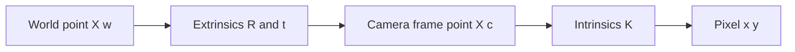
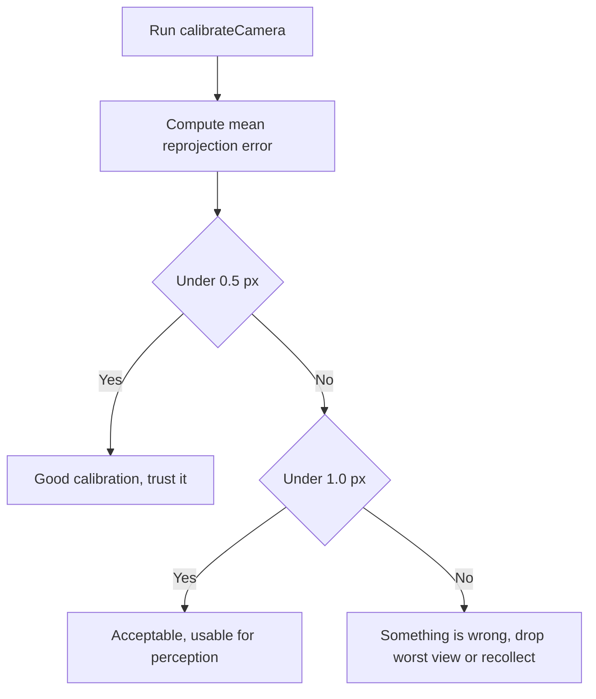

# Lecture 1 — The Pinhole Model: Turning a Camera into a Measurement Device

> **Duration:** ~2 hours of reading + hands-on.
> **Outcome:** You can write the pinhole projection equation from memory, explain every entry of the intrinsic matrix `K`, calibrate a real camera with a checkerboard, read the reprojection error as a quality metric, and undistort an image so straight lines stay straight.

If you remember one sentence from this lecture, remember this one:

> **An uncalibrated camera takes pictures; a calibrated camera takes measurements. Calibration is what turns a pixel into a ray in the world — and without it, every geometric thing your robot does with the camera (depth, pose, projection of a detection into the map) is built on sand.**

A neural network can find a cup in an image without any of this. But the moment you ask "*where* is the cup, in meters, in the robot's frame, so the arm can reach it" — you are doing geometry, and geometry needs the camera model. This lecture builds it.

---

## 1. Image formation: the pinhole

Strip a camera down to its geometric essence and you get the **pinhole**: a single point (the center of projection) and an image plane behind it. Light from a 3D point in the world travels in a straight line through the pinhole and lands on the image plane. That straight-line-through-a-point is the entire geometry of a perspective camera; a real lens is an engineering trick to gather more light than a literal pinhole would, but it *approximates the same projection*.

Two consequences fall out immediately and they govern everything:

- **Perspective.** Objects farther away project smaller. The mapping from 3D to 2D divides by depth `Z` — that division is the source of all perspective effects, and it's why you cannot recover absolute depth from a single image (everything on a ray projects to the same pixel).
- **Projection loses a dimension.** A 3D point becomes a 2D pixel; the depth along the ray is gone. Recovering it is the job of stereo (Lecture 2), structured light/ToF (Week 14), or a learned monocular depth model (Week 13). All of them are ways to put back the dimension the pinhole threw away.

---

## 2. The pinhole projection equation

Let a 3D point in the **camera frame** be `X_c = (X, Y, Z)`. The pinhole projects it to image coordinates by dividing by depth and scaling by the focal length:

```
x = fx · (X / Z) + cx
y = fy · (Y / Z) + cy
```

- `fx, fy` — the **focal lengths** in pixels (they differ only if the pixels aren't square; for most sensors `fx ≈ fy`).
- `cx, cy` — the **principal point**: where the optical axis pierces the image plane, near the image center but rarely exactly at `(W/2, H/2)`.

This is cleaner in homogeneous coordinates. Collect the intrinsics into the **camera matrix** `K`:

```
        ┌ fx   0   cx ┐
   K =  │  0  fy   cy │
        └  0   0    1 ┘
```

Then projection of a camera-frame point is:

```
   ┌ x ┐        ┌ X ┐
 s │ y │  =  K  │ Y │            (s is the depth Z; divide through by it to get the pixel)
   └ 1 ┘        └ Z ┘
```

Points usually live in the **world frame**, not the camera frame, so first transform them by the camera's **extrinsics** `[R | t]` (rotation `R`, translation `t` — the camera's pose, the same SE(3) you built in Week 2):

```
   ┌ x ┐                ┌ X_w ┐
 s │ y │  =  K [R | t]  │ Y_w │
   └ 1 ┘                │ Z_w │
                        └  1  ┘
```

That single equation — `p ∼ K [R | t] X` — is the entire forward camera model. The `3×4` matrix `P = K [R | t]` is the **projection matrix**. Read it left to right: world point → (extrinsics) camera-frame point → (intrinsics) pixel.


*The projection matrix P equals K times R and t, read left to right from world point to pixel.*

### 2.1 Back-projection: pixel to ray

Run it backward. Given a pixel `(x, y)` and the intrinsics, the **ray** in the camera frame along which the world point must lie is:

```
   ray_direction  =  K⁻¹ · (x, y, 1)ᵀ          (a direction; the depth is unknown)
```

```python
import numpy as np

def pixel_to_ray(K, x, y):
    """Back-project a pixel to a unit ray direction in the camera frame."""
    ray = np.linalg.inv(K) @ np.array([x, y, 1.0])
    return ray / np.linalg.norm(ray)
```

This is the operation that turns a detection into something the robot can act on: a YOLO box center at pixel `(320, 240)` becomes a *ray* from the camera; intersect that ray with a depth measurement (Week 14) or the ground plane and you have a 3D point in the world. **Every "the robot sees an object at pixel X, where is it really" question is a back-projection followed by a depth.** That's why `K` is load-bearing.

### 2.2 The inverse problem: PnP, recovering the camera's pose

Back-projection gives you a ray per pixel but not the camera's *pose*. The complementary operation — and one of the most-used in robotics — is **Perspective-n-Point (PnP)**: given a set of known 3D points and their observed pixel locations, *and* the intrinsics `K`, recover the camera's extrinsics `[R | t]`. This is how a robot localizes itself against a known set of landmarks (an AprilTag, a calibration board, a known object), and it is the operation under marker-based localization and under the pose-from-known-model step of many manipulation pipelines.

```python
import cv2
import numpy as np

# Known 3D points (object frame) and where they appeared in the image.
object_pts = np.array([[0, 0, 0], [0.1, 0, 0], [0.1, 0.1, 0], [0, 0.1, 0]], np.float32)
image_pts = np.array([[320, 240], [400, 238], [402, 318], [318, 320]], np.float32)

ok, rvec, tvec = cv2.solvePnP(object_pts, image_pts, K, dist)
R, _ = cv2.Rodrigues(rvec)        # rotation vector -> 3x3 rotation matrix
# [R | tvec] is now the object's pose in the camera frame.
```

`solvePnP` needs at least 3 points (4+ for robustness), and the robust variant `cv2.solvePnPRansac` wraps it in RANSAC to reject outlier correspondences — the same robust-estimation idea you'll formalize in Lecture 2. PnP is the *measurement* half of the calibration story: calibration recovers `K` once from a moving board; PnP then uses that `K` every frame to find where the camera is relative to anything whose geometry you know. The two together are what make a camera a localization sensor, not just an imaging device. You'll use exactly this in Phase 4 when an AprilTag on a tabletop object gives the arm a pose to grasp.

### 2.3 A worked projection, by the numbers

Make the equation concrete. Take a camera with `fx = fy = 600`, `cx = 320`, `cy = 240` (a typical 640×480 sensor), and a 3D point one meter ahead and slightly up-and-right in the camera frame:

```
K = [[600,   0, 320],
     [  0, 600, 240],
     [  0,   0,   1]]

X_c = (0.2, -0.1, 1.0)        # 0.2 m right, 0.1 m up, 1.0 m forward
```

Apply the projection `x = fx·(X/Z) + cx`, `y = fy·(Y/Z) + cy`:

```
x = 600 · (0.2 / 1.0) + 320 = 120 + 320 = 440
y = 600 · (-0.1 / 1.0) + 240 = -60 + 240 = 180
```

So the point lands at pixel `(440, 180)` — right of and above the principal point, as expected for a point that's right-of and above the optical axis. Now move the *same* point twice as far away (`Z = 2.0`) and re-project:

```
x = 600 · (0.2 / 2.0) + 320 = 60 + 320 = 380
y = 600 · (-0.1 / 2.0) + 240 = -30 + 240 = 210
```

The point moved *toward* the principal point (`440 → 380`, `180 → 210`). That's perspective: as something recedes, its image creeps toward the optical axis and shrinks. Back-projecting `(440, 180)` gives a ray, but *not* the depth — both the `Z=1` and `Z=2` points sit on the same ray and you cannot tell them apart from the pixel alone. This little arithmetic *is* the entire pinhole model, and being able to do it in your head is the fluency that makes the rest of the week (stereo, VO, calibration) feel obvious instead of magical.

---

## 3. Lens distortion: why straight lines bend

A real lens is not a perfect pinhole. It bends light slightly differently at the edges than the center, so straight lines in the world come out curved in the image — most visibly with wide-angle lenses, where a doorframe bows outward. The camera model corrects for this with a small set of **distortion coefficients**, applied in normalized image coordinates *before* the intrinsics.

OpenCV's standard model uses five coefficients `[k1, k2, p1, p2, k3]`:

- **Radial distortion** `k1, k2, k3` — distortion that grows with distance from the principal point. `k1 < 0` gives **barrel** distortion (lines bow outward, the fisheye look); `k1 > 0` gives **pincushion**. Most lenses are dominated by `k1`; `k2, k3` are higher-order corrections for wide lenses.
- **Tangential distortion** `p1, p2` — from the lens not being perfectly parallel to the sensor (a manufacturing imperfection). Usually small.

The math, in normalized coordinates `(x', y') = ((x−cx)/fx, (y−cy)/fy)` with `r² = x'² + y'²`:

```
x_distorted = x'(1 + k1·r² + k2·r⁴ + k3·r⁶) + 2·p1·x'·y' + p2·(r² + 2·x'²)
y_distorted = y'(1 + k1·r² + k2·r⁴ + k3·r⁶) + p1·(r² + 2·y'²) + 2·p2·x'·y'
```

You will almost never write this by hand — OpenCV applies it for you — but you must understand *that it happens*, because **the order matters**: a robot publishes `camera_info` with `K` and `distCoeffs`, and `image_proc` undistorts the raw image so that downstream nodes can treat it as an ideal pinhole. If you run a learned detector on a *distorted* image and then back-project with `K` as if it were undistorted, your 3D points are wrong near the image edges. Undistort first, then do geometry.

The visual acceptance test for undistortion is simple and you should internalize it: **straight lines in the world must be straight in the undistorted image.** Point a wide-angle camera at a doorframe, undistort, and check that the frame is straight. If it's still bowed, your distortion coefficients are wrong.

---

## 4. Calibration: recovering K and distCoeffs from a checkerboard

You don't measure `K` and `distCoeffs` with a ruler — you *recover* them by showing the camera a known pattern from many angles and solving for the parameters that best explain what it saw. The standard target is a **checkerboard** of known geometry: you know the 3D coordinates of every inner corner (they're a flat grid with a known square size), and you detect their 2D pixel locations. Calibration finds the `K`, `distCoeffs`, and per-view `[R|t]` that, when used to project the known 3D corners, land closest to the detected 2D corners.

The OpenCV pipeline, which you run in Exercise 1:

```python
import cv2
import numpy as np
import glob

# 1. Define the 3D coordinates of the checkerboard's inner corners.
#    A 9x6 board (inner corners) with 25 mm squares.
BOARD = (9, 6)
SQUARE_M = 0.025
objp = np.zeros((BOARD[0] * BOARD[1], 3), np.float32)
objp[:, :2] = np.mgrid[0:BOARD[0], 0:BOARD[1]].T.reshape(-1, 2) * SQUARE_M

objpoints, imgpoints = [], []      # 3D world points, 2D image points (per view)
criteria = (cv2.TERM_CRITERIA_EPS + cv2.TERM_CRITERIA_MAX_ITER, 30, 0.001)

# 2. For each calibration image, find and refine the corners.
for path in glob.glob("calib_imgs/*.png"):
    img = cv2.imread(path)
    gray = cv2.cvtColor(img, cv2.COLOR_BGR2GRAY)
    found, corners = cv2.findChessboardCorners(gray, BOARD, None)
    if found:
        corners = cv2.cornerSubPix(gray, corners, (11, 11), (-1, -1), criteria)
        objpoints.append(objp)
        imgpoints.append(corners)

# 3. Calibrate: recover K, distortion, and per-view extrinsics.
ret, K, dist, rvecs, tvecs = cv2.calibrateCamera(
    objpoints, imgpoints, gray.shape[::-1], None, None)

print("K =\n", K)
print("distortion =", dist.ravel())
```

Three things make or break a calibration, and Exercise 1 drills all three:

- **Enough views, from enough angles.** Ten to twenty views with the board tilted in *different* orientations and filling *different* parts of the frame. All-frontal views leave the distortion poorly constrained.
- **A sharp, flat, well-lit board.** A board printed on a wavy sheet of paper, or a moving board (motion blur), poisons the result.
- **The right square size** if you want metric extrinsics. The square size sets the scale; get it wrong and your `K` is fine but your `[R|t]` translations are wrong by that ratio.

---

## 5. Reprojection error: the one number that tells you if it worked

After calibration, you have `K`, `distCoeffs`, and a `[R|t]` for each view. The **reprojection error** measures quality: take the known 3D corners, project them through the recovered model into each view, and measure the pixel distance to the corners you actually detected. Average over all corners and views. This is the "the geometry closed" promise for calibration.

```python
total_err = 0
total_pts = 0
for i in range(len(objpoints)):
    projected, _ = cv2.projectPoints(objpoints[i], rvecs[i], tvecs[i], K, dist)
    err = cv2.norm(imgpoints[i], projected, cv2.NORM_L2)
    total_err += err ** 2
    total_pts += len(projected)
mean_reproj_px = np.sqrt(total_err / total_pts)
print(f"mean reprojection error: {mean_reproj_px:.3f} px")
```

How to read it:

- **< 0.5 px** — a good calibration on a typical webcam. Trust the model.
- **0.5–1.0 px** — acceptable; usable for most robot perception.
- **> 1.0 px** — something is wrong. Usual culprits: too few/too-similar views, a bad square-size, motion blur, or one outlier view dragging the average. Drop the worst view and recalibrate, or recollect.

A high reprojection error is not a cosmetic problem — it means the model that turns your pixels into rays is *wrong*, and every metric thing downstream inherits that error. Treat reprojection error the way you treated NEES in Week 11: a number that tells you, honestly, whether your measurement device is trustworthy. **If you take one habit from this lecture, take this: never trust a calibration you haven't read the reprojection error of.**


*Reading the reprojection error bands as a decision about whether to trust a calibration.*

### 5.1 The blind spot reprojection error does not catch

Here is the subtlety that trips up everyone, and that the homework drills explicitly: **reprojection error measures the model's self-consistency against the corners you detected — it cannot catch a wrong square size.** If you tell `calibrateCamera` your squares are 50 mm when they're really 25 mm, the math is perfectly self-consistent: it recovers a fine `K`, a fine distortion model, and a beautiful sub-pixel reprojection error. But every *metric* quantity — the per-view translations `tvecs`, and anything you later compute in meters — is off by the factor-of-two scale error you fed it. The reprojection error has no way to know, because it never compares against a known real-world distance; it only checks that the corners re-project where they were detected.

The lesson generalizes: **a self-consistency metric cannot catch a systematic input error.** Reprojection error is necessary but not sufficient. To catch a scale error you measure a *known* real-world distance (a meter stick, a target at a surveyed range) and confirm the calibrated camera reproduces it. This is the camera analogue of the Week 11 NEES-vs-NIS distinction: NIS (innovation-based) catches inconsistency without truth, but only ground truth (NEES) catches a *biased* model. Always pair the self-consistency check (reprojection error) with at least one ground-truth check (a known distance).

---

## 6. Undistorting and rectifying on the robot

Once calibrated, you fix the raw image so downstream code can pretend it's an ideal pinhole:

```python
# Simple: undistort a single image.
undistorted = cv2.undistort(img, K, dist)

# Fast (for a video stream): precompute the remap once, apply per frame.
h, w = img.shape[:2]
new_K, roi = cv2.getOptimalNewCameraMatrix(K, dist, (w, h), alpha=0)
map1, map2 = cv2.initUndistortRectifyMap(K, dist, None, new_K, (w, h), cv2.CV_16SC2)
# per frame:
undistorted = cv2.remap(frame, map1, map2, cv2.INTER_LINEAR)
```

On a ROS2 robot you rarely call these by hand. Instead:

1. A calibration produces a `camera_info` YAML (or you run `ros2 run camera_calibration cameracalibrator`).
2. The camera driver publishes `sensor_msgs/CameraInfo` on `/camera/camera_info` alongside the raw image — carrying `K` and `distCoeffs` so *every* consumer can do geometry.
3. `image_proc` subscribes to the raw image + `camera_info` and republishes a **rectified** image on `/camera/image_rect`. Downstream perception (your Week 13 detector) subscribes to the rectified topic and treats it as an ideal pinhole.

The lesson that connects to Week 5: `camera_info` is *latched-style* metadata — a node that starts late still needs `K`. In practice it's published per-frame alongside the image, but the discipline of "every image is accompanied by the intrinsics needed to interpret it" is the camera-equivalent of stamping every message honestly. A detection without the `camera_info` to back-project it is a pixel with no meaning.

### 6.1 The optical-frame convention (a tf2 trap you must know)

There is a frame-convention gotcha that bites every roboticist exactly once, and it connects this week back to the tf2 tree you built in Week 2. ROS has *two* camera-frame conventions:

- The **body frame** (`camera_link`), following REP-103: **x forward, y left, z up** — the same convention as the robot base.
- The **optical frame** (`camera_link_optical` / `camera_optical_frame`): **z forward (out of the lens), x right, y down** — the convention OpenCV and the pinhole math use, where "forward" is `+Z` because that's the direction the camera looks.

These differ by a fixed rotation, and it is published as a static transform between `camera_link` and `camera_link_optical`. The `frame_id` in your `camera_info` and image messages should be the **optical** frame, because the pinhole projection math (everything in this lecture — `Z` is forward) lives in the optical frame. If you back-project a detection into a ray in the optical frame and then forget to transform through the static `camera_link → camera_link_optical` rotation before using it in the robot's body frame, **your object ends up rotated 90° into the floor or the ceiling** — the classic "my detection is in the wrong place and I can't see why" bug.

The discipline: every image's `frame_id` names the *optical* frame; tf2 carries the fixed rotation to the body frame; you let tf2 do the conversion rather than hard-coding it. This is the Week 2 "every transform problem is a tree problem" lesson, applied to the camera — and it's why honest `frame_id` (Week 5) matters as much for images as for any other sensor.

---

## 7. The five mistakes that break a first calibration

When you calibrate in Exercise 1, these account for nearly every bad result — listed so you recognize the symptom on sight:

1. **Too few / too-similar views.** All-frontal, all-centered views leave the distortion and the principal point poorly constrained. *Symptom:* `cx, cy` far from center, or a distortion model that doesn't undistort. *Fix:* 15–20 views, board tilted in different directions, filling different parts of the frame.

2. **Wrong square size.** *Symptom:* a *fine* reprojection error but metric extrinsics off by a constant ratio. The blind spot from §5.1. *Fix:* measure the printed square with calipers; verify against a known real-world distance.

3. **A non-flat or moving board.** A board on a curled sheet, or motion blur from a moving board/camera, poisons the corner locations. *Symptom:* high reprojection error, or one outlier view dominating it. *Fix:* flat stiff board, hold still, good light.

4. **Wrong board dimensions in code.** `findChessboardCorners` wants *inner* corners — a 10×7-square board is `(9, 6)`. *Symptom:* the board is never detected (`found` is always `False`). *Fix:* count inner corners, not squares.

5. **Calibrating a fisheye with the standard model.** The 5-coefficient radial-tangential model can't represent strong fisheye distortion. *Symptom:* the undistortion straightens the center but the edges are still curved. *Fix:* use `cv2.fisheye.calibrate`.

Every one of these has a *specific* symptom — wrong `cx`, a scale error, high reprojection error, a never-detected board, residual edge curvature. Mapping symptom → cause is the same diagnostic discipline you built for QoS in Week 5 and estimation in Week 11, applied to the camera.

### 7.1 When to recalibrate in the field

Calibration is not a one-time event. The intrinsics drift, and a robot that runs for months needs a recalibration discipline:

- **After any lens disturbance.** If the lens is bumped, refocused, or swapped, `K` and the distortion change. Recalibrate.
- **After a temperature swing.** Cheap plastic lens mounts shift with temperature; a robot calibrated in a warm lab and deployed in a cold warehouse can drift enough to matter for close-range manipulation. Production stacks recalibrate (or at least re-validate) on deployment.
- **When reprojection-style residuals creep up in operation.** If you have a known target in the scene (an AprilTag of known size), you can monitor the PnP reprojection error online — the runtime analogue of the calibration reprojection error. A slow climb means the camera model is drifting; schedule a recalibration.

The senior habit: treat the calibration as a *dated artifact* checked into the robot's config, with a validation step at bring-up that re-confirms it against a known target before the robot trusts any geometry. A stale calibration is exactly as dangerous as a stale map or a wrong QoS — it fails silently, and everything downstream inherits the lie. That "validate at bring-up" instinct is the same one you built for the launch-file bring-up in Week 8, applied to the camera.

---

## 8. Recap

You should now be able to:

- Write the pinhole projection `p ∼ K [R | t] X` and explain every term, and back-project a pixel to a ray with `K⁻¹`.
- Name the entries of `K` (`fx, fy, cx, cy`) and what each does, and explain why projection loses the depth dimension.
- Explain radial vs. tangential distortion and the visual test for correct undistortion (straight lines stay straight).
- Run the OpenCV calibration pipeline — find corners, `calibrateCamera`, recover `K` and `distCoeffs` — and say what makes a calibration good (enough varied views, sharp flat board, right square size).
- Read the reprojection error as the calibration quality metric, with the < 0.5 px / 0.5–1.0 px / > 1.0 px bands.
- Undistort an image and explain how `camera_info` + `image_proc` deliver this on a ROS2 robot.

One closing framing to carry forward. Everything in this lecture exists to make a single claim true: **the camera is a sensor, not a screenshot machine.** A screenshot has pixels; a sensor has *units and a model that maps them to the world*. Calibration is the act of fitting that model; the reprojection error is the act of grading it; undistortion and the optical-frame transform are the acts of delivering a clean, correctly-framed measurement to the rest of the stack. When a learned detector fires next week and you ask "where is that, in the robot's frame," every step of the answer runs through the model you built today. A perception engineer who treats the camera as a screenshot machine ships a robot that confidently reaches for the wrong place; one who treats it as a calibrated sensor ships a robot that reaches for the right one. That difference is the whole point of the week.

Next: now that a pixel is a ray you can trust, we extract *features* from images, match them across frames, reject the bad matches with RANSAC, track motion with optical flow, and recover depth from stereo. Continue to [Lecture 2 — Features, Flow, and Stereo](./02-features-flow-and-stereo.md).

---

## Equation reference card

Tape this next to your monitor for the week:

```
Projection (camera frame):     x = fx·X/Z + cx ,   y = fy·Y/Z + cy
Camera matrix:                 K = [[fx,0,cx],[0,fy,cy],[0,0,1]]
Full projection (world):       s·[x,y,1]ᵀ = K [R|t] [X,Y,Z,1]ᵀ
Back-project pixel to ray:     ray = K⁻¹ [x,y,1]ᵀ   (normalize; depth unknown)
Pose from known points:        cv2.solvePnP(obj_pts, img_pts, K, dist) -> rvec, tvec
Radial+tangential distortion:  applied in normalized coords BEFORE K
Reprojection error:            mean ‖detected − project(3D)‖  (GOOD < 0.5 px)
Undistort (per frame):         remap via initUndistortRectifyMap (precompute once)
```

The four you must know cold: the projection equation, `K`, back-projection, and the reprojection-error bands. Everything else you can look up; those four are the working vocabulary of every geometric conversation about a camera.

---

## References

- Szeliski — *Computer Vision*, Ch. 2 (image formation), 2nd ed. free PDF: <https://szeliski.org/Book/>
- OpenCV — Camera Calibration tutorial: <https://docs.opencv.org/4.x/dc/dbb/tutorial_py_calibration.html>
- OpenCV — `calib3d` module (pinhole model, distortion, `calibrateCamera`): <https://docs.opencv.org/4.x/d9/d0c/group__calib3d.html>
- ROS2 `camera_calibration` package: <https://docs.ros.org/en/jazzy/p/camera_calibration/>
- ROS2 `image_proc` (rectification on the robot): <https://docs.ros.org/en/jazzy/p/image_proc/>
- Hartley & Zisserman — *Multiple View Geometry* (the rigorous derivations): <https://www.robots.ox.ac.uk/~vgg/hzbook/>
