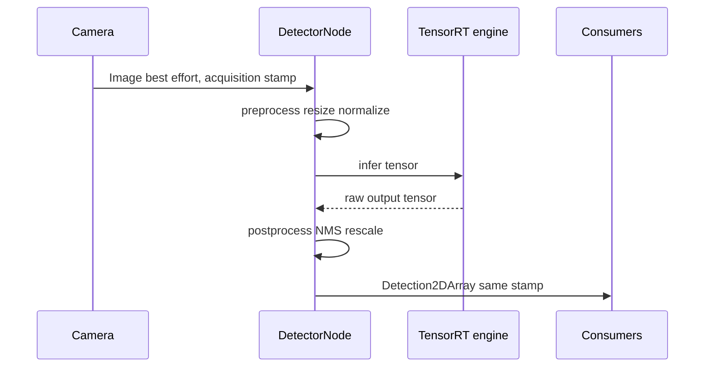
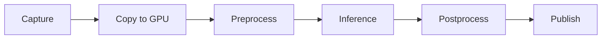

# Lecture 2 — TensorRT, Quantization, the ROS2 Node, and the Latency Budget

> **Duration:** ~2 hours of reading + hands-on.
> **Outcome:** You can build a TensorRT engine from ONNX, explain what FP16 and INT8 quantization buy and cost, choose the right edge runtime for your hardware, wrap an engine in a ROS2 node that publishes `vision_msgs/Detection2DArray`, and profile the full perception cycle against a latency budget — finding the real bottleneck instead of guessing.

Lecture 1 got you a portable ONNX model and proved it matches PyTorch. This lecture makes it *fast* and *deployed*. If you remember one sentence:

> **The latency budget is a first-class artifact. You compile for the specific accelerator, quantize as far as accuracy allows, wrap the engine in a node that publishes the standard detection message, and then you profile the *whole cycle* — because the model's inference time is usually not where your milliseconds went.**

---

## 1. TensorRT: from a portable graph to a fast engine

**TensorRT** is NVIDIA's inference compiler and runtime. It takes your ONNX graph and produces an **engine** — a serialized, heavily-optimized plan tuned for the *exact* GPU you build it on. The optimizations are real and large:

- **Layer fusion.** A `Conv → BatchNorm → ReLU` sequence becomes a *single* fused kernel, eliminating intermediate memory writes. Memory traffic, not arithmetic, is usually the bottleneck on a GPU, so fusion is where much of the speedup comes from.
- **Kernel autotuning.** For each layer, TensorRT benchmarks several candidate CUDA kernels *on your actual hardware* and picks the fastest. This is why the build takes minutes and why the engine is hardware-specific.
- **Precision selection.** It can run layers in FP16 (or INT8) where that's faster and accuracy allows.

The critical consequence: **an engine is hardware-specific. You build it on the target.** An engine built on an RTX 4090 will not (reliably) load on a Jetson Orin Nano — different GPU, different optimal kernels. So the deployment flow is: develop and export ONNX anywhere → copy the ONNX to the Jetson → build the engine *on the Jetson* → ship the engine with the robot. This is the single most common TensorRT confusion ("I built it on my workstation, why won't it load on the robot?"); internalize it now.

### 1.1 Building an engine

The simplest path is `trtexec`, the CLI that ships with TensorRT:

```bash
# Build an FP16 engine from ONNX, on the Jetson, and benchmark it.
trtexec --onnx=yolov8n.onnx \
        --saveEngine=yolov8n_fp16.engine \
        --fp16 \
        --memPoolSize=workspace:2048 \
        --verbose
# trtexec prints the throughput and per-layer timing once built.
```

The Python API gives you programmatic control (needed for INT8 calibration, §3):

```python
import tensorrt as trt

logger = trt.Logger(trt.Logger.WARNING)
builder = trt.Builder(logger)
network = builder.create_network(1 << int(trt.NetworkDefinitionCreationFlag.EXPLICIT_BATCH))
parser = trt.OnnxParser(network, logger)

with open("yolov8n.onnx", "rb") as f:
    if not parser.parse(f.read()):
        for i in range(parser.num_errors):
            print(parser.get_error(i))
        raise RuntimeError("ONNX parse failed")

config = builder.create_builder_config()
config.set_memory_pool_limit(trt.MemoryPoolType.WORKSPACE, 2 << 30)   # 2 GB workspace
config.set_flag(trt.BuilderFlag.FP16)                                 # enable FP16

serialized = builder.build_serialized_network(network, config)
with open("yolov8n_fp16.engine", "wb") as f:
    f.write(serialized)
print("engine built and serialized")
```

The **workspace** is scratch memory TensorRT may use while picking kernels — bigger workspace, more kernel options, potentially faster engine, but you must have the RAM. On an 8 GB Orin Nano you give it a sane couple of gigabytes, not all of it.

---

## 2. FP16: the near-free speedup

The first quantization you reach for is **FP16** (half precision). The Jetson's tensor cores run FP16 roughly twice as fast as FP32, and for almost all detection models the accuracy loss is *negligible* — mAP drops by a fraction of a point, often within measurement noise. **FP16 is the default for edge deployment**: you turn it on with one flag (`--fp16` / `config.set_flag(trt.BuilderFlag.FP16)`) and you get ~2× throughput for free.

Why is it nearly free? Detection networks are robust to the reduced precision — the features that matter survive 16-bit representation. The classic exception is models with large dynamic range in some layers (some normalization, some attention), where a few layers may need to stay FP32; TensorRT handles this automatically (mixed precision) when you also leave FP32 enabled. **Always FP16 unless you have a measured reason not to** — the homework has you confirm the accuracy cost is negligible on your own model.

---

## 3. INT8: the real trade, and the calibration it needs

**INT8** quantization represents weights and activations as 8-bit integers. The speedup is larger than FP16 (smaller data, faster integer math), but unlike FP16 it costs *real* accuracy, and it needs *calibration*.

The problem: mapping a float range to 256 integer levels needs a **scale** per tensor, and choosing that scale badly clips important values or wastes resolution on outliers. **Post-Training Quantization (PTQ)** picks the scales by running a **calibration set** — a few hundred representative images — through the network and measuring the actual activation ranges. The calibration set must *look like your deployment data*; calibrate on COCO and deploy in a dark warehouse and your scales are wrong.

```python
# Sketch of an INT8 calibrator (the data feeder TensorRT calls during build).
import tensorrt as trt

class Int8Calibrator(trt.IInt8EntropyCalibrator2):
    def __init__(self, calib_images, batch_size, cache_path="calib.cache"):
        super().__init__()
        self.data = calib_images           # representative preprocessed images
        self.batch_size = batch_size
        self.idx = 0
        self.cache_path = cache_path
        # ... allocate a device buffer for one batch ...

    def get_batch_size(self):
        return self.batch_size

    def get_batch(self, names):
        if self.idx + self.batch_size > len(self.data):
            return None                    # signal: calibration done
        # copy the next batch to the device buffer, return the device pointer
        batch = self.data[self.idx:self.idx + self.batch_size]
        self.idx += self.batch_size
        # ... cuda memcpy host->device ...
        return [int(self.device_input)]

    def read_calibration_cache(self):
        # reuse a prior calibration if it exists (skip recalibration)
        try:
            with open(self.cache_path, "rb") as f:
                return f.read()
        except FileNotFoundError:
            return None

    def write_calibration_cache(self, cache):
        with open(self.cache_path, "wb") as f:
            f.write(cache)
```

You then set `config.set_flag(trt.BuilderFlag.INT8)` and `config.int8_calibrator = Int8Calibrator(...)`. TensorRT runs the calibration during the build and writes a **calibration cache** so you don't recalibrate every build.

**The honest trade:** INT8 typically costs a few points of mAP and buys a meaningful latency cut. Whether that's worth it depends on your accuracy floor (§1, Lecture 1). The discipline: produce an **FP32 / FP16 / INT8 mAP-vs-latency table** on *your* data and read it. Sometimes INT8 is the difference between hitting the budget and not; sometimes the accuracy cliff is too steep and FP16 is as far as you go. **Quantization-Aware Training (QAT)** — simulating quantization during training so the model learns to be robust to it — recovers much of the lost accuracy but requires retraining, so it's the move when PTQ's INT8 accuracy isn't good enough and you control the training.

---

## 4. The runtimes, compared

TensorRT is the lowest-latency option *on NVIDIA*. But the robot you have may not be NVIDIA, and Path-B learners run on CPU. Know the three:

| Runtime | Hardware | When to use |
|---|---|---|
| **TensorRT** | NVIDIA GPU / Jetson | Lowest latency on NVIDIA; the Path-A edge default. Engine is hardware-specific. |
| **ONNX Runtime** | CPU, NVIDIA (CUDA/TensorRT EP), Apple (CoreML) | Portable; the Path-B CPU fallback; one ONNX runs everywhere via *execution providers*. |
| **OpenVINO** | Intel CPU / iGPU / NPU | Best on Intel hardware (many industrial robots are Intel-based). |

The portability star is **ONNX Runtime**: the *same* `.onnx` runs on CPU, or on NVIDIA via the CUDA/TensorRT execution providers, or on a Mac via CoreML, by changing one argument:

```python
import onnxruntime as ort

# Path B (CPU) — runs anywhere.
sess = ort.InferenceSession("model.onnx", providers=["CPUExecutionProvider"])

# Path A (NVIDIA) — same model, GPU acceleration via the CUDA provider.
sess = ort.InferenceSession("model.onnx", providers=["CUDAExecutionProvider", "CPUExecutionProvider"])
```

This is why you export to ONNX first (Lecture 1): one portable artifact, many deployment targets. For the *absolute* lowest latency on a Jetson you build a native TensorRT engine; for portability and the Path-B fallback you run the ONNX under ONNX Runtime. The homework has you measure both on your hardware and read the gap.

---

## 5. The ROS2 inference node

Now wrap the engine in a node the robot can use. The pattern is invariant regardless of runtime:

```python
import rclpy
from rclpy.node import Node
from rclpy.qos import qos_profile_sensor_data        # cameras are BEST_EFFORT (Week 5)
from sensor_msgs.msg import Image
from vision_msgs.msg import Detection2DArray, Detection2D, ObjectHypothesisWithPose
from cv_bridge import CvBridge
import numpy as np


class DetectorNode(Node):
    def __init__(self) -> None:
        super().__init__("yolo_detector")
        self.bridge = CvBridge()
        self.engine = load_engine("yolov8n_fp16.engine")     # your runtime wrapper
        # Camera stream: BEST_EFFORT sensor QoS, both ends must match (Week 5 lesson).
        self.sub = self.create_subscription(
            Image, "/camera/image_raw", self.on_image, qos_profile_sensor_data)
        self.pub = self.create_publisher(
            Detection2DArray, "/detections", qos_profile_sensor_data)

    def on_image(self, msg: Image) -> None:
        # CARRY THE ACQUISITION STAMP THROUGH (Week 5 message-design lesson).
        acquired_stamp = msg.header.stamp
        frame_id = msg.header.frame_id

        img = self.bridge.imgmsg_to_cv2(msg, desired_encoding="bgr8")
        tensor = self.preprocess(img)                  # resize, normalize, HWC->CHW
        raw = self.engine.infer(tensor)                # the inference call
        boxes = self.postprocess(raw)                  # NMS + threshold + rescale

        out = Detection2DArray()
        out.header.stamp = acquired_stamp              # NOT now() — acquisition time
        out.header.frame_id = frame_id
        for box in boxes:
            det = Detection2D()
            det.bbox.center.position.x = float(box.cx)
            det.bbox.center.position.y = float(box.cy)
            det.bbox.size_x = float(box.w)
            det.bbox.size_y = float(box.h)
            hyp = ObjectHypothesisWithPose()
            hyp.hypothesis.class_id = str(box.class_id)
            hyp.hypothesis.score = float(box.score)
            det.results.append(hyp)
            out.detections.append(det)
        self.pub.publish(out)
```

Three things this node gets right, all callbacks to earlier weeks:

- **Sensor QoS** (`qos_profile_sensor_data`, `BEST_EFFORT`) on both the image subscription and the detection publication. A `RELIABLE` subscriber against the camera's `BEST_EFFORT` publisher receives *nothing* — the Week 5 silent failure, reproduced on your detector.
- **Acquisition-time stamp.** The detection carries the *image's* stamp, not `now()`. The image went through preprocessing + inference + postprocessing (tens of ms); stamping with `now()` tells every downstream consumer the detection happened tens of ms later than it did, injecting motion error (the Week 5 §3.1 lesson, now load-bearing because your robot is moving).
- **The standard message.** `vision_msgs/Detection2DArray` is what every downstream consumer (the tracker, the BT, rviz2's detection display) understands. Don't invent a custom detection message when this one fits (Week 5 §3.3).


*The node's job is to carry the acquisition stamp through every stage, not just call infer.*

The `bbox.center` is in *pixels*; to get a 3D object you back-project the center with the Week 12 `K` and combine with a depth (Week 14). That chain — pixel box → ray → 3D object — is the bridge from this week's 2D detections to the Week 16 fused 3D perception.

### 5.1 The Path-B story: same node, CPU runtime

Path-B learners (no Jetson) run the *exact same node* with a CPU runtime. The only thing that changes is `load_engine` — instead of a TensorRT engine you load the ONNX under ONNX Runtime's `CPUExecutionProvider`:

```python
import onnxruntime as ort
import numpy as np

class OrtRuntime:
    def __init__(self, onnx_path, provider="CPUExecutionProvider"):
        self.sess = ort.InferenceSession(onnx_path, providers=[provider])
        self.input_name = self.sess.get_inputs()[0].name

    def infer(self, tensor: np.ndarray) -> np.ndarray:
        return self.sess.run(None, {self.input_name: tensor})[0]
```

The node logic, the QoS, the stamping, the message — all identical. What differs is the *number* in the latency budget: a YOLOv8n that runs in 11 ms on an Orin Nano FP16 might take 60–120 ms on a laptop CPU. **That's fine — Path B documents the latency it gets and the hardware target it would deploy on.** The skill (export, wrap, stamp, profile, budget) is identical across paths; only the millisecond count moves. This is the whole reason the course insists on the ONNX-first export: one artifact, and the deployment target is a runtime choice, not a rewrite.

### 5.2 The async trap: don't block the executor

One subtlety that bites real inference nodes: inference is *slow* relative to the camera's frame interval. If the camera publishes at 30 Hz (33 ms/frame) but your cycle takes 50 ms, frames pile up. Worse, if the inference call blocks the single-threaded executor's callback, the node stops processing *everything else* (TF, parameters) while it infers. The fixes, all from Week 4: run the inference subscription in its own **callback group** under a **multi-threaded executor**, and use the camera's `BEST_EFFORT` + small-depth QoS so stale frames are *dropped*, not queued (Week 5). A detector that processes the freshest frame and drops the backlog is correct; one that processes a growing queue of stale frames is the "the robot acted on a detection from two seconds ago" bug. The QoS and executor lessons from Phase 1 are not background — they're what makes a real-time inference node real-time.

---

## 6. Profiling: where did the milliseconds actually go?

Here is the lesson that separates "I deployed a model" from "I deployed a model *that hits the budget*." When you measure the full perception cycle, the **model's inference time is frequently not the bottleneck.** The cycle is:

```
capture → copy to GPU → preprocess → INFERENCE → postprocess → publish
```


*Every stage in the perception cycle is a suspect until you time it — not just inference.*

and any of those stages can dominate. The classic surprises:

- **Preprocessing** (resize to 640×640, normalize, HWC→CHW reorder, host→device copy) done in slow Python/NumPy can eat *more* time than the FP16 inference. The fix is to do it on the GPU (CUDA preprocessing) or with vectorized ops.
- **Postprocessing** (NMS on thousands of candidate boxes) can spike, especially in pure Python. This is when RT-DETR's NMS-free design (Lecture 1 §2.2) earns its place.
- **The host↔device copy** of the image and results — pure memory traffic — is invisible until you profile it.

So you instrument *each stage*:

```python
import time

def timed_cycle(node, img):
    t0 = time.perf_counter()
    tensor = node.preprocess(img)
    t1 = time.perf_counter()
    raw = node.engine.infer(tensor)
    t2 = time.perf_counter()
    boxes = node.postprocess(raw)
    t3 = time.perf_counter()
    print(f"preprocess {1e3*(t1-t0):.1f} ms | infer {1e3*(t2-t1):.1f} ms | "
          f"postprocess {1e3*(t3-t2):.1f} ms | total {1e3*(t3-t0):.1f} ms")
```

For the GPU-internal view, **`nsys`** (Nsight Systems) and **`trtexec --dumpProfile`** show per-layer and per-kernel timing, the host↔device copies, and the gaps where the GPU sat idle waiting for the CPU. Reading an `nsys` timeline is the edge-perception equivalent of reading `ros2 topic info -v` — it turns "it feels slow" into "the host-to-device copy is 6 ms because I'm not using pinned memory."

### 6.1 The latency budget as an artifact

The deliverable that ties it together is a **latency block diagram** — a Gantt-style breakdown of where every millisecond goes, with the budget marked:

```
end-to-end perception cycle (640x480, Orin Nano, YOLOv8n FP16):
  capture+copy : 3.1 ms  ▓▓▓
  preprocess   : 4.8 ms  ▓▓▓▓▓        <- optimize this next
  inference    : 11.2 ms ▓▓▓▓▓▓▓▓▓▓▓
  postprocess  : 2.4 ms  ▓▓
  publish      : 0.6 ms  ▓
  TOTAL        : 22.1 ms ->  WITHIN 30 ms budget  (45 FPS)
```

This diagram is a *portfolio artifact* (the syllabus calls it out for the Week 16 midterm and the Week 39 edge-optimization week). It's the proof that you don't just *have* a detector — you have a detector whose latency you *understand and can defend*. The Week 16 reviewer will point at it and ask "what's your next optimization?" and the diagram answers: the longest bar that isn't inference.

### 6.2 The optimization order: cheapest wins first

When the budget is blown, attack it in cost-effectiveness order, not randomly:

1. **FP16** if you haven't already — one flag, ~2× inference, near-zero accuracy cost. Always do this first.
2. **GPU/vectorized preprocessing** — if preprocessing is a tall bar, move the resize/normalize/reorder off slow Python. Often the single biggest win because nobody profiles preprocessing.
3. **A smaller model** — drop from YOLOv8s to YOLOv8n if accuracy allows. Re-check the accuracy floor.
4. **Pinned memory / async copy** — overlap the host↔device transfer with compute so the copy isn't on the critical path.
5. **INT8** — the heavy hammer, with the accuracy cost; reach for it when FP16 + the above still miss the budget.
6. **An NMS-free detector** — if postprocessing (NMS) dominates, switch to YOLOv10/RT-DETR.

Notice that *most* of these are not "use a fancier model" — they're profiling-driven fixes to stages people forget exist. That's the whole point of §6: you can't optimize what you haven't measured, and the measurement usually points somewhere other than the model. A robotics engineer who reaches for INT8 before profiling preprocessing is optimizing blind.

---

## 7. The mistakes that break a first edge deployment

These account for nearly every "it's slow" or "it's wrong" on the robot:

1. **Building the engine on the wrong machine.** An engine built on a workstation GPU won't load on the Jetson. *Fix:* build on the target (§1).
2. **`RELIABLE` QoS on the camera subscription.** The camera publishes `BEST_EFFORT`; a `RELIABLE` subscriber gets nothing — the Week 5 silent failure. *Fix:* `qos_profile_sensor_data` on both ends.
3. **Stamping with `now()`.** Injects tens of ms of motion error downstream. *Fix:* carry the image's acquisition stamp (§5).
4. **Blocking the executor on inference.** A slow inference call in the default callback group stalls the whole node. *Fix:* own callback group + multi-threaded executor (§5.2).
5. **Profiling only inference.** Optimizing the 11 ms inference while a 20 ms preprocessing stage is the real problem. *Fix:* profile every stage (§6).
6. **INT8 without representative calibration.** Calibrating on the wrong data gives wrong scales and a big accuracy drop. *Fix:* calibrate on images from the robot's own camera/scene (§3).

Each has a distinct symptom — engine won't load, no detections, laggy downstream, periodic stalls, wrong stage optimized, INT8 accuracy cliff. As in every week of this phase, the skill is mapping symptom → cause fast.

---

## 8. Recap

You should now be able to:

- Build a TensorRT engine from ONNX (`trtexec` or the Python API), and explain layer fusion, kernel autotuning, and why an engine is hardware-specific (build it on the target).
- Turn on FP16 as the near-free edge default, and explain why it costs almost no accuracy.
- Quantize to INT8 with a representative calibration set, explain PTQ vs QAT, and report the latency win against the accuracy cost honestly.
- Choose between TensorRT, ONNX Runtime, and OpenVINO by the hardware you actually have, and run the same ONNX under different execution providers.
- Build a ROS2 detection node with sensor QoS, acquisition-time stamps, and `vision_msgs/Detection2DArray` — applying the Week 5 lessons on a learned model.
- Profile the full cycle, find the real bottleneck (often *not* inference), and produce a latency-budget block diagram you can defend.

Next: the exercises walk the path — export and verify, benchmark the precisions, and build the node. Continue to [the exercises](../exercises/README.md).

---

## References

- NVIDIA — TensorRT Developer Guide: <https://docs.nvidia.com/deeplearning/tensorrt/latest/getting-started/quick-start-guide.html>
- NVIDIA — TensorRT INT8 / calibration: <https://docs.nvidia.com/deeplearning/tensorrt/latest/inference-library/work-with-int8.html>
- ONNX Runtime — execution providers: <https://onnxruntime.ai/docs/execution-providers/>
- `vision_msgs` (Detection2DArray): <https://github.com/ros-perception/vision_msgs>
- NVIDIA Nsight Systems (`nsys`): <https://developer.nvidia.com/nsight-systems>
- NVIDIA Isaac ROS (accelerated perception nodes): <https://nvidia-isaac-ros.github.io/>
