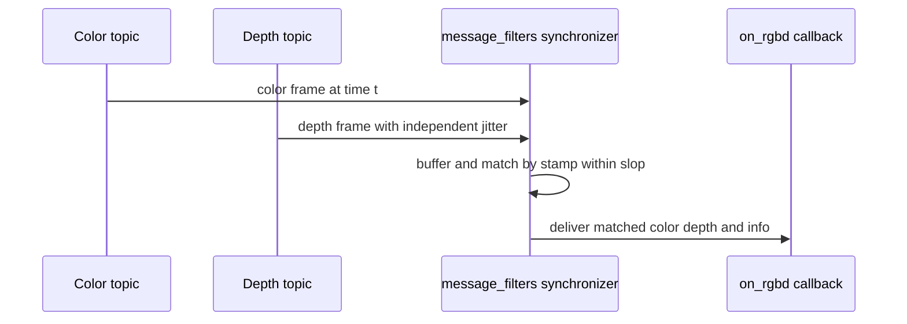
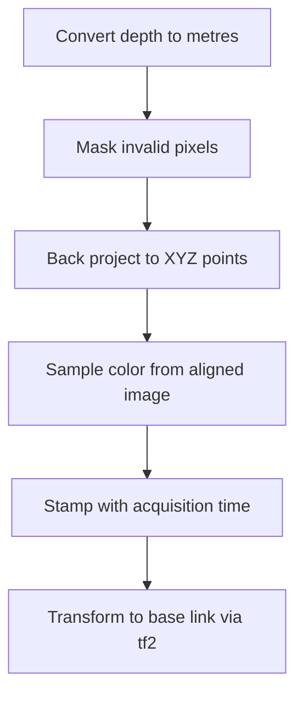

# Lecture 2 — RGB-D Bring-up, Projection, Synchronization, and Reading the Lie

> **Duration:** ~2 hours of reading + hands-on.
> **Outcome:** You can bring up an RGB-D camera in ROS2 with correct QoS, synchronize color and depth, project depth into a metric point cloud by hand and verify it against `depth_image_proc`, apply the post-processing filter chain, and read a confidence map to find fabricated depth.

Lecture 1 was the physics: how triangulation produces a depth image and how it lies. This lecture is the engineering: how that depth image arrives in ROS2, how you turn it into a metric 3D measurement, and how you separate the depth you can trust from the depth the camera invented. Four parts: (1) the topic family and QoS, (2) synchronization, (3) projection to a point cloud, (4) filtering and reading the confidence map.

---

## Part 1 — The RGB-D topic family

Bring up a RealSense D435i with the standard launch:

```bash
ros2 launch realsense2_camera rs_launch.py \
  enable_depth:=true enable_color:=true enable_sync:=true \
  align_depth.enable:=true pointcloud.enable:=true \
  enable_gyro:=true enable_accel:=true unite_imu_method:=2
```

and you get a topic family that confuses everyone the first time. Here is the map, with the encoding and the correct QoS for each — because a depth camera is *four or five sensor streams*, and Week 5's rule applies to every one: sensor streams are `BEST_EFFORT`, and a `RELIABLE` subscriber against them silently receives nothing.

| Topic | Type | Encoding / contents | QoS class |
|---|---|---|---|
| `/camera/color/image_raw` | `sensor_msgs/Image` | `rgb8` color | sensor (`BEST_EFFORT`) |
| `/camera/color/camera_info` | `sensor_msgs/CameraInfo` | color intrinsics `K`, distortion | sensor |
| `/camera/depth/image_rect_raw` | `sensor_msgs/Image` | **`16UC1`, millimetres** | sensor |
| `/camera/depth/camera_info` | `sensor_msgs/CameraInfo` | depth intrinsics `K` | sensor |
| `/camera/aligned_depth_to_color/image_raw` | `sensor_msgs/Image` | depth resampled into the *color* frame | sensor |
| `/camera/depth/color/points` | `sensor_msgs/PointCloud2` | the driver's colored cloud | sensor |
| `/camera/imu` | `sensor_msgs/Imu` | the on-camera IMU | sensor |

Three things to burn in:

**The depth encoding is `16UC1` in *millimetres*.** A pixel value of `1500` means 1.5 metres. The other common encoding, `32FC1`, is *metres* as a float. If you read a `16UC1` image as though it were metres, every depth is 1000× too large; if you read `32FC1` as `16UC1`, it's nonsense. This is the single most common RGB-D unit bug, and it's the one planted in the challenge. **Always read `image.encoding` and branch on it** — never assume.

**The invalid sentinel is `0` (for `16UC1`) or `NaN` (for `32FC1`).** Zero is not "0 metres away"; it is "no measurement here" (a hole — glass, black, occluded, out of range). You must mask these before projecting, or you'll put a wall of fake points at the camera origin.

**The optical frame is rotated.** `camera_color_optical_frame` follows REP 103: **+z forward (into the scene), +x right, +y down.** Your robot's `base_link` is +x forward, +z up. The static transform between them (published by the driver's URDF) rotates ~90° about two axes. If you forget it, the cloud appears lying on its side in rviz2 with the scene going "up" instead of "forward" — the canonical "my point cloud is sideways" bug, and it's a missing or wrong optical-frame TF every time.

### 1.1 Path B: the simulated RGB-D camera

No physical camera? Add a depth/RGBD sensor to your week-3 robot's URDF (the Gz Sim `RgbdCamera` system) and bridge it with `ros_gz_image`. It publishes the *same* `sensor_msgs/Image` + `CameraInfo` topics, in the same `16UC1`/`32FC1` encodings, in an optical frame. Everything in this lecture — synchronization, projection, the filter math — is identical; only the bring-up command differs. The one thing sim *doesn't* give you for free is realistic depth noise and the glass/specular failures (sim depth is too clean), which is why the challenge ships a recorded real bag for the failure-diagnosis half.

---

## Part 2 — Synchronization: why "the latest of each" is a bug

You want to color a point cloud: for each depth pixel, look up the color pixel at the same place and paint the 3D point. Naïvely, you'd subscribe to color and depth separately and, whenever you get a depth frame, grab the *most recent* color frame. **This is wrong, and the error is proportional to how fast the scene moves.**

Color and depth are captured by different sensors at slightly different times, and the two ROS topics arrive with independent jitter. If you pair a depth frame from time `t` with the latest color frame from time `t − 30 ms`, then on a moving object the color is painted onto where the object *was* 30 ms ago, not where the depth says it *is*. You get a cloud with the red cup's color smeared onto the empty space the cup just left.

The fix is `message_filters` — ROS2's time-synchronization library. It buffers messages from multiple topics and only fires your callback when it has a *matched set* whose timestamps agree.


*The synchronizer withholds the callback until a matched, time-aligned set exists.*

```python
import message_filters
from sensor_msgs.msg import Image, CameraInfo
from rclpy.qos import qos_profile_sensor_data

# Subscribers MUST use the sensor QoS — depth/color are BEST_EFFORT (Week 5).
color_sub = message_filters.Subscriber(node, Image, "/camera/color/image_raw",
                                       qos_profile=qos_profile_sensor_data)
depth_sub = message_filters.Subscriber(node, Image, "/camera/aligned_depth_to_color/image_raw",
                                       qos_profile=qos_profile_sensor_data)
info_sub  = message_filters.Subscriber(node, CameraInfo, "/camera/color/camera_info",
                                       qos_profile=qos_profile_sensor_data)

# ApproximateTime: align messages whose stamps are within `slop` seconds.
sync = message_filters.ApproximateTimeSynchronizer(
    [color_sub, depth_sub, info_sub], queue_size=10, slop=0.02)  # 20 ms slop
sync.registerCallback(on_rgbd)

def on_rgbd(color_msg, depth_msg, info_msg):
    # All three are time-aligned to within 20 ms. NOW you can fuse them.
    ...
```

Two synchronizer policies:

- **`ExactTime`** — only matches messages with *identical* timestamps. Use it when the producer guarantees a shared stamp (a single driver that stamps color and depth with the same time, as `enable_sync:=true` on the RealSense does). Stricter, no false pairs.
- **`ApproximateTime`** — matches messages whose stamps are within `slop` seconds, using an adaptive algorithm that minimizes the time spread of each matched set. Use it when the streams have independent stamps. The `slop` is the maximum tolerated stamp difference; set it smaller than one frame period (e.g. 20 ms for 30 Hz) so you never pair frames a whole period apart.

The lesson: **two sensor topics are not synchronized just because they're both fast.** If your colored cloud has color "bleeding" off moving objects, you're zipping the latest of each instead of synchronizing. Exercise 1 makes you do it correctly and prove the alignment.

---

## Part 3 — Depth-to-point-cloud projection, by hand

This is the load-bearing skill of the week, and it is four lines of NumPy. Given a depth image where `depth[v, u]` is the metric distance `Z` at pixel `(u, v)`, and intrinsics `(fx, fy, cx, cy)` from the `CameraInfo`, the back-projection (the inverse of the pinhole projection) is:

```
  Z = depth[v, u]
  X = (u − cx) · Z / fx
  Y = (v − cy) · Z / fy
```

That's it. Every 3D point `(X, Y, Z)` in the camera's optical frame is recovered from its pixel and its depth. Vectorized over the whole image (never loop over pixels — a Python loop over 300k pixels runs at ~0.5 Hz):

```python
import numpy as np

def depth_to_points(depth_m: np.ndarray, fx: float, fy: float,
                    cx: float, cy: float) -> np.ndarray:
    """depth_m: HxW float32 metres, invalid pixels are 0 or NaN.
    Returns Nx3 array of (X, Y, Z) points in the optical frame, invalids dropped."""
    h, w = depth_m.shape
    # Pixel coordinate grids (u = column, v = row).
    u = np.arange(w, dtype=np.float32)
    v = np.arange(h, dtype=np.float32)
    uu, vv = np.meshgrid(u, v)                       # both HxW

    z = depth_m
    valid = np.isfinite(z) & (z > 0.0)               # drop holes (0 / NaN)

    x = (uu - cx) * z / fx
    y = (vv - cy) * z / fy

    pts = np.stack((x[valid], y[valid], z[valid]), axis=-1)   # Nx3
    return pts
```

Two non-negotiables in that function:

1. **Convert to metres first.** If the source is `16UC1` millimetres, `depth_m = depth_raw.astype(np.float32) / 1000.0`. Get this wrong and your cloud is 1000× too big — the classic unit bug from Part 1.
2. **Mask invalid pixels.** `valid = isfinite & (z > 0)`. Skip this and the holes (zeros) become a slab of fake points at `Z = 0`, i.e. exactly at the camera, which looks like a wall the robot will never drive through and never understand.

### 3.1 Wrapping it as a `PointCloud2`

A `sensor_msgs/PointCloud2` is a packed binary buffer with a `fields` descriptor. For an XYZ cloud you declare three `FLOAT32` fields at offsets 0, 4, 8 with `point_step = 12`. ROS2 ships a helper, `sensor_msgs_py.point_cloud2.create_cloud_xyz32(header, points)`, that packs an `Nx3` array for you — use it; hand-packing the buffer is a rite of passage you only need to do once. To make it a *colored* cloud (XYZRGB), you add an `rgb` field (a packed `uint32`) and use `create_cloud(header, fields, points)`; the color comes from the *synchronized, aligned* color image (Part 2), indexed at the same `(u, v)` as each surviving depth pixel.

**The header matters.** Set `header.frame_id` to the depth optical frame (`camera_depth_optical_frame` or, if you used the aligned depth, `camera_color_optical_frame`) and `header.stamp` to the *depth image's acquisition stamp* (Week 5 §3.1 — carry the input stamp through, never `now()`). A cloud stamped `now()` after projection lies to tf2 about when the scene was seen, and on a moving robot that's centimetres of error injected for free.

### 3.2 Verify against `depth_image_proc`

You don't ship a hand-rolled projector — `depth_image_proc`'s `point_cloud_xyzrgb` node does this in optimized C++ and handles the alignment register step. But you *build* one by hand this week so you understand exactly what that node does, and then you **verify**: run your projector and `depth_image_proc` on the same frame, transform both clouds into `base_link`, and confirm they agree point-for-point (to floating-point tolerance). If they don't, you've found your bug — almost always a unit error, a `cx/cy` swap, or a row/column (`u`/`v`) transpose. Exercise 2 is exactly this verification.

---

## Part 4 — Filtering and reading the confidence map

A raw depth image is noisy, full of holes, and skirted with flying pixels. The RealSense SDK (and equivalents) ship a post-processing chain. Know what each filter does, because each one trades something away.

### 4.1 The filter chain, in order

1. **Decimation.** Downsample the depth image (e.g. 2× or 3×) by taking a non-zero median over each block. Fewer pixels = less compute downstream, and the median fills small holes. Cost: spatial resolution. Buys: speed and some hole-filling. Almost always worth it for a robot that doesn't need full-resolution depth.

2. **Depth-to-disparity transform.** Convert depth to disparity *before* spatial/temporal filtering, because (Lecture 1 §2) error is more uniform in disparity space than depth space — filtering in disparity respects the `Z²` error structure. Convert back afterward. The SDK does this around the spatial/temporal filters.

3. **Spatial filter (edge-preserving).** A domain-transform / bilateral-style smoothing that averages within smooth regions but *stops at depth edges*, so it reduces `Z²` noise on flat surfaces without smearing object boundaries into the background. Cost: a little edge softening, some flying-pixel reduction. Tune `alpha` (smoothness) and `delta` (the edge threshold).

4. **Temporal filter.** An exponential moving average *across frames*: `depth_t = α·depth_raw + (1−α)·depth_{t−1}`, with a "persistence" control that holds the last valid value over a transient hole. On a **static** scene this dramatically reduces noise (you average out the per-frame jitter). On a **moving** scene it *smears* — the moving object drags a ghost of its previous depth. This is the filter you A/B in Exercise 3, and the lesson is that it is *not free*: great for a stationary camera looking at a static workspace, dangerous for a fast-moving robot.

5. **Hole-filling.** Fill invalid pixels from their neighbours (e.g. "fill from the left" or "fill from nearest valid"). Cost: it *invents* depth where there was none — a filled glass hole now reports a plausible-but-fabricated surface. **Hole-filling is the most dangerous filter for a robot**, because it converts honest "I don't know" into confident "there's a surface here." For navigation/grasping, prefer to *keep the holes* and let downstream logic treat them as unknown, rather than fill them with fiction. Use hole-filling for pretty visualizations, not for safety-relevant geometry.

### 4.2 The trade-off, stated plainly

Every filter buys cleaner-looking depth and costs you either resolution, latency, edge fidelity, or *truth*. The senior stance: **filter for noise (spatial, temporal-on-static), but be extremely conservative about filters that invent data (hole-filling).** A robot that knows where it can't see is safer than a robot whose depth image was cosmetically completed. Quantify it — Exercise 3 measures the noise reduction of the temporal filter with a flatness metric (RMS of a known plane) so you can state the cost/benefit in numbers, not adjectives.

### 4.3 Reading the confidence / validity map

Some cameras (and the SDK) expose a per-pixel **confidence** or **validity** map alongside the depth. Even without one, the invalid sentinel (`0`/`NaN`) *is* a binary validity map — wherever it's invalid, the camera is telling you "no measurement." Reading the lie means:

- **Mask on validity before you trust depth.** The Week 14 mini-project gates its output cloud on confidence: a pixel below the confidence threshold is dropped, not passed downstream as a real point.
- **Recognize the failure signatures (Lecture 1 §5):** a connected region of holes where a glass door is; a flying-pixel skirt off every edge; `Z²` fuzz on far surfaces. The validity map *shows* you the glass hole — the camera knows it can't see the glass; the bug is when *you* don't read that and treat the hole as free space.
- **Threshold by range.** Because of `Z²`, you can apply a *distance-dependent* confidence: trust depth under 1.5 m, treat 1.5–3 m as lower-confidence, drop beyond 3 m for tasks that need millimetre accuracy. This is a one-line `valid &= (z < z_max)` in your projector and it's the difference between a grasp on a real surface and a grasp on `Z²` noise.

---

## Part 5 — Alignment and extrinsics: why color lands on the wrong points

Depth and color come from *physically different sensors* on the camera, separated by a small baseline, each with its own intrinsics. A depth pixel `(u, v)` and the color pixel `(u, v)` therefore see *different* points in the world. To color a depth point correctly you must:

1. Back-project the depth pixel to a 3D point in the *depth* optical frame.
2. Transform it by the depth→color **extrinsic** into the color optical frame.
3. Project it through the *color* intrinsics to find the color pixel.
4. Read that color.

That three-step warp is exactly what `align_depth.enable:=true` does for you, producing `/camera/aligned_depth_to_color/image_raw` — a depth image *resampled into the color frame*, so now depth pixel `(u, v)` and color pixel `(u, v)` *do* correspond. **If you skip alignment and naïvely pair `(u, v)` depth with `(u, v)` color, the color is offset from the geometry by the parallax** — most visible on near objects, where the parallax is largest. The red cup's color paints onto the points just beside it. Always color from the *aligned* depth (or do the warp yourself); never assume raw depth and raw color pixels line up. This is the second-most-common RGB-D bug after the unit error, and it's the one that makes a colored cloud look "almost right but smeared."

---

## 6. The RGB-D debugging decision tree

When your point cloud is wrong, walk this tree before you touch the projection math:

```
Point cloud looks wrong.
│
├─ Is the cloud SIDEWAYS / scene goes up instead of forward?
│   └─ Optical-frame TF missing or wrong. Check the static transform
│      camera_link -> *_optical_frame (REP 103: z-forward). (Part 1)
│
├─ Is everything 1000x too big or too small?
│   └─ Unit bug. 16UC1 is MILLIMETRES; divide by 1000. Read image.encoding. (Part 3)
│
├─ Is there a SLAB of points at the camera origin (Z≈0)?
│   └─ You didn't mask invalid pixels. 0 / NaN are holes, not 0 m. (Part 3)
│
├─ Is the COLOR smeared / offset from the geometry?
│   ├─ On moving objects → not synchronized; use ApproximateTime. (Part 2)
│   └─ On static near objects → not aligned; use aligned_depth_to_color. (Part 5)
│
├─ Do object edges have a floating "skirt"?
│   └─ Flying pixels. Spatial/edge-aware filter; never fully gone. (Lecture 1 §5, Part 4)
│
└─ Are far surfaces noisy/fuzzy?
    └─ Z² error law. Temporal filter on static scenes; range-threshold confidence. (Part 4)
```

Tape this next to the camera-selection table from Lecture 1. Between the two, you can bring up any RGB-D camera and get a metric, right-side-up, correctly-colored cloud — and *know* which parts of it the camera invented.

---

## Part 6.5 — Worked end-to-end: from a depth frame to a colored cloud in `base_link`

Let's put every part together in one pass, because the labs ask for exactly this and the order of operations matters. You have a synchronized matched set (color, aligned depth, color-info) from Part 2. The full path to a colored, body-frame cloud:

```python
import numpy as np
from sensor_msgs_py import point_cloud2
from std_msgs.msg import Header

def rgbd_to_base_link_cloud(color_msg, depth_msg, info_msg, tf_buffer, node):
    # 1. Depth -> metres, branching on encoding (Part 1, Part 3).
    raw = np.frombuffer(depth_msg.data,
                        dtype=np.uint16 if depth_msg.encoding == "16UC1" else np.float32
                        ).reshape(depth_msg.height, depth_msg.width).astype(np.float32)
    if depth_msg.encoding == "16UC1":
        raw = raw / 1000.0
    raw[raw <= 0] = np.nan                        # holes -> NaN (Part 3)

    # 2. Intrinsics from the COLOR info (aligned depth is in the color frame).
    fx, fy, cx, cy = info_msg.k[0], info_msg.k[4], info_msg.k[2], info_msg.k[5]

    # 3. Vectorized back-projection (Part 3), with the valid mask.
    h, w = raw.shape
    uu, vv = np.meshgrid(np.arange(w, dtype=np.float32),
                         np.arange(h, dtype=np.float32))
    valid = np.isfinite(raw) & (raw > 0)
    z = raw[valid]
    x = (uu[valid] - cx) * z / fx
    y = (vv[valid] - cy) * z / fy
    pts = np.stack((x, y, z), axis=-1)

    # 4. Color from the ALIGNED color image at the SAME (u, v) (Part 5).
    color = np.frombuffer(color_msg.data, dtype=np.uint8
                          ).reshape(color_msg.height, color_msg.width, 3)
    rgb = color[valid.nonzero()[0], valid.nonzero()[1]]   # Nx3 uint8

    # 5. Build the cloud in the optical frame, stamped with the ACQUISITION time.
    header = Header()
    header.stamp = depth_msg.header.stamp        # NOT now() (Week 5 §3.1)
    header.frame_id = depth_msg.header.frame_id   # color optical frame
    # (pack pts + rgb into an XYZRGB PointCloud2 with create_cloud)

    # 6. Transform the whole cloud into base_link via tf2 (Week 2), looking up
    #    the transform AT header.stamp so it matches when the scene was seen.
    #    do_transform_cloud(cloud, tf_buffer.lookup_transform(
    #        "base_link", header.frame_id, header.stamp))
    return pts, rgb, header
```

Read the order: convert units, mask, project, color from the *aligned* image, stamp with acquisition time, transform to `base_link` at that stamp. Skip any step and you get a specific, recognizable failure from the decision tree (§6). This function is the spine of the mini-project's `rgbd_node`, and writing it once, correctly, is the whole point of the week.


*The six-step order that turns a depth frame into a trustworthy body-frame cloud.*

## Part 6.6 — Organized vs. unorganized clouds, and why it matters downstream

A subtle but consequential property: an RGB-D camera can publish an **organized** point cloud — one where `height > 1` and the points are laid out in the same 2D grid as the image, so point `(row, col)` corresponds to pixel `(col, row)`. The alternative is an **unorganized** cloud (`height = 1`, a flat list), which is what you get after you drop invalid pixels.

Why care? Two reasons that bite next week:

- **Organized clouds preserve neighbour structure cheaply.** In an organized cloud, a pixel's spatial neighbours are its grid neighbours — so normal estimation, edge detection, and the flying-pixel discontinuity check are fast (look at adjacent cells). In an unorganized cloud you've lost the grid and must build a KD-tree to find neighbours. Week 15's normal estimation and segmentation are faster on organized clouds.
- **Dropping invalids un-organizes the cloud.** The moment you mask out the holes (which you must, Part 3), the grid is broken and the cloud becomes unorganized. So there's a tension: keep it organized (fast neighbours, but you carry NaN holes) or drop the holes (clean, but unorganized). The common resolution: keep the cloud organized through the *image-domain* filters (which want the grid), then un-organize when you hand it to the *point-domain* processing (Week 15's clustering, which builds a KD-tree anyway). Knowing which representation you're in prevents a class of "why is my neighbour search wrong" bugs.

For this week, your projected cloud will be unorganized (you dropped the holes), and that's fine — Week 15's pipeline expects an unorganized cloud and builds its own spatial index. But when you read `depth_image_proc` or a production node and see it operating on an organized cloud, now you know why: it's keeping the grid for cheap neighbour access.

## Part 6.7 — The latency cost of the filter chain

One last practical point that connects to the Week 16 latency budget. Every filter in the chain (Part 4) costs time, and a depth camera at 30 Hz gives you ~33 ms per frame. The chain's costs, roughly, on an Orin Nano at 640×480:

- Decimation (2×): ~1 ms, and it *speeds up* everything after it (4× fewer pixels).
- Spatial filter: ~3–5 ms.
- Temporal filter: ~2 ms.
- Hole-filling: ~2 ms.
- Back-projection (vectorized): ~3 ms.

So a full chain plus projection is ~12–15 ms — a meaningful chunk of a 30 ms perception budget. This is why decimation goes *first* (it makes everything after it cheaper) and why you don't blindly enable every filter: each one you add is latency you spend, and on a tight budget you enable only the filters whose benefit you've *measured* (Exercise 3's flatness metric). "Turn on all the filters for cleaner depth" is a beginner move that quietly blows your latency budget; "enable decimation and the temporal filter because I measured a 2.5× noise reduction for 3 ms, and skip hole-filling because it fabricates geometry" is the senior move. The filter chain is a latency-vs-quality knob, and Week 16 makes you account for every millisecond of it.

## Part 6.8 — Visualizing depth: rviz2, Foxglove, and what each shows you

You debug depth by *looking*, and the two tools you'll live in this week show complementary views. Knowing which to reach for saves you time.

**rviz2** is the in-ROS viewer. For depth work you use three displays: the **PointCloud2** display (your projected cloud, in `base_link` with the TF tree, so you confirm "metric and right-side-up"); the **Image** display (the raw color, to confirm the camera sees the scene); and the **DepthCloud** display (which projects depth+RGB live, a quick sanity check independent of your own projection). rviz2's strength is that it's tied to your robot's TF tree, so it's where you confirm the cloud sits correctly relative to `base_link` and the robot model.

**Foxglove** is the web/desktop dashboard. Its strength for depth is the side-by-side layout: the **3D panel** (the cloud) next to an **Image panel** (the color) next to a second Image panel showing the **depth with a colormap** (near=blue, far=red), so you see the depth *image* and the *cloud* together. This is the fastest way to spot the failures from Lecture 1 §5: a glass hole shows as a black region in the colormapped depth and a missing region in the cloud; the `Z²` noise shows as a crawling far-field in both. Foxglove is also where the mini-project's confidence overlay lives — coloring points by confidence so the trustworthy and the fabricated are visually distinct.

The practical workflow: **Foxglove to diagnose the depth (the colormapped depth image plus the cloud, side by side, reveals the camera's lies), rviz2 to confirm the geometry (the cloud in `base_link` with the robot model, to confirm metric and right-side-up).** A learner who only uses one misses half the picture — the depth image (where holes and noise are obvious) and the 3D cloud (where frame and scale errors are obvious) are different views of the same data, and you want both open. The "metric and right-side-up" promise is checked in rviz2; the "what did the camera invent" question is answered in Foxglove.

## Part 6.85 — Why you preserve the stamp: a second look

It's worth one more pass on stamping, because it's the rule most violated and most consequential. Every message your node produces — the projected cloud, eventually the detections — must carry `header.stamp = the original sensor acquisition time`, threaded through every stage, *never* re-set to `now()`. Three reasons compound:

- **tf2 correctness.** To transform the cloud into `base_link` (or `map`), tf2 looks up the transform *at the cloud's stamp* (time-travel). A `now()` stamp asks for the transform at the wrong time — for where the robot *is*, not where it *was* when it saw the scene — and on a moving robot that's centimetres of error injected silently.
- **Synchronization correctness.** Downstream nodes (the Week 16 fusion) match your output against other streams *by stamp*. A `now()` stamp breaks the matching — your cloud appears to describe "now" when it describes "33 ms ago," and the fusion pairs it with the wrong frame of the other stream.
- **Latency measurability.** The Week 16 latency budget is measured as `publish_time − sensor_stamp`. A `now()` stamp makes that difference ~0, hiding the real latency. You literally cannot measure your pipeline's latency if any stage re-stamps.

So the rule, restated: **stamp at acquisition, preserve through every stage, never `now()`.** It's the same Week 5 §3.1 lesson, and it's load-bearing for three independent reasons that all bite in Week 16. A learner who re-stamps "to be safe" breaks tf2, fusion, and measurement at once — and the failures are silent, which is the worst kind. Carry the stamp; it's the truth about when the world was seen, and three downstream systems depend on it.

## Part 6.9 — The one-sentence summary to carry forward

Compress this lecture into one sentence: **bringing up an RGB-D camera correctly means getting five things right in order — sensor QoS, synchronization, unit conversion, masking, and alignment — and any one of them done wrong produces a specific, recognizable failure that the decision tree (§6) names.** The camera is not hard; it's *unforgiving*, in the sense that each step has exactly one right answer and a silent failure if you get it wrong. Master the order, recognize the failures, and an RGB-D camera goes from "a confusing stream of five topics" to "a metric, trustworthy 3D measurement I can build on" — which is precisely the cloud next week's point-cloud processing assumes, and the foundation the Week 16 fused node stands on.

## 7. Recap

You should now be able to:

- Name the RGB-D topic family, the `16UC1`-millimetres vs `32FC1`-metres encodings, the `0`/`NaN` invalid sentinel, and the correct (`BEST_EFFORT`) QoS for every stream.
- Synchronize color + depth + info with `message_filters` and explain why "the latest of each" smears color on moving objects.
- Project a depth image to a metric `PointCloud2` by hand — convert to metres, mask invalids, vectorized back-projection, stamp with the acquisition time — and verify it against `depth_image_proc`.
- Apply the decimation → spatial → temporal → hole-filling chain, state what each costs, and explain why hole-filling is the dangerous one for a robot.
- Read the confidence/validity map, recognize the glass/flying-pixel/`Z²` signatures, and gate the output cloud on confidence and range.
- Explain why depth and color must be *aligned* via the extrinsic, and what an unaligned cloud looks like.
- Walk the RGB-D debugging tree to diagnose sideways / unit-bug / unmasked / smeared / skirted / fuzzy clouds.

Next: the exercises put all of this on a real (or simulated) RGB-D camera, and the mini-project packages it into a `crunchbot_rgbd` bring-up whose confidence-gated cloud feeds directly into next week's Open3D/PCL processing. Continue to [the exercises](../exercises/README.md).

---

## References

- `realsense-ros` driver (topics, launch args, alignment): <https://github.com/IntelRealSense/realsense-ros>
- `depth_image_proc` (the production point-cloud node): <https://github.com/ros-perception/image_pipeline/tree/rolling/depth_image_proc>
- `message_filters` (time synchronizers): <https://docs.ros.org/en/jazzy/p/message_filters/>
- Intel — Depth post-processing for D400 cameras: <https://dev.intelrealsense.com/docs/depth-post-processing>
- `sensor_msgs_py.point_cloud2` (PointCloud2 helpers): <https://github.com/ros2/common_interfaces/tree/jazzy/sensor_msgs_py>
- REP 103 — optical frames and units: <https://www.ros.org/reps/rep-0103.html>
