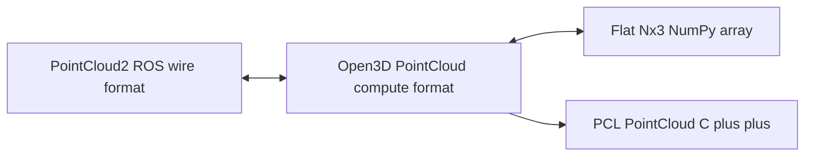
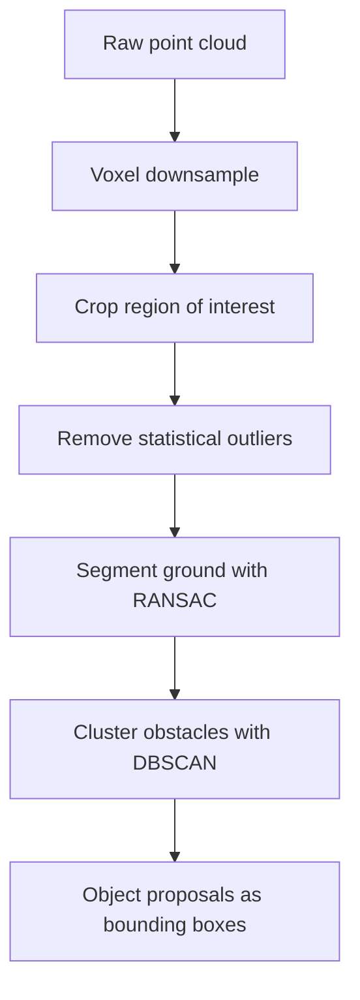

# Lecture 1 — Point Clouds, Filtering, Ground Segmentation, and Clustering

> **Duration:** ~2 hours of reading + hands-on.
> **Outcome:** You can convert a `PointCloud2` to Open3D and back without losing the header, voxel-downsample with a justified voxel size, filter out the flying pixels and stragglers, segment the ground plane with RANSAC, and cluster the remaining points into object proposals with sane tolerances.

If you remember one sentence from this lecture, remember this:

> **Raw point clouds are too big, too noisy, and full of the ground. The pre-processing pipeline — downsample, filter, remove ground, cluster — is not optional polish; it is what turns a million-point firehose into a handful of object proposals a planner can reason about, and every stage exists to make the *next* stage tractable.**

A single LiDAR scan is 100k–2M points at 10–20 Hz. A depth camera is 300k points at 30 Hz. You cannot run ICP, clustering, or a grasp planner on the raw firehose in real time, and you shouldn't want to — most of those points are the floor, the noise, and the duplicate samples of the same surface. This lecture builds the standard pipeline that every mobile-robot 3D perception stack runs, in order, and explains *why* each stage comes where it does.

---

## 1. Point-cloud data structures

You will move a cloud through four representations this week. Know what each is for and how to convert without losing information.

**`sensor_msgs/PointCloud2`** — the ROS2 wire format. A packed binary buffer with a `fields` descriptor (name, offset, datatype per channel), a `point_step` (bytes per point), `width × height`, and a `header` (stamp + frame_id). It can be *organized* (`height > 1`, a 2D grid preserving the image layout — what an RGB-D camera produces) or *unorganized* (`height = 1`, a flat list — what most filters produce). It is the format you publish and subscribe; it is *not* the format you compute on.

**Open3D `PointCloud`** — the compute format for this week. `o3d.geometry.PointCloud` holds `points` (an `Nx3` array of XYZ), optionally `colors` and `normals`. It has every algorithm you need as a method: `voxel_down_sample`, `remove_statistical_outlier`, `estimate_normals`, `segment_plane`, `cluster_dbscan`, and the registration pipeline. There's a newer *tensor* API (`o3d.t.geometry.PointCloud`) that's GPU-capable; the labs use the legacy API for clarity, and the stretch points to the tensor one.

**PCL `PointCloud<PointT>`** — the C++ library most production ROS2 perception nodes use. Templated on the point type (`PointXYZ`, `PointXYZRGB`, `PointNormal`). Same algorithms, C++ API. You should be able to *read* PCL code (the mini-project links a PCL reference node) even though the labs are Open3D.

**Flat `Nx3` NumPy** — the lingua franca. Everything converts to and from it.


*Open3D is the compute format at the center of the conversions; the header must be carried across by hand.*

### 1.1 Converting `PointCloud2` ↔ Open3D without losing the header

The conversion most people get subtly wrong. The danger is dropping the `header` (stamp + frame_id) — Open3D doesn't carry it, so you must hold it aside and reattach it on the way back. Week 5 §3.1: the stamp is the *acquisition* time and it must survive the round-trip, or every downstream consumer is lied to about when the cloud was seen.

```python
import numpy as np
import open3d as o3d
from sensor_msgs_py import point_cloud2
from sensor_msgs.msg import PointCloud2
from std_msgs.msg import Header


def ros_to_o3d(msg: PointCloud2) -> tuple[o3d.geometry.PointCloud, Header]:
    """ROS PointCloud2 -> Open3D cloud + the header you must reattach later."""
    # read_points returns a structured array; pull xyz into an Nx3 float64.
    pts = point_cloud2.read_points_numpy(msg, field_names=("x", "y", "z"),
                                         skip_nans=True)
    pcd = o3d.geometry.PointCloud()
    pcd.points = o3d.utility.Vector3dVector(pts.astype(np.float64))
    return pcd, msg.header        # hold the header aside — Open3D drops it


def o3d_to_ros(pcd: o3d.geometry.PointCloud, header: Header) -> PointCloud2:
    """Open3D cloud + the saved header -> ROS PointCloud2, stamp/frame preserved."""
    pts = np.asarray(pcd.points, dtype=np.float32)
    return point_cloud2.create_cloud_xyz32(header, pts)   # header carries stamp+frame
```

`skip_nans=True` is load-bearing — it drops the invalid pixels (Week 14's holes) that would otherwise become `NaN` points Open3D chokes on. **Always reattach the original header on the way out.**

---

## 2. Voxel downsampling — the first stage, and why

```python
voxel = 0.05  # 5 cm voxels
down = pcd.voxel_down_sample(voxel_size=voxel)
```

A voxel grid overlays the cloud with a 3D grid of cubes of side `voxel`, and replaces all the points in each occupied cube with a *single* representative (their centroid). The effects:

- **It shrinks the cloud.** A 1M-point cloud at 5 cm voxels might drop to 30k points — a 30× speedup for everything downstream, with negligible loss of the geometry that matters at robot scale.
- **It regularizes the spacing.** Raw clouds are dense near the sensor and sparse far away (and a depth camera has uneven density from the projection). The voxel grid makes the density uniform, which is *exactly* what ICP wants — uneven density biases ICP's correspondences toward the dense region.

The trade-off is **resolution vs. speed**. Too large a voxel (20 cm) and you blur away small obstacles and the fine geometry a grasp planner needs. Too small (1 cm) and you barely downsample and ICP is slow. The right voxel size is *the size of the smallest feature you care about, give or take*: 5 cm for mobile-robot navigation, 1–2 cm for tabletop manipulation. The mini-project makes the voxel size a parameter, and you justify your choice.

**Why downsample *first*, before filtering and ICP?** Two reasons. (1) Every later stage is cheaper on fewer points. (2) For ICP specifically, downsampling is not just an optimization — uniform density is a *correctness* aid, because ICP's nearest-neighbour correspondences are more reliable on a regular grid. This is why every ICP tutorial downsamples before registering, and why "I ran ICP on the raw cloud and it's slow and wrong" usually fixes itself with a voxel filter.

---

## 3. Filtering: cropping and outlier removal

After downsampling, you crop to a region of interest and remove the stragglers.

### 3.1 Passthrough / crop box

Keep only the points you care about. A ground robot doesn't care about points above 2 m (the ceiling) or below the floor; a tabletop perception node crops to the table volume.

```python
# Crop to a box: x,y,z bounds in the cloud's frame.
bbox = o3d.geometry.AxisAlignedBoundingBox(
    min_bound=(-5.0, -5.0, -0.2), max_bound=(5.0, 5.0, 2.0))
cropped = down.crop(bbox)
```

Cropping early throws away the irrelevant majority before the expensive stages. A 10-metre-radius crop on a LiDAR scan, or a table-volume crop on a depth cloud, removes most of the points for free.

### 3.2 Statistical outlier removal — the flying-pixel killer

Week 14's flying pixels (the skirts at depth discontinuities) and the LiDAR's sparse stragglers are *isolated* points far from any surface. Statistical outlier removal (SOR) finds them: for each point, compute the mean distance to its `k` nearest neighbours; a point whose mean-neighbour-distance is more than `std_ratio` standard deviations above the global average is an outlier and gets dropped.

```python
clean, kept_idx = down.remove_statistical_outlier(nb_neighbors=20,
                                                   std_ratio=2.0)
```

`nb_neighbors=20` and `std_ratio=2.0` are sane defaults. Tighter `std_ratio` removes more (and risks eating real sparse geometry); looser removes less. This is the stage that turns Week 14's "the camera invented some points" into "and now those points are gone." There's also **radius outlier removal** (drop points with fewer than `n` neighbours within radius `r`) — same goal, different criterion; SOR is the more common choice.

### 3.3 Normal estimation — needed downstream

Point-to-plane ICP (Lecture 2) and plane segmentation both need per-point **surface normals**. Estimate them from the local neighbourhood:

```python
clean.estimate_normals(
    search_param=o3d.geometry.KDTreeSearchParamHybrid(radius=0.1, max_nn=30))
clean.orient_normals_towards_camera_location()   # consistent orientation
```

The normal at a point is the direction perpendicular to the local surface, computed by PCA on the neighbourhood (the smallest-eigenvalue eigenvector). Orienting them consistently (all pointing toward the sensor) matters for point-to-plane ICP and for distinguishing a surface's two sides.

---

## 4. Ground segmentation with RANSAC — the highest-value step

On a mobile robot, the single most useful pre-processing step is **removing the ground**. The floor is the largest single surface in the cloud, it's not an obstacle, and it connects every object to every other object — so until you remove it, Euclidean clustering merges everything into one giant ground-spanning blob. Strip the ground and the obstacles stand apart, ready to cluster.

The ground is a *plane*, and you fit a plane with **RANSAC** — the exact algorithm from Week 12, one dimension up. A plane is `ax + by + cz + d = 0`; three non-collinear points define one. RANSAC:

1. Sample 3 random points, fit the plane through them.
2. Count *inliers* — points within `distance_threshold` of the plane.
3. Repeat `num_iterations` times; keep the plane with the most inliers.
4. The inliers are the ground; the outliers are everything else.

```python
plane_model, inliers = clean.segment_plane(distance_threshold=0.03,
                                            ransac_n=3,
                                            num_iterations=1000)
a, b, c, d = plane_model          # ax + by + cz + d = 0
ground = clean.select_by_index(inliers)
obstacles = clean.select_by_index(inliers, invert=True)
```

`distance_threshold=0.03` (3 cm) says "a point within 3 cm of the fitted plane is ground." Tune it to your floor's roughness and the depth noise. The recovered `(a, b, c)` is the ground's *normal* — on a level floor it's ≈ `(0, 0, 1)`, and checking that is a sanity test (if the normal points sideways, your cloud is in the wrong frame — Week 14's optical-frame bug).

**Where RANSAC plane-fitting fails**, because you must know:

- **Ramps and slopes.** A single plane can't fit a floor that ramps. You either fit *multiple* planes (segment, remove, repeat) or use a more sophisticated ground model.
- **Multiple large planes.** A big wall can have *more* inliers than the floor, so RANSAC removes the wall thinking it's the ground. Constrain the plane normal to near-vertical (`|c| > 0.9`) to force it to pick the *horizontal* plane.
- **Clutter.** A floor covered in objects has few visible ground points; RANSAC may fit a tabletop instead. Cropping to a sensible z-range first helps.

The normal constraint is the fix you'll reach for most: "find the plane whose normal is within 15° of vertical and has the most inliers" reliably picks the floor over a wall. The mini-project does exactly this.

---

## 5. Euclidean clustering — from points to object proposals

After removing the ground, the obstacle points fall into spatially separated groups — one per object. **Euclidean clustering** (DBSCAN-style) groups points that are within a distance `eps` of each other into clusters. Each cluster is an *object proposal*: a candidate "thing" the planner or grasp module can reason about.

```python
labels = np.array(obstacles.cluster_dbscan(eps=0.05, min_points=20))
n_clusters = labels.max() + 1     # -1 is noise (unclustered)
```

- **`eps` (cluster tolerance)** — the maximum gap within a cluster. Points closer than `eps` join the same cluster; a gap larger than `eps` splits them. This is *the* parameter, and it's a trade-off: too large and two nearby objects merge into one (under-segmentation — the cup and the box become one cluster); too small and one object with a sparse region splits into two (over-segmentation). Set it just above the cloud's point spacing after downsampling — a 5 cm voxel cloud wants `eps` around 5–10 cm.
- **`min_points`** — the minimum cluster size. Clusters smaller than this are labeled noise (`-1`). This drops the residual flying pixels and tiny spurious groups. Set it so a real object's smallest expected cluster survives but noise doesn't.

### 5.1 Clusters to bounding boxes

A cluster is a set of points; a planner wants a *box*. For each cluster, compute an axis-aligned bounding box (AABB — cheap, but loose on rotated objects) or an oriented bounding box (OBB — tighter, from the cluster's principal axes):

```python
for k in range(n_clusters):
    cluster = obstacles.select_by_index(np.where(labels == k)[0])
    obb = cluster.get_oriented_bounding_box()
    centroid = cluster.get_center()
    # publish obb.center, obb.extent, obb.R as a detection / marker
```

The OBB gives you a center, an extent (size), and an orientation — exactly what you publish as a `vision_msgs/Detection3D` for the Week 16 fused perception node, and what a grasp planner uses to reason about reachability.

### 5.2 The clustering failure modes, named

- **Under-segmentation.** Two objects within `eps` of each other (or connected by a residual ground point you failed to remove) merge into one cluster. The fix: better ground removal, and `eps` no larger than necessary. This is why ground segmentation comes *before* clustering — a single ground point bridging two objects merges them.
- **Over-segmentation.** A single object with a thin or sparse region (a chair's legs, a partially-occluded box) splits into multiple clusters. The fix: a larger `eps` or a cluster-merging post-step.
- **The sparse-cloud trap.** Far from the sensor (or after aggressive downsampling), the point spacing exceeds `eps` and an object dissolves into noise. Range-dependent `eps`, or not clustering beyond a range, is the fix.

The senior stance: **clustering quality is set by the stages before it.** Garbage in (un-gated flying pixels, un-removed ground) means garbage clusters. The pipeline order — downsample, filter, remove ground, *then* cluster — exists precisely so clustering sees clean, ground-free, regularly-spaced points.

---

## 6. The pipeline, end to end

Here is the whole Lecture-1 pipeline as one function — the spine of the mini-project:

```python
def perceive(pcd: o3d.geometry.PointCloud, voxel=0.05):
    # 1. Downsample: shrink + regularize.
    down = pcd.voxel_down_sample(voxel)
    # 2. Crop to the region of interest.
    down = down.crop(o3d.geometry.AxisAlignedBoundingBox(
        (-5, -5, -0.2), (5, 5, 2.0)))
    # 3. Remove flying pixels / stragglers.
    down, _ = down.remove_statistical_outlier(nb_neighbors=20, std_ratio=2.0)
    # 4. Segment the ground (constrain to near-vertical normal).
    model, inliers = down.segment_plane(0.03, 3, 1000)
    obstacles = down.select_by_index(inliers, invert=True)
    # 5. Cluster the obstacles into object proposals.
    labels = np.array(obstacles.cluster_dbscan(eps=2 * voxel, min_points=20))
    return obstacles, labels, model
```

Five stages, each making the next tractable. The output — labeled obstacle clusters and the ground model — is object proposals a planner can act on, derived from a raw firehose in milliseconds. Exercise 1 builds and verifies each stage; the mini-project wraps it as a ROS2 node.


*The five-stage pipeline funnels a raw point cloud down to object proposals a planner can act on.*

---

## 6.5 — Choosing the parameters: a tuning playbook

The pipeline has maybe eight numbers, and a learner's first instinct is to fiddle them randomly until the output looks right. Don't. Each parameter has a *meaning* and a *principled* starting value tied to a physical quantity. Here's the playbook.

**Voxel size.** Start at the smallest feature you must resolve. Mobile navigation: 5 cm (you don't grasp, you avoid). Tabletop manipulation: 1–2 cm (you grasp a cup rim). Outdoor LiDAR: 10–20 cm (sparse far field, big scene). Rule: voxel ≈ feature size; if downsampling barely reduces the count, the voxel is below the cloud's native spacing and you're wasting compute.

**Crop bounds.** Set from the robot's geometry and task. A ground robot crops `−0.2 < z < 2.0 m` (below the floor to the ceiling). A tabletop node crops the table volume. The crop is free performance — every point you crop is one you don't filter, segment, or cluster.

**SOR `nb_neighbors` / `std_ratio`.** Start at `20` / `2.0`. If real surface is being eaten, loosen `std_ratio` to `2.5–3.0`. If obvious flying pixels survive, tighten to `1.5`. The `nb_neighbors` rarely needs changing — `20` gives a stable mean-distance estimate.

**Ground `distance_threshold`.** Set from the floor's roughness plus the depth noise at the floor's range. A smooth floor seen at 1 m with a RealSense (a few mm of `Z²` noise): `0.03 m`. A rough or distant floor: `0.05 m`. Too tight and you leave a layer of ground points (which bridge clusters); too loose and you eat the bottoms of short objects.

**Ground `ransac_n` / `num_iterations`.** Leave `ransac_n = 3` (a plane needs 3 points). `num_iterations = 1000` is plenty for a dominant plane; raise it only if the ground is a small fraction of the cloud.

**Cluster `eps`.** Set just above the *downsampled* point spacing — for a 5 cm voxel cloud, `eps ≈ 5–10 cm`. This is the parameter you'll tune most, by watching for under/over-segmentation (§5.2). When two objects merge, lower it; when one object splits, raise it.

**Cluster `min_points`.** Set so a real object's smallest expected cluster survives but noise doesn't. For a 5 cm voxel cloud, a 20 cm object has roughly `(0.2/0.05)² ≈ 16` points on a visible face, so `min_points = 10–20` is sane. Far objects (sparser) may need a lower threshold or range-dependent tuning.

The meta-lesson: **every parameter is tied to a physical quantity — a feature size, a noise level, a point spacing — so you set it from that quantity, not by fiddling.** When you defend your perception stack at the Week 16 midterm, "why `eps = 0.07`?" has a real answer ("just above my 5 cm voxel spacing, tuned up slightly to keep the chair legs in one cluster") — and that answer is what separates a learner who tuned by feel from an engineer who tuned by reason.

## 6.6 — PCL vs Open3D: the same algorithms, two ecosystems

The labs use Open3D, but production ROS2 perception nodes overwhelmingly use **PCL** (the Point Cloud Library), so you must be able to read it. The mapping is one-to-one — the *algorithms* are identical, only the API differs:

| Operation | Open3D | PCL |
|---|---|---|
| Voxel downsample | `pcd.voxel_down_sample(0.05)` | `pcl::VoxelGrid<PointXYZ>` |
| Statistical outlier | `pcd.remove_statistical_outlier(20, 2.0)` | `pcl::StatisticalOutlierRemoval` |
| Normal estimation | `pcd.estimate_normals(...)` | `pcl::NormalEstimation` |
| RANSAC plane | `pcd.segment_plane(0.03, 3, 1000)` | `pcl::SACSegmentation` (`SACMODEL_PLANE`) |
| Euclidean cluster | `pcd.cluster_dbscan(eps, min_points)` | `pcl::EuclideanClusterExtraction` |
| ICP | `o3d.pipelines.registration.registration_icp` | `pcl::IterativeClosestPoint` |

Two practical differences worth knowing. First, **PCL is C++ and templated on the point type** (`PointXYZ`, `PointXYZRGB`, `PointXYZRGBNormal`), so a PCL node declares its point type up front and the compiler enforces it; Open3D's Python cloud carries optional `colors`/`normals` arrays. Second, **PCL integrates with `pcl_ros` / `perception_pcl`**, which gives you `PointCloud2` ↔ PCL conversion and nodelets that run in the same process (no serialization) — which matters for the Week 16 latency budget. Open3D is faster to prototype in (Python, clean API); PCL is what ships when every millisecond counts and the node lives in C++.

For C24, you prototype in Open3D this week and the mini-project; if you go deeper into production robotics, you'll re-implement the hot path in PCL for the latency. The skill that transfers is the *pipeline and the parameters* — those are library-independent. Read a PCL perception node and you'll recognize every stage from this lecture; that recognition is the point of knowing both.

## 6.7 — When the pipeline isn't enough: a note on learned 3D perception

Everything in this lecture is *classical* 3D perception — geometric algorithms, no learning. In 2026 there's a parallel learned stack you should know exists, even though C24's perception phase teaches the classical foundation first (the same way Week 12 taught classical CV as "the floor under your learned model").

The learned alternatives: **point-cloud networks** (PointNet++, and the sparse-convolution networks like MinkowskiNet / SpConv) that segment and classify clouds end-to-end; **3D object detectors** (CenterPoint, PV-RCNN) that output oriented boxes directly from a LiDAR scan, replacing your ground-segment-then-cluster pipeline; and **learned registration** (DeepGMR, learned feature descriptors) that replace FPFH. They're more robust on cluttered or ambiguous scenes where classical clustering under/over-segments.

So why teach the classical pipeline? Three reasons, the same as Week 12's argument for classical CV. **It's the floor under the learned stack** — a learned detector still voxelizes and still benefits from ground removal, and you can't debug it without understanding the geometry. **It's interpretable** — when classical clustering merges two objects, you know exactly why (`eps` too large, ground left in); when a network mislabels, the failure is opaque. **It's cheap and deterministic** — no GPU, no training data, no inference latency, which matters on a tight edge budget. The senior stance: use classical 3D perception where the geometry is clean and the latency budget is tight (most of a mobile robot's world), reach for the learned stack where the scene is cluttered and ambiguous (a bin of tangled parts), and *always* understand the classical pipeline because it's what you fall back to and debug against. This week builds that floor.

## 6.8 — Normal estimation, in more depth, because two stages depend on it

Two stages of the pipeline — point-to-plane ICP (Lecture 2) and plane segmentation — depend on per-point normals, and normal estimation is subtle enough to get wrong, so it earns a closer look.

The normal at a point is the direction perpendicular to the local surface. You estimate it from the point's neighbourhood: gather the `k` nearest neighbours (or all neighbours within a radius), fit a plane to them by **principal component analysis**, and the normal is the eigenvector of the neighbourhood's covariance matrix with the *smallest* eigenvalue — the direction of least variance, which is "out of the surface."

```python
clean.estimate_normals(
    o3d.geometry.KDTreeSearchParamHybrid(radius=0.1, max_nn=30))
```

Two parameters, both consequential:

- **The search radius / `max_nn`.** Too small a neighbourhood and the normal is dominated by noise (a few jittery points define a wobbly plane); too large and the normal is *smoothed across* real surface detail (a sharp edge gets a rounded-off normal). The radius should be a few times the point spacing — large enough to average out noise, small enough to respect the geometry. For a 5 cm voxel cloud, a 10–15 cm radius is sane.
- **Orientation consistency.** PCA gives the normal's *direction* but not its *sign* — the smallest-eigenvalue eigenvector points either into or out of the surface, arbitrarily. For point-to-plane ICP and for distinguishing a surface's two sides, you need consistent orientation. `orient_normals_towards_camera_location()` flips every normal to point toward the sensor (the side you can see), which is the right convention for a single-viewpoint scan.

Why this matters beyond "ICP needs it": **inconsistent or noisy normals are a silent cause of bad point-to-plane ICP.** If half your target normals point the wrong way, the point-to-plane cost is minimizing distance to the *wrong* side of the surface, and ICP converges to a subtly wrong transform with decent-looking fitness. When point-to-plane ICP misbehaves and the cloud looks fine, "are my normals estimated and consistently oriented?" is the second question (after "did I downsample?"). The mini-project's `test_pipeline.py` checks the ground normal precisely because a wrong normal there is a wrong normal everywhere.

## 6.9 — The cost of getting the pipeline order wrong

It's worth spelling out, concretely, what happens when you violate the pipeline order, because each violation has a distinct, recognizable failure — and recognizing them is half of debugging a 3D perception stack you didn't write.

- **Cluster before removing ground → one giant blob.** The ground connects every object; cluster first and DBSCAN walks from one object, through the floor, to the next, merging the whole scene into one cluster (plus maybe a few isolated specks). Symptom: `cluster_dbscan` returns one huge cluster. Fix: remove the ground first.
- **Cluster before downsampling → slow and over-segmented.** On a raw dense cloud, clustering is slow (a million points), and the uneven native density means far objects (sparse) over-segment while near objects (dense) are fine. Symptom: the pipeline crawls and far objects fragment. Fix: downsample first for uniform density and speed.
- **Segment ground before filtering outliers → a tilted ground plane.** Flying pixels and stragglers are outliers that pull a RANSAC plane fit; with enough of them, the fitted "ground" tilts to accommodate the noise. Symptom: a ground normal that's slightly off-vertical even on a level floor. Fix: remove outliers before fitting the plane.
- **Estimate normals before downsampling → slow and noisy.** Normal estimation on a full-resolution cloud is expensive and the normals are noisier (denser noise). Symptom: a slow pipeline with wobbly normals. Fix: downsample first, estimate normals on the downsampled cloud.

The unifying lesson: **the pipeline order — downsample, crop, filter outliers, remove ground, cluster — is not arbitrary; each stage produces the clean, regular, ground-free input the next stage assumes.** Reorder it and you get a specific, diagnosable failure. When you inherit a 3D perception node that's misbehaving, checking the stage order is often the fastest fix, because a reordered pipeline is a common mistake and its symptoms are distinctive.

## 6.10 — From bounding boxes to a `vision_msgs/Detection3D`

The clustering pipeline ends in oriented bounding boxes, but the *output* of a ROS2 perception node is a message, and the standard one is `vision_msgs/Detection3DArray`. Bridging the two — turning an Open3D OBB into a `Detection3D` — is the seam between your offline pipeline and the live graph, and getting the conventions right matters because Week 16 fuses these detections.

Each cluster becomes one `Detection3D`:

- **The `bbox`** (a `vision_msgs/BoundingBox3D`) carries the OBB: `center` (a `Pose` — position from `obb.center`, orientation from `obb.R` as a quaternion) and `size` (the `obb.extent`, the box's dimensions). This is the *where, how big, and which way*.
- **The `results`** (a list of `ObjectHypothesisWithPose`) carry the class and confidence. From clustering alone you have no class — so a LiDAR-only detection carries a single hypothesis with class `unknown` and a geometric confidence (e.g., based on cluster point count). Week 16's fusion *adds* the YOLO class here.
- **The `header`** carries the stamp (the cloud's acquisition time) and `frame_id` (the frame the cluster is in — ideally `map` after transforming, or the sensor frame with the transform applied downstream).

Two conventions to get right. First, the OBB orientation: Open3D's `obb.R` is a rotation matrix; `vision_msgs` wants a quaternion — convert carefully (a transpose or sign error here rotates every box). Second, the frame and stamp discipline from Week 5: stamp with the cloud's acquisition time, set the frame honestly, so the fusion node can transform the detection to a common frame at the right time. A `Detection3DArray` that's geometrically right but mis-framed or mis-stamped fails Week 16's fusion silently — the boxes land in the wrong place when transformed.

This is the output your `crunchbot_perception3d` mini-project publishes, and it's the input the Week 16 fused node consumes. Getting the OBB→`Detection3D` conversion clean now — right quaternion, right frame, right stamp — is what makes the composition in two weeks "just work" instead of producing a node whose detections are subtly misplaced. The clustering is the interesting algorithm; the message conversion is the unglamorous seam that determines whether the algorithm is *usable* by the rest of the stack.

## 6.105 — Organized clouds and the GPU: a note on scale

One scaling note for when your clouds get large. Everything in this lecture runs comfortably on a CPU for clouds up to a few hundred thousand points after downsampling. But a full-resolution 3D LiDAR or a dense RGB-D cloud can be millions of points, and at that scale two things help.

First, **the voxel grid is your friend at scale** — downsampling a 2M-point cloud to 50k points before anything else is the single biggest speedup, and it's why the pipeline downsamples first. Second, **Open3D's tensor API (`o3d.t.geometry`) and PCL's GPU modules** can offload the heavy stages (nearest-neighbour search, normal estimation, clustering) to the GPU, which matters when the cloud is large and the latency budget is tight (Week 16). You don't need the GPU for this week's labs — the CPU legacy API is clear and fast enough on downsampled clouds — but knowing the GPU path exists is the answer to "how does this scale to a dense LiDAR?" The honest scaling answer: downsample aggressively first (CPU), and reach for the GPU tensor API only if the downsampled cloud is still too large for your budget. Premature GPU offload is complexity you usually don't need; the voxel grid is the optimization you always need.

## 6.11 — The one-paragraph mental model to carry forward

Compress this lecture into one model: **3D perception is a funnel — a firehose of points narrowed, stage by stage, into a handful of object proposals — and each stage exists to make the next one tractable.** Downsampling makes everything cheaper and regularizes the density ICP wants. Cropping throws away the irrelevant majority. Outlier removal kills the fabricated points. Ground segmentation is the highest-value cut, because it separates the obstacles that clustering then groups into objects. The order is the algorithm: violate it and you get a specific, diagnosable failure. Get it right and a million-point cloud becomes a few labeled boxes a planner can act on, in milliseconds.

That funnel is the input to everything downstream — next lecture's registration runs on the downsampled cloud, the Week 16 fused node consumes the object proposals, and the capstone's grasp targets the clusters. A clustering pipeline is only as good as the stages before it, and the stages are only right in the right order. Carry the funnel and the order, and 3D perception stops being "Open3D function calls I copied" and becomes a pipeline you can design, tune, and defend.

## 7. Recap

You should now be able to:

- Move a cloud between `PointCloud2`, Open3D, PCL, and `Nx3` NumPy, reattaching the header (stamp + frame) on the way back.
- Voxel-downsample with a justified voxel size and explain why it speeds up *and* regularizes — and why ICP wants it.
- Crop to a region of interest and remove flying pixels / stragglers with statistical outlier removal.
- Estimate per-point normals for point-to-plane ICP and plane segmentation.
- Segment the ground with RANSAC, recover and sanity-check the plane normal, constrain it to near-vertical, and name where plane-fitting fails.
- Cluster the non-ground points into object proposals, tune `eps` and `min_points`, turn clusters into oriented bounding boxes, and recognize under/over-segmentation.
- Order the pipeline correctly — downsample, filter, remove ground, cluster — and explain why each stage precedes the next.

Next: how to *register* two clouds with ICP, why point-to-plane beats point-to-point, how to tell a real convergence from a confident lie, and how pairwise registration accumulates drift over a sequence. Continue to [Lecture 2 — ICP Registration, Global Registration, and Drift](./02-icp-registration-global-registration-and-drift.md).

---

## References

- Open3D — Point cloud tutorial: <https://www.open3d.org/docs/release/tutorial/geometry/pointcloud.html>
- PCL — Plane segmentation (RANSAC): <https://pcl.readthedocs.io/projects/tutorials/en/master/planar_segmentation.html>
- PCL — Euclidean cluster extraction: <https://pcl.readthedocs.io/projects/tutorials/en/master/cluster_extraction.html>
- Open3D — Geometry API (`voxel_down_sample`, `segment_plane`, `cluster_dbscan`): <https://www.open3d.org/docs/release/python_api/open3d.geometry.PointCloud.html>
- `sensor_msgs_py.point_cloud2`: <https://github.com/ros2/common_interfaces/tree/jazzy/sensor_msgs_py>
- Pomerleau et al. (2015), registration survey: <https://hal.science/hal-01178661/document>
