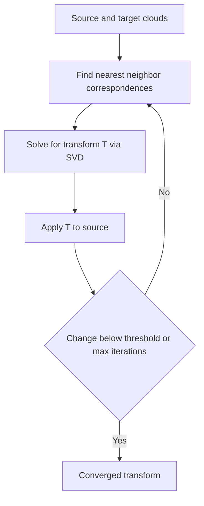
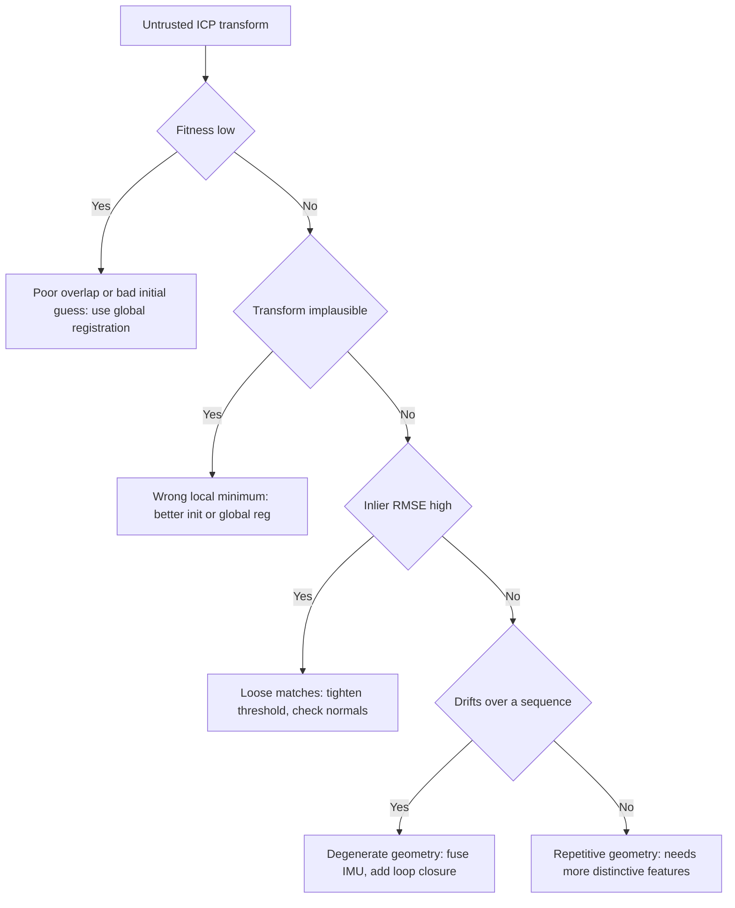

# Lecture 2 — ICP Registration, Global Registration, and Drift

> **Duration:** ~2 hours of reading + hands-on.
> **Outcome:** You can register two clouds with point-to-point and point-to-plane ICP, read fitness and inlier-RMSE to tell a real convergence from a confident lie, diagnose the four ICP failure modes, rescue a failed alignment with FPFH+RANSAC global registration, and quantify the drift that pairwise registration accumulates over a sequence.

Lecture 1 processed a *single* cloud. This lecture is about the *relationship between two clouds* — registration — which is where 3D perception earns its keep. Three parts: (1) ICP, the workhorse; (2) when ICP fails and how to rescue it; (3) drift, the price of chaining registrations.

The sentence to carry through the whole lecture:

> **ICP always returns a transform. The transform is only sometimes correct. The entire skill of registration is telling the two apart — with fitness and inlier-RMSE, not with the absence of an error message.**

---

## Part 1 — ICP: aligning two clouds

You have two overlapping clouds: a `source` (where the robot is now) and a `target` (where it was a moment ago, or a prior map). You want the rigid transform `T` (an SE(3) matrix — Week 1) that best aligns the source onto the target. That transform *is* the robot's motion between the two captures. **Iterative Closest Point** finds it by alternating two steps until it converges:

1. **Correspondence.** For each source point, find its nearest neighbour in the target (via a KD-tree). These are the candidate matches.
2. **Transform.** Solve for the `T` that minimizes the total distance over those correspondences (a closed-form least-squares / SVD step). Apply `T` to the source.
3. **Repeat.** The new correspondences are better; the new `T` is better; iterate until the change is below a threshold or the max iterations hit.

That's it. It's a coordinate-descent on "which points match" and "what transform aligns them," and it provably decreases the error each iteration — to a *local* minimum, which is the whole problem (Part 2).


*ICP alternates correspondence and transform steps until the change stops improving.*

### 1.1 Point-to-point vs point-to-plane

The two flavours differ in step 2 — what distance they minimize.

**Point-to-point ICP** minimizes the sum of squared distances between matched points:

```
  min_T  Σ ‖ T·sᵢ − tᵢ ‖²
```

Simple, needs no normals, and the SVD solution is exact. But it converges *slowly*, because it treats each target point as a hard pin — the source can only slide toward discrete target points, and on a smooth surface that's the wrong constraint (any point *on* the surface should be equally good).

**Point-to-plane ICP** minimizes the distance from each matched source point to the *tangent plane* of the target at its match — using the target's normals (Lecture 1 §3.3):

```
  min_T  Σ ( (T·sᵢ − tᵢ) · nᵢ )²
```

This lets the source *slide along* the target surface, which is exactly the freedom a real surface has. The result: **point-to-plane converges in far fewer iterations and tolerates a larger initial misalignment.** It's the default for any cloud where you can estimate normals (which is most). The cost is needing normals on the target. For LiDAR and RGB-D odometry, point-to-plane (or its cousin GICP) is what you use; pure point-to-point is mostly pedagogical.

```python
import open3d as o3d

threshold = 0.1   # max correspondence distance (metres)
init = np.eye(4)  # initial guess (Part 2 — this matters enormously)

# Point-to-plane (target needs normals estimated first).
result = o3d.pipelines.registration.registration_icp(
    source, target, threshold, init,
    o3d.pipelines.registration.TransformationEstimationPointToPlane(),
    o3d.pipelines.registration.ICPConvergenceCriteria(max_iteration=50))

T = result.transformation     # the 4x4 alignment
print(result.fitness, result.inlier_rmse)
```

### 1.2 Reading the result: fitness and inlier-RMSE

This is the load-bearing skill of the week. `registration_icp` returns a `RegistrationResult` with two numbers that tell you whether it actually worked:

- **`fitness`** — the fraction of source points that found a correspondence within `threshold`. Range 0–1. **High fitness (say > 0.8) means most of the cloud overlapped and matched** — a real alignment. Low fitness (< 0.3) means most points found no match: either the clouds don't overlap, or ICP slid them apart into a wrong minimum.
- **`inlier_rmse`** — the RMS distance of the matched (inlier) correspondences. **Low RMSE (a few cm for LiDAR) means the matched points are tightly aligned.** High RMSE means even the matches are loose.

The verification rule: **a trustworthy ICP result has high fitness AND low inlier-RMSE AND a physically plausible transform.** All three. A 2-metre translation between two consecutive 10 Hz scans is implausible *no matter what* the fitness says — the robot didn't teleport. The "it actually converged" promise from the README is these three checks, every time. ICP returning without an exception means *nothing*; the fitness/RMSE/plausibility triple is the actual test.

```python
def trustworthy(result, max_step_m=0.5) -> bool:
    """A real ICP convergence: high fitness, low RMSE, plausible motion."""
    t = result.transformation[:3, 3]
    step = float(np.linalg.norm(t))
    return (result.fitness > 0.8
            and result.inlier_rmse < 0.05
            and step < max_step_m)
```

---

## Part 2 — When ICP fails, and how to rescue it

ICP descends to the *nearest* minimum of its cost. If the clouds start far apart or the geometry is ambiguous, the nearest minimum is the *wrong* one, and ICP converges confidently to a wrong transform. Four failure modes, each with a tell and a fix.

### 2.1 The bad initial guess (the wrong local minimum)

ICP needs a starting transform `init` that's "close enough" that the nearest-neighbour correspondences are mostly correct. If `init` is the identity but the robot actually rotated 30°, the initial correspondences match the wrong points (a chair leg to the *next* chair leg), and ICP locks onto that wrong matching and converges to a transform that's 30° off — with *decent-looking* fitness, because it did find consistent matches, just the wrong ones.

**The tell:** plausible-looking fitness but an *implausible* transform (a jump too large, a rotation too big for the time elapsed), or a fitness that's mediocre (0.4–0.6) where you expected high overlap.

**The fix:** give ICP a better initial guess. In odometry, use the *previous* motion as the guess (constant-velocity assumption) — the robot probably kept doing what it was doing. When you have no guess at all, use global registration (§2.4) to find one.

### 2.2 Insufficient overlap

ICP can only align the *overlapping* part of two clouds. If the robot moved so far that the two scans share only 20% of their content, fitness is capped low and the alignment is poorly constrained by the small overlap.

**The tell:** low fitness (< 0.3) even from a good initial guess.

**The fix:** register more frequently (smaller motion between scans = more overlap), or accept that you can't register these two directly and need an intermediate.

### 2.3 Degenerate geometry

Some scenes don't *constrain* the transform. A long featureless corridor constrains motion across and up but says nothing about motion *along* the corridor — ICP can slide the source arbitrarily down the hallway and the cost barely changes. A single flat plane (a wall, a floor-only scan) constrains only the direction normal to it. This is the 3D version of "the aperture problem."

**The tell:** ICP converges, fitness looks fine, but the transform's uncertainty is huge in one direction — and over a sequence, the drift spikes exactly in the unconstrained direction (you'll see this on the Newer College corridor sections in the challenge).

**The fix:** you can't fix degenerate geometry with better ICP — the *information isn't there*. You add another sensor (the IMU constrains the unobservable direction — which is *why* the capstone fuses IMU with the 3D perception), or you wait for geometry that constrains it (a doorway, a corner).

### 2.4 The rescue: FPFH + RANSAC global registration

When you have *no* initial guess — two clouds in arbitrary poses — ICP from the identity is hopeless. **Global registration** finds a coarse alignment with no initial guess, by matching *features* instead of nearest neighbours:

1. **Compute FPFH descriptors** (Fast Point Feature Histograms) at each point — a local-geometry signature that's roughly pose-invariant, so the same physical corner has a similar descriptor in both clouds.
2. **Match descriptors** across the two clouds to get candidate correspondences (independent of pose).
3. **RANSAC** over those feature matches: sample a few, compute the transform they imply, count how many other matches agree, keep the best. This yields a *coarse* transform — good enough to seed ICP.
4. **Refine with ICP** from that coarse transform.

```python
# (after downsampling and estimating normals on both clouds)
source_fpfh = o3d.pipelines.registration.compute_fpfh_feature(
    source_down, o3d.geometry.KDTreeSearchParamHybrid(radius=0.25, max_nn=100))
target_fpfh = o3d.pipelines.registration.compute_fpfh_feature(
    target_down, o3d.geometry.KDTreeSearchParamHybrid(radius=0.25, max_nn=100))

coarse = o3d.pipelines.registration.registration_ransac_based_on_feature_matching(
    source_down, target_down, source_fpfh, target_fpfh, mutual_filter=True,
    max_correspondence_distance=0.075,
    estimation_method=o3d.pipelines.registration.TransformationEstimationPointToPoint(False),
    ransac_n=3, criteria=o3d.pipelines.registration.RANSACConvergenceCriteria(100000, 0.999))

# Now seed point-to-plane ICP with the coarse transform.
fine = o3d.pipelines.registration.registration_icp(
    source, target, 0.04, coarse.transformation,
    o3d.pipelines.registration.TransformationEstimationPointToPlane())
```

The mental model: **global registration gets you to the right basin; ICP refines within it.** Global registration is coarse and slow (don't run it every frame); ICP is fine and fast but local. Together they register two arbitrary clouds. Exercise 3 breaks ICP with a bad guess and rescues it exactly this way — and you *feel* the wrong-local-minimum trap, which is the point.

---

## Part 3 — Drift: the price of chaining registrations

You can register two clouds. To get a *trajectory*, you chain: register scan 1→2, 2→3, 3→4, ... and compose the transforms. This is **scan-to-scan odometry**, and it works — for a while. Then it drifts.

### 3.1 Why drift accumulates

Each pairwise registration has a small residual error — a millimetre here, a tenth of a degree there. When you compose `T₁₂ · T₂₃ · T₃₄ · ...`, those errors *compound*. A tiny rotation error early in the sequence rotates the entire rest of the trajectory; a small translation error adds up linearly; the rotation errors make the translation errors grow super-linearly. After 100 scans, a per-scan error of 1 cm and 0.1° can become a metre or more of position error at the end. This is the *exact* same drift you saw with wheel odometry in Week 6 — different sensor, same compounding, same inevitability.

```python
def chain_odometry(clouds):
    """Scan-to-scan ICP odometry. Returns the trajectory (list of poses)."""
    pose = np.eye(4)            # world pose, starts at origin
    trajectory = [pose.copy()]
    prev = preprocess(clouds[0])
    guess = np.eye(4)          # constant-velocity guess, updated each step
    for cloud in clouds[1:]:
        cur = preprocess(cloud)
        result = o3d.pipelines.registration.registration_icp(
            cur, prev, 0.1, guess,
            o3d.pipelines.registration.TransformationEstimationPointToPlane())
        T = result.transformation          # motion from prev to cur
        pose = pose @ T                     # compose into the world pose
        trajectory.append(pose.copy())
        guess = T                           # next guess: assume similar motion
        prev = cur
    return trajectory
```

### 3.2 The drift metric

To *quantify* drift, compare your chained trajectory's final pose to the ground-truth final pose (the dataset provides it), and normalize by the path length:

```
  drift = ‖ estimated_final_position − ground_truth_final_position ‖  /  path_length
```

reported as a percentage (e.g. "0.8% drift over a 120 m trajectory" = ~1 m final error) or as absolute error over the sequence. The challenge has you compute this over a 100-scan sequence and find *where* it spikes — and it'll spike in the degenerate-geometry sections (§2.3), the long corridors where ICP can't constrain along-track motion. Seeing the drift correlate with geometry is the lesson: **ICP odometry is only as good as the geometry it's given.**

### 3.3 What fixes drift: loop closure and pose-graph optimization

Pairwise ICP odometry *will* drift; that's structural. The fix is the same as Week 7's 2D SLAM, lifted to 3D:

- **Loop closure.** When the robot revisits a place (you detect it by matching the current cloud against an earlier one — often with the same FPFH global registration), you get a constraint: "scan 100 is *here* relative to scan 5." That constraint disagrees with the drifted chain, and...
- **Pose-graph optimization.** ...you build a graph of all the pairwise constraints (the sequential ones *and* the loop closures) and find the trajectory that best satisfies all of them at once (the same factor-graph idea from Week 11, GTSAM). The loop closure pulls the accumulated drift back into consistency.

This is precisely what **FAST-LIO2 / LIO-SAM** (the production LiDAR-inertial odometry systems) do: point-to-plane registration for the front-end (your week's work), IMU pre-integration to constrain the degenerate directions (§2.3's fix), and a pose-graph back-end with loop closure to bound the drift. You don't build the full system this week — you build the front-end (registration + chaining + the drift number), *feel* why it drifts, and understand exactly what the back-end adds. That understanding is what you defend at the Week 16 midterm when asked "how does your perception bound drift?"

---

## 4. The registration debugging decision tree

When ICP gives you a bad transform, walk this tree:

```
ICP returned a transform you don't trust.
│
├─ Is fitness LOW (< 0.3)?
│   ├─ Clouds barely overlap → register more often, or you need an intermediate. (§2.2)
│   └─ Bad initial guess → seed with global registration (FPFH+RANSAC). (§2.4)
│
├─ Is fitness OK but the TRANSFORM implausible (too big a jump/rotation)?
│   └─ Wrong local minimum from a bad init → better initial guess / global reg. (§2.1)
│
├─ Is inlier-RMSE HIGH even at decent fitness?
│   └─ Loose matches → tighten the correspondence threshold; check downsampling
│      and normals (point-to-plane needs good normals). (Part 1)
│
├─ Does it converge fine pairwise but DRIFT badly over a sequence?
│   ├─ Drift spikes in corridors/open spaces → degenerate geometry; the info isn't
│   │  there. Fuse IMU; you can't fix it with ICP. (§2.3)
│   └─ Drift grows steadily everywhere → normal accumulation; needs loop closure
│      + pose-graph optimization. (§3.3)
│
└─ Converges but to the WRONG place every time on these two clouds?
    └─ Degenerate or repetitive geometry (identical chairs) → global reg may also
       fail; you need more distinctive features or another sensor. (§2.3, §2.4)
```


*The same debugging tree as a diagram: walk from an untrusted transform down to its fix.*

Tape this next to Lecture 1's pipeline. Between them you can take a raw cloud all the way to a registered trajectory and *know*, at every stage, whether to trust the result.

---

## Part 4.5 — Tuning ICP: the parameters that decide convergence

Like the Lecture-1 pipeline, ICP has a handful of parameters, and getting them wrong is the difference between a clean registration and a confident lie. The four that matter:

**The correspondence distance threshold (`max_correspondence_distance`).** The maximum distance at which a source point and a target point are considered a match. Too large and ICP matches points that aren't really corresponding (across an object gap), pulling toward a wrong alignment. Too small and, from a bad initial guess, *no* points match and ICP can't move. The principled value: a few times the voxel size (a 5 cm voxel cloud wants a threshold around 0.1–0.2 m), tightened as the alignment converges. Production odometry uses a *coarse-to-fine* schedule: a loose threshold first to pull the clouds together, then a tight one to refine.

**The voxel size (the pre-downsample).** Covered in Lecture 1, but it's also an ICP parameter: coarser voxels = faster ICP and a wider basin of convergence (more forgiving of a bad init), but less precise. Finer voxels = slower, tighter, but easier to trap. The coarse-to-fine pattern again: register at a coarse voxel first to get close, then at a fine voxel to refine.

**The max iterations.** ICP usually converges in 10–30 iterations from a good guess. A cap of 50 is generous. If you need hundreds, your initial guess is bad (use global registration) or the geometry is degenerate (no number of iterations fixes that).

**The convergence criteria (`relative_fitness` / `relative_rmse`).** ICP stops when the improvement per iteration falls below these. The defaults are usually fine; the thing to know is that ICP *stops at a local minimum*, and the criteria only control *how precisely* it sits in that minimum — not *which* minimum it found. A tightly-converged result in the *wrong* minimum is still wrong, which is why the fitness/RMSE/plausibility trust test (§1.2) matters more than the convergence criteria.

The coarse-to-fine pattern deserves emphasis because it's how production LiDAR odometry gets both robustness and precision: downsample aggressively and use a loose correspondence threshold to pull the clouds into rough alignment (wide basin, forgiving of a bad guess), then downsample lightly and tighten the threshold to refine (precise, but now you're already in the right basin). One pass of fine ICP from a bad guess fails; coarse-then-fine succeeds. This is the same "get to the right basin, then refine" logic as global registration (§2.4), applied within ICP itself.

## Part 4.6 — A worked drift example: why 1 cm per scan becomes a metre

The compounding in §3.1 is worth making concrete, because "errors accumulate" is vague until you see the arithmetic. Suppose each pairwise registration has a small, *unbiased* error: a translation error with standard deviation 1 cm and a rotation error with standard deviation 0.1° per scan.

**Translation error alone**, if it were the only effect, accumulates as a random walk: after `N` scans the expected position error grows as `√N · 1 cm`. After 100 scans that's `√100 · 1 cm = 10 cm`. Not terrible — random walks grow slowly (as `√N`).

**But rotation error is the killer**, because a rotation error early in the sequence rotates the *entire remaining trajectory*. A 0.1° error at scan 5 tilts everything from scan 5 onward by 0.1°. Over a 100 m path, a persistent 0.5° heading error (the accumulation of many small ones) swings the endpoint by `100 · sin(0.5°) ≈ 0.87 m`. The rotation errors don't just add — they *lever* the translation, so the position error grows *faster* than the random-walk `√N` once heading drift sets in.

This is why heading is the thing you most want to constrain, and why **the IMU is the perfect complement to ICP odometry**: the IMU's gyro measures rotation rate directly and drifts slowly in orientation (Week 9), exactly bounding the error that levers ICP's translation drift. Fuse the IMU's heading with ICP's translation and the compounding is dramatically reduced — which is *precisely* the architecture of FAST-LIO2 / LIO-SAM (§3.3), and precisely why the capstone fuses IMU with the 3D perception. The drift number you measure in the challenge is the *un-fused* front-end's drift; understanding that it's dominated by leveraged heading error is what tells you the IMU (not a better ICP) is the fix.

## Part 4.7 — Scan-to-scan vs scan-to-map: a better front-end

One refinement that bridges your week's work to production odometry. You built **scan-to-scan** odometry: register each scan against the *previous* scan. It's simple but it has a subtle flaw — each registration inherits the noise of a single noisy scan as its reference, so the noise compounds maximally.

The production refinement is **scan-to-map**: register each new scan against an *accumulated local map* (the last `K` scans, merged and downsampled, in the world frame) rather than just the previous scan. The accumulated map is denser and less noisy than any single scan, so each registration is better-constrained, and — crucially — registering against the *map* rather than the *previous scan* breaks the strict frame-to-frame error chain that makes drift compound. Scan-to-map odometry drifts substantially less than scan-to-scan for a modest extra cost (maintaining the local map).

You don't build scan-to-map this week (scan-to-scan is enough to feel the drift and understand the compounding), but you should know it exists and why it's better: it's the difference between your hand-built front-end and a production one, and it's a near-certain "how would you improve this?" question at the Week 16 midterm. The answer — "register against an accumulated local map instead of the previous scan, and fuse the IMU to bound heading drift" — shows you understand not just how to run ICP but how the production systems beat the drift you measured.

## Part 4.8 — ICP under the hood: the SVD step that solves for the transform

You don't need to implement ICP to use it, but understanding the *transform* step (step 2 of §1) demystifies the whole algorithm and is the kind of thing a panel loves to probe. Given a set of corresponding point pairs `(sᵢ, tᵢ)` — source point matched to target point — point-to-point ICP solves for the rigid transform `(R, t)` that minimizes `Σ ‖R·sᵢ + t − tᵢ‖²` in *closed form*, via the SVD:

1. Compute the centroids of the source and target correspondences, `s̄` and `t̄`.
2. Center both sets: `s'ᵢ = sᵢ − s̄`, `t'ᵢ = tᵢ − t̄`.
3. Form the cross-covariance `H = Σ s'ᵢ · t'ᵢᵀ`.
4. Take the SVD: `H = U·Σ·Vᵀ`.
5. The optimal rotation is `R = V·Uᵀ` (with a sign correction on the last column of `V` if `det(R) < 0`, to ensure a proper rotation, not a reflection).
6. The optimal translation is `t = t̄ − R·s̄`.

That's the **Procrustes / Kabsch solution**, and it's exact — given the correspondences, it's the *best possible* rigid transform, in one SVD. The iteration in ICP is *only* because the correspondences themselves are a guess (nearest neighbours), so you alternate: fix the transform, re-find the nearest-neighbour correspondences; fix the correspondences, solve the exact transform; repeat. Each step provably doesn't increase the error, so ICP converges — to the nearest local minimum (§2).

Knowing this tells you two things. First, **ICP's per-iteration transform is optimal; the only error source is the correspondences.** So ICP fails when the correspondences are wrong (a bad initial guess matches the wrong points — §2.1), not because the transform solve is weak. Second, the sign correction in step 5 is why a degenerate configuration (all correspondences coplanar or collinear) can produce a reflection instead of a rotation — a real failure mode on a flat scan. The stretch goal has you implement exactly this; doing it once turns ICP from a black box into a thing you understand, and "explain how ICP solves for the transform" becomes a question you answer cleanly.

## Part 4.9 — Relocalization: registration without a prior, the other use of global registration

Scan-to-scan odometry (§3) is registration with a *good* prior (the previous pose). But there's a second, equally important use of registration where you have *no* prior: **relocalization** — the robot is "lost" (just powered on, or it lost track) and must find where it is on a *map* it built earlier. This is the 3D version of the AMCL kidnapped-robot problem from Week 11.

Relocalization is global registration (§2.4) at scale: extract FPFH features from the current scan, match them against features stored with the map, and RANSAC for the transform that places the current scan onto the map — *with no initial guess*, because the robot doesn't know where it is. Then refine with ICP. The result is the robot's pose on the map, recovered from a single scan.

Two things make relocalization harder than the §2.4 two-cloud case:

- **The search space is the whole map.** Matching against one target cloud is one thing; matching against a kilometre of mapped corridor is another. Production systems use a *place-recognition* front-end (a learned global descriptor like ScanContext, or a vocabulary of features) to first narrow "which part of the map am I probably in," then run global registration only against that region. Brute-force global registration against an entire large map is too slow.
- **Repetitive environments defeat it.** A building of identical corridors gives the same features in many places, so global registration finds *multiple* plausible matches and can't disambiguate — the same degenerate-geometry problem (§2.3), now at map scale. This is why relocalization in a warehouse of identical aisles is genuinely hard and why robots there lean on other cues (fiducials, Wi-Fi, the last known pose).

You don't build relocalization this week, but it's the same machinery — FPFH + RANSAC global registration + ICP refine — pointed at a map instead of a previous scan, and it's the capstone's answer to "what happens when the robot gets lost." Knowing that your week's global-registration tool is *also* the relocalization tool is the kind of connection that makes the perception stack cohere: the same algorithm seeds odometry from a bad guess and recovers a lost robot on a map.

## Part 4.10 — Generalized-ICP (GICP): why production odometry uses it

You'll build with point-to-plane ICP this week, but the registration most modern LiDAR odometry actually ships is **Generalized-ICP (GICP)**, and the one-paragraph explanation of *why* is worth carrying, because it's the natural endpoint of the point-to-point → point-to-plane progression.

Point-to-point ICP treats each point as a hard pin. Point-to-plane (§1.1) models the *target* as locally planar (using its normals), letting the source slide along the target surface. GICP goes one step further: it models *both* clouds as locally planar — it attaches a covariance to each point representing the local surface shape (flat where the surface is planar, elongated along an edge), and minimizes a "plane-to-plane" distance that respects both surfaces' local geometry. The effect: GICP is more robust than point-to-plane on noisy, partially-overlapping LiDAR scans, because it down-weights the directions where the local geometry is uncertain (along an edge, perpendicular to a wall) and trusts the directions where it's well-constrained.

The practical upshot: **point-to-point is pedagogical, point-to-plane is the workhorse, GICP is what ships.** They're a progression of how much local surface structure the algorithm respects — none, the target's, both clouds'. The Open3D and PCL APIs all expose GICP, so swapping it into your pipeline is a one-line change (the stretch goal), and on degenerate or noisy data you'll see it drift less than point-to-plane. Knowing this progression — and being able to say "I used point-to-plane this week, but production LiDAR odometry uses GICP because it models both surfaces' local covariance and is more robust to noise and partial overlap" — is exactly the kind of "how would you improve this?" answer that distinguishes a learner who ran a tutorial from an engineer who understands the design space.

## Part 4.11 — Dynamic objects: the registration assumption you must remember

One assumption underlies all of this week's registration: **the scene is rigid.** ICP aligns two clouds by finding the single transform that best maps one onto the other — which only makes sense if the world *didn't change* between the two captures. A person walking through the scene, a door opening, another robot moving — these violate the rigid-scene assumption, and they corrupt the registration: ICP tries to "explain" the moving points with the transform, pulling the alignment toward the motion of the dynamic object instead of the robot's own motion.

The symptom on a sequence: drift spikes whenever something moves through the scene, especially if the dynamic object is large (a passing truck on KITTI, a person close to the sensor). The dynamic points are a chunk of the cloud that *doesn't* fit the rigid transform, dragging the fitness down and the alignment off.

The production fixes, which you should know exist:

- **Dynamic-point removal before registration.** Detect and remove the moving points (by comparing against the static map, or with a learned dynamic-object segmenter) so ICP only sees the rigid background. This is what production LiDAR odometry does in dynamic environments.
- **Robust loss functions.** Use an M-estimator (Huber, Cauchy) in the ICP cost so the dynamic points, being outliers to the rigid fit, are down-weighted automatically. GICP's covariance weighting helps here too.
- **Sufficient static structure.** If enough of the scene is static (walls, ground, parked cars), the rigid background dominates and the registration survives a few moving objects — which is why ICP works at all on real, mildly-dynamic data.

For this week's labs (mostly static datasets and a synthetic scene), the rigid assumption holds and you don't fight dynamics. But it's a near-certain midterm question — "what breaks your odometry in a real, busy environment?" — and the answer is "moving objects violate the rigid-scene assumption ICP depends on; you remove dynamic points or use a robust loss." Knowing the assumption is knowing the limit, and knowing the limit is what separates running ICP from understanding it.

## Part 4.12 — The one-paragraph mental model to carry forward

Compress this lecture into one model: **ICP turns "two clouds" into "the transform between them," but it's a *local* method that always returns a transform and only sometimes a correct one — so registration is the discipline of seeding it well (a good initial guess, or global registration when you have none) and *verifying* it (fitness, RMSE, plausibility), never trusting the absence of an error.** Chain those transforms and you get odometry; chaining compounds the residual errors into drift, dominated by leveraged heading error, which is why you fuse an IMU and close loops to bound it. That's the whole arc: register, verify, chain, bound.

That arc is the foundation of every odometry and SLAM system you'll meet — your hand-built scan-to-scan front-end is FAST-LIO2's front-end without the IMU and the back-end, and understanding *why* it drifts (compounding, leveraged by heading) is what tells you the IMU and the pose graph are the fix, not a better ICP. The drift number you measure in the challenge is the un-fused front-end's honesty about its own limits; carrying it — and knowing what bounds it — is what you defend at the Week 16 midterm when asked "how does your perception bound drift?"

## 5. Recap

You should now be able to:

- Run point-to-point and point-to-plane ICP, and explain why point-to-plane converges faster and tolerates more (it lets the source slide along the surface).
- Read `fitness` and `inlier_rmse` and apply the three-part trust test (high fitness, low RMSE, plausible transform) — never trusting ICP just because it returned.
- Diagnose the four ICP failures: bad initial guess (wrong local minimum), insufficient overlap, degenerate geometry, and the silent wrong convergence.
- Rescue a no-initial-guess alignment with FPFH + RANSAC global registration to seed ICP.
- Chain pairwise registrations into scan-to-scan odometry, explain why it drifts, and compute the drift metric over a sequence.
- Explain what loop closure and pose-graph optimization add, and how this front-end becomes FAST-LIO2 / LIO-SAM with an IMU and a back-end.
- Walk the registration debugging tree to diagnose any bad transform.

Next: the exercises put all of this on real dataset clouds, and the mini-project wraps the Lecture-1 pipeline plus scan-to-scan ICP into a ROS2 node whose object proposals and odometry feed directly into next week's fused perception node and the Week 16 midterm. Continue to [the exercises](../exercises/README.md).

---

## References

- Open3D — ICP registration tutorial: <https://www.open3d.org/docs/release/tutorial/pipelines/icp_registration.html>
- Open3D — Global registration tutorial (FPFH + RANSAC): <https://www.open3d.org/docs/release/tutorial/pipelines/global_registration.html>
- Besl & McKay (1992), "A Method for Registration of 3-D Shapes" — original ICP.
- Chen & Medioni (1992), point-to-plane ICP.
- Rusu et al. (2009), FPFH: <https://www.cvl.iis.u-tokyo.ac.jp/~oishi/Papers/Alignment/Rusu_FPFH_ICRA2009.pdf>
- Pomerleau et al. (2015), registration survey: <https://hal.science/hal-01178661/document>
