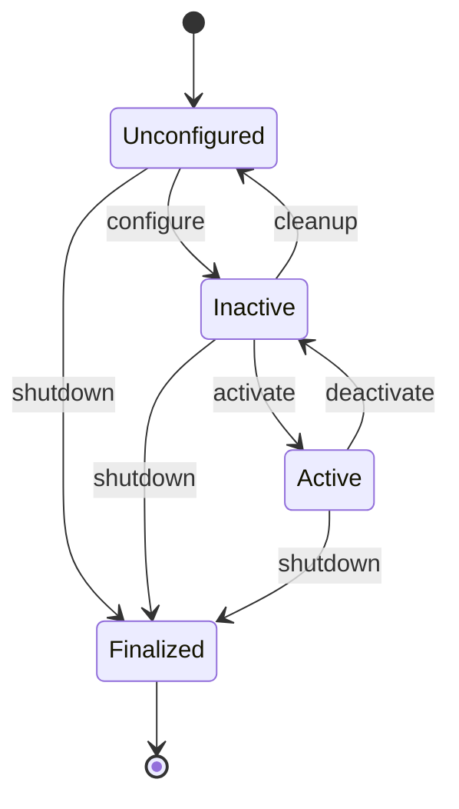
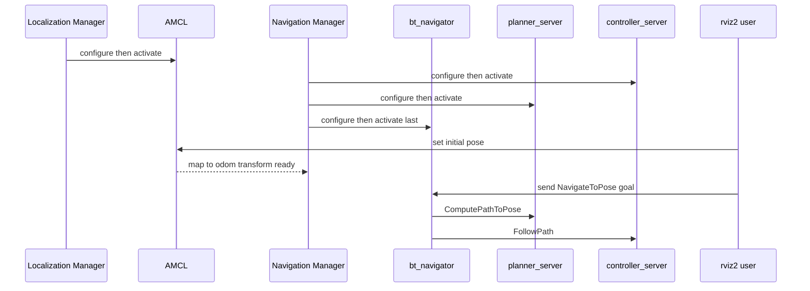

# Lecture 1 — Nav2 Architecture and the Managed-Node Lifecycle

> **Duration:** ~2 hours of reading + hands-on.
> **Outcome:** You can name every server in the Nav2 stack and what it does, explain the managed-node lifecycle and the deterministic bring-up order the lifecycle manager enforces, and tell the global costmap from the local costmap — their frames, rates, and layer stacks — well enough to debug a stack that "comes up but won't navigate."

If you remember one sentence from this entire week, remember this one:

> **Nav2 is not a path planner. It is a navigation *framework* — a set of independently-managed lifecycle servers wired together by a behavior tree, sitting on two costmaps, brought up in a fixed order by a lifecycle manager — and almost every "Nav2 doesn't work" is one of four things: a server that never reached `active`, a costmap that isn't seeing its sensor, a missing TF frame, or a BT looping in a recovery you didn't know was there.**

A senior robotics engineer learns Nav2 the way they learned Linux: not by memorizing every flag, but by understanding the architecture so well that when something breaks, they know *which subsystem* to look at within seconds. That is the goal of this lecture. We are not going to teach you a list of parameters. We are going to teach you the *shape* of the system, so the parameters have somewhere to live in your head.

One framing to carry throughout: Nav2 is built from the *same primitives you've already learned*. The servers are **lifecycle nodes** (Week 4). They talk over **topics, services, and actions** with **QoS** that matters (Weeks 4–5) — `/map` is `TRANSIENT_LOCAL`, `/scan` is `BEST_EFFORT`. They use **TF** (Weeks 2, 6, 7) — `map → odom → base_link`. They're orchestrated by a **behavior tree** (Week 19's subject). Nav2 didn't invent new concepts; it *composed* the ones you have into the most important reusable system in mobile robotics. That's why you can learn it fast: you already know the parts.

---

## 1. The server inventory: who does what

Nav2 is a collection of ROS2 nodes, most of them **lifecycle nodes** (we get to that in §2). Run a full bring-up and `ros2 node list`, and you will see something like this:

```
/amcl
/bt_navigator
/behavior_server
/controller_server
/global_costmap/global_costmap
/local_costmap/local_costmap
/lifecycle_manager_localization
/lifecycle_manager_navigation
/map_server
/planner_server
/smoother_server
/velocity_smoother
/waypoint_follower
```

That looks like a lot. It is not. Group them and the picture is simple. There are **localization** nodes (map + AMCL), **planning/control** nodes (planner, controller, smoother), the **orchestrator** (`bt_navigator`), **support** nodes (behaviors, waypoints, velocity smoothing), and the **lifecycle managers** that own all of it. Let's take the load-bearing ones one at a time.

### 1.1 `bt_navigator` — the orchestrator

The `bt_navigator` is the brain of Nav2. It does **no planning and no control itself.** Instead, it exposes the `NavigateToPose` action (and `NavigateThroughPoses`), and when it receives a goal it **ticks a behavior tree** — by default `navigate_to_pose_w_replanning_and_recovery.xml`. That tree's leaves are *action clients* that call the planner server, the controller server, and the behavior server. The `bt_navigator` is the conductor; the other servers are the orchestra. Everything you do in rviz2 when you click "Nav2 Goal" goes through this node.

This is the single most important architectural fact in Nav2: **the navigation logic is a behavior tree, and the servers are leaves.** When the robot replans, that's the BT re-ticking `ComputePathToPose`. When the robot spins in place after getting stuck, that's the BT entering a recovery subtree. Week 19 makes the BT the star; this week you need to know it *exists* and that `bt_navigator` is the node that runs it.

### 1.2 `planner_server` — the global plan

The `planner_server` answers one question: *given my current pose and a goal pose, what is a path through the global costmap?* It loads a **planner plugin** — by default `nav2_navfn_planner/NavfnPlanner` (a Dijkstra/A* grid search you will rebuild by hand in Week 18). Other plugins: `SmacPlannerHybrid` (Hybrid-A* for car-like robots), `SmacPlanner2D`, `ThetaStarPlanner`. The server exposes the `ComputePathToPose` action; the BT calls it. The planner runs over the **global costmap**, which sees the whole map. The output is a `nav_msgs/Path` published on `/plan`.

### 1.3 `controller_server` — the local plan and the wheels

The `controller_server` answers a different question: *given the global path and what I can see right now, what velocity should I command this instant?* It loads a **controller plugin** — `DWBLocalPlanner` (Dynamic Window), `RegulatedPurePursuitController` (RPP), or `MPPIController` (Model Predictive Path Integral, previewing Week 22). It runs at a high rate (20 Hz is typical), reads the **local costmap** (a small rolling window around the robot), and outputs `geometry_msgs/Twist` on `/cmd_vel`. It also owns a **progress checker** (am I actually making progress, or am I stuck?) and a **goal checker** (am I close enough to call it done?), both of which are themselves plugins.

The split is fundamental: **the planner thinks globally and slowly; the controller acts locally and fast.** The planner gives a route; the controller drives it while dodging the chair someone just moved into the hallway. If the robot reaches the goal, thank the controller. If it took a sensible route around a wall, thank the planner.

### 1.4 `behavior_server` — the recoveries

When the controller can't make progress and the planner can't find a way, the BT falls into recovery. The `behavior_server` runs **recovery behaviors**: `Spin` (rotate in place to clear the costmap and re-perceive), `BackUp` (reverse a short distance), `Wait` (pause for a dynamic obstacle to move), and `DriveOnHeading`. Each is a plugin. **This is where your custom plugin lives** — the `OperatorHold` behavior you write Thursday is a `behavior_server` plugin. It exposes one action per behavior and is ticked by the BT's recovery subtree.

### 1.5 `smoother_server`, `velocity_smoother`, `waypoint_follower`

- **`smoother_server`** takes the raw, jagged planner output and smooths it (`SimpleSmoother`, `ConstrainedSmoother`). Optional but common — a NavFn path on a grid is staircase-y; the smoother makes it drivable.
- **`velocity_smoother`** sits between the controller's `/cmd_vel` and the base, enforcing acceleration and jerk limits so the robot doesn't slam from 0 to full speed. A safety and comfort layer.
- **`waypoint_follower`** drives through a *list* of poses with optional per-waypoint tasks (wait, take a photo). It calls `NavigateToPose` under the hood for each leg.

### 1.6 `map_server` and `amcl` — localization

- **`map_server`** loads your week-7 `.yaml`/`.pgm` map and publishes it on `/map` with **`RELIABLE` + `TRANSIENT_LOCAL`** QoS (exactly the latched profile from Week 5 — this is why a late-joining costmap still gets the map).
- **`amcl`** is Adaptive Monte Carlo Localization: a particle filter (Week 11) that matches `/scan` against the map to publish the `map → odom` transform. Without AMCL, the global costmap and the planner have no idea where the robot is in the map frame.

### 1.7 `lifecycle_manager` — the conductor of conductors

This is the node that makes the whole thing start in the right order. We give it its own section, because it *is* the architecture of this week.

> **The mental model:** `bt_navigator` orchestrates *navigation*; `lifecycle_manager` orchestrates *startup*. Don't confuse them. One runs a behavior tree to drive the robot; the other walks the servers through their lifecycle states to bring the robot up.

### 1.8 Why this many nodes? The composability argument

A fair first reaction to the server list is "why isn't this one big navigation node?" The answer is the same reason ROS2 is a graph of nodes and not a monolith: **composability and independent failure.** Because the planner, controller, and behaviors are *separate* lifecycle servers:

- You can **swap one without touching the others** — drop in a different planner plugin (Week 18) or controller plugin (Weeks 20–22) by editing YAML, with the rest of the stack untouched.
- You can **restart one without restarting the stack** — a wedged planner can be cleaned and re-activated while the controller keeps the local costmap warm.
- You get **independent failure detection** — the bond (§2.4) monitors each server separately, so you know *which* component died, not just "navigation broke."
- You can **run them in separate processes or compose them into one** — Nav2 supports both, trading isolation (separate processes) against IPC overhead (composed). A Jetson deployment often composes them to save the serialization cost; a development setup keeps them separate for easier debugging.

This is the same modularity lesson you'll see again in behavior trees (Week 19) and in the perception pipeline (Phase 2): a system built from small, independently-managed, swappable pieces is more debuggable, more reusable, and more robust than a monolith. Nav2 is a *masterclass* in this design, which is exactly why the syllabus says to learn it like a senior engineer learns Linux — not to memorize its parameters, but to absorb how a large, extensible system is *structured*.

---

## 2. The managed-node lifecycle

Every Nav2 server (except a couple of trivial ones) is a **managed node**, also called a **lifecycle node**. You met these in Week 4. Here is why Nav2 leans on them so hard.

### 2.1 The states

A managed node is a state machine with four primary states and a handful of transition states:

```
   ┌──────────────┐  configure   ┌──────────┐  activate   ┌────────┐
   │ unconfigured │ ───────────► │ inactive │ ──────────► │ active │
   │     [1]      │ ◄─────────── │   [2]    │ ◄────────── │  [3]   │
   └──────────────┘   cleanup    └──────────┘  deactivate └────────┘
          │                            │                       │
          │ shutdown                   │ shutdown              │ shutdown
          ▼                            ▼                       ▼
   ┌─────────────────────────────────────────────────────────────┐
   │                       finalized [4]                          │
   └─────────────────────────────────────────────────────────────┘
```

- **`unconfigured`** — the node process is running but has done *nothing*. No parameters read, no publishers created, no plugins loaded.
- **`inactive`** — `configure()` has run: parameters are read, publishers/subscribers/plugins are created, but the node is **not processing**. A planner server in `inactive` will not plan.
- **`active`** — `activate()` has run: publishers are enabled, timers fire, the node does its job. **This is the only state in which the server actually works.**
- **`finalized`** — the node is shutting down for good.


*The four managed-node states and the configure/activate/deactivate/cleanup/shutdown transitions between them.*

### 2.2 Why Nav2 wants this

Imagine bringing up the stack without lifecycle management. The controller starts and immediately tries to read the local costmap — but the costmap node hasn't loaded the map yet. The planner starts and subscribes to `/map` — but `map_server` hasn't published. You get a thundering herd of half-initialized nodes racing each other, and the failures are timing-dependent (works on the fast laptop, fails on the Jetson). Lifecycle nodes solve this: **nothing processes until everything is configured, and everything activates in a deterministic order.**

The other huge win is **clean teardown and restart.** A planner that wedges can be `deactivate`d, `cleanup`ed, `configure`d, and `activate`d again — restarting it *without killing the process* and without disturbing the rest of the stack. And the lifecycle gives the manager a **crash detector**: the `bond`.

### 2.3 The bring-up order

The `lifecycle_manager` is configured with a `node_names` list and an `autostart` flag. At launch, if `autostart: true`, it walks **every** node in that list to `active`, in list order, in two passes:

1. **Configure pass** — call `configure()` on each node, in order. Now every node has read its params and created its plugins, but nothing is processing.
2. **Activate pass** — call `activate()` on each node, in order. Now the stack is live.

The order matters. A typical navigation manager configures and activates in this sequence:

```yaml
lifecycle_manager_navigation:
  ros__parameters:
    autostart: true
    node_names:
      - controller_server
      - smoother_server
      - planner_server
      - behavior_server
      - bt_navigator
      - waypoint_follower
      - velocity_smoother
    bond_timeout: 4.0
```

`bt_navigator` is activated **last**, because it orchestrates the others — there is no point accepting a navigation goal before the planner and controller are live to serve it. Localization (`map_server`, `amcl`) is typically a *separate* lifecycle manager (`lifecycle_manager_localization`) that comes up first, so the map and the `map → odom` transform exist before navigation activates.

### 2.4 The bond — how the manager detects a crash

Here is the mechanism behind this week's fail-safe. When a server activates, it opens a **bond** with the lifecycle manager: a periodic heartbeat over the `/bond` topic. If a server **crashes** (segfaults, gets OOM-killed) rather than returning an error, the bond goes silent. The manager waits `bond_timeout` seconds, declares the server dead, and — depending on configuration — can transition the whole stack down to a safe state.

This is the difference between an *error* and a *crash*. A planner that returns "no path found" is an error: the BT sees `FAILURE` on `ComputePathToPose` and recovers. A planner whose process *dies* is a crash: the action never returns, the bond breaks, the manager notices. **Your fail-safe must handle the crash case**, because the BT alone won't — a dead planner can't return `FAILURE`, it just goes silent, and a naive controller keeps executing the last plan into a wall.

### 2.4.1 The bond mechanism, in a bit more detail

The bond deserves precision because it's the difference between a robot that notices a dead server and one that drives blind. When a Nav2 server activates, it creates a `bond::Bond` object connected to the lifecycle manager, and both ends publish heartbeats on `/bond` at a fixed rate. The manager holds a `bond_timeout` (default ~4 s). Three things can happen:

- **Healthy:** heartbeats flow both ways; the manager considers the server alive.
- **Server crash:** the process dies, heartbeats stop, the manager's bond times out, and (if `bond_timeout > 0`) the manager logs the dead server and can transition the whole managed set down to a safe state — so a crashed `controller_server` doesn't leave a half-live stack commanding the wheels.
- **Bond disabled** (`bond_timeout: 0.0`): the manager doesn't monitor for crashes. Some teams disable it on resource-constrained hardware where the heartbeat overhead matters, accepting that they'll detect crashes some other way. Know that this is a *choice with a safety cost*.

The bond is why a lifecycle stack is *more* robust than a pile of plain nodes: plain nodes that crash just vanish silently; lifecycle nodes that crash break a bond the manager is watching. When you write your fail-safe (§5), you're layering an *application-level* detector (the action result, a deadline) on top of this *framework-level* detector (the bond) — defense in depth.

### 2.5 Inspecting the lifecycle by hand

```bash
# What state is each server in?
ros2 lifecycle get /bt_navigator        # -> active [3]   (you want this)
ros2 lifecycle get /planner_server      # -> active [3]
ros2 lifecycle get /controller_server   # -> active [3]

# List the legal transitions from the current state:
ros2 lifecycle list /planner_server

# Drive a transition by hand (e.g., restart a wedged planner):
ros2 lifecycle set /planner_server deactivate
ros2 lifecycle set /planner_server cleanup
ros2 lifecycle set /planner_server configure
ros2 lifecycle set /planner_server activate
```

> **The canonical silent failure:** a server stuck in `inactive [2]` because its `configure()` threw — usually a bad parameter or a missing plugin library — and the manager logged it once at startup and moved on. rviz2 shows the robot and the map; you send a goal; nothing happens. The fix is never "send the goal again." The fix is `ros2 lifecycle get` on every server until you find the one that isn't `active [3]`, then read *that server's* log for the `configure` exception.

---

## 3. The two costmaps

The planner and the controller don't search the raw map. They search a **costmap**: a grid where each cell carries a *cost* from 0 (free) to 254 (lethal), with 255 meaning "unknown." Nav2 runs **two** costmaps, and confusing them is a top-three source of bugs.

### 3.1 Global vs. local

| | **Global costmap** | **Local costmap** |
|---|---|---|
| Owned by | `planner_server` (via `global_costmap`) | `controller_server` (via `local_costmap`) |
| Frame | `map` (fixed) | `odom` (drifts, but locally smooth) |
| Extent | The whole map | A small rolling window (e.g. 5 m × 5 m) centered on the robot |
| Update rate | Low (1–5 Hz) | High (5–20 Hz) |
| Purpose | Plan a route across the building | Avoid the obstacle 2 m ahead *right now* |
| Typical layers | static + obstacle + inflation | obstacle (or voxel) + inflation |

The global costmap is the planner's world: it includes the static map (your week-7 `.pgm`) plus any obstacles the planner needs to route around. The local costmap is the controller's world: a window that **rolls with the robot** in the `odom` frame, holding recent sensor returns so the controller can dodge things the static map never knew about. The global costmap does **not** include the static map by accident — it's a layer you add. The local costmap usually does **not** include the static layer, because it only cares about the immediate surroundings.

> **Why `odom` for the local costmap and `map` for the global?** The local costmap must be *locally consistent and smooth*, which `odom` is (no jumps), even though it drifts globally. The global costmap must be *globally consistent*, which `map` is (AMCL corrects the drift), even though it jumps when AMCL relocalizes. Matching each costmap to the right frame is not cosmetic — put the local costmap in `map` and every AMCL correction yanks your obstacles sideways and the controller swerves.

This is the same `map`-vs-`odom` distinction you built in Phase 1 (Weeks 2, 6, 7), now load-bearing for navigation. `odom` is continuous but drifts; `map` is drift-corrected but discontinuous (it jumps when AMCL relocalizes). A robot needs *both* frames for *different* jobs: smooth local control (`odom`) and globally-correct planning (`map`), with AMCL publishing the `map → odom` transform that ties them together. If that transform is missing — AMCL hasn't converged, or you forgot the initial pose — the global costmap and the planner have no idea where the robot is in the map, and navigation silently does nothing. "Set the 2D Pose Estimate" is not a UI nicety; it's what makes `map → odom` exist.

### 3.1.1 What a cost value actually means

The costmap's cells aren't just "free" or "blocked" — they carry a *cost* 0–254 (255 = unknown), and the named thresholds matter because the planner and controller treat them differently:

| Cost | Name | Meaning |
|---|---|---|
| 0 | `FREE_SPACE` | Go here freely. |
| 1–252 | inflated | Increasingly discouraged the closer to an obstacle; the planner prefers lower-cost cells. |
| 253 | `INSCRIBED` | The robot's *center* here means its body definitely overlaps an obstacle — effectively blocked. |
| 254 | `LETHAL` | An actual obstacle cell; no path enters it. |
| 255 | `NO_INFORMATION` | Unknown (with `track_unknown_space`, treated as not-free). |

The planner searches for the *lowest-total-cost* path, so it naturally threads through low-cost (far-from-wall) cells, only accepting higher cost when it must (a narrow doorway). This is why inflation tuning changes routes without any "avoid walls" code — the avoidance is *in the cost field*, and the planner just minimizes total cost. Understanding the 0–254 scale is what lets you read a costmap echo (Exercise 3) and know whether a cell is "a bit discouraged" or "absolutely blocked."

### 3.2 The layered costmap

A costmap is not one grid. It is a **stack of layers**, each contributing cost, combined into a master grid. This is the `LayeredCostmap` model, and it is `pluginlib` all the way down — every layer is a plugin.

```
   ┌─────────────────────┐
   │   inflation_layer    │  ← spreads cost outward from obstacles (applied last)
   ├─────────────────────┤
   │   obstacle_layer     │  ← marks cells where /scan returns hit; raytraces clears
   ├─────────────────────┤
   │   voxel_layer        │  ← 3D version: marks from a point cloud, projects to 2D
   ├─────────────────────┤
   │    static_layer      │  ← your week-7 .pgm map (global costmap only)
   └─────────────────────┘
           ▼ combine ▼
   ┌─────────────────────┐
   │   master grid (0–254) │  ← what the planner / controller actually searches
   └─────────────────────┘
```

The layers you must know:

- **`static_layer`** — imports the `/map` from `map_server`. The building's walls. Global costmap only. Subscribes to `/map` with `TRANSIENT_LOCAL` QoS — this is *the* place a Week-5 QoS mismatch silently breaks Nav2: if the static layer requests the map with the wrong durability, the costmap is empty and the planner thinks the world is wide open.
- **`obstacle_layer`** — consumes `sensor_msgs/LaserScan` (or `PointCloud2`). For each beam, it **marks** the hit cell as an obstacle and **raytraces** along the beam to **clear** the cells it passed through (because the beam saw through them). This is how moved obstacles appear and disappear.
- **`voxel_layer`** — the 3D upgrade: it builds a voxel grid from a point cloud, marks occupied voxels, and projects down to a 2D costmap. Use it when a 2D LiDAR isn't enough — e.g., a table edge the LiDAR slices under but the robot's body would hit.
- **`inflation_layer`** — the one everyone tunes. It spreads a **decaying cost** outward from every lethal cell, so the planner is *discouraged* (not forbidden) from hugging walls. Two parameters dominate: `inflation_radius` (how far the cost spreads) and `cost_scaling_factor` (how fast it decays — higher means it drops off faster, hugging walls more). Set the radius too small and the robot clips corners; too large and it refuses to enter a doorway it physically fits through.

### 3.3 Introspecting the costmaps

```bash
# The costmap is published as a (large) OccupancyGrid:
ros2 topic echo /global_costmap/costmap --once | head -20
ros2 topic echo /local_costmap/costmap --once | head -20

# In rviz2: add two "Map" displays, set their topics to the two costmap topics,
# and set the color scheme to "costmap". Now you SEE the inflation and obstacles.

# Inspect and change a layer parameter live:
ros2 param get /global_costmap/global_costmap inflation_layer.inflation_radius
ros2 param set /local_costmap/local_costmap inflation_layer.inflation_radius 0.8
```

Exercise 3 has you subscribe to both costmaps programmatically, decode the `OccupancyGrid`, and watch the inflation change as you re-tune the radius — the fastest way to build intuition for what a costmap *is*.

---

## 4. Putting it together: the bring-up, end to end

Here is the whole sequence, from `ros2 launch` to a robot that accepts goals:

1. `lifecycle_manager_localization` configures and activates `map_server` (publishes `/map`, latched) and `amcl` (starts the particle filter; once you set an initial pose, it publishes `map → odom`).
2. `lifecycle_manager_navigation` configures, in order: `controller_server` (which spins up the local costmap), `smoother_server`, `planner_server` (which spins up the global costmap), `behavior_server`, `bt_navigator`, `waypoint_follower`, `velocity_smoother`.
3. It then activates them in the same order. The global costmap's `static_layer` pulls `/map`; the local costmap starts integrating `/scan`. `bt_navigator` activates last and begins offering `NavigateToPose`.
4. You set the AMCL initial pose in rviz2 (the "2D Pose Estimate" tool). The particle cloud converges. Now `map → odom → base_link` is a complete TF chain.
5. You click "Nav2 Goal." rviz2 sends a `NavigateToPose` goal to `bt_navigator`. The BT ticks: `ComputePathToPose` (planner) → `FollowPath` (controller) → the robot moves.

If step 5 does nothing, walk back up the list with `ros2 lifecycle get` (is everything `active`?), `ros2 run tf2_tools view_frames` (is `map → odom → base_link` complete?), and `ros2 topic echo /global_costmap/costmap --once` (does the costmap have the map in it?). Those three checks catch the overwhelming majority of "comes up but won't navigate" failures — which is precisely the Challenge this week.


*The bring-up order and the interactions that finally get a goal moving the robot.*

---

## 5. The fail-safe: what happens if the planner crashes?

The syllabus requires it, so let's be concrete. Suppose `planner_server`'s process dies mid-goal — a segfault in a planner plugin, an OOM kill on the Jetson. What happens?

- The `ComputePathToPose` action the BT is calling **never returns**. The bond to `lifecycle_manager` goes silent. After `bond_timeout` (default ~4 s), the manager declares `planner_server` dead.
- Meanwhile, the **controller is still following the last global path it was given.** Nobody told it to stop. If the path led into a region that's now blocked, or the goal is no longer reachable, the robot keeps driving on stale information. This is the hazard.

A correct fail-safe does two things:

1. **Detect** the crash — by monitoring the bond (the manager already does this), by watching the `NavigateToPose` action result for an aborted/timed-out status, or by a deadline on `/plan` (Week 5: a `requested_deadline_missed` event when the planner stops republishing the path).
2. **Act** — bring the base to a *controlled* stop. Not just stop publishing `/cmd_vel` (the last command coasts), but actively publish zero velocity, ideally through the `velocity_smoother` so the deceleration respects acceleration limits, and surface the event to the operator.

The cheapest correct version, which you build in Exercise 2: the action client treats an `ABORTED` result or a feedback timeout as a fault, immediately publishes `Twist()` (all-zero) on `/cmd_vel` a few times, and logs the fault loudly. The robot stops instead of coasting. That is a fail-safe. "The BT will probably recover" is not — because a *crashed* planner can't even return `FAILURE` for the BT to react to.

You will write the full declaration in the homework. The point of raising it here is that **the architecture tells you where the fail-safe goes:** between the orchestrator's action result and the wheels, because that is the one path a crashed server can't poison.

### 5.1 Defense in depth: three layers that catch a crash

The robust answer isn't one detector — it's three, at different layers, so a gap in one is covered by another:

1. **Framework layer — the bond (§2.4).** The lifecycle manager detects a *crashed* server within `bond_timeout` and can bring the stack to a safe state. This is automatic but coarse (whole-stack) and only fires after the timeout.
2. **Application layer — the action result / feedback timeout (§5).** Your `NavigateToPose` client treats an `ABORTED` result, or a feedback that goes silent, as a fault and stops the base. Faster and more targeted than the bond, and it catches *wedges* (a server alive but not responding) that the bond's process-liveness check misses.
3. **Hardware/independent layer — the E-stop (Week 24).** A software E-stop topic and, ideally, a hardware E-stop that cuts motor power regardless of what the autonomy stack thinks. The last line, for when even the application-layer fail-safe fails.

No single layer is sufficient. The bond doesn't catch a wedge; the action client doesn't catch its *own* death; the E-stop requires a human or an independent watchdog. **Defense in depth** means the layers cover each other's blind spots — and a Phase-3 fail-safe declaration that names all three (and which gap each closes) is what a safety reviewer wants to see. This week you build layer 2; Week 24 adds the E-stop; the bond you get for free from the lifecycle architecture. Knowing *which layer catches which failure* is the senior-level understanding the homework asks you to demonstrate.

---

## 6. Recap

You should now be able to:

- Name every Nav2 server — `bt_navigator`, `planner_server`, `controller_server`, `behavior_server`, `smoother_server`, `velocity_smoother`, `waypoint_follower`, `map_server`, `amcl`, `lifecycle_manager` — and say what each does and what plugin type it loads.
- Explain the managed-node lifecycle (`unconfigured / inactive / active / finalized`), the `configure`/`activate` bring-up passes, and why nothing processes until everything is configured.
- Describe how `lifecycle_manager` brings servers up in a deterministic order and detects a *crash* (not just an error) via the bond.
- Tell the global costmap from the local costmap — `map` vs `odom` frame, full vs rolling, slow vs fast — and list the four layers (`static`, `obstacle`, `voxel`, `inflation`) and what each contributes.
- Walk the end-to-end bring-up and use `ros2 lifecycle get`, `view_frames`, and a costmap echo to diagnose "comes up but won't navigate."
- State where a planner-crash fail-safe belongs and why the BT alone isn't enough.

Next: the costmap in depth, reading the navigation behavior tree leaf by leaf, the plugin architecture, and writing your first behavior plugin. Continue to [Lecture 2 — Costmaps, the Navigation BT, and Plugins](./02-costmaps-the-navigation-bt-and-plugins.md).

---

## References

- *Nav2 Concepts* — Nav2 docs: <https://docs.nav2.org/concepts/index.html>
- *Managed nodes / lifecycle design* — ROS2 design: <https://design.ros2.org/articles/node_lifecycle.html>
- *Configuring the lifecycle manager* — Nav2 docs: <https://docs.nav2.org/configuration/packages/configuring-lifecycle.html>
- *Configuring costmaps* — Nav2 docs: <https://docs.nav2.org/configuration/packages/configuring-costmaps.html>
- *Configuring the planner server* — Nav2 docs: <https://docs.nav2.org/configuration/packages/configuring-planner-server.html>
- *Configuring the controller server* — Nav2 docs: <https://docs.nav2.org/configuration/packages/configuring-controller-server.html>
- *Nav2 first-time setup guide* (TF/odom/sensor prerequisites): <https://docs.nav2.org/setup_guides/index.html>
