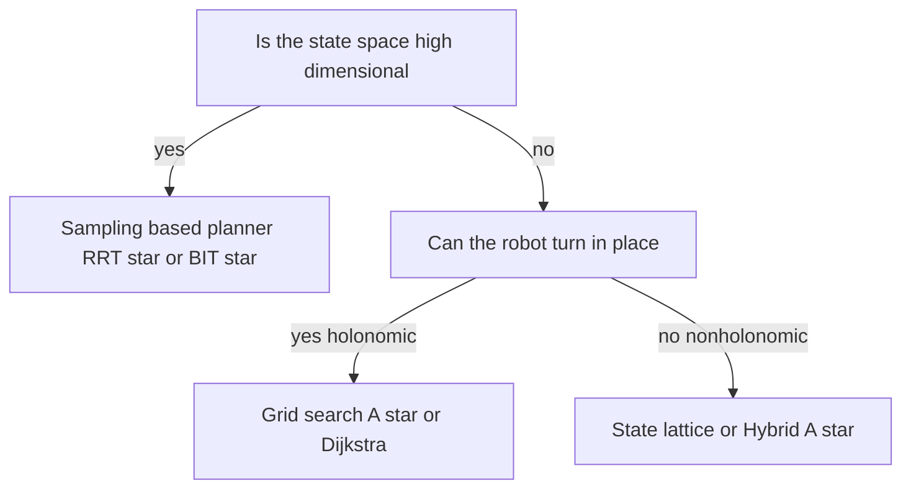
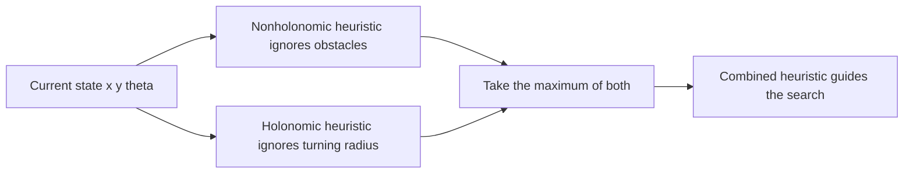

# Lecture 2 — Lattices, Hybrid-A*, and Sampling-Based Planning

> **Duration:** ~2 hours of reading + hands-on.
> **Outcome:** You can explain why a grid fails for nonholonomic vehicles and high-DOF arms, describe how state lattices and Hybrid-A* encode kinematic constraints, implement RRT and RRT* in continuous space, and choose a planner from the structure of its state space.

Lecture 1 gave you grid search — and grid search is *the answer* for a flat floor where the robot can spin in place. This lecture is about the two big places grid search stops working: **vehicles that can't turn in place** (cars, the Ackermann base in your homework) and **high-dimensional continuous spaces** (a 7-DOF arm's configuration space). Three parts: (1) lattices and Hybrid-A* for nonholonomic vehicles, (2) RRT and RRT* for sampling-based planning, (3) the taste test that ties planner choice to state-space structure.

If you remember one sentence from this lecture, remember this one:

> **Grid search dies in two ways — when the robot's motion is constrained (a car can't follow a grid path) and when the state space is high-dimensional (a 7-DOF grid has more cells than atoms in a building) — and each failure has its own family of escape: lattices/Hybrid-A* for the first, sampling-based planners for the second.**

---

## Part 1 — When the grid isn't enough: lattices and Hybrid-A*

Before the details, one orienting idea for the whole lecture: **dimension and holonomy are the two axes that decide everything.** Low dimension + holonomic (a vacuum) → grid. Low dimension + nonholonomic (a car) → lattice/Hybrid-A*. High dimension (an arm) → sampling, regardless of holonomy. Keep that 2×2 in your head and the rest of this lecture is filling in the cells.


*Dimension and holonomy are the two questions that select the planner family.*

### 1.1 The nonholonomic problem

A differential-drive robot can spin in place: from any cell it can face any direction, so its state is just `(x, y)` — a 2D grid, A*'s home turf. A **car** cannot. A car has a **minimum turning radius**; it cannot move sideways and it cannot pivot. Its state is `(x, y, θ)` — position *and heading* — and the legal moves out of a state depend on the heading. A path that A* on a 2D grid produces (sharp 90° turns, reversals in place) is **physically impossible** for a car to follow.

This is the **nonholonomic** constraint: the vehicle's instantaneous velocity is restricted (it can roll forward/backward and steer, but not translate sideways). Planning for such a vehicle must search a space that includes heading and only connects states by *feasible motions*. Two families do this: state lattices and Hybrid-A*.

### 1.2 State lattices

A **state lattice** precomputes a set of **motion primitives** — short, kinematically feasible path segments — that connect a discretized state to its reachable neighbors. Instead of "move to the cell N/S/E/W," the moves are "follow this gentle left curve," "follow this gentle right curve," "go straight," each respecting the turning radius. The lattice is a graph whose *edges are feasible maneuvers*, and you run A* over *that* graph.

```
   Grid neighbors (diff-drive)        Lattice primitives (car-like)
   ┌───┬───┬───┐                       ╲      |      ╱
   │ ↖ │ ↑ │ ↗ │                        ╲     |     ╱      each arc respects
   ├───┼───┼───┤                         ╲    |    ╱       the minimum turning
   │ ← │ • │ → │                          ╲   |   ╱        radius — no sharp
   ├───┼───┼───┤                           ╲  |  ╱         turns, no sideways
   │ ↙ │ ↓ │ ↘ │                       •────────────•      motion
   └───┴───┴───┘
```

The key property: **every edge in the lattice is a path the vehicle can actually drive.** A* over a lattice therefore produces a feasible path directly — no post-hoc "can the car follow this?" check. The cost is a larger, heading-indexed state space and a precomputed primitive set tuned to the vehicle.

#### What a primitive set actually contains

Concretely, a lattice discretizes heading into, say, 16 angles, and for *each* discrete heading precomputes a handful of feasible maneuvers that land on other lattice states. For a forward-moving car at heading 0°, a primitive set might be:

| Primitive | Maneuver | Lands at (relative) |
|---|---|---|
| Straight | drive forward 1 cell | `(+1, 0, 0°)` |
| Soft left | gentle left arc | `(+1, +1, +45°)` |
| Soft right | gentle right arc | `(+1, −1, −45°)` |
| Hard left | tight left arc (≥ min radius) | `(+1, +2, +90°)` |
| Hard right | tight right arc | `(+1, −2, −90°)` |

Each primitive is a *curve* (not a straight cell-to-cell hop), precomputed to respect the turning radius, with a cost equal to its arc length (plus any costmap cost along it). The planner expands a state by trying each primitive valid for that state's heading, checking the swept curve for collision, and landing on the resulting `(x, y, θ)` lattice cell. The closed set is indexed by `(x, y, θ)` so the search terminates. Because the primitives are feasible by construction, the output path is feasible by construction — that's the entire payoff over grid A*.

### 1.3 Hybrid-A* (and Nav2's SMAC)

**Hybrid-A*** (Dolgov et al., from the DARPA Urban Challenge) is the workhorse. It runs A* over a **continuous** `(x, y, θ)` state, but discretizes the *controls*: from each state it expands a small set of steering actions (hard left, gentle left, straight, gentle right, hard right) for a fixed step, each producing a continuous successor state. It buckets continuous states into grid cells for the closed set (so the search terminates), but the *states themselves* stay continuous — hence "hybrid." Two refinements make it practical:

- **Analytic expansion.** Periodically, Hybrid-A* tries to connect the current state directly to the goal with an analytic **Dubins curve** (forward-only car) or **Reeds-Shepp curve** (car that can reverse). If that curve is collision-free, the search jumps straight to the goal — a huge speedup near the end.
- **A two-part heuristic.** It combines a nonholonomic-without-obstacles heuristic (the Reeds-Shepp distance, which respects the turning radius but ignores walls) with a holonomic-with-obstacles heuristic (a 2D Dijkstra that ignores the turning radius but respects walls). Taking the max of the two is admissible and far more informed than either alone.

In Nav2 this is the **`SmacPlannerHybrid`** plugin you swapped in at the end of Week 17 and benchmark this week. The load-bearing parameter is `minimum_turning_radius`: set it to your vehicle's real radius and the planned path will respect it; set it too small and the planner produces turns the vehicle can't make; set it too large and the planner refuses tight-but-feasible maneuvers.

#### Why the two-part heuristic is the clever bit

The heuristic is where Hybrid-A* earns its speed, and it's worth understanding because it's a beautiful piece of engineering. Naively, you'd use the Euclidean distance to the goal — but that ignores *both* the turning radius and the walls, so it's a terrible guide for a car. Hybrid-A* instead takes the **maximum of two heuristics**, each of which captures one constraint the other ignores:

1. **The nonholonomic-without-obstacles heuristic.** Compute the Reeds-Shepp (or Dubins) distance from the current `(x, y, θ)` to the goal pose, *ignoring obstacles*. This captures the turning-radius cost perfectly — it knows the car can't make a 90° turn in zero space — but pretends there are no walls. It's precomputed into a lookup table indexed by relative pose, so it's a table lookup at runtime.

2. **The holonomic-with-obstacles heuristic.** Run a 2D Dijkstra over the costmap from the goal, *ignoring the turning radius* (treat the car as a point that can move any direction). This captures the obstacle cost perfectly — it knows the car must go around the wall — but pretends the car can turn in place.

Taking `max(h1, h2)` is **admissible** (the max of two admissible heuristics is admissible) and far more *informed* than either alone: near the goal in open space, `h1` (the turning cost) dominates; far from the goal behind a wall, `h2` (the detour cost) dominates. The combination guides the search tightly through *both* the kinematic and the obstacle structure. This is why Hybrid-A* is fast despite searching a 3D continuous state — the heuristic is doing enormous work. It's the same lesson as Lecture 1 §3.2 (a better heuristic touches fewer nodes), applied to a harder space.


*Hybrid A star blends a turning-aware heuristic with an obstacle-aware heuristic by taking their max.*

```yaml
planner_server:
  ros__parameters:
    planner_plugins: ["GridBased"]
    GridBased:
      plugin: "nav2_smac_planner/SmacPlannerHybrid"
      motion_model_for_search: "DUBIN"        # forward-only car; REEDS_SHEPP allows reverse
      minimum_turning_radius: 0.40            # metres — the vehicle's real constraint
      analytic_expansion_ratio: 3.5
      cost_penalty: 2.0                       # how much to weight costmap cost vs. distance
```

> **The taste test in one line:** if your robot can spin in place (diff-drive, holonomic), use a 2D grid planner (`NavFn`, `SmacPlanner2D`). If it can't (Ackermann, car-like, a long robot that must arc), use a lattice or Hybrid-A* (`SmacPlannerHybrid`). The constraint chooses the planner.

---

## Part 2 — Sampling-based planning: RRT and RRT*

### 2.1 Why grids explode in high dimensions

A 6-DOF arm's state is six joint angles. Discretize each joint into just 100 values and the grid has `100^6 = 10^12` cells. Add a seventh joint and it's `10^14`. No A* finishes. This is the **curse of dimensionality**: grid-based search is exponential in the number of dimensions, so it dies above ~3–4 DOF. Manipulation planning lives in 6–7 DOF (or more). You cannot grid it.

To make the number visceral: `10^12` cells at one byte each is a *terabyte* of memory just to store the grid, before you search it — and `10^14` is a hundred terabytes. Even if you had the memory, A* would need to *expand* a meaningful fraction of those cells, and at a billion expansions per second that's hours to days per plan. The curse isn't a tuning problem you can optimize away; it's exponential, and exponentials win. The only escape is to stop enumerating the space and start *sampling* it — which is the entire reason sampling-based planning exists. A 6-DOF planning problem that's hopeless for a grid is routine for RRT-Connect, finishing in tens of milliseconds, because it touches a few thousand sampled configurations instead of `10^12` cells. That gap — hopeless vs. routine — is the single most important reason to know which planner family fits which state space.

**Sampling-based planners** sidestep the grid entirely. Instead of enumerating cells, they *sample* random configurations and connect them into a tree (or graph), checking only the sampled configurations for collision. They don't represent the whole space — they probe it. This scales to high dimensions because the work is proportional to the number of samples, not the volume of the space.

#### Configuration space: planning where the robot *is*, not where it *occupies*

The key abstraction is the **configuration space** (C-space). For a mobile robot, the configuration is its pose `(x, y, θ)`. For a 6-DOF arm, it's the six joint angles `(q1, …, q6)`. A *point* in C-space is one complete configuration of the robot; a *path* in C-space is a continuous sequence of configurations — a motion. The trick is that **an obstacle in the workspace maps to a complicated forbidden region in C-space** (the set of joint angles where the arm would hit something), and that forbidden region is generally impossible to compute explicitly. Sampling-based planners never try: they sample a configuration, ask the collision checker "is the robot in collision at *this* configuration?" (a yes/no query you *can* answer), and build their tree only through the configurations that come back free. They plan in C-space without ever constructing it — which is exactly why they survive 7 dimensions where a grid would need to enumerate the forbidden region cell by cell. Hold this abstraction; it's the foundation of everything in Week 23.

### 2.2 RRT — the rapidly-exploring random tree

RRT (LaValle, 1998) grows a tree from the start toward random samples:

```
RRT:
  tree = {start}
  repeat N times:
    x_rand  = sample a random configuration (occasionally the goal — "goal bias")
    x_near  = nearest node in the tree to x_rand
    x_new   = steer(x_near, x_rand, step_size)   # move step_size from x_near toward x_rand
    if collision_free(x_near, x_new):
      add x_new to tree with parent x_near
      if x_new is within goal_tolerance of goal:
        return path from start to x_new
```

Four primitives define RRT, and you implement all four in Exercise 3:

- **`sample`** — draw a random configuration uniformly from the space, with a small probability (`goal_bias`, ~5–10%) of sampling the goal directly so the tree is pulled toward it.
- **`nearest`** — find the tree node closest to the sample (in the configuration metric).
- **`steer`** — produce a new state a bounded `step_size` from the nearest node toward the sample. In holonomic 2D this is a straight-line step; for a car it's a Dubins/Reeds-Shepp local path.
- **`collision_free`** — check the segment from the nearest node to the new state against obstacles (sampled at intervals, or swept).

RRT is **probabilistically complete**: if a path exists, the probability of finding it approaches 1 as samples grow. But RRT's path is *not* optimal — it's whatever jagged route the random tree happened to find. That's what RRT* fixes.

#### Goal bias: the one tuning knob that matters most

Of RRT's parameters, **goal bias** is the one that most changes behavior, and it's a Goldilocks problem. With *zero* goal bias, the tree explores the whole space uniformly and may take a very long time to stumble onto the goal — great coverage, slow convergence. With *too much* goal bias (say 50%), the tree charges straight at the goal and gets *stuck* against any obstacle between start and goal, because it keeps trying the same blocked direction instead of exploring around. The sweet spot is small — **5–10%** — enough to pull the tree toward the goal occasionally while still exploring enough to find a way around obstacles. If your RRT "almost reaches the goal but never quite connects," lower the goal bias and let it explore; if it "wanders forever in open space," raise it. This single knob explains most RRT tuning frustration.

#### A worked RRT step, by hand

One iteration makes the four primitives concrete. Tree currently has two nodes: root `A = (0,0)` and `B = (1,1)`. Step size = 1.0.

1. **`sample`** draws `x_rand = (3, 1)` (not the goal this time).
2. **`nearest`** measures: `dist(A, x_rand) = √10 ≈ 3.16`, `dist(B, x_rand) = √4 = 2.0`. `B` is nearest.
3. **`steer`** moves 1.0 from `B` toward `(3,1)`: the direction is `(2,0)/2 = (1,0)`, so `x_new = (1,1) + 1.0·(1,0) = (2,1)`.
4. **`collision_free(B, x_new)`** sweeps the segment `(1,1)→(2,1)`; if it clears the obstacles, add `x_new = (2,1)` with parent `B`, cost `cost(B) + 1.0`.

Notice what happened: the tree didn't jump to `(3,1)` — it took *one bounded step* toward it. That bounded step is why RRT "rapidly explores": each sample pulls the tree a little further into unexplored space, biased by where the random samples land (which, being uniform, is everywhere). The Voronoi regions of the frontier nodes are largest in unexplored areas, so samples most often pull the *frontier* outward — the formal reason RRT fills space fast.

### 2.3 RRT* — asymptotic optimality via rewiring

**RRT\*** (Karaman & Frazzoli, 2011) adds two steps to RRT that make the tree *improve* as it grows, converging to the optimal path. The additions happen right after a new collision-free node is found:

1. **`choose_parent`** — instead of automatically parenting `x_new` to the nearest node, look at *all* tree nodes within a **near-radius** `r` of `x_new`, and connect `x_new` to whichever one gives it the **lowest cost-from-start** (and a collision-free connection). The nearest node isn't always the cheapest route.

2. **`rewire`** — for each node within the near-radius, check whether routing it *through* `x_new` would lower its cost-from-start. If so, **re-parent it to `x_new`.** This is the magic: as new nodes appear, existing nodes get re-wired through cheaper routes, so the whole tree's costs keep dropping. The path you can read out of the tree gets shorter over time.

```python
def extend_rrt_star(tree, x_rand, step, obstacles, near_radius):
    x_near = nearest(tree, x_rand)
    x_new = steer(x_near, x_rand, step)
    if not collision_free(x_near, x_new, obstacles):
        return None

    # --- RRT* addition 1: choose the best parent in the near-radius ---
    neighbors = within_radius(tree, x_new, near_radius)
    best_parent = x_near
    best_cost = cost(x_near) + dist(x_near, x_new)
    for x_n in neighbors:
        c = cost(x_n) + dist(x_n, x_new)
        if c < best_cost and collision_free(x_n, x_new, obstacles):
            best_parent, best_cost = x_n, c
    add_node(tree, x_new, parent=best_parent, cost=best_cost)

    # --- RRT* addition 2: rewire neighbors through x_new if it's cheaper ---
    for x_n in neighbors:
        c_through_new = best_cost + dist(x_new, x_n)
        if c_through_new < cost(x_n) and collision_free(x_new, x_n, obstacles):
            set_parent(x_n, x_new)
            set_cost(x_n, c_through_new)
    return x_new
```

The **near-radius** shrinks as the tree grows: `r(n) = γ · (log n / n)^{1/d}`, where `n` is the number of nodes and `d` the dimension. It shrinks because as the tree gets denser you only need to consider nearby nodes to maintain optimality, and considering all of them would be too slow. This radius is the technical heart of the asymptotic-optimality proof — and the one line people get wrong when they "implement RRT*" and wonder why their paths don't improve.

Why does the radius have *that* form? Two competing pressures balance in it. If the radius is too *small*, `choose_parent` and `rewire` consider too few neighbors and miss the cheaper routes — optimality is lost. If the radius is too *large*, every insertion considers nearly the whole tree, and the per-step cost balloons toward `O(n)`, making the planner quadratic. The `(log n / n)^{1/d}` form is the proven sweet spot: it shrinks just slowly enough that the connectivity needed for optimality is preserved (the `log n` keeps enough neighbors in range as `n` grows), while shrinking fast enough that the per-step neighbor count stays bounded. The `γ` constant scales it to your space's dimension and volume; too-small `γ` and you lose optimality, too-large and you lose speed. In Exercise 3 you'll see paths *stop improving* if you fix the radius at a constant instead of shrinking it — a concrete demonstration that this one formula is load-bearing, not decorative.

> **What "asymptotically optimal" means, precisely:** RRT* doesn't give you the optimal path at any finite sample count — it gives you a path whose cost *converges to* the optimal as samples → ∞. In practice you run it for a fixed budget (time or samples) and take the best path so far. More samples, better path. That's the trade-off you tune.

#### Why the rewire is the expensive-but-essential step

It's tempting to skip `rewire` ("choose a good parent and call it done") — and doing so gives you **RRT\*-without-rewire**, which is *not* asymptotically optimal: `choose_parent` alone only optimizes the *new* node's connection, never improving the nodes already in the tree. Without rewire, an early-and-bad parent choice for some node is permanent, and the tree's costs never recover. The rewire is what lets the tree *heal*: when a better route appears (via a new node), the affected existing nodes re-route through it, and — crucially — that improvement **propagates to their descendants** (the `_propagate_cost` step in Exercise 3). Skipping the propagation is the subtle bug: you re-parent a node but forget to update the costs of everything hanging off it, so the tree's cost bookkeeping silently goes wrong and the "optimal" path you read out is mis-costed. Rewire is `O(k)` per insertion (k = neighbors in the radius), which is the price of asymptotic optimality — and it's a price worth paying exactly when path *quality* matters (smooth arm motions, efficient routes), not when you only need *a* feasible path fast (use RRT-Connect for that).

### 2.4 The steering function and Dubins/Reeds-Shepp curves

The `steer` primitive is where the vehicle model enters sampling-based planning, and it's the difference between a holonomic toy and a real car planner. In holonomic 2D (your Exercise 3), `steer` is a straight-line step — any direction is reachable. For a **car**, it isn't: `steer(a, b)` must produce a path the car can actually drive between two `(x, y, θ)` states, and that path is a **Dubins curve** (for a forward-only car) or a **Reeds-Shepp curve** (for a car that can reverse).

- A **Dubins curve** is the shortest path between two oriented poses for a vehicle with a minimum turning radius that only moves forward. Dubins proved (1957) that this shortest path is always one of six types, each a sequence of three segments drawn from {turn-left, turn-right, go-straight} — e.g. "RSL" = turn right, go straight, turn left. You can compute it in closed form; no search needed.
- A **Reeds-Shepp curve** generalizes Dubins to allow reversing, giving 48 possible segment sequences (forward and backward turns and straights). It's what you need for a car parallel-parking or a forklift backing into a bay.

The reason this matters for RRT* and Hybrid-A*: both need a *local steering function* that respects the kinematics, and the cost of an edge is the *length of that curve*, not the straight-line distance. When MoveIt2 plans for a nonholonomic base, or when SMAC plans a car path, the Dubins/Reeds-Shepp distance is the metric and the steering function. Knowing they're closed-form (no inner search) is the insight: the kinematics are handled analytically, so the *planner's* search is still over which states to connect, not how to connect them.

This separation — **the search decides *which* states to connect; the steering function decides *how*** — is the architectural pattern that lets one planner (RRT*, Hybrid-A*) serve many robots. Swap the steering function from straight-line to Dubins to Reeds-Shepp to a full arm-trajectory generator, and the *same* search machinery now plans for a holonomic robot, a forward car, a reversing car, or a manipulator. The planner doesn't know or care what the robot is; it only asks the steering function "can you connect A to B, and at what cost?" That's why OMPL's RRT* works unchanged across a 2-DOF point robot and a 7-DOF arm — only the steering function (and the collision checker) change. When you read MoveIt2's planning config in Week 23 and see a "state space" and a "state validity checker" plugged into a generic planner, this is what you're looking at: the search/steering separation, made configurable.

### 2.5 Collision checking is where the time goes

A practical truth about sampling-based planning: **collision checking dominates the runtime.** Every `steer` produces a candidate edge, and every candidate edge must be checked against the obstacles — and that check is run thousands of times. In your Exercise 3 it's a few circle tests per segment sample; in a real manipulation planner it's a full robot-mesh-vs-environment check at each interpolated configuration, which can be milliseconds *each*. The consequences:

- **Lazy collision checking** (used by BIT* and Lazy-PRM) defers the expensive check: build the tree/graph assuming edges are free, find a candidate path, and *only then* check that path's edges, re-planning around any that turn out to be in collision. This avoids checking edges that were never going to be on the solution.
- **Coarse-to-fine** checking samples the edge sparsely first, refining only if the coarse check passes — cheap rejection of obviously-colliding edges.
- The **resolution** of the edge check is a correctness/speed trade-off exactly like grid resolution: too coarse and you miss a thin obstacle (an edge tunnels through a wall); too fine and you burn time. Bound it by the smallest obstacle feature you must not miss.

When your RRT* is slow, profile it: the time is almost always in `collision_free`, not in `nearest` or the rewiring. That's where to optimize.

There's one more accelerator worth naming because it shows up in every production sampling planner: the **nearest-neighbor structure**. A naive `nearest` scans all `n` tree nodes — `O(n)` per insertion, `O(n²)` to build the tree. Real planners store the tree in a **k-d tree** (or a similar spatial index), turning `nearest` and `within_radius` into `O(log n)` queries. Your Exercise 3 uses the naive scan for clarity (and it's fine for a few thousand nodes), but you should know that at scale the k-d tree is what keeps RRT* from quadratic blow-up — it's the same "use the right data structure for the membership test" lesson as the closed-set `set` in Lecture 1.

### 2.6 Where this lives in your stack

MoveIt2 (Week 23) plans arm motions with **OMPL**, whose default planners are sampling-based — RRT-Connect (a bidirectional RRT) for speed, RRT*/BIT* for quality. You implement RRT* by hand this week so that when MoveIt2's planner "just works" in Week 23, you know exactly what's happening inside: it's sampling configurations, building a tree, and (for the optimal variants) rewiring.

A few neighbors in the sampling-based family you should be able to name:

- **RRT-Connect** — grows *two* trees, one from the start and one from the goal, and tries to connect them each iteration. Bidirectional search meets in the middle, which is dramatically faster than a single tree for hard problems. It's the OMPL default for "just find me a feasible path fast" — and it's *not* asymptotically optimal (no rewiring), which is fine when you only need feasibility.
- **PRM (Probabilistic Roadmap)** — instead of a tree grown per-query, PRM samples the whole space *once*, connects nearby samples into a *roadmap* graph, and then answers *many* start/goal queries by running A* on that prebuilt graph. Use it when the environment is static and you plan repeatedly (a fixed workcell where the arm does the same motions). RRT is per-query; PRM amortizes across queries.
- **BIT\*** (Batch Informed Trees) — the modern evolution. It combines the sampling of RRT* with the ordered search of A*, processing samples in *batches* and focusing them in an *ellipse* between start and goal (the region that could possibly contain a better-than-current path). You don't implement BIT* this week, but you should know it's the current state of the art for high-DOF optimal planning and why: it's both asymptotically optimal *and* quick to a good first solution, because the informed sampling and the ordered expansion stop it from wasting samples on irrelevant regions.

The mental hierarchy: **RRT** finds *a* path; **RRT-Connect** finds one *fast*; **RRT\*** finds the *optimal* one eventually; **BIT\*** finds the optimal one *efficiently*. You pick by whether you need feasibility-fast or optimality, and whether the environment is static (PRM) or per-query (RRT family).

### 2.7 Why you implement RRT* by hand in a course that uses OMPL

A fair question: if MoveIt2/OMPL gives you battle-tested implementations of all of these, why spend an evening writing RRT* yourself? Three reasons, and they're the same reasons you wrote A* by hand in Lecture 1:

1. **You can't debug what you can't see inside.** When MoveIt2 returns "planning failed" on a reachable goal, the engineer who has written RRT* knows the suspects immediately — goal bias too low, step size too large for the clutter, collision-check resolution too coarse, or simply not enough samples — because those are the knobs *they* tuned. The engineer who has only called `plan()` is stuck.
2. **You internalize the failure modes.** RRT* that "doesn't improve with samples" (forgot to propagate cost after rewire), that "never connects" (goal bias too low or step too small), that "tunnels through walls" (collision resolution too coarse) — you've now hit all of these in Exercise 3, so you recognize them instantly in a library you didn't write.
3. **The interview.** "Implement RRT*" and "explain why A* is optimal" are among the most common robotics interview questions, precisely because they separate people who *use* planners from people who *understand* them. Having built both, you answer from memory, at the whiteboard, with the rewiring step and the admissibility proof — which is exactly the level Week 47's mock interviews are calibrated to.

The pattern across this week — build the simple thing by hand, then recognize it inside the production tool — is the whole pedagogy of Phase 3. You did it with A* vs. NavFn, you do it with RRT* vs. OMPL, and you'll do it again with PID vs. the controller server.

---

## Part 3 — The planner-selection taste test

You will not memorize "use planner X for robot Y." You will look at the **state space** and let it choose. Here is the whole decision, as a table you can defend in an interview:

| State space | Example robot / problem | Planner family | Why |
|---|---|---|---|
| 2D grid `(x, y)`, can turn in place | Diff-drive on a flat warehouse floor | **A* / Dijkstra / NavFn** | Low-dimensional, holonomic; grid search is optimal and fast. |
| 3D `(x, y, θ)`, turning constraint | Ackermann car, forklift, long robot | **State lattice / Hybrid-A* (SMAC)** | Nonholonomic; the path must respect turning radius, which the grid can't encode. |
| High-DOF continuous C-space | 6–7 DOF manipulator | **RRT* / RRT-Connect / BIT* (OMPL)** | Grid explodes exponentially; sampling scales to high dimensions. |
| Dynamic obstacles, large map | Planetary rover, huge warehouse | **D* Lite / incremental** | Reuse prior search instead of full replan when the map is too big to redo. |
| Tight latency, optimality flexible | Anything inside a 50 ms budget | **Weighted A* / anytime planners** | Bounded-suboptimal but fast; runtime is a safety property. |

The senior summary: **the planner is a consequence of the geometry of where the robot can go and how fast you need the answer.** Get the state space right — what are the dimensions, is it holonomic, how big, how fast must I replan — and the planner family falls out. The most common junior mistake is reaching for the planner you used last time instead of asking what the state space actually is.

### 3.0.1 Three worked selections

Walk three real problems through the taste test, because the table is only useful if you can *apply* it:

1. **A Roomba-style vacuum in an apartment.** State: `(x, y)`, can spin in place (differential drive), small map, dynamic obstacles (pets, feet) are slow and handled locally. → **2D grid A*** (or NavFn). Low-dimensional, holonomic, small — grid search is optimal and instant. Reaching for RRT* here would be over-engineering; it'd sample a space A* crosses in a straight line.

2. **An autonomous delivery van navigating a parking lot.** State: `(x, y, θ)`, cannot turn in place, must reverse to back into spots, tight aisles. → **Hybrid-A* with Reeds-Shepp** (it can reverse). The turning radius and the reversing are *the* constraints; a grid planner produces a path the van physically cannot drive. This is the textbook nonholonomic case.

3. **A 7-DOF arm reaching into a cluttered shelf.** State: seven joint angles, continuous, high-dimensional, mostly-static scene. → **RRT-Connect for speed, or BIT* if you want the smoother optimal motion** (and PRM if it's the *same* shelf motion repeated, so you amortize the roadmap). A grid is unthinkable (`100^7` cells); sampling is the only family that survives the dimensionality.

Notice that in each case the *first* question wasn't "which planner is best?" — it was "what is the state space, and what constrains motion in it?" The planner is the *answer* to that question, not an independent choice. That ordering — state space first, planner second — is the single habit that separates a planning engineer from someone who memorized planner names.

### 3.0.2 A note on completeness guarantees

One more axis the taste test hides: what *guarantee* does each family give you when it returns "no path"?

- **Grid search (A*, Dijkstra)** is **complete** and **optimal**: if a path exists on the grid, it finds it (and the shortest one); if it returns failure, no path exists *on that grid resolution*. The caveat is the resolution — a gap narrower than one cell is invisible to the grid, so "no path" means "no path at this resolution," not "no path in reality." Finer grid, fewer false negatives, slower search.
- **Sampling-based (RRT, RRT*)** is **probabilistically complete**: if a path exists, the probability of finding it → 1 as samples → ∞. But at any *finite* sample count, "no path found" does **not** mean "no path exists" — it might just mean you got unlucky and need more samples. This is a real operational difference: a grid planner's failure is conclusive; a sampling planner's failure is "I didn't find one yet." For a safety case (Week 41), that distinction matters — you cannot prove a region is unreachable with a sampling planner, only that you failed to reach it within budget.

This is part of why ground robots favor grids (conclusive failure, optimal paths, low dimension) and manipulators are forced onto sampling (the only thing that works in high-D, at the cost of weaker guarantees). The guarantee you get is part of the planner, not an afterthought.

### 3.1 Runtime as a safety property (this week's fail-safe)

The fail-safe question this week: *what does the robot do when the planner returns no path, or returns one too slowly to be safe?* Frame both as safety, not performance:

- **No path** — the planner returns failure (goal unreachable, boxed in by obstacles). The correct response is **not** to keep the last plan; it's to stop, signal, and either replan to a different goal or request operator assist (Week 17's fail-safe pattern). A `None` from your planner must propagate to a controlled stop, not a silent coast. And note the completeness caveat from §3.0.2: with a *sampling* planner, "no path" might mean "didn't find one in budget," so the response may also include "try again with more samples before declaring failure" — whereas a grid planner's "no path" is conclusive and you can stop reasoning immediately.
- **Too slow** — the planner exceeds its latency budget. On a moving robot, a plan that arrives 600 ms late describes a world that no longer exists. The mitigation is an **anytime** planner (weighted A* / ARA* that returns *a* path quickly and improves it if time allows) plus a hard deadline: if no path by the deadline, stop. The homework has you measure your planner's latency distribution and declare the deadline behavior. The discipline is to make the deadline an *explicit parameter* with a *defined* behavior when it's hit — never an implicit "it usually finishes in time." Implicit timing is how robots coast into walls.

A planner that's "optimal but occasionally takes 2 seconds" is a *safety hazard* on a robot moving through shared space. Measuring the latency distribution — not just the average — and declaring what happens at the tail is the engineering this section demands.

There's a per-family wrinkle here. Grid planners have a **predictable** latency: their worst case is bounded by the map size, so the p95 and the max are close together — a good property for a safety case. Sampling planners have a **heavy-tailed** latency: most runs are fast, but the unlucky ones (a hard narrow passage the sampler keeps missing) can be far slower, so the p95 and the max diverge. This is one more reason ground robots favor grids (tight, predictable latency) and only reach for sampling when the dimensionality forces it. When you write the latency fail-safe in the homework, report the *whole distribution* — and if you're using a sampling planner, the tail is the number that decides your deadline behavior, not the mean.

### 3.2 Replanning under dynamic obstacles — tying it back to Nav2

The syllabus lists "replanning under dynamic obstacles" as a topic, and now you have the pieces to see how every planner family handles it:

- **Grid (A*/NavFn):** replan from scratch each cycle. The obstacle appears in the costmap (Week 17's `obstacle_layer` marks it from `/scan`), and the next planner tick — gated to ~1 Hz by the BT's `RateController` — routes around it. This is what Nav2 does by default, and it works because grid A* is fast enough to redo. The robot's *reaction time* to a new obstacle is therefore roughly the replan period (1 s) plus the controller's local avoidance (20 Hz, much faster) — which is why the **local** costmap and controller, not the global planner, handle the chair that just rolled in front of you. The global planner handles the *route*; the local controller handles the *dodge*.
- **Lattice/Hybrid-A*:** same periodic-replan story, but each replan is more expensive (the state space is bigger), so the replan rate is often lower and the local controller carries even more of the dynamic-avoidance load.
- **Sampling-based (RRT*):** for a moving robot you typically *don't* re-grow the whole tree; you keep the tree and prune the branches the new obstacle invalidated (a "dynamic RRT" or "RRT-X" approach), reusing the rest. The arm analog (Week 23): if the scene changes, MoveIt2 replans, but motion is slow enough relative to scene changes that full replan is usually fine.
- **D* Lite (Lecture 1 §6):** the one designed explicitly for this — it reuses prior search and only re-expands the affected region. The right tool when the map is too big to fully replan and obstacles change often.

The unifying insight: **dynamic obstacles are handled at two timescales.** The *fast* loop (local costmap + controller, 20 Hz) dodges immediate obstacles; the *slow* loop (global planner, ~1 Hz) re-routes around persistent ones. No single planner does both — the architecture splits the job, which is exactly the planner/controller split you built in Week 17. Getting that split right is more important than which global planner you pick.

---

## 4. Recap

You should now be able to:

- Explain why a 2D grid fails for nonholonomic vehicles (state is `(x, y, θ)`; moves depend on heading; turning radius) and for high-DOF arms (the grid explodes exponentially).
- Describe state lattices (motion primitives as feasible edges) and Hybrid-A* (continuous state, discrete controls, analytic Dubins/Reeds-Shepp expansion, the two-part heuristic, `minimum_turning_radius`).
- Implement RRT (sample, nearest, steer, collision-check) and explain probabilistic completeness.
- Implement RRT*'s two additions — `choose_parent` and `rewire` — explain the shrinking near-radius, and state precisely what "asymptotically optimal" means.
- Choose a planner family from the state-space structure and defend it, and know that MoveIt2/OMPL and BIT* are where this goes in Weeks 23+.
- Treat "no path" and "too slow" as safety events with declared responses.

### 4.1 The one table to carry out of this week

If you internalize nothing else, internalize the selection logic, because it's what you'll be asked in every design review and every interview:

| Question to ask | If yes → | If no → |
|---|---|---|
| Is the state space ≤ 3D? | grid or lattice/Hybrid-A* | sampling (RRT family) |
| Can the robot turn in place (holonomic)? | grid (A*/NavFn) | lattice/Hybrid-A* |
| Do I need the optimal path, or just *a* path? | RRT* / BIT* / A* | RRT-Connect / weighted A* |
| Is the environment static and queried often? | PRM (amortize the roadmap) | per-query RRT family |
| Is replan latency safety-critical? | grid (predictable tail) / anytime | accept the heavy tail, measure it |

Read top to bottom and the planner falls out. The discipline this whole week teaches is to ask those questions *first* — about the state space and the timing — and let the answer choose the planner, rather than reaching for whatever you used last time.

Next: the exercises put A*, Dijkstra, and RRT* in your hands, then race them against Nav2. Continue to [the exercises](../exercises/README.md).

---

## References

- *Planning Algorithms* (LaValle), Ch. 5 — sampling-based planning: <http://lavalle.pl/planning/>
- LaValle (1998) — RRT: <http://lavalle.pl/papers/Lav98c.pdf>
- Karaman & Frazzoli (2011) — RRT* and asymptotic optimality: <https://journals.sagepub.com/doi/10.1177/0278364911406761>
- Dolgov et al. — Hybrid-A* for autonomous vehicles: <https://ai.stanford.edu/~ddolgov/papers/dolgov_gpp_stair08.pdf>
- *Nav2 SMAC planner*: <https://docs.nav2.org/configuration/packages/configuring-smac-planner.html>
- *OMPL* (the sampling-based library MoveIt2 uses): <https://ompl.kavrakilab.org/>
