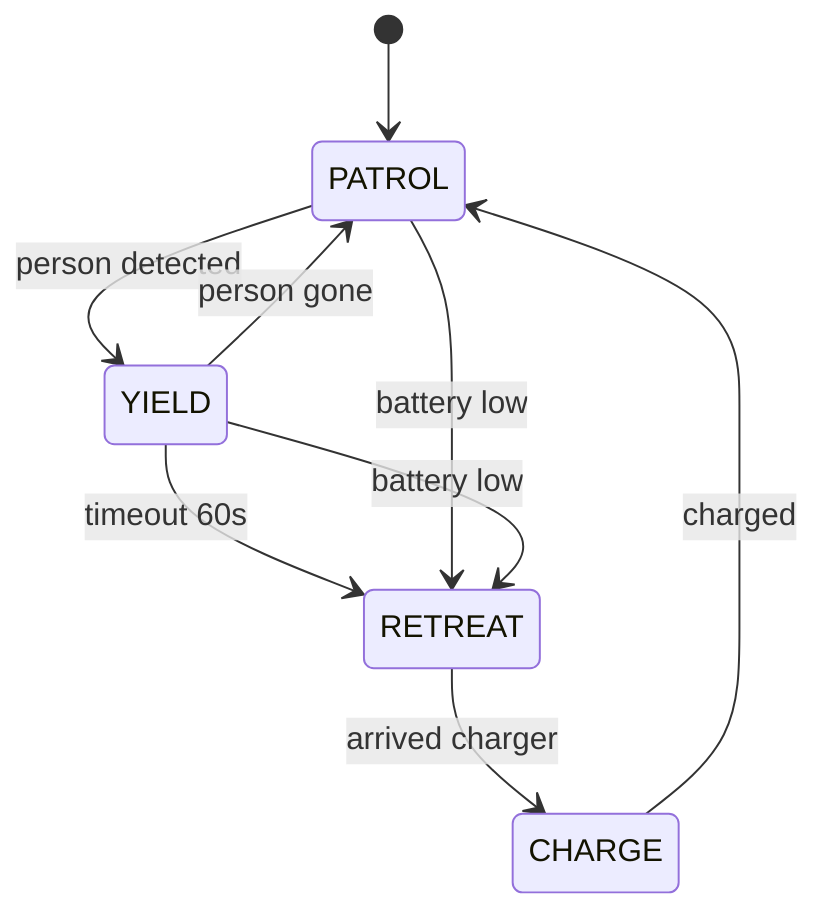
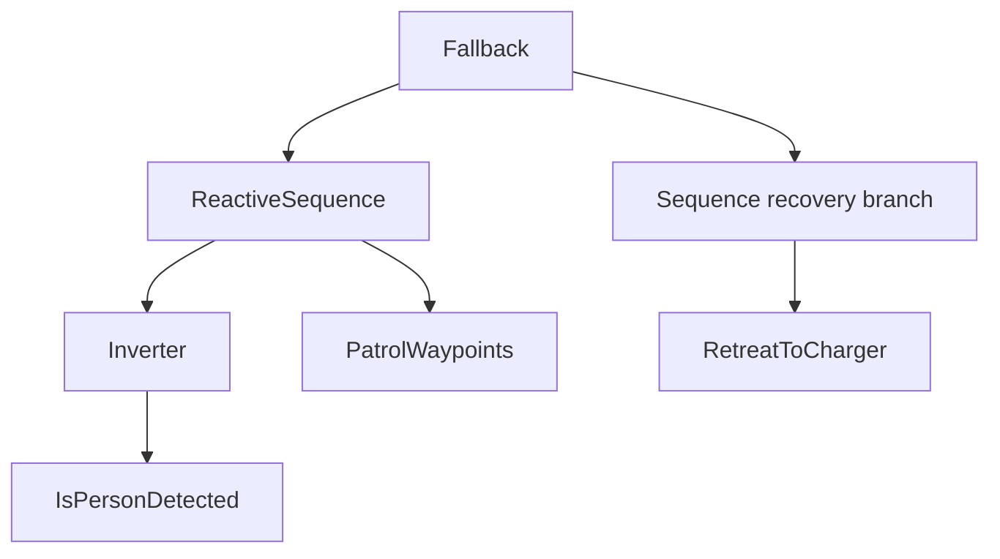

# Lecture 1 — Behavior Trees vs. State Machines: Ticking, Statuses, and Control Flow

> **Duration:** ~2 hours of reading + hands-on.
> **Outcome:** You can explain why behavior trees scale where state machines tangle, describe the tick-and-three-status execution model precisely, and use the control nodes (sequence, fallback, parallel), the reactive variants, and the decorators to express any task's control flow on paper.

If you remember one sentence from this entire week, remember this one:

> **A behavior tree is a state machine you can audit: it expresses "do A, then B, but yield to C, and recover with D" as a *tree* of composable control nodes and *reusable* leaves that tick top-down every cycle — so the structure stays readable, the leaves stay reusable, and you can watch which node is running right now in Groot 2.**

You read Nav2's navigation tree in Week 17 and trusted that `bt_navigator` ticked it. This week you build trees yourself, and to do that well you need the execution model in your bones. We start with *why* — the FSM problem — because the whole design of behavior trees is a response to it.

A quick orientation before we dive in: a behavior tree is *read* top-to-bottom, left-to-right, like a prioritized to-do list. The leftmost branches are the highest priority; the tree tries them first and falls back rightward. So "patrol on the left, retreat on the right, under a `Fallback`" reads as "prefer patrolling; retreat only if patrolling fails." Once you internalize that **left = high priority**, you can read the *intent* of any tree at a glance, before you even trace a single tick.

---

## 1. The problem behavior trees solve: FSMs don't scale

Every engineer's first tool for robot logic is the **finite state machine**. "The robot is in state PATROL; if it sees a person, transition to YIELD; when the person leaves, transition back to PATROL." For a handful of states this is perfectly clear. The FSM is a graph: states are nodes, transitions are edges.

The problem is the edges. An FSM with `N` states can have up to `N×(N−1)` transitions, and real robot tasks grow states fast: PATROL, YIELD, RECOVER, RETREAT, CHARGE, IDLE, ERROR... Each new state may need a transition *from every existing state* ("from any state, if the battery is critical, go to CHARGE"). The transition count explodes quadratically, and — this is the killer — **adding one behavior means touching many existing states' transition logic.** The FSM becomes a tangle nobody can read, where a change in one corner breaks a transition in another, and no one can answer "what will the robot do if it's in YIELD and the battery dies?" without tracing the whole graph.

This is the **state-explosion problem**, and it's not a tooling issue — it's structural. FSMs encode behavior in the *transitions between states*, and transitions don't compose.

Here's the comparison laid out, because it's the conceptual spine of why the field switched:

| Property | Finite state machine | Behavior tree |
|---|---|---|
| Logic lives in | transitions between states | the tree structure (control nodes) |
| Adding a behavior | may touch many states' transitions | add a subtree; existing branches untouched |
| Transition count | up to `N×(N−1)` | none — flow is structural |
| Reusability | states are coupled to their transitions | leaves are standalone and reusable |
| "What will it do?" | trace the whole transition graph | read the tree top-down |
| Reactivity | re-evaluate on each transition | re-tick every cycle (reactive nodes) |
| Best for | small, fixed, ≤ a few states | complex, layered, growing tasks |

The row that matters most operationally is "adding a behavior." On a real robot, requirements change weekly — "also yield to forklifts," "also pause during an announcement," "also dock when idle." In an FSM each of those is a surgery on the transition graph; in a BT each is a subtree you slot in next to the others. That difference compounds over a project's life into "the codebase stayed readable" versus "nobody touches the state machine anymore."

### 1.1 What behavior trees change

Behavior trees move the logic out of transitions and into a **tree structure**. There are no arbitrary state-to-state transitions. Instead:

- **Leaves** are the actions and conditions ("navigate to waypoint," "is a person detected?"). They're small and reusable.
- **Internal nodes** are *control-flow operators* — `Sequence` (do all in order), `Fallback` (try until one works), `Parallel` (do several at once). They compose.
- Execution flows by **ticking** the tree from the root every cycle; the control nodes route the tick to the right leaves based on their children's results.

The payoff is **modularity**: to add "retreat to charging if blocked too long," you add a *subtree* — you don't rewire existing behaviors. The recovery branch sits next to the patrol branch under a `Fallback`, and the patrol branch is untouched. You can read any subtree in isolation, test it in isolation, and reason about it in isolation. That composability is the whole reason BTs ate the mobile-robotics world.

### 1.0.1 The patrol task, both ways

Make it concrete. The patrol-with-yield task as an **FSM**:

```
States:   PATROL, YIELD, RETREAT, CHARGE
Transitions:
  PATROL  --person_detected--> YIELD
  YIELD   --person_gone-------> PATROL
  YIELD   --timeout_60s-------> RETREAT
  RETREAT --arrived_charger---> CHARGE
  PATROL  --battery_low-------> RETREAT      ← new requirement: now PATROL needs this too
  YIELD   --battery_low-------> RETREAT      ← ...and YIELD needs it
  CHARGE  --charged-----------> PATROL
```

Notice how "battery_low → RETREAT" had to be added to *every* state that could be interrupted. Now the same task as a **BT** (sketch):

```
Fallback
├── Sequence[ IsBatteryOK,  ReactiveSequence[ NoPersonDetected, PatrolLoop ] ]
└── RetreatToCharger
```

Adding the battery check was *one node* (`IsBatteryOK`) at the top of the patrol sequence — and because it's in a `Sequence`, if it fails the whole patrol fails and the `Fallback` routes to retreat, *from any point in the patrol*, with no per-state wiring. The FSM needed a transition from each state; the BT needed one guard. That's the modularity difference in a single example, and it's why the rest of this lecture is worth learning the tick model for.


*The FSM version of patrol needs a separate battery-low transition wired into every interruptible state.*

### 1.2 The honest trade-off

BTs are not always the answer, and saying so is the senior move. A genuinely two-state toggle (e.g., "estopped / not estopped") is *clearer* as an FSM — wrapping it in a tree is ceremony. BTs shine when the task is **complex, layered, and likely to grow** (a patrol with yields and recoveries, a Nav2 navigation with replanning and recovery). The cost you pay is a less-familiar execution model: you have to think in *ticks* and `RUNNING`, not in "the robot is in state X." Once that model is in your bones (this lecture), the trade is overwhelmingly worth it for any non-trivial task. But know the trade — reaching for a BT to express a single if/else is over-engineering, exactly like reaching for RRT* on a flat floor (Week 18).

---

## 2. The execution model: ticking and the three statuses

This is the part you must get exactly right, because every BT bug is ultimately a misunderstanding of it.

Three properties define a behavior tree's execution, and every BT framework (BehaviorTree.CPP, the py_trees library, Unreal's BT) implements them the same way:

1. **The tree is ticked from the root, repeatedly, at a fixed rate.**
2. **Every node returns one of exactly three statuses** (`SUCCESS`, `FAILURE`, `RUNNING`).
3. **Control nodes route the tick** to their children based on those statuses.

Get those three and you can predict any tree's behavior on paper — which is exactly what Exercise 1 asks you to do.

### 2.1 The tick

A behavior tree is executed by **ticking** it. A tick is a signal sent from the **root**, propagating *down* the tree. When a node is ticked, it does its job (or routes the tick to its children) and returns one of three **statuses** up to its parent:

- **`SUCCESS`** — the node accomplished its goal.
- **`FAILURE`** — the node could not.
- **`RUNNING`** — the node is *not done yet*; tick me again next cycle.

These three are the entire vocabulary. There is no fourth status, no "maybe," no "error" — an error is just a `FAILURE` (and the *reason* lives in a log or the blackboard, not the status). That deliberate minimalism is part of why BTs compose: every node speaks the same three-word language, so any node can be a child of any control node without special-casing.

The whole tree is ticked **repeatedly**, typically at a fixed rate (e.g., 10–100 Hz). Each tick flows from the root, through the control nodes, down to whichever leaves the control logic selects, and the statuses propagate back up. The root's returned status tells you the task's overall state: `RUNNING` means "still working," `SUCCESS` means "task done," `FAILURE` means "task failed."

### 2.2 Why `RUNNING` is the key innovation

`SUCCESS` and `FAILURE` you'd expect. **`RUNNING` is what makes behavior trees work for robots.** A robot action — navigate to a waypoint — takes *seconds*. It cannot complete within a single tick. In an FSM you'd block in a state until navigation finishes (and then you can't react to anything). In a BT, the navigation leaf returns `RUNNING` on each tick while the robot drives, and `SUCCESS` only when it arrives. Between ticks, the tree is *free*: the next tick can re-evaluate higher-priority branches (is a person detected? is the battery critical?) and *interrupt* the running navigation if needed.

This is the mechanism behind reactivity. The leaf says "I'm still working" (`RUNNING`) instead of blocking, so the tree keeps ticking and can change its mind. Without `RUNNING`, a BT would be just a fancy way to draw an FSM. With it, the tree is *continuously re-deciding* what the robot should do, every tick, while long actions run in the background. Burn this in: **`RUNNING` = "not done, tick me again," and it's the reason a BT can wait without blocking.**

### 2.3 A tick, traced

Consider this tiny tree:

```
Sequence
├── IsBatteryOK        (condition)
└── NavigateToWaypoint (async action)
```

- **Tick 1.** Root `Sequence` ticks child 1, `IsBatteryOK`. Battery is fine → `SUCCESS`. `Sequence` moves to child 2, `NavigateToWaypoint`. The robot starts driving; the action returns `RUNNING`. `Sequence` returns `RUNNING` to the root.
- **Tick 2..N.** Root ticks `Sequence` again. *Here's the subtlety*: a plain `Sequence` **remembers** it's on child 2 and ticks `NavigateToWaypoint` directly, skipping `IsBatteryOK`. The action returns `RUNNING` (still driving). This repeats until...
- **Tick N+1.** `NavigateToWaypoint` returns `SUCCESS` (arrived). `Sequence` has run all children successfully → returns `SUCCESS`. Task done.

Now hold that "plain `Sequence` skips child 1 on re-ticks" fact — it's exactly what the *reactive* variant changes, and the difference is the whole ballgame for "yield to a person."

### 2.4 The tick rate is a design parameter

How fast should you tick the tree? It's a real decision with consequences:

- **Too slow** (say 1 Hz) and the robot is sluggish to react — a person steps in front and the tree doesn't re-check the condition for up to a second, so the robot keeps driving for that second. For a safety-relevant yield, that's too slow.
- **Too fast** (say 1 kHz) and you waste CPU re-ticking conditions that haven't changed, and you can thrash actions that aren't designed to be poked that often.
- **The sweet spot for mobile robots is ~10–30 Hz.** Fast enough that a reactive yield feels immediate (33–100 ms reaction), slow enough that you're not burning a core on ticks. Nav2 ticks its navigation tree at a configurable rate in this range.

The tick rate interacts with reactivity: a `ReactiveSequence` re-checks its condition *once per tick*, so the tick rate *is* the condition-polling rate. If your yield must react within 100 ms, you need to tick at ≥10 Hz. This is the kind of number that belongs in a fail-safe declaration (the homework): "the tree ticks at 20 Hz, so a detected person halts the patrol within 50 ms."

---

## 3. The control nodes

Control nodes are the internal nodes that route the tick. There are three families, plus their reactive variants.

### 3.1 `Sequence` — logical AND

`Sequence` ticks its children **left to right**. It returns:

- `FAILURE` as soon as **any** child fails (and stops — later children aren't ticked).
- `RUNNING` if a child is running.
- `SUCCESS` only if **all** children succeed.

It's "do A, then B, then C — and if any step fails, the whole thing fails." A plain `Sequence` has **memory**: once a child returns `SUCCESS`, on the next tick it resumes at the *next* child without re-ticking the earlier ones (the trace in §2.3). BT.CPP 4.x calls the with-memory variant `Sequence` and the no-memory reactive one `ReactiveSequence` (more in §3.4).

### 3.2 `Fallback` (a.k.a. `Selector`) — logical OR

`Fallback` ticks its children **left to right**. It returns:

- `SUCCESS` as soon as **any** child succeeds (and stops).
- `RUNNING` if a child is running.
- `FAILURE` only if **all** children fail.

It's "try A; if that fails, try B; if that fails, try C." This is the **recovery pattern**: put the normal behavior first and the fallback behavior second. `Fallback[ DoTheTask, RecoverFromFailure ]` means "do the task, but if it fails, recover." Nav2's whole tree is built on a `RecoveryNode` (a specialized fallback) for exactly this.

### 3.3 `Parallel` — M-of-N

`Parallel` ticks **all** its children every tick (not one at a time). It succeeds when a threshold `success_count` of children succeed, and fails when too many fail. Use it for "do these things concurrently" — patrol *while* monitoring the battery, so a low battery interrupts from a sibling branch instead of being checked only between waypoints. `Parallel` is powerful but the trickiest to reason about (multiple things running at once), so reach for it only when you genuinely need concurrency.

A worked `Parallel` use: run the patrol and a "monitor for critical conditions" subtree as two children of a `Parallel` with `failure_count=1` (fail if *either* fails). The monitor subtree returns `FAILURE` the instant the battery is critical or an estop is pressed; that single failure fails the `Parallel`, which halts the patrol child. This gives you a *continuous* safety monitor running alongside the task, rather than a check that only happens at waypoint boundaries — a genuinely better structure for safety-critical interrupts, at the cost of the harder-to-reason-about concurrency. The rule of thumb: use a reactive `Sequence`/`Fallback` guard for *one* interrupting condition, and reach for `Parallel` only when you need *several independent* things truly running at once.

### 3.3.1 A `Fallback` recovery, traced

Because the recovery pattern is so central, trace a `Fallback` explicitly:

```
Fallback
├── NavigateToWaypoint   (try the normal action)
└── SpinAndRetry         (the recovery)
```

- **Tick 1.** `Fallback` ticks child 1, `NavigateToWaypoint`. The robot drives; `RUNNING`. `Fallback` returns `RUNNING`. (It does **not** tick the recovery — only on failure.)
- **Tick N.** `NavigateToWaypoint` returns `SUCCESS` (arrived). `Fallback` returns `SUCCESS` immediately and never touches the recovery.
- **Alternative tick N.** `NavigateToWaypoint` returns `FAILURE` (stuck). `Fallback` moves to child 2, `SpinAndRetry`, and ticks *it* (`RUNNING` while spinning). The recovery only runs *because* the primary failed.

Notice the asymmetry with `Sequence`: a `Sequence` stops on the first **failure** (AND), a `Fallback` stops on the first **success** (OR). Internalize "Sequence = all must pass, Fallback = one must pass," and you can read any tree's control flow at a glance.

### 3.4 Reactive variants — the heart of "yield to a person"

The plain `Sequence`'s *memory* is the problem when you need reactivity. Recall §2.3: once `IsBatteryOK` passed, the `Sequence` stopped re-checking it. But for "patrol, but **yield the moment** a person appears," you need the condition re-checked **every tick**, even while the navigation action is running.

That's the **`ReactiveSequence`**. It re-ticks *all* its children from the left on **every** tick. So:

```
ReactiveSequence
├── IsPathClear          (condition — re-checked EVERY tick)
└── NavigateToWaypoint   (async action — RUNNING while driving)
```

Every tick, `ReactiveSequence` first re-ticks `IsPathClear`. While the path is clear, it ticks `NavigateToWaypoint` (`RUNNING`, robot drives). The instant `IsPathClear` returns `FAILURE` (a person stepped in), the `ReactiveSequence` returns `FAILURE` **immediately** — and (importantly) *halts* the running `NavigateToWaypoint`, stopping the robot. That immediate interruption of a running action by a re-checked condition is *the* pattern for reactive yielding, and it only works with the reactive variant. Use a plain `Sequence` here and the robot finishes driving to the waypoint *before* it notices the person — exactly the bug you'll plant and fix in the Challenge.

Symmetrically, `ReactiveFallback` re-ticks its children every tick and is used in Nav2's recovery (re-check "did a new goal arrive?" every tick so recovery aborts immediately on a new goal).

#### Memory vs. reactive, side by side

| | `Sequence` (with memory) | `ReactiveSequence` |
|---|---|---|
| Re-ticks earlier children? | No — resumes at the running child | Yes — re-ticks all from the left every tick |
| Can an earlier condition interrupt a later action? | No | Yes |
| Cost per tick while an action runs | Cheap (ticks one node) | Higher (re-ticks all conditions) |
| Use when | steps are sequential and conditions don't change | a condition must be able to abort a running action |
| Example | "configure, then calibrate, then start" | "while clear, navigate" (yield to a person) |

The mental test is one question: **once this step is running, do I still need to watch the earlier checks?** If yes → reactive. If no → memory. The patrol's yield needs reactive (keep watching for people while driving); a startup sequence needs memory (don't re-run calibration once it's done). Picking wrong is mistake #1 from §6.2, and it's the single most common BT design error.

#### What "halt" means, precisely

When a reactive node interrupts a running action, BT.CPP **halts** that action — it calls the action's halt routine (`onHalted` in C++, §5). Halting is not the same as the action returning `FAILURE`; it's an *external* interruption. The action gets a chance to clean up (cancel a nav goal, stop a motor) before the tree moves on. This is why a well-written async action *must* implement halt: the difference between "the tree yielded and the robot stopped" and "the tree yielded but the robot kept rolling" is entirely whether halt cancels the underlying command. A behavior tree's reactivity is only as real as its actions' halt handlers.

> **The rule:** if a condition must be able to **interrupt** a running action, it goes in a **reactive** control node above that action. If a condition only needs to be checked *once before* an action starts, a plain (memory) sequence is fine and cheaper. Choosing reactive vs. memory is the single most consequential BT design decision, and getting it wrong is the most common BT bug.

---

## 4. Decorators

A **decorator** has exactly **one child** and modifies its ticking or its result. They let you shape control flow without writing new control logic. The ones you'll use constantly:

| Decorator | Effect |
|---|---|
| **`Inverter`** | Flips `SUCCESS` ↔ `FAILURE` (so a condition `IsPersonDetected` becomes "is *no* person detected"). `RUNNING` passes through. |
| **`ForceSuccess` / `ForceFailure`** | Always returns that status regardless of the child (useful to make an optional branch non-fatal). |
| **`Retry` / `RetryUntilSuccessful`** | Re-ticks the child up to N times on `FAILURE` before giving up. |
| **`Repeat`** | Re-ticks the child up to N times on `SUCCESS` (loop a behavior). |
| **`Timeout`** | Returns `FAILURE` if the child runs longer than a duration — **this is your 60-second retreat trigger.** |
| **`Delay`** | Waits a duration before ticking the child. |
| **`RateController`** | Ticks the child at most `hz` times/second (the same one Nav2 uses to throttle replanning, Week 17). |

The `Timeout` decorator is the one to note for this week: wrapping the "wait for the person to leave" behavior in a `Timeout(60s)` makes it return `FAILURE` after a minute, which (placed under a `Fallback`) routes the tree into the "retreat to charging" branch. **The fail-safe is a decorator plus a fallback** — no special-case code, just tree structure. That's the auditability the week is about: you can *point at* the `Timeout` and the retreat subtree and say "that's the fail-safe," and Groot 2 will show it firing.

> **Why this is the safety win.** In FSM code, "retreat if blocked more than 60 seconds" is a timer started in one state's entry handler, checked in a callback, and cleared in three exit handlers — logic smeared across the codebase that a reviewer must reconstruct in their head. In a BT it's a single `Timeout(60000)` decorator wrapping the wait, visible in the tree, testable in isolation, and observable in Groot 2 when it fires. A safety reviewer (Week 41) can *see* the fail-safe in the tree structure. That's the difference between "trust me, the timeout is in there somewhere" and "here is the node, watch it trip." Making safety logic *visible* is itself a safety property.

---

## 5. Condition and action nodes (the leaves)

The leaves are where your code lives. Two kinds:

The leaves are the *only* place your domain code lives. Everything above them — sequences, fallbacks, decorators — is pure control flow provided by the framework. This is the inversion that makes BTs powerful: you write small, testable, reusable leaves, and the framework's control nodes compose them into arbitrarily complex behavior with zero custom control code. A new robot task is mostly *new XML over the same leaves*, plus the occasional new leaf.

### 5.1 Condition nodes

A **condition** checks something and returns `SUCCESS` or `FAILURE` **synchronously** — never `RUNNING`. It's a predicate. `IsPersonDetected` reads the latest perception message and returns `SUCCESS` if a person is in frame, `FAILURE` otherwise. `IsBatteryLow` checks the battery topic. Conditions are cheap and side-effect-free by convention — they *observe*, they don't *act* — which is what lets a `ReactiveSequence` re-tick them every cycle without cost.

> **The cheapness of conditions is load-bearing.** Because a `ReactiveSequence` re-ticks its conditions *every* tick (10–30 Hz), a condition must be fast and side-effect-free. `IsPersonDetected` reads a cached latest-detection and compares — microseconds. If a condition did real work (ran an inference, queried a database) on every tick, the tree would choke. The convention "conditions observe a cached value, they don't compute" is what keeps reactive trees cheap. When you write a condition, the expensive part (running perception) happens in a *separate* ROS2 callback that updates a member variable; the condition just reads that variable. Mixing the two is mistake #3 from §6.2.

### 5.2 Action nodes

An **action** *does* something. A **synchronous** action completes within one tick (rare for robots — maybe "publish a log message"). An **asynchronous** (stateful) action takes many ticks: it returns `RUNNING` while working and `SUCCESS`/`FAILURE` when done. `NavigateToWaypoint` is the canonical async action — it kicks off a `NavigateToPose` goal, returns `RUNNING` while the robot drives, and `SUCCESS` on arrival. In BT.CPP these subclass `StatefulActionNode` with `onStart` (kick it off), `onRunning` (called each tick while `RUNNING` — check if done), and `onHalted` (clean up if interrupted, e.g., cancel the nav goal — *this* is what stops the robot when a reactive condition above interrupts).

The `onHalted` is worth a beat: when a `ReactiveSequence` above an async action returns `FAILURE` because a higher-priority condition tripped, BT.CPP calls `onHalted` on the running action so it can *cancel cleanly*. A `NavigateToWaypoint` whose `onHalted` cancels the Nav2 goal is what makes the robot actually *stop* when it yields. Forget to implement `onHalted` and the robot keeps driving to the waypoint even though the tree "yielded" — a subtle, dangerous bug, and one Groot 2 makes visible (the action node halts in the tree but the robot doesn't stop).

---

## 6. Putting the control flow together: a yield-and-recover sketch

Here's the shape of the week's task, in control nodes (full XML in Lecture 2):

```
Fallback                                  ← try the patrol; if it fails, retreat
├── ReactiveSequence                      ← patrol, yielding to people
│   ├── Inverter                          ← "is NO person detected"
│   │   └── IsPersonDetected              ← re-checked EVERY tick
│   └── PatrolWaypoints                   ← drive the three waypoints (RUNNING)
└── Sequence                              ← the recovery branch
    └── RetreatToCharger
```

Trace it: while no person is detected, the `Inverter[IsPersonDetected]` returns `SUCCESS` every tick, so the `ReactiveSequence` ticks `PatrolWaypoints` (`RUNNING`, robot patrols). The instant a person appears, `IsPersonDetected` → `SUCCESS`, the `Inverter` flips it to `FAILURE`, the `ReactiveSequence` returns `FAILURE` *and halts* the patrol (robot stops — yields). The `Fallback` then tries the recovery branch... but we want the robot to *wait* and *resume*, not immediately retreat. The missing piece — a `Wait` wrapped in a `Timeout(60s)` so it only retreats after a minute of blocking — is the design work of Lecture 2 and the mini-project. The sketch shows the *bones*: reactive yield, then a fallback to recovery. Filling in the timeout-gated wait is where the task becomes correct.


*Fallback tries the reactive patrol branch first, left to right, and only reaches the recovery branch if patrolling fails.*

---

## 6.2 The five mistakes that produce 90% of BT bugs

Before you write a tree, know the failure modes — they're a short list and you'll hit all of them:

1. **Plain `Sequence` where you needed `ReactiveSequence`.** The condition is checked once, never re-checked, so the robot doesn't react to a change mid-action. (The yield-doesn't-fire bug.) Fix: use the reactive variant when a condition must interrupt a running action.
2. **Forgetting `onHalted` on an async action.** The tree "yields" (the action node halts) but the robot keeps moving because the underlying nav goal was never cancelled. Fix: cancel the goal in `onHalted`.
3. **A condition with side effects.** Conditions are re-ticked every cycle by reactive nodes; if a condition *acts* (sends a command, mutates state), it fires repeatedly and unpredictably. Fix: conditions observe, actions act — keep them separate.
4. **An action that never returns anything but `RUNNING`.** A bug where `onRunning` never returns `SUCCESS`/`FAILURE` hangs that branch forever (the BT equivalent of an infinite loop). Fix: ensure every async action has a terminating condition; Groot 2 shows the stuck-green node.
5. **Wrong control-node polarity.** Using `Sequence` (AND) where you meant `Fallback` (OR), or vice versa, inverts the logic. The classic: putting recovery under a `Sequence` so it runs *always* instead of *only on failure*. Fix: "Sequence = all must pass; Fallback = one must pass," every time.

Every one of these is *visible in Groot 2* once you know to look — which is the whole reason the week pairs authoring with the visualizer.

## 6.5 Connecting back to Nav2 (Week 17)

You've already met everything in this lecture — in Nav2's tree, read in Week 17. Now the names should click:

- The `PipelineSequence` you saw is a `Sequence`-family node that re-ticks earlier children (so the planner keeps replanning while the controller drives) — the reactivity of §3.4 applied to navigation.
- The `RecoveryNode` is a specialized `Fallback` (§3.2): try navigation; on failure, run the recovery subtree; retry.
- The `RateController` is the decorator of §4 that throttles the planner to 1 Hz while the tree ticks faster.
- The `ComputePathToPose` and `FollowPath` leaves are async **action nodes** (§5.2) that return `RUNNING` while planning/driving.

So Nav2 *is* a behavior tree, built from exactly these primitives. The difference this week is that you stop *reading* Nav2's tree and start *authoring your own* — a higher-level task tree whose leaves can include Nav2's `NavigateToPose` as a single action node. Your patrol tree sits *above* Nav2's navigation tree: a tree calling a tree. That layering — task logic on top, navigation logic underneath — is how every production mobile robot is structured in 2026.

## 7. Recap

You should now be able to:

- Explain the FSM state-explosion problem and how BTs avoid it by moving logic from transitions into a composable tree of control nodes and reusable leaves.
- State the honest trade-off (BTs for complex/growing tasks; an FSM is fine for a two-state toggle).
- Describe the tick-and-three-status model, and explain why `RUNNING` ("not done, tick me again") is what lets a BT wait on a long action without blocking.
- Use `Sequence` (AND), `Fallback` (OR), and `Parallel` (M-of-N), and explain why the **reactive** variants (which re-tick earlier children every tick) are required for a condition to interrupt a running action.
- Apply decorators — especially `Timeout` for the retreat trigger and `Inverter` for negating a condition — to shape control flow without new logic.
- Distinguish synchronous conditions from asynchronous (`StatefulActionNode`) actions, and explain why `onHalted` is what actually stops the robot when the tree yields.
- Recognize the five mistakes that cause most BT bugs (wrong reactive/memory choice, missing `onHalted`, side-effecting conditions, non-terminating actions, wrong control-node polarity).
- See every Nav2 navigation-tree node (`PipelineSequence`, `RecoveryNode`, `RateController`, action leaves) as an instance of the primitives in this lecture.

> **The one-sentence test for whether you've got it:** can you take the patrol-with-yield-and-retreat task and, on paper, say which control node each requirement maps to (yield → reactive guard; retreat-after-60s → `Timeout` + `Fallback`; loop the waypoints → `Repeat`/`KeepRunningUntilFailure`)? If yes, you're ready to author. If a requirement doesn't map cleanly to a node, that's the part to re-read before you write XML — a requirement with no obvious node mapping is usually a sign you need a reactive variant or a decorator you haven't internalized yet.

## 6.8 A note on where BTs came from, and why they're not a fad

It's reasonable to ask whether behavior trees are a passing trend. They aren't, and the history tells you why. BTs emerged in the *game AI* world in the 2000s (Halo 2's AI is the famous early example) to solve exactly the FSM-tangle problem for non-player characters with many behaviors. Robotics adopted them in the 2010s, the Colledanchise–Ögren book formalized the theory, and Nav2 made them the default substrate for ROS2 navigation. By 2026 they're the standard way to structure mobile-robot task logic, the same way ROS2 is the standard middleware. The reason they stuck isn't fashion — it's that the *modularity and auditability* properties are real and don't have a better alternative at this layer. Hierarchical FSMs (statecharts) address some of the tangle, but they don't give you the clean re-tick reactivity or the leaf reusability. So: not a fad, a maturing standard. Learning them well is a durable skill, which is why they get a full week and a portfolio-bound mini-project.

Next: authoring all of this in BehaviorTree.CPP, registering custom nodes, passing data on the blackboard, watching it in Groot 2, and building the full patrol-with-yield task. Continue to [Lecture 2 — BehaviorTree.CPP, Groot 2, and the Patrol Task](./02-behaviortree-cpp-groot-and-the-patrol-task.md).

---

## References

- *Behavior Trees in Robotics and AI* (Colledanchise & Ögren): <https://arxiv.org/abs/1709.00084>
- *BehaviorTree.CPP — learn the basics*: <https://www.behaviortree.dev/docs/learn-the-basics/BT_basics>
- *BehaviorTree.CPP — control nodes*: <https://www.behaviortree.dev/docs/nodes-library/control-nodes/>
- *Nav2 — behavior trees overview*: <https://docs.nav2.org/behavior_trees/index.html>
- *Nav2-specific BT nodes*: <https://docs.nav2.org/behavior_trees/overview/nav2_specific_nodes.html>
