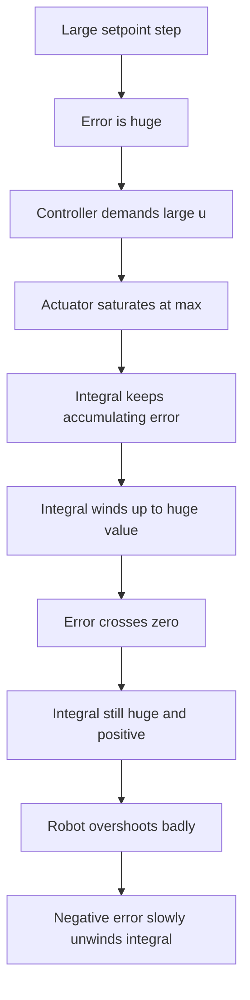
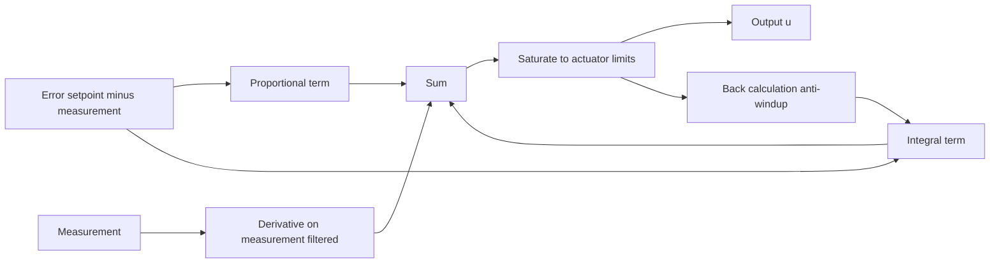

# Lecture 1 — PID Anatomy, Integrator Wind-up, and Derivative Kick

> **Duration:** ~2 hours of reading + hands-on.
> **Outcome:** You can derive the PID law, implement it correctly in discrete time, and fix the two failure modes — wind-up and derivative kick — that separate a textbook PID from one you'd actually ship.

If you remember one sentence from this entire week, remember this one:

> **PID is the floor under everything. The naive PID from the textbook equation is not what ships — what ships is PID plus three fixes (anti-windup, derivative-on-measurement, and a derivative filter), and the reason PID has a bad reputation is that most people deploy the naive version and blame the algorithm for their missing fixes.**

For nineteen weeks you have been building everything *except* the part that moves a wheel. Perception tells you what's there. Estimation tells you where you are. Planning tells you where to go. None of it actuates anything. The controller is the bridge from "the plan wants 90°" to "the wheels turn until the IMU reads 90°." This lecture builds that bridge from the simplest possible idea — *push in proportion to how wrong you are* — and then makes it robust.

---

## 1. The control problem, stated precisely

You have a **plant**: a thing you can push on (an input `u`) that produces a measurable output (`y`). For us this week the plant is "the robot's yaw," the input is commanded angular velocity on `/cmd_vel`, and the output is the yaw the IMU reports. You have a **reference** `r(t)`: the yaw you *want*. Define the **error**:

```
e(t) = r(t) − y(t)
```

The controller's only job is to compute an input `u(t)` that drives `e(t)` toward zero and keeps it there. That's the whole game. Everything else — P, I, D, feedforward, anti-windup — is *how* you compute `u` from `e` (and, as we'll see, from `r` directly).

There are two flavors of the problem, and they are not the same:

- **Regulation** — `r` is constant (or piecewise-constant). "Hold 90° while something tries to push you off it." Success = small steady-state error and good disturbance rejection.
- **Tracking** — `r(t)` moves continuously. "Follow this yaw-rate profile around a curve." Success = small *tracking* error and small phase lag, which is a harder and different problem.

We'll spend most of this lecture on regulation because it's where the intuition lives, and pick up tracking (and why it needs feedforward) in Lecture 2. But keep the distinction in your head from the start: **a controller tuned beautifully for regulation can track terribly**, because tracking a moving target with feedback alone always lags.

---

## 2. The three terms

PID computes the input as the sum of three terms, each a function of the error:

```
                    ┌ t
u(t) = Kp·e(t) + Ki·│  e(τ) dτ  + Kd·de(t)/dt
                    ┘ 0
        └─ P ─┘   └──── I ────┘   └──── D ────┘
```

Three gains, `Kp`, `Ki`, `Kd`. That's the entire controller. Now — what does each term *do*, physically, and what does it cost?

### 2.1 Proportional — `Kp·e`

Push in proportion to how wrong you are. Far from the setpoint, push hard; close to it, push gently. This is the term that does the bulk of the work and the one you tune first.

What it buys you: a fast, intuitive response. Bigger `Kp` → faster rise, more aggressive correction.

What it costs you:

- **Steady-state offset.** A pure proportional controller almost always settles *near* the target but not *on* it. Why? At steady state, if `e = 0` then `u = Kp·0 = 0`, but many plants need a nonzero input just to hold position (think of holding a robot arm against gravity, or a wheel against rolling friction). So the system settles at exactly the error where `Kp·e` equals the input the plant needs — a permanent offset. The bigger `Kp`, the smaller the offset, but you can't drive it to zero with P alone.
- **Oscillation and instability.** Crank `Kp` high enough and the response overshoots, then overshoots back, and the oscillation grows. Every plant has a `Kp` above which it goes unstable. Finding that limit is exactly the Ziegler–Nichols ultimate gain (Lecture 2).

### 2.2 Integral — `Ki·∫e dt`

Accumulate the error over time and push in proportion to the accumulation. This is the term that *kills the steady-state offset* P leaves behind: as long as any error persists, the integral keeps growing, keeps adding to `u`, until the error is actually zero. At steady state the integral term holds whatever constant input the plant needs, so `e` can be zero while `u` is not. That's the magic of I — it remembers.

What it buys you: **zero steady-state error.** This is the whole reason I exists. If your spec says "settle within 1° of the target," you almost certainly need an integral term, because P alone leaves an offset.

What it costs you:

- **Phase lag and overshoot.** The integral is slow — it responds to the *history* of the error, not the present. Adding I makes the system more sluggish to react and more prone to overshoot, because by the time the error crosses zero, the integral has wound up a big push that keeps driving past the target.
- **Wind-up.** The single most dangerous failure mode in all of PID. The integral keeps accumulating even when the actuator is *saturated* and can't push any harder. We devote §4 to this because it is where naive PID gets robots hurt.

### 2.3 Derivative — `Kd·de/dt`

Push in proportion to how *fast* the error is changing. If the error is shrinking quickly, the derivative term pushes *back* — it anticipates the approach and brakes early, like easing off the gas before you reach the stop sign instead of slamming on the brake at it.

What it buys you: **damping.** D lets you run a higher `Kp` (faster response) without the overshoot that `Kp` alone would cause, because D brakes the approach. It's the term that makes an aggressive controller graceful.

What it costs you:

- **Noise amplification.** The derivative of a noisy signal is *much* noisier — differentiation amplifies high frequencies. A little measurement noise on `y` becomes a large, jittery contribution to `u`. This is why a raw derivative term is almost never shippable and why §5 introduces the filter that makes it usable.
- **Derivative kick.** A step change in the *setpoint* (operator commands "go to 90°" instantly) produces an instantaneous step in `e`, whose derivative is an *impulse* — a huge instantaneous spike in `u`. Your actuator slams. §6 fixes this with one line.

> **The order you add them:** P first (get a reasonable response), then D (add damping so you can push P harder), then I (clean up the residual offset), and *only* as much I as you need. This is the structured manual loop in Lecture 2. Adding I first, or adding lots of it, is how beginners produce oscillating robots.

---

## 3. From the integral to code: discrete-time PID

The continuous law is beautiful and you can't run it. Your control loop runs at a fixed rate — say 50 Hz, so `dt = 0.02 s` — and computes `u` once per tick from sampled values. You must *discretize*. Here is the correct discrete PID, and the bugs waiting at every line.

```python
class PID:
    def __init__(self, kp, ki, kd, dt, u_min=-float("inf"), u_max=float("inf")):
        self.kp, self.ki, self.kd = kp, ki, kd
        self.dt = dt
        self.u_min, self.u_max = u_min, u_max
        self.integral = 0.0
        self.prev_error = 0.0

    def reset(self) -> None:
        self.integral = 0.0
        self.prev_error = 0.0

    def update(self, setpoint: float, measurement: float) -> float:
        error = setpoint - measurement

        # Proportional: trivial.
        p = self.kp * error

        # Integral: accumulate error * dt. Forgetting the dt is the #1 bug —
        # your Ki then secretly depends on your loop rate.
        self.integral += error * self.dt
        i = self.ki * self.integral

        # Derivative: backward difference. (We fix kick and noise in §5–6.)
        derivative = (error - self.prev_error) / self.dt
        d = self.kd * derivative

        u = p + i + d
        u = max(self.u_min, min(self.u_max, u))   # saturate to actuator limits

        self.prev_error = error
        return u
```

Read the comments. Three things bite first-timers every single time:

1. **The `dt` in the integral.** `integral += error * dt`, not `integral += error`. If you forget the `dt`, your effective `Ki` is `Ki/dt` — so a controller tuned at 50 Hz behaves completely differently at 100 Hz, and you'll chase a "gain" bug that's really a units bug. The same applies to the `/dt` in the derivative.
2. **The clamp is not optional.** Every real actuator saturates. A diff-drive base has a maximum angular velocity; a motor has a maximum torque. `u` *must* be clamped to those limits before you send it. And — critically — the moment you add that clamp, you have created the conditions for wind-up (§4). The naive code above clamps the *output* but still winds up the *integral*. That's the bug.
3. **`dt`-aware vs. fixed-rate.** The code above assumes a fixed `dt`. In a `ros2_control` `update(time, period)` callback you're *handed* the real elapsed `period`, and you should use it — real loops jitter, and a long pause (a debugger breakpoint, a GC stall) followed by a fixed-`dt` integration step is its own source of bugs. Use the measured `dt` when you have it; assume the nominal `dt` only when you must.

A subtle improvement: **trapezoidal** integration (`integral += 0.5 * (error + prev_error) * dt`) is more accurate than the rectangular rule above and costs nothing. For most robot loops the difference is negligible, but it's free correctness — know it exists.

---

## 4. Integrator wind-up — the slow-motion catastrophe

This is the most important section in the lecture. Wind-up is where a textbook-correct PID becomes a robot that overshoots violently, and it is *entirely* about the interaction between the integral and a saturated actuator.

### 4.1 The mechanism

Picture a large setpoint step: command the yaw to swing 180°. The error is huge, so the controller wants a huge `u`. But the actuator saturates — the base can only spin at, say, 1.5 rad/s. So the *actual* output of the controller is clamped at 1.5, but the integral term **keeps accumulating** the large error every tick, because the naive code integrates regardless of saturation. By the time the robot finally reaches 180°, the integral has wound up to an enormous value. Now the error crosses zero — but the integral is still huge and positive, so `u` is still commanding "spin faster!" The robot blows past 180°, and only once it has overshot *far enough, for long enough* does the now-negative error unwind the integral. The result is a massive overshoot and a long, ugly oscillation, all caused by the integral remembering a push it was never able to deliver.


*How a saturated actuator plus a naive integral turns into a slow-motion overshoot.*

The tell on a plot: a big overshoot that's *worse* for *larger* setpoint steps, and that gets worse as you increase `Ki`. If you see that, suspect wind-up before anything else.

### 4.2 Fix 1 — conditional integration (clamping)

The simplest fix: **stop integrating when the actuator is saturated** (or only stop integrating when integrating would push *further* into saturation). If the output is already pinned at the max, accumulating more error does nothing useful and only stores trouble.

```python
def update(self, setpoint, measurement):
    error = setpoint - measurement
    p = self.kp * error
    d = self.kd * (error - self.prev_error) / self.dt

    # Tentative output WITHOUT updating the integral yet.
    u_unsat = p + self.ki * self.integral + d
    u = max(self.u_min, min(self.u_max, u_unsat))

    # Conditional integration: only integrate if we are NOT saturated, OR if
    # integrating would pull us back OUT of saturation (error sign opposes the rail).
    saturated_high = u_unsat > self.u_max and error > 0
    saturated_low = u_unsat < self.u_min and error < 0
    if not (saturated_high or saturated_low):
        self.integral += error * self.dt

    self.prev_error = error
    return u
```

This is sometimes called "clamping" or "conditional integration." It's robust, it's one `if`, and it's what a lot of production controllers use.

### 4.3 Fix 2 — back-calculation (tracking anti-windup)

A more graceful method, and the one `control_toolbox::Pid` and most flight controllers use: feed the *difference* between the saturated and unsaturated output back into the integral, so the integral is continuously "corrected" toward a value consistent with what the actuator can actually deliver.

```python
def update(self, setpoint, measurement):
    error = setpoint - measurement
    p = self.kp * error
    d = self.kd * (error - self.prev_error) / self.dt

    u_unsat = p + self.ki * self.integral + d
    u = max(self.u_min, min(self.u_max, u_unsat))

    # Back-calculation: bleed the saturation excess back into the integral.
    # Kb is the back-calculation gain; a common choice is Kb = 1/Ki or ~ Kp/Ki.
    self.integral += (error + self.kb * (u - u_unsat)) * self.dt

    self.prev_error = error
    return u
```

When `u == u_unsat` (not saturated) the correction term is zero and this reduces to ordinary integration. When saturated, `(u − u_unsat)` is negative-of-the-excess and *pulls the integral back down* at a rate set by `Kb`. The integral never winds up to a value the actuator can't justify. This is smoother than hard clamping (no abrupt on/off of the integrator) and is the method we'll have you implement in Exercise 2 and then verify against `control_toolbox`.

> **The honest summary:** both methods work. Clamping is dead simple and good enough for most robots. Back-calculation is smoother and is what the reference implementations ship. *Some* anti-windup is non-negotiable the instant you have an integral term and a saturating actuator — which is always.

---

## 5. Derivative noise and the filter

The derivative term differentiates the signal, and differentiation amplifies high-frequency noise. If your IMU yaw has even small measurement noise, `(error − prev_error)/dt` will be a jittery mess, and `Kd` times that mess gets injected straight into your motors as chatter.

The fix is a **first-order low-pass filter on the derivative**, equivalently a *filtered derivative*. Instead of a pure derivative `Kd·s` (in Laplace terms), you use `Kd·s / (1 + s·Tf)` — a derivative that rolls off above a cutoff frequency `1/Tf`. The discrete form is a one-line exponential filter on the derivative term:

```python
# alpha in (0, 1]: smaller alpha = more filtering (lower cutoff).
# A common rule: Tf = Kd / (Kp * N) with N ~ 8..20; alpha = dt / (Tf + dt).
raw_derivative = (error - self.prev_error) / self.dt
self.derivative_filtered += self.alpha * (raw_derivative - self.derivative_filtered)
d = self.kd * self.derivative_filtered
```

Set `alpha` from a filter time constant `Tf`: `alpha = dt / (Tf + dt)`. A typical robot uses `Tf` such that the derivative cutoff is around 5–20× the bandwidth of the loop — enough to kill noise, not so much that you destroy the damping the D term is there to provide. **A `Kd` with no filter is almost never shippable**; on real hardware the unfiltered derivative either does nothing useful (because you turned `Kd` down to suppress the chatter) or makes the actuators scream. Filter it.

---

## 6. Derivative kick and "derivative on measurement"

Here's a subtler one, and the fix is so clean it's almost a free lunch.

Recall `e = r − y`, and the derivative term is `Kd·de/dt`. Now suppose the *setpoint* `r` jumps instantaneously — an operator commands "go to 90°" and `r` steps from 0 to 90°. The error `e` steps too, and the derivative of a step is an **impulse** — an enormous, instantaneous spike in `u`. Your actuator gets slammed for one tick. This is **derivative kick**, and on a real robot it manifests as a violent jerk every time you change the target.

The fix: **differentiate the measurement, not the error.** Note that

```
de/dt = dr/dt − dy/dt
```

If the reference is piecewise-constant (which it usually is — operators send step goals), then `dr/dt = 0` except at the instant of the step, and we can simply *drop it*. So instead of differentiating `e`, differentiate `−y`:

```python
# Derivative ON MEASUREMENT: no kick when the setpoint steps.
raw_derivative = -(measurement - self.prev_measurement) / self.dt
# ... filter as in §5 ...
self.prev_measurement = measurement
```

Now a setpoint step produces *no* derivative spike at all, because the term only sees the (smooth, physical) measurement. The proportional and integral terms still respond to the setpoint step exactly as before — only the kick is gone. This is standard in every serious PID implementation, and it costs you one variable (`prev_measurement` instead of `prev_error`). There is essentially never a reason *not* to do derivative-on-measurement on a robot.

> **The complete, shippable PID** is: proportional on error, integral on error with anti-windup, derivative on (filtered) measurement. That combination — sometimes written as the "PI-D" or "I-PD" form depending on which terms act on error vs. measurement — is what you'll find in `control_toolbox`, in PX4, in ArduPilot, and in the mini-project you ship Friday.

---

## 7. Putting it together: the production PID

Here is the controller with all three fixes, in one class. This is the spine of your mini-project plugin.

```python
class ProductionPID:
    def __init__(self, kp, ki, kd, dt, u_min, u_max, tf=0.0, kb=None):
        self.kp, self.ki, self.kd = kp, ki, kd
        self.dt = dt
        self.u_min, self.u_max = u_min, u_max
        self.alpha = dt / (tf + dt) if tf > 0 else 1.0
        self.kb = kb if kb is not None else (1.0 / ki if ki > 0 else 0.0)
        self.integral = 0.0
        self.prev_measurement = 0.0
        self.deriv_filt = 0.0

    def reset(self):
        self.integral = 0.0
        self.prev_measurement = 0.0
        self.deriv_filt = 0.0

    def update(self, setpoint, measurement):
        error = setpoint - measurement

        p = self.kp * error

        # Derivative ON MEASUREMENT (no kick), low-pass filtered (no noise blowup).
        raw_d = -(measurement - self.prev_measurement) / self.dt
        self.deriv_filt += self.alpha * (raw_d - self.deriv_filt)
        d = self.kd * self.deriv_filt

        # Unsaturated output, then saturate.
        u_unsat = p + self.ki * self.integral + d
        u = max(self.u_min, min(self.u_max, u_unsat))

        # Back-calculation anti-windup.
        self.integral += (error + self.kb * (u - u_unsat)) * self.dt

        self.prev_measurement = measurement
        return u
```

Forty lines. Every line is load-bearing. The naive version from §3 is twenty lines and will hurt your robot. The difference between the two is the difference between "I implemented PID" and "I shipped PID," and it is exactly what a controls interviewer is probing when they ask "what happens to your integrator when the motor saturates?"


*Signal flow of the production PID: three terms sum, saturate, and feed a correction back into the integral.*

---

## 8. A worked example: the second-order plant

Most robot subsystems you'll control behave, near an operating point, like a **second-order system**:

```
        ωn²
G(s) = ─────────────────
       s² + 2ζωn·s + ωn²
```

with two parameters: the natural frequency `ωn` (how fast it *wants* to move) and the damping ratio `ζ` (how oscillatory it is). This matters because the *shape* of your step response is governed by `ζ`:

- `ζ < 1` — **underdamped**: overshoots and rings. Most untuned robots.
- `ζ = 1` — **critically damped**: fastest response with no overshoot. Often the target.
- `ζ > 1` — **overdamped**: no overshoot but sluggish.

Your D term effectively *adds damping* (increases the effective `ζ`), which is why adding D tames overshoot. Your `Kp` effectively sets `ωn` (how fast). The two famous formulas worth memorizing for an underdamped second-order system:

```
percent overshoot ≈ exp( −π·ζ / sqrt(1 − ζ²) ) × 100%
settling time (2%) ≈ 4 / (ζ·ωn)
```

So if your spec is "≤10% overshoot," you can solve for the `ζ` you need (≈0.6) *before* you run anything, and aim your tuning at it. That's the difference between poking gains randomly and tuning with intent. Exercise 1 has you tune a real second-order plant to a spec and confirm these formulas predict what you see.

---

## 9. Recap

You should now be able to:

- State the control problem (`e = r − y`, drive it to zero) and distinguish regulation from tracking.
- Explain what each of P, I, D physically does and what each costs — offset (P), wind-up (I), noise/kick (D).
- Implement a discrete PID with correct `dt` handling and actuator saturation.
- Diagnose integrator wind-up from a plot and fix it with conditional integration *or* back-calculation.
- Kill derivative kick with derivative-on-measurement and tame derivative noise with a first-order filter.
- Predict the shape of a second-order step response from `ζ` and `ωn`, and connect overshoot and settling time to the gains that control them.

Next: how to make the feedback loop's job *easier* with feedforward, how tracking differs from regulation, how to tune all of this three different ways, and how to ship it as a real `ros2_control` plugin instead of a node that fights the stack. Continue to [Lecture 2 — Feedforward, Tuning, and `ros2_control`](./02-feedforward-tuning-and-ros2-control.md).

---

## References

- *Feedback Systems* (Åström & Murray), Ch. 11 "PID Control" — anti-windup §11.5, implementation §11.6: <https://fbswiki.org/wiki/index.php/Main_Page>
- *PID Controllers: Theory, Design, and Tuning* (Åström & Hägglund) — the canonical anti-windup and derivative-filter treatment.
- `control_toolbox::Pid` — the reference ROS controls PID with back-calculation anti-windup: <https://github.com/ros-controls/control_toolbox>
- PX4 multicopter rate controller — a deployed, anti-windup-correct cascaded PID: <https://docs.px4.io/main/en/flight_stack/controller_diagrams.html>
- Brian Douglas, "Integral wind-up" and "PID control" lectures: <https://www.youtube.com/@ControlSystemLectures>
