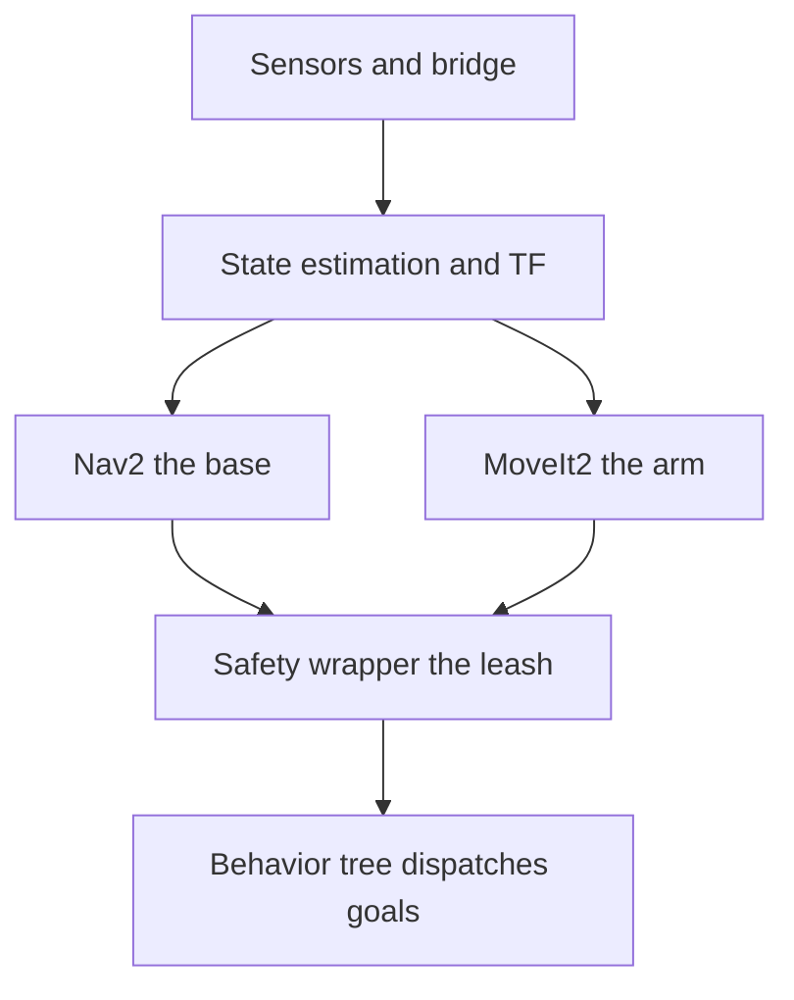
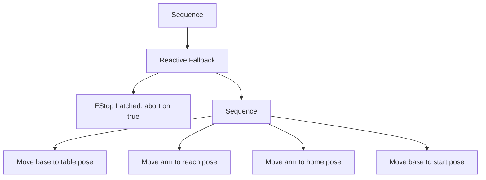

# Lecture 1 — Composing Nav2 and MoveIt2: Where Two Correct Codebases Disagree

> **Reading time:** ~75 minutes. **Hands-on time:** ~60 minutes (you bring the base and the arm up in one launch graph, build the integration interface table, and run a first pre-flight check).
> **Outcome:** You can compose Nav2 and MoveIt2 into one lifecycle-managed graph, name the four canonical integration defects from their symptoms, order the bring-up so the safety leash goes on first, and write a pre-flight check that aborts the run before a broken precondition becomes a robot doing the wrong thing.

For seven weeks you built planning and control as separate, correct skills. This week you put two of them in the same launch graph for the first time, and you discover the truth every senior robotics engineer already knows:

> **Integration is not "wire the parts together." Integration is where two correct subsystems disagree — about a frame, a timestamp, a namespace, a bring-up order — and your job is to find every disagreement before the robot does.**

Nav2 is, on its own, correct. MoveIt2 is, on its own, correct. You have run each against its own test and seen it work. Compose them and they fight, not because either has a bug, but because each made assumptions the other does not honor: about which frame the world is in, which topic carries joint states, which node activates first. None of these is a defect *in* Nav2 or *in* MoveIt2. They are *integration defects*, and they live exclusively in the seams between components. This lecture is a field guide to those seams.

---

## 1.1 — Two lifecycle stories, one graph

The first thing to understand is that you are composing two subsystems that *each already have a bring-up story*, and the stories are different.

**Nav2's story is the lifecycle manager.** Nav2 ships a `lifecycle_manager` node that drives a configured list of managed nodes — `controller_server`, `planner_server`, `behavior_server`, `smoother_server`, `bt_navigator`, `velocity_smoother` — through `unconfigured → inactive → active` in order, and through the reverse on shutdown. It is the cleanest large-scale example of managed-node bring-up in the open-source ecosystem, which is exactly why Week 4 had you rehearse the pattern. Nav2 nodes do not command the base until the manager activates them.

**MoveIt2's story is `move_group` plus a controller manager.** `move_group` is a single large node that owns the planning scene, the planning pipeline (OMPL and friends), and the action servers (`MoveGroup`, `ExecuteTrajectory`). Beneath it, a controller manager (`ros2_control` in most modern setups) owns the joint trajectory controllers that actually drive the arm, exposing a `FollowJointTrajectory` action. MoveIt2 is not lifecycle-managed the way Nav2 is by default; it comes up when its launch file runs and its controllers are spawned.

Composing them means you own a *third* bring-up story that sequences the first two. The pattern that works in 2026 is to put the whole thing under **one lifecycle manager** (or one orchestrator that drives both Nav2's manager and MoveIt2's controller spawning), so there is a single authority on bring-up order and a single place that declares "system ready." A graph with two independent bring-up authorities racing each other is the source of half the deadlocks in §1.3.

The dependency order — which you encode in the manager — is roughly:

1. **Sensors and the bridge.** The `ros_gz` bridge, the simulated IMU, LiDAR, wheel encoders, and joint-state sources. Not lifecycle-managed (they are sim plugins), but they must be publishing before anything downstream configures.
2. **State estimation and TF.** The EKF (`robot_localization`) and the `tf2` broadcasters. The `map → odom → base_link` chain *and* the static `base_link → arm_base` transform must be live before either Nav2 or MoveIt2 can resolve a goal.
3. **Nav2 (the base).** Its lifecycle manager brings up planner → controller → behavior → smoother → recovery. Depends on (2).
4. **MoveIt2 (the arm).** `move_group` plus the spawned arm controllers. Depends on (2) and a correct `/joint_states` for the arm.
5. **The safety wrapper.** The E-stop monitor. It must activate **before** the behavior tree can dispatch a motion goal — the leash goes on before anything can move (§1.5).
6. **The behavior tree and any telemetry.** The top-level BT that dispatches Nav2 and MoveIt2, last, because it orchestrates everything below it.

Get this order wrong and you get the bring-up-order deadlock (§1.3, defect 2) or a robot that can move before its leash is on (§1.5).


*The six-step bring-up order: safety activates after the base and arm but before the behavior tree can dispatch a goal.*

---

## 1.2 — The integration interface table: write the seams down before you compose

Before you launch anything, write down every seam. For each *pair* of components that must talk, record five things: the **topic**, the **message type**, the **frame**, the **rate**, and the **QoS**. That five-tuple is where every integration defect lives, and a disagreement in any field is a silent failure. Here is the interface table for the composed base+arm graph:

| Producer | Consumer | Topic | Type | Frame | Rate | QoS |
|---|---|---|---|---|---|---|
| EKF | Nav2, BT | `/odometry/filtered` | `nav_msgs/Odometry` | `odom`→`base_link` | ≥ 20 Hz | reliable, keep-last 10 |
| LiDAR | Nav2 costmap | `/scan` | `sensor_msgs/LaserScan` | `lidar_link` | ≥ 8 Hz | best-effort, keep-last 5 |
| Nav2 controller | base | `/cmd_vel` | `geometry_msgs/Twist` | `base_link` | ~20 Hz | reliable, keep-last 1 |
| arm `ros2_control` | MoveIt2 | `/joint_states` | `sensor_msgs/JointState` | n/a | ≥ 50 Hz | best-effort, keep-last 5 |
| MoveIt2 | arm controller | `/arm_controller/follow_joint_trajectory` | `control_msgs/FollowJointTrajectory` (action) | arm planning frame | on demand | reliable |
| TF static | Nav2, MoveIt2 | `/tf_static` | `tf2_msgs/TFMessage` | `base_link`→`arm_base` | latched | reliable, transient-local, deep |
| BT | Nav2 | `navigate_to_pose` | `nav2_msgs/NavigateToPose` (action) | `map` | on demand | reliable |
| safety node | Nav2, MoveIt2, BT | `/safety/estop` | `std_msgs/Bool` | n/a | latched | reliable, transient-local |

Read this table and the four integration defects light up before you ever run the graph:

- The **frame column** is where the frame/timing mismatch hides: Nav2 plans in `map`, MoveIt2 plans in the arm's planning frame, and the only thing connecting them is the static `base_link → arm_base` transform on `/tf_static`. If nobody broadcasts it, the arm has no idea where it is relative to the base, and a reach to a `base_link`-frame pose lands nowhere.
- The **rate column** is where timing races hide: `/joint_states` at 50 Hz feeds MoveIt2's controller; if a sloppy bring-up drops it to 5 Hz, trajectory execution stutters.
- The **QoS column** is where the silent-drop defects hide: `/tf_static` and `/safety/estop` *must* be `transient-local` so a node that subscribes after the broadcast still receives the latched value. A best-effort E-stop a late-subscribing controller misses is a safety defect of the worst kind — the exact Week 5 lesson, now with a person in the loop.

The discipline: derive the interface table from your architecture *before* you compose, and treat every row as a bilateral agreement both sides must honor. When a learner's arm reaches to the wrong place, the bug is almost always a frame-column disagreement nobody wrote down. The interface table is how you write them down; the pre-flight check (§1.6) is how you verify them at bring-up.

---

## 1.3 — The four canonical Phase-3 integration defects

Know these four. Each maps to a symptom you will see and a check that catches it.

### Defect 1 — The frame/timing mismatch

Two components agree on a topic but disagree on the frame or the timestamp. The classic Phase-3 version: the arm's planning frame is connected to the base only through a static `base_link → arm_base` transform, and nobody broadcast it — or it was broadcast on `/tf` (dynamic, `VOLATILE`) instead of `/tf_static` (latched), so a late-joining `move_group` never received it.

**Symptom:** the arm reaches confidently to the wrong place, or MoveIt2 throws `Could not find a connection between 'base_link' and 'arm_base'`. The base navigates fine; the arm is lost.

**Catch:** the pre-flight check asserts the `base_link → arm_base` transform is resolvable *and recent*. A static transform that is present but stamped at time zero, or one published `VOLATILE`, fails the freshness or the late-join check.

### Defect 2 — The bring-up-order deadlock

Node A's `on_activate` (or its first spin) blocks waiting for an input that only Node B produces, but the bring-up sequence tries to bring A up before B. The Phase-3 version: `move_group` blocks waiting for `/joint_states`, but the arm's `ros2_control` controller manager — the thing that publishes `/joint_states` — was scheduled to start *after* `move_group`.

**Symptom:** cold boot hangs forever. `move_group` logs "waiting for joint states" and never reaches ready. The base half is up; the arm half is frozen.

**Catch:** the pre-flight check asserts the lifecycle state of every managed node is `active` within a timeout, and reports *which* node is stuck so you can fix the order. The fix is in the bring-up sequence, not the node.

### Defect 3 — The joint-states / namespace collision

The arm's `move_group` reads a `/joint_states` that is *mixed*: the base bring-up publishes wheel joint states on the same topic, and now `move_group` sees joints it doesn't recognize, or the arm's joints are missing because they were published under a namespace `move_group` isn't listening to.

**Symptom:** `move_group` complains about unknown joints, or plans for an arm whose state is stale because it's reading the wrong joints. This is the defect that namespace discipline exists to prevent.

**Catch:** namespace the base and the arm cleanly (`/base/...`, `/arm/...`) or use a `joint_state_broadcaster` per controller and a `joint_state_publisher` that merges only the joints each consumer needs. The pre-flight check asserts `/joint_states` (or `/arm/joint_states`) carries exactly the arm's joints at the expected rate.

### Defect 4 — The controller-fights-controller clash

Two controllers command the same topic. The Phase-3 version is subtle: the base controller and a teleop node both publish `/cmd_vel`, or — more common in composition — the Nav2 `velocity_smoother` and a leftover `teleop_twist_keyboard` from your Week 20 testing both drive the base.

**Symptom:** the base jitters, lurches, or ignores Nav2 because a second publisher is fighting it. `ros2 topic info /cmd_vel -v` shows two publishers where there should be one.

**Catch:** the pre-flight check asserts `/cmd_vel` has exactly one publisher. The fix is to kill the stray publisher or twist-mux them with a clear priority. (`twist_mux` with the E-stop as the highest-priority input is the production pattern — and it foreshadows the safety work in Lecture 2.)

The lesson across all four: an integration defect is not a unit-test failure. It is a disagreement at a seam, invisible until both components are live, and the cure is to *write the seam down* (the interface table) and *verify it at bring-up* (the pre-flight check).

---

## 1.4 — Namespace discipline for two controllers

The defects above mostly trace back to one root cause: a flat namespace where two subsystems collide. The senior move is to give the base and the arm their own namespaces from the start.

```python
# In your composed launch file, group the base under /base and the arm under /arm.
from launch_ros.actions import PushRosNamespace
from launch.actions import GroupAction, IncludeLaunchDescription

base = GroupAction([
    PushRosNamespace("base"),
    IncludeLaunchDescription(nav2_bringup_launch),   # /base/cmd_vel, /base/odom, ...
])

arm = GroupAction([
    PushRosNamespace("arm"),
    IncludeLaunchDescription(moveit2_bringup_launch),  # /arm/joint_states, ...
])
```

With this, `/base/cmd_vel` and `/arm/joint_states` cannot collide with each other or with a stray flat-namespace node. The cost is that your behavior tree and your safety node must address topics by their namespaced names, and your `tf2` frames must still be globally unique (frames are *not* namespaced by `PushRosNamespace` — `base_link` is `base_link` everywhere, which is correct, because the TF tree is one tree). This frame-vs-topic asymmetry trips people up: topics get a namespace prefix, frames do not. Get it wrong and you either have colliding topics (no namespace) or a TF tree that can't connect (frames wrongly prefixed).

A pragmatic middle ground many shops use: namespace the *controllers and their I/O* but keep the shared, genuinely-global topics (`/tf`, `/tf_static`, `/clock`, `/safety/estop`) un-namespaced, because they are system-wide by nature. The E-stop in particular is deliberately global: it is the one topic every motion-commanding node in the graph must hear, so it lives at the root, `RELIABLE`/`TRANSIENT_LOCAL`, addressable by everyone.

---

## 1.5 — Ordered, safety-first lifecycle bring-up

The dependency order from §1.1 is mostly about correctness — don't activate a node before its inputs exist. But one ordering constraint is about *safety*, and it is non-negotiable:

> **The safety wrapper activates before any controller can command the robot. The leash goes on before anything can move.**

If the lifecycle manager activates `controller_server` (which can publish `/cmd_vel`) or spawns the arm controller (which can drive joints) *before* the E-stop monitor is subscribed and ready, there is a window — milliseconds, but real — in which the robot can be commanded with no functioning E-stop. On a bench that window is harmless. Near a person, it is a hazard, and a hazard that exists "only during bring-up" is still a hazard the safety case must account for. So the activation sequence puts the safety node ahead of every node that can produce motion.

Encode this in the lifecycle manager's `node_names` list and its activation order, exactly as Nav2 orders its own internal nodes. The pre-flight check then verifies the *end* state (everything `active`); the ordering is what guarantees the *path* to that state was safe.

```python
# Sketch of the safety-first activation order in your lifecycle manager config.
managed_nodes = [
    "ekf_node",            # 2. state estimation (after sensors, which are sim plugins)
    "planner_server",      # 3. Nav2
    "controller_server",   #    can command /cmd_vel — but not active until...
    "bt_navigator",
    "move_group",          # 4. MoveIt2
    "safety_wrapper",      # 5. the LEASH — activated before the BT can dispatch a goal
    "task_bt",             # 6. the orchestrator, last
]
# The manager activates in list order; safety_wrapper precedes task_bt deliberately.
```

A subtlety: `controller_server` appears *before* `safety_wrapper` in the list, which looks like it violates the rule. It does not, because activating `controller_server` only makes it *able* to command — nothing *tells* it to until the BT dispatches a goal, and the BT (`task_bt`) is activated last, after the safety wrapper. The invariant you actually need is: *nothing that dispatches a motion goal activates before the safety wrapper.* The controller being live-but-idle behind an un-dispatched goal is fine; the orchestrator that would dispatch is what waits for the leash.

---

## 1.6 — The pre-flight check: prove the preconditions before you send a goal

A complex robot is not "launched"; it is *brought up under a checklist*. You have stood up small graphs before. This one has two dozen nodes, a dozen lifecycle-managed, that must all be true at once before a single goal is meaningful. "Launch it and see" is a coin flip you pay for in lost hours. The senior move is a **pre-flight check**: a scripted node that asserts every precondition holds and *aborts the run loudly with an actionable message* the moment one does not.

Aviation runs the checklist not because the crew is forgetful but because an unchecked assumption at altitude is unrecoverable. Your robot's "altitude" is "about to command a 6-DOF arm near a person." The checklist is the cheapest place to catch the four integration defects before they become a robot doing the wrong thing.

The pre-flight check hunts exactly the four defects:

- **Frame/timing** → `check_transform("base_link", "arm_base")` resolves and is recent.
- **Bring-up-order deadlock** → `check_lifecycle_active("move_group")` reports `active` within a timeout, and names the node if it's stuck.
- **Joint-states/namespace** → `check_topic_publishing("/arm/joint_states", 50.0)` confirms the arm's joints at rate.
- **Controller clash** → `check_single_publisher("/base/cmd_vel")` confirms exactly one publisher.

Here is the shape of the node. Exercise 2 makes you build the full version against your own stack.

```python
#!/usr/bin/env python3
"""Pre-flight check skeleton: assert the composed base+arm graph is healthy
before any goal is sent. Exits 0 if all checks pass, 1 otherwise."""

import sys
import time
from dataclasses import dataclass

import rclpy
from rclpy.node import Node
from rclpy.qos import QoSProfile, ReliabilityPolicy, HistoryPolicy
from rclpy.duration import Duration
from rclpy.time import Time
from tf2_ros import Buffer, TransformListener


@dataclass
class CheckResult:
    name: str
    passed: bool
    detail: str


class PreflightCheck(Node):
    def __init__(self) -> None:
        super().__init__("preflight_check")
        self._tf_buffer = Buffer()
        self._tf_listener = TransformListener(self._tf_buffer, self)
        self._sensor_qos = QoSProfile(
            reliability=ReliabilityPolicy.BEST_EFFORT,
            history=HistoryPolicy.KEEP_LAST, depth=5,
        )

    def check_clock_advancing(self, window_s: float = 1.0) -> CheckResult:
        """A frozen sim clock makes every rate check lie. Verify it first."""
        t0 = self.get_clock().now()
        end = time.monotonic() + window_s
        while time.monotonic() < end and rclpy.ok():
            rclpy.spin_once(self, timeout_sec=0.05)
        dt = (self.get_clock().now() - t0).nanoseconds * 1e-9
        ok = dt > 0.5 * window_s
        return CheckResult("clock", ok,
                           f"clock advanced {dt:.2f}s in {window_s:.2f}s wall")

    def check_transform(self, target: str, source: str,
                        max_age_s: float = 1.0) -> CheckResult:
        try:
            tf = self._tf_buffer.lookup_transform(
                target, source, Time(), timeout=Duration(seconds=2.0))
        except Exception as exc:
            return CheckResult(f"tf:{target}<-{source}", False,
                               f"lookup failed: {exc}")
        age = (self.get_clock().now()
               - Time.from_msg(tf.header.stamp)).nanoseconds * 1e-9
        ok = age <= max_age_s
        return CheckResult(f"tf:{target}<-{source}", ok,
                           f"age {age:.2f}s (need <= {max_age_s:.2f}s)")

    def check_single_publisher(self, topic: str) -> CheckResult:
        """Defect 4: exactly one publisher on a command topic."""
        n = len(self.get_publishers_info_by_topic(topic))
        ok = n == 1
        return CheckResult(f"pubcount:{topic}", ok,
                           f"{n} publishers (need exactly 1)")
```

Read the design choices. Every check returns a `CheckResult` with a *detail string* — the observed value next to the required value — so a failure is immediately actionable, not just red. `main` exits non-zero on any failure, which is the load-bearing behavior: a launch file or CI step can gate the run on the check returning 0 (you wire this in the homework). The clock check runs **first** because a frozen sim clock — the most common Gz integration footgun — makes every rate check compute against a stopped clock and lie. The single-publisher check is the one most people forget, and it is exactly defect 4.

What the pre-flight check is *not*: a substitute for runtime guards. It verifies *static* preconditions (presence, rate, frame, lifecycle state) once at bring-up. A controller that goes unstable *mid-run* is a dynamic failure the E-stop and the safety wrapper catch (Lecture 2), not pre-flight. Pre-flight catches the static defects so the run only has to worry about the dynamic ones.

---

## 1.7 — The top-level behavior tree: drive, reach, return

With the graph composed and pre-flight passing, the run itself is a behavior tree — and the architectural rule from Week 19 holds: **your tree is at the top, dispatching Nav2 and MoveIt2; it is not buried inside Nav2's navigation tree.** The composed task is a sequence:

```xml
<!-- capstone_drive_reach_return.xml — the top-level tree (BT.CPP). -->
<root BTCPP_format="4">
  <BehaviorTree ID="DriveReachReturn">
    <Sequence>
      <!-- Safety guard: the whole task lives under a fallback that aborts on estop. -->
      <ReactiveFallback>
        <EStopLatched topic="/safety/estop"/>          <!-- condition: true => abort -->
        <Sequence>
          <MoveBaseToPose goal="{table_pose}"/>         <!-- wraps Nav2 NavigateToPose -->
          <MoveArmToPose   goal="{reach_pose}"/>        <!-- wraps MoveIt2 MoveGroup -->
          <MoveArmToPose   goal="{home_pose}"/>
          <MoveBaseToPose  goal="{start_pose}"/>
        </Sequence>
      </ReactiveFallback>
    </Sequence>
  </BehaviorTree>
</root>
```

The `MoveBaseToPose` leaf is a BT action node that sends a `NavigateToPose` goal and ticks `RUNNING` until the action server returns. The `MoveArmToPose` leaf does the same against MoveIt2's `MoveGroup` action. The `ReactiveFallback` with `EStopLatched` as its first child is the safety wiring: a `ReactiveFallback` re-ticks its children every cycle, so the instant `/safety/estop` latches `true`, `EStopLatched` returns `SUCCESS`, the fallback short-circuits, and the running motion leaf is *halted* (BT.CPP calls `halt()` on the interrupted node, which cancels the underlying action). This is how the BT participates in the E-stop — but, as Lecture 2 stresses, the BT is *one* path to stopping, not the only one; the safety node also cancels the actions directly, because relying on the tree's tick rate alone is too slow for a 200 ms budget.


*The top-level behavior tree: an E-stop check guards the drive-reach-return sequence at every tick.*

This drive-reach-return sequence is deliberately simple: a *fixed* reach pose, no perception. That is the point of the milestone — with the pose held constant, the only variables are the integration and the safety. Phase 4 replaces `{reach_pose}` with a grasp computed from a point cloud; the tree's shape barely changes, which is exactly why composing it cleanly now compounds.

---

## 1.8 — A worked composition footgun: the static transform that wasn't latched

It is worth doing one defect exhaustively, because the depth of debugging you apply to one is the depth you should apply to all four. Take the most common Phase-3 composition failure: the arm cannot find the base.

A learner brings up the base (Nav2, fine) and the arm (MoveIt2). MoveIt2 logs `Could not find a connection between 'world' and 'arm_base'`. The learner checks: they *did* broadcast `base_link → arm_base`. They can even see it: `ros2 run tf2_ros tf2_echo base_link arm_base` prints the transform. So why is `move_group` blind to it?

The answer is in the QoS, and it is the Week 5 lesson with a manipulator attached. The transform was broadcast on `/tf` (dynamic) by a regular `transform_broadcaster`, `VOLATILE`, once at startup. `move_group` started *after* that single broadcast and — because `/tf` is `VOLATILE` — never received it; `VOLATILE` does not replay to late subscribers. `tf2_echo`, started fresh, *also* missed the one-shot broadcast but happened to catch the next periodic re-broadcast, masking the problem. The fix is one line: broadcast a static transform on `/tf_static` with a `StaticTransformBroadcaster`, which uses `RELIABLE`/`TRANSIENT_LOCAL` with a deep history, so any node that joins *after* the broadcast still receives every static transform.

```python
# WRONG: a one-shot dynamic broadcast; a late move_group misses it (VOLATILE).
from tf2_ros import TransformBroadcaster
self.br = TransformBroadcaster(self)
self.br.sendTransform(make_tf("base_link", "arm_base"))   # once, VOLATILE — landmine

# RIGHT: a static broadcast; latched, replayed to late subscribers (TRANSIENT_LOCAL).
from tf2_ros import StaticTransformBroadcaster
self.static_br = StaticTransformBroadcaster(self)
self.static_br.sendTransform(make_tf("base_link", "arm_base"))   # latched — correct
```

The general lesson: a *fixed* relationship (the arm bolted to the base) is a *static* transform, and static transforms go on `/tf_static`, latched, because a manipulator that bolts on after the base boots must still learn where it is. Getting this one right is what separates "my arm reaches the wrong place and I don't know why" from a clean composition — and it is exactly the kind of seam the pre-flight check's transform-freshness assertion catches at bring-up instead of at the demo.

---

## 1.8.1 — The units defect, the quiet cousin of the frame defect

There is a fifth defect that hides next to the four — quieter, because it produces no error message at all. It is the **units mismatch**, and REP 103 exists precisely to prevent it. Two components agree on the topic, the frame, the rate, and the QoS, and still disagree, because one publishes an angle in *degrees* and the other reads it as *radians*, or one publishes a distance in *millimeters* and the other reads *meters*. ROS2 conventions (REP 103) mandate radians and meters everywhere, but a sensor driver ported from a vendor SDK, or a controller copied from a degrees-based codebase, can quietly violate it. The symptom is not a crash — it is a robot that moves by exactly `180/π ≈ 57×` too much or `1000×` too little, and the arm that should rotate a wrist by 0.3 rad instead tries to rotate it by 0.3 *degrees* (and barely moves) or by 17 degrees (and overshoots). There is no exception because both numbers are valid floats. The catch is partly the interface table (write the units in the type column — `rad`, `m`, `m/s`), partly a pre-flight sanity check (does the commanded motion produce roughly the expected displacement?), and partly the habit of *never* assuming a number's units without checking the message definition. A units bug between two correct components is the second-most-common integration defect after frames, and the one that survives the longest because it looks like a tuning problem.

## 1.8.2 — Composition is a graph you can draw

Before you launch the composed graph, draw it. Not metaphorically — actually sketch the node graph (`rqt_graph` will draw the live one, but draw the *intended* one first) with every node as a box, every topic as a labeled arrow, and every lifecycle dependency as a dashed edge. The drawing forces you to confront questions the launch file lets you ignore: which node owns `/cmd_vel`? (Exactly one, or defect 4.) Where does `/joint_states` come from, and does the arm's `move_group` read the right one? (Defect 3.) What is the activation order, and is the safety node before the BT? (The §1.5 invariant.) A senior engineer's first artifact for a composed system is not code — it is this graph, because the graph makes the seams visible, and the seams are where integration lives or dies. Compare your drawn graph to the live `rqt_graph` after bring-up: every difference is a place where the system is not what you thought it was, which is exactly the set of integration defects you are hunting. The drawing-then-comparing discipline turns "why won't this work?" into "the live graph has an extra `/cmd_vel` publisher my drawing doesn't — there's defect 4."

---

## 1.9 — Recap and the move to safety

You should now be able to:

- Compose Nav2 (base) and MoveIt2 (arm) into one graph under a single bring-up authority, with the dependency order that keeps a node from commanding hardware before its inputs are valid.
- Write the integration interface table — topic, type, frame, rate, QoS for every seam — and read the four integration defects out of it before you launch.
- Name the four canonical Phase-3 defects (frame/timing, bring-up-order deadlock, joint-states/namespace, controller clash) from their symptoms, and map each to the pre-flight check that catches it.
- Namespace the base and the arm so their controllers don't collide, while keeping the TF tree (and the E-stop) global.
- Order the lifecycle bring-up so the safety leash goes on before anything can dispatch a motion.
- Write a pre-flight check node that asserts the clock, topics, transforms, lifecycle states, and publisher counts, with actionable detail strings and a load-bearing non-zero exit.

You have the body — a base and an arm that move under one graph. Lecture 2 puts the leash on it properly: the vocabulary of functional safety, the hazard log that catalogs how every controller fails, and the software E-stop that stops both halves of the robot within a measured 200 ms. Continue to [Lecture 2 — A Functional-Safety Primer](./02-functional-safety-primer.md).

---

## References

- *Nav2 — Lifecycle and bringup*: <https://docs.nav2.org/concepts/index.html>
- *MoveIt2 — Concepts and move_group*: <https://moveit.picknik.ai/main/index.html>
- *REP 105 — Coordinate frames for mobile platforms*: <https://www.ros.org/reps/rep-0105.html>
- *`tf2` lookup and time-travel model*: <https://docs.ros.org/en/jazzy/Tutorials/Intermediate/Tf2/Tf2-Main.html>
- *ROS2 Jazzy — Launch system*: <https://docs.ros.org/en/jazzy/Tutorials/Intermediate/Launch/Launch-Main.html>
- *`StaticTransformBroadcaster` and `/tf_static`* — `tf2_ros`: <https://github.com/ros2/geometry2/tree/jazzy/tf2_ros>
- *Google SRE — Reliable Product Launches at Scale* (the pre-flight checklist): <https://sre.google/sre-book/reliable-product-launches/>
