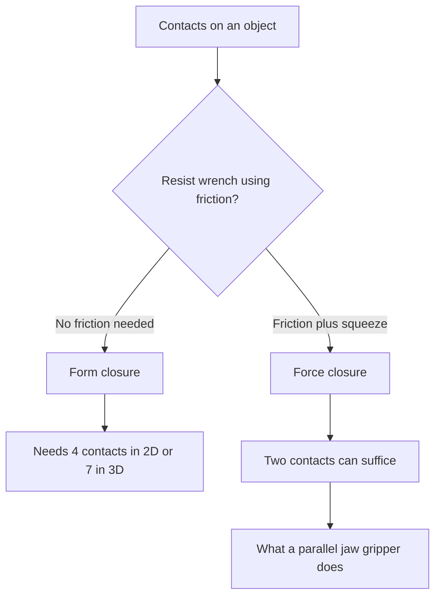
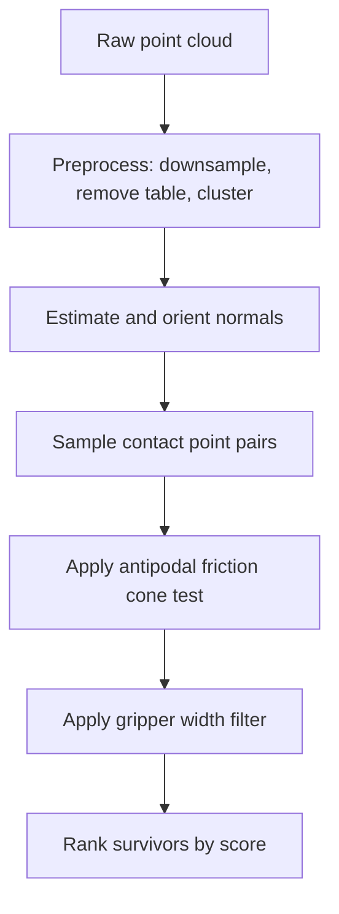

# Lecture 1 — Grasp Mechanics: Force Closure, the Friction Cone, and Antipodal Grasps

> **Duration:** ~2 hours of reading + hands-on.
> **Outcome:** You can define force closure and form closure, test a 2D grasp for force closure with the friction cone, state the antipodal condition precisely, and implement the algorithm that samples antipodal grasp candidates on a point cloud.

If you remember one sentence from this entire week, remember this one:

> **A grasp is a geometric claim about contact. Force closure asks: can these contacts, using the friction available, resist any disturbance? Most grasp failures are failures of that geometry — the pose is wrong — not failures of a policy.**

A two-finger gripper does not "decide" to hold an object. It places two contacts on a surface and squeezes. Whether the object stays put when you lift it, when the arm accelerates, when gravity tugs — that is decided entirely by the *geometry of the contacts and the friction between finger and object*. This lecture is the mechanics of that geometry. It is the same mechanics a learned grasp network (Week 26) is implicitly approximating, which is why understanding it by hand makes the network legible instead of magic.

---

## 1. Two kinds of "closure"

When we say a grasp "holds," we mean it resists disturbances — external forces and torques (together, a *wrench*) that try to move the object out of the gripper. There are two distinct guarantees, and conflating them is the first mistake.

### 1.1 Form closure

**Form closure** means the contacts constrain the object *geometrically*, so that *no* motion of the object is possible without penetrating a finger — and this holds **regardless of friction**, even with frictionless contacts. A peg in a perfectly fitted hole has form closure; so does an object caged by enough fingers that it cannot translate or rotate in any direction.

The cost of form closure is *contacts*. A classic result: a 2D rigid body needs at least **4** frictionless point contacts for form closure, and a 3D rigid body needs at least **7**. A two-finger gripper has two contacts. It therefore **cannot** achieve form closure on a general object — two frictionless contacts leave the object free to slide and rotate. Form closure is the world of multi-finger hands and fixtures, not parallel-jaw grippers.

### 1.2 Force closure

**Force closure** means the contacts can resist any applied wrench **by using friction** — the fingers press hard enough, and friction at the contacts supplies the tangential forces needed to balance the disturbance. This is what a two-finger gripper actually achieves on a good grasp: two contacts, plus friction, plus enough squeezing force.

Force closure is weaker than form closure (it needs friction, and it needs the contacts to squeeze) but it is achievable with far fewer contacts — *two* well-placed contacts with friction can force-close a 3D object. That is the entire reason parallel-jaw grasping works at all.

> **The distinction in one line:** form closure constrains geometrically and needs no friction but many contacts; force closure constrains via friction and needs few contacts but enough friction and squeeze. Your gripper does force closure. Say "force closure," not "form closure," when you mean a two-finger grasp — getting this wrong in an interview is a tell.


*Form closure relies on geometry and many contacts; force closure relies on friction and few contacts, which is what a two-finger gripper uses.*

---

## 2. The contact model: point contact with friction and the friction cone

To reason about force closure you need a model of what a single contact can *do*. The standard model for a fingertip on a surface is a **point contact with friction** (the "hard finger" model): the contact can push *into* the surface (a normal force) and resist sliding *along* the surface (a tangential friction force), but it cannot pull (no adhesion) and cannot apply a torque about the contact normal (a point, not a patch).

The friction limit is **Coulomb's law**: the tangential force `f_t` a contact can sustain without slipping is bounded by the normal force `f_n` times the friction coefficient `mu`:

```
|f_t| <= mu * f_n
```

Geometrically, this defines the **friction cone**: the set of all contact forces the surface can apply lies inside a cone, centered on the inward surface normal, with half-angle

```
alpha = arctan(mu)
```

A force inside the cone is sustainable (no slip); a force on the boundary is at the slip threshold; a force outside the cone cannot be applied — the contact slips first. For a typical rubber finger on a plastic object, `mu ≈ 0.5`, so `alpha ≈ 27°`. For a slick contact, `mu ≈ 0.2`, `alpha ≈ 11°` — a much narrower cone, which is exactly why slippery objects are hard to grasp: the cone of forces you can apply shrinks, so fewer grasp geometries are stable.

```python
import numpy as np

def friction_cone_half_angle(mu: float) -> float:
    """Half-angle of the friction cone about the inward surface normal."""
    return np.arctan(mu)

# Rubber-on-plastic vs. slick contact:
#   mu=0.5 -> alpha ~ 0.46 rad (27 deg)   wide cone, forgiving
#   mu=0.2 -> alpha ~ 0.20 rad (11 deg)   narrow cone, unforgiving
```

The friction cone is the central object of grasp mechanics. Everything that follows — force closure, the antipodal condition — is a statement about whether the required contact forces lie *inside* the cones.

---

## 3. Force closure, tested

Here is force closure stated operationally, which is what you can actually compute. The contacts can resist an arbitrary wrench if and only if the friction cones, taken together, can generate forces and torques spanning all of wrench space — formally, the convex hull of the contact wrenches (the forces on the friction-cone boundaries, mapped to wrenches via the contact positions) contains the origin in its interior. For a general 3D grasp this is a convex-geometry computation (the "grasp wrench space" and its containment of the origin).

For the **2D, two-contact** case — which is the case you will test by hand and the case that builds the intuition — there is a beautifully simple criterion:

> **Two point contacts with friction force-close a 2D object if and only if the line segment joining the two contact points lies *inside both friction cones*.**

Read that carefully, because it is the antipodal condition in disguise (§4). At contact A, draw the friction cone about A's inward normal. At contact B, draw the friction cone about B's inward normal. Draw the line from A to B. If that line lies within A's cone *and* within B's cone, the two fingers — squeezing along that line — can resist any wrench, and you have force closure. If the line falls outside either cone, the squeeze force has a tangential component the friction can't sustain, the contact slips, and the object squirts out.

```python
import numpy as np

def line_in_cone(contact_pt, other_pt, inward_normal, mu) -> bool:
    """Does the line from contact_pt toward other_pt lie inside the friction
    cone at contact_pt (cone about inward_normal, half-angle arctan(mu))?"""
    d = np.asarray(other_pt) - np.asarray(contact_pt)
    d = d / (np.linalg.norm(d) + 1e-12)
    n = np.asarray(inward_normal) / (np.linalg.norm(inward_normal) + 1e-12)
    cos_angle = float(np.dot(d, n))             # angle between line and inward normal
    angle = np.arccos(np.clip(cos_angle, -1.0, 1.0))
    return angle <= np.arctan(mu)

def force_closure_2d(ptA, nA, ptB, nB, mu) -> bool:
    """2D two-contact force closure: the A-B line lies inside BOTH friction cones.
    nA, nB are the INWARD surface normals at A and B (pointing into the object)."""
    return (line_in_cone(ptA, ptB, nA, mu)
            and line_in_cone(ptB, ptA, nB, mu))
```

Worked example. A box, contacts on two opposite faces, normals pointing straight in at each other, the line A→B exactly along both normals. The angle between the line and each inward normal is `0`, which is `≤ arctan(mu)` for any `mu > 0` — force closure, trivially, for any friction at all. Now slide contact B up the face so the A→B line tilts 20° off B's normal. With `mu = 0.5` (`alpha = 27°`), 20° < 27° — still closed. With `mu = 0.2` (`alpha = 11°`), 20° > 11° — *not* closed; the slick contact can't hold the tilted squeeze. Same geometry, different friction, different verdict. That is the whole game, and Exercise 1 makes you run it by hand before you trust the code.

---

## 4. Antipodal grasps: the two-finger workhorse

The 2D force-closure criterion (§3) tells you *exactly* what a good two-finger grasp looks like, and it has a name: an **antipodal grasp**.

> **A grasp is antipodal when the two contact points have surface normals that are anti-parallel and collinear with the line joining them** — i.e., the line A→B is (close to) along A's inward normal *and* along B's inward normal. The fingers close along that line, squeezing the object between two opposing surfaces.

The connection to §3 is direct: if the A→B line is along both inward normals, it is trivially inside both friction cones (angle 0), so an *ideal* antipodal grasp force-closes for any friction. In practice surfaces aren't perfectly opposed, so we relax: a grasp is *antipodally feasible* if the A→B line lies within both friction cones — exactly the 2D force-closure test. The friction coefficient sets how much misalignment you can tolerate: a wide cone (high `mu`) forgives sloppy antipodal pairs; a narrow cone (low `mu`) demands near-perfect opposition.

This is why antipodal grasps are the workhorse. They are the geometric sweet spot for a parallel-jaw gripper: two opposing contacts, the closing direction aligned with the contact normals, force closure guaranteed when the alignment is within the friction cone. Every analytic two-finger grasp planner — and the contact representation inside Contact-GraspNet — is, at its core, finding antipodal pairs.

### 4.1 The antipodal condition, precisely

Given two surface points `p_A`, `p_B` with outward surface normals `n_A`, `n_B` (Open3D gives you outward normals; the *inward* normals are `-n_A`, `-n_B`), and the unit vector along the line `u = (p_B - p_A) / ||p_B - p_A||`, the grasp is antipodally feasible with friction `mu` iff:

```
angle(u,  -n_A) <= arctan(mu)      # the line is within A's friction cone
angle(-u, -n_B) <= arctan(mu)      # the reverse line is within B's friction cone
```

Equivalently, in terms of the outward normals: `u` should be close to `-n_A` (pointing from A into the object toward B) and `-u` close to `-n_B`. The two normals should be roughly anti-parallel (`n_A ≈ -n_B`) and roughly collinear with `u`.

```python
def antipodal_score(pA, nA, pB, nB, mu) -> float:
    """Return an antipodal-quality score in [0, 1]; 0 if outside a friction cone.
    pA, pB: contact points. nA, nB: OUTWARD surface normals. mu: friction coeff.
    1.0 = perfect opposition; lower = more misaligned but still feasible; 0 = infeasible."""
    pA, pB = np.asarray(pA), np.asarray(pB)
    nA = np.asarray(nA) / (np.linalg.norm(nA) + 1e-12)
    nB = np.asarray(nB) / (np.linalg.norm(nB) + 1e-12)
    u = pB - pA
    dist = np.linalg.norm(u)
    if dist < 1e-9:
        return 0.0
    u = u / dist
    alpha = np.arctan(mu)
    # Angle between the closing line and each INWARD normal (-n).
    ang_A = np.arccos(np.clip(np.dot(u, -nA), -1.0, 1.0))
    ang_B = np.arccos(np.clip(np.dot(-u, -nB), -1.0, 1.0))
    if ang_A > alpha or ang_B > alpha:
        return 0.0                                  # outside a friction cone: infeasible
    # Reward being centered in the cones (small angles).
    return float(1.0 - 0.5 * (ang_A + ang_B) / alpha)
```

A score of 1.0 is a perfectly opposed grasp; a score near 0 (but positive) is a feasible-but-sloppy grasp at the edge of a friction cone; a score of exactly 0 means the pair fails the friction-cone test and is not a candidate at all. This score is the first term of the full ranking heuristic in Lecture 2.

---

## 5. Sampling antipodal candidates on a point cloud

You don't get clean contact points handed to you — you get a point cloud of the object's surface from a depth camera. The algorithm to turn a cloud into ranked antipodal grasp candidates:

1. **Preprocess the cloud.** Voxel-downsample (reduce 100k points to a few thousand), remove the table plane (RANSAC), and cluster to isolate the object (Week 15 skills). You now have the object's surface points.
2. **Estimate normals.** Open3D's `estimate_normals` gives an outward normal per point. Orient them consistently (toward the camera, then flip to outward) — a flipped normal silently inverts the antipodal test.
3. **Sample contact-point pairs.** For each sampled surface point `p_A`, shoot a ray *into* the object along `-n_A` and find the surface point `p_B` it exits through (or, more simply, find the nearest surface point whose normal is roughly anti-parallel and that lies roughly along `-n_A` from `p_A`). That pair is a candidate.
4. **Apply the antipodal test.** Score each pair with `antipodal_score`. Reject pairs scoring 0 (outside a friction cone).
5. **Apply the width filter.** Reject pairs whose separation `||p_B - p_A||` exceeds the gripper's max opening or is below its min — the gripper physically can't span them.
6. **Rank.** Sort the survivors by score (refined in Lecture 2 with approach sanity, collision-freedom, and reachability).


*The cloud-to-candidates pipeline: each stage narrows raw points down to a ranked list of feasible grasps.*

```python
import numpy as np
import open3d as o3d

def sample_antipodal_grasps(pcd, mu=0.5, gripper_max_width=0.085,
                            gripper_min_width=0.01, n_samples=2000):
    """Sample antipodal contact pairs on an object point cloud.
    Returns a list of (pA, pB, score, width) sorted by score descending."""
    pcd.estimate_normals(
        search_param=o3d.geometry.KDTreeSearchParamHybrid(radius=0.02, max_nn=30))
    pcd.orient_normals_consistent_tangent_plane(k=15)
    pts = np.asarray(pcd.points)
    nrm = np.asarray(pcd.normals)
    tree = o3d.geometry.KDTreeFlann(pcd)

    candidates = []
    rng = np.random.default_rng(0)
    idxs = rng.choice(len(pts), size=min(n_samples, len(pts)), replace=False)
    for i in idxs:
        pA, nA = pts[i], nrm[i]
        # The antipodal partner is roughly along -nA from pA, at gripper-spannable range.
        # Search a neighborhood at ~half the max width along the inward normal.
        probe = pA - nA * (gripper_max_width * 0.5)
        k, nbr_idx, _ = tree.search_knn_vector_3d(probe, 10)
        for j in nbr_idx:
            if j == i:
                continue
            pB, nB = pts[j], nrm[j]
            width = float(np.linalg.norm(pB - pA))
            if not (gripper_min_width <= width <= gripper_max_width):
                continue
            score = antipodal_score(pA, nA, pB, nB, mu)
            if score > 0.0:
                candidates.append((pA, pB, score, width))
    candidates.sort(key=lambda c: c[2], reverse=True)
    return candidates
```

This is the spine of the mini-project. It is deliberately a *heuristic* — it samples, tests, and ranks; it does not learn. That is its strength (no model, no GPU, fully explainable) and its weakness (it has no prior about *which* grasps tend to succeed for *this kind* of object, which is exactly what the learned planners of Week 26 add).

---

## 6. Why the pose is what matters

Here is the lesson that earns this week its place before the learned-grasping week. Run the sampler, take the top grasp, hand it to MoveIt2, and watch the most common failures. They are almost never "the gripper wasn't strong enough" or "the policy chose wrong." They are *pose* failures:

- **The grasp point is a few millimeters off**, so one finger contacts and the other misses, and the object spins out instead of being squeezed.
- **The approach angle is a few degrees off**, so the closing line falls outside a friction cone (§3), and the contact slips.
- **The width is set to the contact separation with no margin**, so the fingers brush the object on approach and knock it over before they close.

Every one of these is the *geometry* — the pose, the approach, the width — not the gripper and not a policy. This is why the syllabus says "most grasp failures are pose errors, not policy errors," and it is why this analytic week comes first. When you deploy Contact-GraspNet next week and a grasp fails, your first question will not be "is the network bad?" — it will be "is the predicted pose off, and by how much?" — because you learned, by hand, that the pose is where grasps live or die.

The mitigation is also geometric: add margin (open the gripper a centimeter wider than the contact separation so approach is forgiving), prefer grasps centered in the friction cones (high `antipodal_score`, robust to a few degrees of pose error), and *visualize the gripper at the grasp* before you execute (the single best debugging view — you can *see* the finger miss). All three are in the mini-project.

---

## 6.5 — A fully worked antipodal example, by hand

To make the antipodal condition concrete, work one example end to end with numbers, because the friction-cone arithmetic is something you should be able to do without code.

Take a cylinder of radius `r = 0.035 m` lying with its axis along `z`, and consider grasping it across a horizontal diameter. Two candidate contacts:

- **Contact A** at `(-0.035, 0, 0.06)`, outward normal `n_A = (-1, 0, 0)` (pointing out, in `-x`).
- **Contact B** at `(+0.035, 0, 0.06)`, outward normal `n_B = (+1, 0, 0)` (pointing out, in `+x`).

The closing line `u = (p_B - p_A)/||p_B - p_A|| = (1, 0, 0)`, and the width `||p_B - p_A|| = 0.070 m`.

Now the antipodal test. The *inward* normals are `-n_A = (1, 0, 0)` and `-n_B = (-1, 0, 0)`.

- Angle between `u = (1,0,0)` and `-n_A = (1,0,0)`: `arccos(1) = 0°`.
- Angle between `-u = (-1,0,0)` and `-n_B = (-1,0,0)`: `arccos(1) = 0°`.

Both angles are `0`, which is `≤ arctan(mu)` for *any* `mu > 0`. So a diametric grasp on a cylinder is *perfectly* antipodal — force closure for any friction. This is why a cylinder has a continuum of excellent grasps: every diameter at every height is perfectly antipodal, and `antipodal_score` returns ~1.0 for all of them. The width (0.070 m = the diameter) must fit the gripper, and that is the only real constraint.

Now perturb it: slide contact B up the cylinder wall by 0.02 m so `p_B = (0.035, 0, 0.08)`. The closing line is now `u = (0.070, 0, 0.020)/||...|| = (0.962, 0, 0.275)`, and the angle to `-n_A = (1,0,0)` is `arccos(0.962) ≈ 16°`. With `mu = 0.5` (`alpha ≈ 27°`), 16° < 27° — still force-closure, score ~0.7. With `mu = 0.2` (`alpha ≈ 11°`), 16° > 11° — *not* force closure, score 0. Same two contacts, friction decides. Do this arithmetic until it is automatic; it is the single most useful grasp-mechanics skill, and it is what `antipodal_score` computes for you on every candidate.

## 7. A note on the wrench, for the curious

The 2D criterion in §3 is exact for two contacts in the plane, but the general claim — "force closure iff the contact wrenches positively span wrench space" — deserves a sentence, because it is what the 3D and multi-contact case actually requires and what a learned planner's quality metric approximates.

Each contact, with friction, can apply a *set* of forces (the friction cone). Each force, applied at the contact point, produces a *wrench* (a force + a torque about the object's center: `tau = r × f`). The set of wrenches a grasp can apply is the convex cone generated by all the contact-force wrenches. **The grasp force-closes iff that wrench cone is all of wrench space** — equivalently, iff the origin lies strictly inside the convex hull of the contact-wrench generators. In 2D wrench space is 3-dimensional (`f_x, f_y, tau`); in 3D it is 6-dimensional. Approximating the friction cone by a polygon (say, 8 facets) turns this into a linear-programming feasibility test, which is how analytic grasp-quality metrics (the "Ferrari-Canny" metric and its kin) are actually computed. You do not implement the 6D version this week — the 2D antipodal test captures the intuition and is what your gripper needs — but knowing the wrench picture is there is what lets you read a grasp-quality paper without flinching.

One concept from the wrench picture is worth naming because it appears in every analytic grasp-quality metric: the **largest-minimum-resisted-wrench** (often the "epsilon" or Ferrari-Canny metric). Informally, it asks: over all directions in wrench space, what is the *smallest* disturbance wrench the grasp can just barely resist? A grasp that can resist a large wrench in every direction is robust; a grasp that can resist a lot in some directions but almost nothing in one direction is fragile — that weak direction is where the object squirts out. The metric is the radius of the largest origin-centered ball that fits inside the grasp wrench space. A high-quality grasp has a large such radius (robust in every direction); a marginal grasp has a small one (a weak direction). This is the quantity Dex-Net's synthetic labels and many analytic planners optimize, and it is the rigorous generalization of "centered in the friction cones": being centered in the cones is, in wrench terms, having margin in every wrench direction. You will not compute the 6D metric this week, but when a grasp paper reports an "epsilon-quality" or "force-closure margin," this is what it means — and your `antipodal_score` is its cheap 2D cousin.

## 7.5 — Why antipodal sampling beats brute-force grasp search

A naive approach to grasp generation is to sample grasp *poses* directly — pick a random position and orientation near the object, check whether the closed gripper would contact the surface, score it. This works but is wildly inefficient: the space of 6-DOF poses is enormous, and the vast majority of random poses put the gripper nowhere useful (fingers in the air, or colliding with the object's bulk). Antipodal *contact* sampling is smarter because it samples in the right space:

- It samples *surface points* (where contacts must be), not free-space poses — every sample is already on the object.
- It pairs points by the *antipodal condition* (roughly opposed normals), so every candidate is already a plausible squeeze, not a random orientation.
- It derives the *pose* from the geometry (midpoint + closing line + approach), so the orientation is correct by construction, not by luck.

The result is that a few thousand contact samples yield hundreds of *feasible* candidates, whereas a few thousand pose samples yield a handful. This is the same insight that makes Contact-GraspNet predict *contact points* rather than poses (Lecture 2 §3.2): the contact representation is the efficient parameterization of a grasp, because it lives on the object's surface where grasps actually are. Sampling in contact space rather than pose space is why your heuristic is fast enough to run on every frame, and it is one of the genuine, transferable lessons of analytic grasping that the learned planners inherited.

---

## 8. The contact-normal estimation problem: where the geometry meets the noise

Everything above assumes you *know* the surface normals at the contact points. On a clean mesh you do; on a depth-camera point cloud you *estimate* them, and the estimate is noisy — which directly degrades the antipodal test, because the test is an angle comparison and a noisy normal is a wrong angle. This is the seam where the clean geometry of §1–7 meets the messy reality of a sensor, and it is worth understanding because it explains a whole class of grasp failures.

Open3D estimates a normal at each point by fitting a plane to its local neighborhood (a small PCA over the `k` nearest neighbors). Three things bite:

- **Neighborhood radius.** Too small a radius and the normal is dominated by sensor noise (each point's local patch is just jitter); too large and the normal is smeared across genuine surface features (an edge's normal averages the two faces). The `radius=0.02, max_nn=30` in the sampler is a starting point — tune it to your object scale and sensor noise.
- **Orientation ambiguity.** A plane fit gives a normal *direction* but not a *sign* — the normal could point into or out of the surface, and PCA can't tell. `orient_normals_consistent_tangent_plane` propagates a consistent orientation across the cloud, but a wrong global flip silently inverts every antipodal test (the line that should be inside the inward cone is tested against the outward one). A flipped-normal cloud produces *zero* feasible grasps or, worse, confidently wrong ones. Always sanity-check: do the normals point *away* from the object's interior?
- **Curvature.** On a flat face the normal is well-defined and stable; on a high-curvature region (an edge, a corner, a thin lip) the normal swings rapidly and the estimate is unreliable. A grasp centered on a high-curvature region is a grasp whose antipodal score is computed from a normal you should not trust — which is why the stretch goal penalizes high-curvature grasps. The flat-face grasp is not just easier to execute; its *geometry is more trustworthy* because its normals are.

The practical upshot: the friction-cone test is only as good as the normals, and the normals are only as good as the cloud and the estimation parameters. When a grasp that scored well fails, "the normal at that contact was off by 15 degrees because it sat on an edge" is a real and common root cause — a geometry failure that traces back to estimation, not to the friction-cone math. This is the bridge to Lecture 2 §3.4's perception-failure point: a grasp is only as good as the surface information it is computed from.

## 8.7 — Quick reference: grasp mechanics in a dozen answers

**Q: Force closure or form closure for a two-finger gripper?**
Force closure. Two contacts + friction + squeeze. Form closure needs ≥ 7 frictionless contacts in 3D.

**Q: What is the friction-cone half-angle?**
`arctan(mu)` about the inward normal. `mu=0.5` → ~27°; `mu=0.2` → ~11°.

**Q: The 2D force-closure test?**
The line joining the two contacts lies inside both friction cones.

**Q: What is an antipodal grasp?**
Contact normals anti-parallel and collinear with the joining line; closing squeezes, doesn't push.

**Q: Both fingers on the same face — valid?**
No. The closing line is ~90° off the normals, far outside the cones.

**Q: Why is a slick object hard to grasp?**
Low `mu` → narrow cone → fewer feasible grasps, less pose-error tolerance.

**Q: What does a higher friction coefficient buy you?**
Tolerance: more pose error before a grasp falls outside the cone.

**Q: Why sample contacts, not poses?**
Contacts live on the surface where grasps are; pose sampling wastes most samples in free space.

**Q: Most grasp failures are failures of what?**
Pose — the geometry — not the policy or the gripper force.

**Q: Three pose-error mitigations?**
Width margin (open wider), prefer cone-centered grasps (robust to a few degrees), visualize before executing.

**Q: When does a force-closing grasp still fail?**
Dynamically — the mass distribution rotates it out during a fast lift; static closure is necessary, not sufficient.

**Q: Where do bad normals come from, and why do they matter?**
Noisy depth, edges, wrong orientation; the antipodal test is an angle comparison, so a wrong normal is a wrong verdict.

## 9. Recap

You should now be able to:

- Distinguish force closure (friction, few contacts — what your gripper does) from form closure (geometric, many contacts, no friction needed) and use the right term.
- Model a point contact with friction, draw its friction cone with half-angle `arctan(mu)`, and explain why a slick object's narrow cone makes it hard to grasp.
- Test a 2D two-contact grasp for force closure: the line joining the contacts lies inside both friction cones.
- State the antipodal condition and compute an antipodal score in `[0, 1]` from two contact points and their outward normals.
- Sample antipodal grasp candidates on a point cloud: downsample, estimate normals, pair contacts, apply the friction-cone and width tests, and rank.
- Explain why most grasp failures are pose failures, not policy failures, and name the geometric mitigations (margin, centered grasps, visualize-before-execute).

## 8.5 — Common grasp-mechanics misconceptions

A few mistakes recur, and naming them sharpens the concepts:

- **"More gripper force fixes a bad grasp."** No. If the closing line is outside the friction cone, *more* normal force does not help — the tangential force needed to balance the disturbance scales with the normal force, so squeezing harder pushes the slip threshold up *and* the required tangential force up by the same factor. A geometrically bad grasp is bad at any force. Fix the geometry, not the force.
- **"Antipodal means the contacts are exactly opposite."** Not exactly — antipodal means the closing line lies *within both friction cones*, which allows misalignment up to the cone half-angle. Insisting on perfect opposition throws away feasible grasps; the friction cone is precisely the tolerance you're allowed.
- **"Force closure means the grasp is stable in practice."** Force closure is a *static* guarantee under the point-contact model. A force-closing grasp can still fail dynamically (the object's mass distribution causes it to rotate out during a fast lift) — which is exactly what ACRONYM's shaking-test labels capture and your static test misses. Force closure is necessary, not sufficient, for real-world stability.
- **"A higher antipodal score is always a better grasp."** Antipodal score is *one* term. A perfectly antipodal grasp that approaches through the table, or that the arm can't reach, is worse than a mildly-antipodal grasp that is reachable and clear (Lecture 2 §2). Score is a ranking heuristic, not a stability oracle.
- **"The point cloud is ground truth."** The cloud is a *noisy estimate* of the surface, worst on transparent/reflective objects and high-curvature regions. A grasp computed from a wrong cloud is wrong, confidently — a perception failure wearing a grasp-failure costume (§8, Lecture 2 §3.4).

Each misconception traces to treating one piece of the picture as the whole. The whole picture is: geometry (friction cones, antipodal pairs) decides *feasibility*, the score decides *ranking*, reachability decides *executability*, and the cloud quality decides whether any of it is computed from the truth. Hold all four and you can debug a grasp; hold one and you guess.

Next up: how to turn an antipodal pair into a *pose* MoveIt2 can reach — the gripper-frame convention — how to score and rank candidates beyond antipodal quality, and where this heuristic sits against the learned planners that dominate 2026. Continue to [Lecture 2 — The Gripper-Frame Convention, Scoring, and the Landscape](./02-gripper-frame-scoring-and-the-landscape.md).

---

## References

- *Modern Robotics (Lynch & Park), Ch. 12 — Grasping and Manipulation*: <https://hades.mech.northwestern.edu/index.php/Modern_Robotics>
- *Murray, Li, Sastry — A Mathematical Introduction to Robotic Manipulation, Ch. 5*: <https://www.cse.lehigh.edu/~trink/Courses/RoboticsII/reading/murray-li-sastry-94-complete.pdf>
- *Open3D — point cloud processing and normal estimation*: <https://www.open3d.org/docs/release/tutorial/geometry/pointcloud.html>
- *Contact-GraspNet (the contact representation, learned)*: <https://research.nvidia.com/publication/2021-03_contact-graspnet-efficient-6-dof-grasp-generation-cluttered-scenes>
- *GPD — Grasp Pose Detection in Point Clouds* (the analytic sampler cousin): <https://github.com/atenpas/gpd>
