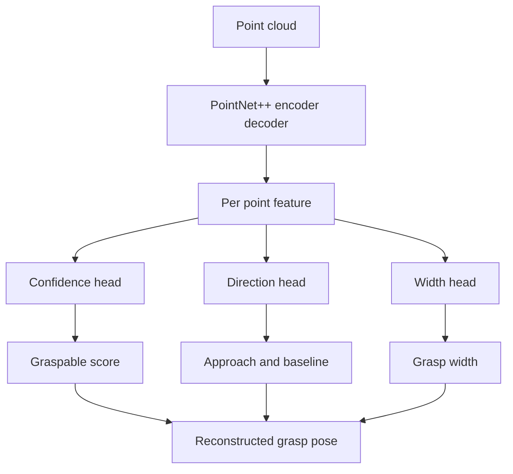
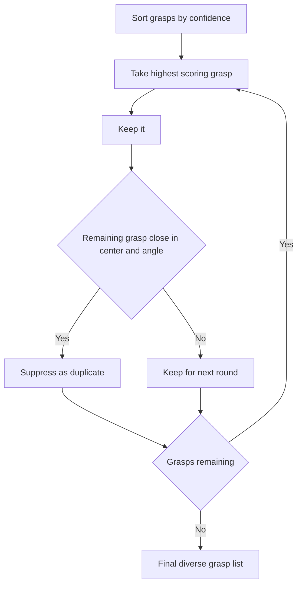

# Lecture 1 — Contact-GraspNet: The Representation Is the Insight

> **Duration:** ~2 hours of reading + hands-on.
> **Outcome:** You can explain why predicting a *contact point* beats regressing a free 6-DOF pose, trace the PointNet++ backbone and the three heads, and reconstruct a full `4x4` grasp transform from the network's raw outputs in correct PyTorch.

If you remember one sentence from this week, remember this one:

> **A learned grasp predictor succeeds or fails on its representation. Contact-GraspNet's contribution is not the network — it is the decision to predict a grasp as a contact point on the observed surface plus two directions and a width, which turns every visible point into a dense training signal and constrains every output to lie on geometry the camera actually saw.**

Last week's antipodal sampler asked: "among randomly sampled pairs of points, which pairs form a stable pinch?" It is a search. Contact-GraspNet asks a different question: "for each point I can see, *is there* a good grasp whose finger touches here, and if so, what is it?" It is a regression, dense, one prediction per point. That reframing is the whole idea, and it is why a 12-million-parameter network generalizes to objects it never trained on.

---

## 1. Why not just regress an SE(3) pose?

The naive approach: take a point cloud, run a network, output a 6-DOF gripper pose (or a few). This is what early learned-grasping work tried, and it is data-hungry and brittle for three reasons.

**The output space is enormous and unconstrained.** A free 6-DOF pose is three translation and three rotation degrees of freedom, anywhere in `R^3 × SO(3)`. The vast majority of that space is empty air or inside the object. A network regressing into it spends most of its capacity learning *where the object is at all*, before it can learn *where to grasp it*. Rotation regression is also notoriously unstable — quaternions have a double cover, Euler angles have gimbal singularities, and the loss landscape is ugly.

**Supervision is sparse.** If the label is "here are 12 good grasp poses for this object," the network gets 12 supervisory signals per object. The other thousands of points contribute nothing. Sparse supervision is slow supervision.

**It does not generalize by construction.** Nothing about a free-pose regressor ties the output to the visible geometry. It can — and does — hallucinate grasps in mid-air or on the far side of an object it cannot see.

Contact-GraspNet fixes all three with one representation change.

### 1.1 The contact-point parameterization

Observe a grasp from the gripper's point of view. A parallel-jaw gripper closing on an object makes contact at (at least) one point on the object surface. Call that **contact point** `c ∈ R^3`. The gripper has a **baseline direction** `b` (a unit vector along the line between the two fingers — the closing axis) and an **approach direction** `a` (a unit vector along which the wrist moves in to reach the grasp). The fingers are `w` apart at the grasp (`w` is the **grasp width**). Given the convention that the contact point is on one finger, the full gripper pose is *determined* by `(c, a, b, w)`.

That is the trick: **a grasp is fully specified by a point you can see plus two directions and a scalar.** And crucially, `c` is *constrained to be a point in the input cloud*. The network never predicts a grasp in empty space because every grasp is anchored to an observed point.

The payoffs are immediate:

- **Dense supervision.** For each of the (up to) 20,000 points in the cloud, the network predicts: is there a grasp here (confidence), and if so its `(a, b, w)`. Every point is a training example. The ACRONYM labels — which gripper poses succeed in physics simulation — get projected onto the visible points, so a single rendered view yields *thousands* of labeled points.
- **Constrained output.** Translation is no longer a free regression; it is "this observed point" plus a known offset to the gripper center. The hard part (where) is solved by the input; the network only predicts the easy part (which direction, how wide).
- **Generalization by geometry.** The network learns a *local* function: given the local surface around a point, is it graspable and how? Local surface patches transfer across objects. A handle on a mug and a handle on a basket look the same locally, so a network trained on one grasps the other.

> **The mental model:** Contact-GraspNet is a *dense per-point classifier-plus-regressor*. Classifier: "graspable here, yes/no." Regressor: "if yes, this direction, this width." The pose falls out of geometry.

---

## 2. The architecture: PointNet++ backbone, three heads

Concretely, Contact-GraspNet is a PointNet++ encoder–decoder that consumes a point cloud and emits per-point predictions. Here is the shape of it.


*One point cloud, one backbone, three heads, one reassembled grasp pose.*

### 2.1 PointNet++ in one paragraph

PointNet (the original) processes an unordered point set with a shared per-point MLP followed by a symmetric pooling (max) — permutation-invariant, but with no notion of local neighborhoods. PointNet**++** fixes the locality problem with two operations applied hierarchically:

- **Set abstraction (SA):** pick `M` centroids by **farthest-point sampling** (FPS), group each centroid's `K` nearest neighbors (ball query), run a shared MLP on the grouped local coordinates, and **max-pool** within each group. Output: `M` points, each with a richer feature summarizing its neighborhood. This is the downsampling/encoding path — coarser, deeper features at each level.
- **Feature propagation (FP):** the decoding path. Interpolate features from the coarse level back up to the finer level (inverse-distance-weighted KNN interpolation), concatenate with the skip connection from the encoder, and run a shared MLP. After several FP layers you are back to a per-point feature at the original resolution.

The result is a per-point feature vector that encodes both the local surface and the global context — exactly what you need to decide "graspable here, and how."

```python
import torch
import torch.nn as nn
import torch.nn.functional as F


def farthest_point_sample(xyz: torch.Tensor, n_samples: int) -> torch.Tensor:
    """FPS centroid selection.

    Args:
        xyz: (B, N, 3) point coordinates.
        n_samples: number of centroids M to select.
    Returns:
        (B, M) long tensor of selected indices into N.
    """
    device = xyz.device
    B, N, _ = xyz.shape
    idx = torch.zeros(B, n_samples, dtype=torch.long, device=device)
    distance = torch.full((B, N), 1e10, device=device)
    farthest = torch.randint(0, N, (B,), dtype=torch.long, device=device)
    batch = torch.arange(B, dtype=torch.long, device=device)
    for i in range(n_samples):
        idx[:, i] = farthest
        centroid = xyz[batch, farthest, :].unsqueeze(1)         # (B, 1, 3)
        dist = torch.sum((xyz - centroid) ** 2, dim=-1)          # (B, N)
        distance = torch.minimum(distance, dist)                 # running nearest dist
        farthest = torch.max(distance, dim=-1).indices           # next centroid
    return idx


def ball_query(radius: float, k: int, xyz: torch.Tensor,
               centroids: torch.Tensor) -> torch.Tensor:
    """Group up to k neighbors within `radius` of each centroid.

    Args:
        radius: ball radius.
        k: max neighbors per group.
        xyz: (B, N, 3) all points.
        centroids: (B, M, 3) query points.
    Returns:
        (B, M, k) neighbor indices (padded by repeating the nearest).
    """
    B, N, _ = xyz.shape
    M = centroids.shape[1]
    # Pairwise squared distance centroid -> all points: (B, M, N)
    dist2 = torch.cdist(centroids, xyz) ** 2
    # Mask points outside the ball, then take the k nearest inside it.
    inside = dist2 <= radius ** 2
    dist2 = dist2.masked_fill(~inside, float("inf"))
    group_idx = dist2.topk(k, dim=-1, largest=False).indices     # (B, M, k)
    # Where fewer than k points are inside, topk returns 'inf' slots; clamp them
    # to the nearest valid index (the first column) so we never index garbage.
    first = group_idx[:, :, 0:1].expand(-1, -1, k)
    invalid = torch.isinf(torch.gather(dist2, 2, group_idx))
    group_idx = torch.where(invalid, first, group_idx)
    return group_idx


class SetAbstraction(nn.Module):
    """One PointNet++ SA level: FPS -> ball-query grouping -> shared MLP -> max-pool."""

    def __init__(self, n_centroids: int, radius: float, k: int,
                 in_ch: int, mlp_ch: list[int]) -> None:
        super().__init__()
        self.n_centroids = n_centroids
        self.radius = radius
        self.k = k
        layers: list[nn.Module] = []
        last = in_ch + 3  # grouped features get xyz offset appended
        for ch in mlp_ch:
            layers += [nn.Conv2d(last, ch, 1), nn.BatchNorm2d(ch), nn.ReLU(inplace=True)]
            last = ch
        self.mlp = nn.Sequential(*layers)

    def forward(self, xyz: torch.Tensor, feat: torch.Tensor):
        """xyz: (B, N, 3), feat: (B, N, C). Returns (new_xyz (B,M,3), new_feat (B,M,C'))."""
        B, N, _ = xyz.shape
        cen_idx = farthest_point_sample(xyz, self.n_centroids)       # (B, M)
        batch = torch.arange(B, device=xyz.device).unsqueeze(1)
        new_xyz = xyz[batch, cen_idx]                                # (B, M, 3)
        grp_idx = ball_query(self.radius, self.k, xyz, new_xyz)      # (B, M, k)

        grouped_xyz = xyz[batch.unsqueeze(-1), grp_idx]              # (B, M, k, 3)
        grouped_xyz = grouped_xyz - new_xyz.unsqueeze(2)             # local coords
        if feat is not None:
            grouped_feat = feat[batch.unsqueeze(-1), grp_idx]        # (B, M, k, C)
            grouped = torch.cat([grouped_xyz, grouped_feat], dim=-1)
        else:
            grouped = grouped_xyz
        # (B, M, k, C+3) -> (B, C+3, k, M) for Conv2d
        grouped = grouped.permute(0, 3, 2, 1).contiguous()
        new_feat = self.mlp(grouped)                                 # (B, C', k, M)
        new_feat = torch.max(new_feat, dim=2).values                # pool over k
        new_feat = new_feat.permute(0, 2, 1).contiguous()           # (B, M, C')
        return new_xyz, new_feat
```

This is a teaching implementation — the official Contact-GraspNet uses optimized CUDA kernels for FPS and ball-query (orders of magnitude faster), but the *math* is exactly the above. Read it until the shapes are obvious; the deployment code calls the fast kernels, but you should know what they compute.

### 2.2 The three heads

After the FP decoder you have a per-point feature `f_i ∈ R^D` for every input point `i`. Three lightweight heads turn it into a grasp.

```python
class GraspHeads(nn.Module):
    """Three per-point heads on top of the PointNet++ per-point features."""

    def __init__(self, feat_dim: int) -> None:
        super().__init__()
        # Head 1: graspability confidence (logit), one scalar per point.
        self.conf_head = nn.Sequential(
            nn.Conv1d(feat_dim, 128, 1), nn.BatchNorm1d(128), nn.ReLU(inplace=True),
            nn.Conv1d(128, 1, 1),
        )
        # Head 2: approach + baseline directions, 6 channels (two 3-vectors) per point.
        self.dir_head = nn.Sequential(
            nn.Conv1d(feat_dim, 128, 1), nn.BatchNorm1d(128), nn.ReLU(inplace=True),
            nn.Conv1d(128, 6, 1),
        )
        # Head 3: grasp width, one positive scalar per point.
        self.width_head = nn.Sequential(
            nn.Conv1d(feat_dim, 128, 1), nn.BatchNorm1d(128), nn.ReLU(inplace=True),
            nn.Conv1d(128, 1, 1),
        )

    def forward(self, feat: torch.Tensor):
        """feat: (B, D, N). Returns confidence, approach, baseline, width."""
        conf = self.conf_head(feat).squeeze(1)              # (B, N) logits
        dirs = self.dir_head(feat)                          # (B, 6, N)
        approach = F.normalize(dirs[:, 0:3, :], dim=1)      # (B, 3, N) unit
        baseline = dirs[:, 3:6, :]                          # (B, 3, N) raw
        # Orthonormalize baseline against approach (Gram-Schmidt), then normalize.
        proj = (baseline * approach).sum(dim=1, keepdim=True) * approach
        baseline = F.normalize(baseline - proj, dim=1)      # (B, 3, N) unit, ⟂ approach
        width = F.softplus(self.width_head(feat).squeeze(1))  # (B, N) > 0, meters
        return conf, approach, baseline, width
```

Three things to notice, because they are exactly where a re-implementation goes wrong:

1. **The direction head outputs six raw channels** — three for approach, three for baseline — and you must **normalize and orthogonalize** them. The approach and baseline of a real gripper are orthogonal unit vectors; the network's raw output is neither, so you project the baseline off the approach (Gram–Schmidt) and renormalize. Skip this and your reconstructed rotation matrix is not orthonormal and MoveIt2 rejects the pose.
2. **Width is run through `softplus`**, not raw linear output, because a width must be positive. `softplus` is smoother than `relu` and does not kill gradients at zero.
3. **Confidence is a logit**, trained with binary cross-entropy against the ACRONYM success labels. At inference you `sigmoid` it and threshold (e.g. keep grasps above 0.75).

### 2.3 The training loss (so you understand the checkpoint you load)

You will not train this week, but you must be able to read the loss, because it tells you what the confidence score *means*.

```python
def contact_graspnet_loss(conf_logit, approach, baseline, width,
                          gt_conf, gt_approach, gt_baseline, gt_width,
                          conf_weight=1.0, dir_weight=1.0, width_weight=10.0):
    """The (simplified) Contact-GraspNet training loss.

    Confidence is BCE over all points. Direction and width losses are masked to
    points that have a ground-truth grasp (gt_conf == 1) — you only supervise the
    geometry where a grasp actually exists.
    """
    # 1. Graspability: binary cross-entropy on every point.
    conf_loss = F.binary_cross_entropy_with_logits(conf_logit, gt_conf)

    # 2 & 3 only apply where a real grasp exists.
    mask = gt_conf > 0.5                                    # (B, N) bool
    if mask.any():
        # Approach + baseline: cosine distance (1 - alignment), summed over the pair.
        a_cos = 1.0 - (approach.permute(0, 2, 1)[mask] * gt_approach[mask]).sum(-1)
        b_cos = 1.0 - (baseline.permute(0, 2, 1)[mask] * gt_baseline[mask]).sum(-1)
        dir_loss = (a_cos + b_cos).mean()
        # Width: L1 in meters.
        width_loss = F.l1_loss(width[mask], gt_width[mask])
    else:
        dir_loss = approach.sum() * 0.0
        width_loss = width.sum() * 0.0

    return conf_weight * conf_loss + dir_weight * dir_loss + width_weight * width_loss
```

The two facts to carry forward: **confidence is a calibrated-ish probability that a grasp at this point would succeed in the ACRONYM physics simulation**, and **the direction/width supervision only exists where a grasp existed in the data**, which is why the network is sharp on graspable regions and noisy on flat un-graspable surfaces. The `width_weight=10.0` is not arbitrary — width error is in meters, so a 1 cm error is `0.01`, and without up-weighting it would be swamped by the cosine losses.

---

## 3. Reconstructing the 6-DOF grasp pose

The network gives you, per point `i`: a contact point `c_i` (the input point itself), an approach unit vector `a_i`, a baseline unit vector `b_i` (orthogonal to `a_i`), a width `w_i`, and a confidence. You must assemble a `4x4` homogeneous transform `T ∈ SE(3)` in the gripper-frame convention so MoveIt2 can plan to it.

The gripper frame: by convention (and you must match whatever your gripper URDF uses), the gripper origin sits at the **grasp center** — midway between the two fingers — with the **z-axis along the approach direction** (forward, into the grasp), the **x-axis along the baseline** (the closing axis), and **y = z × x** completing the right-handed frame. The contact point is on one finger, so the grasp center is offset from the contact by half the width along the baseline.

```python
import torch


def reconstruct_grasp_poses(contact_pts, approach, baseline, width):
    """Assemble 4x4 gripper transforms from Contact-GraspNet outputs.

    Args:
        contact_pts: (N, 3) the observed points that are contacts.
        approach:    (N, 3) unit approach vectors (gripper +z).
        baseline:    (N, 3) unit baseline vectors (gripper +x), already ⟂ approach.
        width:       (N,)   grasp widths in meters.
    Returns:
        (N, 4, 4) homogeneous transforms, gripper-origin = grasp center.
    """
    N = contact_pts.shape[0]
    z = approach                                            # (N, 3) forward
    x = baseline                                            # (N, 3) closing axis
    y = torch.cross(z, x, dim=-1)                           # (N, 3) right-handed
    # Re-orthonormalize defensively (numerical drift after normalization).
    x = torch.cross(y, z, dim=-1)
    x = x / x.norm(dim=-1, keepdim=True)
    y = y / y.norm(dim=-1, keepdim=True)
    z = z / z.norm(dim=-1, keepdim=True)

    R = torch.stack([x, y, z], dim=-1)                      # (N, 3, 3), columns = axes
    # Grasp center: contact point shifted by half-width along the baseline toward
    # the gripper midline. The contact is on one finger; center is half a width in.
    center = contact_pts + 0.5 * width.unsqueeze(-1) * x    # (N, 3)

    T = torch.zeros(N, 4, 4, device=contact_pts.device, dtype=contact_pts.dtype)
    T[:, :3, :3] = R
    T[:, :3, 3] = center
    T[:, 3, 3] = 1.0
    return T
```

Two reconstruction bugs that cost everyone an afternoon:

- **The rotation matrix must be orthonormal.** If you skip the defensive re-cross-product and the network's directions drifted from orthogonality (or you forgot Gram–Schmidt in the head), `R` is not a valid rotation, `R.T @ R ≠ I`, and converting to a quaternion for `geometry_msgs/Pose` produces garbage. The cheapest fix is the double cross product above.
- **The contact-to-center offset has a sign.** The grasp center is *between* the fingers; the contact is *on* one finger. Get the sign of the `0.5 * width * x` shift wrong and your gripper closes a full width off the object — high-confidence grasp, total miss. Verify it visually in rviz2 (Exercise 1) before you trust it.

### 3.1 From `T` to a ROS message

The reconstructed `T` is in the **camera frame** (the cloud's frame, e.g. `camera_color_optical_frame`). To plan, you transform it to the planning frame (`base_link`) with tf2, convert the rotation to a quaternion, and publish a `PoseStamped` (or a ranked array of them with confidence and width). That transform and the message layout are Lecture 2's job; here, internalize that **the network outputs live in the camera frame and must be moved into the planning frame before MoveIt2 ever sees them** — a frame mistake here is the single most common "the grasp looked perfect but the arm went to the wrong place" bug.

---

## 4. Ranking and non-maximum suppression

The network emits up to `N` grasps — one per point — and most are redundant (neighboring points propose near-identical grasps). You rank by confidence and apply **grasp NMS**: greedily take the highest-confidence grasp, suppress any remaining grasp whose center is within a small radius (e.g. 2 cm) *and* whose approach direction is within a small angle (e.g. 30°), and repeat. This leaves a handful of diverse, high-confidence grasps instead of a thousand near-duplicates.


*Greedy NMS: keep the best, suppress its near-duplicates, repeat.*

```python
def grasp_nms(centers, approaches, scores, dist_thresh=0.02, angle_thresh_deg=30.0):
    """Greedy NMS over grasps. Returns indices of kept grasps, best-first."""
    order = torch.argsort(scores, descending=True)
    keep = []
    cos_thresh = torch.cos(torch.deg2rad(torch.tensor(angle_thresh_deg)))
    suppressed = torch.zeros(len(order), dtype=torch.bool, device=scores.device)
    for rank, idx in enumerate(order):
        if suppressed[rank]:
            continue
        keep.append(idx.item())
        rest = order[rank + 1:]
        rest_mask = ~suppressed[rank + 1:]
        close = (centers[rest] - centers[idx]).norm(dim=-1) < dist_thresh
        aligned = (approaches[rest] * approaches[idx]).sum(-1) > cos_thresh
        newly = close & aligned & rest_mask
        suppressed[rank + 1:][newly] = True
    return keep
```

NMS is why your "214 grasps" collapses to "19 above confidence 0.75, 6 after NMS" in the pick log. You hand the top reachable one to MoveIt2 and keep the rest as fallbacks if the first is unreachable.

---

## 5. What the network does *not* know

The representation is powerful but it has a hard boundary, and naming it now saves you Friday's frustration:

- **It only sees what the depth camera sees.** Contact points are observed points. If the depth image has a hole — and transparent or mirror-finish objects produce exactly that, because IR structured-light and ToF both fail on them — there are *no points there to grasp*. The network is not wrong; it has no input. This is the transparent-object failure (the challenge), and the fix is *upstream* of the network: complete the depth before you make the cloud.
- **It is single-view and occlusion-blind.** It cannot grasp the back of an object it cannot see. Multi-view fusion (a stretch goal) widens the visible set.
- **It does not reason about the *task*.** A confident grasp on a mug's body is a fine grasp and a terrible idea if you are about to pour from it. Contact-GraspNet ranks by *graspability*, not by *task suitability*. Task-aware grasping is a later problem (and part of why imitation learning, next week, exists).

> **The takeaway for the failure analysis you do this week:** when a pick fails, ask first *did the network even have input here?* A hole in the cloud is a sensor failure that masquerades as a network failure, and you will misdiagnose it every time unless you look at the depth image first.

---

## 6. Recap

You should now be able to:

- Explain why the contact-point representation beats free 6-DOF pose regression on all three of: output-space size, supervision density, and generalization.
- Trace the PointNet++ backbone (set abstraction → feature propagation) and the three per-point heads (confidence, approach+baseline directions, width).
- Normalize and Gram–Schmidt-orthogonalize the direction outputs, and explain why skipping it produces an invalid rotation.
- Reconstruct a `4x4 SE(3)` grasp transform from `(c, a, b, w)` in the correct gripper-frame convention, including the contact-to-center half-width offset.
- Rank grasps and apply grasp NMS to collapse near-duplicates.
- State the network's hard boundary — it grasps only observed geometry — and why transparent-object failures are sensor failures, not network failures.

Next: how to wrap this network in a ROS2 node, segment the target object so you grasp the right thing, and hand the top grasp to MoveIt2 for the pick. Continue to [Lecture 2 — Deployment, Segmentation, and the Pick Loop](./02-deployment-segmentation-and-the-pick-loop.md).

---

## References

- *Contact-GraspNet* (Sundermeyer et al., ICRA 2021): <https://arxiv.org/abs/2103.14127>
- *Contact-GraspNet code* (NVlabs): <https://github.com/NVlabs/contact_graspnet>
- *PyTorch port*: <https://github.com/elchun/contact_graspnet_pytorch>
- *PointNet++* (Qi et al., NeurIPS 2017): <https://arxiv.org/abs/1706.02413>
- *ACRONYM dataset* (Eppner et al.): <https://github.com/NVlabs/acronym>
- *`torch.nn` reference*: <https://pytorch.org/docs/stable/nn.html>
