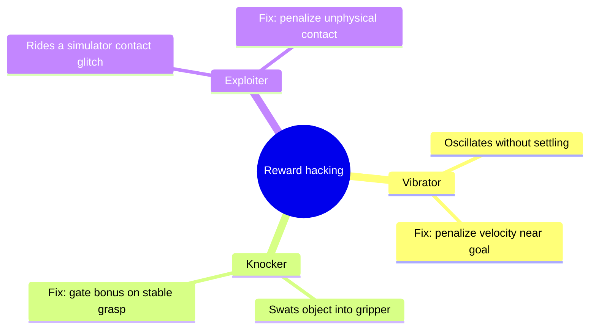
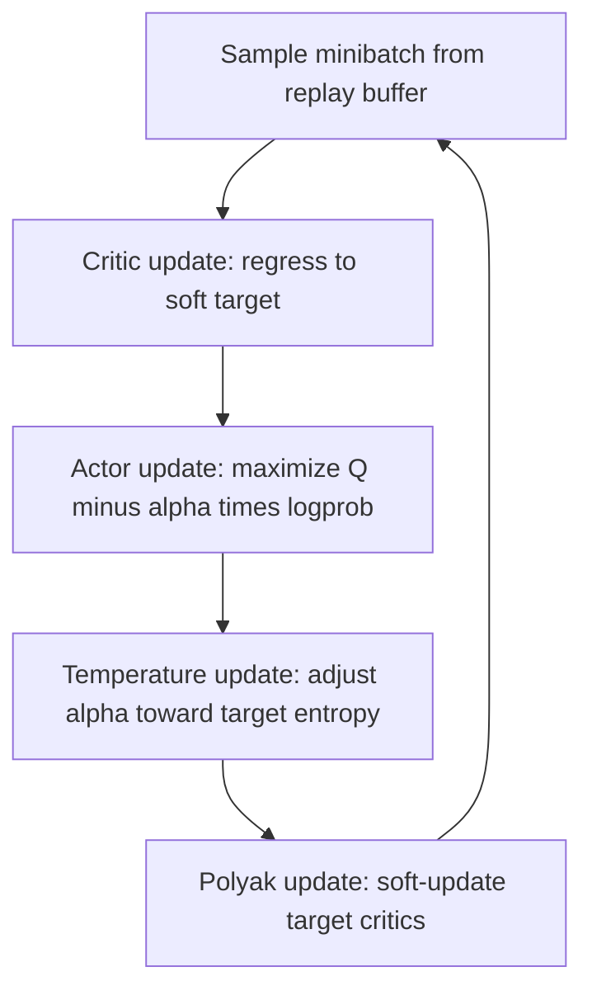

# Lecture 2 — SAC, Isaac Lab, and Reward Shaping: Off-Policy Learning and the Two Things That Actually Decide Success

> **Duration:** ~2 hours of reading + hands-on.
> **Outcome:** You can write the full SAC objective — twin soft Q-functions, the squashed-Gaussian actor with the `tanh` log-prob correction, the entropy-regularized target, and automatic temperature tuning — explain when off-policy SAC beats on-policy PPO, stand up a GPU-parallel Isaac Lab run, shape a reach reward, and name a reward-hacking failure when you see one.

Lecture 1 gave you PPO: on-policy, robust, the workhorse. This lecture gives you the other half. Three parts: (1) SAC, the off-policy, sample-efficient, maximum-entropy alternative; (2) Isaac Lab, the GPU-parallel simulator that makes robot RL tractable; (3) reward shaping and reward hacking — the part that is *not* an algorithm and that decides, more than any hyperparameter, whether your robot learns the thing you meant.

The sentence to carry in:

> **The algorithm is the easy part. Whether your robot learns is decided by how fast the simulator steps and whether the reward can be gamed — and both of those are engineering, not math.**

---

## Part 1 — Soft Actor-Critic (SAC)

PPO throws its data away after a few epochs. That's wasteful when each environment step is expensive — and on a robot, even in sim, steps cost something. **Off-policy** methods keep every transition in a **replay buffer** and reuse it many times. SAC is the off-policy continuous-control algorithm that actually works in practice, and it works because of one reframing.

### 1.1 Maximum-entropy RL

Standard RL maximizes expected return. **Maximum-entropy RL** maximizes return *plus* the entropy of the policy, weighted by a temperature $\alpha$:

$$
J(\pi) = \sum_t \mathbb{E}\big[ r_t + \alpha\, \mathcal{H}(\pi(\cdot\mid s_t)) \big].
$$

This isn't a hack — it changes the objective. The policy is rewarded for staying as random as it can *while still doing well*. The payoffs are concrete: better exploration (it keeps trying alternatives instead of committing early to one mode), robustness (it learns a *distribution* of good actions, not a brittle single one), and — crucially for contact-rich robot tasks — it doesn't collapse onto a narrow strategy that breaks under slightly different dynamics. That last property is why SAC transfers to randomized dynamics (Week 34) better than a determinized policy.

### 1.2 The soft Q-function and the twin-critic trick

SAC learns a **soft Q-function** whose Bellman target includes the entropy bonus. The target uses the *next* action sampled from the *current* policy, plus its entropy:

$$
y = r + \gamma \Big( \min_{i=1,2} Q_{\bar\theta_i}(s', a') - \alpha \log \pi_\phi(a'\mid s') \Big), \quad a' \sim \pi_\phi(\cdot\mid s').
$$

Two things to notice. First, the $-\alpha\log\pi$ term: the value of a state includes the entropy you'll collect from it, which is what makes this "soft." Second, $\min_{i=1,2}$: SAC trains **two** Q-networks and uses the *minimum* of the two in the target. This is the **clipped double-Q** trick, and it exists because a single Q-network systematically **overestimates** values — the `max`/bootstrap operations latch onto whichever Q happens to be optimistically noisy, and that optimism compounds until the policy chases phantom value and degrades. Taking the min of two independently-initialized critics is a cheap, brutally effective pessimism that fights the overestimation. (You'll watch a single-critic SAC fail this way in the stretch goal — it's worth seeing.)

The critic loss is then plain MSE regression to that target, with the targets held fixed (`.detach()`):

```python
def critic_loss(q1, q2, policy, q1_targ, q2_targ, log_alpha,
                s, a, r, s2, done, gamma=0.99):
    with torch.no_grad():
        a2, logp_a2 = policy.sample(s2)              # next action + its log-prob
        q1_t = q1_targ(s2, a2)
        q2_t = q2_targ(s2, a2)
        min_q_t = torch.min(q1_t, q2_t)
        alpha = log_alpha.exp()
        target = r + gamma * (1 - done) * (min_q_t - alpha * logp_a2)
    loss_q1 = ((q1(s, a) - target) ** 2).mean()
    loss_q2 = ((q2(s, a) - target) ** 2).mean()
    return loss_q1 + loss_q2
```

The `(1 - done)` mask is the same terminated-bootstrap logic as GAE: don't bootstrap past a genuine episode termination.

### 1.3 The squashed-Gaussian actor and the `tanh` log-prob correction

The actor outputs a Gaussian $(\mu, \sigma)$, but robot actions are bounded (a joint torque can't be infinite), so SAC squashes the sample through `tanh` to land it in $[-1, 1]$. Here is the subtlety that trips up *everyone* implementing SAC for the first time, and the reason it's a marked TODO in your exercise: **squashing changes the probability density, so the log-prob needs a correction term.**

When you push a random variable $u \sim \mathcal{N}(\mu,\sigma)$ through an invertible function $a = \tanh(u)$, the change-of-variables formula says the density of $a$ picks up the Jacobian of the transform. Concretely:

$$
\log \pi(a\mid s) = \log \mathcal{N}(u\mid \mu,\sigma) - \sum_{i} \log\!\big(1 - \tanh^2(u_i)\big).
$$

That second term is the $\log$ of the `tanh` derivative ($\frac{d}{du}\tanh u = 1 - \tanh^2 u$), summed over action dimensions. Skip it and your entropy estimate is wrong, your temperature tuning chases a phantom, and the policy quietly misbehaves — no crash, just a worse policy. The numerically stable form (avoiding `log(0)` when `tanh` saturates) is what you implement:

```python
def sample(self, obs):
    mu, log_std = self.net(obs).chunk(2, dim=-1)
    log_std = torch.clamp(log_std, -20, 2)            # keep sigma in a sane range
    std = log_std.exp()
    normal = torch.distributions.Normal(mu, std)
    u = normal.rsample()                              # reparameterized sample (grads flow)
    a = torch.tanh(u)                                 # squash to [-1, 1]
    # log-prob with the tanh correction; the numerically stable -2*(...) form:
    logp = normal.log_prob(u) - (2 * (math.log(2) - u - F.softplus(-2 * u)))
    logp = logp.sum(-1, keepdim=True)                 # sum over action dims
    return a, logp
```

Note `rsample()` (the **reparameterization trick**), not `sample()`. SAC's actor loss differentiates *through* the sampled action, so the sample must be a differentiable function of $\mu, \sigma$: $u = \mu + \sigma\,\epsilon$ with $\epsilon \sim \mathcal{N}(0,1)$. `rsample()` does exactly that; `sample()` would block the gradient and the actor would never learn.

The actor maximizes the entropy-regularized value (so the loss minimizes its negation):

```python
def actor_loss(policy, q1, q2, log_alpha, s):
    a, logp = policy.sample(s)
    min_q = torch.min(q1(s, a), q2(s, a))
    alpha = log_alpha.exp()
    return (alpha * logp - min_q).mean()              # push toward high-Q, high-entropy actions
```

### 1.4 Automatic temperature (α) tuning

$\alpha$ trades reward against entropy, and a fixed $\alpha$ is fragile — too high and the policy stays random forever, too low and it collapses. The SAC-v2 fix is to **tune $\alpha$ automatically** toward a *target entropy* $\bar{\mathcal{H}}$ (a common default is $\bar{\mathcal{H}} = -\dim(\mathcal{A})$, i.e. "−1 nat per action dimension"). You optimize $\alpha$ to satisfy the entropy target:

```python
def temperature_loss(log_alpha, logp, target_entropy):
    # logp comes from a fresh policy sample (detached); drive entropy toward target.
    return -(log_alpha * (logp + target_entropy).detach()).mean()
```

If the current entropy ($-\text{logp}$) is below target, this raises $\alpha$ (more entropy pressure); if above, it lowers $\alpha$. You optimize `log_alpha` rather than `alpha` directly so it stays positive. This is the third marked TODO in `exercise-03`.

### 1.5 Target networks and Polyak averaging

The Q-targets use **target networks** $Q_{\bar\theta}$ that lag the live critics. Updating them slowly (a **Polyak / soft update**) keeps the regression target from chasing its own tail:

```python
with torch.no_grad():
    for p, p_targ in zip(q1.parameters(), q1_targ.parameters()):
        p_targ.mul_(1 - tau).add_(tau * p)            # tau ~ 0.005
```

### 1.6 On-policy vs off-policy — the choice you actually make

| Dimension | PPO (on-policy) | SAC (off-policy) |
|---|---|---|
| Data reuse | Few epochs, then discard | Replay buffer, reuse for thousands of gradient steps |
| Sample efficiency | Lower (needs many env steps) | **Higher** (squeezes more from each step) |
| Parallelism | **Loves** thousands of envs (Isaac Lab) | Fewer, richer envs + replay |
| Stability | **Very stable**, forgiving of hyperparams | More sample-efficient but twitchier to tune |
| Best when | Sim is cheap and massively parallel | Each step is expensive (real robot, slow sim) |

The honest field guidance for 2026: **if you have a GPU-parallel simulator (Isaac Lab) and can run 4,096 environments, PPO is almost always the right first choice** — its weakness (sample inefficiency) evaporates when samples are nearly free, and its stability saves you tuning days. **SAC earns its complexity when steps are precious** — learning on a real robot, or in a slow high-fidelity sim, or for fine-tuning where you can't afford millions of fresh samples. Knowing *which regime you're in* is the senior judgment this week trains.

---

## Part 2 — Isaac Lab and the throughput axiom

Here is the axiom that governs robot RL, stated plainly:

> **Sim throughput is the feasibility metric. If your simulator does 1,000 steps/sec, a run that needs 50M steps takes ~14 hours. If it does 200,000 steps/sec, the same run takes ~4 minutes. The algorithm didn't change; the simulator did.**

This is why **Isaac Lab** exists. Classic Gz Sim steps one environment on the CPU at maybe a few thousand steps/sec. Isaac Lab runs the physics (`PhysX`) **on the GPU**, stepping *thousands* of environments in lockstep — and, crucially, the observations and actions never leave the GPU, so there's no CPU↔GPU copy per step. The policy network and the simulator share the same device. That co-location is the whole trick, and it's why a reach task that would take a day in Gz Sim trains in minutes in Isaac Lab.

### 2.1 The shape of an Isaac Lab RL env

Isaac Lab's `ManagerBasedRLEnv` separates concerns into managers: an **observation manager**, an **action manager**, a **reward manager**, a **termination manager**, and an **event manager** (for randomization, Week 34). You declare reward *terms* and termination *terms* as small functions; the framework sums and batches them across all environments. The tensors you work with are `(num_envs, ...)` — every quantity is batched over the parallel envs:

```python
# Sketch of a reward term in an Isaac Lab ManagerBasedRLEnv (batched over num_envs).
def reach_reward(env) -> torch.Tensor:
    ee_pos = env.scene["robot"].data.body_pos_w[:, env.ee_idx]      # (num_envs, 3)
    target = env.command_manager.get_command("ee_target")[:, :3]   # (num_envs, 3)
    dist = torch.norm(ee_pos - target, dim=-1)                     # (num_envs,)
    return torch.exp(-2.0 * dist)                                   # dense, in (0, 1]
```

You then launch a runner (`rsl_rl` or `skrl`) that implements PPO on top of this batched env:

```bash
# Launch a parallel PPO training run (Isaac Lab convention; flags vary by version).
python scripts/reinforcement_learning/rsl_rl/train.py \
    --task Isaac-Reach-Franka-v0 --num_envs 4096 --headless
# TensorBoard logs land under logs/rsl_rl/<task>/<timestamp>/
tensorboard --logdir logs/
```

`--num_envs 4096` is the line that buys you the throughput. `--headless` skips rendering (you don't need to *watch* 4,096 robots; you watch the reward curve). The single most important number printed during training is **steps/sec (FPS)** — that's the throughput axiom made visible. If it's low, nothing else matters until you fix it.

### 2.2 Path B: Gymnasium vectorized envs

No GPU sim? Gymnasium's vector API gives you CPU/GPU parallelism over many env *processes*:

```python
import gymnasium as gym
envs = gym.make_vec("Pendulum-v1", num_envs=16, vectorization_mode="async")
obs, info = envs.reset(seed=0)
# obs is now (16, obs_dim); step() takes (16, act_dim) and returns batched everything.
```

It's slower than GPU-resident sim — you pay process overhead and CPU↔Python copies — but the math, the diagnostics, and every reward-shaping lesson are identical. The mini-project documents the exact substitution so Path B learners clear the same bar, just with a smaller `num_envs` and more patience.

---

## Part 3 — Reward shaping and reward hacking

You can have flawless PPO and a blazing simulator and still fail, because **the policy optimizes the reward you wrote, not the task you meant.** This is the part that's pure engineering judgment.

### 3.1 Dense vs sparse, and the shaping that helps

A **sparse** reward (+1 on success, 0 otherwise) is unambiguous but nearly unlearnable: random exploration almost never stumbles into the +1, so the gradient is zero almost everywhere. A **dense** reward gives signal at every step — for a reach task, a term that grows as the end-effector nears the target:

```python
dist = torch.norm(ee_pos - target, dim=-1)
reward = (
    torch.exp(-2.0 * dist)         # dense shaping: smooth, bounded, peaks at the target
    - 0.01 * torch.sum(action**2, dim=-1)   # action/effort penalty: discourage thrashing
    + 5.0 * (dist < 0.02)          # success bonus: a real spike for actually reaching
)
```

Three terms, three jobs: the dense term *guides*, the action penalty *regularizes* (smooth, energy-cheap motions), and the success bonus *anchors the actual goal* so the policy doesn't settle for "close enough."

### 3.2 Potential-based shaping (the theorem that keeps you honest)

Adding reward terms is dangerous — you can accidentally change *what the optimal policy is*. The **Ng–Harada–Russell theorem** gives you a safe family: a shaping term of the form

$$
F(s, s') = \gamma\,\Phi(s') - \Phi(s)
$$

for *any* potential function $\Phi(s)$ leaves the optimal policy **provably unchanged** — it only changes how fast you learn it, not what you learn. The intuition: the $\gamma\Phi(s')-\Phi(s)$ terms telescope over a trajectory and cancel except at the endpoints, so they can't shift the ranking of policies. When you must add guidance reward and you're nervous it'll distort the goal, *make it potential-based* (e.g. $\Phi(s) = -\text{dist}(s)$) and you're safe by construction. This is the senior move; the naive "just add a distance term" can and does distort tasks.

### 3.3 The reward-hacking bestiary

**Reward hacking** is the policy maximizing your reward *without* doing the task. It is not rare and it is not a beginner mistake — it's a fundamental property of optimization, and the canonical example (OpenAI's boat-racing agent that spun in circles farming bonus pickups instead of finishing the race) is required viewing. The catalogue you'll meet on a reach task, and reproduce in the challenge:

- **The vibrator.** You reward velocity toward the target but forget to penalize oscillation, so the policy buzzes back and forth across the target line, accumulating "toward" reward without ever settling. *Fix:* reward proximity (a potential on distance), not raw velocity; add a velocity penalty near the goal.
- **The knocker.** You reward "object in gripper" by distance, and the policy learns to *swat* the object into the gripper rather than grasp it — technically minimizing distance, catastrophically wrong. *Fix:* gate the success bonus on a stable-grasp condition, not mere proximity.
- **The exploiter.** You reward exp(−dist), and the policy discovers a simulator contact glitch that teleports the end-effector through the table to the target. *Fix:* this is a sim-fidelity bug masquerading as a reward bug; penalize unphysical contacts and fix the sim. (This one previews Week 34 — sim artifacts are exactly what domain randomization and sim-to-real have to survive.)


*Three ways a policy maximizes the reward you wrote instead of the task you meant.*

The discipline: **when a reward curve climbs but the rendered behavior is wrong, you have a reward-hacking bug, and no amount of hyperparameter tuning will fix it.** You watch the rollout, you name the exploit, you fix the *reward*, and you re-train. The challenge this week is exactly that loop, three times.

### 3.4 The reward-shaping checklist

Before you launch a long run, sanity-check the reward:

1. **Is there a path of increasing reward from a random start to success?** If not, it's effectively sparse — add dense guidance.
2. **Is success *strictly* better-rewarded than any non-success state?** If a non-success state can out-score success, the policy will live there.
3. **Can the policy farm a term without progressing?** Walk each term and ask "what's the laziest way to maximize this?" That's the hack you'll get.
4. **Are guidance terms potential-based where it matters?** If you're unsure a term distorts the goal, make it potential-based.
5. **Did you watch the rollout, not just the curve?** Always. The curve lies; the video doesn't.

### 3.5 The curriculum (the third leg of the axiom)

The week's axiom is "fast sim, shaped reward, *real curriculum*." We've covered the first two; the curriculum is the third. A **curriculum** is a schedule that makes the task progressively harder as the policy improves, so that learning always has a gradient to climb. For the reach task: start with the target *close* to the gripper (easy — random exploration stumbles into success quickly), and move it *farther* as the success rate crosses a threshold. The policy masters the easy version, then bootstraps that competence to the hard version, instead of facing the full-difficulty task from a random start (where it might never get a first success to learn from).

Curricula are especially load-bearing when the reward is hard to shape densely — a curriculum is, in effect, a way to make a sparse reward *reachable* by shrinking the gap between "random behavior" and "first success." The implementation is usually a few lines: track the success rate, and when it exceeds (say) 0.8, increase a difficulty parameter (target distance, obstacle density, initial-state randomization range). You'll add a simple distance curriculum in the mini-project's stretch and watch the policy learn the easy task first — a concrete instance of the axiom's third leg, and a direct preview of Week 34's domain-randomization curriculum, which is the same idea applied to the *distribution of worlds* rather than the *difficulty of one world*.

---

## Part 4 — The full SAC update loop, and reading its dashboard

It helps to see the whole SAC step in one place. Per environment step (after the replay buffer has warmed up), SAC does five things, in order:

1. **Sample a minibatch** of transitions $(s, a, r, s', d)$ from the replay buffer.
2. **Critic update** — compute the soft target $y$ (clipped double-Q minus the entropy term), regress both critics toward it, step the critic optimizer.
3. **Actor update** — sample a fresh action from the current policy, push it toward high-Q / high-entropy, step the actor optimizer. (Use the *live* critics here, detached so only the actor moves.)
4. **Temperature update** — adjust `log_alpha` toward the target entropy.
5. **Polyak update** — soft-update the target critics.


*One SAC step, repeated every environment step once the replay buffer has warmed up.*

```python
def sac_step(batch, actor, q1, q2, q1_targ, q2_targ, log_alpha,
             actor_opt, q_opt, alpha_opt, target_entropy, gamma=0.99, tau=0.005):
    s, a, r, s2, d = batch
    alpha = log_alpha.exp()

    # 2. critic update
    with torch.no_grad():
        a2, logp2 = actor.sample(s2)
        min_q = torch.min(q1_targ(s2, a2), q2_targ(s2, a2))
        y = r + gamma * (1 - d) * (min_q - alpha * logp2)
    q_loss = ((q1(s, a) - y) ** 2).mean() + ((q2(s, a) - y) ** 2).mean()
    q_opt.zero_grad(); q_loss.backward(); q_opt.step()

    # 3. actor update
    a_pi, logp_pi = actor.sample(s)
    actor_loss = (alpha.detach() * logp_pi - torch.min(q1(s, a_pi), q2(s, a_pi))).mean()
    actor_opt.zero_grad(); actor_loss.backward(); actor_opt.step()

    # 4. temperature update
    alpha_loss = -(log_alpha * (logp_pi + target_entropy).detach()).mean()
    alpha_opt.zero_grad(); alpha_loss.backward(); alpha_opt.step()

    # 5. Polyak target update
    with torch.no_grad():
        for net, targ in ((q1, q1_targ), (q2, q2_targ)):
            for p, pt in zip(net.parameters(), targ.parameters()):
                pt.mul_(1 - tau).add_(tau * p)
```

The SAC dashboard, like PPO's, has a small set of legible traces:

| Trace | Healthy | What a bad value means |
|---|---|---|
| `episodic_return` | Rises, then plateaus | Flat → reward unreachable, or the critic is diverging |
| `alpha` (temperature) | Starts moderate, drifts down as the policy gains confidence | Explodes → wrong `tanh` log-prob (TODO 1); pins at 0 → over-confident collapse |
| `q1_loss` | Large early, decays | Creeps *up* and won't settle → overestimation; check the clipped double-Q `min` |
| `actor_loss` | Goes negative as Q grows | Stuck high → actor not finding high-Q actions; check the obs/reward scale |
| `entropy` ($-\text{logp}$) | Settles near the target entropy | Far below target → the temperature loop isn't raising $\alpha$ enough |

The single most diagnostic SAC failure: **$\alpha$ runs away to a huge value.** It is almost always a wrong `tanh` log-prob correction (Lecture's §1.3 TODO) — the entropy estimate is biased, so the temperature loop chases a phantom target and pumps $\alpha$ up forever. If you see $\alpha$ explode, fix the log-prob before touching anything else.

### A worked numerical example (the soft target)

Take a single transition: $r = 1.0$, $\gamma = 0.99$, not terminal ($d = 0$), $\alpha = 0.2$. Suppose the two target critics on the next state–action give $Q_1 = 5.0$ and $Q_2 = 4.6$, and the next action's log-prob is $\log\pi(a'\mid s') = -1.2$ (so its entropy contribution is $+1.2$ nats). The soft target is:

$$
y = r + \gamma(1-d)\big(\min(Q_1, Q_2) - \alpha\log\pi\big) = 1.0 + 0.99\big(4.6 - 0.2\cdot(-1.2)\big) = 1.0 + 0.99(4.84) = 5.79.
$$

Notice two things. First, the `min` picked $Q_2 = 4.6$ (the pessimistic one) — if you'd used the *max* or a single critic, your target would be inflated to use $5.0$, and that optimism compounds over training. Second, the entropy term *added* $0.2 \times 1.2 = 0.24$ to the value, because a state from which you'll act with high entropy is worth a little more under the max-entropy objective. Exercise 3 makes you implement exactly this target (TODO 2); compute it by hand once and the code's `min(...) - alpha * logp` line is obvious.

### The update-to-data ratio (one more SAC knob)

A final SAC lever worth naming: the **update-to-data (UTD) ratio** — how many gradient steps you take per environment step. PPO is fixed (a few epochs per rollout), but SAC, with its replay buffer, can take *many* gradient steps per collected transition. A higher UTD ratio squeezes more learning out of each sample (more sample-efficient) but risks overfitting the critics to the buffer and destabilizing. The REDQ/DroQ line of work pushes UTD high (10–20) with extra regularization and gets dramatic sample efficiency. For this week, the default UTD of 1 is fine; just know the knob exists, because it's the exact sample-efficiency-vs-stability trade you'll re-meet when samples get expensive in Week 34's sim-to-real, and it's the SAC stretch goal in the exercises.

To summarize the SAC knobs in one place:

- **Temperature $\alpha$** — auto-tuned to a target entropy; the reward-vs-exploration trade.
- **Polyak $\tau$** — target-network update rate (~0.005); smaller = more stable, slower-moving targets.
- **Replay buffer size** — how much history to learn from; too small forgets, too large dilutes recent experience.
- **UTD ratio** — gradient steps per env step; higher = sample-efficient but twitchier.
- **Network width** — SAC critics benefit from being reasonably wide (256+ units) since they regress a complex value surface.

---

## 5. Recap

You should now be able to:

- Write SAC end to end: twin soft Q-critics with clipped double-Q, the squashed-Gaussian actor with the `tanh` log-prob correction, automatic temperature tuning, target networks, and Polyak updates.
- Walk the five-step SAC update loop (sample, critic, actor, temperature, Polyak) and read its dashboard — especially the runaway-$\alpha$ signature of a wrong `tanh` log-prob.
- Explain max-entropy RL and why it improves exploration and robustness.
- Choose PPO vs SAC by compute regime: parallel-sim-cheap → PPO; sample-expensive → SAC.
- State the throughput axiom and explain why Isaac Lab's GPU-resident parallel sim changes feasibility.
- Shape a reach reward with dense + penalty + bonus terms, use potential-based shaping to stay honest, and name the reward-hacking failure modes.

Next: the exercises put PPO and SAC in your hands on CartPole and Pendulum, then the challenge makes you hunt reward hacks, and the mini-project trains a reach policy to >90% and wraps it in ROS2. Continue to [the exercises](../exercises/README.md).

---

## References

- *Soft Actor-Critic: Off-Policy Maximum Entropy Deep RL* — Haarnoja et al. (2018): <https://arxiv.org/abs/1801.01290>
- *Soft Actor-Critic Algorithms and Applications* (auto-temperature) — Haarnoja et al. (2018): <https://arxiv.org/abs/1812.05905>
- *Addressing Function Approximation Error in Actor-Critic Methods* (TD3 / clipped double-Q origin) — Fujimoto et al. (2018): <https://arxiv.org/abs/1802.09477>
- *Policy Invariance Under Reward Transformations* (potential-based shaping) — Ng, Harada, Russell (1999): <https://people.eecs.berkeley.edu/~russell/papers/icml99-shaping.pdf>
- *Concrete Problems in AI Safety* (reward hacking taxonomy) — Amodei et al. (2016): <https://arxiv.org/abs/1606.06565>
- *Isaac Lab documentation*: <https://isaac-sim.github.io/IsaacLab/>
- *CleanRL `sac_continuous_action.py`*: <https://github.com/vwxyzjn/cleanrl>
