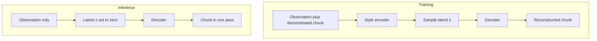
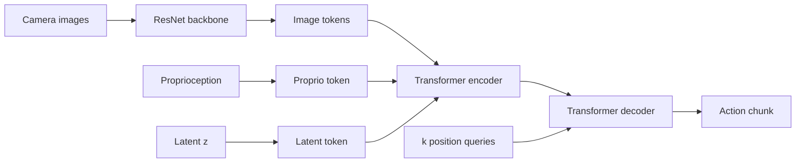

# Lecture 1 — ACT and the CVAE: Single-Pass Action Chunking

> **Duration:** ~2 hours of reading + hands-on.
> **Outcome:** You can explain why action chunking fights compounding error, derive the CVAE training objective ACT uses, build the ACT transformer (observation tokenization, the style encoder, the chunk decoder), and explain why the encoder is discarded at inference so a chunk comes out in one forward pass.

If you remember one sentence from this lecture, remember this one:

> **ACT predicts a chunk of $k$ future actions in a single transformer forward pass, trained as a conditional VAE whose latent absorbs the multimodality of human demonstrations — so at deployment the latent is fixed to its prior and the policy is a fast, deterministic, single-pass chunk predictor.**

Week 29's Diffusion Policy also predicted action chunks, but it paid for its expressiveness with an iterative denoising loop. ACT gets a *different* deal: it handles demonstration multimodality with a latent variable (the CVAE) rather than iterative sampling, which means inference is **one forward pass**. That single-pass property is ACT's reason to exist, and it's why ALOHA could run ACT on cheap hardware at high control rates. This lecture builds ACT from its two pillars: chunking and the CVAE.

---

## 1. Why chunking? The compounding-error problem

Behavior cloning predicts *one action per step*. The trouble is **compounding error**: the policy makes a small mistake, lands in a state slightly off the demonstration distribution, makes a slightly bigger mistake there, and the errors snowball over the episode. The longer the task horizon $H$, the more opportunities to drift, and BC's failure probability grows roughly with $H$ (this is the covariate-shift story from Week 27, restated).

**Action chunking** attacks this directly. Instead of predicting one action and re-deciding every step, predict a *chunk* of $k$ actions and execute them. Now the policy only "decides" every $k$ steps, so the **effective horizon shrinks from $H$ to $H/k$** — there are $k\times$ fewer opportunities to compound error. Chunking also gives temporal consistency (the $k$ actions are jointly predicted, so they're coherent) and lets the policy model *temporally extended* behavior (a smooth reach is a property of a sequence, not a point).

The cost: a chunk is harder to predict than a single action (it's higher-dimensional and must be internally consistent), and if you blindly execute each chunk to completion, you get jerk at the chunk boundaries and staleness within them. ACT solves the prediction difficulty with the CVAE (this lecture) and the boundary/staleness problem with temporal ensembling (Lecture 2). Diffusion Policy solved the same two problems with iterative denoising and receding-horizon execution — *same problems, different machinery*, and that's exactly the comparison the week is about.

---

## 2. Why a CVAE? Handling demonstration multimodality

Human demonstrations are **multimodal and noisy** in a particular way: the same task gets done with different *styles* (fast vs careful, left-handed vs right-handed approach), and even one demonstrator is inconsistent. If you train a plain chunk-regressing transformer with L1/L2 loss, you hit the *same mode-averaging problem* Week 29 diagnosed: the network averages the styles into a mushy, often-invalid chunk.

ACT's answer is a **conditional variational autoencoder**. The idea: introduce a latent variable $z$ that captures "which style / which mode this demonstration is," so that *conditioned on $z$*, the action chunk is (closer to) unimodal and easy to regress. At training time, an **encoder** infers $z$ from the observation *and the actual demonstrated chunk* (it gets to peek at the answer, so it can encode the style). The **decoder** then reconstructs the chunk from the observation and $z$. Because $z$ explains away the style variation, the decoder's job becomes "given the situation and the style, produce the chunk" — a much better-posed regression.

Then the magic at inference: **you throw the encoder away and set $z = 0$ (the prior mean).** This gives the decoder the "average / canonical style," and it produces a single coherent chunk in one pass. You're not sampling styles at deployment (you *could*, but ACT's default is the deterministic $z=0$); you're using the CVAE purely as a *training-time device* to stop mode-averaging from poisoning the decoder. That's the elegant trick, and it's why ACT inference is single-pass and deterministic.


*The style encoder only runs at training time; at inference z is fixed to zero and the decoder alone produces the chunk.*

---

## 3. The CVAE objective

A VAE maximizes the **evidence lower bound (ELBO)**. For ACT, condition everything on the observation $o$; the data being modeled is the action chunk $a_{1:k}$. The objective (which we *minimize*, so signs flip) is:

$$
\mathcal{L} = \underbrace{\mathbb{E}_{z\sim q_\phi}\big[\,\|a_{1:k} - \hat{a}_{1:k}(o, z)\|_1\,\big]}_{\text{reconstruction}} \;+\; \beta\,\underbrace{D_{\mathrm{KL}}\!\big(q_\phi(z\mid o, a_{1:k})\,\big\|\,\mathcal{N}(0, I)\big)}_{\text{latent regularization}}.
$$

Two terms, each with a clear job:

- **Reconstruction** — the decoder, given $o$ and the encoder's $z$, must reproduce the demonstrated chunk. ACT uses **L1** (not L2) because L1 is less sensitive to outliers and tends to produce sharper action predictions — empirically better for manipulation.
- **KL** — pulls the encoder's posterior $q_\phi(z\mid o, a_{1:k})$ toward the prior $\mathcal{N}(0,I)$. This is what makes $z$ a *well-behaved* latent: it forces the encoder to use $z$ efficiently and keeps the latent space close to the prior, so that setting $z=0$ at inference is meaningful.

### The $\beta$ knob (and the failure modes at both ends)

$\beta$ weights the KL term, and it's the most important ACT hyperparameter:

- **$\beta$ too high** → the KL term dominates, the posterior collapses onto the prior, $z$ carries *no* information, and the decoder is forced to mode-average again — you're back to the plain-regression failure. This is **posterior collapse**, and it's the classic VAE pathology.
- **$\beta$ too low** → the latent is unregularized, the encoder can cram arbitrary information into $z$ (effectively memorizing each demo's chunk), and at inference $z=0$ is far from the training $z$'s — the decoder generalizes poorly.
- **The band in between** → $z$ carries the *style* and the decoder uses it; $z=0$ gives a sensible canonical chunk. ACT typically uses a modest $\beta$ (e.g. 10 in the original, but it depends on scaling) — you'll ablate it.

### The reparameterization trick (again)

The encoder outputs the posterior's mean $\mu$ and log-variance $\log\sigma^2$. To sample $z$ *and* let gradients flow back into the encoder, use the reparameterization trick (the same one as Week 28's SAC actor):

$$
z = \mu + \sigma \odot \epsilon, \qquad \epsilon \sim \mathcal{N}(0, I).
$$

```python
def reparameterize(mu, logvar):
    """Sample z = mu + sigma * eps so gradients flow into the encoder."""
    std = torch.exp(0.5 * logvar)
    eps = torch.randn_like(std)
    return mu + std * eps


def kl_divergence(mu, logvar):
    """KL(N(mu, sigma) || N(0, I)), the standard closed form, summed over latent dims."""
    return -0.5 * torch.sum(1 + logvar - mu.pow(2) - logvar.exp(), dim=-1)
```

That closed-form KL is the one you derive in Exercise 1 and implement in Exercise 2. Memorize its shape: for each latent dimension, $-\tfrac{1}{2}(1 + \log\sigma^2 - \mu^2 - \sigma^2)$.

### 3.1 Tuning $\beta$ in practice

Because $\beta$ is the make-or-break knob, here's the practical tuning guide:

| Symptom during training | Likely cause | Fix |
|---|---|---|
| KL crashes toward 0; the policy mode-averages (acts like BC) | $\beta$ too high → posterior collapse | Lower $\beta$ |
| KL stays large; training unstable; poor generalization to new states | $\beta$ too low → latent unregularized, encoder memorizes | Raise $\beta$ |
| KL settles to a small-but-positive value; the latent is used; good eval | $\beta$ in the band | Leave it |

The diagnostic to watch is **the KL term's value over training**. A healthy run has the KL *positive and roughly stable* — the latent is carrying information without running away from the prior. The two failure signatures are unmistakable once you've seen them: a KL that decays to ~0 (collapse) or one that grows without bound (no regularization). Plot the KL alongside the reconstruction loss; the *ratio* of the two, scaled by $\beta$, is what the optimizer is actually balancing, and seeing both curves tells you which way to move $\beta$.

A useful mental model: $\beta$ sets *how much the latent is allowed to "explain."* High $\beta$ → the latent must be cheap (close to the prior), so it can encode little, so the decoder falls back on averaging. Low $\beta$ → the latent can encode anything, including per-demo memorization that doesn't generalize. The sweet spot lets the latent encode *style* (a low-dimensional, generalizable factor) but not *identity* (which demo this is). You'll feel this boundary directly in the Exercise-2 stretch by cranking $\beta$ and watching the modes collapse.

---

## 4. The ACT architecture

ACT is an encoder–decoder transformer (architecturally close to DETR, the detection transformer it borrows from). There are *two* transformers: the **CVAE encoder** (train-time only) that produces $z$, and the **policy** (an observation encoder + an action decoder) that produces the chunk.

### 4.1 Observation tokenization

The policy must turn a heterogeneous observation into a sequence of tokens the transformer can attend over:

- **Images**: each camera frame goes through a **ResNet** backbone (e.g. ResNet-18); the resulting feature map is flattened into a sequence of feature tokens (each spatial location is a token), with a 2D positional encoding added so the transformer knows *where* each feature came from. With multiple cameras, concatenate the per-camera token sequences.
- **Proprioception**: the robot's joint positions / end-effector pose are projected to the model dimension as a single token.
- **The latent $z$**: projected to the model dimension as one token.

These tokens are the input sequence to the **transformer encoder**, which produces a contextualized representation of the whole observation.

### 4.2 The CVAE "style" encoder (train-time only)

A *separate* small transformer encoder sees the observation tokens **plus the demonstrated action chunk** (the actions are embedded and added as tokens). It outputs (via a special `[CLS]`-style token) the posterior parameters $\mu, \log\sigma^2$, from which $z$ is sampled. **This encoder only exists during training.** At inference it's gone, and $z=0$.

### 4.3 The action-chunk decoder

The **transformer decoder** takes $k$ fixed learned *position queries* (one per future action in the chunk) and cross-attends to the encoded observation tokens. Each query's output is projected to an action vector. The result is the whole chunk $\hat{a}_{1:k}$ — produced in **one decoder pass**, all $k$ actions at once (parallel, not autoregressive — there's no left-to-right generation, which is part of why it's fast).


*Observation tokens from images, proprioception, and the latent feed the encoder; the decoder's position queries cross-attend to it and emit the whole chunk in one pass.*

```python
class ACT(nn.Module):
    """Sketch of the ACT policy. The style encoder is used at train time only."""
    def __init__(self, obs_dim, action_dim, chunk_size=16, d_model=512, latent_dim=32):
        super().__init__()
        self.chunk_size = chunk_size
        self.image_backbone = ResNet18Features(out_dim=d_model)     # image -> tokens
        self.proprio_proj = nn.Linear(obs_dim, d_model)
        self.latent_proj = nn.Linear(latent_dim, d_model)
        self.encoder = TransformerEncoder(d_model)                  # over obs tokens
        self.decoder = TransformerDecoder(d_model)                  # emits the chunk
        self.action_head = nn.Linear(d_model, action_dim)
        self.query_embed = nn.Embedding(chunk_size, d_model)        # k position queries
        # CVAE style encoder (train-time only):
        self.style_encoder = TransformerEncoder(d_model)
        self.to_latent = nn.Linear(d_model, latent_dim * 2)         # -> mu, logvar

    def encode_style(self, obs_tokens, action_chunk):
        """Train-time: infer z from obs + the DEMONSTRATED chunk."""
        act_tokens = self.embed_actions(action_chunk)
        h = self.style_encoder(torch.cat([obs_tokens, act_tokens], dim=1))
        mu, logvar = self.to_latent(h[:, 0]).chunk(2, dim=-1)       # from a CLS token
        return mu, logvar

    def decode(self, obs_tokens, z):
        """Produce the action chunk in ONE pass from obs + latent."""
        latent_token = self.latent_proj(z).unsqueeze(1)
        memory = self.encoder(torch.cat([latent_token, obs_tokens], dim=1))
        queries = self.query_embed.weight.unsqueeze(0).expand(z.shape[0], -1, -1)
        decoded = self.decoder(queries, memory)                    # (B, k, d_model)
        return self.action_head(decoded)                           # (B, k, action_dim)
```

### 4.4 Training vs inference, side by side

```python
# TRAINING: encoder infers z from the demonstrated chunk; decoder reconstructs it.
def training_step(model, obs_tokens, action_chunk, beta):
    mu, logvar = model.encode_style(obs_tokens, action_chunk)
    z = reparameterize(mu, logvar)
    pred_chunk = model.decode(obs_tokens, z)
    recon = F.l1_loss(pred_chunk, action_chunk)                    # L1 reconstruction
    kl = kl_divergence(mu, logvar).mean()
    return recon + beta * kl

# INFERENCE: encoder GONE; z = 0 (prior mean); ONE forward pass -> the chunk.
@torch.no_grad()
def infer(model, obs_tokens):
    z = torch.zeros(obs_tokens.shape[0], model.latent_dim, device=obs_tokens.device)
    return model.decode(obs_tokens, z)                             # single pass
```

Stare at the two functions. Training runs the style encoder and the KL term; inference runs *neither* — just one `decode` with $z=0$. That asymmetry is the whole point: the CVAE is a training-time crutch that lets the deployed network be a fast, deterministic, single-pass chunk predictor.

### 4.5 Why the decoder emits the whole chunk in parallel (not autoregressively)

A detail worth dwelling on, because it's part of why ACT is fast. A language transformer generates tokens *autoregressively* — token $t+1$ depends on token $t$, so producing $k$ tokens takes $k$ sequential forward passes. ACT does **not** do this. It uses $k$ fixed *position queries* (one per future action), and the decoder produces all $k$ actions in a **single parallel pass** — query $i$ attends to the encoded observation and outputs action $i$, with no dependence on the other queries' outputs. This is the same trick DETR uses for object detection (fixed object queries, parallel decode), which is exactly where ACT borrowed its architecture.

The consequence: ACT's inference cost is *one* transformer forward pass regardless of chunk length $k$ (within reason — longer chunks are slightly more compute, but it's one pass, not $k$ passes). Contrast an autoregressive chunk predictor, which would need $k$ sequential passes and be far too slow for a control loop. The parallel decode is half of why "single-pass" is true; the discarded encoder is the other half. Together they're why ACT hits the high control rates ALOHA needed for fine bimanual manipulation.

### 4.6 The image-conditioning path

For a visuomotor ACT (the realistic case), the observation tokens come from camera frames. Each frame goes through a ResNet backbone; the resulting feature map (say $H \times W \times C$) is flattened into $H\cdot W$ feature tokens, each tagged with a 2D positional encoding so the transformer knows *where* in the image each feature lives. With two cameras you get two such token sequences, concatenated. The proprioceptive state (joint angles) is projected to one more token, and at training time the latent $z$ is one more. The transformer encoder contextualizes all of these together, so by the time the decoder's position queries cross-attend to them, each query can attend to "the part of the scene relevant to action $i$." This is the same spatial-information-preserving idea as Diffusion Policy's spatial-softmax (Week 29), arrived at differently: ACT keeps spatial info by *tokenizing* the feature map and letting attention sort out relevance, rather than by extracting keypoint coordinates. Both refuse to throw away *where* things are, which is the cardinal sin of global pooling for a manipulation policy.

In code, the tokenization looks like this:

```python
class ImageTokenizer(nn.Module):
    """Turn a camera frame into a sequence of feature tokens with 2D positions."""
    def __init__(self, d_model: int):
        super().__init__()
        resnet = torchvision.models.resnet18(weights=None)
        # Drop the avgpool + fc head; keep the conv trunk that yields a feature MAP.
        self.backbone = nn.Sequential(*list(resnet.children())[:-2])   # -> (B, 512, h, w)
        self.proj = nn.Conv2d(512, d_model, kernel_size=1)             # channels -> d_model
        self.pos_embed = nn.Parameter(torch.randn(1, d_model, 1, 1))   # learned 2D positions

    def forward(self, img):                                            # img: (B, 3, H, W)
        feat = self.proj(self.backbone(img))                          # (B, d_model, h, w)
        feat = feat + self.pos_embed                                  # add position info
        B, C, h, w = feat.shape
        tokens = feat.flatten(2).transpose(1, 2)                      # (B, h*w, d_model)
        return tokens                                                  # one token per location
```

Each of the `h*w` tokens is a "what is here, and where" descriptor; the transformer encoder mixes them with the proprioception and latent tokens. Notice there is **no global pooling** — that's the deliberate choice. If you collapsed the feature map to a single vector, the decoder would know *what* objects are present but not *where*, and a reach policy that doesn't know where the target is can't reach it.

### 4.7 The ACT training algorithm, end to end

Putting the pieces in order, one training step is:

1. **Tokenize the observation** — ResNet per camera + proprioception token (+ latent token at train time).
2. **Encode the style** — the style encoder sees obs tokens + the *demonstrated* action chunk, emits $\mu, \log\sigma^2$.
3. **Sample the latent** — $z = \mu + \sigma\epsilon$ (reparameterized).
4. **Decode the chunk** — the transformer decoder cross-attends $k$ position queries to the encoded (obs + $z$) tokens, emitting $\hat{a}_{1:k}$ in one pass.
5. **Compute the loss** — L1 reconstruction $\|a_{1:k} - \hat{a}_{1:k}\|_1$ plus $\beta\cdot$KL$(q(z)\,\|\,\mathcal{N}(0,I))$.
6. **Backprop and step** — gradients flow through the decoder, the encoders (image + style), and into the latent via the reparameterization.

At inference, steps 2–3 vanish ($z=0$, no style encoder) and step 4 is the *entire* forward pass. That's the asymmetry, restated as an algorithm: train with six steps, deploy with one.

---

## 5. Why ACT inference is single-pass (and Diffusion Policy isn't)

Put the two side by side, because this is the comparison the week hinges on:

| | Diffusion Policy | ACT |
|---|---|---|
| How multimodality is handled | Iterative denoising; the noise seed selects a mode | A CVAE latent absorbs style at *training* time |
| Inference | $N$ denoising forward passes (DDIM ~10–16) | **1** forward pass |
| Inference determinism | Deterministic given the seed (DDIM) | Deterministic ($z=0$) |
| Output multimodality at deploy | Yes — re-sample to get different modes | No by default ($z=0$ gives the canonical chunk); can sample $z$ if you want it |
| Smoothing | Receding-horizon execution (execute $T_a$, re-plan) | Temporal ensembling (Lecture 2) |

The headline: **ACT trades the ability to express multimodality *at inference* for a single-pass forward and lower latency.** On a task where deploy-time multimodality matters (genuinely ambiguous situations the robot must sometimes resolve differently), Diffusion Policy's re-sampling can help. On a task where you want the *one good way* done fast and smoothly, ACT's single pass is a gift. Which matters more is a *task* question, answered with the *measured* comparison you build this week — not a blanket "X is better than Y."

### 5.1 Training stability and the data-hunger of ACT

A few practical truths about training ACT that the architecture diagram doesn't tell you:

- **ACT trains stably.** Like Diffusion Policy (and unlike a GAN), its loss is a well-behaved regression (L1) plus a KL — no adversarial dynamics, no contrastive negatives. You will not babysit it the way you'd babysit a GAN. The main instability is posterior collapse from a bad $\beta$, which is a single knob.
- **It's relatively data-efficient.** The whole ALOHA result was about learning fine manipulation from *tens* of demonstrations (often ~50 per task). Chunking is part of why: shrinking the effective horizon means each demo provides more independent "decisions" to learn from, and the CVAE keeps the multimodality from confusing the regression. Don't expect to need thousands of demos for a single task — that's a key selling point.
- **Overfitting shows up as memorization.** With small demo sets and a capable transformer, ACT can memorize the training trajectories and fail to generalize to new initial states. Standard antidotes apply: image augmentation (random crops, color jitter), dropout, weight decay, and *evaluating on held-out initial conditions* rather than trusting the training loss. If training success is high but eval success is low, you're memorizing — augment and regularize.
- **The image backbone dominates compute.** For a visuomotor ACT, the ResNet forward pass is usually the largest single cost, not the transformer. This matters for the latency benchmark (Lecture 2): when you profile, the image encoder is where most of the milliseconds go, and it's the first place to look if inference is too slow.

These are the things that separate "I trained ACT" from "I trained ACT *that generalizes and deploys*," and they're exactly what the mini-project's eval protocol and latency benchmark force you to confront.

### 5.2 Two ways to think about the same problem

It clarifies both methods to see Diffusion Policy and ACT as two answers to one question — *how do you represent a multimodal action distribution and still produce a clean, fast action chunk?*

- **Diffusion Policy's answer**: represent the distribution *implicitly*, as the endpoint of a denoising process, and *sample* from it at inference by running the denoiser. Multimodality lives in the sampling: different noise seeds land in different modes. The cost is the iterative sampling loop.
- **ACT's answer**: represent the distribution's *style variation* with an explicit latent $z$ learned at training time, and at inference *collapse* to the canonical mode ($z=0$) in a single pass. Multimodality is handled during *training* (the latent stops the decoder from averaging), then deliberately set aside at deployment for speed.

The deep difference: **Diffusion Policy keeps the full distribution available at inference (you can re-sample to get a different mode); ACT bakes the distribution-handling into training and ships a deterministic single-mode predictor.** Neither is "more correct" — they're different points on a trade between deploy-time flexibility and inference cost. If you internalize this framing, the whole week's comparison stops being "which paper is better" and becomes "which trade fits my task." A task with one obvious right action favors ACT's collapse-to-canonical; a task where the robot must genuinely sometimes choose differently favors Diffusion Policy's keep-it-samplable. That's the senior reading, and it's what Lecture 2's decision framework makes operational.

One more contrast worth holding: ACT's latent is *low-dimensional and semantic* (it captures "style"), while Diffusion Policy's "latent" is effectively the high-dimensional noise seed (no semantics — just a random draw that happens to select a mode). ACT could, in principle, let you *steer* the style by choosing $z$ deliberately (the Exercise-2 stretch shows this — $z_{\text{left}}$ vs $z_{\text{right}}$); Diffusion Policy's noise gives you no such handle. In practice neither capability is heavily used, but it's the kind of architectural difference that matters when a task suddenly needs it.

### 5.3 The three ideas, restated as a checklist

If you remember nothing else about ACT's mechanics, remember these three ideas and what each buys you:

1. **Action chunking** — predict $k$ actions per inference. *Buys:* a smaller effective horizon ($H/k$), fewer compounding-error opportunities, temporally coherent motion.
2. **The CVAE** — a latent absorbs demonstration style at training time, discarded ($z=0$) at inference. *Buys:* multimodality handling without iterative sampling, so inference is a single deterministic pass.
3. **Temporal ensembling** (Lecture 2) — average overlapping per-timestep chunks with exponential weights. *Buys:* smooth execution without chunk-boundary jerk, affordable precisely because inference is single-pass.

Each idea solves a specific problem (long horizons, multimodal demos, jerky execution), and together they make ACT the deployment-friendly imitation architecture the week's title claims. When you train ACT in the mini-project, you'll touch all three: chunking is a config (the chunk size $k$), the CVAE is the loss you watch ($\beta$ and the KL), and temporal ensembling is the deployment controller (the decay $m$). Three knobs, three ideas — hold the mapping and the whole method stays legible.

---

## 6. A worked numerical example (you'll redo this in Exercise 1)

Take a 2-dimensional latent with encoder outputs $\mu = [0.5, -1.0]$ and $\log\sigma^2 = [0.0, -0.69]$ (so $\sigma^2 = [1.0, 0.5]$). The KL to $\mathcal{N}(0,I)$, per dimension, is $-\tfrac{1}{2}(1 + \log\sigma^2 - \mu^2 - \sigma^2)$:

- dim 0: $-\tfrac{1}{2}(1 + 0.0 - 0.25 - 1.0) = -\tfrac{1}{2}(-0.25) = 0.125$.
- dim 1: $-\tfrac{1}{2}(1 + (-0.69) - 1.0 - 0.5) = -\tfrac{1}{2}(-1.19) = 0.595$.

Total KL $= 0.125 + 0.595 = 0.72$ nats. Notice dim 1 contributes more — its mean is far from 0 (the $\mu^2 = 1.0$ term) and its variance is well below 1, both of which the KL penalizes. With $\beta = 10$ this term contributes $7.2$ to the loss, which is large relative to a typical L1 reconstruction of, say, $0.3$ — exactly why $\beta$ must be chosen carefully, and why too-large $\beta$ crushes the latent to the prior (posterior collapse). Exercise 1 makes you do this for a few $(\mu, \sigma)$ and watch the collapse boundary.

---

## 7. Why chunk size $k$ is a design decision, not a default

The chunk size $k$ is the most consequential ACT hyperparameter after $\beta$, and the trade is worth understanding before you pick it:

- **$k$ too small** (e.g. 1) → you're back to per-step prediction; compounding error returns, and there's little for temporal ensembling to overlap. The whole point of chunking is lost.
- **$k$ too large** (e.g. 100) → the chunk covers so much of the task that a single observation can't reliably predict its tail (the world will have changed). The decoder is asked to forecast far into the future from stale information, and accuracy degrades at the chunk's end.
- **The sweet spot** (often 8–32 for manipulation, tuned per task) → long enough to meaningfully shrink the effective horizon $H/k$ and give temporal ensembling material to blend, short enough that the whole chunk is predictable from the current observation.

A useful way to set $k$: estimate the *timescale of a meaningful sub-behavior* in your task (a reach, a grasp closure) in control steps, and set $k$ to roughly that. You want one chunk to capture a coherent micro-action, not a whole task and not a single twitch. You'll sweep $k$ in the mini-project and plot success vs $k$ to find your task's value — and you'll see both failure modes at the extremes, which is the best way to internalize the trade.

A subtle interaction with temporal ensembling: a larger $k$ gives *more overlapping predictions per timestep* (up to $k$ of them), so the ensemble has more to average — smoother, but the oldest contributors are predictions made $k-1$ steps ago from a stale observation, which the exponential decay $m$ exists to down-weight. So $k$ and $m$ are coupled: a large $k$ wants a larger $m$ (trust recent predictions more) to avoid dragging in too much stale information. Lecture 2 develops the ensembling side; here, just note that $k$ doesn't live in isolation.

---

## 8. Recap

You should now be able to:

- Explain how action chunking shrinks the effective horizon by $k$ and fights compounding error.
- Explain why ACT uses a CVAE: the latent absorbs demonstration style/multimodality so the decoder's regression is well-posed, dodging the mode-averaging failure.
- Derive and implement the CVAE objective: L1 reconstruction + $\beta\cdot$KL, the closed-form KL, and the reparameterization trick — and name the posterior-collapse failure at high $\beta$.
- Build the ACT architecture: ResNet-tokenized images + proprioception + latent token, a transformer encoder, and a transformer decoder with $k$ position queries emitting the chunk in one pass.
- State precisely why ACT inference is single-pass (encoder discarded, $z=0$) and how that contrasts with Diffusion Policy's iterative denoising.

Next: temporal ensembling (how ACT turns overlapping single-pass chunks into smooth motor commands), rigorous latency profiling, and the framework for choosing ACT vs Diffusion Policy on the axis that matters — success at a fixed latency budget. Continue to [Lecture 2 — Temporal Ensembling, Latency, and the Policy Choice](./02-temporal-ensembling-latency-and-the-policy-choice.md).

---

## References

- *Learning Fine-Grained Bimanual Manipulation with Low-Cost Hardware* (ACT / ALOHA) — Zhao et al. (2023): <https://arxiv.org/abs/2304.13705>
- *Auto-Encoding Variational Bayes* (the VAE / reparameterization) — Kingma, Welling (2013): <https://arxiv.org/abs/1312.6114>
- *Attention Is All You Need* (the transformer ACT builds on) — Vaswani et al. (2017): <https://arxiv.org/abs/1706.03762>
- *End-to-End Object Detection with Transformers* (DETR, ACT's architectural ancestor) — Carion et al. (2020): <https://arxiv.org/abs/2005.12872>
- *Lilian Weng — From Autoencoder to Beta-VAE*: <https://lilianweng.github.io/posts/2018-08-12-vae/>
- *LeRobot `act` policy* (the maintained reference): <https://github.com/huggingface/lerobot>

---

## Appendix — Glossary of ACT-specific terms

For quick reference while reading the code and the paper:

- **CVAE encoder** — the train-only transformer that infers the latent $z$ from the observation *and* the demonstrated action chunk. Discarded at inference.
- **Style latent $z$** — the low-dimensional variable capturing demonstration style; sampled at training, set to 0 at deployment.
- **Position queries** — the $k$ learned query embeddings (one per future action) the decoder uses to emit the whole chunk in parallel.
- **L1 reconstruction** — the action-prediction loss (ACT uses L1, not L2, for sharper predictions).
- **$\beta$ (KL weight)** — balances reconstruction against latent regularization; the posterior-collapse knob.
- **Temporal ensembling** — averaging overlapping per-timestep chunks with weights $w_i = e^{-mi}$ (Lecture 2).
- **Chunk size $k$** — actions predicted per inference; shrinks the effective horizon to $H/k$.
- **Posterior collapse** — the failure where the KL crushes $z$ to the prior and the decoder mode-averages.
- **Parallel decode** — the decoder emits all $k$ chunk actions in one pass (not autoregressively), which is part of why inference is single-pass-fast.

Hold these nine terms and the paper reads cleanly.
