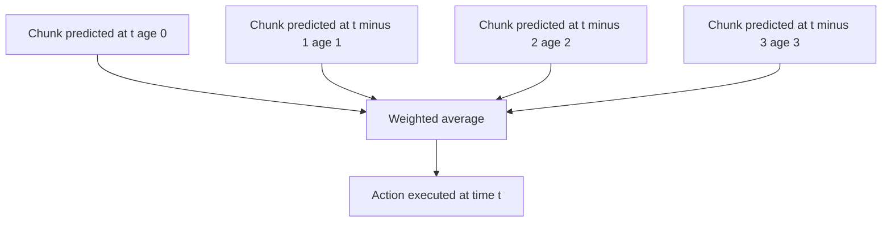
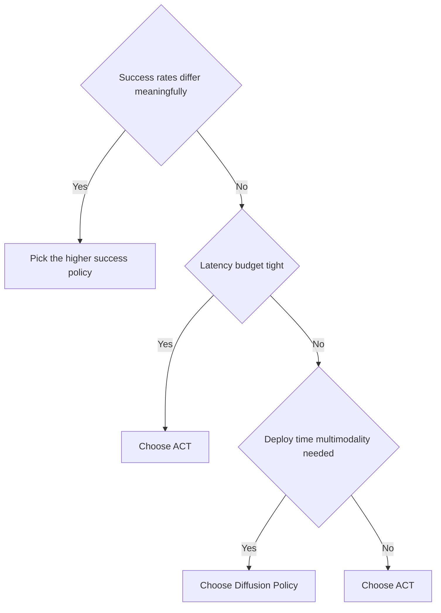

# Lecture 2 — Temporal Ensembling, Latency Profiling, and Choosing a Policy

> **Duration:** ~2 hours of reading + hands-on.
> **Outcome:** You can implement temporal ensembling and explain why it smooths execution better than receding-horizon chunk-switching, profile inference latency *honestly* on a deployment target, and choose between ACT and Diffusion Policy with measured numbers instead of opinions.

Lecture 1 built ACT: a single-pass, CVAE-trained chunk predictor. This lecture handles the two things that make it *deployable* and the one decision the whole week is preparing you for. Three parts: (1) temporal ensembling — the execution-smoothing trick; (2) latency profiling done right; (3) the ACT-vs-Diffusion-Policy decision framework.

The sentence to carry in:

> **Because ACT inference is cheap, it can re-predict a fresh overlapping chunk every single timestep — and averaging the overlapping predictions with an exponential weighting gives smooth motor commands without the jerk of switching between non-overlapping chunks.**

---

## Part 1 — Temporal ensembling

### 1.1 The chunk-boundary problem

In Week 29 you executed chunks *receding-horizon*: predict $T_p$, execute the first $T_a$, re-plan. That works, but it has a seam. When you switch from one chunk to the next, the two chunks were predicted from *different* observations and can disagree slightly about what to do at the transition — producing a small discontinuity, i.e. **jerk**, at every chunk boundary. Shorten $T_a$ to re-plan more often and you get *more* seams (more frequent small disagreements); lengthen it and the motion is smooth but stale.

### 1.2 The idea: overlap and average

ACT exploits its cheap inference to sidestep the seam entirely. At **every timestep**, it predicts a *fresh* chunk of $k$ actions. So at timestep $t$, you have predictions for action $t$ from the chunk just predicted at $t$, *and* from the chunk predicted at $t-1$ (its 2nd action), *and* from the chunk predicted at $t-2$ (its 3rd action), and so on — up to $k$ overlapping predictions, all proposing an action for timestep $t$, each made from a different (progressively older) observation.

**Temporal ensembling** combines these overlapping predictions with an exponential weighting, then emits the weighted average as the action actually executed:

$$
a_t = \frac{\sum_{i} w_i\, \hat{a}_t^{(i)}}{\sum_i w_i}, \qquad w_i = \exp(-m\cdot i),
$$

where $i$ indexes how *old* the prediction is ($i=0$ is the freshest, predicted at the current timestep; larger $i$ is older), and $m$ is the decay rate.


*Every overlapping chunk that proposes an action for the current timestep is blended by its exponential weight.*

```python
class TemporalEnsembler:
    """Maintain overlapping chunks and emit an exponentially-weighted average per
    timestep. Predict a fresh chunk EVERY step (ACT inference is cheap enough)."""
    def __init__(self, chunk_size: int, action_dim: int, m: float = 0.01):
        self.k, self.action_dim, self.m = chunk_size, action_dim, m
        # predictions[t] holds the list of (age, action) proposing timestep t.
        self.buffer = {}
        self.t = 0

    def step(self, fresh_chunk):
        """fresh_chunk: (k, action_dim) just predicted at the current timestep.
        Register each of its actions for its target timestep, then emit timestep t."""
        for offset in range(self.k):
            target_t = self.t + offset
            self.buffer.setdefault(target_t, []).append((offset, fresh_chunk[offset]))

        proposals = self.buffer.pop(self.t)                # all predictions for NOW
        weights = [math.exp(-self.m * age) for age, _ in proposals]
        actions = [a for _, a in proposals]
        wsum = sum(weights)
        action = sum(w * a for w, a in zip(weights, actions)) / wsum
        self.t += 1
        return action
```

### 1.3 What the decay $m$ controls

- **Large $m$** (e.g. $m\to\infty$): only the freshest prediction (age 0) has weight → you execute "the newest chunk's first action" → maximally reactive, but no smoothing (you're back to per-step prediction, jerkier).
- **Small $m$** (e.g. $m\to 0$): all overlapping predictions weighted equally → heavy smoothing, but laggy (old predictions, made from stale observations, drag the action toward where the robot *was* heading).
- **The band in between** (ACT's default is a small $m$ like 0.01): recent predictions dominate but older ones smooth the trajectory. You'll sweep $m$ and plot jerk-vs-reactivity to find the knee.

### 1.4 Why this beats receding-horizon switching

Receding-horizon execution has a *discrete* seam every $T_a$ steps (a hard switch between two chunks). Temporal ensembling has *no seam*: every timestep's action is a blend of several overlapping predictions, so consecutive actions change *gradually* — the blend at $t$ and the blend at $t+1$ share most of their constituent predictions, so they're close by construction. The result is markedly smoother motor commands (you'll measure a multiple-x jerk reduction in Exercise 3). The price is that ACT must predict a chunk *every* timestep, which is only affordable *because* its inference is single-pass — temporal ensembling and single-pass inference are a matched pair. (Diffusion Policy *could* temporal-ensemble too, but predicting a chunk every step at 16 DDIM steps each is usually too slow — which is exactly why it uses receding-horizon instead. The execution-smoothing strategy follows from the inference cost.)

### 1.5 A worked ensembling trace

Make it concrete with one timestep. Suppose $k=4$ and $m=0.1$, and four overlapping chunks (predicted at the last four timesteps) propose the following scalar actions for *now*, with ages $i=0,1,2,3$ (0 = freshest):

| age $i$ | weight $w_i = e^{-0.1 i}$ | proposed action $\hat{a}^{(i)}$ |
|---:|---:|---:|
| 0 | 1.000 | 1.00 |
| 1 | 0.905 | 1.10 |
| 2 | 0.819 | 0.80 |
| 3 | 0.741 | 1.40 |

The normalized weights are $w_i / \sum w_j$ with $\sum w_j = 3.465$: $[0.289, 0.261, 0.236, 0.214]$. The emitted action is the weighted average:

$$
a = \frac{1.000(1.00) + 0.905(1.10) + 0.819(0.80) + 0.741(1.40)}{3.465} = \frac{1.000 + 0.995 + 0.655 + 1.037}{3.465} = \frac{3.687}{3.465} = 1.064.
$$

The freshest prediction (1.00) gets the most weight, but the older ones pull the result toward their consensus — and because *next* timestep's blend reuses three of these four predictions (just shifting one age), the emitted action changes only gradually. That gradual change *is* the smoothing. If you cranked $m$ to 2.0, $w = [1.0, 0.135, 0.018, 0.002]$ — the freshest prediction dominates almost entirely, and you'd emit ≈ 1.00 (reactive, but no smoothing). If you dropped $m$ to 0.001, all four weights ≈ 1.0 and you'd emit the plain average ≈ 1.075 (smoothest, but laggy because the stale predictions count fully). Exercise 1 makes you compute this; Exercise 3 makes you measure its jerk effect on a trajectory.

---

## Part 2 — Latency profiling done right

The week's central measurement is "how long does one inference take?" — and it's astonishingly easy to get wrong in ways that flatter or slander a policy. Do it rigorously.

### 2.1 The five rules of an honest GPU benchmark

1. **Warm up.** The first few forward passes include CUDA kernel compilation, cuDNN autotuning, and lazy allocation. Run ~10–20 warm-up passes and *discard* them. Benchmarking the cold first call is the most common mistake and it makes everything look slow.
2. **Synchronize.** CUDA is asynchronous — `time.perf_counter()` around a forward pass measures only the *launch*, not the *compute*, unless you `torch.cuda.synchronize()` before reading the clock. Without the sync your "latency" is fiction (often suspiciously, impossibly low).
3. **Batch of one.** Deployment runs one observation at a time, so benchmark batch size 1. A throughput-optimized batch-of-256 number is irrelevant to a control loop's per-decision latency.
4. **The right precision.** Benchmark the precision you'll *deploy* — FP16 on a Jetson, not FP32, if that's what ships. (Week 39 goes deep on this.)
5. **Report a distribution, not a point.** Run 100+ timed passes and report the **median and the p99**, not just the mean. A control loop cares about the *worst* case (the p99 that might blow your budget), not the average.

```python
import torch, time, numpy as np

@torch.no_grad()
def benchmark(model, sample_input, n_warmup=20, n_runs=100, device="cuda"):
    model.eval()
    # 1. warm up (discard)
    for _ in range(n_warmup):
        _ = model(sample_input)
    if device == "cuda":
        torch.cuda.synchronize()                       # 2. sync before timing
    times = []
    for _ in range(n_runs):
        t0 = time.perf_counter()
        _ = model(sample_input)                        # 3. batch of one in sample_input
        if device == "cuda":
            torch.cuda.synchronize()                   # 2. sync before stopping clock
        times.append((time.perf_counter() - t0) * 1000.0)   # ms
    times = np.array(times)
    return {"median_ms": float(np.median(times)),      # 5. distribution, not a point
            "p99_ms": float(np.percentile(times, 99)),
            "mean_ms": float(times.mean())}
```

### 2.2 The comparison that matters

ACT: **one** forward pass. Diffusion Policy: **$N$** forward passes (the DDIM step count). So the fair comparison is `benchmark(act, ...)` vs `N × benchmark(diffusion_unet_one_step, ...)` plus the per-policy overhead. A representative result on a small GPU:

```
ACT (1 pass)           : median  6.2 ms   p99  7.1 ms
Diffusion Policy (16)  : median 31.8 ms   p99 35.0 ms
Control budget (30 Hz) : 33.3 ms
```

Read it against the budget: ACT has comfortable margin (6 ms ≪ 33 ms); 16-step Diffusion Policy is right at the edge (its p99 *exceeds* the budget — a real problem, and exactly why Diffusion Policy uses the action-queue to *decouple* inference from control rather than denoising every tick). This is the deployment-latency reality the whole week sharpens.

### 2.3 On the Jetson Orin

The syllabus's deployment target is the Jetson Orin. Numbers there are different (and slower) than your dev GPU — benchmark *on the target* if you can, with `nsys` for the per-op breakdown. If you can't, benchmark on your dev GPU *and* CPU and document the substitution honestly; state that the *ordering* (ACT faster than multi-step Diffusion) is robust across hardware even if the absolute numbers move.

### 2.4 What the latency budget actually contains

"Fits the 33 ms budget" is more subtle than "inference < 33 ms," and a senior engineer accounts for the *whole* per-tick chain, not just the policy forward pass. A control tick on the capstone robot has to fit, in 33 ms: sensor ingestion and observation assembly, the perception stack's contribution (if the policy conditions on processed perception), the policy inference, any safety-filter check (Week 32), and the command publish. The policy is one slice of that budget, not the whole thing. So when ACT measures 6 ms and Diffusion Policy 32 ms against a 33 ms tick, the real story is: ACT leaves ~27 ms for *everything else*, while a 32 ms Diffusion Policy leaves *nothing* — which is precisely why Diffusion Policy must use the action-queue to denoise *off* the per-tick critical path (re-planning every $T_a$ ticks, not every tick). The lesson generalizes: **the policy's latency budget is whatever's left after the rest of the control loop takes its share**, and you size the policy to fit *that* remainder, not the full tick. This accounting is exactly what Week 39's integrated-graph profiling makes rigorous.

### 2.4a Reading a benchmark result

When the numbers come back, interpret them — don't just paste them. A quick guide to what each pattern means:

- **ACT median ≈ p99** (e.g. 6.2 / 7.1 ms) → stable, predictable inference. Good for a control loop; the worst case is close to the typical case.
- **ACT median ≪ p99** (e.g. 6 / 40 ms) → a long tail. Something occasionally stalls — GC, memory traffic, a thermal throttle on the Jetson. Investigate before trusting the policy in a real loop, because that tail is exactly what misses a deadline.
- **Diffusion Policy ≈ N × (one U-Net pass)** → expected; the denoise is N sequential passes. If it's *more* than N× a single pass, you have per-step overhead (re-encoding the obs each step? — don't; encode once).
- **Both suspiciously low (µs) and nearly equal** → unsynchronized benchmark. You measured launches, not compute. Add `torch.cuda.synchronize()`.

The number you report to a design review is the **p99 at deploy precision, batch 1, on the target device** — that single number, with its conditions stated, is what a reviewer can actually use to decide if the policy fits the loop.

### 2.5 A note on inference precision and batch effects

Two more things that move the number, both of which you must hold fixed when comparing:

- **Precision.** FP16 inference is roughly 1.5–2× faster than FP32 on a GPU with tensor cores, and INT8 faster still (Week 39). If you benchmark ACT at FP16 and Diffusion Policy at FP32 you've rigged the comparison. Match the precision you'd *deploy*, and report it next to every number.
- **The "batch of one" tax.** Deployment runs a single observation per tick, which under-utilizes a GPU built for big batches — so the *per-sample* latency at batch-1 is worse than the throughput-optimal batch number would suggest. That's *correct* for deployment (you really do run one at a time), but it means a "samples/sec" benchmark from training is not your control-loop latency. Always benchmark batch-1 for a deployment number.

---

## Part 3 — Choosing a policy: the decision framework

You now have two action-chunking imitation policies trained on the same demos. Which ships? The honest senior answer is "it depends, and here is the table." Score both on five axes:

| Axis | ACT | Diffusion Policy | How to measure |
|---|---|---|---|
| **Success rate** | task-dependent | task-dependent | the fixed eval protocol (Week 29) |
| **Inference latency** | low (1 pass) | higher ($N$ passes) | the §2 benchmark, median + p99 |
| **Deploy-time multimodality** | no by default ($z=0$) | yes (re-sample) | the multimodality scatter (Week 29) |
| **Smoothness (jerk)** | smooth (temporal ensembling) | smooth (receding horizon) | jerk = $\sum\|\Delta a\|^2$ over a rollout |
| **Training cost / stability** | modest, stable | modest, stable | wall-clock to convergence; both are fine |

The decision logic:

- **Tight latency budget, want fast + smooth, the "one good way" is fine** → **ACT**. Single-pass inference and temporal ensembling are exactly this profile. (ALOHA chose ACT for high-rate bimanual control for this reason.)
- **Genuinely ambiguous task where the robot should *sometimes* resolve differently at deploy, latency budget is generous** → **Diffusion Policy**. Its deploy-time multimodality is a real capability ACT gives up by default.
- **Success rates differ meaningfully on your task** → success wins, period. Latency is a constraint, not the objective; a faster policy that fails the task is worthless.


*Reading the five-axis table as a decision tree: success first, then latency, then deploy-time multimodality.*

The meta-skill: **don't pick by reputation; pick by your measured table.** Two engineers can correctly choose differently for different tasks. The portfolio artifact this week produces is *the table*, and the defensible recommendation that follows from *your* numbers. That's the thing a Week-32 panel (and a real design review) actually respects.

### A worked decision

Suppose your measured table comes out like this on a tabletop pick-and-place:

```
                       ACT                 Diffusion Policy
success (N=50)         0.88                0.91
latency median/p99     6.2 / 7.1 ms        31.8 / 35.0 ms
deploy multimodality   no (z=0)            yes (re-sample)
jerk                   0.061               0.058
training wall-clock    1.2 h               1.5 h
```

How a senior engineer reads it for a 30 Hz (33 ms) control loop:

- **Success is within 3 points** — close enough that it doesn't, by itself, decide. (If it were 0.88 vs 0.70, success would dominate and end the conversation.)
- **Latency decisively favors ACT** — its 7 ms p99 leaves ~26 ms for perception, the safety filter, and publish; Diffusion Policy's 35 ms p99 *exceeds the whole tick*, forcing the action-queue (added staleness) just to run.
- **Jerk is a tie** (both smooth their own way).
- **Deploy-time multimodality** is the one axis favoring Diffusion Policy — but a tabletop pick-and-place is *not* a genuinely ambiguous task (there's usually one good grasp), so this capability is unused.
- **Recommendation: ship ACT.** Equal success, fits the budget with headroom, and the multimodality ACT gives up isn't needed here. **Flip condition:** if the task were "place the object in *any* of three valid bins" (genuinely multimodal at deploy) and the budget were 100 ms, Diffusion Policy's re-sampling would justify its latency.

That paragraph — table, axis-by-axis reading, recommendation, flip condition — *is* the deliverable. Notice it never says "ACT is better"; it says "ACT is better *for this task under this budget, and here's what would change my mind*." That conditional, evidence-bound form is what distinguishes an engineer's recommendation from an opinion.

### 3.1 Designing a fair eval protocol (so the success numbers mean something)

The success-rate axis is only trustworthy if the eval protocol is sound. The rules, which you fix *before* training:

- **Fixed evaluation seeds.** The same set of initial conditions for every policy. If ACT and Diffusion Policy face different random starts, their success rates aren't comparable — one might have drawn easier scenes.
- **Held-out initial conditions.** Evaluate on initial states *not* in the training demos, or you're measuring memorization, not generalization. A policy that aces the training starts and fails new ones hasn't learned the task.
- **An explicit, binary success criterion.** "Object placed within 2 cm of the goal and the gripper released" — not "looked successful." Ambiguous criteria let unconscious bias creep in.
- **Enough episodes for a meaningful number.** N ≥ 50 so a few-point difference isn't noise. A 0.88-vs-0.86 gap on N=10 is meaningless; on N=200 it's real.
- **The same harness for every policy.** Reset logic, timeout, success check — identical code path. The only thing that varies between runs is *which policy* is in the loop.

Fixing all of this *before* you see any results is what stops the most insidious bias: tuning the eval (the seeds, the criterion, the timeout) until your preferred policy wins. Write the protocol down, commit it, then run all the policies through it unchanged. That discipline is the difference between a comparison that's evidence and one that's a rationalization — and it's exactly what a Week-32 panel will probe when they ask "how did you evaluate?"

---

## Part 4 — Deployment in ROS2

The ROS2 node reuses the Week-29 skeleton, swapping the receding-horizon controller for a temporal ensembler:

```python
class ACTPolicyNode(Node):
    def __init__(self):
        super().__init__("act_policy_node")
        self.policy = torch.jit.load("act_policy.pt"); self.policy.eval()
        self.ensembler = TemporalEnsembler(chunk_size=16, action_dim=7, m=0.01)
        self.obs_history = deque(maxlen=1)            # ACT typically conditions on the current obs

        sensor_qos = QoSProfile(reliability=ReliabilityPolicy.BEST_EFFORT,
                                history=HistoryPolicy.KEEP_LAST, depth=5)
        cmd_qos = QoSProfile(reliability=ReliabilityPolicy.RELIABLE,
                             history=HistoryPolicy.KEEP_LAST, depth=1)
        self.create_subscription(JointState, "/joint_states", self._on_state, sensor_qos)
        self.pub = self.create_publisher(Float64MultiArray, "/arm_cmd", cmd_qos)
        self.create_timer(1.0 / 30.0, self._control_tick)

    def _control_tick(self):
        if self.latest_obs is None:
            return
        obs = self._assemble_obs(self.latest_obs)    # same layout as training!
        with torch.no_grad():
            fresh_chunk = self.policy(obs).squeeze(0)   # ONE pass -> (k, action_dim)
        action = self.ensembler.step(fresh_chunk.cpu().numpy())   # ensemble overlapping chunks
        self.pub.publish(Float64MultiArray(data=self._unnormalize(action).tolist()))
```

Because ACT inference is single-pass and fast, it predicts a fresh chunk *every* tick and ensembles — no action queue needed. Same Week-5 QoS discipline, same obs-mismatch and un-normalization traps as before (still the #1 and #2 silent deploy bugs).

### 4.1 The deployment checklist

Before you declare an ACT deployment working, walk this list — it's the union of the traps from Weeks 28–30:

- [ ] **Observation layout matches training** — same order, same scale. Asserted against a spec saved with the checkpoint. (The #1 silent bug.)
- [ ] **Action un-normalization applied** — the policy outputs normalized actions; the robot needs real units. (The #2 silent bug — "the arm barely moves.")
- [ ] **Deterministic inference** — $z=0$, not a sampled latent, at deploy. (You train with the latent; you deploy without it.)
- [ ] **Temporal ensembling configured** — a sane decay $m$; the buffer cleared on reset so a new episode doesn't blend in the last episode's chunks.
- [ ] **QoS correct** — commands `RELIABLE`/`KEEP_LAST(1)`, sensor state `BEST_EFFORT`/`KEEP_LAST(5)` (Week 5).
- [ ] **Measured per-tick latency fits the budget** — inference + ensembling < the tick period, with margin for the rest of the loop.
- [ ] **Reset behavior** — on episode reset, clear the ensembler's buffer and the observation history; otherwise the first chunk of the new episode is contaminated.

That last one (resetting the ensembler) is a subtle ACT-specific bug: the temporal ensembler holds overlapping chunks from recent timesteps, and if you don't clear it at episode boundaries, the first few actions of a new episode are a blend of the *previous* episode's predictions — which can send the arm somewhere wrong at the worst possible moment (the start). It's the kind of bug that passes a single-rollout test and fails a multi-episode eval, which is exactly why the mini-project evaluates over N ≥ 50 episodes.

---

## Part 5 — The Phase-4 policy-learning map

Step back and place the five policy methods you've now built across Weeks 27–30 on one map, because the Week-32 midterm asks you to defend the whole arc, not just one method:

| Method | Week | Needs | Handles multimodality? | Inference | Best when |
|---|---|---|---|---|---|
| **Behavior Cloning** | 27 | demos | no (mode-averages) | 1 pass | a simple, unimodal task; a baseline |
| **DAgger** | 27 | demos + an interactive expert | no | 1 pass | BC fails from covariate shift and you can query the expert |
| **RL (PPO/SAC)** | 28 | a reward + a fast sim | yes (stochastic policy) | 1 pass | no expert, but you can shape a reward and afford the sim |
| **Diffusion Policy** | 29 | demos | **yes** (iterative denoising) | $N$ passes (DDIM) | multimodal demos; latency budget allows iteration |
| **ACT** | 30 | demos | **yes** (CVAE latent at train time) | **1 pass** | multimodal demos; tight latency; want fast + smooth |

The arc tells a story. BC is the floor and fails on multimodality and covariate shift. DAgger patches covariate shift but still mode-averages and needs an interactive expert. RL drops the expert entirely but takes on a reward and a sim. Diffusion Policy and ACT both *solve the multimodality problem* on demonstration data — the difference between them is the inference machinery (iterative vs single-pass) and what you give up (ACT's $z=0$ surrenders deploy-time multimodality for speed). The senior judgment is reading a task and knowing *where on this map* it lands: do you have an expert? a reward? a fast sim? multimodal demos? a tight latency budget? Each answer moves you across the table. That diagnostic — "given this task and these constraints, here's the method and here's why" — is exactly what the Week-32 panel is testing, and it's the through-line of the whole phase.

A note on what comes *after* this map: Week 31's generalist policies (Octo, OpenVLA) sit off the right edge — they're pretrained on *cross-embodiment* data and *fine-tuned* on your demos, trading a huge pretraining cost for zero/few-shot generalization. They still emit action chunks, so the chunking and deployment instincts transfer; what changes is the scale and the language conditioning. Keep this map in mind — Week 31 extends its right column.

### The judgment, distilled

The single transferable skill from this whole phase is **matching a method to a task's constraints**, and it reduces to a handful of questions you ask of any new robot-learning problem:

- **Do I have demonstrations, or only a reward?** Demos → imitation (BC/Diffusion/ACT); reward + fast sim → RL.
- **Are the demonstrations multimodal?** Yes → Diffusion Policy or ACT (not plain BC, which averages).
- **How tight is the latency budget?** Tight → ACT's single pass; generous → either.
- **Does the robot need deploy-time choice among valid options?** Yes → Diffusion Policy's samplable distribution; no → ACT's canonical chunk.
- **Can I query an expert interactively?** Yes → DAgger is available to patch covariate shift.

No single method dominates; the *answers to these questions* select the method. An engineer who asks them in order — and backs the answer with a measured comparison when two methods are close — makes choices that survive a design review. That diagnostic habit, not any one architecture, is what Phase 4 was building toward, and it's what the Week-32 panel is really assessing.

---

## 6. Recap

You should now be able to:

- Implement temporal ensembling (overlapping per-timestep chunks, exponential weighting) and explain why it smooths execution without chunk-boundary jerk — and why it's a matched pair with single-pass inference.
- Tune the decay $m$ between reactive (large $m$) and smooth-but-laggy (small $m$).
- Benchmark inference *honestly*: warm-up, GPU sync, batch-of-one, deploy precision, median + p99.
- Compare ACT's single pass against Diffusion Policy's $N$ passes against a control-loop budget.
- Choose between ACT and Diffusion Policy with a five-axis measured table, and defend the choice from *your* numbers.
- Deploy ACT in ROS2 with temporal ensembling and correct QoS.

Next: the exercises put the CVAE and temporal ensembling in your hands, the challenge stages the rigorous latency shootout, and the mini-project trains ACT on your demos and produces the comparison table. Continue to [the exercises](../exercises/README.md).

---

## References

- *Learning Fine-Grained Bimanual Manipulation with Low-Cost Hardware* (ACT; temporal ensembling is §IV) — Zhao et al. (2023): <https://arxiv.org/abs/2304.13705>
- *Diffusion Policy* (the comparison point) — Chi et al. (2023): <https://arxiv.org/abs/2303.04137>
- *PyTorch CUDA benchmarking best practices*: <https://pytorch.org/tutorials/recipes/recipes/benchmark.html>
- *NVIDIA Nsight Systems (`nsys`) for Jetson profiling*: <https://developer.nvidia.com/nsight-systems>
- *LeRobot `act` policy*: <https://github.com/huggingface/lerobot>

---

## Appendix — The benchmark, once more, as a recipe

The five rules condensed into a procedure you can copy:

1. Put the model in `eval()` and the input on the deploy device at the deploy precision (e.g. FP16).
2. Run ~20 forward passes and discard them (warm-up).
3. For each of 100+ timed passes: `torch.cuda.synchronize()`, start clock, forward, `synchronize()`, stop clock.
4. Report the **median** and **p99** of the timed passes, not the mean.
5. State the device, precision, batch size (1), and — for Diffusion Policy — the DDIM step count.

Any benchmark missing step 2 (warm-up) or step 3's syncs is not trustworthy, and any comparison that varies precision or device between policies is rigged. Get these right and your latency table is evidence; get them wrong and it's noise dressed as data.
