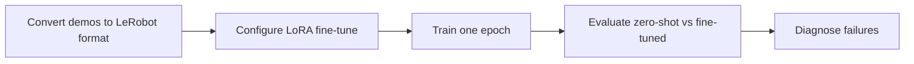
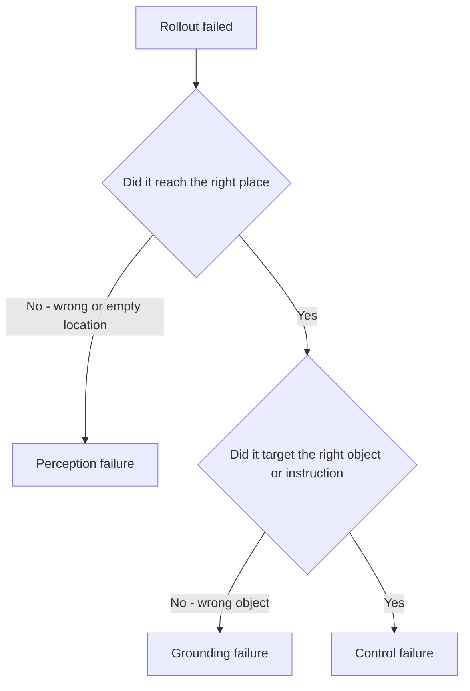

# Lecture 2 — Fine-Tuning OpenVLA with LoRA, the LeRobot Format, and Honest Evaluation

> **Duration:** ~2 hours of reading + hands-on.
> **Outcome:** You can convert your Week 29 demos into the LeRobot format, launch a LoRA fine-tune of OpenVLA on a cloud GPU, get the un-normalization right, and run a zero-shot-vs-fine-tuned A/B that produces a number you can defend.

Lecture 1 gave you the architectures. This lecture is the part you'll actually be judged on at the Week 32 midterm: **taking a pretrained generalist and making it work on your task, then proving it with a held-out evaluation.** Three parts: (1) the LeRobot dataset format, (2) LoRA fine-tuning and the un-normalization trap, (3) the honest-evaluation discipline.

A framing to keep in mind throughout: **the architecture (Lecture 1) is the easy part; the engineering in this lecture is where VLA projects succeed or fail.** Most "the model doesn't work" outcomes trace not to OpenVLA's design but to a mishandled action convention, wrong normalization stats, a leaky eval set, or a misread failure mode — all things this lecture teaches you to get right. If Lecture 1 was "how the engine works," this is "how to drive it without crashing." The discipline here — honor the action space, register the right stats, hold out the eval, classify failures honestly — is the difference between a demo and a deployable policy, and it is exactly what a Week-32 panel probes.

---

## Part 0 — The five-step map of this lecture

Before diving in, here is the whole workflow this lecture builds, so each part has a place to land:

1. **Convert** your Week 29 demos to the LeRobot format, with actions in the EE-delta convention and stats computed (Part 1).
2. **Configure** a LoRA fine-tune — rank, learning rate, image augmentation, and the all-important normalization stats (Part 2).
3. **Train** for one epoch on a cloud GPU, watching action-token accuracy climb (Part 2).
4. **Evaluate** zero-shot vs. fine-tuned on a held-out set, reporting the honest number (Part 3).
5. **Diagnose** every failure into perception / grounding / control, ruling out the pipeline bugs first (Part 3).


*The five-step workflow this lecture builds, start to finish.*

Steps 1–3 are "make it work"; steps 4–5 are "prove it works and understand where it doesn't." The grading weight at the Week-32 midterm is on 4–5 — anyone can run a training script, but a senior engineer produces the honest A/B and the failure analysis. Keep the map in view; everything below fills it in.

## Part 1 — The LeRobot dataset format

### 1.1 Why a standard format matters

Your Week 29 demos are probably a pile of `.npz` or rosbag files with whatever keys you happened to choose. That worked for training your own Diffusion Policy because *you* wrote both the collector and the trainer. It does not work for fine-tuning OpenVLA, whose training code expects a specific schema. The robot-learning community converged, by 2026, on **LeRobot** — HuggingFace's Apache-2.0 library — as the lingua franca. Converting your data into a `LeRobotDataset` once means you can fine-tune OpenVLA, Octo, π0-style models, and your own policies from the same on-disk artifact, and share it on the HuggingFace Hub. This is the robot-learning analogue of "everyone agreed on `geometry_msgs/PoseStamped`" from Week 5: a shared interface that makes tools compose.

### 1.2 The schema

A `LeRobotDataset` is organized as **episodes** (one demonstration each) made of **frames** (one timestep each). Conceptually each frame is a dict of named tensors:

```
frame = {
    "observation.images.<camera_name>": uint8 image  HxWx3,   # one key per camera
    "observation.state":               float32 [state_dim],   # proprioception
    "action":                          float32 [action_dim],  # the EE-delta (7) you'll feed OpenVLA
    "timestamp":                       float32,
    "frame_index":                     int64,
    "episode_index":                   int64,
    "task":                            str,                    # the language instruction
}
```

Two pieces of metadata are critical:

- **`meta/info.json`** — declares the features (keys, dtypes, shapes), the fps, and the camera names. Get a shape wrong here and training fails loudly (good) or silently mis-feeds (bad).
- **`meta/stats.json`** — the **per-feature statistics**: mean, std, min, max, and the percentiles. **This is where the action-normalization stats that OpenVLA needs come from.** When you convert your data, LeRobot computes these. When you fine-tune, OpenVLA reads them to set up the 256-bin action tokenizer and to un-normalize at inference. If your stats are wrong or missing, your actions are wrong. (See Part 2.4.)

### 1.3 Converting your Week 29 data

The conversion is mechanical and you do it in Exercise 3. The shape of it (full runnable code is in the exercise):

```python
from lerobot.common.datasets.lerobot_dataset import LeRobotDataset

# Create an empty dataset declaring your features.
ds = LeRobotDataset.create(
    repo_id="crunch/week29_pick_red_cube",
    fps=10,
    features={
        "observation.images.wrist": {"dtype": "video", "shape": (256, 256, 3),
                                      "names": ["height", "width", "channel"]},
        "observation.state": {"dtype": "float32", "shape": (7,), "names": ["state"]},
        "action": {"dtype": "float32", "shape": (7,), "names": ["action"]},
    },
)

# For each demonstration, add frames then save the episode.
for demo in week29_demos:                       # your collected trajectories
    for t in range(len(demo)):
        ds.add_frame({
            "observation.images.wrist": demo.images[t],     # HxWx3 uint8
            "observation.state": demo.state[t].astype("float32"),
            "action": demo.action[t].astype("float32"),     # 7-D EE-delta
            "task": "pick up the red cube",                 # the instruction
        })
    ds.save_episode()

ds.consolidate()    # computes meta/stats.json — the normalization stats. Do not skip.
```

The single most important line is `ds.consolidate()` (or the equivalent stats-computation step in your LeRobot version): it computes `meta/stats.json`. Skip it and your action normalization is undefined.

> **The action-space gotcha, restated for emphasis:** your Week 29 actions must be in the **EE-delta convention** OpenVLA expects — a 6-DOF end-effector pose *delta* plus a gripper command, in a consistent frame and consistent units. If you collected *absolute* poses or *joint* commands, you must convert them to deltas before this step, or OpenVLA will learn nonsense. This conversion is the boring, load-bearing work of VLA fine-tuning, and skipping it is why most first attempts fail. Lecture 1 Part 1.2 told you the action space; here is where you must honor it.

### 1.4 What a `LeRobotDataset` looks like on disk

It demystifies the format to see the directory it produces. After `create` + `add_frame` loops + `consolidate`, you have roughly:

```
crunch_week29_pick_red_cube/
├── meta/
│   ├── info.json          # features, fps, camera names, dtypes/shapes
│   ├── stats.json         # PER-FEATURE mean/std/min/max/percentiles  <-- OpenVLA reads this
│   ├── episodes.jsonl     # one line per episode (length, task, index)
│   └── tasks.jsonl        # the language instructions, indexed
├── data/
│   └── chunk-000/
│       ├── episode_000000.parquet   # the per-frame state/action tensors
│       └── episode_000001.parquet
└── videos/
    └── chunk-000/
        └── observation.images.wrist/
            ├── episode_000000.mp4    # images stored as video for compactness
            └── episode_000001.mp4
```

Two things to notice. First, **images are stored as video** (`.mp4`), not as a pile of PNGs — LeRobot decodes frames on the fly during training, which keeps a 200-trajectory dataset to a sane size. Second, **`meta/stats.json` is the single file OpenVLA's fine-tuner cares most about** — it is where your action `q01/q99` percentiles live, and it is the artifact that the un-normalization trap (Part 2.4) is all about. If you ever debug "my fine-tune produces wrong-scale actions," open `meta/stats.json` first and check the `action` percentiles are sane for your task.

### 1.5 Mixing in OXE data (optional, but worth knowing)

A subtlety that comes up in real fine-tunes: you can **co-train** on your data *plus* a slice of OXE, rather than your data alone. The intuition is regularization — a few hundred of your demos can overfit a 7B model, and mixing in OXE keeps the broad prior from collapsing toward your narrow task. LeRobot and the OpenVLA training code support weighted dataset mixtures for exactly this. For a one-week lab, fine-tuning on your data alone is fine and simpler; for a production fine-tune where you have few demos, a small OXE co-training weight is a cheap robustness win. File it away — it is the kind of detail that separates "I followed the tutorial" from "I understand the failure mode the tutorial was avoiding."

---

## Part 2 — LoRA fine-tuning and the un-normalization trap

### 2.1 Why fine-tune at all (and why LoRA)

Lecture 1 settled *why* you fine-tune: zero-shot transfer to your gripper/camera/objects is weak. *How* is the question now. Full fine-tuning of a 7B model updates all 7B parameters and needs a lot of VRAM (multiple A100-80GB or sharding) — out of scope for a one-week lab and a $25 budget. **LoRA (Low-Rank Adaptation)** is the answer: freeze the 7B base weights, and for selected weight matrices `W` learn a small low-rank update `ΔW = B·A` where `A` is `r×k` and `B` is `d×r` with `r` tiny (8–32). You train only `A` and `B` — a few million parameters instead of 7 billion — so it fits in ~16–24 GB and trains in tens of minutes to a couple of hours on one GPU. At inference you either keep the adapters separate or merge `ΔW` back into `W`.

### 2.2 The hyperparameters that actually matter

```python
from peft import LoraConfig, get_peft_model

lora_config = LoraConfig(
    r=32,                       # rank. 16-32 is the sweet spot for OpenVLA fine-tunes.
    lora_alpha=32,              # scaling; commonly set == r or 2*r.
    lora_dropout=0.0,
    target_modules="all-linear",# apply LoRA to all linear layers of the LLM (OpenVLA's recipe)
    init_lora_weights="gaussian",
)
model = get_peft_model(base_openvla, lora_config)
model.print_trainable_parameters()   # sanity: ~millions trainable, ~7B frozen
```

The knobs, ranked by how much they matter:

1. **Action un-normalization stats (`unnorm_key`)** — *not a LoRA knob, but the #1 determinant of whether your fine-tune works.* See 2.4. Get this wrong and nothing else matters.
2. **Learning rate** — OpenVLA LoRA fine-tunes typically use a small LR (on the order of `1e-4` to `5e-4` for the adapters). Too high and the LLM prior is destroyed (catastrophic forgetting of grounding); too low and it never adapts. Start where the OpenVLA repo's fine-tune script defaults and adjust by watching action-token accuracy.
3. **Rank `r`** — 16–32. Higher rank = more capacity to adapt = more data needed and more overfit risk. For 50–150 demos, 32 is a reasonable default.
4. **Batch size** — bounded by VRAM. Use gradient accumulation to reach an effective batch of 16–32 if a single GPU only fits 1–4. The effective batch matters more than the per-step batch.
5. **Image augmentation** — random crop/resize, color jitter, brightness. This is your *cheapest* sim-to-real and robustness win and it directly previews Week 34's domain randomization. Augment the images; do **not** augment the actions.
6. **Epochs** — the syllabus lab is **one epoch** for cost reasons, and one epoch on 100+ demos is often enough to go from ~30% to ~80%. More epochs help until they overfit; watch the held-out eval, not the train loss.

A note on **image augmentation** (knob 5), because it is underrated and it is your bridge to next week. Random crops, resizes, color jitter, and brightness shifts on the input images make the policy robust to camera-pose jitter and lighting changes *for free* — you are showing the model many slightly-different views of each demo. This is *exactly* domain randomization (Week 34), applied to the fine-tune images. It costs nothing (it's a data transform), it directly reduces the visual sim-to-real gap, and it is the single cheapest robustness win in the fine-tune. The one rule: augment the **images**, never the **actions** — a jittered image with the same correct action teaches invariance; a jittered action teaches the model to be wrong.

### 2.3 The fine-tune loop, conceptually

OpenVLA fine-tuning is **supervised next-token prediction on action tokens.** For each (image, instruction, action) sample: tokenize the action into 7 target tokens (Part 3.3 of Lecture 1), build the prompt, run the model, and apply cross-entropy loss on the 7 action-token positions only (the prompt tokens are masked out of the loss). The metric you watch is **action-token accuracy** — the fraction of the 7 predicted tokens that match the ground-truth bin — and the L1 distance between predicted and true continuous actions after de-tokenization. Loss going down is necessary but not sufficient; token accuracy ~95%+ and low L1 is the real signal.

```python
# Sketch of the per-step loss target (the OpenVLA training script does this for you):
# 1. action -> 7 bin indices -> 7 target token ids  (Lecture 1 Part 3.3)
# 2. prompt = "In: What action should the robot take to {instruction}?\nOut:"
# 3. logits = model(pixel_values=img, input_ids=prompt_ids + target_action_ids)
# 4. loss = cross_entropy(logits[action_positions], target_action_ids)   # only the 7 action tokens
```

You do not hand-write this loop; the OpenVLA repo's `finetune.py` (LoRA mode) does it. Your job is to point it at your LeRobot dataset, set the hyperparameters above, and **not break the un-normalization** — which brings us to the trap.

### 2.3.1 What LoRA actually changes (so the knobs make sense)

A 30-second mental model of LoRA, because the hyperparameters are meaningless without it. A linear layer computes `y = W x`, where `W` is a big frozen matrix (say `4096 × 4096`). LoRA leaves `W` untouched and adds a small detour:

```
y = W x  +  (B A) x
        └─ frozen ─┘   └ trainable, low-rank ┘

A: shape (r × 4096)      B: shape (4096 × r)      r = rank, e.g. 32
```

`A` and `B` are tiny (with `r = 32`, together ~262k parameters versus the 16.7M in `W`). You train only `A` and `B`; their product `BA` is a *low-rank update* to `W`. The intuition: adapting a pretrained model to a new task usually requires only a *low-rank* change to its weights, so you can capture the adaptation in a few thousand parameters per layer instead of millions. Now the knobs read naturally:

- **`r` (rank)** is the dimensionality of the detour — higher `r` = more expressive adaptation = more parameters, more data needed, more overfit risk.
- **`lora_alpha`** scales the detour's contribution (`y = Wx + (alpha/r)·BAx` in many implementations) — it trades off how strongly the adaptation overrides the base.
- **`target_modules="all-linear"`** applies the detour to every linear layer of the LLM, which is OpenVLA's recipe — adapt the whole transformer, cheaply.

At inference you can either keep `BA` as a separate add-on (so you can swap adapters) or *merge* it into `W` (one matrix, no overhead). The `VLAPolicy` in the mini-project keeps it separate so the same base model serves zero-shot (no adapter) and fine-tuned (adapter attached) through one interface.

### 2.4 The un-normalization trap (read this twice)

OpenVLA's action tokenizer is built from **per-dimension percentile statistics of the training actions.** The pretrained model ships with stats for the OXE datasets it was trained on, keyed by an `unnorm_key` (e.g., `bridge_orig`). When you fine-tune on *your* data, two things must happen:

1. **The tokenizer must bin against *your* action distribution.** If your "pick the cube" task moves the EE by at most ±4 cm but the pretraining `unnorm_key` was tuned for a task with ±20 cm motions, your fine actions all fall into the middle few bins — quantized to mush — unless the tokenizer uses *your* `meta/stats.json` percentiles.
2. **At inference, you must un-normalize with the *same* stats you binned with.** If you fine-tune with your stats but un-normalize at inference with the default OXE stats (the classic copy-paste error: leaving `unnorm_key="bridge_orig"` in the inference call), the model emits correct *bin indices* that get mapped back to the *wrong real-world scale.* Symptom: the robot moves in the right *direction* but the wrong *magnitude* — twitching when it should reach, or lunging when it should nudge. Nothing errors. It is the Week 5 silent-failure lesson, reincarnated in action space.

> **The rule:** the normalization stats used to (a) build the tokenizer at fine-tune time and (b) un-normalize at inference time **must be the same, and must be your dataset's stats.** Register your dataset's stats under a named `unnorm_key`, pass that key to both fine-tuning and `predict_action`, and verify by de-tokenizing one known action and checking it round-trips to the right real units. Exercise 2 makes you do exactly this round-trip so the failure is impossible to ship.

### 2.5 Launching the cloud run

The lab is one epoch on one GPU. The shape:

```bash
# On the rented GPU box, after installing openvla + lerobot:
torchrun --standalone --nproc-per-node 1 vla-scripts/finetune.py \
  --vla_path openvla/openvla-7b \
  --data_root_dir /data/lerobot \
  --dataset_name crunch_week29_pick_red_cube \
  --use_lora True --lora_rank 32 \
  --batch_size 8 --grad_accumulation_steps 4 \
  --learning_rate 5e-4 \
  --image_aug True \
  --save_steps 500 --max_steps 2000 \
  --run_root_dir /runs --adapter_tmp_dir /runs/adapters
```

(The exact flags track the OpenVLA repo; check its `finetune.md`.) Watch VRAM with `nvtop` — OOM on the first step is the most common failure; drop `batch_size` and raise `grad_accumulation_steps` to keep the effective batch. Watch the action-token accuracy climb in `wandb`. Stop when it plateaus or you hit your budget.

---

## Part 3 — Honest evaluation

This is the part that separates a result from a demo, and it is exactly what the Week 32 midterm grades.

### 3.1 The eval set must be *held out*

You cannot evaluate on the demos you fine-tuned on — the model has memorized them. Carve out, *before* training, an evaluation protocol the model has never seen:

- **Held-out positions.** Same object, same instruction, but starting positions you didn't demonstrate. Tests generalization within the task.
- **Held-out objects / distractors.** Add a distractor object, or change the target's exact instance, to test grounding.
- **Held-out instructions (phrasing).** "pick up the red cube" → "grab the red block." Tests language robustness — and is where the 7B prior should shine over a specialist.

A subtlety worth stating because it bites people: a held-out *position* is easy to guarantee (just sample start poses you didn't demonstrate), but a held-out *instruction phrasing* is only meaningful if your fine-tune data didn't already contain that phrasing. If you trained on a mix of "pick up the red cube" and "grab the red block," then evaluating on "grab the red block" is *not* held out — you trained on it. The discipline is to **decide the eval phrasings before you decide the training phrasings**, and keep them disjoint. The same logic applies to objects: a "held-out object" the model saw in three training demos is not held out. Train/eval separation is a property you *design in*, not one you hope for.

Fix the number of trials per condition *before* you run (e.g., 40), so success is a fraction with an honest denominator. The "honest number" promise from the README is this discipline made concrete.

### 3.2 The zero-shot vs. fine-tuned A/B

Run the **same** eval protocol twice: once on `openvla-7b` zero-shot (no adapter), once on your fine-tuned checkpoint. Report both, and report the **gap closed**:

```
=== VLA EVAL: pick_red_cube (held-out positions, n=40) ===
zero-shot openvla-7b        success: 11/40  (27.5%)
fine-tuned (LoRA, 1 epoch)  success: 33/40  (82.5%)
gap closed: +55.0 pts
```

The zero-shot number is not a throwaway — it quantifies *how much the pretraining gave you for free*, and a suspiciously high zero-shot number usually means your eval is too easy or your camera happens to match the training distribution. A suspiciously high *fine-tuned* number on a tiny eval (n=5) means your denominator is too small to trust. Senior reviewers attack the denominator first.

### 3.3 The failure taxonomy

"It failed 7 times" is useless. *How* it failed tells you what to fix. Classify every failure into one of three buckets:

| Failure class | What it looks like | Likely fix |
|---|---|---|
| **Perception** | The arm goes to the wrong place / empty space; it never "saw" the object (occluded, out of frame, bad lighting). | More/better camera coverage; image augmentation; fix camera framing to match training distribution. |
| **Grounding** | It saw the object but did the wrong *thing* — picked the blue one when told red, ignored "leftmost." A language↔scene mapping error. | More diverse instructions in fine-tune data; this is where the 7B prior helps and where a specialist can't. |
| **Control** | Right intent, right target, but the trajectory was bad — collided, missed the grasp by a centimeter, dropped it. | Often the **un-normalization** (Part 2.4!) or the EE-delta→IK mapping; sometimes more demos of the approach. |

A huge fraction of "control" failures on a fine-tuned VLA trace back to un-normalization or the EE-delta→joint mapping — *not* the policy. Always check those before you conclude "the model can't grasp." The failure taxonomy is the headline deliverable of this week's homework and the spine of the mini-project.


*How to classify a failed rollout into perception, grounding, or control.*

### 3.3.1 A worked classification

Suppose your fine-tuned policy fails 9 of 40 trials on the held-out-positions condition. You watch the 9 rollouts and log what happened:

| Trial | What you saw | Class |
|---|---|---|
| 3 | Arm reached the empty left side; cube was on the right, dim lighting | Perception |
| 7 | Reached the blue distractor instead of the red cube | Grounding |
| 12 | Approached the red cube correctly, closed gripper 2 cm short | Control |
| 18 | Reached empty space; cube partly out of frame | Perception |
| 21 | Picked red cube but then released it mid-lift | Control |
| 25 | Went to the *bowl* (an unrelated object) on "pick the cube" | Grounding |
| 29 | Correct approach, but lunged past the cube and knocked it | Control |
| 33 | Reached the blue cube again | Grounding |
| 37 | Correct target, grasp missed low by ~1 cm | Control |

Tally: **perception 2, grounding 3, control 4.** Now the diagnosis writes itself. The four control failures all share a flavor (short, past, low — *magnitude* errors), which is the classic un-normalization signature — so before blaming the policy, you round-trip a known action through the deployed stats (Exercise 2) and discover, say, your `unnorm_key` was slightly off. Fix that and three of the four control failures likely vanish. The three grounding failures (blue-instead-of-red, bowl-instead-of-cube) point at fine-tune data with too few instruction paraphrases — the next data-collection round adds variety. The two perception failures point at framing/lighting. **That** is a failure analysis: nine failures became three concrete, prioritized fixes. "It failed 9 times, needs work" became "fix the un-norm key (4), add instruction variety (3), improve framing (2)."

### 3.3.2 The fine-tune mistakes checklist

When a fine-tune disappoints, walk this list *in order* before touching hyperparameters — most "the model is bad" conclusions die here:

1. **Un-normalization key.** Are train-time and inference-time stats the same, and are they *your* dataset's? (Round-trip a known action.)
2. **Action convention.** Are your actions actually EE-deltas in a consistent frame/units, not absolute poses or joint commands?
3. **Camera framing.** Does the eval camera match the demo camera? A shifted view is out-of-distribution.
4. **Stats freshness.** Did `consolidate()` actually run, so `meta/stats.json` reflects your data and not a stale copy?
5. **Train/eval leakage.** Are eval start states genuinely held out from training?
6. **Then, and only then,** hyperparameters: learning rate too high (forgetting), rank too low (under-adapting), too few steps.

Five of the six are *pipeline* checks, not model checks. That ratio is the whole lesson of VLA debugging: the model is usually fine; the plumbing around it is usually the bug.

### 3.4 When *not* to use a VLA

The honest senior conclusion you must be able to state: **if your task is fixed and narrow and you can collect 100+ demos, last week's ACT or Diffusion Policy will likely beat a fine-tuned 7B VLA on success rate, latency, and cost.** The VLA earns its keep when (a) you need language conditioning (many instructions, the capstone's eval suite), (b) you benefit from the web/visual prior (rare or varied objects), or (c) you want one model for many tasks. Choosing the generalist when a specialist would do is a classic over-engineering tell, and a reviewer at the Week 32 midterm will ask you to justify the choice. "It's a foundation model" is not a justification; "I need twenty different language instructions to work" is.

### 3.5 Confidence intervals: the denominator question, answered properly

A reviewer's reflexive first question about any success rate is "what's the confidence interval?" — and "82.5% on n=40" without one is an incomplete answer. The fix is cheap: report a **binomial confidence interval** alongside every rate. The Wilson score interval is the right tool (it behaves well at small `n` and near 0% or 100%, where the naive `p ± 1.96·sqrt(p(1-p)/n)` interval breaks). For 33/40 it gives roughly `[68%, 92%]`; for 84/100, roughly `[76%, 90%]`. Two consequences you must internalize:

- **Small evals have huge intervals.** "4/5 = 80%" has a 95% interval of roughly `[38%, 96%]` — basically uninformative. This is *why* a tiny eval is a coincidence, not a result: the interval is wider than the claim.
- **Gap claims need their own interval.** A +55-point gap between two `n=40` evals is real if the intervals barely overlap; if they overlap heavily, your gap is within noise and you need more trials. The mini-project reports these intervals automatically (the Exercise-3 / Week-34 gap code does the Wilson math); use it so your numbers come pre-armed against the denominator question.

Reporting the rate *and* its interval is the difference between "I measured 82.5%" and "I measured 82.5% (95% CI [68, 92], n=40)" — only the second survives a panel.

---

## 4. Recap

You should now be able to:

- Convert your Week 29 demos into a `LeRobotDataset`, declaring features and computing `meta/stats.json`, with actions in the EE-delta convention.
- Configure and launch a LoRA fine-tune of OpenVLA-7B on one cloud GPU, naming the hyperparameters that matter and why.
- Explain and avoid the un-normalization trap — the same stats must build the tokenizer and un-normalize at inference, and they must be *your* dataset's stats.
- Design a held-out eval protocol, run the zero-shot-vs-fine-tuned A/B, and report an honest number with a defensible denominator.
- Explain what LoRA changes (a low-rank detour `BA` added to frozen `W`) and read the `r`/`alpha`/`target_modules` knobs in that light.
- Read a `LeRobotDataset` on disk and find the action `q01/q99` in `meta/stats.json`.
- Classify failures into perception / grounding / control and prescribe the right fix for each.
- Walk the six-step fine-tune-mistakes checklist (five pipeline checks, one model check) before blaming the model.
- Report a success rate with a Wilson confidence interval so it survives the denominator question.
- State when a generalist VLA is the wrong tool and a Week-30 specialist is right.

The through-line of both lectures: a generalist policy is a powerful, *fine-tunable* prior, and the engineering that makes it work is unglamorous — honoring the action convention, getting the normalization stats right, holding out the eval set, and classifying failures honestly. The architecture is the easy part; the discipline is the job. That discipline is exactly what you carry into the Week 32 midterm and, eventually, the capstone.

Next: the exercises put this on your own data and your own checkpoint. Continue to [the exercises](../exercises/README.md).

---

## References

- *OpenVLA fine-tuning (LoRA) guide*: <https://github.com/openvla/openvla#fine-tuning-openvla-via-lora>
- *LoRA: Low-Rank Adaptation* — Hu et al., 2021: <https://arxiv.org/abs/2106.09685>
- *PEFT library*: <https://huggingface.co/docs/peft/index>
- *LeRobot dataset format*: <https://huggingface.co/docs/lerobot/index>
- *Open X-Embodiment (normalization & action conventions)*: <https://arxiv.org/abs/2310.08864>
- *OpenVLA-OFT (continuous actions, parallel decoding)*: <https://arxiv.org/abs/2502.19645>
