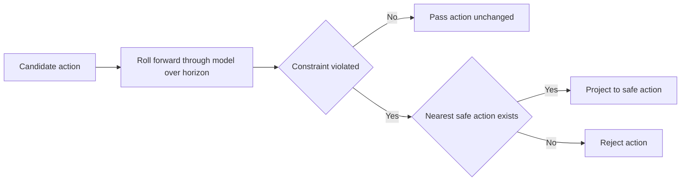
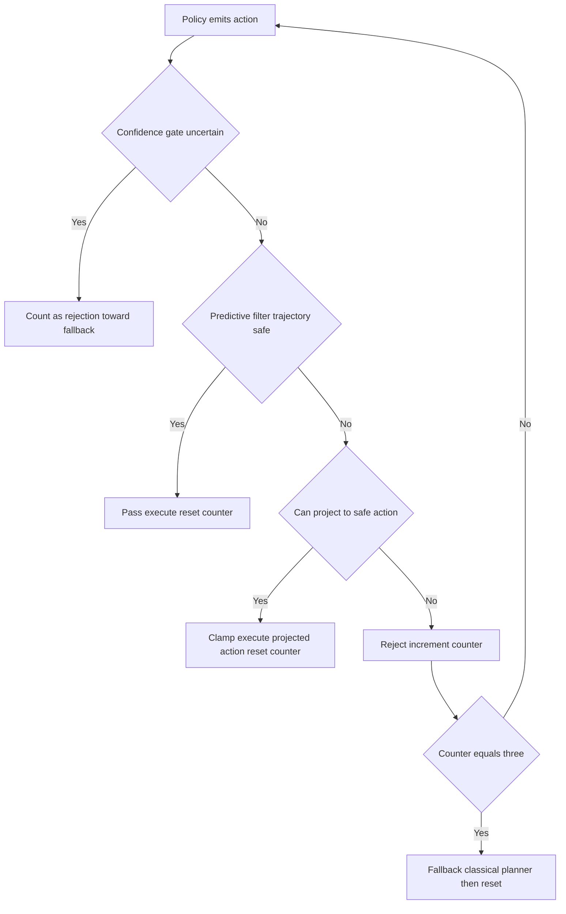

# Lecture 2 — Predictive Safety Filters, the Intervention Rate, and the Midterm Defense

> **Reading time:** ~80 minutes. **Hands-on time:** ~70 minutes (you build the roll-forward filter from Exercise 2, instrument the intervention meter from Exercise 3, and add the learned-policy hazards to your Week-24 log).
> **Outcome:** You can implement a predictive safety filter that projects-or-rejects a learned action, measure the intervention rate and its breakdown, update the hazard log for learned controllers, and defend the whole stack at the second-midterm review.

Lecture 1 gave you the architecture: the policy proposes, the scaffold disposes, the fallback finishes. The scaffold there was *reactive* — clamps and state guards that look at one action or one predicted state. This lecture builds the *predictive* core of the filter (the part that rolls an action forward and decides project-or-reject), develops the measurement that proves the leash works, and walks you into the second-midterm review where you defend all of it.

---

## 1. The predictive safety filter: roll forward, then project or reject

A reactive clamp asks "is this action in-bounds?" A predictive filter asks the better question: "if I execute this action, where does it lead, and is *that* safe?" The difference is the horizon. An action that is in-bounds at `t=0` can drive the robot into a constraint at `t=0.5 s`; only by simulating it forward do you catch that.

The predictive filter has three steps:

1. **Roll forward.** Apply the candidate action to a *model* of the robot (a kinematic or dynamic model — the same models you used for MPC in Week 22) and predict the state trajectory over a short horizon `H` (a few control steps; for an arm action chunk, the chunk length).
2. **Evaluate the constraint set** over the *predicted* trajectory: velocity, acceleration, joint limits, workspace bounds, keep-out volumes, self-collision. A constraint is violated if *any* predicted state along the horizon violates it.
3. **Project or reject.** If the predicted trajectory is safe, pass the action through. If not, find the *nearest safe action* (project) if one exists within a tolerance; otherwise *reject* and let the action count toward the three-strike fallback.


*The predictive filter rolls a candidate action forward, then passes, projects, or rejects it based on the horizon check.*

This is the **MPC-shield** pattern in its simplest form. Here is the core, the version Exercise 2 makes you build out:

```python
def predictive_filter(action, state, model, constraints, horizon, project_tol):
    """Roll `action` forward through `model`; if the predicted trajectory is
    safe, pass it; if it can be projected to a nearby safe action, do so;
    otherwise reject. Returns (filtered_action, verdict)."""
    traj = roll_forward(state, action, model, horizon)
    violation = first_violation(traj, constraints)   # None if safe
    if violation is None:
        return action, "PASS"

    # Try to project: search for the nearest action (by L2) whose rollout is safe.
    safe_action = project_to_safe(action, state, model, constraints,
                                  horizon, max_dist=project_tol)
    if safe_action is not None:
        return safe_action, f"CLAMP({violation.name})"

    # No safe action within tolerance of what the policy wanted: reject.
    return None, f"REJECT({violation.name})"
```

Read the three returns. `PASS` is the common case — the policy's action is safe, execute it unchanged. `CLAMP(...)` is the projection — the action grazed a constraint and we found a nearby safe one (this is the *optimal* version of the uniform-rescale clamp from Lecture 1 §4; rescaling is a cheap special case of projection). `REJECT(...)` is the action that's so far from feasible that no nearby projection saves it — that's the OOD-action defect caught by its consequences, and it counts toward the fallback.

### 1.1 The control-barrier-function formulation

The principled version of "project to the nearest safe action" is a **control barrier function (CBF)**. Define a function `h(x)` that is positive when the state is safe and zero at the constraint boundary (e.g., `h(x) = distance_to_keepout(x)`). The CBF condition says: choose an action that keeps `h` from decreasing too fast:

```
ḣ(x, u) ≥ -α · h(x)        (α > 0; the "barrier" gets steeper near the boundary)
```

The safety filter solves a small quadratic program: find the action `u` closest to the policy's action `u_policy` that satisfies the CBF condition (and the other constraints):

```
minimize    ‖u - u_policy‖²
subject to  ḣ(x, u) ≥ -α · h(x)        (the barrier)
            u_min ≤ u ≤ u_max          (the box constraints)
```

The solution is the *minimally-invasive* correction: the action closest to what the policy wanted that the barrier permits. When the QP is feasible, you get a projected (clamped) action; when it's infeasible, you reject. This is the `project_to_safe` above, made rigorous. You do not need the full QP for the mini-project — the roll-forward-and-check version suffices — but the CBF is the stretch goal and the thing a reviewer who knows control theory will ask about. Know that the QP gives you the *optimal* projection where the heuristic gives you a good-enough one.

### 1.2 The filter must be cheaper than the policy

A non-negotiable engineering constraint: **the filter's per-action latency must be a small fraction of the policy's inference latency.** If the Diffusion Policy infers a chunk in 31 ms and your filter takes 40 ms, you have *more than doubled* the control latency and the robot is sluggish and unsafe (a late safe action is its own hazard). The roll-forward over a short horizon with a cheap kinematic model is microseconds-to-low-milliseconds; the CBF QP is low-milliseconds with a warm-started solver. Measure it (`p50`, `p95`) and report it next to the policy time. A filter slower than its policy is a filter you cannot ship.

---

## 2. Measuring the intervention rate, in full

Lecture 1 §7 named the metric; here is how you measure each component and what each tells you.

### 2.1 The counters

Instrument the filter to count, per episode and in aggregate:

```python
@dataclass
class InterventionMeter:
    actions: int = 0            # total actions filtered
    clamp_velocity: int = 0     # clamped for velocity
    clamp_accel: int = 0        # clamped for acceleration
    clamp_workspace: int = 0    # clamped for workspace bound
    rejections: int = 0         # rejected outright (counts toward fallback)
    fallback_episodes: int = 0  # episodes where the fallback fired
    episodes: int = 0
    filter_latencies_ms: list = field(default_factory=list)

    def intervention_rate(self) -> float:
        """Fraction of EPISODES touched by the leash (a clamp, reject, or fallback)."""
        return self.fallback_episodes / max(self.episodes, 1)
```

Note the definition of *intervention rate*: the fraction of **episodes** the leash touched, not the fraction of *actions* clamped. An episode with two velocity clamps that still completed by the learned policy is "touched" but not "intervened" in the strong sense — the policy did the task. The strong intervention rate counts episodes where the *fallback fired*, because that's where the learned policy *failed* and the classical planner carried it. Report both: actions-clamped (a *training*-quality signal) and episodes-fell-back (a *deployment*-quality signal).

### 2.2 Reading the numbers

The breakdown is diagnostic, not just descriptive. Each pattern points at a different problem:

- **High velocity-clamp count, low rejections, low fallback.** The policy systematically commands slightly-over-speed actions, but they project fine and the task completes. This is a *training* artifact (the demos were faster than your deployment limit, or the action-space normalization is off). The wrapper is papering over it safely, but you should note it — re-normalize the action space or lower the demo speed and the clamps disappear.
- **High rejections concentrated on one subtask.** The policy is *stuck* off-distribution at, say, the grasp. The fallback fires there. This tells you exactly which demonstrations to collect more of — the grasp, not the approach. The intervention breakdown is a *data-collection roadmap*.
- **High fallback rate (> ~10–15% of episodes).** The policy is being carried by its classical planner. The success rate looks fine but the learned policy is barely contributing. This is the result you must report honestly at the midterm — a high success rate with a high fallback rate is a *weak* learned policy with a *strong* leash, and the panel will see through the success number if you don't disclose the fallback rate.
- **Zero interventions over many episodes.** Defect 4 (too-loose filter). The leash is decorative. See §3 — you must run the ablation to prove the filter would fire on an unsafe action, or your milestone is the worst kind of false pass.

### 2.3 The ablation: proving the leash is load-bearing

The single most convincing piece of evidence you can bring to the midterm is the **ablation**: disable the safety filter and re-run the episodes. Document the unsafe actions that now execute — the table-strikes, the over-speed twists, the through-the-joint-limit reaches — that the filter previously caught. This does two things:

1. It proves the filter is *not* too-loose (Defect 4): if disabling it causes visible unsafe behavior, the filter was doing real work.
2. It quantifies the *value* of the leash: "with the filter off, 3 of 40 episodes drove the gripper through the table; with it on, those 3 fell back to MoveIt2 and completed safely." That sentence is the strongest possible defense of the architecture.

Run the ablation in sim only, obviously — you are *deliberately* letting unsafe actions execute to measure them, which is exactly the kind of thing you only do where nothing can be hurt. The ablation is a homework problem and a stretch goal in the mini-project; bring its result to the review.

---

## 3. Updating the hazard log for learned controllers

Your Week-24 hazard log enumerated the failure modes of a *classical* stack: planner crash, controller runaway, sensor dropout, E-stop failure. A learned policy adds new hazards the classical log never had, and the second midterm requires you to add them. Each gets the same treatment: hazard, failure mode, effect, severity, the mitigation, and the owning artifact.

The new learned-policy hazards:

| Hazard | Failure mode | Effect | Mitigation | Owning artifact |
|---|---|---|---|---|
| **OOD action** | Policy emits a confident wrong action at an unseen state | Gripper through table; reach to wrong pose; over-speed base | Action clamps + state guards reject by consequence; fallback after 3 | `safety_filter` node; `/policy/filtered_action` |
| **Multimodal collapse** | Policy averages two good actions into one bad one | Arm drives into the obstacle it should have gone around | Sample-variance confidence gate rejects collapsed actions | `safety_filter` confidence gate |
| **Silent-confidence failure** | Policy is wrong but reports high confidence | Confidently-wrong action defeats the confidence gate | Hard physical bounds (clamps/CBF) catch it regardless of confidence | `safety_filter` predictive core |
| **Reward-hacked behavior** | RL policy exploits a sim artifact (Week 28) that doesn't transfer | Behavior that "works" in sim is unsafe or nonsensical on the real robot | Eval on held-out, randomized worlds; the fallback; the ablation | eval protocol; `safety_filter` |
| **Filter latency spike** | The filter occasionally takes longer than the policy | Late safe action; control loop jitter | Bound the filter horizon; measure p95; reject-fast on timeout | `safety_filter` latency budget |
| **Too-loose filter** | Bounds never trip; leash is decorative | No protection; false sense of safety | The ablation proves the filter fires; bounds tuned to the real envelope | the ablation; bound tuning |

This table is the **hazard-log update** the midterm rubric checks. Notice the structure mirrors the FMEA you'll formalize at Week 41: each hazard maps to a mitigation, and each mitigation cites the *node or topic that implements it*. A hazard with no mitigation is a finding the panel will catch. The "owning artifact" column is the bridge between the hazard log and the actual code — the same discipline as the Week-40 contract's "owning artifact" column, applied to safety.

> **The reward-hacking hazard deserves a sentence of its own**, because it is the one that surprises people. An RL policy (Week 28) optimizes the reward you wrote, not the behavior you wanted. If the sim has a quirk — a physics artifact, a reward shaping mistake — the policy will *find and exploit it*, producing a behavior that scores perfectly in sim and is unsafe or absurd in deployment. The mitigation is partly the safety filter (it catches the unsafe *action*) and partly the *eval protocol*: you evaluate on held-out, randomized worlds (the Week-34 domain-randomization eval) precisely so a reward-hacked behavior that only works in the training sim is exposed before deployment. This is the bridge to Phase 5: the leash protects against the *action*, randomized eval protects against the *behavior*, and you need both.

---

## 4. The second-midterm architecture review

The Week 32 milestone is graded twice: once as the mini-project (the wrapped policy, measured), once as the **second-midterm architecture review** — a live panel session where you defend the stack. This is a hard gate, like the Week-16 first midterm. Here is what the panel expects and how to defend each piece.

### 4.1 The five things you defend

The rubric has five required artifacts. The panel will ask about each:

1. **The training pipeline.** How you collected demonstrations (or set up the RL environment), trained the policy, and the data that went in. Expect: "How many demos? What's in them? How did you handle covariate shift?" Have your DAgger rounds, your dataset size, and your augmentation story ready.

2. **The eval protocol.** How you measure success, on what held-out set, with what success predicate. Expect: "What counts as a success? Is your eval set actually held out from training, or did you leak?" Have your success definition (task-complete, in time, no safety violation) and your train/eval split ready.

3. **The safety wrapper.** The filter — clamps, state guards, confidence gate, predictive core. Expect: "Show me an action getting rejected. What's the filter latency? Is it a CBF or a heuristic?" Run the wrapper *live* and let them watch a rejection. This is where the ablation result lands.

4. **The fallback path.** The classical planner and the three-rejection switch. Expect: "Show me the fallback firing. What does the BT do? Does the count reset?" Have Groot 2 open, force three rejections, watch the `ReactiveFallback` switch to MoveIt2.

5. **The hazard-log update.** The learned-policy hazards from §3. Expect: "What new hazard does the learned policy introduce that your classical stack didn't have, and how do you mitigate it?" The OOD-action and reward-hacking rows are the ones they'll probe.

### 4.2 The intervention rate is your headline number

When the panel asks "is your stack safe?", the answer is not "yes" — it's the intervention-rate breakdown. "Over 40 episodes: 92.5% success, the filter clamped 17 actions and rejected 22, the fallback fired on 3 episodes and completed all 3, the filter's p95 latency is 4.8 ms against a 31 ms policy, and with the filter ablated, 3 episodes drove unsafe actions the filter would have caught." That is a *defensible* answer — every claim is a number, every number has a method, and the ablation proves the leash is load-bearing. The learner who says "it felt safe, the demos all worked" fails the review not because the stack is bad but because they cannot *defend* it, and a stack you cannot defend is a stack you cannot ship.

### 4.3 Reading the rubric like a contract

The midterm rubric is a contract (the same reading discipline you'll formalize at Week 40 Lecture 1). It says "defend the training pipeline, the eval protocol, the safety wrapper, the fallback path, and the hazard log." Five artifacts; all five are necessary; there is no partial credit for four of five at the gate, the same way the capstone gate is a biconditional. If your hazard log is missing the reward-hacking row, that is a finding — better you find it rehearsing the challenge this week than the panel finds it live. The challenge (`challenge-01-defend-the-stack.md`) is a *dry run* of this exact review, against this exact rubric, with a peer panel. Do it. The skill — defending an architecture you built to someone who will not extend you the benefit of the doubt — is the skill the review grades, and it is the skill that gets you hired.

---

## 5. The decision tree: filter verdict to system action

When an action arrives at the filter, walk this tree — it ties the whole lecture together:

```
Learned policy emits action u_policy.
│
├─ Confidence gate: is the policy uncertain (high sample variance / OOD)?
│   ├─ Yes  → treat as a rejection (count toward fallback). Don't execute a guess.
│   └─ No  ↓
│
├─ Predictive filter: roll u_policy forward; is the predicted trajectory safe?
│   ├─ Yes  → PASS. Execute u_policy. Reset rejection counter.
│   └─ No  ↓
│
├─ Can we project to a nearby safe action (within tolerance)?
│   ├─ Yes  → CLAMP. Execute the projected action. Increment the clamp counter.
│   │        (Reset rejection counter — we found a safe action.)
│   └─ No  ↓
│
├─ REJECT. Increment rejection counter. Do NOT execute.
│   │
│   └─ Is the rejection counter == 3 (three in a row)?
│       ├─ No  → re-query the policy at the next tick.
│       └─ Yes → FALLBACK. BT switches to the classical planner.
│                Reset the rejection counter after the fallback completes.
```


*Every action's path from the confidence gate through the predictive filter to a pass, clamp, reject, or fallback.*

Tape this next to the four-defect list from Lecture 1. Between them you can reason about any action the filter sees: which guard catches it, what the system does, and how it counts toward the leash. The clamp resets the counter (a safe action was found); the reject increments it; three rejections fire the fallback. That is the entire control flow of the leash, and it is the thing you draw on the whiteboard when the midterm panel asks "walk me through what happens when the policy emits a bad action."

---

## 6. Recap

You should now be able to:

- Build a **predictive safety filter** that rolls a candidate action forward through a model, evaluates the constraint set over the horizon, and **projects-or-rejects** — and explain the **CBF** formulation as the optimal version of the projection.
- Enforce that the **filter is cheaper than the policy** it wraps, and measure `p50`/`p95` filter latency against policy inference time.
- Measure the **intervention rate** and its breakdown (clamps by constraint, rejections, fallback-episode rate, latency) and *read* the breakdown as a diagnosis of where the policy is weak.
- Run the **ablation** to prove the leash is load-bearing and quantify its value — the single most convincing evidence for the panel.
- **Update the hazard log** with the learned-policy hazards — OOD action, multimodal collapse, silent confidence, reward hacking, filter latency, too-loose filter — each mapped to a mitigation and an owning artifact.
- **Defend the stack** at the second-midterm review: the five artifacts, the intervention-rate headline, and the rubric read as a contract.

Next: the exercises build the constraint set, the predictive filter, and the intervention meter; the challenge is a dry run of the midterm defense; the mini-project is the wrapped policy you defend. Continue to [the exercises](../exercises/README.md).

---

## References

- *Safe Learning in Robotics (Brunke et al.)* — safety filters and safe RL, the survey: <https://arxiv.org/abs/2108.06266>
- *Control Barrier Functions (Ames et al.)* — the CBF QP your projection formalizes: <https://arxiv.org/abs/1903.11199>
- *Predictive Safety Filters / MPC-shielding (Wabersich & Zeilinger)* — the roll-forward-and-project filter: <https://arxiv.org/abs/2102.07472>
- *Reward hacking / specification gaming* — DeepMind's catalog of RL specification-gaming examples: <https://deepmind.google/discover/blog/specification-gaming-the-flip-side-of-ai-ingenuity/>
- *Google SRE Book — Postmortem Culture* (the hazard-log/postmortem discipline): <https://sre.google/sre-book/postmortem-culture/>
- *MIL-STD-1629A — FMEA procedure* (severity × occurrence × detectability → RPN): search "MIL-STD-1629A FMEA"
- *BehaviorTree.CPP — control and decorator nodes* (the fallback switch): <https://www.behaviortree.dev/docs/nodes-library/control-nodes/>
- C24 Week 24 — the safety primer and the original hazard log; Week 28 — the reward-hacking problem.
