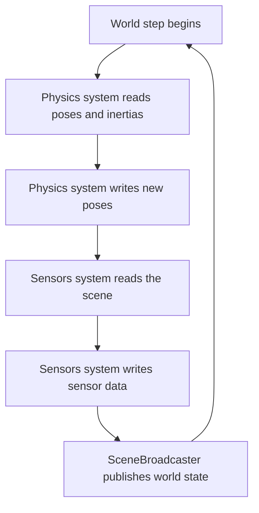
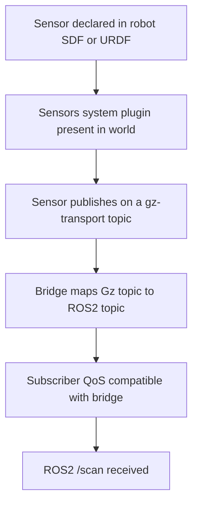

# Lecture 1 — Gazebo, Gz Sim, and the Physics Engines Underneath

> **Duration:** ~2 hours of reading + hands-on.
> **Outcome:** You can explain why "Gazebo" means Gz Sim in 2026, name the five physics engines and what each is for, swap the engine under your own robot, and read an SDF + `ros_gz` bridge well enough to know what each line does.

If you remember one sentence from this entire week, remember this one:

> **A simulator is two things bolted together — a physics engine that decides how bodies move and collide, and a renderer that decides how sensors see — and "choosing a simulator" is really choosing a point on the throughput-vs-fidelity curve for the job at hand.**

You have used Gz Sim all course as a fixed backdrop. This lecture cracks it open: the Gazebo lineage, the physics engine that is actually computing your robot's motion (and how to change it), and the SDF + bridge plumbing you've been relying on without inspecting. Lecture 2 does the same for Isaac Sim and then builds the comparison framework.

Three parts: (1) Gazebo Classic vs. Gz Sim, (2) the physics-engine landscape, (3) SDF, plugins, and the `ros_gz` bridge.

---

## Part 1 — Gazebo Classic vs. Gz Sim: a rename *and* a rewrite

### 1.1 The lineage, untangled

The naming history has confused a generation of roboticists, so let's fix it once:

- **Gazebo Classic** (`gazebo`, versions 1–11) — the original simulator, the one in every tutorial from 2012–2021. It is **end-of-life**: Gazebo Classic 11 reached EOL in January 2025. New projects should not start here.
- **Ignition Gazebo** — a from-scratch rewrite, briefly branded "Ignition." It was **renamed to "Gz Sim"** (and the whole suite to "Gz") to resolve a trademark conflict. So "Ignition Fortress" and "Gz Sim" refer to the same modern lineage.
- **Gz Sim** (releases named alphabetically: Citadel, Fortress, Garden, **Harmonic**, Ionic…) — the current, supported simulator. **This is what "Gazebo" means in 2026.** This course uses **Harmonic** with ROS2 Jazzy.

The practical upshot: when a 2018 tutorial says `gazebo_ros`, `rosrun gazebo_ros spawn_model`, or `<plugin filename="libgazebo_ros_diff_drive.so">`, it is **Classic** and it does not apply to you. The modern equivalents are `gz sim`, `ros_gz_sim create`, and `<plugin filename="gz-sim-diff-drive-system">`. Half of "my Gazebo tutorial doesn't work" is someone following Classic instructions on a Gz Sim install.

### 1.2 What the rewrite changed

Gz Sim is not Classic with a new name; it is a different architecture:

- **Entity-Component-System (ECS).** Gz Sim models the world as entities with components, stepped by systems (the `gz-sim` plugins). This is a cleaner, more composable design than Classic's monolithic model, and it's why Gz Sim plugins are "systems."
- **A pluggable physics abstraction (`gz-physics`).** Classic was wired to ODE. Gz Sim abstracts the physics engine behind `gz-physics`, so you can run **DART, Bullet, or TPE** under the same world by selecting a plugin — the swap you do in Exercise 1. This is the single most important architectural difference for this week: the physics engine is a *choice*.
- **A modern renderer (`gz-rendering`, OGRE 2 / optional ray-traced).** Better sensor simulation than Classic, though still well short of Isaac's RTX photorealism.
- **`gz-transport` instead of ROS.** Gz Sim has its *own* pub/sub (`gz-transport`), independent of ROS2. That's why you need a **bridge** (`ros_gz_bridge`) to get Gz topics onto ROS2 — the simulator does not speak ROS2 natively. (Contrast: Isaac's ROS2 bridge does the same job for the same reason.)

Why does the **ECS** detail matter to you, beyond trivia? Because it changes how you reason about a Gz Sim world. In an ECS, the world is a flat collection of *entities* (the robot, each link, each sensor, the lights), each carrying *components* (a pose, a velocity, an inertia, a material), and the simulation advances by running a list of *systems* over those components each step. The `Physics` system reads poses and inertias and writes new poses; the `Sensors` system reads the scene and writes sensor data; the `SceneBroadcaster` publishes the world state. Two practical consequences:

- **Plugins are systems, and order can matter.** When you add a diff-drive plugin and a sensor plugin, you are adding systems to the step loop. If a sensor reads state the physics system hasn't updated yet, you get a one-step-stale reading — rarely a problem, but it explains occasional "my sensor lags the motion by a tick."
- **The world file declares the systems.** The `<plugin filename="gz-sim-physics-system">` lines in the SDF (§3.1) are not decoration — they are *what makes the world tick*. Omit the `Physics` system and nothing moves; omit `Sensors` and your LiDAR publishes nothing. A surprising number of "my robot won't move in Gz Sim" issues are a world file missing the physics system plugin. This is different from Classic, where physics was implicit.


*One tick of the Gz Sim ECS loop: systems run in order over entities and their components.*

One more naming note to put the suite in order, since the docs use the prefixes everywhere:

- **`gz sim`** — the simulator binary (formerly `ign gazebo`).
- **`gz-sim`** — the simulation library and its system plugins.
- **`gz-physics` / `gz-rendering` / `gz-transport` / `gz-sensors`** — the swappable subsystem libraries.
- **`ros_gz`** — the ROS2 integration meta-package (`ros_gz_sim`, `ros_gz_bridge`, `ros_gz_image`).

When a doc says "add the `gz-sim-imu-system`," it means a system plugin from the `gz-sim` library; when it says `ros_gz_bridge`, it means the ROS2 bridge. Keeping the `gz-*` (simulator) vs. `ros_gz_*` (ROS2 glue) distinction straight is half of reading the Gz docs fluently.

### 1.3 Why Gz Sim is still your default for building the stack

For Phases 1–4 you lived in Gz Sim, and that was correct. Gz Sim is **free, open-source, CPU-friendly, ROS2-native (via `ros_gz`), and the lowest-friction place to integrate and debug an autonomy stack.** When you are wiring Nav2 to a costmap to a behavior tree to a controller, you want fast iteration, easy ROS2 introspection, and no GPU dependency — that's Gz Sim. It is where the system gets built. Isaac Sim earns its place for a *different* job (Part 2 and Lecture 2): GPU-parallel training. The senior framing: **Gz Sim to build and debug; Isaac Sim to train at scale.** Most teams use both.

---

## Part 2 — The physics-engine landscape

The physics engine is the numerical core that integrates the equations of motion, resolves contacts, and enforces joint constraints. Different engines make different accuracy/speed/stability trade-offs, and **the same robot can behave measurably differently under different engines** — which is exactly what Exercise 1 makes you observe. Here are the five you must know.

### 2.1 ODE — Open Dynamics Engine

The **old Gazebo Classic default.** Mature, robust, CPU-only, and "good enough" for a huge range of mobile-robot work. Its contact model uses a soft-constraint (LCP with regularization) approach that is forgiving but can feel "spongy" at hard contacts. If you've ever seen a robot jitter or sink slightly into the floor in Classic, that's ODE's contact softness. Still available in Gz Sim's TPE/engine options for legacy parity.

### 2.2 Bullet

Born in games, widely used in robotics (PyBullet is the Python binding the RL community used for years). Good **contact handling**, reasonable speed, well-documented. In Gz Sim it's a selectable engine. Bullet and DART will give you *slightly different* contact and friction behavior on the same robot — neither is "wrong"; they're different approximations of an inherently hard problem (rigid-body contact has no exact closed-form solution, so every engine approximates).

### 2.3 DART — Dynamic Animation and Robotics Toolkit

**Gz Sim's featured engine** and the one your week-3 robot has probably been running on. DART emphasizes **accurate articulated-body dynamics** (Featherstone-style algorithms) and is a strong default for manipulators and legged robots where joint dynamics matter. If you didn't pass `--physics-engine`, you've likely been on DART. It is accurate and CPU-based.

### 2.4 PhysX

**NVIDIA's engine, the one under Isaac Sim.** Its differentiator is **GPU acceleration**: PhysX can simulate many rigid bodies and many *parallel environments* on the GPU, which is the entire reason Isaac Lab can run thousands of worlds at once (Lecture 2). On the CPU it's a capable engine; on the GPU it's a throughput weapon. You don't select PhysX in Gz Sim — it comes with Isaac Sim.

### 2.5 MuJoCo — Multi-Joint dynamics with Contact

The **reinforcement-learning community's favorite**, originally proprietary, now **open-sourced by DeepMind**. MuJoCo's contact solver is fast, stable, and differentiable-friendly, which is why so many RL benchmarks (and a lot of locomotion research) run on it. It is a standalone simulator/engine rather than a Gz Sim plugin; you'd reach for it directly (or via `dm_control`/Gymnasium) for learning research. Knowing it exists and *why* it's preferred for RL is the point.

### 2.6 The one-table summary

| Engine | Home / exposed by | Strength | Typical use |
|---|---|---|---|
| **ODE** | Gazebo Classic default; Gz Sim legacy | Robust, mature, forgiving contacts | Legacy mobile-robot sim |
| **Bullet** | Gz Sim, PyBullet | Good contact, well-documented | General robotics, prototyping |
| **DART** | Gz Sim featured | Accurate articulated dynamics | Manipulators, legged, Gz default |
| **PhysX** | Isaac Sim | **GPU-parallel** rigid-body + contact | Large-scale RL training |
| **MuJoCo** | Standalone (open-source) | Fast, stable contact; RL-friendly | RL/locomotion research |

The lesson is not "memorize which is best" — there is no best. The lesson is: **the engine is a parameter, swapping it changes behavior, and you should know which one you're running and why.** A robot that grasps reliably under DART and drops things under Bullet hasn't revealed a policy bug; it's revealed that your policy is brittle to the contact model — which is *exactly* the sim-to-real gap next week is about.

### 2.7 Why engines disagree: the contact problem

It is worth understanding *why* two engines give different answers for the same robot, because it demystifies the whole sim-to-real gap. Rigid-body contact is genuinely hard: when two rigid bodies touch, the physics involves instantaneous, non-smooth forces (a ball hitting a floor changes velocity discontinuously), and a perfectly rigid body has no "give" to spread that force over time. There is **no exact closed-form solution** for general multi-contact rigid-body dynamics, so every engine *approximates*, and they approximate differently:

- **Constraint formulation.** Some engines model contact as a hard constraint solved by a linear-complementarity problem (LCP); others soften it with a spring-damper (regularization). Soft contacts (ODE's default feel) let bodies sink slightly and feel "spongy"; hard contacts are crisper but can be less stable.
- **Friction model.** The exact Coulomb friction cone is nonlinear; engines approximate it with a polyhedral cone (a pyramid). The number of facets and the solver differ, so the *same* friction coefficient produces slightly different slip behavior across engines.
- **Solver and iteration count.** Contact solvers are iterative; more iterations = more accurate = slower. Engines pick different defaults, so the same scene resolves to slightly different forces.

The consequence you must internalize: **"correct physics" is a fiction; every engine is an approximation with a different error profile.** That is not a bug to fix — it is the reason a policy that overfits one engine's contact behavior fails on hardware (whose contact behavior matches *none* of the engines exactly), and it is precisely why next week trains over *many* randomized dynamics rather than trusting one. Last week's specialist that drops objects under Bullet but not DART is showing you, in miniature, what reality will do to a brittle policy.

---

## Part 3 — SDF, plugins, and the `ros_gz` bridge

You've used all three. Now read them.

### 3.1 SDF: the world and the robot

Gz Sim's native scene format is **SDF (Simulation Description Format)** — XML, like URDF, but richer (it describes the *world*: lighting, physics, multiple models, plugins). Your robot can be authored as URDF (which Gz Sim ingests) or SDF; worlds are SDF. A minimal world with a chosen physics engine and step size:

```xml
<?xml version="1.0" ?>
<sdf version="1.10">
  <world name="crunch_world">
    <!-- The physics block: which engine, what step. Swapping 'type' here (or via
         --physics-engine on the CLI) is the Exercise-1 experiment. -->
    <physics name="1ms" type="dart">
      <max_step_size>0.001</max_step_size>      <!-- 1 ms physics step -->
      <real_time_factor>1.0</real_time_factor>  <!-- target real time; >1 runs faster -->
    </physics>

    <!-- Gz Sim 'systems' (plugins) that make the world tick and publish state. -->
    <plugin filename="gz-sim-physics-system" name="gz::sim::systems::Physics"/>
    <plugin filename="gz-sim-sensors-system" name="gz::sim::systems::Sensors">
      <render_engine>ogre2</render_engine>
    </plugin>
    <plugin filename="gz-sim-scene-broadcaster-system"
            name="gz::sim::systems::SceneBroadcaster"/>

    <light type="directional" name="sun"> <!-- ...lighting omitted... --> </light>
    <model name="ground_plane"> <!-- ...a floor... --> </model>

    <include><uri>model://crunchbot</uri></include>  <!-- your week-3 robot -->
  </world>
</sdf>
```

Two lines matter most this week: `<physics type="dart">` (the engine — change it to `bullet` and re-run) and `<max_step_size>` (smaller step = more accurate, slower; this is one half of the throughput/fidelity knob).

A word on `<max_step_size>` and `<real_time_factor>`, because together they encode the throughput/fidelity trade in two numbers:

- **`<max_step_size>`** is the physics timestep. `0.001` = 1 ms steps = 1000 physics updates per simulated second. Halve it to `0.0005` and you double the physics work (better accuracy, especially for fast contacts) at roughly double the wall-clock cost. This is the *fidelity* dial.
- **`<real_time_factor>`** is the *target* speed relative to real time. `1.0` means "try to run at real time"; set it higher (or to `0`, meaning "as fast as possible") for batch experiments where you don't need real-time and just want results quickly. This is the *throughput* dial.

The two interact: a tiny step-size on a complex world may make `1.0` real-time *unachievable* — the machine can't compute 1000 accurate steps per second — and you'll see the *measured* RTF drop below the target. That gap between target and measured RTF is itself a signal: it means the machine is saturated, which is exactly the situation where Isaac's GPU physics (Lecture 2) starts to win.

### 3.2 Plugins: the diff-drive, IMU, and LiDAR you've been using

Your week-3 robot's behavior in sim comes from Gz Sim **system plugins** attached to the model. The modern (Gz Sim, *not* Classic) diff-drive plugin:

```xml
<!-- Inside your robot's SDF/URDF <gazebo> block -->
<plugin filename="gz-sim-diff-drive-system" name="gz::sim::systems::DiffDrive">
  <left_joint>left_wheel_joint</left_joint>
  <right_joint>right_wheel_joint</right_joint>
  <wheel_separation>0.34</wheel_separation>
  <wheel_radius>0.05</wheel_radius>
  <topic>cmd_vel</topic>           <!-- Gz topic it subscribes to -->
  <odom_topic>odom</odom_topic>    <!-- Gz topic it publishes -->
</plugin>
```

A few details on that diff-drive plugin, because they are exactly the kind of thing that silently differs when you re-import the robot into another sim:

- `<wheel_separation>` and `<wheel_radius>` are the **kinematic parameters** that turn a `cmd_vel` into wheel velocities and integrate wheel velocities into odometry. Get them wrong and the robot drives at the wrong speed or its `/odom` drifts — the Week 6 lesson, now in the plugin config.
- The plugin **publishes `/odom` and the `odom→base_link` TF** itself. That is convenient in sim but means your sim-odometry and your real-odometry come from *different code paths* — a subtle sim-to-real seam.
- The plugin subscribes to a **Gz** `cmd_vel`, which is why the bridge must map ROS2 `/cmd_vel` *into* Gz (the `ROS_TO_GZ` direction in the bridge YAML below).

A LiDAR sensor declaration looks like this on the link:

```xml
<sensor name="lidar" type="gpu_lidar">
  <topic>scan</topic>
  <update_rate>10</update_rate>
  <lidar>
    <scan><horizontal><samples>360</samples></horizontal></scan>
    <range><min>0.1</min><max>12.0</max></range>
  </lidar>
  <!-- optional noise: a Gaussian on each range, the only sim<->real knob here -->
</sensor>
```

The IMU and LiDAR are **sensors** declared on links, made to actually publish by the `gz-sim-sensors-system` plugin in the world. The key thing: these publish on **`gz-transport` topics**, not ROS2 topics. To get `/scan` into rviz2 or your nodes, you bridge.

Here is the chain of "things that must all be present" for your week-3 LiDAR to produce a ROS2 `/scan`, because a break anywhere in it is a different bug:

1. The **sensor is declared** on a link in the robot SDF/URDF (`<sensor type="gpu_lidar">`).
2. The world includes the **`gz-sim-sensors-system`** plugin, or the sensor never actually renders/publishes.
3. The sensor publishes on a **`gz-transport` topic** (visible in `gz topic -l`, *not* `ros2 topic list`).
4. The **bridge** maps that Gz topic to a ROS2 topic with the right types.
5. Your **subscriber's QoS** is compatible with the bridge's (the Week 5 part).


*The five links that must all hold for a bridged LiDAR topic to reach ROS2.*

When `/scan` is missing or empty, walk this chain top to bottom: is the sensor declared, is the sensors-system present, does `gz topic -l` show it, is the bridge mapping it, is the QoS compatible? Five checks, and the answer is almost always one specific link in the chain — not "Gz Sim is broken."

### 3.3 The `ros_gz_bridge`: where your Week 5 QoS knowledge pays off

`ros_gz_bridge` maps Gz topics to ROS2 topics, converting message types both ways. You declare the mapping (YAML or CLI):

```yaml
# bridge.yaml — maps Gz topics <-> ROS2 topics with explicit types.
- ros_topic_name: "/scan"
  gz_topic_name: "/scan"
  ros_type_name: "sensor_msgs/msg/LaserScan"
  gz_type_name: "gz.msgs.LaserScan"
  direction: GZ_TO_ROS          # sensor data flows sim -> ROS2
- ros_topic_name: "/cmd_vel"
  gz_topic_name: "/cmd_vel"
  ros_type_name: "geometry_msgs/msg/Twist"
  gz_type_name: "gz.msgs.Twist"
  direction: ROS_TO_GZ          # commands flow ROS2 -> sim
```

```bash
ros2 run ros_gz_bridge parameter_bridge --ros-args -p config_file:=bridge.yaml
```

Here is the Week 5 connection you must not miss: **the bridge publishes `/scan` with a default QoS, and a default ROS2 subscriber is `RELIABLE` — which against a `BEST_EFFORT` sensor publisher (or vice-versa) is the exact silent failure you learned to diagnose in Week 5.** When a bridged sensor topic exists but your node receives nothing, your first move is `ros2 topic info /scan -v` and a QoS diff, *not* re-reading the bridge YAML. The bridge is just another publisher; the QoS taste-test table from Week 5 Lecture 1 §5 applies unchanged. Sensor topics off the bridge should be consumed `BEST_EFFORT`.

### 3.4 Reading `gz stats` — the measurement you'll use all week

Gz Sim reports its own performance directly:

```bash
gz topic -e -t /stats          # stream the world statistics
# or, simpler:
gz stats                       # prints real-time factor and step-time live
```

Real-time factor (RTF) is **sim-time / wall-time**: 1.0 means the sim keeps up with reality, 0.5 means it runs at half speed (the machine can't keep up), and 2.0 means it runs twice as fast as real time (great for batch experiments, possible when the world is cheap). Step-time is the wall-clock cost of one physics step. **These two numbers are the spine of every comparison this week** — Exercise 2 computes them from ROS2's `/clock` so you can compare across sims that don't share `gz stats`.

### 3.5 The Gz Sim CLI workflow, so you stop fighting it

A quick orientation to the `gz` and `ros_gz` commands you'll lean on, because launching a comparison cleanly saves you a lot of thrash:

```bash
# Run a world (the -r flag starts it running, not paused):
gz sim -r my_world.sdf

# Run headless (no GUI) — faster, and what you want for measurement runs:
gz sim -r -s --headless-rendering my_world.sdf

# Pick the physics engine on the CLI without editing the world:
gz sim -r my_world.sdf --physics-engine gz-physics-bullet-featherstone-plugin

# Inspect Gz topics (separate from ROS2 topics!):
gz topic -l                      # list Gz topics
gz topic -e -t /clock            # echo a Gz topic

# Bridge Gz <-> ROS2 (the line that puts /scan on your ROS2 graph):
ros2 run ros_gz_bridge parameter_bridge --ros-args -p config_file:=bridge.yaml
```

Two things trip people up. First, **`gz topic -l` and `ros2 topic list` show *different* topic spaces** — Gz topics live in `gz-transport`, ROS2 topics live on the bridge. If `/scan` shows in `gz topic -l` but not `ros2 topic list`, your bridge isn't running or isn't mapping that topic. Second, **`use_sim_time`** — your ROS2 nodes must be told to use the sim's `/clock` (via the `use_sim_time` parameter) or they'll timestamp against wall-clock and your tf2/sensor sync will silently desync. Forgetting `use_sim_time` is the Gz-Sim equivalent of forgetting to stamp at acquisition time (Week 5), and it produces the same class of baffling timing bugs.

### 3.6 "Classic" instructions you'll meet in the wild

Because so much of the internet predates Gz Sim, you will constantly hit Classic-era instructions. A quick translation table so you recognize and reject them:

| If a tutorial says (Classic) | The Gz Sim equivalent (2026) |
|---|---|
| `rosrun gazebo_ros spawn_model` | `ros2 run ros_gz_sim create` |
| `<plugin name="..." filename="libgazebo_ros_diff_drive.so">` | `<plugin filename="gz-sim-diff-drive-system" name="gz::sim::systems::DiffDrive">` |
| `gazebo my_world.world` | `gz sim -r my_world.sdf` |
| `gazebo_ros` package | `ros_gz_sim` / `ros_gz_bridge` |
| `.world` (Classic SDF) | `.sdf` (Gz SDF, newer schema) |

When code references `gazebo_ros`, `libgazebo_ros_*.so`, or `rosrun`, it is Classic and it will not work on your Gz Sim install. Recognizing the era of an instruction from these tells saves hours of "why doesn't this plugin load."

---

## Part 4 — Sensor simulation, and why "fidelity" is a per-sensor question

The physics engine governs *motion and contact*; the renderer and sensor models govern *what the robot perceives*. These are separate axes of fidelity, and a sim can be good at one and poor at the other. For this week's comparison you must measure both, so understand what Gz Sim does for each sensor class:

- **LiDAR (`gpu_lidar`).** Gz Sim casts rays through the rendered scene to produce ranges. The fidelity knobs: ray count (angular resolution), update rate, max range, and an optional Gaussian noise model on the ranges. A Gz LiDAR is "good enough" geometrically but its noise model is simpler than a real LiDAR's (no mixed pixels at edges, no retro-reflector blooming, no rain dropout). That gap is real and is part of what domain randomization (Week 34) papers over.
- **IMU.** Gz Sim's IMU reads the link's true acceleration and angular velocity and optionally adds Gaussian noise and a bias. By default it is *too clean* — no Allan-variance bias drift like the real BNO085 you calibrated in Week 9. You can add noise parameters, and you should if you want the sim to resemble reality.
- **Cameras.** Rendered through OGRE2 (rasterization). Adequate for geometry and rough color, but lacks the physically-based light transport (accurate shadows, reflections, global illumination) that RTX gives Isaac Sim. For a *learned vision* policy, this rendering gap is the dominant sim-to-real factor — and the reason Isaac's photorealism matters for perception training (Lecture 2).

The senior point: **"is this sim high-fidelity?" is the wrong question. The right one is "is it high-fidelity *for the sensor my policy depends on*?"** A Nav2 stack leaning on a 2D LiDAR cares about LiDAR fidelity and barely about camera realism — Gz Sim is fine. A learned vision policy cares enormously about camera realism — Isaac's RTX earns its weight. When you fill in the "sensor fidelity" column of this week's comparison table, you are answering this per-sensor question with measurements, not a blanket "Isaac is more realistic." Realism is a vector, not a scalar.

---

## 5. Where this lands

You now understand the simulator you've used all course: a Gz Sim ECS world, stepped by a *selectable* physics engine (probably DART), rendering sensors through OGRE2, exposing Gz topics that a bridge maps onto the ROS2 graph you've been building on. Lecture 2 introduces the other half of the comparison — Isaac Sim, USD, PhysX-on-GPU, and Isaac Lab's parallel environments — and gives you the framework to compare them fairly. The skill the week builds is not "use Isaac" or "use Gz"; it's **choosing per purpose and writing down the trade.**

### 5.1 A pre-flight checklist for any Gz Sim comparison run

Before you measure anything this week, confirm each of these — a broken one silently corrupts your numbers:

- [ ] The world declares the `Physics`, `Sensors`, and `SceneBroadcaster` systems (else nothing moves/publishes).
- [ ] You know which physics engine is active (DART unless you passed `--physics-engine`).
- [ ] `<max_step_size>` is the same across the runs you intend to compare (it's half the throughput knob).
- [ ] The bridge is running and `ros2 topic list` shows `/scan`, `/clock`, `/cmd_vel`.
- [ ] Your nodes have `use_sim_time` set so they timestamp against `/clock`, not wall-clock.
- [ ] Sensor subscribers use `BEST_EFFORT` QoS (Week 5) so they actually receive bridged sensor data.
- [ ] The same robot, the same behavior, and the same measurement window across every run you compare.

If all seven hold, your comparison is fair and your RTF/step-time numbers mean something. If any fails, you are comparing apples to a broken bridge.

---

## 6. Recap

You should now be able to:

- Untangle Gazebo Classic (EOL) from Ignition/Gz Sim (current), and recognize Classic-era instructions that won't apply.
- Explain the Gz Sim ECS + `gz-physics` + `gz-rendering` + `gz-transport` architecture, and why a bridge is needed for ROS2.
- Explain why every physics engine *approximates* contact differently, and why that approximation gap is the sim-to-real gap in miniature.
- Name ODE, Bullet, DART, PhysX, and MuJoCo, say what each is for, and select the Gz Sim engine via SDF `<physics type=...>` or `--physics-engine`.
- Read an SDF world's `<physics>` block, a modern Gz Sim diff-drive/sensor plugin, and a `ros_gz_bridge` mapping — and connect bridged-topic QoS back to Week 5.
- Walk the five-link sensor chain (declared → sensors-system → gz-transport → bridge → QoS) when a bridged topic is missing or empty.
- Translate Classic-era instructions (`gazebo_ros`, `rosrun`, `libgazebo_ros_*.so`) into their Gz Sim equivalents.
- Set `use_sim_time` and know the timing bugs that follow when you forget it.
- Read real-time factor and step-time and use them as the spine of a fair comparison.
- Run the seven-item pre-flight checklist before trusting any comparison number.

Next: Isaac Sim, Isaac Lab, USD, the GPU-parallel story, and the comparison framework. Continue to [Lecture 2 — Isaac Sim, Isaac Lab, and the Comparison](./02-isaac-sim-isaac-lab-and-the-comparison.md).

---

## References

- *Gazebo (Gz Sim) documentation*: <https://gazebosim.org/docs>
- *Gazebo Classic EOL / release matrix*: <https://gazebosim.org/docs/latest/releases>
- *SDF specification*: <http://sdformat.org/spec>
- *`ros_gz` bridge*: <https://github.com/gazebosim/ros_gz>
- *Gz Sim physics (engine selection)*: <https://gazebosim.org/api/physics/latest/index.html>
- *DART*: <https://dartsim.github.io/> — *Bullet*: <https://pybullet.org/> — *MuJoCo*: <https://mujoco.readthedocs.io/>
