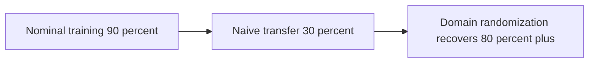
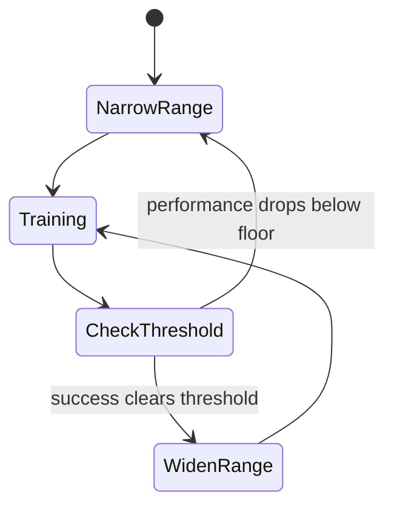

# Lecture 1 — The Sim-to-Real Gap and Why Randomization Works

> **Duration:** ~2 hours of reading + hands-on.
> **Outcome:** You can name the four parts of the sim-to-real gap, explain why chasing fidelity is the wrong strategy and why randomization is the right one, recite the canonical recipes (Tobin, CAD2RL, Dactyl), and decide which of the three randomization families a given task needs.

This is the strategic payoff of the whole Sim2Real phase: you trained policies in Phase 4 (BC, RL, Diffusion Policy, ACT, VLAs) and proved last week that simulators disagree with each other. The obvious worry — "if they disagree with each other, they all disagree with reality, so how can any sim-trained policy work on a robot?" — is exactly the question this week answers. The answer is not "make one sim match reality" (impossible) but "train across enough sims that reality is unremarkable." Everything below builds that answer.

If you remember one sentence from this entire week, remember this one:

> **Sim-to-real transfer is not about making one simulator realistic enough to match reality; it is about training over a distribution of imperfect simulators wide enough that reality is just one more sample from it — so the policy was never overfit to "the simulator" in the first place.**

That one reframe — from "perfect the model" to "make the policy not depend on a perfect model" — is the whole intellectual content of the week. Everything below is engineering in service of it: how to express the distribution as a config, how to train across it, how to widen it as a curriculum, and how to prove honestly that it worked.

Last week you measured that two *simulators* disagree about contact, sensor noise, and step behavior on the same robot. Reality disagrees with *all* of them, more. This lecture is the strategy for not being destroyed by that disagreement. Two parts here: (1) the gap, and why fidelity-chasing loses; (2) the randomization idea, its canonical recipes, and the three families. Lecture 2 implements it and evaluates it honestly.

Everything you built in Phase 4 — the imitation and RL policies, the Diffusion Policy and ACT, the fine-tuned VLA — assumed the policy would run in *some* world. This week confronts the uncomfortable truth that the world a policy *trained* in (a simulator) is not the world it will *run* in (reality, or a real-style held-out world), and that the difference can be the entire gap between a 90% demo and a 30% deployment. Domain randomization is the strategy that bridges that gap, and it is the load-bearing technique of the whole Sim2Real phase. Get it right and your Phase 4 policies become trustworthy on hardware; skip it and they shatter on first contact with reality.

---

## Part 1 — The sim-to-real gap, named, and why fidelity-chasing fails

### 1.1 The gap has four parts

Before the four parts, a number to anchor why this matters. A typical untreated sim-to-real result looks like this: a policy that scores 90% in its training world might score *30%* on a real robot (or a held-out world). That 60-point drop is "the gap," and it is the difference between a demo and a product. Domain randomization, done well, recovers a large fraction of it — turning 30% back into 80%+ — which is exactly the gap-closure number you will produce this week. Keep that 90→30→80 arc in mind: nominal looks great, naive transfer collapses, randomization recovers most of it. That arc is the whole story of the week in three numbers.


*The 90 to 30 to 80 arc: nominal looks great, naive transfer collapses, randomization recovers most of the loss.*

"The sim-to-real gap" is not one thing. It is four distinct mismatches, each of which can independently break a transferred policy. Name them, because you randomize against them one family at a time:

1. **The visual gap.** Rendered images are not real images. Real cameras have noise, motion blur, lens distortion, auto-exposure, rolling shutter, and lighting that never matches your sim's. A perception or vision-based policy trained on clean rendered frames sees a real frame as out-of-distribution and fails. This is the gap CAD2RL and Tobin attacked.
2. **The dynamics gap.** Sim physics is not real physics. Real friction varies with surface, wear, and dust; real mass is off from your CAD estimate; real motors have backlash, torque limits, and nonlinear response; real joints have damping you never modeled. A control policy that learned the exact sim dynamics is tuned to physics that don't exist. This is the gap Dactyl attacked.
3. **The sensor gap.** Sim sensors are too clean. A sim IMU has no bias drift; a sim LiDAR has no dropout; a sim encoder has no quantization. A policy that learned to trust pristine observations is brittle to the noisy ones reality provides. (You met this gap from the *other* side in Week 9's IMU calibration — reality is noisy; sim, by default, isn't.)
4. **The latency gap.** Sim control is instantaneous; reality is not. There is delay between "policy outputs action" and "actuator moves," and between "world changes" and "observation arrives" — comms latency, driver latency, actuator dynamics. A policy trained with zero delay can be unstable the moment real latency appears, because it's effectively acting on stale state. This is the gap that most often ambushes a sim-trained controller on its *first* hardware contact.

A transferred policy can clear three of these and die on the fourth. The discipline is to randomize against all four (or to know which one your task is exposed to and randomize that).

Here is a table that pins each gap to its randomization family and a one-line "tell" — the symptom you see when *that* gap is the one biting you:

| Gap | Caused by | Randomize (family) | The tell on hardware |
|---|---|---|---|
| **Visual** | rendered ≠ real images | textures, lighting, camera (visual) | policy goes to wrong place; "doesn't see" the object |
| **Dynamics** | sim physics ≠ real physics | mass, friction, gains (dynamics) | right target, slips/overshoots; grasp fails |
| **Sensor** | sim sensors too clean | noise, bias, dropout (sensor) | jittery/over-confident behavior; over-trusts a noisy reading |
| **Latency** | sim control instantaneous | action/obs delay (latency/dynamics) | oscillation, instability at speed |

Memorize the "tell" column — it lets you *diagnose* a hardware failure back to its gap and therefore to the randomization you under-applied. A robot that reaches the wrong spot has a visual problem (you under-randomized lighting/texture); one that reaches the right spot and slips has a dynamics problem (you under-randomized friction); one that shakes itself apart has a latency problem. The failure tells you which family you skimped on.

### 1.2 Why chasing fidelity is the wrong strategy

The naive instinct is: "the gap is because sim isn't realistic enough — so make sim more realistic." Measure the real friction, model the real motor, render photorealistically, and the gap closes. This is **system identification + fidelity-chasing**, and it is a losing arms race for three reasons:

- **It never finishes.** Reality has infinite detail. You model friction, then discover temperature-dependent friction, then humidity-dependent friction, then per-tile friction. Every parameter you nail reveals two you didn't. You can spend a year and still have a gap.
- **It's overfit to one reality.** Even if you perfectly match *your* lab on *this* Tuesday, you've matched one operating point. Move the robot to a different floor, a different light, a different gripper wear-state, and your hyper-tuned sim is wrong again. You optimized for a point when you needed a region.
- **It's expensive and fragile.** High-fidelity sim is slow (Week 33's throughput lesson), and a policy tuned to a knife-edge of fidelity is exactly the kind of policy that shatters when reality is 5% off.

System ID is not *useless* — measuring real parameters to **center** your randomization distribution is genuinely helpful (you randomize *around* a realistic mean). But system ID alone, chasing a single perfect sim, loses. The winning move is the opposite.

There's a deeper reason fidelity-chasing loses that's worth naming: **the map is not the territory, and it never will be.** A simulator is a model, and "all models are wrong, but some are useful." Chasing fidelity treats the gap as a *modeling error to eliminate*; randomization treats the gap as *uncertainty to be robust to*. The second framing is correct because the gap is not a fixed error you can drive to zero — it's an irreducible uncertainty (you will never know the exact friction of every surface the robot will ever touch). You don't eliminate uncertainty; you build a policy that doesn't need it eliminated. That reframe — from "make the model perfect" to "make the policy not depend on the model being perfect" — is the entire intellectual move of the week, and it's why a senior engineer reaches for DR reflexively instead of spending a month on system ID.

### 1.3 The randomization idea

Domain randomization flips the problem. Instead of one carefully-tuned simulator, you train over **a wide distribution of deliberately-corrupted simulators**: every episode (or every parallel environment), you re-sample the textures, the lighting, the friction, the mass, the sensor noise — from ranges *wide enough to bracket reality*. The policy never sees the same world twice. It cannot overfit to "the simulator" because there is no single simulator; there is a cloud of them.

The payoff is the load-bearing intuition of the week:

> **If the policy was trained on a distribution of worlds wide enough to contain the real world as one of its samples, then from the policy's perspective the real world is not special — it's just another draw it has already learned to handle. The randomization manufactures robustness; reality becomes in-distribution.**

A vision policy that trained on ten thousand random textures treats the real tabletop as texture 10,001 — unremarkable. A control policy that trained on a thousand frictions has already seen something near the real friction; it generalizes to it the way it generalized across the thousand. You did not match reality. You made reality boring.

The cost is also honest: a policy trained to handle *all* frictions is necessarily a bit more conservative than one tuned to the *exact* friction. It trades peak nominal performance for robustness. You'll see this directly in the gap-closure table — the randomized policy is often slightly worse on the easy nominal world and dramatically better on the held-out one. That trade is the whole point.

### 1.4 The intuition, three ways

Because this idea is the conceptual spine of the week, here are three framings; one of them will stick for you.

- **The distribution framing.** Reality is one sample from the space of possible worlds. Train on a *narrow* distribution (one nominal world) and reality is far out of distribution — the policy extrapolates and fails. Train on a *wide* distribution and reality is inside it — the policy interpolates and succeeds. Randomization widens the training distribution until it brackets reality.
- **The robustness framing.** A policy that only ever saw friction 0.8 has *learned to assume* friction 0.8 — it is brittle to any other value. A policy that saw friction uniformly in [0.4, 1.2] *cannot* assume any single value, so it must learn a strategy that works across the range. The strategy that works across a range is, by construction, robust. Randomization forces robustness by removing the option to overfit.
- **The data-augmentation framing.** You already know image augmentation (random crops, color jitter) makes a vision model robust to camera variation — that's domain randomization on the *visual* axis, and you used it in Week 31's fine-tune. Domain randomization is simply that idea extended to *every* axis the real world can differ on: not just the image, but the physics, the sensors, and the timing. If augmentation-for-robustness makes sense to you for images, DR is the same logic, generalized.

Pick whichever framing clicks. They describe the same mechanism: widen what the policy trains on so that what it meets in reality is no longer a surprise.

A quick contrast to lock it in, nominal vs. randomized training:

- **Nominal training** shows the policy *one* world, repeatedly. The policy learns "the friction is 0.8, the light is here, the camera is there." It becomes excellent at that exact world and assumes it everywhere.
- **Randomized training** shows the policy a *different* world every episode. It can never learn "the friction is 0.8" because last episode it was 0.5 and next episode it'll be 1.1. It is forced to learn a strategy that works *regardless* — which is robustness.

The nominal policy is a specialist for one operating point; the randomized policy is a generalist across a region. Reality is somewhere in the region (if you sized it right) but almost never exactly at the nominal point — which is precisely why the nominal policy's 90% collapses on contact with reality while the randomized policy's holds.

### 1.5 Why this is a *strategy*, not a trick

The design-stance framing has concrete consequences at each stage of the pipeline:

- **Data collection** — you favor *varied* data (different objects, lighting, conditions) over pristine repetitions, because variety is what the policy will need to generalize.
- **Training** — you train over distributions, not points; the env varies every episode.
- **Evaluation** — you hold out worlds the policy never saw, because the training world tells you nothing about transfer.
- **Failure analysis** — when something fails, you ask "did I *sample* that condition?" before "is the policy broken?".
- **Deployment** — you ship the safety filter anyway, because DR reduces but never eliminates the chance the policy is wrong.

A subtle but important point a senior engineer makes: domain randomization is not a single technique you bolt on at the end — it is a **design stance** that shapes the whole pipeline. It changes what data you collect (varied, not pristine), how you train (over distributions, not points), how you evaluate (held-out worlds, not the training world), and how you reason about failure (did I sample that condition, or not?). Teams that "tried domain randomization and it didn't help" almost always treated it as a switch to flip rather than a discipline to adopt — they randomized the wrong family, or too narrowly, or evaluated on a contaminated world. The strategy framing matters because it tells you the work is in the *whole loop*, not in one config line.

---

## Part 2 — The canonical recipes and the three families

### 2.1 CAD2RL (Sadeghi & Levine, 2016) — visual randomization, taken to the extreme

CAD2RL trained a *collision-avoidance flight* policy to fly a real drone through real hallways — **using zero real images.** It rendered a huge variety of randomized 3D hallway scenes (random textures, furniture, lighting, geometry) and trained a vision policy entirely in this randomized sim. The policy transferred to reality because the real hallway was, statistically, inside the distribution of randomized hallways it had trained on. The lesson: **visual randomization alone can be enough for a visual task, if it's wide enough.**

What made CAD2RL striking in 2016 was the *zero real images* part. The conventional wisdom was that you needed real-world data to handle real-world visuals; CAD2RL showed that if your *randomized* renderings spanned a wide enough range of appearances, the real world fell inside that range and no real data was needed. It reframed the question from "how do I collect enough real images?" to "how do I randomize my renderings widely enough that real images are unremarkable?" — and the second question is far cheaper to answer. That reframe is why the paper still matters: it's the clearest demonstration that *coverage beats realism* for visual transfer.

### 2.2 Tobin et al. (2017) — the textbook visual-DR recipe

Tobin et al. made the recipe explicit for object localization / grasping. They randomized, per scene:

- **Textures** of every object and surface (random colors/patterns from a large set).
- **Lighting** — number of lights, their positions, intensities, and colors.
- **Camera pose** — position and orientation jittered.
- **Object positions and distractor objects** — random clutter the policy must ignore.
- **Material properties and background.**

To put numbers on "a large set": Tobin-style setups commonly draw textures from thousands of options, place several lights at random positions, and jitter the camera over a meaningful range — so each rendered scene is genuinely unlike the last. The variety is the active ingredient; a "randomization" that only nudges a texture slightly is not wide enough to force invariance. When you author visual DR (the challenge), err toward *more* variety than feels reasonable — garish is fine, because the policy learns to ignore appearance entirely.

Trained on this, a network localized objects in *real* images well enough to grasp, without real training data. **This is the canonical visual-DR checklist** — when you randomize visuals, this is the list you randomize. Memorize it.

The mechanism, stated plainly: by training on images that are *deliberately unrealistic in every direction* — garish textures, wild lighting, jittered cameras — the network is forced to learn the *task-relevant invariant* (where is the object, geometrically) and to *ignore* everything else (texture, color, lighting), because none of those were reliable cues during training. A real image, with its real (but ordinary) texture and lighting, is then just a *less* extreme sample than the training distribution, and the network handles it fine. The counterintuitive punchline: **you make the sim *less* realistic (more random) to make the policy *more* transferable.** Realism is not the goal; coverage is.

### 2.3 Dactyl / ADR (OpenAI, 2018–2019) — dynamics randomization and the curriculum

Dactyl solved *in-hand manipulation* (re-orienting a block, later a Rubik's cube) on a real robot hand, trained entirely in sim. Vision randomization wasn't the hard part — **dynamics** was. They randomized:

- **Object mass, size, and friction.**
- **Hand/joint properties** — friction, damping, motor gains, tendon dynamics.
- **Action and observation latency.**
- **Sensor noise and biases.**

And critically, they introduced **Automatic Domain Randomization (ADR)**: rather than fix the ranges by hand, **start narrow and widen each range automatically as the policy gets good at the current range.** This is a *curriculum* — easy worlds first, harder (wider) worlds as competence grows. The syllabus phrase "sim-to-real is a curriculum of distributions" is exactly ADR. We cover its mechanics and failure modes in Lecture 2.

The Dactyl result is worth dwelling on because it is the existence proof for *dynamics* randomization specifically. In-hand manipulation is brutally contact-rich — the fingers make and break contact dozens of times per second, and tiny errors in friction or finger dynamics compound fast. There was no hope of modeling the real hand precisely enough. So OpenAI didn't try: they randomized object mass and size, finger friction and damping, motor gains, latency, and sensor noise, trained across that distribution with ADR, and the policy transferred to the *physical* Shadow hand. The lesson generalizes: **when you cannot model the physics precisely (and you usually cannot), randomize it widely and let the policy learn a strategy robust to the uncertainty.** Your manipulation grasp is a smaller version of the same problem.

ADR's curriculum, in slightly more mechanical terms (Lecture 2 implements it):

- Each randomization parameter starts with a **narrow** range, near the nominal — an easy world the policy can already mostly solve.
- The policy trains until it clears a **success threshold** on the current range.
- When it does, the range **widens** by a step — the worlds get harder/more varied.
- If performance **drops** below a floor, the range **narrows** back — the curriculum eases off.
- Over training, the ranges grow as fast as the policy can handle and no faster, so the policy is always trained at the *edge of its competence*.

The elegance is that ADR removes the hand-tuning of ranges: you don't have to guess how wide is right (and risk the over-randomization cliff), because the curriculum *finds* the widest ranges the policy can still solve. The "curriculum of distributions" framing the syllabus uses is exactly this — easy distributions first, hard distributions as competence grows, automatically. For this week you'll start with *fixed* ranges (simpler, and enough to see gap closure) and ADR is a stretch goal; but knowing it exists tells you the ceiling of the technique.


*ADR as a curriculum: ranges widen when the policy is competent and narrow back when it struggles.*

### 2.3.1 The three recipes, side by side

So you can hold them together:

| Paper | Year | Primary family | Key idea | What it transferred |
|---|---|---|---|---|
| CAD2RL | 2016 | Visual | Train flight on randomized renderings, zero real images | A real drone through real hallways |
| Tobin et al. | 2017 | Visual | The textbook texture/lighting/camera/distractor recipe | Real-image object localization for grasping |
| Dactyl / ADR | 2018–19 | Dynamics | Randomize physics + ADR curriculum | In-hand manipulation on a real robot hand |

Three papers, one strategy, applied to different gaps. CAD2RL and Tobin attacked the *visual* gap; Dactyl attacked the *dynamics* gap and added the ADR curriculum. Together they're the canon you cite when someone asks "does this actually work?" — and they map directly onto the three families you'll randomize.

### 2.4 The three families, and which task needs which

Every randomization you'll ever apply falls into three families. Know them and know the mapping to tasks.

| Family | What you randomize | Primarily for | Examples |
|---|---|---|---|
| **Visual** | textures, materials, colors, lighting, camera pose/intrinsics, distractors, background | **vision-based** policies (perception, vision policies, VLAs) | Tobin recipe; CAD2RL |
| **Dynamics** | mass, inertia, friction, restitution, joint damping, motor gains, torque limits, latency | **control** policies (RL controllers, manipulation, locomotion) | Dactyl |
| **Sensor-noise** | Gaussian noise, bias, dropout, quantization, delay on observations | **any** policy that reads sensors | noisy IMU/LiDAR injection |

The senior rule of thumb:

> **Randomize the family your policy's *inputs and physics* are exposed to.** A vision policy that reads images is exposed to the visual gap → visual DR. A state-based RL controller that reads joint states and produces torques is exposed to the dynamics gap → dynamics DR. A policy that reads noisy real sensors → sensor-noise DR. Most real policies need at least two families; a vision-based manipulation policy needs all three.

Randomizing the *wrong* family wastes capacity: lavishing visual randomization on a state-based controller that never sees an image does nothing for its dynamics gap. Match the family to the exposure.

To make the families tangible, here is what each one *looks like* as concrete parameters you'd randomize (Lecture 2 turns these into a config):

**Visual** — randomize what the camera sees:

```
table/object texture   : pick from a large texture set per episode
material color/albedo  : random RGB or hue shift
light count            : 1-4 lights
light position         : random within a hemisphere over the scene
light intensity/color  : uniform over a wide range
camera pose            : jitter position ±few cm, orientation ±few degrees
camera intrinsics      : small focal-length / distortion jitter
distractors / background: random extra objects, random backdrop
```

**Dynamics** — randomize the physics:

```
object mass            : ±50% of nominal
object/floor friction  : uniform over a plausible range (e.g. 0.4-1.2)
restitution (bounciness): small range
joint damping          : log-uniform over an order of magnitude
motor gain / torque lim : ±20% of nominal
action/obs latency     : 0-50 ms
```

**Sensor-noise** — randomize what the observation reports:

```
additive Gaussian noise : on each observation channel
sensor bias             : a per-episode constant offset
dropout                 : random fraction of readings missing
quantization            : round to a coarser resolution
delay                   : observation arrives a step or two late
```

You will not randomize *all* of these for any one policy — you randomize the ones your policy is *exposed to* (the rule above). But seeing the full menu makes the abstract "three families" concrete, and it's the menu Exercise 1 has you select from for a grasp task and a nav task.

### 2.4.1 The latency gap deserves its own mention

Latency randomization hides inside the "dynamics" family on most checklists, but it is worth pulling out because it is the gap that most reliably ambushes a sim-trained controller on its *first* hardware contact. In sim, when the policy outputs an action, the world responds *instantly* on the next step. On real hardware, there is a delay — comms latency, driver latency, the actuator's own dynamics — between command and motion, and another delay between a world change and the observation arriving. A policy trained with zero delay has implicitly learned to act on *current* state; introduce real latency and it is now acting on *stale* state, which for a tight feedback loop can cause oscillation or instability. The fix is cheap and effective: **randomize a control/observation delay (say 0–50 ms) during training**, so the policy learns a strategy robust to delay rather than one that assumes instantaneous response. A surprising number of "it worked in sim and shook itself apart on the robot" stories are unmodeled latency, and a little latency randomization inoculates against them.

### 2.4.2 The alternatives and complements to DR

Domain randomization is the workhorse, but it is not the only sim-to-real tool, and a senior engineer knows where it sits among the alternatives:

- **System identification (system ID).** Instead of (or in addition to) randomizing, you *measure* real parameters — the actual friction, the actual mass, the actual motor response — and put those numbers into the sim. System ID *narrows* the gap by making the sim accurate; DR *spans* the gap by training across a range. They are complementary: the best practice is **DR centered on system-ID measurements** — measure the real friction to set the *center* of your randomization range, then randomize *around* it widely enough to bracket the uncertainty. Pure system ID (chase one perfect value) is the fidelity-chasing trap from §1.2; pure DR (guess the center) works but can be wider than necessary; DR-around-a-measurement is the sweet spot.
- **Domain adaptation.** Rather than make sim look like reality, *adapt* at deployment: learn a mapping that translates real observations into the "canonical" form the sim-trained policy expects (e.g., RCAN turns a real image into a sim-style image), or fine-tune on a little real data. This attacks the gap from the deployment side rather than the training side.
- **Real-world fine-tuning.** Train in sim with DR, then collect a small amount of real data and fine-tune — exactly the Week 31 VLA pattern. DR gets you most of the way; a few real demos close the last mile.

For this week you focus on DR (it's the workhorse and the syllabus topic), but knowing it lives in a family of techniques — and that *centering DR on system ID* is the 2026 best practice — is what separates "I know the one trick" from "I know the design space."

### 2.5 What randomization can and cannot close — the honesty section

Domain randomization narrows the gap. It does not erase it, and a senior engineer states the limits up front:

- **It cannot close a gap it never sampled.** If the real friction is *outside* your randomized range, the policy never trained on it and will fail. Wide ranges help; ranges that don't bracket reality don't. (This is why system ID to *center* the distribution matters.)
- **It cannot invent a sensor or a contact regime that the sim cannot produce.** If your sim physics simply cannot represent the real contact dynamics (deformable objects, fluids, fine friction), no amount of randomizing rigid-body parameters reaches reality.
- **It costs nominal performance.** The robustness trade is real; over-randomize and the policy becomes so conservative it solves nothing (the over-randomization cliff — Lecture 2).
- **It is not a substitute for a safety case.** A sim-trained policy that "transfers" still needs the runtime safety filter, the workspace clamps, and the classical fallback from Week 32. Randomization buys robustness, not a guarantee. The capstone's safety case (Week 41) assumes the policy *will* sometimes be wrong.

The honest framing for 2026: **domain randomization is the most reliable, most-used sim-to-real workhorse, and it is a probabilistic robustness technique, not a transfer guarantee.** It makes reality in-distribution *if you randomized the right families wide enough to bracket it* — and you prove you did with the held-out gap-closure metric, not with hope.

Concrete examples of gaps DR struggles to close, so you recognize them:

- **A genuinely novel object.** If your grasp policy trained only on cubes and the real task is a coffee mug with a handle, randomizing cube textures and frictions does not teach it about handles. The *geometry* is out of distribution, not just the appearance. Fix: include varied geometries in training, or fine-tune on the new object.
- **A deformable or articulated object.** Rigid-body randomization cannot represent a cloth, a cable, or a hinged tool if the physics engine models everything as rigid. The sim *cannot produce* the real dynamics, so no randomization over rigid parameters reaches them. Fix: a sim that models the relevant physics, or real data.
- **A sensor modality the sim lacks.** If reality has a force/torque sensor your sim doesn't model, you can't randomize noise on a signal that doesn't exist. Fix: add the sensor model to the sim.
- **Reward/objective mismatch.** DR makes the policy robust to *world* variation, not to a *wrong objective*. If your reward rewards the wrong thing, a robust policy robustly does the wrong thing. Fix: the reward, not the randomization.

The pattern: DR closes gaps that are *parameter variation within what the sim can represent*. It does not close gaps that are *structural* — things the sim cannot produce at all. Knowing which kind of gap you face tells you whether DR is the tool or whether you need a better sim, real data, or a fixed objective. That diagnosis is the senior judgment the honesty section is teaching.

---

## 2.10 The strategy-design checklist

Pulling Part 2 together into the procedure you'll follow for your own task (and formalize in Exercise 1):

1. **List the gaps your policy is exposed to.** Walk the four (visual, dynamics, sensor, latency). Which does *this* policy's inputs and physics touch?
2. **Map each exposed gap to a family.** Visual gap → visual DR; dynamics gap → dynamics DR; etc. Skip families the policy isn't exposed to.
3. **Pick a nominal for each parameter.** Ideally a *measured* value (light system ID); otherwise your best estimate.
4. **Set a range that brackets reality.** Wide enough that the plausible real value falls inside, centered on the nominal. Err wider than you think — but not past the over-randomization cliff.
5. **Choose a distribution shape.** Uniform around a nominal (friction), normal (sensor noise), log-uniform (a multiplicative gain).
6. **Sample fresh per episode/env.** Never fix the world for a run; that's domains, not randomization.
7. **Hold out an eval world.** Pick parameters *outside* the training ranges so the gap-closure number is honest.
8. **Train, evaluate, diagnose.** If held-out success is low, use the "tell" table to find which family you under-randomized, widen it, repeat.

This eight-step loop *is* domain-randomization engineering. Steps 1–6 are Lecture 2's config and training; steps 7–8 are Lecture 2's honest evaluation. Memorize the loop and you can apply DR to any sim-trained policy, not just this week's.

---

## 3. Where this lands

You now have the *why* and the *recipe*. The Week 28 PPO policy you trained on one nominal world is exactly the brittle "tuned to one simulator" artifact this week exists to fix. Lecture 2 shows you how to wire a randomization config into that training loop, how ADR turns ranges into a curriculum, the different recipes for manipulation vs. navigation, and — most importantly — how to author a held-out "real-style" world and compute the gap-closure number that turns "I randomized stuff" into "here is the evidence it transferred."

### 2.6 A worked scenario: the Week-28 reach policy meets reality

Make it concrete with the policy you'll actually augment. Your Week-28 PPO reach policy was trained in one nominal world: friction 0.8, a fixed light, a clean state observation, instantaneous control. It hits ~90% in that world. Now imagine deploying it (or, on Path B, evaluating it on a deliberately-mismatched "real-style" world). What breaks, and which family fixes it?

- The "real" floor/object friction is 0.55, not 0.8. The policy's grasp timing, tuned to 0.8, slips. → **Dynamics DR** on friction `[0.4, 1.2]` would have covered 0.55.
- The "real" lighting is dimmer and from a different angle; if the policy reads images, the scene looks out-of-distribution. → **Visual DR** on lighting/texture would have covered it.
- The "real" state estimate is noisy (the EKF isn't perfect); the policy, trained on clean state, over-trusts it. → **Sensor-noise DR** on the observation would have covered it.
- The "real" control loop has ~30 ms of latency; the policy oscillates. → **Latency DR** would have covered it.

Each failure maps to exactly one family, and the *union* of the families is the recipe. This is the mental exercise Exercise 1 makes you do formally for two tasks: enumerate the exposures, map each to a family, set a range that brackets the plausible real value. The worked scenario above is the template — and notice that the nominal policy, which looked great at 90%, is exactly the artifact that fails, because 90% in *one* world says nothing about robustness *across* worlds. That gap between "90% nominal" and "31% held-out" is the number this week exists to close.

### 2.7 A short history, so you know this works

If randomization sounds too good to be true ("train in a cartoon, deploy on a robot?"), the track record is the reassurance. CAD2RL (2016) flew a real drone trained only on randomized renderings. Tobin et al. (2017) grasped real objects localized by a network trained only on randomized sim. OpenAI's Dactyl (2018) re-oriented a block, then solved a Rubik's cube (2019), on a *real* robot hand trained entirely in sim with dynamics randomization and ADR. Quadruped locomotion policies (ANYmal, and many since) routinely train in sim with DR and walk on real hardware over terrain they never saw. By 2026 this is not a research curiosity — it is the **default** way sim-trained policies reach hardware, precisely because the alternative (chase one perfect sim) does not scale. You are learning the standard practice, validated across a decade of real robots.

### 2.8 Common misconceptions, cleared up

The ones that surface in design reviews and at the Phase 5 milestone:

- **"Domain randomization makes the policy worse."** It makes it slightly worse on the *easy nominal* world (the robustness trade) and much better on *unseen* worlds. If you only look at nominal performance, DR looks like a loss; the point is the held-out gain.
- **"Wider randomization is always better."** No — too wide and you hit the over-randomization cliff (the policy goes conservative and solves nothing). You want the widest range the policy can *still solve*, not the widest range.
- **"DR means I don't need a realistic simulator at all."** Mostly, but not entirely — your sim must be able to *produce* the conditions you randomize over. You can't randomize a contact regime your physics engine can't represent, and centering on a realistic nominal (system ID) helps.
- **"If it transfers in sim-held-out, it'll transfer to hardware."** The held-out world is a *proxy* for reality, not reality. It's the best you can do without hardware (and the only thing you can do on Path B), but a held-out gap-closure is evidence, not a guarantee.
- **"DR replaces the safety case."** Never. A DR-trained policy is *more robust*, not *correct*. It still needs the Week 32 runtime safety filter, the workspace clamps, and the classical fallback. Robustness reduces how often the policy is wrong; the safety case handles the times it still is.
- **"Randomize everything to be safe."** Randomize what the policy is *exposed to*. Randomizing irrelevant parameters wastes capacity and can push you toward the over-randomization cliff for no benefit.

### 2.9 Why this week sits where it does in the track

A note on sequencing, because it is not accidental. Last week (Week 33) you measured the throughput-vs-fidelity trade and stood up the GPU-parallel Isaac Lab path. *This* week depends on both: domain randomization needs to train over *many* worlds, which is only affordable on the throughput side of last week's curve (the parallel-env story). And next week begins multi-robot work, by which point your single-robot policies should be robust enough to trust — which is exactly what DR provides. So Week 33 → 34 → 35 is throughput → robustness-via-randomization → scale-out. The sim-to-real discipline you build here is also what makes the Phase 5 milestone (Week 40) and the capstone safety case (Week 41) credible: a sim-trained capstone component without a gap-closure number is an assertion; with one, it's evidence.

---

## 4. Recap

You should now be able to:

- Name the four parts of the sim-to-real gap (visual, dynamics, sensor, latency) and which kind of policy each threatens.
- Explain why fidelity-chasing / pure system ID is a losing arms race, and why training over a wide distribution of corrupted sims wins.
- State the core intuition: a sufficiently wide training distribution makes reality just another sample — in-distribution rather than special.
- Recite the canonical recipes: CAD2RL (extreme visual DR for flight), Tobin (the textbook visual checklist), Dactyl/ADR (dynamics DR + the widening curriculum).
- Map a task to the randomization family it needs, and state honestly what randomization can and cannot close.
- Diagnose a hardware failure back to its gap using the "tell" column, and therefore to the family you under-randomized.
- Place DR among its alternatives (system ID, domain adaptation, real fine-tuning) and explain why DR-centered-on-system-ID is the 2026 best practice.
- Recognize the over-randomization cliff and the "DR is not a safety case" rule.
- Explain why this week depends on last week's throughput lesson and feeds the Phase 5 milestone and capstone safety case.

The one idea to carry forward: **you do not defeat the sim-to-real gap by perfecting the simulator; you defeat it by training across a wide enough distribution of imperfect simulators that reality becomes unremarkable — and you prove you did it with a held-out gap-closure number, not with hope.** Lecture 2 turns that idea into a config, a training loop, and an honest evaluation. Everything from here is engineering in service of that one strategic stance.

Keep the 90→30→80 arc in your head as you go: nominal looks great, naive transfer collapses, randomization recovers most of it. That arc is the week in three numbers, and producing your own version of it on your own task is the whole point.

Next: implementing the randomization config, ADR, the manipulation-vs-nav recipes, and the honest gap-closure evaluation. Continue to [Lecture 2 — Randomization Config, ADR, and Honest Evaluation](./02-randomization-config-adr-and-honest-evaluation.md).

---

## References

- *Domain Randomization* — Tobin et al., 2017: <https://arxiv.org/abs/1703.06907>
- *CAD2RL* — Sadeghi & Levine, 2016: <https://arxiv.org/abs/1611.04201>
- *Learning Dexterous In-Hand Manipulation (Dactyl)* — OpenAI, 2018: <https://arxiv.org/abs/1808.00177>
- *Solving Rubik's Cube with a Robot Hand (ADR)* — OpenAI, 2019: <https://arxiv.org/abs/1910.07113>
- *Sim-to-Real Survey* — Zhao et al., 2020: <https://arxiv.org/abs/2009.13303>
