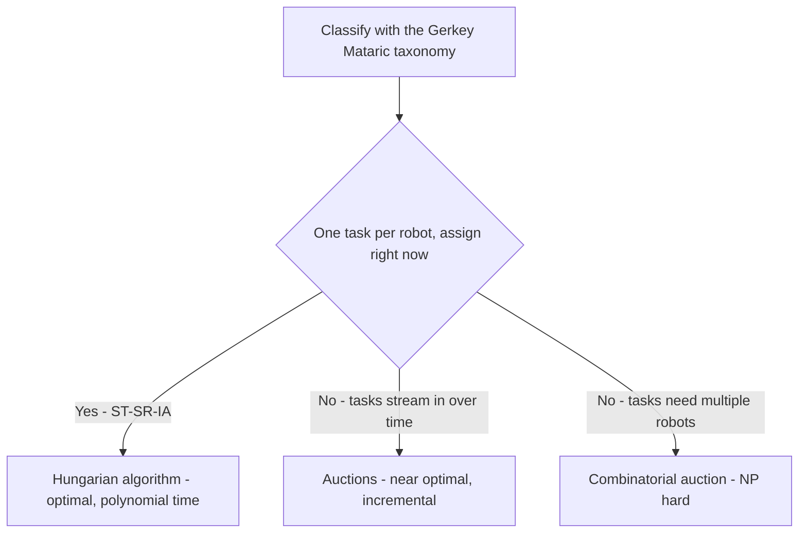
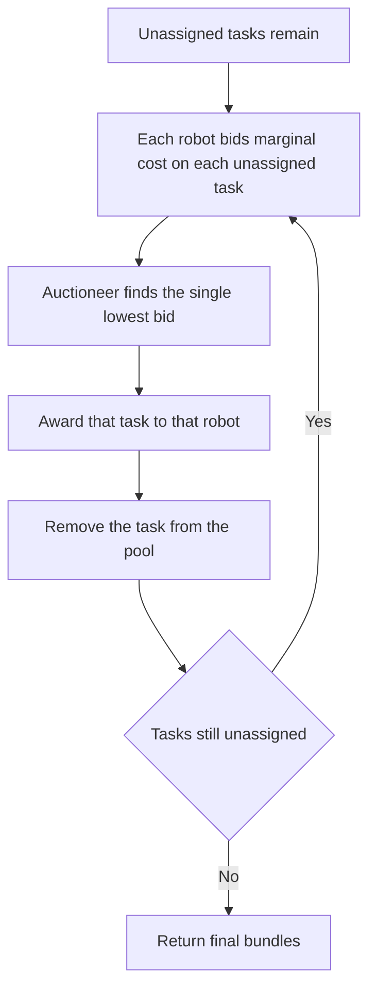

# Lecture 1 — Task Allocation: The Hungarian Algorithm and Market-Based Auctions

> **Duration:** ~2 hours of reading + hands-on.
> **Outcome:** You can formulate a fleet's who-does-what problem as a cost-matrix assignment, solve it optimally with the Hungarian algorithm, explain precisely why a greedy `argmin` is sub-optimal, and implement a market-based auction that re-allocates as the world changes — and you can say when to reach for each.

If you remember one sentence from this entire week, remember this one:

> **Multi-robot task allocation is an optimization problem wearing a robotics costume. The robots are almost incidental; the object you actually manipulate is a cost matrix, and the question is whether you solve it optimally and all-at-once (Hungarian), or incrementally and responsively (auctions).**

A junior engineer hears "five robots, five deliveries" and writes a loop: for each task, give it to the nearest free robot. That loop is greedy, it is intuitive, and it is *wrong* — not "slightly sub-optimal," wrong in ways that produce a fleet that does measurably more total work than it needs to. This lecture makes you immune. We start at the problem definition, build the optimal solver, prove the greedy approach loses, and then introduce auctions for the case the Hungarian algorithm can't handle: a world that won't hold still.

---

## 1. The problem: what is task allocation, formally?

You have a set of **robots** `R = {r1, ..., rN}` and a set of **tasks** `T = {t1, ..., tM}`. Each robot can do each task at some **cost** `c(ri, tj)` — most often the time or distance for robot `i` to complete task `j`. You want an **assignment**: a mapping of robots to tasks that minimizes total cost (or makespan, or some other objective), subject to constraints (a robot does one task at a time; a task is done by one robot).

That is the entire problem. The hard part is not stating it; it is (a) classifying *which* allocation problem you actually have, because the easy ones have polynomial-time optimal solvers and the hard ones are NP-hard, and (b) deciding whether to solve it centrally and optimally or distributively and responsively.

### 1.1 The Gerkey–Matarić taxonomy

The 2004 Gerkey & Matarić taxonomy is the vocabulary the whole field uses. It has three axes:

- **ST vs. MT** — *Single-Task* robots (a robot does one task at a time) vs. *Multi-Task* (a robot can do several simultaneously). Almost every mobile robot is ST.
- **SR vs. MR** — *Single-Robot* tasks (a task needs one robot) vs. *Multi-Robot* tasks (a task needs several robots cooperating, e.g., two robots carrying one long board). Most delivery/patrol tasks are SR.
- **IA vs. TA** — *Instantaneous Assignment* (assign right now, no lookahead into future tasks) vs. *Time-extended Assignment* (you also schedule the order and timing because more tasks are coming).

The combination tells you the complexity:

| Class | Meaning | Complexity | Solver |
|---|---|---|---|
| **ST-SR-IA** | one task each, assign now | polynomial | **Hungarian algorithm** (optimal, O(n³)) |
| **ST-SR-TA** | one task each, schedule over time | NP-hard | auctions, heuristics, MILP for small N |
| **ST-MR / MT-*** | coalitions, simultaneous tasks | NP-hard (often set-partitioning) | combinatorial auctions, approximation |

The lesson: **the moment your problem is ST-SR-IA, you have an optimal polynomial-time answer and you should use it.** The Hungarian algorithm. There is no excuse for greedy in that case. The moment tasks arrive over time, or a robot does a sequence, you are in NP-hard territory and you reach for auctions, which trade optimality for responsiveness and decentralization.


*The taxonomy routes a problem to the Hungarian algorithm or to auction-based solvers.*

This week's exercises live mostly in ST-SR-IA (Hungarian) and ST-SR-TA (auctions). Open-RMF, the fleet manager in Lecture 2, internally solves the time-extended scheduling problem with its own bidding-based dispatcher — which is, at heart, an auction.

### 1.2 The cost matrix

Everything reduces to one object: the **cost matrix** `C`, an N×M array where `C[i][j]` is robot `i`'s cost for task `j`. The most common cost is **travel time to the task** (or to pick-up then drop-off for a delivery), computed from a path planner or a simple metric. Building this matrix honestly is most of the engineering:

- For a flat warehouse, `C[i][j]` is often the **path length** from robot `i`'s pose to task `j`'s location, ideally through the actual nav graph (so a wall between them counts), not the straight-line Euclidean distance (which lies through walls).
- For a delivery, `C[i][j]` is the cost to drive to the pickup *plus* the cost from pickup to dropoff. The pickup→dropoff leg is the same for every robot, so it doesn't change the *ranking* — but it changes the total, which matters for makespan objectives.
- If a robot *can't* do a task (wrong gripper, dead battery, task in a zone it's barred from), set `C[i][j] = ∞` (a large sentinel). The solver will avoid it.

A worked 3×3 example we'll carry through the lecture. Three robots at poses A, B, C; three delivery pickups P, Q, S. Costs are travel times in seconds:

```
        task P   task Q   task S
robot A    4        2        8
robot B    7        5        3
robot C    6        9        4
```

We want to assign each robot exactly one task, minimizing total time. Hold this matrix; we'll solve it three ways.

---

## 2. The greedy trap: why `argmin` is not optimal

The intuitive algorithm: repeatedly find the single cheapest robot-task pair still available, assign it, remove that robot and that task, repeat.

Walk it on the matrix:

1. Cheapest cell overall is `C[A][Q] = 2`. Assign **A→Q**. Remove row A, column Q.
2. Remaining: B and C over P and S. Cheapest is `C[B][S] = 3`. Assign **B→S**. Remove row B, column S.
3. Only C and P left. Assign **C→P** at cost `6`.

Greedy total: `2 + 3 + 6 = 11`.

Now solve it optimally (we'll do this properly in §3, but here's the answer): the optimal assignment is **A→P (4), B→S (3), C→... wait** — let's just enumerate. With 3×3 there are only 3! = 6 assignments:

| Assignment | Cost |
|---|---|
| A→P, B→Q, C→S | 4+5+4 = 13 |
| A→P, B→S, C→Q | 4+3+9 = 16 |
| A→Q, B→P, C→S | 2+7+4 = 13 |
| A→Q, B→S, C→P | 2+3+6 = **11** (greedy's answer) |
| A→S, B→P, C→Q | 8+7+9 = 24 |
| A→S, B→Q, C→P | 8+5+6 = 19 |

Here greedy got lucky — 11 is optimal for this matrix. Greedy is *not always wrong*; it is *not guaranteed right*. Change one number to see it break. Make `C[A][Q] = 1`:

```
        P   Q   S
A       4   1   8
B       7   5   3
C       6   9   4
```

Greedy: cheapest is `A→Q = 1`. Then `B→S = 3`. Then `C→P = 6`. Total `10`.
But consider `A→P (4), B→S (3), C→Q (9)` = 16, no. Try `A→Q (1), B→S (3), C→P (6)` = 10 — same as greedy. This small matrix is forgiving. Greedy breaks dramatically when the cheapest cell "steals" a robot that was the *only* good option for a task no one else can do cheaply.

The canonical counterexample, minimal and decisive:

```
        P    Q
A       1    2
B       2   100
```

Greedy: cheapest cell is `A→P = 1`. Then B is forced onto Q at `100`. Total `101`.
Optimal: `A→Q (2), B→P (2)` = `4`.

Greedy paid **101** for what optimal does in **4**, a 25× blunder, because it grabbed `A→P=1` locally and left B stranded on the catastrophic `B→Q=100`. This is the whole argument against greedy: **a locally cheap choice can force a globally ruinous one.** Optimal assignment reasons about all pairings jointly; greedy reasons one cell at a time. For a real fleet, the blunder isn't 25× but it is routinely 10–30% extra total travel — which on a 50-robot warehouse is robots and electricity you're burning for nothing.

> **Rule:** if the problem is ST-SR-IA (assign now, one task each), never ship greedy. Use the Hungarian algorithm. It is O(n³), optimal, and `scipy` gives it to you in one line.

---

## 3. The Hungarian algorithm (Kuhn–Munkres)

The Hungarian algorithm finds the minimum-cost **perfect matching** in a bipartite graph (robots on one side, tasks on the other) in **O(n³)** time. It is optimal — it provably returns the assignment with the lowest total cost. You do not need to implement it from scratch for production (you'll do it once, by hand, in the exercise, to understand it), but you *must* understand its shape and its guarantees.

### 3.1 The intuition

The algorithm rests on a key invariant: **subtracting a constant from an entire row or an entire column of the cost matrix does not change which assignment is optimal** — it only changes the total by that constant. (Each row contributes exactly one cell to any complete assignment, so subtracting `k` from a row reduces every possible assignment's total by exactly `k`.) The algorithm repeatedly subtracts row and column minima to create zeros, then tries to select N independent zeros (one per row and column). When it can, those zeros are an optimal assignment. When it can't, it adjusts and tries again. Each adjustment provably makes progress, and it terminates in O(n³).

The four classic steps (for an N×N matrix):

1. **Row reduction.** Subtract each row's minimum from that row.
2. **Column reduction.** Subtract each column's minimum from that column.
3. **Cover the zeros.** Find the minimum number of lines (rows + columns) needed to cover all zeros. If that number equals N, an optimal assignment of independent zeros exists — pick it. Done.
4. **Adjust.** If fewer than N lines cover all zeros, find the smallest uncovered value, subtract it from all uncovered cells, add it to cells covered twice, and return to step 3.

### 3.2 By hand on our 3×3

```
        P   Q   S
A       4   2   8
B       7   5   3
C       6   9   4
```

**Step 1 — row reduction.** Row mins: A→2, B→3, C→4. Subtract:

```
        P   Q   S
A       2   0   6
B       4   2   0
C       2   5   0
```

**Step 2 — column reduction.** Column mins: P→2, Q→0, S→0. Subtract column P's 2:

```
        P   Q   S
A       0   0   6
B       2   2   0
C       0   5   0
```

**Step 3 — cover the zeros.** Zeros at A-P, A-Q, B-S, C-P, C-S. Can we cover all with 3 lines? Cover column P (hits A-P, C-P), cover column S (hits B-S, C-S), cover row A (hits A-Q). That's 3 lines = N. An assignment of independent zeros exists. Select: A→Q (the only zero in row A not in a column we need elsewhere), C→P, B→S. Check independence: rows {A,B,C} distinct, columns {Q,P,S} distinct. ✓

**Result:** A→Q, B→S, C→P. Map back to original costs: `2 + 3 + 6 = 11`. Optimal, matching our enumeration in §2.

You did this by hand once so the `scipy` one-liner is never a black box.

### 3.3 In code: `scipy.optimize.linear_sum_assignment`

In production you call SciPy, which implements the modern Jonker–Volgenant variant (same optimal answer, faster constants):

```python
import numpy as np
from scipy.optimize import linear_sum_assignment

# Rows = robots, columns = tasks. C[i][j] = cost of robot i doing task j.
cost = np.array([
    [4, 2, 8],   # robot A
    [7, 5, 3],   # robot B
    [6, 9, 4],   # robot C
])

row_ind, col_ind = linear_sum_assignment(cost)
# row_ind = [0, 1, 2], col_ind = [1, 2, 0]  -> A->Q, B->S, C->P
total = cost[row_ind, col_ind].sum()
for r, c in zip(row_ind, col_ind):
    print(f"robot {r} -> task {c}  (cost {cost[r, c]})")
print(f"total cost: {total}")     # 11
```

`linear_sum_assignment` minimizes by default. To *maximize* (e.g., when the matrix is a utility/reward, not a cost) pass `maximize=True`, or negate the matrix.

### 3.4 Rectangular problems (N ≠ M)

Real fleets rarely have exactly as many robots as tasks. Two cases:

- **More tasks than robots (M > N).** Not every task can be assigned this round. `linear_sum_assignment` on a non-square matrix assigns each row (robot) to a distinct column (task) and *leaves the extra tasks unassigned* — it returns `min(N, M)` pairs. The unassigned tasks go back in the queue for the next round (this is exactly where time-extended scheduling, §1.1, and auctions, §4, come in).
- **More robots than tasks (N > M).** Some robots stay idle. Same handling: `min(N, M)` pairs returned; idle robots wait.

If you want an explicit square problem (some solvers require it), **pad** the matrix to square with dummy rows/columns of zero cost (or a sentinel), and treat any assignment to a dummy as "unassigned." The exercise does both: the SciPy non-square path and the manual padding path, so you understand what the convenience is hiding.

```python
cost = np.array([
    [4, 2, 8, 5],   # robot A, 4 tasks
    [7, 5, 3, 6],   # robot B
])
# 2 robots, 4 tasks: only 2 tasks get done this round.
row_ind, col_ind = linear_sum_assignment(cost)
assigned = set(col_ind)
unassigned_tasks = [t for t in range(cost.shape[1]) if t not in assigned]
# unassigned_tasks go back in the queue.
```

### 3.5 The complexity ceiling

O(n³) is cheap for tens of robots and tasks (a 50×50 solve is microseconds). It becomes a consideration in the thousands. A 1000×1000 solve is ~10⁹ operations — tens of milliseconds, still fine for a re-plan that happens every few seconds, but not something you run at sensor rate. This is part of *why* large real fleets lean on **incremental** allocation (auctions) rather than re-solving a giant assignment from scratch on every task arrival: re-bidding one task is cheap; re-solving 1000×1000 every time a single task appears is wasteful. Know the ceiling so you know when to switch.

---

## 4. Market-based allocation: auctions

The Hungarian algorithm has two limitations that matter on a real fleet:

1. **It is centralized.** One node holds the whole cost matrix and solves it. If that node dies, allocation stops. For a robust distributed fleet you may want allocation to survive a coordinator failure.
2. **It is one-shot.** It assumes you know all robots and all tasks *now*. On a live fleet, tasks arrive continuously and robots drop out. Re-solving the entire assignment from scratch on every change is wasteful and produces churn (robots re-assigned away from tasks they already started).

**Market-based / auction methods** address both. The metaphor: tasks are auctioned; robots are self-interested bidders; each robot bids its *cost* to do a task; the lowest bid wins. It is decentralized (each robot computes its own bid), incremental (auction the new task, don't re-solve everything), and it degrades gracefully (lose a bidder, the others still bid).

### 4.1 The single-item auction

The simplest auction, for one task:

1. The **auctioneer** announces task `t`.
2. Each robot `ri` computes its bid `bi = c(ri, t)` (its cost — travel time to the task) and submits it.
3. The auctioneer awards `t` to the robot with the **lowest** bid.

For one task this is just "assign to the cheapest robot" — fine. The power shows up with many tasks.

### 4.2 Sequential single-item (SSI) auctions — the workhorse

The naive approach to M tasks is a **combinatorial auction**: robots bid on *every subset* of tasks, the auctioneer picks the bid combination minimizing total cost. This finds the optimum but is exponential (2^M bundles) — intractable for more than a handful of tasks.

The **sequential single-item (SSI) auction** is the practical sweet spot. The key idea: auction tasks **one at a time**, but after a robot wins a task, its bids on *remaining* tasks account for the task it just won. The algorithm:

1. While unassigned tasks remain:
   a. Each robot computes a bid on **each** unassigned task. Crucially, a robot's bid on task `t` is the *marginal* cost: the extra cost of adding `t` to the tasks it has already won this round (e.g., the increase in its route length).
   b. The auctioneer finds the single lowest bid across all (robot, task) pairs and **awards that one task** to that robot.
   c. Remove that task; repeat.

The marginal-cost bidding is what makes SSI near-optimal. Because a robot that already won a task near a cluster bids *cheaply* on the rest of that cluster (small marginal cost) and *expensively* on a far-away task, SSI naturally builds geographically coherent routes — which is most of what the optimal solution does. The published result (Lagoudakis et al., 2005): **SSI auctions are provably within a bounded factor of optimal** and in practice recover ~90%+ of the optimal allocation quality at a tiny fraction of the combinatorial cost.


*The SSI auction loop: bid, award, remove, repeat until every task is assigned.*

A minimal SSI loop in pseudocode:

```
bundles = {robot: [] for robot in robots}      # tasks won so far
unassigned = set(tasks)
while unassigned:
    best = None     # (bid, robot, task)
    for robot in robots:
        for task in unassigned:
            bid = marginal_cost(robot, bundles[robot], task)
            if best is None or bid < best[0]:
                best = (bid, robot, task)
    _, robot, task = best
    bundles[robot].append(task)
    unassigned.remove(task)
return bundles
```

Where `marginal_cost(robot, current_bundle, task)` is "how much longer does my route get if I add this task?" — for a simple model, the increase in total travel distance when inserting the task at its best position in the robot's route.

### 4.3 Re-auctioning: handling a moving world

The reason auctions beat the Hungarian algorithm on a *live* fleet is that re-auctioning is incremental:

- **A new task arrives.** Run a single-item auction for just that task among all robots, using marginal cost. One cheap auction; no re-solve of the whole assignment.
- **A robot drops out** (stalls, low battery, taken offline). Its un-started tasks are returned to the unassigned pool and **re-auctioned** among the survivors. The robot's *in-progress* task may or may not be recoverable depending on the task type.
- **Periodic re-optimization.** Optionally, every so often, robots can put their not-yet-started tasks back up for auction to fix accumulated drift from incremental decisions — a "regret" mechanism.

This re-auction-on-dropout behavior is exactly the **reallocation drill** of this week (and the syllabus's "inject a robot-stalls event and verify reallocation"). Exercise 3 implements an SSI auctioneer that does this; the mini-project wires it to a heartbeat-based failure detector so dropout is detected, not declared.

### 4.4 The optimality–responsiveness trade-off

Lay it out plainly, because choosing between Hungarian and auctions is a real design decision you will defend at the Phase milestone:

| Dimension | Hungarian (central, one-shot) | SSI auction (distributed, incremental) |
|---|---|---|
| Optimality | **Optimal** for ST-SR-IA | Near-optimal (~90%+); bounded sub-optimality |
| Handles task arrival | Re-solve everything (expensive, churns) | Auction just the new task (cheap, stable) |
| Handles robot dropout | Re-solve everything | Re-auction just the orphaned tasks |
| Centralization | Central solver = single point of failure | Distributable; survives coordinator hiccups |
| Compute per change | O(n³) full re-solve | O(N·M) per task, much smaller |
| Best for | A fixed batch you allocate once | A live fleet with arriving tasks and failures |

The honest field guidance for 2026: **use the Hungarian algorithm to allocate a known batch optimally; use an SSI auction (or a fleet manager that runs one internally, like Open-RMF's dispatcher) when tasks stream in and robots fail.** Real fleet managers blend both — they re-solve assignment problems for the current batch but do it incrementally, with bidding, so a single new task doesn't trigger a full churn. You should be able to reach for either and say why.

---

## 5. A worked comparison on the fleet

Bring it together. Two robots, three delivery tasks arriving over a few seconds. This is ST-SR-TA (tasks over time) — auction territory.

```
Robots at depot: r1 at (0,0), r2 at (10,0).
Tasks (pickup locations): t1 (1,1), t2 (9,1), t3 (2,0).
Cost = Euclidean travel (toy model).
```

**t1 and t3 arrive together; t2 arrives 5 s later.**

Round 1 (t1, t3 in the pool), SSI:
- Bids on t1: r1 marginal = dist((0,0),(1,1)) ≈ 1.41; r2 = dist((10,0),(1,1)) ≈ 9.06.
- Bids on t3: r1 = dist((0,0),(2,0)) = 2.0; r2 = dist((10,0),(2,0)) = 8.0.
- Lowest bid overall: r1 on t1 (1.41). **Award t1 → r1.**
- Now r1's bundle = {t1}. Re-bid t3: r1 marginal = extra cost to add t3 to a route through t1 ≈ dist((1,1),(2,0)) ≈ 1.41 (insert after t1); r2 still 8.0. Lowest: r1 on t3. **Award t3 → r1.**
- Pool empty. r1 has {t1, t3} (a coherent left-side route); r2 idle.

5 s later, t2 (9,1) arrives. Single-item auction:
- r1 marginal (already has a left-side route) = large (it'd have to cross the map). r2 (idle, at (10,0)) marginal ≈ dist((10,0),(9,1)) ≈ 1.41. **Award t2 → r2.**

Final: r1 does {t1, t3} on the left, r2 does {t2} on the right. Geographically coherent, low total travel — and we never re-solved a global assignment; we ran three cheap auctions as the world revealed itself. That stability (r1 was never yanked off t1 to "optimize") is the practical reason live fleets bid incrementally.

---

## 6. Recap

You should now be able to:

- State the MRTA problem as a cost-matrix assignment and classify it with the Gerkey–Matarić taxonomy (ST-SR-IA → Hungarian; time-extended/coalitions → NP-hard → auctions).
- Build an honest cost matrix (path cost through the nav graph, ∞ for infeasible pairs) and explain why Euclidean-through-walls lies.
- Explain, with the 25× counterexample, why greedy `argmin` can force a globally ruinous assignment, and why you never ship it for ST-SR-IA.
- Run the Hungarian algorithm by hand (row/column reduction, cover, adjust) and call `scipy.optimize.linear_sum_assignment` for the optimal assignment, including the rectangular N≠M case.
- Implement an SSI auction with marginal-cost bidding, re-auction on task arrival and robot dropout, and explain why it recovers most of the optimum cheaply.
- Choose between central-optimal (Hungarian) and distributed-incremental (auction) and defend the choice on the optimality–responsiveness trade-off.

Next: the fleet manager that productionizes all of this — Open-RMF — its architecture, its fleet adapters, how it deconflicts a shared corridor, and how it reallocates a stalled robot's work. Continue to [Lecture 2 — Open-RMF, Fleet Management, and Reallocation](./02-open-rmf-fleet-management-and-reallocation.md).

---

## References

- *Gerkey & Matarić, "A Formal Analysis and Taxonomy of Task Allocation in Multi-Robot Systems"* (IJRR 2004): <https://journals.sagepub.com/doi/10.1177/0278364904045564>
- *Kuhn, "The Hungarian Method for the Assignment Problem"* (1955): <https://onlinelibrary.wiley.com/doi/10.1002/nav.3800020109>
- *Lagoudakis et al., "Auction-Based Multi-Robot Routing"* (RSS 2005, the SSI auction): <https://www.roboticsproceedings.org/rss01/p45.html>
- *Dias et al., "Market-Based Multirobot Coordination: A Survey and Analysis"* (2006): <https://www.ri.cmu.edu/pub_files/pub4/dias_m_bernardine_2006_1/dias_m_bernardine_2006_1.pdf>
- *`scipy.optimize.linear_sum_assignment`*: <https://docs.scipy.org/doc/scipy/reference/generated/scipy.optimize.linear_sum_assignment.html>
