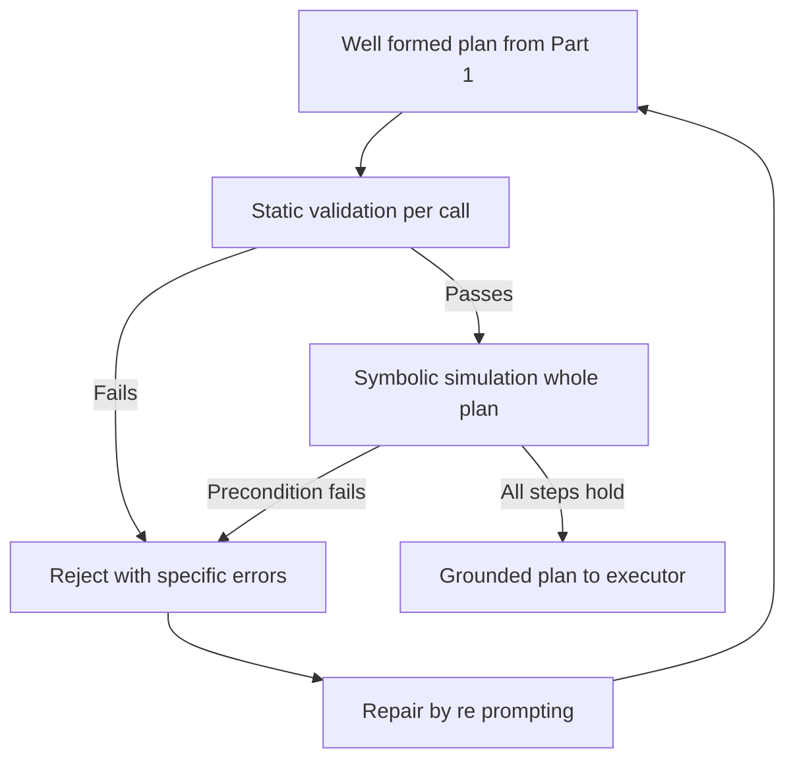
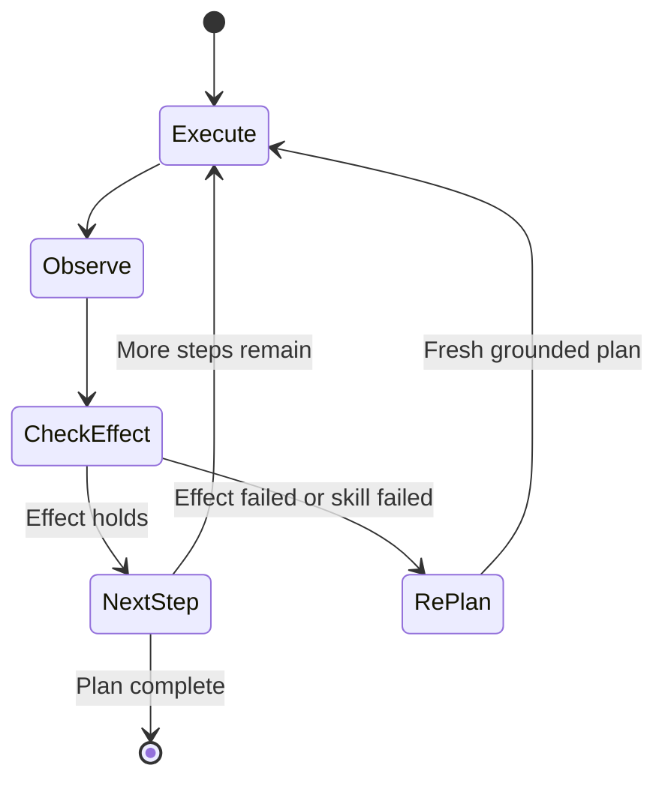

# Lecture 2 — Grounding, Constrained Output, the Executor, and Safety in Language Space

> **Duration:** ~2 hours of reading + hands-on.
> **Outcome:** You can constrain an LLM to emit only valid skill calls with a grammar/schema, ground a plan against the skill library and world state (and repair it when it fails), wire an executor with closed-loop re-planning, deploy a local 8B planner with Ollama/vLLM, and build the half-prompt-half-runtime safety case for a language-driven robot.

Lecture 1 gave you the planner and the skill library — the *proposer* and its vocabulary. This lecture builds the *disposer*: the layers of checking and gating that stand between the LLM's plan and the actuators, and make the planner's output *safe to run*. Three layers, each catching what the one above can't, in increasing order of "how hard a guarantee": constrained decoding (well-formed), grounding (well-founded), safety gates (well-behaved). The sentence to carry:

> **Constrained-grammar decoding makes the plan well-*formed*; runtime grounding makes it well-*founded*; the safety gates make it well-*behaved*. A prompt does none of these reliably — only the runtime does. The safety case is half-prompt, half-runtime, and the runtime is the load-bearing half.**

---

## Part 1 — Constrained output: make the LLM emit only valid skill calls

An unconstrained LLM, asked for a plan, emits *text* — and not even reliably the text you want. It prefaces with "Sure! Here's a plan:", wraps the JSON in markdown fences, adds explanatory prose between steps, or invents a plausible-looking skill you never defined. Now you're writing a fragile parser to extract a plan from chatty prose, and *that parser* is where injection bugs and silent misreads live. The fix is **constrained decoding**: force the model to emit only output that matches a formal structure, so there is *nothing to parse loosely* — the output is, by construction, a list of well-formed skill calls.

This is the same instinct as never `eval()`-ing untrusted input or never building SQL by string concatenation: you don't *parse and sanitize* dangerous free-form input, you *prevent* the dangerous form from existing. Constrained decoding is the robot-planning version — instead of letting the LLM emit anything and then trying to safely interpret it, you constrain the emission so only safe-to-interpret output is possible. The parser becomes trivial (it's just `json.loads` on guaranteed-valid JSON), and a whole class of "the model said something weird and my parser did something worse" bugs vanishes.

### 1.1 Three ways to constrain

- **JSON-schema-constrained decoding.** Define a JSON schema for "a list of skill calls," and force the model's tokens to only ever produce JSON matching it. Tools: Ollama's `format=<schema>`, vLLM's `guided_json`, Outlines. The model *cannot* emit prose or malformed JSON — the decoder masks any token that would violate the schema.
- **Grammar-constrained decoding (GBNF).** Define a formal grammar (llama.cpp/Ollama GBNF) that describes valid skill-call syntax. More expressive than JSON schema for some structures; the decoder only samples tokens the grammar allows.
- **Function-calling / tool-use APIs.** Many models expose a "tools" interface: you describe the skills as functions, the model returns structured tool calls. Convenient, but on small (8B) models *less reliable* than explicit grammar/schema constraint — the model may still emit a call to a tool you didn't define, or malformed args. **Measure it on your model**; for 8B, grammar/schema usually wins.

Which to reach for, in practice:

- **Start with JSON-schema-constrained decoding** (Ollama `format`, vLLM `guided_json`). It's the easiest to write (you already have a schema for validation), the most portable, and on an 8B model it reliably produces well-formed skill lists. This is the C24 default and what the exercises use.
- **Use GBNF grammar** when your output structure is more complex than a JSON schema expresses cleanly, or your inference stack is llama.cpp-based. More expressive, slightly more effort to author.
- **Avoid relying on function-calling alone** on a small model — verify it empirically; if it emits off-library tools even occasionally, fall back to schema/grammar constraint, because "occasionally emits a tool I don't have" is a failure mode you don't want when the tools drive a gripper.

The meta-point: the *mechanism* matters less than the *guarantee*. Whichever you pick, the requirement is the same — the model must be unable to emit a non-library skill or malformed call. Pick the mechanism that gives you that guarantee most reliably on your specific model, and verify it (the homework's constrained-vs-unconstrained problem is exactly this verification).

### 1.2 A JSON schema for the plan

The plan is a list of skill calls; each call names a skill from the library and supplies typed args. The schema (the part the decoder enforces):

```json
{
  "type": "array",
  "items": {
    "type": "object",
    "properties": {
      "skill": {"type": "string", "enum": ["detect_objects", "grasp", "place", "navigate"]},
      "args":  {"type": "object"}
    },
    "required": ["skill", "args"]
  }
}
```

The `enum` is doing real work: the model *cannot* emit a skill outside the library — `wipe`, `pour`, `teleport` are unrepresentable. That alone kills the "hallucinated a skill I don't have" failure. (The args still need validation — the schema can't know `cup_1` exists; that's Part 2.)

It's worth being precise about *how* constrained decoding enforces this, because it's not post-hoc filtering — it's enforced *during generation*. At each token step, the decoder computes the model's probability distribution over the next token, then **masks out** every token that would make the output violate the schema, and samples only from the remainder. So when the model is emitting the `skill` field's value, the decoder only allows tokens that spell one of the `enum` strings; the model *physically cannot* produce `"wipe"` because those tokens are masked. This is fundamentally stronger than "generate freely, then reject bad output": rejection-after-generation means you sometimes get nothing valid and must retry; masking-during-generation means the output is valid *by construction*, first try, every time. That guarantee — valid-by-construction, not valid-if-lucky — is why constrained decoding is the foundation and not just a nicety.

### 1.3 Constrained ≠ grounded

The crucial distinction, and the most common misunderstanding:

- **Constrained decoding guarantees the output is well-*formed*:** valid JSON, only library skills, right argument *shape*. It does **not** guarantee the output is *correct*: the model can still emit `grasp("cup_99")` (well-formed, but `cup_99` doesn't exist) or order skills so a precondition is violated.
- **Grounding (Part 2) guarantees the plan is well-*founded*:** the referenced objects exist, the skills' preconditions hold in sequence.

You need both. Grammar without grounding ships a syntactically perfect plan to grasp a nonexistent object. Grounding without grammar means you're parsing free-text, which is its own nightmare. **Constrain to make parsing trivial; ground to make execution safe.**

---

## Part 2 — Runtime grounding and validation

Grounding answers: *is this well-formed plan actually executable in the real world right now?* The grammar got you a plan that's *shaped* right; grounding checks it's *founded* right. Two layers, applied in order — static per-call checks first (cheap, catch obvious nonsense), then whole-plan symbolic simulation (catches ordering bugs that per-call checks miss):


*Grounding runs static checks first, then simulates the whole plan in order, repairing via re-prompt on failure.*

### 2.1 Static validation (per skill call)

For each skill call in the plan, independent of order:

- **Skill exists** — guaranteed by the grammar's `enum`, but re-check (defense in depth; a future grammar change shouldn't silently break this).
- **Arguments are real referents** — every `ObjectId`/`LocationId`/`WaypointId` argument names something *in the current world state* (populated by `detect_objects()`). `grasp("cup_1")` is valid only if `cup_1` was detected. **This catches the hallucinated-object failure** — the LLM's single most common grounding bug.
- **Arguments are correctly typed** — `place`'s second arg is a `LocationId`, not another `ObjectId`; `navigate`'s arg is a `WaypointId`. Type mismatches are caught here.

The "real referent" check is the workhorse — it's what catches the single most common LLM planning error, the hallucinated object. The mechanism is simple: every `ObjectId` argument must be a member of `world.objects` (populated by `detect_objects()`), every `LocationId` a member of `world.locations`, every `WaypointId` a real waypoint. An LLM that emits `grasp("spoon_1")` when no spoon was detected fails this check instantly — `"spoon_1" not in world.objects`. This is *why* the world-state model (Lecture 1 §3.5) is load-bearing: without an enumerated set of real objects to check against, "is this a real referent?" has no answer, and hallucinated objects sail through. Static validation is cheap (a set membership test per argument) and catches the highest-frequency failure, which makes it the highest-value check per line of code in the whole grounding layer.

### 2.2 Symbolic simulation (the whole plan, in order)

Static per-call validation isn't enough, because a plan can be individually-valid-but-collectively-broken: `place(cup_1, bin_1)` *before* `grasp(cup_1)` has two valid calls in a broken order. So **simulate the plan symbolically** over the world state, applying each skill's precondition and effect (the STRIPS model from Lecture 1 §3.1):

```python
def ground_plan(plan, world, skills) -> tuple[bool, list[str]]:
    """Symbolically simulate the plan. Returns (grounded, errors)."""
    sim = world.copy()                 # a copy we mutate as we 'execute' symbolically
    errors = []
    for i, call in enumerate(plan):
        skill = skills.get(call["skill"])
        if skill is None:
            errors.append(f"step {i}: unknown skill '{call['skill']}'")
            continue
        ok, why = skill.check_args(call["args"], sim)      # exist? typed?
        if not ok:
            errors.append(f"step {i}: {call['skill']}{call['args']}: {why}")
            continue
        if not skill.precondition(sim, **call["args"]):    # holds in sequence?
            errors.append(
                f"step {i}: {call['skill']}{call['args']}: precondition failed "
                f"(state: {sim.summary()})"
            )
            continue
        sim = skill.effect(sim, **call["args"])            # apply effect, continue
    return (len(errors) == 0, errors)
```

This catches the ordering bug: when it reaches `place(cup_1, bin_1)` and `holding(cup_1)` is false in the simulated state, the precondition fails and the plan is rejected with a *specific* error ("precondition failed: not holding cup_1"). Symbolic simulation is cheap (no robot moves) and catches a whole class of bugs before any motor turns — it's the "Can" of SayCan, mechanized.

Why simulate the *whole plan* up front rather than just checking each skill's precondition right before executing it? Two reasons:

- **Fail fast, before any motion.** If step 4 of a 5-step plan is ungrounded, you want to know *before* executing steps 1–3, not after you've already moved the robot three times and then get stuck. Simulating the whole plan catches the problem while it's still cheap to fix (re-prompt), not after you've committed physical actions.
- **Enable repair.** A whole-plan simulation produces *all* the errors at once ("step 2 references a phantom location; step 4 violates an ordering"), which you can feed back to the LLM in one repair prompt (§2.3). Checking just-in-time, step by step, gives you one error at a time and a half-executed plan to unwind.

The cost is that the simulation must model effects accurately — if your `effect` functions don't faithfully capture what a skill does to the world, the simulation's view diverges from reality and it either passes bad plans or rejects good ones. So the precondition/effect model is worth getting right; it's the abstract twin of your real skills, and its fidelity bounds the grounding's accuracy.

### 2.3 Plan repair via re-prompting

When grounding fails, you have a choice: reject outright, or **repair**. Repair is the better default: feed the *specific* validation errors back to the LLM and ask it to fix the plan:

```
Your plan had errors:
  - step 2: place(cup_1, shelf_top): location 'shelf_top' does not exist.
    Valid locations are: [bin_1, table_1].
  - step 3: grasp(spoon_1): object 'spoon_1' does not exist.
    Detected objects are: [cup_1, plate_1].
Produce a corrected plan using only the valid skills, objects, and locations.
```

The specificity matters: "your plan was wrong" gets you another wrong plan; "you referenced `shelf_top` which doesn't exist; valid locations are [bin_1, table_1]" gets you a fix. Cap the repair loop at N retries (e.g., 3); if it still fails to ground, fall back to a safe behavior (ask a human, or do nothing) — never execute an ungrounded plan because you ran out of patience. This is the closed-loop discipline from Inner Monologue applied to *planning-time* errors.

Why does specific feedback work where vague feedback doesn't? Because the LLM's error was usually a *local* mistake — one wrong referent, one bad ordering — not a wholesale misunderstanding. Told *exactly* what was wrong and what the valid options are, the model edits that one thing and keeps the rest. Told only "wrong, try again," it has no signal about *what* to change and often reproduces the same error or introduces a new one. This is the same principle as a good compiler error: "undefined variable `shelf_top` at line 2; did you mean `table_1`?" fixes the bug; "compilation failed" does not. Your validator is the planner's compiler, and its error messages should be as specific as a compiler's — name the step, name the bad symbol, list the valid alternatives. The specificity of the error is what makes repair converge instead of flailing.

A practical caution on the retry cap: each repair is another LLM call (seconds), so an unbounded repair loop can hang the robot for a long time on a genuinely impossible instruction. The cap (say 3) plus a safe-stop is what keeps "the LLM can't ground this" from becoming "the robot is frozen, thinking." If three specific-feedback repairs don't produce a grounded plan, the instruction is probably impossible in the current world (the object truly isn't there, the task truly can't be done now), and the right move is to *tell the operator*, not to keep re-prompting forever.

---

## Part 3 — The executor and closed-loop re-planning

A grounded plan is not a guarantee — the *world* can defy the plan at *execution* time even if it was perfectly grounded at planning time. The cup slips from the gripper; a person moves the bin; a grasp fails. So the executor is **closed-loop**.

The contrast with an *open-loop* executor is worth making explicit, because the open-loop version is the tempting-but-wrong default. An open-loop executor grounds the plan once, then runs every skill in sequence without re-checking — fast, simple, and brittle. The first time a grasp slips, it marches on to `place` a cup it isn't holding, then `grasp` the next object while still (it thinks) holding the first, and the plan derails into nonsense the moment reality diverges. A closed-loop executor re-observes after each skill and re-plans on divergence, so a slipped grasp triggers a re-plan ("I'm not holding the cup; plan again from here") instead of a cascade of failures. The open-loop version *demos* fine (in a demo nothing slips); the closed-loop version *deploys* fine (in deployment things slip constantly). Build closed-loop from the start.

### 3.1 The execute-observe-re-plan loop

```
plan = ground(planner(instruction, world))
i = 0
while i < len(plan):
    skill_call = plan[i]
    success = execute_skill(skill_call)        # runs through MoveIt2/Nav2/VLA
                                               #   with the Week-37 per-skill leash
    world = observe()                          # re-detect: did reality match the effect?
    if not success or not effect_holds(skill_call, world):
        # the world defied the plan. RE-PLAN from the current (real) state.
        plan = ground(planner(instruction, world))   # fresh plan from where we are
        i = 0
        continue
    i += 1
```

After every skill, **re-observe** and check the expected effect actually happened. If `grasp(cup_1)` returned success but the cup isn't in the gripper (the post-condition doesn't hold), or the skill failed outright, **re-plan from the current real world state** — not from the stale plan. This is the syllabus's "inject a skill failure, handle by re-planning." The robot doesn't blindly march through a plan that reality has invalidated; it adapts.


*Each skill executes, the world is re-observed, and a broken effect triggers a fresh plan instead of blind continuation.*

Note the crucial distinction between *grounded at planning time* and *succeeded at execution time*. The grounding (Part 2) verified the plan was *executable in principle* given the world as observed. But execution happens in the *real* world, which can defy even a perfectly-grounded plan:

- The grasp was grounded (cup exists, reachable, gripper empty) but the cup *slipped* — physics, not planning, failed.
- The place was grounded but a person *moved the bin* between planning and execution — the world changed under the plan.
- A skill *timed out* (the arm got stuck) — the skill's implementation failed for reasons the symbolic model couldn't foresee.

None of these is a *planning* bug; the plan was sound. They're *execution-time* divergences between the plan's assumed world and the real one. Grounding can't prevent them (it runs before execution); only the closed loop — re-observe, check the effect, re-plan — catches them. This is why a grounded planner is *necessary but not sufficient*: you need grounding to stop nonsense plans, *and* a closed loop to handle a sensible plan meeting an uncooperative world. A planner with grounding but no closed loop ships sound plans that silently fail when reality diverges; a planner with a closed loop but no grounding faithfully executes nonsense one re-planned step at a time. You need both, which is exactly the two-mechanism design (Part 2 grounding + Part 3 closed loop) this lecture builds.

### 3.2 Each skill wears the Week-37 leash

`execute_skill` is not a raw call. Each skill — especially `grasp` and `place`, which the VLA may drive — runs through the **Week-37 safety leash**: the grounding gate (is the action targeting the right object?), the workspace clamps, and the classical fallback after K rejections. The planner decides *which* skill; the leash ensures the skill's *execution* doesn't drive the gripper into a wall. **Two levels of grounding**: the planner's plan-grounding (Part 2) and the skill's action-grounding (Week 37). Both are necessary; they catch different failures (a hallucinated *plan step* vs. a hallucinated *motor action*).

Make the two levels concrete with one failure each:

- **Plan-grounding catches:** the planner emits `grasp(spoon_1)` but no spoon was detected. Caught at Part 2 (static validation) — the skill never even dispatches.
- **Action-grounding catches:** the planner emits a perfectly-grounded `grasp(cup_1)` (cup exists, reachable), but the VLA executing that grasp targets the red stapler next to the cup. Caught by the Week-37 gate inside `execute_skill` — the plan was right, the *action* drifted.

Neither level catches the other's failure: plan-grounding can't see that the VLA's motor command drifted (it only checked the symbolic plan), and action-grounding can't see that the *plan* referenced a phantom (it only checks the action it's handed). Stack them, and a wrong action gets caught whether the error originated in the planner's symbol manipulation or the VLA's motor prediction. This stacking is the entire payoff of building Week 38 on top of Week 37: the capstone robot has grounding at the plan altitude *and* the action altitude, so a hallucination at either layer is caught before it reaches a person.

---

## Part 4 — Deploying a local small LLM as the planner

The syllabus is specific: a **local small LLM (Llama 3.1 8B via Ollama or vLLM)** as the planner, constrained with a grammar. Why local, why small, and how.

### 4.1 Why local and small

- **Offline.** A robot in a warehouse, a hospital, a field cannot depend on a cloud API that needs connectivity and adds round-trip latency and a privacy/availability liability. A *local* planner works when the network doesn't.
- **Small is enough.** Planning over a small skill library with a constrained grammar is *not* a frontier-model task — the hard part (control) is in the skills. An 8B model, grammar-constrained, plans the table-clearing task reliably. You don't need (or want) a 70B model on the robot for this.
- **Latency is acceptable.** A local 8B model plans in *seconds*. That's fine — planning happens once per task, off the control path (Lecture 1 §4). A 2-second plan for a 60-second task is 3% overhead. Contrast with the VLA (week 37), which is on the action path and where latency hurts.

A note on *which* small model. "8B" is a guideline, not a magic number. The trade-off:

- **Too small (1–3B)** — hallucinates skills and arguments more, produces more ungrounded plans, leans harder on your repair loop. Cheaper and faster, but the repair cost may eat the savings.
- **8B (the sweet spot)** — reliably plans over a small constrained skill library with grammar enforcement; the constraint does a lot of the work, so the model mostly needs to get the *ordering and object selection* right, which 8B handles.
- **Larger (70B+)** — fewer hallucinations, but more compute/latency, and for a *constrained* small-library planning task the marginal gain over 8B is often not worth the cost. The constraint and grounding catch the 8B's mistakes anyway.

The reason 8B suffices is the constraint: a grammar-constrained 8B planning over 4–6 well-defined skills is a *much* easier task than free-form 8B reasoning, because the search space is tiny and the grammar eliminates whole error classes. You're not asking the model to be brilliant; you're asking it to pick and order a handful of skills, with a grammar preventing malformed output and grounding catching the rest. That's an 8B task. The homework's model comparison quantifies this — run 3B vs 8B and watch the smaller model's ungrounded-plan rate climb.

### 4.2 Ollama (the quick path)

```python
import ollama

PLAN_SCHEMA = {  # the JSON schema from Part 1.2
    "type": "array",
    "items": {
        "type": "object",
        "properties": {
            "skill": {"type": "string",
                      "enum": ["detect_objects", "grasp", "place", "navigate"]},
            "args":  {"type": "object"},
        },
        "required": ["skill", "args"],
    },
}

def plan(instruction: str, world_summary: str) -> list[dict]:
    resp = ollama.chat(
        model="llama3.1:8b",
        messages=[
            {"role": "system", "content": SYSTEM_PROMPT_WITH_SKILL_SIGNATURES},
            {"role": "user",
             "content": f"Instruction: {instruction}\nWorld: {world_summary}\n"
                        f"Emit a plan as a JSON list of skill calls."},
        ],
        format=PLAN_SCHEMA,        # <-- structured-output constraint
        options={"temperature": 0.0},   # deterministic planning
    )
    import json
    return json.loads(resp["message"]["content"])
```

`format=PLAN_SCHEMA` is the constraint (Part 1); `temperature=0.0` makes planning deterministic (you want the *same* plan for the *same* instruction + world — reproducibility matters for a safety case). The `SYSTEM_PROMPT_WITH_SKILL_SIGNATURES` gives the model the skill signatures and one-line descriptions (the ProgPrompt pattern).

### 4.3 vLLM (the scale path)

If you have a GPU and want throughput (or to serve several robots), vLLM serves the 8B model with `guided_json` doing the same constraint. The interface differs; the principle is identical: schema-constrained, deterministic, local.

---

## Part 5 — Safety in language space: half-prompt, half-runtime

The syllabus thesis: "When the policy is a language model, the safety case is half-prompt, half-runtime. Why prompts alone are insufficient." Make this concrete.

### 5.1 The prompt half (necessary, not sufficient)

The *prompt* half reduces the rate of bad plans:

- **Skill signatures and descriptions** in the system prompt so the model knows its real options.
- **The world state** in the prompt so it plans over real objects.
- **A forbidden-action statement** ("never plan an action on a person; never use a skill not listed").
- **Few-shot examples** of good grounded plans.

All of this *helps*. None of it *guarantees*. The model can still — at temperature 0, with a perfect prompt — emit a plan that references a nonexistent object or violates an ordering, because an LLM has no hard constraint from a prompt; a prompt is a *suggestion* with high compliance, not a *contract*. **A prompt cannot prevent a hallucination; it can only make it less likely.** That's the asymmetry.

Why is the prompt only a suggestion? Because an LLM is fundamentally a probability distribution over next tokens, and a prompt *shifts* that distribution toward compliance but never to a point mass. "Only use objects from this list" makes off-list objects *less probable*, not *impossible* — there's residual probability mass on the wrong token, and over enough plans, it surfaces. Contrast with constrained decoding (§1), which *masks* the off-list tokens to literally-zero probability — that's a contract, enforced mechanically. The difference between "less probable" (prompt) and "impossible" (constraint/gate) is the entire difference between the two halves of the safety case. A prompt nudges; a runtime constraint enforces. You use the prompt to reduce how often the runtime has to enforce, but you *rely* on the runtime, because only it is a guarantee.

### 5.2 The runtime half (load-bearing)

The *runtime* half *prevents* bad actions:

- **Constrained decoding** — the model *cannot* emit a non-library skill (Part 1). A hard constraint, not a suggestion.
- **Runtime grounding** — an ungrounded plan *cannot* reach the executor (Part 2). A hard check.
- **Precondition gates at execution** — even a grounded plan re-checks preconditions at execute time (the world may have changed since planning).
- **Human-confirmation gates** for irreversible/high-risk skills — `pour`, `cut`, anything near a person: the executor *blocks* until a human approves. The plan can *propose* it; only a human *authorizes* it.
- **The per-skill Week-37 leash** — the grounding gate and clamps on each skill's motor execution.

The runtime is what *actually stops* a bad action, because it's a set of hard constraints and checks the model cannot talk its way past. The prompt biases the model toward good plans; the runtime refuses to execute bad ones. **The safety case rests on the runtime half**; the prompt half is the cheap first line that reduces how often the runtime has to say no.

### 5.3 The forbidden-action and confirmation pattern

```python
IRREVERSIBLE = {"pour", "cut", "drop_from_height"}      # require human OK
FORBIDDEN_NEAR_PERSON = {"grasp", "place", "navigate"}  # gated if a person is in the zone

def authorize(skill_call, world) -> tuple[bool, str]:
    if skill_call["skill"] in IRREVERSIBLE:
        if not request_human_confirmation(skill_call):
            return False, "irreversible skill not confirmed by human"
    if skill_call["skill"] in FORBIDDEN_NEAR_PERSON and world.person_in_workspace():
        return False, "person in workspace; skill blocked pending clearance"
    return True, "authorized"
```

This is the language-space analogue of the software E-stop: a hard runtime gate the planner cannot override. The capstone's safety case will require exactly this kind of documented gate for shared-space operation.

Two design notes on these gates:

- **The gate lives in the executor, not the prompt.** You *also* tell the LLM "never pour without confirmation" (the prompt half), but the *guarantee* comes from the executor refusing to run `pour` until a human approves. If the gate were only a prompt instruction, a single LLM slip would pour unconfirmed. The executor gate is a hard check the LLM has no way around — it can *propose* `pour`, but it cannot *authorize* it.
- **Forbidden-near-person is dynamic.** Unlike the static irreversible list, the person-in-workspace check depends on *runtime perception* — it gates a normally-fine skill (`grasp`, `navigate`) when a person is detected in the zone. This couples the safety gate to the perception stack (weeks 9–16): a person-detector feeds the gate. The capstone's shared-space safety case rests on this: the robot may do `grasp` freely in an empty workspace and *not at all* when a person is reaching in.

The general principle: every safety-relevant constraint that *must* hold gets a hard runtime gate, and the prompt is the cheap first line that makes the gate fire less often. You never trust the prompt to enforce a constraint whose violation is dangerous; you enforce it in code the model can't talk past.

---

## Part 6 — Recap

You should now be able to:

- Constrain an LLM to emit only well-formed skill calls (JSON schema / GBNF / function-calling), explain why constrained ≠ grounded, and describe how token-masking enforces the constraint during generation.
- Ground a plan: static per-call validation (skill exists, args are real typed referents) plus symbolic simulation of preconditions/effects in order, catching hallucinated objects and ordering violations — and explain why whole-plan simulation (fail-fast + repair) beats just-in-time checking.
- Repair an ungrounded plan by re-prompting with the specific errors, capped at N retries, with a safe fallback if repair fails.
- Wire a closed-loop executor that re-observes after each skill, checks the expected effect, and re-plans from the real state when the world defies the plan — with each skill wearing the Week-37 leash.
- Deploy a local Llama 3.1 8B planner with Ollama/vLLM using schema-constrained, deterministic output, and explain why local + small + seconds-latency is the right choice for a planner off the control path.
- Choose a constraint mechanism (schema / grammar / function-calling) by the *guarantee* it gives on your specific model, and verify it empirically.
- Distinguish an open-loop executor (demos fine, deploys badly) from a closed-loop one (re-observe, check effect, re-plan) and explain why divergence between the planned and real world makes the closed loop mandatory.
- Build the half-prompt, half-runtime safety case, articulate why the prompt half can only *reduce* bad plans while the runtime half *prevents* bad actions, and implement forbidden-action and human-confirmation gates as hard runtime constraints.
- Place the forbidden-action and person-in-workspace gates in the executor (not the prompt), and explain why a hard runtime check — not a prompt instruction — is what makes a safety constraint a guarantee.
- Treat constrained decoding like never-`eval()`-ing untrusted input: prevent the dangerous form rather than parse-and-sanitize it, so the plan parser becomes trivial and a class of misread bugs vanishes.

The single most important thing to carry out of this week — and out of Phase 5 — is the **prompt-reduces / runtime-prevents asymmetry**, because it generalizes to every LLM-driven system you'll build, robot or not. A prompt is a probability shift; a runtime check is a guarantee. You phrase the prompt well to make the runtime fire less often, but you *rely* on the runtime, never the prompt, for anything whose violation matters. On a chatbot, "the prompt mostly works" is fine. On a robot, "mostly" is a wrong grasp near a person, so the runtime — constrained decoding, grounding, the gates — is the load-bearing half. Constrained decoding makes the plan well-formed; grounding makes it well-founded; the gates make it well-behaved; and not one of those is a prompt. That is the safety case for a language-driven robot, and it's the note Phase 5 ends on.

Next: the exercises build the skill library, the constrained planner, and the grounded executor; the mini-project assembles the local-LLM grounded planner end-to-end. Continue to [the exercises](../exercises/README.md).

---

## References

- *Ollama structured outputs*: <https://ollama.com/blog/structured-outputs>
- *GBNF grammars (llama.cpp)*: <https://github.com/ggerganov/llama.cpp/blob/master/grammars/README.md>
- *vLLM guided decoding*: <https://docs.vllm.ai/en/latest/features/structured_outputs.html>
- *Outlines (structured generation)*: <https://github.com/dottxt-ai/outlines>
- *Inner Monologue (closed-loop re-planning)*: <https://innermonologue.github.io/>
- *LLM+P (LLM + classical planner for valid plans)*: <https://arxiv.org/abs/2304.11477>
- *Pydantic (plan validation)*: <https://docs.pydantic.dev/latest/>
