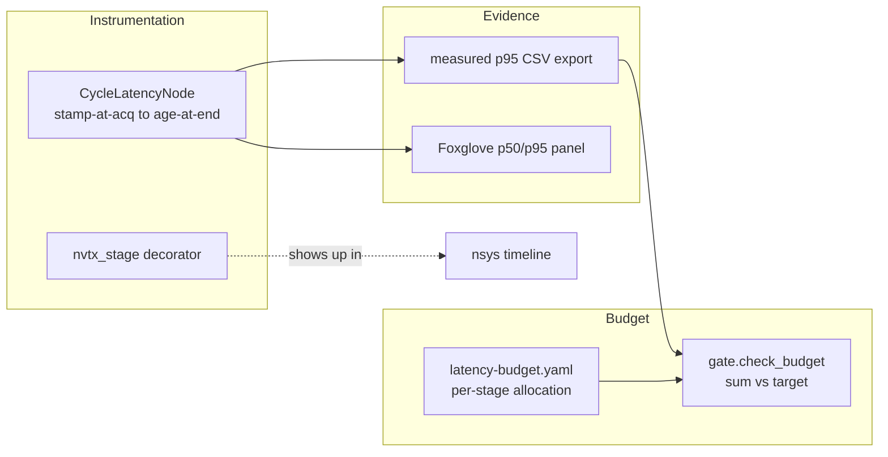

# Mini-Project — `crunchbot_latency`: Profile, Optimize, and Gate the Edge Graph

> **Phase 5 / Week 39 deliverable.** This mini-project produces the reusable profiling-and-budget package and the latency report that make your **Week 40 capstone-milestone** graph fit on the robot. The optimized graph and the version-controlled budget you build here are inputs to the capstone integration — do this honestly or arrive at Week 40 with a graph that does not fit.

## What you're building

A small, reusable ROS2 + Python package, `crunchbot_latency`, that any week of the capstone can import, plus the latency report that is itself a portfolio artifact. By the end you will have:

1. A **stage-latency instrumentation** library — NVTX annotations + a ROS2 cycle-latency publisher (stamp-at-acquisition → age-at-end) that emits `/perception/cycle_latency_ms` and per-stage `/latency/<stage>_ms`.
2. A **budget artifact** — `latency-budget.yaml` in the repo that allocates the 50 ms cycle across stages, plus the `check_budget` gate (from Exercise 3) wired to run in CI and fail when the sum regresses.
3. An **optimized integrated graph** — the Week 13 detector + a depth/projection stage + the Week 29/37 policy, brought under 50 ms p95 on Orin (or a documented Path B stand-in), with the optimizations recorded.
4. A **latency report** — `latency-report.md` with the before/after, the per-change accuracy cost, and the headline marker line.

This is not throwaway code. `crunchbot_latency` rides into the capstone and is what produces the latency numbers you cite when the Week 48 panel asks "how do you know it fits?"

## Why this is the mini-project

Every other Phase-5 week added a *capability*. This week adds a *constraint discipline*. Your capstone has, by Week 40, all the capability it needs — perception, policy, planning, control. What it does not yet have is proof that the sum of those capabilities fits the cycle the robot must hit to be safe in a shared space. A control loop that misses its deadline because perception ran long is a safety event, not a performance footnote. `crunchbot_latency` is the apparatus that turns "I think it's fast enough" into "p95 is 44 ms, here's the panel, here's the budget, here's the CI gate that keeps it there." That sentence is the difference between a demo and a robot.

## Honoring the compounding chain

This package reaches back across the whole track:

- **Week 5** gave you QoS discipline — the cycle-latency publisher only works if every sensor message is stamped at *acquisition* time, not publish time. A late stamp poisons your latency number exactly the way it poisons the EKF.
- **Week 13** gave you the TensorRT detector — the first model you profile and quantize here.
- **Week 16** gave you the 30 ms perception cycle — the latency budget you build here is the grown-up version of that target.
- **Week 29 / 37** gave you the policy — the second-heaviest stage in the graph and the one most sensitive to precision (Lecture 2 §4.2).

Every number in your report should trace to one of these. That traceability is what makes the report a defense artifact and not a benchmark printout.

---

## Architecture of the package

`crunchbot_latency` has three pieces that compose into one workflow:



The instrumentation produces the measured numbers; the budget consumes them and gates; the evidence makes the whole thing visible to a human and to CI. Build it in that dependency order — you cannot gate a number you cannot measure.

## Part 1 — The instrumentation library

Build the `crunchbot_latency` package with:

- A small `nvtx_stage` decorator/context-manager that wraps a stage and, when `nsys` is recording, emits an NVTX range; when it is not, it is a no-op with negligible overhead. This is what makes your stages show up as named bars in the timeline (Lecture 1 §3.2).
- A `CycleLatencyNode` that subscribes to the graph's *first* message (with its acquisition stamp) and its *last* message, computes the age, and publishes `/perception/cycle_latency_ms`. It also maintains a sliding-window p50/p95 and publishes those, so Foxglove shows the tail, not just the mean.
- A `--export` flag that dumps the last N samples to CSV for the report.

**Acceptance:** `ros2 run crunchbot_latency cycle_latency_node` publishes a live p95 you can plot in Foxglove. The NVTX ranges appear as named bars in an `nsys` capture.

The decorator should be a thin wrapper that is a no-op when NVTX is not active, so you can leave it in production code without overhead:

```python
import functools
try:
    import nvtx
    _HAVE_NVTX = True
except ImportError:
    _HAVE_NVTX = False

def nvtx_stage(name, color="green"):
    def deco(fn):
        if not _HAVE_NVTX:
            return fn
        @functools.wraps(fn)
        def wrapper(*a, **k):
            with nvtx.annotate(name, color=color):
                return fn(*a, **k)
        return wrapper
    return deco
```

This is the discipline that lets your ROS2 stages appear as named bars in the `nsys` timeline (Lecture 1 §3.2) without forking your code into "profiling" and "production" variants — the same code runs both ways.

## Part 2 — The budget artifact and the CI gate

- Write `latency-budget.yaml`: the per-stage budget allocation summing to ≤ 50 ms with headroom.
- Adapt Exercise 3's `check_budget` into a `crunchbot_latency.gate` module that loads the YAML budget and a measured-p95 CSV (from Part 1's `--export`) and exits non-zero when the sum exceeds the cycle target.
- Wire it as a CI step (a `pytest` test or a CI job) so a PR that regresses the sum *fails the build*. Include the failing output in your report so a reviewer sees the gate working.

**Acceptance:** committing a deliberately-regressed measured CSV turns the CI gate red; the fixed CSV turns it green. The gate's verdict is driven by the *sum*, with the worst-offender stage named (Lecture 1 §2).

A minimal `latency-budget.yaml` to model:

```yaml
cycle_target_ms: 50.0
power_mode: "nvpmodel -m 0 (15 W)"
stages:
  - {name: camera_capture, budget_ms: 3}
  - {name: preprocess,     budget_ms: 4}
  - {name: detector_yolo,  budget_ms: 12}
  - {name: depth_project,  budget_ms: 8}
  - {name: fusion,         budget_ms: 5}
  - {name: policy_vla,     budget_ms: 14}
  - {name: safety_filter,  budget_ms: 2}
```

The gate loads this, joins it to the measured-p95 CSV your `CycleLatencyNode --export` produced, and applies the Exercise 3 logic. Keeping the budget in YAML (not hardcoded) means a reviewer reads the *intent* (the allocation) separately from the *evidence* (the measurements) — and a PR that changes either is visible in the diff.

## Part 3 — Optimize the graph

Stand up the integrated graph and bring it under budget using the per-stage, diagnosis-driven ladder (this is the challenge, folded into the project as the build):

- Profile (Exercise 1) → diagnose each over-budget stage compute- vs memory-bound.
- Apply the right lever per stage (Lecture 2 §8): FP16/INT8 for compute-bound, composable container/zero-copy for memory-bound.
- Measure the accuracy cost of every accuracy-bearing change (Exercise 2's loop) against a declared floor.
- Re-measure the whole graph after each change.

**Acceptance:** the graph measures ≤ 50 ms p95 over 500+ cycles at a pinned power mode, with margin, and every optimization has a recorded latency win and accuracy cost.

## Part 3.5 — The diagnosis log

As you optimize (Part 3), keep a running diagnosis log — one line per stage you touched, recording the compute-vs-memory call and the profiler evidence behind it. This is not busywork: it is the artifact that proves, in the defense, that your fixes were diagnosis-driven and not guesses. A reviewer who sees "depth_project: GPU 44%, 9.1 ms memcpy bar → memory-bound → composable container" trusts the fix; a reviewer who sees "made depth faster" does not. The log is also where you catch yourself reaching for the wrong rung — if you wrote "compute-bound" but the GPU was idle, you'll see the contradiction before you waste a day.

## Part 4 — The latency report

Write `latency-report.md`:

- The pinned conditions (power mode, Path A/B, thermal note).
- The starting profile and the diagnosis per over-budget stage.
- The optimization log (per change: stage, diagnosis, lever, latency before/after whole-graph, accuracy before/after, decision).
- The final green budget table.
- The headline marker line (baseline p95, optimized p95, named accuracy cost).

---

## Grading rubric (100 points)

| Component | Points | Full marks |
|---|---:|---|
| Instrumentation library | 18 | NVTX ranges show in `nsys`; live p50/p95 cycle-latency publisher; CSV export |
| Budget artifact + CI gate | 20 | `latency-budget.yaml` in repo; gate fails on regression, passes when fixed; sum-driven verdict |
| Diagnosis quality | 16 | Each over-budget stage correctly labeled compute- vs memory-bound, with profiler evidence |
| Optimization + both columns | 22 | Graph ≤ 50 ms p95 with margin; every change has a measured latency win AND accuracy cost |
| Accuracy floors honored | 12 | Floors declared up front; no optimization shipped below floor (or rolled back with a note) |
| Report quality | 12 | Reproducible conditions; headline marker line; traces numbers to the compounding chain |

**Pass threshold: 75/100.** Note the weighting: the budget gate (20) and the optimization-with-both-columns (22) carry the most, because a budget you cannot enforce and a speedup you did not price are the two failure modes this week exists to prevent. A report whose "optimized" number was measured on a throttling device, or whose accuracy cost is missing, fails those components regardless of the rest.

## A note on honesty

The single most common way this mini-project goes wrong is a fast number measured under conditions you would never ship in: a cold device, a single warm-up-free run, the mean instead of p95, or a resolution drop that quietly tanked accuracy. The Week 48 panel will ask "under what power mode, over how many cycles, and what did it cost you in mAP?" If you cannot answer all three, your 44 ms is a number you cannot defend. Pin the mode, measure the tail, price the accuracy. A slightly slower number you can defend beats a faster one you cannot.

## A worked example of the deliverable

To anchor what "done" looks like, here is the shape of a passing `latency-report.md`'s core:

```text
Conditions: Orin Nano 8GB, nvpmodel -m 0 (15 W), jetson_clocks on, ambient ~22C,
            steady-state (20 min warm), 500-cycle Foxglove p95. Path A.

Starting profile (worst offenders):
  detector_yolo  24.8 ms p95  | GPU 99% pinned -> COMPUTE-bound
  depth_project  17.2 ms p95  | GPU 44%, 9.1ms memcpy bar -> MEMORY-bound

Optimization log:
  1. detector FP16->INT8 PTQ (600 warehouse frames, entropy, per-channel)
     whole-graph p95 68.5 -> 52.1 ms | mAP@0.5 0.512 -> 0.498 (-1.4, floor 0.48) ACCEPT
  2. depth_project -> composable container (eliminate pointcloud serialization)
     whole-graph p95 52.1 -> 44.0 ms | outputs bit-identical (0 accuracy cost) ACCEPT

Final budget: SUM 44.0 ms p95 (target 50, margin +6.0) -> PASS

Marker:
  baseline  68.5 ms p95 (FAIL)
  optimized 44.0 ms p95 (PASS — INT8 detector + composable depth)
  accuracy cost: detector mAP@0.5 -1.4 pts (within 3-pt floor)
```

Notice every property the rubric rewards: pinned conditions, a diagnosis per stage, both columns per change, whole-graph re-measurement after each change, and a margin that survives thermal drift. That is the bar.

## Stretch goals

- Add a **thermal-soak mode** to `CycleLatencyNode` that flags when p95 drifts up as `tj@` climbs — the steady-state number is the real one.
- Add a **per-stage regression bisect**: when the sum regresses in CI, have the gate report which stage moved most since the last green commit.
- Publish the budget table to the **Foxglove dashboard** as a live panel so the operator sees the cycle's headroom in real time — a strong fleet-ops touch that compounds into Week 43.
