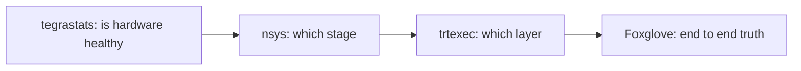
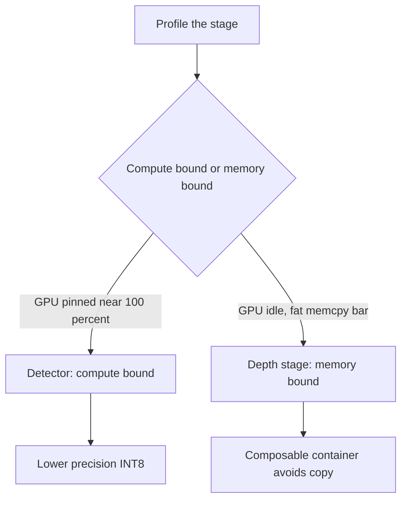

# Lecture 1 — The Latency Budget Is an Artifact, and the Profiler Is the Only Truth

> **Duration:** ~2 hours of reading + hands-on.
> **Outcome:** You can write a version-controlled latency budget for a robot's autonomy graph, profile that graph on a Jetson Orin without guessing, read an `nsys` timeline and a `trtexec` per-layer profile, and point — with a number — at the single most expensive millisecond in your pipeline.

If you remember one sentence from this entire week, remember this one:

> **On edge compute, you do not optimize what feels slow — you optimize what the profiler proves is slow, and you re-measure after every change.**

Every robotics engineer who has shipped on a Jetson has the same scar: a week spent hand-optimizing a node that turned out to consume 0.4 ms while the actual bottleneck — a pointcloud being deep-copied across a process boundary — sat in plain sight consuming 31 ms. The profiler would have told them in ten minutes. Intuition told them nothing useful for five days. This lecture is about building the discipline that makes that mistake impossible.

---

## 1. Why the edge is different

Your Week 13 detector hit 30 FPS on a desktop RTX card with 24 GB of dedicated VRAM and a 350 W power budget. The robot does not carry that card. It carries a **Jetson Orin Nano**: a 6-core Arm CPU, an Ampere GPU with 1024 CUDA cores and 32 tensor cores, and — this is the part that bites — **8 GB of LPDDR5 shared between CPU and GPU**, inside a **7–15 W power envelope**. There is no separate VRAM. Every byte the GPU touches lives in the same memory the CPU and the OS are using.

Three consequences flow from this, and they shape everything in this week:

1. **Memory bandwidth is the scarce resource, not FLOPs.** On a workstation you are usually compute-bound. On Orin you are frequently *bandwidth-bound* — the GPU finishes the math and then waits for the next tensor to arrive over a memory bus it shares with the CPU. This is why moving data efficiently (Lecture 2 §7) often buys more than making the math cheaper.

2. **Power and thermal are dynamic.** The Orin clocks itself down when it gets hot or hits its power cap. Your model that ran at 28 ms in a cool lab at 9 a.m. runs at 41 ms at 3 p.m. after the chassis warmed up. If you do not pin the power mode and watch `tegrastats`, your numbers are fiction. (More in §5.)

3. **Three "fast enough" models are not a fast graph.** The detector (15 ms), the policy (20 ms), and the VLA (40 ms) each looked fine alone. Run sequentially in one cycle they are 75 ms, and that is before the host↔device copies between them. The integration is where the budget dies.

The job this week is not "make the model fast." It is **"make the *graph* fit the cycle, and know what you paid."**

### 1.1 The Orin Nano numbers you must internalize

Concrete, because the constraint is concrete. The Orin Nano (8 GB, the cheapest Orin and the one Path A learners buy) has, in round numbers:

- **~1024 CUDA cores + 32 tensor cores**, Ampere architecture. The tensor cores do FP16 and INT8 matrix-multiply at multiples of the FP32 CUDA-core rate — which is *why* precision is your biggest single lever (Lecture 2 §2).
- **~68 GB/s of memory bandwidth** shared across CPU, GPU, and everything else. Compare a desktop RTX 4090 at ~1000 GB/s — roughly 15x. This single ratio is why a graph that is compute-bound on the desktop becomes memory-bound on Orin.
- **A 7 W / 15 W / 25 W (Super) power envelope**, selected with `nvpmodel`. More watts = higher sustained clocks = lower latency, at the cost of battery and heat. The power mode is a *design parameter*, not a detail.
- **No discrete VRAM.** The "GPU memory" and "system memory" are the same 8 GB. A model that needs 6 GB leaves 2 GB for ROS2, the OS, your pointclouds, and your image buffers — and when you run out, the OOM killer ends a node mid-cycle and your robot stops.

Write these on a sticky note. Every optimization decision this week is, underneath, a trade against one of these four numbers.

One more consequence worth stating plainly: on a desktop you can be sloppy and get away with it, because the hardware has slack in every dimension. On Orin there is no slack. A redundant copy that the desktop's PCIe bandwidth absorbed is a measurable fraction of your cycle here. A model that's "a bit big" pushes you into swap. A power-hungry inference that ran fine plugged in throttles on battery. The edge does not forgive the sloppiness the desktop hid — which is exactly why the measure-first discipline matters more here than anywhere else you've written code.

---

## 2. The latency budget as a first-class artifact

A senior robotics engineer treats the latency budget the way a senior backend engineer treats an API contract: it is written down, version-controlled, and CI fails when it regresses. It is not a number someone remembers; it is a table in the repo.

Here is the capstone's budget. The end-to-end requirement from the syllabus is **≤ 50 ms** for the perception cycle, so we allocate the 50 ms across stages with headroom:

```text
# latency-budget.md  (lives in the repo, reviewed in PRs)
#
# Target: perception→policy cycle ≤ 50 ms p95 on Orin Nano, 15 W mode (nvpmodel -m 0)
#
# Stage              | budget (ms) | measured p50 | measured p95 | status
# -------------------|-------------|--------------|--------------|--------
# camera capture     |      3      |     2.1      |     2.8      | PASS
# preprocess (resize)|      4      |     3.0      |     3.9      | PASS
# detector (YOLO)    |     12      |     9.4      |    11.6      | PASS
# depth + projection |      8      |     6.2      |     7.7      | PASS
# fusion → /objects  |      5      |     3.8      |     4.6      | PASS
# policy (VLA chunk) |     14      |    12.1      |    13.8      | PASS
# safety filter      |      2      |     1.1      |     1.4      | PASS
# -------------------|-------------|--------------|--------------|--------
# SUM                |     48      |    37.7      |    45.8      | PASS (margin 4.2)
```

Four properties make this a real artifact and not a sticky note:

- **It allocates, then measures.** The budget column is a *design decision* made up front. The measured columns are *evidence*. The gap between them is your margin. When the measured p95 exceeds the budget for a stage, that row is the optimization target — and you do not touch any other row until that one is green.
- **It uses p95, not the mean.** A robot that drives correctly 50% of the time is not a robot. You budget against the tail. A stage with a 9 ms mean and a 22 ms p95 has a stall problem — usually a periodic GC, a thermal throttle, or a DDS retransmit — that the mean hides.
- **The sum is the gate.** Individual stages passing does not mean the graph passes. The sum row is what CI checks. Exercise 3 this week is exactly this checker.
- **It is in the repo and reviewed.** When someone adds a feature that pushes the policy stage from 14 to 19 ms, the PR shows the budget regressing and the reviewer asks "what did you cut to pay for it?" That conversation is the entire point.

> **The mental model:** a latency budget is to a real-time robot what a balance sheet is to a company. Every new feature is a withdrawal. If you do not track the balance, you go bankrupt — and on a robot, "bankrupt" means a control loop that misses its deadline and a robot that acts on stale state in a shared space.

---

## 3. The profiling toolchain, from coarse to fine

You profile top-down: start with the coarsest tool that locates the *stage*, then drill into the *kernel*. Four tools, in the order you reach for them.


*Coarse-to-fine profiling order, each tool answering a narrower question than the last.*

### 3.1 `tegrastats` — is the hardware even healthy?

Before you profile anything, run `tegrastats` in a side terminal:

```bash
sudo tegrastats --interval 500
# RAM 4123/7620MB ... CPU [34%@1510,28%@1510,...] GR3D_FREQ 99%@[1300] ...
#   ... VDD_IN 8912mW VDD_CPU_GPU_CV 3201mW tj@52.5C
```

What you are checking, in order:

- **`GR3D_FREQ`** — the GPU utilization and clock. If it reads `99%@[1300]` your GPU is pinned at full clock and you are genuinely GPU-bound. If it reads `40%@[612]` the GPU is *idle and underclocked* — you are bottlenecked somewhere else (a CPU preprocess, a copy) and the GPU is waiting.
- **`tj@`** — junction temperature. If it climbs past the throttle point (~85–95 °C depending on the module) your clocks drop and your latency jumps. A latency number measured during throttle is worthless.
- **`VDD_IN`** — total power draw. If you set `nvpmodel -m 0` (the 15 W mode) and `VDD_IN` is pinned near 15000 mW, you are power-capped — the device is doing all it can in this mode.
- **RAM** — if you are near the 8 GB ceiling, the OS starts swapping or the OOM killer wakes up, and latency goes non-deterministic.

`tegrastats` answers the first question: *is the slowness a real compute cost, or is the hardware throttling / starved / swapping?* You cannot optimize a thermal problem with a model trick.

### 3.2 `nsys` — where does the millisecond go, system-wide?

`nsys` (Nsight Systems) captures a timeline of everything: CUDA kernels, memory copies, CPU threads, and — with the right annotations — your ROS2 callbacks. This is the tool that finds the pointcloud-copy-across-a-process-boundary bug.

```bash
nsys profile -t cuda,nvtx,osrt -o cycle_trace --force-overwrite true \
  ros2 run crunchbot_perception integrated_graph_node
# ... let it run a few hundred cycles, Ctrl-C, then open cycle_trace.nsys-rep in the GUI
# or get a text summary:
nsys stats cycle_trace.nsys-rep
```

Reading the timeline, you are looking for:

- **Gaps between kernels** — if the GPU sits idle between the detector and the policy, that gap is a CPU stage or a copy, and it is time you are paying with nothing running.
- **`cudaMemcpy` bars that are wide** — a fat host-to-device or device-to-host copy is the classic edge bottleneck. On a workstation with PCIe it is annoying; on Jetson with unified memory it is *avoidable*, and avoiding it is Lecture 2 §7.
- **The critical path** — the chain of operations that, summed, equals your cycle time. Anything *not* on the critical path is a waste of optimization effort, no matter how slow it looks in isolation.

Annotate your own code with NVTX ranges so your ROS2 stages show up as labeled bars:

```python
import nvtx  # pip install nvtx

@nvtx.annotate("preprocess", color="blue")
def preprocess(self, image_msg):
    ...

@nvtx.annotate("detector_infer", color="green")
def detect(self, tensor):
    ...
```

Now the `nsys` timeline shows `preprocess`, `detector_infer`, etc. as named bars, and the critical path reads like your budget table.

### 3.3 `trtexec --dumpProfile` — which *layer* is slow?

Once `nsys` tells you the *detector stage* is the problem, `trtexec` tells you *which layer inside it*. Build the engine and dump the per-layer profile:

```bash
trtexec --onnx=yolov8n.onnx --fp16 --dumpProfile --exportProfile=prof.json \
        --iterations=200 --warmUp=500
```

The profile lists every layer (or fused block) with its average time and percentage of the total. You are reading it for two things:

- **The hotspot layer** — the one consuming, say, 38% of inference. That is where a precision change or a fusion buys the most.
- **Layers that did *not* fuse.** TensorRT prints which layers it fused (e.g. `Conv + BiasAdd + Relu` collapsed into one `CaskConvolution`). A layer that stands alone when it "should" have fused — often because an unusual activation or a reshape broke the pattern — is launch-overhead you can sometimes recover by adjusting the model export (Lecture 2 §2.3).

### 3.4 The Foxglove latency panel — the end-to-end truth in ROS2

`nsys` and `trtexec` measure the GPU. They do not measure the *ROS2* reality: DDS serialization, callback scheduling, queue waits. For the true end-to-end number you stamp the message at acquisition and again at the end of the cycle and plot the difference.

```python
# At capture (in the camera node), the stamp is the acquisition time (Week 5 discipline!).
# At the end of the cycle (in the safety-filter node), compute and publish the age:
def on_final_msg(self, msg):
    now = self.get_clock().now()
    stamp = rclpy.time.Time.from_msg(msg.header.stamp)
    age_ms = (now - stamp).nanoseconds / 1e6
    self.latency_pub.publish(Float64(data=age_ms))
```

Plot `/perception/cycle_latency_ms` in Foxglove with a p95 overlay. *This* is the number your budget's "measured p95" column comes from, because it includes everything — not just the kernels, but the queues and the copies and the DDS layer that `nsys` annotates only if you ask it to.

> **The discipline:** `tegrastats` first (is the HW healthy?), `nsys` second (which stage?), `trtexec` third (which layer?), Foxglove fourth (what does the robot actually experience?). Coarse to fine. Never start fine.

---

## 4. Reading a profile like an engineer, not a tourist

A profile is a pile of numbers until you ask it the right questions. Here is the interrogation, in order.

**Question 1: Am I compute-bound or memory-bound?** Look at `GR3D_FREQ` in `tegrastats` during the hot stage. Pinned at 99% → compute-bound; making the math cheaper (lower precision, smaller model) helps. Sitting at 40% with the kernel still slow → memory-bound; the GPU is waiting for data, and you fix it by reducing memory traffic (fewer copies, fused kernels, smaller tensors), not by reducing FLOPs.

**Question 2: Is the bottleneck on the GPU at all?** If `nsys` shows wide CPU bars between narrow GPU bars, your bottleneck is CPU-side — usually preprocessing (an OpenCV resize on the CPU, a Python loop over a pointcloud) or serialization. No amount of INT8 fixes a CPU preprocess. Move it to the GPU (CUDA resize) or off the critical path.

**Question 3: What is the launch overhead?** Each CUDA kernel launch costs a few microseconds. A model with 300 tiny un-fused layers pays that 300 times per inference. If `trtexec` shows many small layers, fusion (which precision modes enable more of) is your lever.

**Question 4: Is the tail caused by throttle or by a periodic stall?** A p95 far above p50 is either thermal (watch `tj@` — does latency spike when temp crosses the throttle point?) or a periodic event (Python GC, a DDS heartbeat, a logging flush). `nsys` over a long capture shows the periodic spike as a recurring fat bar; correlate its period.

If you can answer those four questions from your profile, you know exactly what optimization to reach for. If you cannot, you are about to guess — stop and profile more.

---

## 5. Making numbers reproducible (or your whole week is fiction)

You cannot compare a "before" and an "after" if the hardware was in a different state for each. Three habits make your numbers trustworthy:

1. **Pin the power mode and clocks.** `sudo nvpmodel -m 0` (select the mode you intend to ship in — record it!) and `sudo jetson_clocks` to lock clocks at max for the mode. Record the mode in your latency report. A number with no power mode attached is meaningless.
2. **Warm up before you measure.** The first inference includes CUDA context creation, engine deserialization, and cold caches. `trtexec` has `--warmUp=500`; in your own harness, run 50 inferences and discard them before you start timing.
3. **Measure long enough to see the tail.** p95 over 20 samples is noise. Measure 500+ cycles. The tail is where the deadline misses live, and the tail needs samples to show up.

A worked failure: a learner reports "INT8 made it 2x faster!" — 22 ms down to 11 ms. Then someone re-runs the FP16 baseline after `jetson_clocks` and it is 12 ms. The "2x" was the device having throttled during the first measurement. The fix bought 1 ms, not 11. **Always re-baseline under the same pinned conditions you measure the optimization in.**

---

## 6. The capstone latency budget, worked

Let us instantiate §2 for the actual capstone graph and walk a real optimization decision. Suppose your first integrated measurement on Orin Nano, 15 W, clocks pinned, 500 cycles, looks like this:

```text
# Stage              | budget | p50  | p95   | status
# detector (YOLO)    |   12   | 21.0 | 24.8  | FAIL  ← worst offender
# depth + projection |    8   | 14.1 | 17.2  | FAIL
# policy (VLA chunk) |   14   | 12.1 | 13.8  | PASS
# ... others pass ...
# SUM                |   48   |  ... | 88.3  | FAIL (budget 50)
```

The graph is ~1.8x over budget, driven by two stages. The discipline says: **fix the worst offender first, re-measure, then decide if you still have a problem.**

- The detector at 24.8 ms p95 against a 12 ms budget is the headline. `trtexec --fp16` already; the profile shows the backbone convolutions dominating. The lever is INT8 (Lecture 2 §3) — but INT8 costs accuracy, so you must measure the mAP delta (Exercise 2) and check it against your accuracy floor before you accept it.
- The depth+projection at 17.2 ms — `nsys` shows the GPU at 45% during this stage and a fat `cudaMemcpyDeviceToHost` bar. This is memory-bound, not compute-bound. The fix is *not* a smaller model (there is no model here, it is a projection) — it is keeping the pointcloud on the device and avoiding the copy (Lecture 2 §7), or doing the projection in a composable node so it never serializes.

Two stages, two completely different fixes, because the *profile* said so. The detector is compute-bound → cheaper precision. The projection is memory-bound and copy-dominated → composable container. A learner who reached for "INT8 everything" would have wasted effort quantizing a projection stage that has no weights to quantize. **The profile dictates the tool.**


*The profile's compute-vs-memory diagnosis picks the fix, not intuition.*

After INT8 on the detector (say it drops to 9.4/11.6) and a composable-container fix on the depth stage (say it drops to 6.2/7.7), you re-measure the *whole graph* — never trust the sum of individually-fixed stages — and you arrive at the budget table in §2, with 4.2 ms of margin and a documented -1.4 mAP cost. That is the week's deliverable.

---

### 6.1 A worked profiling session, keystroke by keystroke

To make the coarse-to-fine discipline concrete, here is the actual sequence for the depth-stage investigation from §6. You sit down at the Orin with the graph running and you do *exactly* this, in order:

```bash
# Step 0: pin the device so the numbers are reproducible (sec 5).
sudo nvpmodel -m 0          # 15 W mode — the mode we intend to ship
sudo jetson_clocks          # lock clocks at max for the mode

# Step 1: is the hardware healthy? Watch while the graph runs.
sudo tegrastats --interval 500
#   RAM 5980/7620MB ... GR3D_FREQ 44%@[612] ... VDD_IN 9100mW tj@61C
#   READ: GPU at 44% and underclocked (612, not 1300) during the slow stage
#         -> the GPU is WAITING, not working -> memory-bound, not compute-bound.
#         tj 61C is fine (no throttle). RAM 5980/7620 has headroom (no swap risk).

# Step 2: which stage, and is there a copy? Capture a system timeline.
nsys profile -t cuda,nvtx,osrt -o depth_trace --force-overwrite true \
  ros2 launch crunchbot_perception integrated_graph.launch.py
# Ctrl-C after ~300 cycles, then:
nsys stats depth_trace.nsys-rep
#   READ: a 9.1 ms cudaMemcpyDeviceToHost bar EVERY cycle in the depth stage,
#         and the GPU idle (the 44% from tegrastats) on either side of it.
#         The pointcloud is being copied device->host->(serialize)->host->device.

# Step 3: confirm there's no model layer to blame (there isn't — projection has no weights).
#   Skipped: the depth-projection stage is geometry, not a network. trtexec N/A.
#   This is the moment a naive engineer reaches for INT8 and wastes a day. There's
#   nothing to quantize. The diagnosis (memory-bound + a copy) dictates the fix.

# Step 4: the true end-to-end number, in ROS2 terms.
#   Plot /perception/cycle_latency_ms in Foxglove, p95 overlay, 500 cycles: 17.2 ms.
```

The whole investigation is fifteen minutes and it ends with a *diagnosis*, not a guess: the depth stage is memory-bound and copy-dominated, so the fix is a composable container (Lecture 2 §7), not a model trick. Contrast the engineer who skipped to Step 3's instinct ("quantize it!") and burned a day on a stage with no weights to quantize. The order — health, then stage, then layer, then end-to-end — is what makes the difference.

### 6.2 Why you fix the worst offender first (and only it)

A subtle discipline: when two stages are over budget, you fix *one*, re-measure the *whole graph*, and only then decide whether the second still needs work. Two reasons:

- **The second fix may become unnecessary.** Fixing the detector might free thermal/clock headroom that the depth stage was being starved of, shrinking the depth stage "for free." You will not know until you re-measure.
- **The second fix may interact.** Moving the depth stage into a composable container changes the process layout, which changes how the detector's kernels schedule. The graph is a system; its parts are coupled. Fix-one-then-remeasure is the only honest way to attribute a change.

This is the same reason you re-baseline under pinned conditions (§5): a system measurement is only valid against a single, fixed system state. Change one thing, re-measure everything.

---

## 7. The accuracy-latency contract

Every latency win on the edge has a price, and the engineering is in *pricing it honestly*. A speedup with no accuracy number attached is not a result; it is a liability you have not measured yet.

The contract has two columns and you fill in both for every optimization:

| Optimization | Latency win | Accuracy cost (measured, on a held-out set) |
|---|---|---|
| FP32 → FP16 | ~1.6x on the detector | mAP@0.5 0.512 → 0.512 (none — FP16 is effectively free on Orin tensor cores for detection) |
| FP16 → INT8 (PTQ) | ~1.8x further | mAP@0.5 0.512 → 0.498 (-1.4 pts — within the 3-pt floor) |
| Channel pruning 30% | ~1.3x | mAP 0.512 → 0.471 (-4.1 pts — **rejected**, exceeds the floor) |

The accuracy floor is a *task decision* you make before you optimize: "the detector must stay above mAP@0.5 of 0.48 or it misses too many objects for the grasp policy to work." Then any optimization that breaks the floor is rejected, no matter how fast it is. FP16 is usually free (the tensor cores do FP16 natively and detection tolerates it). INT8 usually costs 1–3 points and is usually worth it. Aggressive pruning often costs more than it is worth on Orin because the structured speedup is modest. *You do not know which until you measure both columns.*

This is why Exercise 2 makes you measure the mAP delta, not just the speedup. An engineer who reports "I quantized the detector to INT8 and it's 1.8x faster" without the accuracy number has done half the job and the dangerous half is the part they skipped.

---

## 8. Common edge-profiling mistakes (the ones that cost days)

- **Measuring on the desktop and assuming it transfers.** The desktop has dedicated VRAM, no power cap, and 10x the bandwidth. A graph that fits on the desktop tells you nothing about whether it fits on Orin. Profile on the target.
- **Optimizing off the critical path.** Speeding up a node that runs in parallel with a slower one buys zero end-to-end. Read the critical path off `nsys` before you touch anything.
- **Trusting the mean.** The robot misses deadlines at the tail. Budget and measure p95 (or p99 for the safety-critical control loop).
- **Forgetting the copies.** On a workstation a host↔device copy hides in PCIe. On Jetson it is avoidable, and the un-avoided copy is frequently the single biggest line in the profile.
- **Not pinning the power mode.** Numbers measured in different power/thermal states are not comparable. Pin `nvpmodel`, run `jetson_clocks`, watch `tegrastats`, re-baseline.
- **Quantizing without an accuracy floor.** A fast model that misses objects is slower-to-mission than a correct one that takes 3 ms more. Set the floor first.

### 8.1 The "it was fine yesterday" class of bug

A whole family of edge-latency surprises share one root cause: *the system state changed and you didn't notice*. They are worth naming because they cost the most debugging time:

- **Thermal drift.** The lab was cool this morning; by afternoon the chassis is warm and `tj@` crossed the throttle point. Same code, +40% latency. Fix: report steady-state (warm) latency, and watch `tj@` during every measurement.
- **A background process woke up.** A logging flush, an OTA-check daemon, a `ros2 bag` you forgot was recording — any of these steals CPU/memory bandwidth periodically and spikes your p95. Fix: profile a clean system, and check what else is running with `htop`/`tegrastats`.
- **The power mode reset on reboot.** `nvpmodel` and `jetson_clocks` do not always persist across reboots depending on config. You measured in 15 W on Monday, the robot rebooted, and Tuesday it's in 7 W. Fix: set the power mode in your bring-up, and assert it in your launch.
- **A different input distribution.** The detector is slower on cluttered scenes (more boxes to decode) than on empty ones. Your "fast" number was on an easy scene. Fix: measure p95 on representative, busy inputs.

The meta-lesson is the same as §5: a latency number is only meaningful relative to a *fully specified system state*. When a number changes and the code didn't, the state did — find what.

---

## 9. What you can now do

You can write a latency budget that allocates a real-time cycle across stages, measure each stage's p95 on the actual edge hardware, and read four profilers in the right order to locate a bottleneck to the layer. You can tell compute-bound from memory-bound and pick the right lever for each. And you can state — with a measured number — the single most expensive millisecond in your graph and exactly what it would cost in accuracy to buy it back.

That last skill is the whole job. Lecture 2 gives you the levers: precision modes, quantization, pruning, distillation, and the memory tricks that make the copies disappear. Bring the budget table from this lecture — every lever in Lecture 2 is a row you are trying to turn green.

---

### Section recap

| § | The one thing to take away |
|---|---|
| 1 | Edge ≠ desktop: 8 GB shared memory, a power cap, and bandwidth (not FLOPs) is the scarce resource. |
| 2 | The latency budget is a version-controlled artifact: allocate, measure p95, gate on the sum. |
| 3 | Profile coarse-to-fine: `tegrastats` → `nsys` → `trtexec` → Foxglove. |
| 4 | Interrogate the profile: compute- vs memory-bound, on-GPU?, launch overhead, throttle vs stall. |
| 5 | Pin power mode, warm up, measure 500+ cycles — or your before/after is fiction. |
| 6 | Fix the worst offender first; the profile, not intuition, picks the tool per stage. |
| 7 | Every latency win has a measured accuracy cost; an unpriced speedup is a liability. |
| 8 | The day-costing mistakes: wrong hardware, off-critical-path, trusting the mean, ignoring copies. |

> **One closing habit:** keep the budget table open in a terminal split while you work, and update the measured columns after every change. The budget is not a document you write at the end to look professional — it is the instrument you steer by, the whole time. An engineer who treats it that way never ships a graph that misses its deadline, because they would have seen the regression the moment it happened.

*Read Lecture 2 next; it is the toolbox for the budget you just learned to write.*
