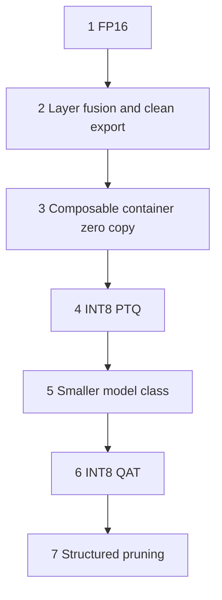
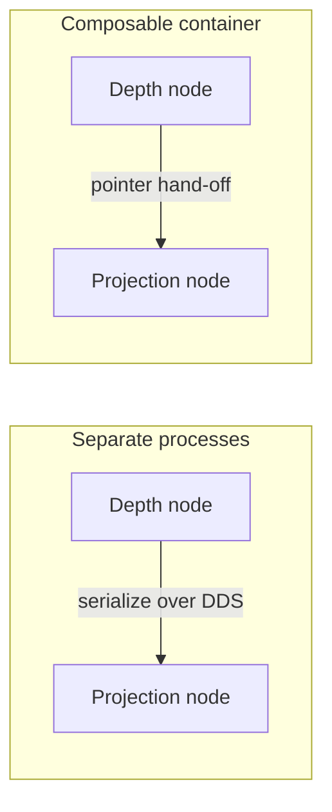

# Lecture 2 — The Toolbox: Precision, Quantization, Pruning, Distillation, and the Memory Hierarchy

> **Duration:** ~2 hours of reading + hands-on.
> **Outcome:** You can build a TensorRT engine in FP16 and INT8, calibrate INT8 with a representative set and measure the accuracy delta, reason about when QAT beats PTQ, judge honestly which pruning/sparsity/distillation tricks pay off on Orin, and eliminate the host↔device copies that dominate edge graphs by using unified memory and composable ROS2 nodes.

Lecture 1 taught you to find the slow millisecond. This lecture is the toolbox for buying it back. Every tool here is a row you are trying to turn green in the budget table, and every tool has a cost you must measure. We go in the order you should *try* them, cheapest-and-safest first.

---

## 1. The optimization ladder (try them in this order)

When a stage is over budget, you climb this ladder from the top. Each rung is cheaper to apply and lower-risk than the one below it. You stop the moment the stage clears its budget.

1. **FP16.** Nearly free on Orin's tensor cores, usually zero accuracy cost for detection/depth. Try this first; it often alone clears the budget.
2. **Layer fusion + a clean ONNX export.** Free; just rebuild the engine and fix exports that broke fusion.
3. **Composable container / zero-copy** (§7). Free of accuracy cost; eliminates the copies that dominate memory-bound stages. Frequently the biggest single win.
4. **INT8 PTQ** (§3). Cheap (a calibration set, no retraining), ~1–3 mAP cost. The workhorse.
5. **A smaller model class** (e.g. YOLOv8n → a distilled variant). Moderate effort; measure accuracy.
6. **INT8 QAT** (§4). Expensive (a training loop), recovers PTQ's accuracy loss. Reach for it only when PTQ breaks your floor but you still need INT8.
7. **Structured pruning** (§5). Expensive (retraining) and the Orin speedup is often modest. Last resort, and measure both columns ruthlessly.


*Climb the optimization ladder cheapest and lowest-risk first; stop the instant the stage is green.*

The discipline from Lecture 1 still rules: you only climb the ladder for the stage the profiler named, and you re-measure after every rung.

### 1.1 Why this order, specifically

The ladder is ordered by **cost-to-apply** times **risk**, ascending:

- Rungs 1–3 (FP16, fusion, composable containers) cost *minutes* and risk *nothing* — FP16 is a build flag, fusion is automatic, composable containers are a launch-file change, and none of them touch model accuracy. You should reach for these reflexively before you even think about quantization.
- Rung 4 (INT8 PTQ) costs *hours* (assemble a calibration set, build, evaluate) and risks *1–3 accuracy points*. It is the first rung with a real accuracy cost, so it is the first rung that requires the both-columns discipline.
- Rungs 5–7 (smaller model, QAT, structured pruning) cost *days* (a training loop, possibly a re-architecture) and risk *significant accuracy*. These are last resorts, reached only when the cheap rungs leave you over budget.

A learner who starts at rung 7 — "let me prune the network" — has chosen the most expensive, highest-risk option first, for a problem FP16 might have solved in one build. The ladder exists to stop that instinct. Climb from the top; stop the instant the stage is green.

---

## 2. TensorRT precision modes

TensorRT takes an ONNX graph and builds an optimized engine for *your specific GPU*. The single most important builder decision is precision.

### 2.1 The three modes

- **FP32** — the baseline. Full precision, slowest, the accuracy reference you compare everything to.
- **FP16** — half precision. Orin's tensor cores execute FP16 matrix-multiply natively at roughly 2x FP32 throughput. For convolutional detectors and depth networks the accuracy cost is typically *unmeasurable* — the dynamic range of FP16 comfortably covers activations. This is the free lunch; take it first.
- **INT8** — 8-bit integer. Roughly another ~2x over FP16 on tensor cores, *and* it halves the memory traffic (which matters more than the math on bandwidth-bound Orin). The cost is real: INT8 has only 256 levels, so you must *calibrate* the scale factors (§3), and you typically pay 1–3 points of accuracy.

Build flags with `trtexec`:

```bash
# FP16 — try this first
trtexec --onnx=yolov8n.onnx --fp16 --saveEngine=det_fp16.plan

# INT8 (needs a calibration cache, see §3) — the real win
trtexec --onnx=yolov8n.onnx --int8 --fp16 \
        --calib=calib.cache --saveEngine=det_int8.plan

# --best lets TRT pick per-layer precision (mixed) to hit the fastest valid config
trtexec --onnx=yolov8n.onnx --best --saveEngine=det_best.plan
```

Note `--int8 --fp16` together: you allow TensorRT to keep precision-sensitive layers in FP16 and quantize the rest to INT8. This *mixed precision* is almost always better than forcing every layer to INT8 — the calibrator may decide a particular layer (often the detection head, which is sensitive) stays FP16. `--best` automates this choice.

### 2.2 Layer fusion

TensorRT's biggest non-precision win is fusion: it collapses `Conv → BiasAdd → ReLU` into a single kernel, eliminating two kernel launches and two round-trips to memory. On bandwidth-bound Orin, the avoided memory traffic matters as much as the avoided launches. You do not ask for fusion; the builder does it automatically — but you can *break* it.

### 2.3 Why a layer fails to fuse (and how to fix the export)

Fusion is pattern-matching, and unusual exports break the pattern:

- **A non-standard activation** (a custom Swish written as separate ops instead of one) sits between Conv and the next layer and blocks the fuse. Fix: export the activation as a single recognized op.
- **A reshape or transpose** inserted by a sloppy `torch.onnx.export` between conv layers. Fix: export with `do_constant_folding=True` and a recent opset (17+), which folds many of these away.
- **Dynamic shapes** with no optimization profile. Fix: give `trtexec` an explicit `--minShapes/--optShapes/--maxShapes` so it can specialize.

Read the `--dumpProfile` output (Lecture 1 §3.3): standalone layers that "should" be part of a Conv block are your fusion-break suspects. A clean re-export often recovers several milliseconds for free.

### 2.4 Reading what fused, in practice

When you run `trtexec --dumpProfile`, the layer names tell you the fusion story. A *fused* block reports as a single fused kernel:

```text
# GOOD — the conv + bias + activation collapsed into one tactic:
[I] Layer(CaskConvolution): backbone.0.conv + backbone.0.bn + backbone.0.act, 0.42 ms
```

An *un-fused* sequence reports as separate layers, each with its own (small but additive) time:

```text
# BAD — three separate kernels where one was possible:
[I] Layer(Convolution): backbone.3.conv, 0.31 ms
[I] Layer(Scale): backbone.3.bn, 0.08 ms        <- should have fused into the conv
[I] Layer(PWN): backbone.3.act_custom, 0.11 ms  <- a custom activation broke the pattern
```

The three-kernel version pays three launch overheads and three memory round-trips for work the fused version does once. The fix is almost always in the *export*, not TensorRT: in the example above, `act_custom` was a hand-written activation that PyTorch exported as a generic pointwise op TensorRT couldn't recognize; swapping it for a standard `SiLU`/`ReLU` op lets the fuse happen. On a backbone with dozens of such blocks, recovering the fusions can be a 10–20% win at zero accuracy cost — which is why a clean re-export sits at rung 2 of the ladder, above INT8.

---

## 3. Post-Training Quantization (PTQ): the workhorse

PTQ converts an already-trained FP model to INT8 *without retraining*. The challenge: a float value can be anything in a wide range, but INT8 has 256 buckets. You need a *scale factor* per tensor that maps the float range onto those buckets with minimal information loss. Picking those scales is **calibration**.

### 3.1 The calibration set

You feed TensorRT a few hundred *representative* inputs — real frames from your robot's camera, in the lighting and scenes it will actually see. TensorRT runs them through the FP model, records the distribution of activations at each layer, and chooses scales that minimize the quantization error on *that distribution*.

Two rules decide whether calibration succeeds:

- **Representative, not random.** If your robot works in a warehouse, calibrate on warehouse frames, not COCO. The scales are tuned to the distribution you show; show the wrong distribution and INT8 will be accurate on images you do not care about and wrong on the ones you do.
- **Enough, not too many.** 300–1000 frames is the usual sweet spot. More rarely helps; fewer risks scales tuned to an unrepresentative handful.

### 3.2 The calibrator algorithm

TensorRT offers calibrators; the two you will meet:

- **Entropy calibration (default, recommended).** Chooses the scale that minimizes the KL-divergence between the FP and INT8 activation distributions. It deliberately clips the long tail of outliers because spending precious buckets on rare extreme values starves the common values. This is almost always the right choice.
- **Min-max calibration.** Uses the full observed range. One outlier activation stretches the range and wastes buckets — usually worse than entropy. Use it only when you have a reason.

### 3.3 Per-tensor vs per-channel scales

A single scale for a whole convolution weight tensor (per-tensor) is coarse; a scale per output channel (per-channel) tracks the fact that different filters have different magnitudes. Per-channel weight quantization is the modern default and recovers most of the accuracy that naive per-tensor INT8 loses. TensorRT does this for you in explicit-quantization mode; it is why 2026-era INT8 is much better than the 2018 reputation suggests.

### 3.4 Measuring the cost (the half everyone skips)

The speedup is the easy half. The discipline is measuring the accuracy delta on a *held-out* eval set (not the calibration set — that would be cheating):

```text
Detector accuracy, held-out eval (500 images):
  FP16 baseline:  mAP@0.5 = 0.512
  INT8 (entropy, 600-frame calib): mAP@0.5 = 0.498   →  -1.4 pts
  Accuracy floor (task decision):  0.480
  Verdict: ACCEPT (above floor, 1.8x speedup)
```

Exercise 2 walks this exact loop. If your INT8 result drops *below* the floor, your options in order: better calibration set (most common fix), mixed precision (keep the head FP16), or — if you truly need INT8 and PTQ cannot reach the floor — QAT.

### 3.5 The calibrator, in code

For completeness, the shape of a TensorRT INT8 entropy calibrator in Python — what `--calib` is doing under the hood when you build with `trtexec`, and what you write by hand when you need control over which frames feed it:

```python
import tensorrt as trt

class WarehouseCalibrator(trt.IInt8EntropyCalibrator2):
    def __init__(self, frames, batch_size=8):
        super().__init__()
        self.frames = frames          # REPRESENTATIVE frames from the robot's domain
        self.batch_size = batch_size
        self.idx = 0
        # allocate a device buffer for one batch (omitted: cudaMalloc)

    def get_batch_size(self):
        return self.batch_size

    def get_batch(self, names):
        # Yield the next batch of representative frames, or None when exhausted.
        if self.idx + self.batch_size > len(self.frames):
            return None
        batch = self.frames[self.idx:self.idx + self.batch_size]
        self.idx += self.batch_size
        # copy `batch` to the device buffer, return [int(device_ptr)]
        return [self.device_input]

    def read_calibration_cache(self):
        # Reuse a cached calibration if present — calibration is slow, cache it.
        try:
            with open("calib.cache", "rb") as f:
                return f.read()
        except OSError:
            return None

    def write_calibration_cache(self, cache):
        with open("calib.cache", "wb") as f:
            f.write(cache)
```

Two things to notice. First, `get_batch` is where the *representative-frames* rule (§3.1) lives — you control exactly what distribution the scales are tuned to, by choosing what `self.frames` contains. Second, the cache: calibration runs the FP model over hundreds of frames and is slow, so TensorRT caches the chosen scales; on a rebuild it reuses them. The common bug is shipping a stale `calib.cache` from a different domain — delete it when you change the calibration set.

---

## 4. Quantization-Aware Training (QAT): when PTQ is not enough

PTQ quantizes a model that was trained in float and never knew it would be quantized. QAT *trains the model to expect quantization*.

### 4.1 How it works

You insert **fake-quant** nodes into the graph: ops that, on the forward pass, round the value to the INT8 grid and immediately back to float (so the rest of training runs in float, but every quantized tensor has been "snapped" to the grid it will live on at deployment). The model's weights then learn, over a fine-tuning run, to be robust to that rounding — it shifts weights so the rounding hurts less.

The catch: rounding has zero gradient (it is a step function), so you cannot backprop through it. The **straight-through estimator (STE)** is the trick — on the backward pass you pretend the rounding was the identity and pass the gradient straight through. It is theoretically a fudge and empirically it works extremely well.

### 4.2 When to reach for it

QAT costs a training loop — data, GPU hours, the whole apparatus. So you reach for it only when:

- PTQ drops below your accuracy floor, **and**
- you genuinely need INT8 (FP16 does not clear the budget), **and**
- the accuracy matters enough to justify the training cost.

For most detection tasks in 2026, modern per-channel PTQ clears the floor and you never need QAT. QAT earns its keep on aggressive low-bit (INT4) quantization and on precision-sensitive models — and, notably, on **policies**: a Diffusion Policy's denoising is more quantization-sensitive than a detector, so if you must quantize a policy, QAT is more often necessary than it is for perception.

### 4.3 The 2026 tooling

Use NVIDIA's **TensorRT Model Optimizer** (the successor to `pytorch-quantization`). It inserts the fake-quant nodes in the right places for TRT deployment, runs the QAT fine-tune, and exports an ONNX graph with explicit quantize/dequantize nodes that TRT consumes directly — so the QAT scales survive into the engine instead of being re-derived by PTQ calibration. The common mistake is to QAT a model and then let `trtexec` re-calibrate it with PTQ, throwing away everything QAT learned. Export the Q/DQ nodes; do not re-calibrate.

---

## 5. Pruning and sparsity: the honest accounting

Pruning removes weights to make the model smaller and (sometimes) faster. The literature is full of impressive compression ratios. On Orin in 2026, the honest story is narrower than the papers suggest.

### 5.1 Unstructured pruning — great on paper, rarely faster on GPU

Magnitude pruning zeroes the smallest weights individually. You can zero 70% of a network and barely lose accuracy. But the resulting sparsity is *irregular* — zeros scattered everywhere — and GPUs execute dense matrix multiplies. A matrix that is 70% zeros still costs the full dense multiply on a GPU unless you have hardware that exploits the specific sparsity pattern. So unstructured pruning shrinks the *file* but usually does **not** speed up inference on Orin. Useful for memory-constrained deployment; not a latency tool.

### 5.2 Structured pruning — real speedup, real cost

Channel (filter) pruning removes whole output channels, which makes the layer *genuinely smaller* — fewer real FLOPs, fewer real bytes. This *does* speed up GPU inference because the resulting model is just a smaller dense model. The cost: removing channels hurts accuracy more than scattered weight removal, so you must retrain (fine-tune) to recover, and the recoverable accuracy is task-dependent. On the detector in our running example, 30% channel pruning cost 4.1 mAP points — over the floor — so we *rejected* it (Lecture 1 §7). Sometimes it pays; you measure both columns and let the numbers decide.

### 5.3 2:4 structured sparsity — the hardware-accelerated middle ground

NVIDIA Ampere/Orin tensor cores natively accelerate a *specific* sparsity pattern: in every group of 4 weights, exactly 2 are zero (2:4). The hardware skips the zeros, giving up to ~2x on the affected layers. You enable it at build time:

```bash
trtexec --onnx=model.onnx --int8 --sparsity=enable --saveEngine=model_sparse.plan
```

The honest caveats: (1) the model must actually be trained/fine-tuned to the 2:4 pattern (NVIDIA's ASP tool does this) — `--sparsity=enable` on a dense model does nothing useful; (2) the speedup applies only to layers whose shapes the tensor cores can sparsify, so the *graph-level* win is usually well under the per-layer 2x; (3) you stack it with INT8, and you measure the combined accuracy cost. For many robot detectors the real-world graph speedup from 2:4 is modest. Try it, measure it, keep it only if the profile says it helped.

---

## 6. Knowledge distillation: train a small learner

Distillation trains a small "learner" network to mimic a large "teacher's" *soft outputs* (the full probability distribution, not just the argmax label). The soft targets carry more information than hard labels — "this is 70% a mug, 25% a cup, 5% a bowl" teaches the learner the geometry of the class space — so the learner often reaches accuracy that training the small model directly cannot.

When distillation beats "just train the small model":

- When you *have* a strong teacher already (you usually do — the big model you are trying to replace).
- When labeled data is limited but unlabeled data is plentiful — the teacher labels the unlabeled data with soft targets for free.

The worked robotics case is **Depth-Anything-v2**: the full model is too heavy for Orin's depth-stage budget, but distilling it into a smaller learner on your own RGB-D sequences gives a model that fits the budget and keeps most of the depth quality. You measure the depth RMSE on a held-out sequence — same accuracy-cost discipline, different metric.

Distillation is more effort than PTQ but less than QAT-plus-pruning, and it composes: you distill to a smaller architecture, *then* INT8-quantize the learner. The two wins multiply.

---

## 7. The memory hierarchy: where the milliseconds actually hide

Here is the rung of the ladder that beginners skip and seniors reach for early, because on bandwidth-bound Orin it frequently buys more than any model trick: **eliminate the copies.**

### 7.1 Unified memory on Jetson

On a workstation, the CPU and GPU have separate memory connected by PCIe; data must be *copied* across. On Jetson, CPU and GPU **share the same physical LPDDR5**. A host↔device copy on Jetson is, physically, copying memory to itself — pure waste. If you allocate with the right API (`cudaHostAlloc` with the mapped flag, or unified-memory `cudaMallocManaged`), the GPU can read the CPU's buffer directly with *zero copy*. The classic edge bug is code written for a discrete GPU that dutifully `cudaMemcpy`s a 5 MB image host→device every frame on a platform where that copy is free to elide.

```python
# Discrete-GPU habit (wasteful on Jetson):
gpu_buf = cuda.mem_alloc(img.nbytes)
cuda.memcpy_htod(gpu_buf, img)        # <-- copies shared memory to itself on Orin
infer(gpu_buf)

# Jetson zero-copy: allocate mapped/pinned, hand the device pointer straight in.
# (Frameworks like Isaac ROS and CV-CUDA do this for you; the point is to NOT
#  hand-roll a host->device copy on a unified-memory platform.)
```

`nsys` shows this bug as a fat `cudaMemcpyHostToDevice` bar every cycle (Lecture 1 §3.2). Eliminating it can recover more than INT8 did.

### 7.2 The ROS2 process-boundary copy — the composable-node fix

The bigger, more common version of the same bug lives at the *ROS2* layer. If your depth node and your projection node are separate processes, every pointcloud between them is **serialized, sent through DDS, and deserialized** — even on the same machine. A dense pointcloud is megabytes; serializing it per frame can cost more than the inference.

The fix is **composable nodes** (intra-process communication). Load both nodes into one process via a component container, and ROS2 passes the message *by pointer* — no serialization, no copy:

```python
# A composable container loads multiple nodes into ONE process; messages between
# them are passed by intra-process pointer, not serialized through DDS.
from launch_ros.actions import ComposableNodeContainer
from launch_ros.descriptions import ComposableNode

container = ComposableNodeContainer(
    name="perception_container",
    namespace="",
    package="rclcpp_components",
    executable="component_container_mt",
    composable_node_descriptions=[
        ComposableNode(package="crunchbot_perception", plugin="crunchbot::DepthNode", name="depth"),
        ComposableNode(package="crunchbot_perception", plugin="crunchbot::ProjectionNode", name="projection"),
        ComposableNode(package="crunchbot_perception", plugin="crunchbot::FusionNode", name="fusion"),
    ],
    output="screen",
)
```

For intra-process zero-copy to actually engage, the nodes must use `rclcpp` components, publish/subscribe with compatible QoS, and the publisher must hold a `unique_ptr` it gives away (so ownership transfers without a copy). When it works, the `cudaMemcpy`/serialization bars in `nsys` between those stages vanish. This is the single most reliable big win on a real robot graph, and it costs zero accuracy — which is why it sits high on the optimization ladder (§1, rung 3), above INT8.


*Composable nodes replace a DDS serialize-deserialize round trip with a pointer hand-off inside one process.*

### 7.3 Why this beats model tricks on Orin

Recall Lecture 1's bandwidth point: Orin is frequently memory-bound, not compute-bound. A model trick (INT8, pruning) reduces *compute*. If the stage was waiting on *memory* the whole time, reducing compute does nothing — the GPU was already idle waiting for data. The memory tricks (zero-copy, composable nodes) reduce *traffic*, which is the actual bottleneck. This is why the profile's compute-vs-memory-bound answer (Lecture 1 §4, Question 1) decides which half of this lecture you reach for. Get that diagnosis wrong and you optimize the wrong thing.

---

## 8. Putting the toolbox together: a worked sequence

Your detector stage is 24.8 ms p95 against a 12 ms budget, and the profile says compute-bound (GPU pinned at 99%). You climb the ladder:

1. **FP16** (if not already): 24.8 → 15.1. Below the 99% pin, still over budget. Accuracy cost: 0.
2. **Clean re-export to fix two un-fused layers**: 15.1 → 13.9. Closer. Cost: 0.
3. **INT8 PTQ** with a 600-frame warehouse calibration set: 13.9 → 9.4 p50 / 11.6 p95. **Under budget.** Measure the floor: mAP 0.512 → 0.498, above the 0.48 floor. **Accept.**

You stop at rung 4 because the stage is green. You never needed QAT, pruning, or sparsity — and a learner who started with pruning would have spent a day retraining for a worse result. Climb cheapest-first, stop when green, measure both columns at every rung.

Separately, your depth stage is 17.2 ms p95, memory-bound (GPU at 45%, fat memcpy bar). Same ladder, *different rung*: rung 3 (composable container, eliminate the pointcloud serialization) takes it to 7.7 p95 with zero accuracy cost. The profile sent you to a different rung because the *diagnosis* was different. This is the whole skill.

---

## 9. What you can now do

You can build a TensorRT engine in FP16 and INT8, calibrate INT8 with a representative set, and *measure* the accuracy you traded. You know when PTQ is enough and when to escalate to QAT, and you will not throw away QAT's scales by re-calibrating. You can judge honestly which pruning and sparsity tricks pay off on Orin and which are academic. And — the rung most people skip — you can read the profile's compute-vs-memory diagnosis and, when the answer is "memory-bound," eliminate the host↔device and process-boundary copies with unified memory and composable nodes, which on bandwidth-bound Orin frequently buys more than any model trick.

Bring all of this to the mini-project, where you take the full capstone graph from 3x-over-budget to under 50 ms p95 and write the latency report with both columns — the before, the after, and the named accuracy cost — that is this week's deliverable and a flagship line in your capstone.

---

### Section recap

| § | The one thing to take away |
|---|---|
| 1 | Climb the optimization ladder cheapest-and-safest first; stop when the stage is green. |
| 2 | FP16 is the free lunch on Orin tensor cores; mixed `--int8 --fp16` beats forcing all-INT8. |
| 3 | PTQ needs a *representative* calibration set; entropy calibration + per-channel scales; measure mAP on a *held-out* set. |
| 4 | QAT recovers PTQ's loss via fake-quant + STE; expensive, last resort, and don't re-calibrate away its scales. |
| 5 | Unstructured pruning rarely speeds up GPU; structured pruning works but costs accuracy; 2:4 sparsity helps modestly and must be trained-in. |
| 6 | Distillation trains a small learner on soft labels; composes with INT8; the Depth-Anything-v2 case. |
| 7 | On bandwidth-bound Orin, eliminating host↔device and ROS2 process-boundary copies (zero-copy + composable nodes) often beats every model trick. |
| 8 | The profile's compute-vs-memory diagnosis picks which rung you climb. |

*Now do the exercises — Exercise 2 is the INT8-with-accuracy-delta loop this lecture is built around.*
