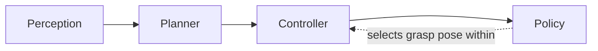
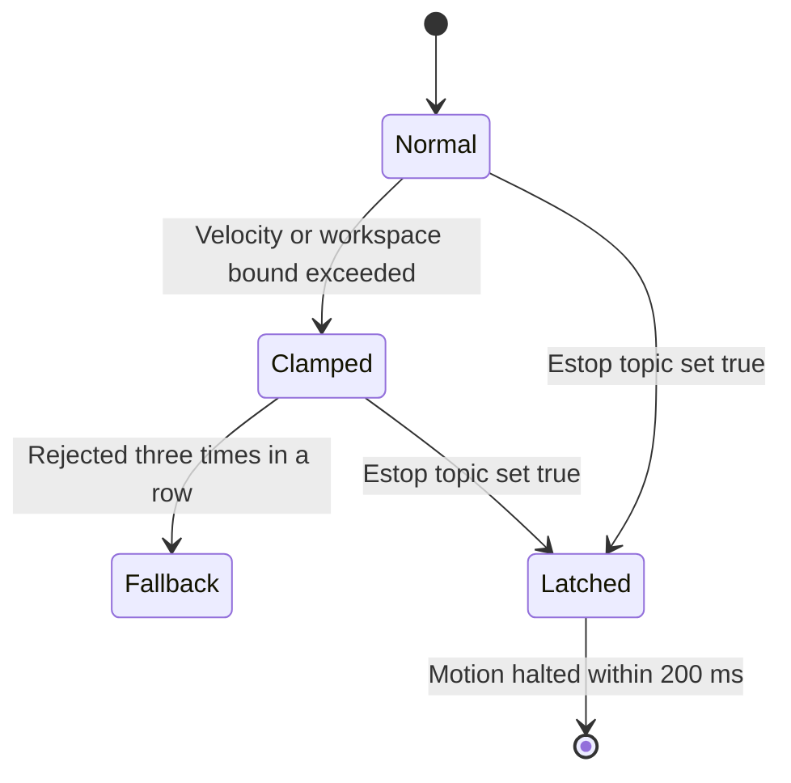

# Lecture 1 — Read the Capstone Spec Like a Contract, Then Write Back What You Heard

> **Reading time:** ~75 minutes. **Hands-on time:** ~60 minutes (you turn the capstone spec into a requirements-traceability table and a one-page "what I heard" restatement, both of which you will reuse for the rest of the track).

The capstone problem statement is unsealed. It has been sitting at the bottom of `SYLLABUS.md` since week one, and you have probably glanced at it. This week you stop glancing and start *reading*, the way a senior engineer reads a statement of work before committing a quarter of a team's time to it. Because that is what the capstone is: a contract. There is a deliverable, there are required properties, there are acceptance criteria with numbers, and there is a pass/fail line that a panel applies at Week 48. The single highest-leverage thing you can do this week — higher leverage than any line of code — is to read that contract precisely and write back what you heard.

This lecture is about the reading. The next lecture is about the ritual that stands the system up. Both are unglamorous. Both are where capstones are won and lost. The learners who fail the Week 40 milestone almost never fail because they could not write the code; they fail because they built something that answered a question the spec never asked, and they did not find out until the reviewer read it back to them.

## 1.1 — Why "like a contract" is the right metaphor

A contract has three properties that a feature list does not, and all three matter here.

**A contract is complete in the sense that what is not written is not owed.** If the spec does not require a 3D obstacle costmap, you do not owe one, and gold-plating it is wasted weeks. If the spec *does* require "the fused state estimate drifts < 0.5 m over a 20-meter trajectory," you owe exactly that, measured exactly that way, and "it felt accurate" does not discharge the obligation. Reading like a contract means reading for the boundary of what is owed — both the floor (you must) and the ceiling (you need not).

**A contract is adversarial in the good sense: it is written to be checked by someone who is not you.** The Week 48 panel did not build your robot. They will read your safety case, watch your videos, and apply the acceptance criteria as written. They will not extend you the benefit of the doubt you extend yourself at 2 a.m. when the run "basically worked." Reading like a contract means reading as the reviewer will read — looking for the clause you are quietly hoping nobody enforces.

**A contract has consideration: both sides give something.** You give an integrated, safe, observable robot. The track gives you a signed milestone, a portfolio piece, and a credential. The acceptance criteria are the meeting point. When you read the spec, read for the meeting point — the precise condition under which the panel is *obligated* to sign.

The senior habit that falls out of this metaphor is simple to state and hard to do: **before you build anything, restate the contract in your own words and confirm the restatement.** In a real shop you do this with the customer or the PM. Here you do it with the spec itself and a peer reviewer. The artifact is a one-page "what I heard" document. We will build it at the end of this lecture, and Exercise 1 makes you do it properly.

## 1.2 — The spec, read clause by clause

Open `SYLLABUS.md` to the capstone specification. The core sentence is this:

> Build (or simulate) a wheeled-base + 6-DOF-arm robot that takes a natural-language instruction (e.g., *"bring me the red cup from the left bench"*) and executes it via a perception → planner → controller → policy stack.

Read that sentence the way a contract lawyer reads a recital. Four nouns carry obligations: **wheeled base**, **6-DOF arm**, **natural-language instruction**, and the **perception → planner → controller → policy stack**. The arrow is not decoration — it is an ordering constraint. Perception feeds the planner; the planner feeds the controller; the policy selects within that frame. If your architecture has the policy choosing a base goal *before* perception has localized the object, you have built a different robot than the one the spec recites. That is the kind of thing you catch by reading the arrow, not the words.


*The spec's arrow fixes an ordering constraint: perception must localize before the policy selects a grasp.*

Now the required system properties. The spec lists eight. Read each one for its *verb* and its *number*, because the verb tells you what node owns it and the number tells you how it is tested.

### Property 1 — Perception

> Fused IMU + LiDAR + RGB-D state estimate; 2D and 3D object detection; latency ≤ 50 ms end-to-end.

Three obligations in one clause. The fused estimate is your Week 10–16 EKF/factor-graph work. The 2D-and-3D detection is your Week 13 and Week 15 work. The **≤ 50 ms end-to-end** is a *latency budget*, and "end-to-end" means from sensor timestamp to the moment `/perception/objects` is published — not the inference time of one model. You measured this exact thing at Week 39. The owning artifact is your fused perception node. The test is a stamped-latency measurement, not a stopwatch feeling.

### Property 2 — Planning

> Nav2 for the base; MoveIt2 for the arm; a behavior tree at the top.

Three named components, no number, but a hard *architectural* constraint: the behavior tree is "at the top." That word places the BT above Nav2 and MoveIt2 in the call graph — the tree dispatches them, not the reverse. If your BT is a leaf inside a Nav2 navigation tree, you have inverted the architecture. The owning artifacts are your Nav2 bringup, your MoveIt2 `move_group`, and your top-level BT.CPP tree. The test is structural: `ros2 action list` shows the Nav2 and MoveIt2 action servers, and Groot 2 shows the tree ticking them.

### Property 3 — Control

> PID at minimum for the base; MPC bonus; MoveIt2-managed for the arm.

The phrase "at minimum" is a floor, and "bonus" is a ceiling that is explicitly optional. Reading this like a contract tells you: a PID base controller *discharges the obligation*; the MPC from Week 22 is extra credit, not a requirement. If you are short on hours this week, do not spend them upgrading the base controller — the spec says you do not owe it. Spend them on the properties you *do* owe and have not met.

### Property 4 — Policy

> A vision-language model (OpenVLA or equivalent open-weight) that selects the grasp pose from the language instruction.

The verb is "selects the grasp pose." Note what it is *not*: the VLA is not required to drive the base, plan the arm trajectory, or run the controller. Its job is grasp-pose selection from language. This is your Week 31/37 fine-tuned OpenVLA. The owning artifact is your VLA policy node. The test is observational: given "the red cup," the policy emits a grasp pose at the red cup, and that pose is observable in telemetry (Property 6 will make "observable" non-negotiable).

### Property 5 — Safety

> Software E-stop topic with 200 ms latch; runtime velocity / workspace clamps; classical fallback when the learned policy is rejected three times in a row; hardware E-stop documented (Path A) or simulated and documented (Path B).

The densest clause in the spec, and the one the panel will scrutinize hardest, because it is the safety clause. Four obligations, three with numbers:

- **200 ms latch.** When `/safety/estop` latches `true`, the robot must stop within 200 milliseconds. This is your Week 24 work, and it is a *measured* latency, not a claim. The test is: latch the topic, measure the time to zero `cmd_vel` and a halted arm trajectory.
- **Runtime velocity / workspace clamps.** The Week 32 safety wrapper that rejects actions exceeding velocity, acceleration, or workspace bounds.
- **Classical fallback after three rejections.** The `/policy/fallback` BT branch from Week 32. The number "three" is exact — not "a few," three.
- **Documented hardware E-stop.** On Path B, "simulated and documented" — you do not need a physical button, but you owe a document describing what it would be and how the software E-stop relates to it.

Reading this clause like a contract, the most important word is "documented" appearing twice. Safety is half engineering and half evidence. The clamp that works but is undocumented does not fully discharge the obligation, because the panel grades the safety case, not just the behavior.


*The safety clause as a state machine: clamps escalate to the classical fallback, and the E-stop latch halts motion from any state.*

### Property 6 — Telemetry

> Foxglove dashboard streaming pose, costmap, policy actions, safety filter status, CPU/GPU load. Remote teleop takeover button.

Six named streams and one control. This is the property that makes "observable in telemetry" a hard requirement and not a nicety. Read the list: every layer of the stack appears. Pose (control/localization), costmap (planning), policy actions (policy), safety filter status (safety), CPU/GPU load (the platform). If any layer is *not* on the dashboard, the property is not met. The owning artifact is your telemetry spine (Exercise 3) and your Foxglove layout. The test is the "narrate the run from the screen" test in Lecture 2.

### Property 7 — Fleet readiness

> The robot reports its identity, capabilities, and health on a `/fleet/heartbeat` topic at 1 Hz, conformant to a documented schema (Open-RMF-style).

A named topic, a rate (1 Hz), and three required fields (identity, capabilities, health), conformant to a documented schema. This is your Week 35–36 multi-robot work, reduced to a single robot's self-report. The owning artifact is your heartbeat publisher (Exercise 3). The test is `ros2 topic hz /fleet/heartbeat` reporting ~1 Hz and a schema document in the repo.

### Property 8 — OTA-ready

> A documented update procedure that does not brick the robot.

The only property that is purely a *document* this week. You owe a written update procedure. The owning artifact is a markdown file. The test is that it exists, is coherent, and describes a rollback. This is a Phase 6 artifact; this week you note that you owe it.

## 1.3 — The acceptance criteria are the real spec

Properties tell you *what* to build. The acceptance criteria tell you *when you are done*. They are the part of the contract with teeth, and you should commit them to memory:

> A capstone passes if and only if:
> - The robot completes at least **15 of 20** language-conditioned instructions from the eval suite.
> - The fused state estimate **drifts < 0.5 m over a 20-meter trajectory**.
> - The safety case is signed by a peer reviewer and the instructor panel.
> - The two chaos drills are recovered with **operator-detectable** events on the dashboard within **60 seconds** each, and the postmortems pass the rubric.
> - The system **cold-boots** to operational state in **< 60 seconds**.

Read "if and only if." That is a biconditional. Meeting four of five does not pass. There is no partial credit on the acceptance gate — partial credit lives in the weekly rubrics, not the capstone gate. Five numbers, five tests:

| Criterion | Number | How it is measured | Where it fails first |
|---|---|---|---|
| Instruction success | ≥ 15/20 | Run the eval suite, count successes | Ambiguous referring expressions ("the cup" with two cups) |
| State-estimate drift | < 0.5 m / 20 m | Drive a measured 20 m path, compare estimate to ground truth | Aggressive turns where wheel slip spikes |
| Safety case signed | binary | Peer + panel signature | Unmitigated hazard the reviewer catches |
| Chaos recovery | ≤ 60 s, operator-detectable | Inject fault, time to dashboard event + recovery | Detection signal that never reaches the dashboard |
| Cold boot | < 60 s | Power-on to "system ready" | Lifecycle bring-up that waits on a slow node |

For **this week's milestone** you are not running all five — you are running the sim milestone, which is "one happy-path language-conditioned pick-and-place, observable, no manual intervention." But you measure the two numbers that are measurable *now* and report them honestly: **state-estimate drift over your run's trajectory**, and **cold-boot time**. The instruction-success and chaos numbers come later (Weeks 44 and 46). Reading the contract now tells you which numbers you owe in eight weeks, so you can instrument for them today instead of scrambling for them in Phase 6.

## 1.4 — "Read it back": the highest-leverage habit in the week

Here is the move. After you have read the spec clause by clause, you do not start building. You write a one-page document that restates, in your own words, what you believe you are obligated to deliver. Then you have a peer read your restatement against the spec and flag every place where what you heard is not what was written.

This feels like overhead. It is the opposite. In a real engineering shop, the cost of a misunderstood requirement is measured in person-weeks: you build the wrong thing, the customer sees it at the demo, and you rebuild. The "read it back" document moves the discovery of the misunderstanding from the demo to the kickoff, where it costs an afternoon instead of a sprint. NASA flight software, aircraft avionics, and medical-device firmware all formalize this as "requirements review," and they do it because a misread requirement in those domains kills people. Your robot operates in shared space — the same logic applies, scaled to your stakes.

The structure of a good "what I heard" document is three columns and a paragraph:

**The requirements-traceability table.** One row per required property and acceptance criterion. Columns: *Requirement (verbatim or near-verbatim)* | *What I heard (my restatement)* | *Owning artifact (node/topic/file)* | *Acceptance test (the command or measurement that proves it)*. This table is the spine. If you cannot fill the "owning artifact" column for a row, you have a gap — a requirement nothing in your system owns. If you cannot fill the "acceptance test" column, you have an unmeasurable requirement, which means you cannot prove you met it.

**The paragraph of explicit non-goals.** What the spec does *not* require, that you are deliberately *not* building. "The spec requires PID at minimum for the base and marks MPC as a bonus; I am shipping PID and not building MPC this milestone." Writing the non-goals down is how you defend your time budget against your own perfectionism and against a reviewer who assumes you forgot. A stated non-goal is a decision; an unstated one is a hole.

Here is what one row of the table looks like, filled in for the perception property:

| Requirement | What I heard | Owning artifact | Acceptance test |
|---|---|---|---|
| "Fused IMU + LiDAR + RGB-D state estimate; latency ≤ 50 ms end-to-end" | My EKF must fuse all three sensors and publish a localized estimate, and the time from sensor stamp to `/perception/objects` publish must be ≤ 50 ms at the 95th percentile | `fused_perception_node` (Week 16), `/odometry/filtered`, `/perception/objects` | `python3 measure_perception_latency.py` reports p95 ≤ 50 ms over a 60 s run; drift test reports < 0.5 m / 20 m |

Notice three things about that row. The "what I heard" column *added precision the spec left implicit* — it pinned "latency" to "p95 from sensor stamp to publish," because "latency" alone is ambiguous (mean? max? which endpoints?). The "owning artifact" column names a concrete node and the topics it publishes. The "acceptance test" column names a runnable command. A row like that is defensible. A row that says "perception: my EKF, it works, fast enough" is the row that fails at review.

## 1.5 — The ambiguities you must resolve before you build

A real contract has ambiguities, and a senior engineer resolves them at kickoff rather than discovering them at the demo. The capstone spec has a handful. Reading it back surfaces them. Resolve each one explicitly in your "what I heard" document — and where the spec genuinely leaves a choice, *state the choice you made and why*.

**"The red cup" when there are two red cups.** The instruction-success criterion (15/20) implies a referring-expression resolution. The spec says "bring me the red cup from the left bench" — the phrase "from the left bench" is a spatial disambiguator. Your "what I heard" should state: the VLA + perception resolve referring expressions using both attribute (color) and spatial (left bench) cues, and the eval suite's instructions will include disambiguators. If two objects match all cues, the robot asks or aborts rather than guessing — and you decide which, and write it down.

**"End-to-end latency" endpoints.** Resolved above: sensor stamp to `/perception/objects` publish, p95. Write it down so the reviewer measures the same thing you measured.

**"Operational state" for cold boot.** The cold-boot criterion is "< 60 s to operational state." Define "operational": the lifecycle manager reports all nodes `active`, pre-flight checks pass, and the system accepts an instruction. Write that definition into your document so "operational" is not relitigated at review.

**"No manual intervention" for the milestone.** The Week 40 milestone is a happy-path run with no manual intervention. Define "manual intervention": any keyboard or `rviz2`/`ros2 topic pub` action that influences the run after the instruction is issued. Restarting a crashed node mid-run is intervention. Pre-positioning the object before the run starts is not. Write the boundary down. The reason this one matters more than it looks is that the milestone's entire purpose is to surface integration defects, and a human in the loop *hides* them — every nudge is a defect that did not get found. Defining the boundary tightly is how you keep the milestone honest with yourself.

**"Drift < 0.5 m over a 20-meter trajectory" — which trajectory?** The number is precise; the path is not. A straight 20 m line understates drift because the worst drift happens in turns where wheels slip. An adversarial reading drives a path *with* turns, because that is where the estimate is stressed. State the trajectory you will measure on (straight, an L, a loop) and why — the honest choice is a path representative of the capstone task, including at least one turn. If you measure on a straight line and the panel measures on a loop, your 0.4 m becomes their 0.7 m, and the gap surfaces at the worst time.

**"15 of 20 instructions" — what counts as a success?** A success is presumably "the named object ends at the delivery pose," but does a slow success count? A success with one safety clamp? The spec does not say, so you decide: a success is task-complete within a time budget, with no safety violation, no human nudge. Write the success predicate down now, because at Week 44 you will score twenty runs against it, and a fuzzy predicate makes the score un-defendable.

The discipline is the same every time: where the spec is precise, copy the number; where the spec is ambiguous, *make the spec precise in your restatement and flag it for your reviewer*. The reviewer's job is to either agree with your reading or correct it — and either way, you have moved the disagreement to a cheap moment. An ambiguity you resolve in writing at kickoff is a decision; an ambiguity you leave implicit is a landmine you step on at the demo. There is no third option where the ambiguity quietly resolves itself in your favor — specs do not work that way, and reviewers least of all.

## 1.6 — Mapping the contract onto thirty-nine weeks

The reason this reading is tractable is that you already built every owning artifact. The "what I heard" table is, in effect, a map from the capstone contract back onto the weeks of the course. Filling it in is a tour of everything you made:

- **Perception (P1)** → Weeks 9–16: IMU calibration, EKF, UKF/factor graphs, OpenCV, learned 2D detection, RGB-D, Open3D 3D perception, the fused 30 ms cycle.
- **Planning (P2)** → Weeks 17–19, 23: Nav2 architecture, path planning, behavior trees + Groot, MoveIt2.
- **Control (P3)** → Weeks 20–22: PID, LQR, MPC.
- **Policy (P4)** → Weeks 26–31, 37: learned grasping, BC/DAgger, Diffusion Policy, ACT, generalist policies, VLA-as-policy.
- **Safety (P5)** → Weeks 24, 32: the hazard log, the safety wrapper, the classical fallback.
- **Telemetry (P6)** → Weeks 39, 43-preview: edge profiling, the latency Gantt, and this week's telemetry spine.
- **Fleet readiness (P7)** → Weeks 35–36: multi-robot namespacing, Open-RMF, the heartbeat.
- **OTA-ready (P8)** → the C7 bridge, documented this week, built in Phase 6.

If a row's "owning artifact" column points at a week you skimmed, this is your warning to go back. The milestone composes everything; a weak component does not get stronger by being composed. The contract is a checklist of debts the previous thirty-nine weeks were supposed to pay. This week you find out which ones actually got paid.

There is a second, subtler use of this mapping: it tells you where your *integration risk* concentrates. A property that draws on a single week (P8, OTA, is essentially one document) carries little integration risk — it is self-contained. A property that draws on eight weeks and feeds three downstream consumers (P1, perception) carries enormous integration risk, because it sits at the center of the data flow and every disagreement about frames, rates, or units routes through it. Reading the mapping this way tells you where to spend Wednesday's integration hours: not evenly across the eight properties, but concentrated on the high-fan-in, high-fan-out ones. Perception and the fused estimate are where the integration defects cluster, because everything downstream depends on them; the OTA document is where they do not. Triage your integration effort by the fan of the mapping, the same way you triage mitigation effort by the RPN of the FMEA.

A third use: the mapping is your honest self-assessment. For each row, ask not "did I build it?" but "did I build it *well enough to compose*?" A perception node that hit 30 ms in the controlled Week-16 lab but was never run alongside a GPU-hungry VLA is a row you have not actually validated for the milestone. A safety wrapper that passed its Week-32 unit test but was never exercised against a live controller is a row at risk. The mapping turns "I think I'm ready" into a per-row checklist of "is this specific component validated *in composition*, not just in isolation?" — which is exactly the question the milestone answers.

## 1.7 — What "writing it back" buys you for the rest of the track

The "what I heard" document is not a Week-40 throwaway. It is a load-bearing artifact for Phase 6:

- **Week 41 (safety case)** inherits the safety property's restatement and acceptance test as the skeleton of the hazard log.
- **Week 44 (eval suite)** inherits the instruction-success criterion and the referring-expression resolution you pinned down.
- **Week 46 (chaos drills)** inherits the chaos-recovery criterion and the "operator-detectable" definition.
- **Week 48 (defense)** *is* the reviewer reading your work against the contract. If your "what I heard" matches the spec and your system matches your "what I heard," the defense is a confirmation, not a discovery.

A capstone that fails at Week 48 almost always failed at Week 40 — the team never read the contract precisely, so they built to a spec of their own imagining, and the gap surfaced at the worst possible moment. The hour you spend on the traceability table this week is the cheapest insurance in the entire track.

## 1.8 — The acceptance-test column is a list of scripts you will write

The "acceptance test" column of the traceability table is not a description — it is a *script you will write*. Every measurable requirement implies a small, runnable harness, and naming the harness in the table is how you keep the requirement honest. Here are the shapes the two milestone-relevant numbers imply, so you see that "acceptance test" means code, not prose.

For the drift criterion (AC2), the harness drives a known path and compares the estimate to ground truth:

```python
# measure_drift.py (shape) — drift over a measured 20 m trajectory.
import math
import rclpy
from rclpy.node import Node
from nav_msgs.msg import Odometry
from geometry_msgs.msg import PoseStamped  # sim ground-truth pose

class DriftMeasure(Node):
    def __init__(self):
        super().__init__("drift_measure")
        self.est = None        # latest /odometry/filtered
        self.truth = None      # latest sim ground-truth pose
        self.create_subscription(Odometry, "/odometry/filtered",
                                 lambda m: setattr(self, "est", m.pose.pose), 10)
        self.create_subscription(PoseStamped, "/ground_truth/pose",
                                 lambda m: setattr(self, "truth", m.pose), 10)

    def error_m(self) -> float:
        a, b = self.est.position, self.truth.position
        return math.dist((a.x, a.y, a.z), (b.x, b.y, b.z))
```

You drive the 20 m path, sample `error_m()` at the end, and assert it is < 0.5 m. The point is not this exact code — it is that the acceptance-test cell "compare estimate to ground truth over 20 m" *is* this harness, and writing the cell commits you to writing the harness. A traceability table whose acceptance-test cells are prose ("looks accurate") is a table that cannot be executed; one whose cells name scripts is a table that *is* your milestone test suite.

The same logic applies to the cold-boot number (timestamp the launch start and the `system ready` log line, subtract), the E-stop latch (latch the topic with a stamp, watch for the first zero `cmd_vel`, subtract), and the perception latency (subtract input stamp from output stamp, collect the distribution, report p95). Four numbers, four small scripts, all named in the table before you build. When the milestone reviewer asks for a number, you do not estimate — you run the script. That is the difference between "I think it's under budget" and "it's 47 ms p95, here's the script, run it yourself."

## 1.9 — A worked contract reading: the full traceability table

Talk is cheap; here is the table built out for all eight properties and the five acceptance criteria, at the precision the exercise demands. Study the *What I heard* column — every cell adds the precision the spec left implicit, and every *Acceptance test* names something runnable.

| # | Requirement (spec) | What I heard | Owning artifact | Acceptance test |
|---|---|---|---|---|
| P1 | Fused IMU+LiDAR+RGB-D estimate; 2D+3D detection; ≤ 50 ms e2e | EKF fuses all three; `/perception/objects` carries 2D and 3D detections in `map`; sensor-stamp→publish p95 ≤ 50 ms | `fused_perception_node`; `/odometry/filtered`; `/perception/objects` | `measure_perception_latency.py` reports p95 ≤ 50 ms over 60 s |
| P2 | Nav2 base; MoveIt2 arm; BT at top | BT dispatches Nav2 and MoveIt2; the tree is the top of the call graph, not a Nav2 leaf | Nav2 bringup; `move_group`; `capstone_pick_place.xml` | `ros2 action list` shows both servers; Groot 2 shows the tree ticking them |
| P3 | PID base (min); MPC bonus; MoveIt2 arm | PID base controller discharges the obligation; MPC deferred (stated non-goal); arm motion is MoveIt2-managed | `controller_server` (PID); `move_group` | Base tracks a path under PID; arm executes a planned trajectory |
| P4 | VLA selects grasp from language | Fine-tuned OpenVLA takes the instruction + scene and emits a grasp pose at the named object | `vla_policy_node`; `/policy/action` | Given "the red cup," the grasp pose lands at the red cup; observable in telemetry |
| P5 | E-stop 200 ms latch; clamps; fallback after 3 rejections; HW E-stop documented | `/safety/estop` latch → zero motion ≤ 200 ms; velocity/workspace clamps; `/policy/fallback` after exactly 3 rejections; documented sim E-stop (Path B) | `safety_wrapper`; `/safety/estop`; `/policy/fallback` | `measure_estop_latency.py` p95 ≤ 200 ms; forced-rejection test triggers fallback on the 3rd |
| P6 | Foxglove dashboard (pose, costmap, policy, safety, load); teleop button | Every layer streams to `/telemetry/*`; a Foxglove layout shows one panel per layer; a teleop-takeover control exists | `telemetry_spine`; `dashboard/milestone-layout.json` | The narration test passes; `ros2 topic list` shows the `/telemetry/*` family |
| P7 | `/fleet/heartbeat` at 1 Hz; id+caps+health; documented schema | Heartbeat publishes at 1 Hz with identity, capabilities, health, conformant to a documented schema | `telemetry_spine` heartbeat timer; `/fleet/heartbeat` | `ros2 topic hz /fleet/heartbeat` ≈ 1 Hz; schema doc in repo |
| P8 | Documented OTA update that does not brick | A written A/B-slot update + rollback procedure, with pre-flight as the post-update gate | `OTA-PROCEDURE.md` | The document exists, describes rollback, names pre-flight as the gate |
| AC1 | ≥ 15/20 instructions | The 20-instruction eval suite scores ≥ 15 successes | eval suite (Week 44) | `run_eval_suite.py` reports ≥ 15/20 |
| AC2 | drift < 0.5 m / 20 m | Euclidean error of `/odometry/filtered` vs ground truth over a measured 20 m path < 0.5 m | `ekf_node`; `measure_drift.py` | `measure_drift.py` reports < 0.5 m |
| AC3 | safety case signed | Peer + panel signature on the safety case | `safety-case/` | signature present |
| AC4 | chaos recovery ≤ 60 s, operator-detectable | Each drill produces a dashboard event and recovery within 60 s | chaos-drill nodes; `/health/*` | timed drill: event + safe state ≤ 60 s |
| AC5 | cold boot < 60 s | Launch start → `system ready` < 60 s | `lifecycle_manager`; `measure_cold_boot.py` | `measure_cold_boot.py` reports < 60 s |

Two rows in that table — AC2 and AC5 — you can run *this week*. The rest you instrument for now and execute later. The discipline is identical for every row: copy the number, pin the endpoints, name the owner, name the test. A table like this is the difference between a capstone you can defend clause by clause and a capstone you hope nobody reads too closely.

## 1.10 — Common misreadings, and how the table catches them

Every cohort produces the same handful of misreadings. Knowing them in advance is half the cure; the traceability table catches the other half.

**Reading a floor as a ceiling.** "PID at minimum" gets read as "PID is all you may use," and a learner skips the MPC stretch goal they had hours for; or "≥ 15/20" gets read as "exactly 15," and the eval suite stops being improved at 15. The table's *What I heard* column forces you to restate the bound explicitly — "minimum," "at least" — which makes the misreading visible to your reviewer.

**Reading "documented" as optional.** Properties P5 and P8 both hinge on the word "documented." A learner builds a working E-stop and never writes the hardware-E-stop relationship down, then loses points at the safety review for an undocumented mitigation. The table's *Acceptance test* column for those rows names a *document*, not a behavior, which keeps the obligation honest.

**Reading the architecture arrow backwards.** "perception → planner → controller → policy" and "a behavior tree at the top" together fix the call graph. A learner who lets the policy choose a base goal before perception localizes the object, or who buries the BT inside Nav2's navigation tree, has built a different robot. The table's *Owning artifact* column, filled honestly, exposes the inversion: if your "BT at top" row points at a Nav2 sub-tree, the row is wrong.

**Reading "no manual intervention" loosely.** A learner counts "I only restarted one node" as no intervention. The Exercise-1 ambiguity resolution pins the boundary; the table's milestone row points at it. Restarting a crashed node mid-run hides a defect behind a human, and the milestone's whole purpose is to surface defects, not paper over them.

In every case the cure is the same: write the restatement down, and let a second reader compare it to the spec. The misreading that survives your own eyes rarely survives a peer's.

## 1.11 — Case study: reading the perception latency clause to the bottom

It is worth doing one clause exhaustively, because the depth of reading you apply to one is the depth you should apply to all eight. Take the perception property: "latency ≤ 50 ms end-to-end." A junior reading stops there and writes "perception is fast enough." A senior reading does not stop until every word is pinned.

**"Latency" — of what statistic?** A single number for "latency" is meaningless without a statistic. Mean latency of 30 ms with a p99 of 180 ms is a *worse* robot than a flat 45 ms, because the 180 ms tail is where the grasp targets stale data. The contract does not say "mean," so you choose — and the defensible choice is p95 (or p99), because the acceptance test is about the *worst common case*, not the average. Write "p95 ≤ 50 ms" in your restatement and you have made an ambiguous clause measurable.

**"End-to-end" — which two endpoints?** "End-to-end" could mean: sensor exposure to publish; sensor *stamp* to publish; subscribe-callback entry to publish; or first-byte-on-the-wire to last-byte. These differ by tens of milliseconds. The honest reading for a ROS2 perception pipeline is *sensor message stamp to `/perception/objects` publish stamp*, because those are the two timestamps you can actually read off the messages and a reviewer can independently reproduce. Pin it, and your `measure_perception_latency.py` becomes unambiguous: subtract the input stamp from the output stamp, collect the distribution, report p95.

**"≤ 50 ms" — under what load?** A pipeline that hits 45 ms on an idle machine and 70 ms while the VLA is doing inference on the same GPU has not met the spec under the conditions that matter. The contract is implicitly about latency *during a run*, with the whole stack live. Your measurement must therefore run with the composed graph up, not in isolation — which is exactly why this is an integration-week measurement and not a Week-13 one. The number you owe is the number under realistic load.

**The owning artifact, named precisely.** Not "my perception code" — `fused_perception_node`, publishing `/perception/objects`, consuming `/camera/image_raw`, `/scan`, and `/odometry/filtered`. Naming the node and its topics is what lets the "acceptance test" column point at a runnable command, and what lets a reviewer find the thing you are claiming meets the spec.

Apply that depth to all eight properties and the five criteria, and your traceability table stops being a formality and becomes the single most useful document in your repo: a precise, measurable, owned restatement of everything you are obligated to deliver. The hour it costs is the cheapest hour in the milestone.

## 1.12 — The contract is a conversation, not a decree

One last reframe, because it changes how you treat the spec for the rest of the track. A contract is not handed down and obeyed in silence; it is read, questioned, and — where ambiguous — clarified between the parties before work begins. Your "what I heard" document is your half of that conversation. The peer review (and, at the milestone, the reviewer sign-off) is the other half.

This matters because it licenses you to *push back* on a reading you believe is wrong, in writing, at kickoff. If you read "the fused state estimate drifts < 0.5 m over a 20-meter trajectory" and conclude that the trajectory should include the turns where drift is worst (because a straight-line 20 m understates real drift), you write that interpretation down and defend it. A reviewer who disagrees says so, and you converge — at kickoff, cheaply. A reviewer who agrees has now co-signed your interpretation, so it cannot be relitigated against you at the defense. Either way, the written conversation moves the risk from the expensive end of the project to the cheap end.

The anti-pattern is the silent build: you read the spec once, form a private interpretation, build to it for eight weeks, and discover at the defense that the panel read a clause differently. By then the conversation is happening at the most expensive possible moment, in front of the people grading you, with no time to converge. The "what I heard" document exists to make sure that conversation happens in Week 40 instead. Treat the spec as a counterparty you are negotiating with, not a wall you are obeying, and you will catch the disagreements while they are still cheap to resolve.

This is also why the document is *yours to defend*, not the instructor's to dictate. Where the spec is precise, you copy it; where it is ambiguous, your reasoned interpretation is the correct answer until a reviewer corrects it. Robotics specs in industry are exactly this ambiguous — a customer says "pick up the boxes" and means a specific size, weight, and arrangement they never wrote down. The engineer who reads it back, in writing, with the assumptions made explicit, is the engineer who ships the right robot. The one who builds silently to a private reading ships the wrong one, on time, and reworks it. This week is where you practice being the first kind.

## 1.13 — From the contract to the integration interface table

The traceability table tells you *what* each component owes. But composition fails at the *seams between* components, and the contract has a second, implicit layer you must surface: the **integration interface table**. For every pair of components that must talk, write down the topic, the message type, the frame, the rate, and the QoS — because that five-tuple is where the four integration defects from Lecture 2 live, and a disagreement in any field is a silent failure.

Here is the integration interface table for the capstone's core data path, read out of the contract:

| Producer | Consumer | Topic | Type | Frame | Rate | QoS |
|---|---|---|---|---|---|---|
| EKF | perception, planner, BT | `/odometry/filtered` | `nav_msgs/Odometry` | `odom`→`base_link` | ≥ 20 Hz | reliable, keep-last 10 |
| perception | planner, VLA, BT | `/perception/objects` | `vision_msgs/Detection3DArray` | `map` | ≥ 8 Hz | reliable, keep-last 10 |
| LiDAR | perception, Nav2 costmap | `/scan` | `sensor_msgs/LaserScan` | `lidar_link` | ≥ 8 Hz | best-effort, keep-last 5 |
| Nav2 | controller, telemetry | `/plan` | `nav_msgs/Path` | `map` | on demand | reliable, keep-last 1 |
| VLA | MoveIt2, safety, telemetry | `/policy/action` | `geometry_msgs/PoseStamped` | `base_link` | on demand | reliable, keep-last 1 |
| safety wrapper | controllers, BT, telemetry | `/safety/estop` | `std_msgs/Bool` | n/a | latched | reliable, transient-local |
| safety wrapper | telemetry | `/safety/status` | `std_msgs/String` (JSON) | n/a | ≥ 5 Hz | reliable, keep-last 5 |
| telemetry | fleet manager | `/fleet/heartbeat` | `std_msgs/String` (JSON) | n/a | 1 Hz | reliable, transient-local |

Read this table and the integration defects light up. The **frame column** is where the frame/timing mismatch hides: the VLA emits a grasp in `base_link`, but MoveIt2 plans in the arm's planning frame — there must be a valid `tf2` chain between them, and the pre-flight check verifies exactly that transform. The **rate column** is where the stale-perception race hides: `/perception/objects` at 8 Hz consumed by a BT ticking at 20 Hz means a detection can be ~125 ms old, so the consumer needs a stamp-age guard. The **QoS column** is where the silent-drop defects hide: `/safety/estop` *must* be `transient-local` so a node that subscribes after the latch still receives `true` — a best-effort E-stop that a late subscriber misses is a safety defect of the worst kind.

The discipline: derive the interface table from the contract *before* you compose, and treat every row as a bilateral agreement that both the producer and the consumer must honor. When a learner's arm reaches to the wrong place, the bug is almost always a frame-column disagreement nobody wrote down. When a planner grabs stale data, it is a rate-column disagreement nobody wrote down. The interface table is how you write them down — and the pre-flight check (Lecture 2) is how you verify them at bring-up. Together, the traceability table (what each part owes) and the interface table (how the parts agree) are the complete contract reading. Build both this week, and Wednesday's integration session becomes "confirm the agreements hold" instead of "discover the agreements never existed."

One more property of the interface table: it is the artifact that makes the *non-functional* requirements measurable. "Latency ≤ 50 ms end-to-end" is not a property of any single node — it is a property of the *path* from sensor to `/perception/objects`, and the path is exactly what the interface table draws. You cannot measure a path you have not drawn. Draw it, name every hop, and the 50 ms budget becomes a sum of hop latencies you can profile (which is precisely the Week 39 latency Gantt, now applied to the composed graph). The contract's hardest numbers — latency, drift, cold-boot — are all path or whole-system properties, and the interface table is the map of the paths.

## 1.14 — The deliverables clause: artifacts are obligations too

The spec does not only require system *properties*; it requires *artifacts*, and the artifact list is as binding as the property list. Read it the same way. The capstone deliverables are:

- a public GPL-3.0 repository at a named path;
- a Mermaid architecture diagram (in-repo plus a PNG export);
- two videos, each ≤ 5 minutes, with voiceover;
- an 8–15-page safety case;
- two chaos-drill postmortems, 2–4 pages each;
- a 3-minute operator-dashboard recording;
- three polished portfolio projects;
- a one-page public retro.

Read like a contract, each of these has a *form* requirement you can fail on independently of content. "Two videos, each ≤ 5 minutes, with voiceover" — a brilliant ten-minute video with no narration fails the form, the same way a correct answer in the wrong units fails an exam. "8–15 pages" — a three-page safety case is non-conforming regardless of how good the three pages are; the page range is a proxy for the depth the panel expects. "Mermaid in-repo plus PNG export" — a hand-drawn diagram, however clear, does not meet "Mermaid in-repo," because the in-repo requirement exists so the diagram is version-controlled and diffable.

This is not pedantry; it is how real deliverable contracts work. A statement of work that says "deliver the API documentation as OpenAPI 3.1 YAML" is not satisfied by a beautiful Markdown doc, because the *form* is part of the deliverable — downstream tooling depends on it. Your traceability table should therefore have rows for the *artifacts*, not only the properties, with the form requirement in the "what I heard" column and the "does it conform" check in the acceptance-test column. For Week 40 the binding artifact is the five-minute walkthrough video; read its form requirement now (≤ 5 min, voiceover, shows the end-to-end run and the live telemetry) so you record a conforming one the first time instead of re-recording at the deadline.

## 1.15 — Reading the path clause: A and B are different contracts

The spec is written for two paths, and they are *different contracts* sharing most clauses. Read yours, not the other one. Path A (physical robot) and Path B (simulation only) diverge at exactly the points where hardware enters:

- **Hardware E-stop.** Path A owes a *documented physical* E-stop and its relationship to the software E-stop. Path B owes a *simulated and documented* E-stop — a sim mechanism plus a document describing the hardware target it stands in for. Reading the wrong path's E-stop clause means building (or not building) the wrong mitigation.
- **The two videos.** Path A owes "sim run + real run." Path B owes "sim run + sim-hardened run on a documented hardware target." A Path-B learner who reads Path A's clause panics about not having hardware; a Path-A learner who reads Path B's clause under-delivers. Read your row.
- **The build sprints.** Path A's Weeks 41–42 are hardware bring-up; Path B's are sim production-hardening. The capstone *rubric is identical* — both paths clear the same bar — but the *work* differs, and the work is determined by which path's clauses bind you.

The deep point: the spec is explicit that "the rubric scores autonomy-stack quality, safety-case construction, and chaos-drill recovery — not whether a real robot was bought." Reading like a contract, that sentence is a *consideration clause*: it tells you what the track is actually buying from you (a defensible autonomy stack and safety argument), and therefore what you must spend your effort on. Both paths owe the same intellectual artifact; only the demonstration medium differs. A Path-B learner who reads this clause correctly stops apologizing for being in sim and starts making the sim run production-grade — which is exactly what the contract asks for. Write your path's divergent clauses into your "what I heard" document explicitly, so you never accidentally hold yourself to the other path's terms.

## 1.16 — Two readings, two outcomes: a tale from the cohort

It helps to see the difference between a careful reading and a careless one play out, because the gap looks small in Week 40 and enormous in Week 48. Two composite teams, drawn from past cohorts.

**Team Silent Build.** They glanced at the spec in Week 40, formed a private picture — "build a robot that fetches stuff when you tell it to" — and got coding. They built a gorgeous stack. Their perception was fast. Their VLA picked good grasps. Their demo, when they ran it, was smooth. Then the milestone reviewer asked three questions. *"What's your end-to-end perception latency, p95, under load?"* They had measured inference time on one model, idle: 18 ms. Under load, with the VLA sharing the GPU, their actual path latency was 90 ms — they had never measured the path, only a hop, because they never drew the interface table. *"Show me the E-stop latching within 200 ms."* They had an E-stop topic, but it was best-effort QoS, and a late-subscribing controller missed the latch — a safety defect they discovered live, in front of the reviewer. *"Where's the grasp pose in your telemetry?"* It wasn't; the policy layer was dark. They passed nothing on the first attempt and spent two of their eight remaining weeks re-doing Week-40 work, which is the most expensive place in the calendar to do it.

**Team Read It Back.** They spent the Monday of Week 40 writing the "what I heard" document. Their traceability table had thirteen rows; two had empty owning-artifact cells, which they flagged as gaps and closed by Wednesday. Their interface table drew every hop, so when they measured perception latency it was the *path* under load: 47 ms p95, inside the budget, with one hop they could point at if it slipped. Their E-stop row in the interface table said "transient-local," so the late-subscriber bug never happened — it was designed out before composition. Their telemetry spine had a panel per layer because Property 6's "what I heard" cell listed all six streams explicitly. Their milestone reviewer asked the same three questions and got three numbers, three demonstrations, and a dashboard that answered the third before it was finished being asked. They signed the milestone that afternoon and spent their eight weeks making the robot real instead of re-reading the spec.

The two teams were equally skilled engineers. The difference was a single document, written at the cheapest moment, that turned a vague picture into a precise, measured, owned restatement of the contract. That document is the deliverable of this lecture. Everything downstream — the pre-flight check, the telemetry spine, the milestone, the eventual defense — is easier for Team Read It Back, not because they wrote better code, but because they read the contract before they wrote any. That is the entire lesson, and it is worth the hour it costs many times over.

## 1.17 — Summary and the move to the ritual

Read the capstone spec the way a senior engineer reads a statement of work: as a contract, complete and adversarial and mutual. Extract every required property and every acceptance criterion. Pin every ambiguity to a precise reading. Write it all back in a one-page "what I heard" document with a requirements-traceability table — requirement, restatement, owning artifact, acceptance test — and a paragraph of explicit non-goals. Have a peer check your restatement against the spec. Resolve the disagreements now, at kickoff, where they cost an afternoon.

Remember the three tables this lecture produced, because together they are your complete contract reading. The **traceability table** says what each part owes (requirement → restatement → owning artifact → acceptance test). The **acceptance-test column** is a set of scripts you will run, not prose you will assert. The **interface table** says how the parts must agree (topic, type, frame, rate, QoS), and it is where the integration defects hide. Build all three this week and Wednesday's integration session becomes confirmation instead of discovery, and the milestone becomes a measurement instead of a hope.

And remember the posture: the spec is a counterparty, not a wall. Where it is precise, copy it; where it is ambiguous, make it precise in your restatement and let a reviewer agree or correct. The misreading that survives your own eyes rarely survives a peer's, and the disagreement caught at kickoff costs an afternoon while the same disagreement caught at the defense costs weeks. Team Read It Back signed their milestone the afternoon they were asked; Team Silent Build re-did two weeks of work in front of the panel. The difference was one document, written at the cheapest possible moment.

That document tells you exactly what to stand up and exactly how you will be measured. Lecture 2 is the ritual that stands it up: pre-flight checks that prove the system is healthy before you send a goal, the chaos-drill template that structures Week 46, and the safety-case template that structures Week 41. You have read the contract. Now you build the checklist that lets you sign it.

---

**References**

- C24 capstone specification — `SYLLABUS.md`, "Capstone specification — Autonomous Mobile Manipulator with Language-Conditioned Pick-and-Place."
- Google SRE Book — "Reliable Product Launches at Scale": <https://sre.google/sre-book/reliable-product-launches/>
- REP 105 — Coordinate frames for mobile platforms: <https://www.ros.org/reps/rep-0105.html>
- REP 103 — Standard units and conventions: <https://www.ros.org/reps/rep-0103.html>
- NASA Software Safety Guidebook (requirements and hazard analysis): <https://standards.nasa.gov/standard/NASA/NASA-GB-871913>
