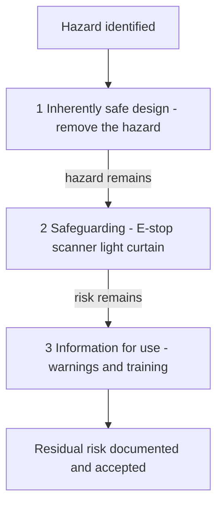
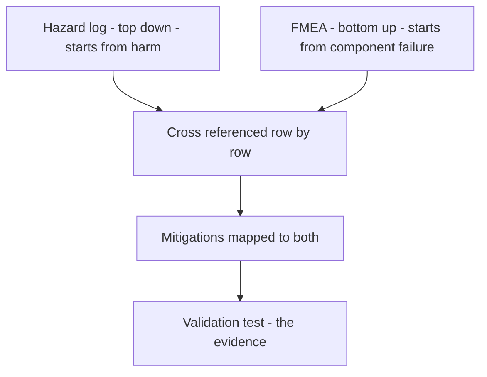

# Lecture 1 — The Safety Case as an Artifact: Hazard Log, FMEA, and ISO 13482 / ISO 10218 Framing

> **Duration:** ~2.5 hours of reading + working alongside your own stack.
> **Outcome:** You can explain what a safety case *is* and *is not*, choose the right ISO framing for your capstone, write a defensible intended-use and foreseeable-misuse section, build a hazard log from your robot's energy sources, and run an FMEA across the integrated autonomy stack that sorts failure modes by a Risk Priority Number you can defend in review.

If you remember one sentence from this lecture, remember this:

> **A safety case is a structured, evidence-backed argument that a specific robot is acceptably safe for a specific use in a specific environment.** It is an *argument*, not a checklist; it has *evidence*, not vibes; and it is about *this robot in this place*, not robots in general.

Everything else this week is the machinery to write that argument honestly.

---

## 1. What a safety case actually is

Most engineers first meet "safety" as a folder of compliance PDFs that someone in a hi-vis vest waves at an auditor. That is not what we mean, and that misconception is exactly why so many robots are unsafe.

A safety case has three parts, and the structure is the same whether you are shipping a personal-care robot in the EU or defending a capstone in front of a Crunch Labs panel:

1. **A claim.** "This robot is acceptably safe to operate autonomously in environment X, near people who are doing Y." The claim must be *falsifiable* — there has to be a state of the world in which it is false.
2. **An argument.** A chain of reasoning from the claim down to evidence. "It is acceptably safe *because* every identified hazard has been reduced to a residual risk that a named person has accepted, *because* each mitigation is independent and validated, *because* …"
3. **Evidence.** The hazard log, the FMEA, the test results from the validation plan, the E-stop continuity check, the force measurement against the ISO/TS 15066 table. Evidence is the part a reviewer can independently verify.

The community even has a notation for this — **Goal Structuring Notation (GSN)** — where the claim is a *goal*, the reasoning is a *strategy*, and the evidence is a *solution* node. You do not have to draw GSN diagrams for the capstone, but you should be able to point at any sentence in your safety case and say "this is a goal / strategy / evidence." If a sentence is none of those, it is filler, and filler is where unsafe robots hide.

### What a safety case is NOT

- **It is not a guarantee of zero risk.** Zero risk is not achievable and a case that claims it is lying. The honest claim is *acceptable* risk, with the acceptance criterion stated.
- **It is not a one-time document.** It is versioned alongside the code. When you change the speed limit, the relevant hazard's risk rating changes, and the case is stale until you update it.
- **It is not the same as "passing tests."** Tests are evidence *inside* the case. A green CI pipeline is not a safety case any more than a passing unit test is a proof of correctness.
- **It is not written after the robot works.** If you write it last, you will rationalize whatever you already built. Written first (or at least early), it *drives* design — "this hazard's RPN is unacceptable, so we need a hardware E-stop, not just a software one."

---

## 2. Who owns it, and why that matters to you

In a real robotics company, the safety case has a single named owner — often a "safety engineer" or the responsible "technical authority" — and that person's signature on the residual-risk-acceptance line carries real liability. When a robot injures someone, the investigation starts with the safety case, and "we didn't have one" or "ours said the hazard couldn't happen" are both career-ending answers.

For the capstone, **you** are that owner. The panel reads your case the way a regulator reads a manufacturer's: looking for the hazard you missed, the mitigation that is not independent, the residual risk you waved to zero. Treating it as your own signature changes how you write it. You stop writing to impress and start writing to survive scrutiny.

This is also, frankly, the artifact that most separates a senior robotics engineer from a junior one in an interview. Anyone can say "we used Nav2." The person who can say "here is the hazard log, here is the highest-RPN failure mode, here is the independent mitigation we added and the before/after risk numbers" is the person who gets hired to own robots that move near people.

---

## 3. Choosing the framing: ISO 13482 vs ISO 10218 (vs both)

You do not invent your safety method from scratch. You inherit it from the relevant standard, and the *first* engineering decision of the week is which standard frames your case. Get this wrong and a reviewer will (correctly) distrust everything downstream.

| Your capstone is mostly… | Frame against | Because |
|--------------------------|---------------|---------|
| A mobile base that drives near, around, or among people (a service/delivery/assistive robot) | **ISO 13482** (personal care robots) | 13482 is written for robots that share space with non-expert humans and explicitly covers mobile servant, physical-assistant, and person-carrier types. |
| A robot arm doing a task, possibly fenced or possibly collaborative | **ISO 10218-1** (the arm) **+ ISO 10218-2** (the cell/application) | 10218 is the industrial-manipulator family; -2 is the integration standard that covers *your robot plus its workspace*. |
| An arm that is *meant* to share its workspace with a person and may contact them | 10218 **+ ISO/TS 15066** (the collaborative annex) | 15066 gives the power-and-force-limited thresholds — the body-region force/pressure table you must stay under. |
| A mobile manipulator (base **and** arm) near people — i.e. most C24 capstones | **Both 13482 and 10218-2**, with 15066 for the arm-contact hazards | Your robot has the hazards of *both* a mobile base and a manipulator; you cannot pick one and ignore the other half of the machine. |

All of these inherit their *method* from **ISO 12100** — "Safety of machinery — General principles for design — risk assessment and risk reduction." 12100 is the meta-standard: hazard identification → risk estimation → risk evaluation → risk reduction, iterated. When you read 13482 or 10218, you are reading 12100's method specialized to a robot. If you only ever read one standard, read 12100, because it teaches the verb (how to *do* a risk assessment) while the others teach the nouns (which hazards a robot of this type has).

> **A 2026 note on the regulatory backdrop.** In the EU, the **Machinery Regulation (EU) 2023/1230** replaces the old Machinery Directive and *applies from 20 January 2027*. It is the first machinery law to explicitly name AI/autonomy and "self-evolving behaviour" as risk sources you must address. Even if your capstone never ships in the EU, frame your learned-policy hazards as if 2023/1230 applies — because it represents where the whole field is heading, and "our policy can do something we didn't foresee" is exactly the hazard regulators now require you to confront head-on.

### The risk-reduction hierarchy (this is the spine of the whole case)

ISO 12100 mandates an *order* in which you reduce risk. You do not get to jump straight to "we put a warning sticker on it." The order is:

1. **Inherently safe design.** Remove the hazard. (A lighter arm. A rounded edge. A gripper that physically cannot exceed 25 N. A base that physically cannot exceed 0.3 m/s.)
2. **Safeguarding and complementary protective measures.** If you cannot design the hazard out, guard against it. (Hardware E-stop, safety-rated scanner, contactor that opens motor power, light curtain, speed-and-separation monitoring.)
3. **Information for use.** If risk remains, inform. (Warnings, training, operator procedures, the "keep 1 m clear" sign.)

A reviewer reading your case checks that you went *down* this hierarchy, not up. If your mitigation for "arm can crush a hand" is "operators are trained to stay clear," they will ask why you didn't first try to limit the force (inherent design) or add a safety scanner (safeguarding). "Train the human" is the *last* resort, not the first. Internalize this order; it is the difference between a credible case and a negligent one.


*ISO 12100's risk-reduction order: design it out, guard it, only then warn about it.*

---

## 4. Intended use and the ODD

Every later argument in your case is bounded by **what the robot is for**. You cannot argue a robot is safe in general — only safe for a stated use in a stated environment. So the case opens with intended use, and the intended-use section is where you draw the box that everything else lives inside.

Borrow a term from autonomous vehicles: the **Operational Design Domain (ODD)**. The ODD is the explicit set of conditions under which the robot is designed to operate. Writing it forces you to be honest about what you are *not* claiming.

A good intended-use / ODD statement for a capstone mobile manipulator reads like this:

> **Intended use.** CrunchBot-41 is a single, autonomous indoor mobile manipulator that retrieves and delivers small, lightweight objects (≤ 0.5 kg, ≤ 15 cm) on flat, finished indoor floors in response to natural-language instructions from an authorized operator.
>
> **Operational Design Domain.**
> - *Environment:* indoor, flat, dry, finished flooring; ambient light 200–1000 lux; no outdoor operation; no ramps steeper than 3°; no stairs.
> - *People:* may share the space with adults and supervised children who are *not* trained operators; assumes pedestrians moving at walking speed.
> - *Objects:* rigid, graspable items within the size/mass limits above; not liquids, not sharp objects, not living things.
> - *Speed:* base ≤ 0.5 m/s nominal, ≤ 0.25 m/s within 1.5 m of a detected person.
> - *Supervision:* an operator is reachable (in the room or via the dashboard) and can trigger the software E-stop; the hardware E-stop is physically reachable on the robot.
> - *Duty cycle:* up to 2 hours continuous; no operation below 20% battery.

Notice what the ODD *does*. It rules out stairs (so "robot falls down stairs" is out of scope — you must guarantee the ODD is enforced, but you don't have to mitigate a hazard you've excluded). It admits children and untrained adults (so you *cannot* assume everyone near the robot will behave correctly — that drives your misuse section and your hazard severities up). It bounds object mass (so "robot drops a 20 kg load on a foot" is out of scope, but you must enforce the limit). Every boundary you draw is a hazard you either exclude (and must enforce) or accept (and must mitigate).

> **The cardinal sin here** is writing an ODD so narrow that your real demo violates it, or so vague it bounds nothing. "Operates safely indoors" is not an ODD. "Operates on flat finished floors, 200–1000 lux, base ≤ 0.5 m/s, objects ≤ 0.5 kg" is. Specificity is the whole value.

---

## 5. Reasonably foreseeable misuse — the section juniors skip

Here is the section that separates the people who have shipped robots from the people who have not. After you state what the robot is *for*, you must state what people will *actually do* — including things you did not intend but can reasonably predict. ISO 12100 calls this **reasonably foreseeable misuse**, and leaving it out is the single most common reason a safety case gets bounced.

Why does it matter? Because the human is part of the system, and humans do not read the manual. If a person *can* stand in the robot's path, they will. If a child *can* climb on the base, one will. If an operator *can* override the speed limit to finish a demo faster, someone will. The misuse section forces you to design for the world as it is, not the world as your happy-path test assumed.

For the capstone mobile manipulator, a credible misuse section includes:

- **Standing in the robot's planned path** (a pedestrian walks into the corridor the robot is traversing).
- **Reaching into the workspace while the arm is moving** (a curious bystander reaches for the object the robot is grasping).
- **A child climbing on or grabbing the base or arm.**
- **Operating in conditions outside the ODD** (someone tries it on a ramp, or in the dark, or with a 3 kg object).
- **Ignoring or defeating a guard** (taping down the E-stop, disabling the speed gate "just for the demo").
- **Issuing an ambiguous or adversarial instruction** ("bring me the knife"; "go faster"; an instruction the language model grounds incorrectly).
- **Relying on the robot when it is degraded** (continuing to use it with a flaky LiDAR because "it mostly works").

Each line of the misuse section becomes one or more rows in your hazard log. The discipline is: *for every way the system can be misused, what is the worst credible harm, and what stops it?* If your answer to "a child grabs the arm mid-motion" is "we assume that won't happen," you have failed the section. The ODD admitted unsupervised children; you cannot now assume they behave.

---

## 6. The hazard log

Now we get concrete. A hazard log is a table — one row per hazard — and it is the backbone of the case. Each row identifies a hazard, the hazardous event that turns it into harm, the worst credible harm, a risk rating *before* mitigation, the mitigations, and a residual risk rating *after*.

### Finding the hazards: the energy-source method

The reliable way to enumerate hazards is **not** to brainstorm "what could go wrong" — that misses things. It is to walk the **energy sources** of the machine, because harm is almost always energy escaping its intended path. For a mobile manipulator:

- **Kinetic energy of the base** — it can run into a shin, run over a foot, knock a person down. (Mass × velocity².)
- **Kinetic + potential energy of the arm** — it can strike, pinch, or crush; a dropped payload has potential energy; the arm itself can fall under gravity if a brake fails.
- **Stored mechanical energy** — springs, a held payload, the arm at the top of its reach.
- **Electrical energy** — the battery (lithium: fire, thermal runaway), exposed conductors, the motor bus voltage.
- **Thermal energy** — motors and compute under load; a Jetson and motor drivers get hot.
- **Pinch/shear geometry** — the gripper jaws, the joints, the gap between the arm and the base.
- **Information "energy"** (the autonomy-specific one) — a wrong perception, a wrong plan, or a wrong policy action *directs* the physical energy at a person. This is the category classical machine safety underweights and the one your case must take seriously.

Walking energy sources guarantees coverage. You will find hazards your brainstorm missed (the arm falling under gravity when a brake releases on power loss is a classic one juniors forget — and it is *worse* on power loss, exactly when you'd hope the robot is "off").

### Rating the risk

For each hazard, estimate three things and combine them into a rating. We use a simple, defensible scheme (the same one the exercise-3 tool implements):

- **Severity (S), 1–4:** 1 = negligible (minor, reversible), 2 = marginal (medical attention, reversible), 3 = critical (serious, possibly permanent injury), 4 = catastrophic (life-threatening / fatal).
- **Probability (P), 1–4:** 1 = remote, 2 = occasional, 3 = probable, 4 = frequent — over the robot's operating life.
- **Exposure (E), 1–3:** 1 = rare exposure, 2 = occasional, 3 = continuous exposure to the hazard zone.

A common rating is **Risk = S × P × E** (range 1–48), bucketed into Low / Medium / High / Intolerable bands. The exact numbers matter less than that they are *consistent across rows* and *defensible*. A reviewer will not argue that your "run over a foot" severity should be 3 not 4; they *will* fail you if you rated "arm strikes head" as severity 1 to make the table look better. Rate honestly, band consistently.

### A hazard-log row, worked

| Field | Value |
|---|---|
| ID | HZ-07 |
| Hazard | Arm in motion strikes a bystander who reaches into the workspace |
| Hazardous event | Person's hand/head enters the arm's swept volume during a pick |
| Energy source | Kinetic energy of the arm |
| Worst credible harm | Blunt impact to head/hand; severity 3 (critical) |
| Pre-mitigation S / P / E | 3 / 3 / 2  →  Risk 18 (High) |
| Mitigations | (1) Speed gate: arm ≤ 0.25 m/s TCP when a person is within 1.5 m (perception confidence gate + speed scaling); (2) ISO/TS 15066 force limit: gripper/arm force ≤ body-region threshold; (3) software E-stop on the BT safety condition; (4) hardware E-stop opening the motor contactor. |
| Post-mitigation S / P / E | 2 / 2 / 1  →  Risk 4 (Low) |
| Residual risk | Low-speed contact ≤ 0.25 m/s, force below 15066 forearm threshold; accepted (see §residual risk). |
| Validation | VP-07: measure TCP speed with a person at 1.5 / 1.0 / 0.5 m; measure peak contact force with the validated test rig; both below threshold. |

That single row contains the whole method in miniature: a specific hazard, a specific event, a rating before, a defense-in-depth mitigation set, a rating after, and a *test* that produces evidence. Twenty rows like this, and you have a hazard log. Twenty rows that all say "mitigated by E-stop," and you have nothing.

---

## 7. FMEA on the integrated autonomy stack

The hazard log asks "what can hurt a person?" The **FMEA** (Failure Mode and Effects Analysis) asks a complementary, bottom-up question: "for each component, how can it *fail*, and what happens when it does?" The two overlap but are not the same — the FMEA catches failures that do not obviously map to a hazard until you trace the effect chain. Run both.

FMEA is mechanical. For each component / function, enumerate:

1. **Failure mode** — *how* it fails ("LiDAR stops publishing," "policy outputs an out-of-distribution action," "EKF diverges," "wheel encoder reports stale ticks").
2. **Effect** — what the failure causes downstream ("planner uses a stale costmap → drives into an undetected obstacle").
3. **Cause** — the root ("USB disconnect," "OOD input," "covariance underflow," "CAN frame dropped").
4. **Current controls** — what already catches or mitigates it.
5. **Severity (S, 1–10), Occurrence (O, 1–10), Detection (D, 1–10).** Note: Detection is *inverted* — D=1 means "always caught before harm," D=10 means "no way to detect it." High D is bad.
6. **RPN = S × O × D** (range 1–1000). Sort descending. Set a criticality cutoff (e.g. RPN > 100, *or* any S ≥ 9 regardless of RPN). Everything above the cutoff needs an action.

The autonomy-specific power of FMEA is that it forces you to look at the *whole stack*, including the parts a mechanical-safety mindset ignores. Here are the integrated-stack components you must include — most capstone FMEAs that fail do so by omitting the software ones:

| Component / function | A failure mode you must consider |
|---|---|
| 2D/3D LiDAR | Stops publishing (USB/driver drop) → stale costmap |
| Depth camera | Returns invalid/NaN depth in glare → false "clear" region |
| EKF / robot_localization | Covariance diverges → confident-but-wrong pose |
| AMCL / localization | Localizes to wrong corridor (perceptual aliasing) → drives into the wrong room |
| Nav2 global planner | Returns no path / oscillates at a doorway → robot stuck or jitters |
| Nav2 controller | Commands velocity that grazes an obstacle inside the inflation gap |
| MoveIt2 / arm planner | Plans through a region perception missed → arm collision |
| Learned policy (VLA / diffusion) | Outputs an out-of-distribution action; *or* grounds a language instruction wrongly ("cup" → grabs the knife) |
| Safety filter / classical fallback | Fails to engage when the policy is unsafe (the worst case) |
| Behavior tree | A tick stalls; a condition node throws; the tree deadlocks |
| Compute (Jetson) | Thermal throttle → perception cycle blows its latency budget → stale detections |
| Power / battery | Brown-out mid-motion; brake-on-power-loss behavior of the arm |
| Network / DDS | QoS mismatch drops the velocity topic; the robot keeps last command |
| micro-ROS / MCU (Path A) | The MCU that hosts the watchdog/E-stop input itself hangs |

Two FMEA findings recur across almost every capstone and you should expect them at the top of your RPN list:

- **"Safety filter fails to engage."** Severity is maximal (it is the last line of defense), and detection is hard (a mitigation that silently doesn't fire looks identical to one that wasn't needed). This is almost always your highest-RPN row, and it is the subject of this week's challenge.
- **"Learned policy grounds a language instruction incorrectly and acts on it."** Severity depends on the action, occurrence is non-trivial for any real VLA, and detection is genuinely hard — which is exactly why the perception confidence gate and the classical fallback exist. The 2023/1230 regulation exists because of this row.

> **FMEA is necessary but not sufficient for software.** Classical FMEA assumes failures are *component* failures. But many autonomy hazards arise from components working *exactly as specified*, in a combination nobody intended — the planner correctly plans, the controller correctly executes, and the robot drives into a person because the cost map correctly reported a region as clear that the depth camera correctly failed to see through glare. No single component "failed." This is why we point you at **STPA** in the resources: it analyzes the *control structure* and *unsafe interactions*, catching exactly these "everything worked and it still hurt someone" cases. For the capstone, run FMEA (it is concrete and gradeable) and read the STPA handbook so you understand its blind spot. The strongest cases use FMEA for component failures and STPA-style reasoning for the perception/planning/policy interaction hazards.

---

## 8. Tying the hazard log and the FMEA together

Learners ask: do I need both, and how do they relate? Yes, and here is the relationship.

- The **hazard log** is *harm-centric* and *top-down*: start from "ways a person can be hurt," work back to causes. It is the document a non-engineer (a manager, a regulator) reads first, because it speaks in injuries, not subsystems.
- The **FMEA** is *failure-centric* and *bottom-up*: start from "ways a component fails," work forward to effects (some of which are hazards, some of which are just downtime). It is the document an engineer reads to find the failure that has no obvious hazard until you trace it three hops.

They cross-reference. A high-RPN FMEA row whose effect is a person-harm should appear as (or map to) a hazard-log row, and that hazard's mitigations should be the FMEA row's "recommended actions." When a reviewer asks "show me that your highest-RPN failure is actually mitigated," you point from the FMEA row to the hazard-log row to the validation test. That traceability — failure → hazard → mitigation → evidence — *is* the safety argument. A case where the FMEA and the hazard log are two disconnected spreadsheets has not made the argument; it has just made two lists.


*Hazard log and FMEA meet in the middle and both must bottom out in a validation test.*

---

## 9. Structuring the argument: GSN, briefly

You do not have to draw Goal Structuring Notation diagrams for the capstone, but understanding the shape stops your case from becoming a pile of disconnected sections. GSN gives the argument three node types:

- **Goal** — a claim to be supported. The top goal: "CrunchBot-41 is acceptably safe within its ODD." Sub-goals: "all kinetic-impact hazards are reduced ALARP," "the learned policy cannot direct the arm at an unsafe object."
- **Strategy** — *how* you argue a goal from its sub-goals. "Argue over each energy source"; "argue by defense-in-depth, one layer per failure class."
- **Solution** — the evidence that discharges a goal. "Validation test VP-07 shows TCP ≤ 0.25 m/s at all separation distances across 50 trials."

The discipline GSN enforces is **every goal eventually rests on a solution (evidence) node, not on another goal.** A safety argument that bottoms out in "and therefore it is safe" with no evidence node underneath has a dangling goal — the exact place an unsafe robot ships. When you write your mini-project's top-level `README.md`, write it as: claim → strategy ("we argue over energy sources and defend in depth") → the hazard log and FMEA (which enumerate) → the validation results (the evidence that discharges). If you can trace every top claim down to a test result, your argument is sound. If a claim floats with nothing under it, that's your homework for the weekend.

A practical tell: read each paragraph of your draft and label it G (goal), S (strategy), or E (evidence/solution). If a paragraph is none of those, it is prose filler and a reviewer will skim past it looking for the argument. Cut it or convert it.

---

## 10. Budgeting force with ISO/TS 15066 (a worked number)

If your arm is collaborative — *meant* to share space and possibly contact a person — ISO/TS 15066 gives you a body-region table of biomechanical limits: the maximum quasi-static force and pressure that region can tolerate before pain/injury. Your job is to show your worst-case contact stays under the relevant limit. This is the difference between "we slowed the arm down" and "the arm cannot exceed the forearm pain threshold," and a reviewer wants the second.

The transient-contact force for a free (unclamped) impact is governed by the effective two-body collision:

```
F_peak ≈ v · sqrt( k · μ )

  where  v  = relative contact speed (m/s)
         k  = effective contact stiffness (N/m), from the 15066 body-region model
         μ  = reduced mass = (m_robot · m_human) / (m_robot + m_human)
```

For a clamped (trapped against a fixed surface) contact, you instead check the *quasi-static* force limit directly, because the person cannot move away and the force builds until something gives. The clamped case is almost always worse, so design for it: your speed gate and your force limit must keep even a clamping contact below the table value.

A concrete sketch you can adapt (the numbers are illustrative — use the real 15066 table and your real arm):

```python
import math


def transient_peak_force(v: float, k: float, m_robot_eff: float,
                         m_human: float) -> float:
    """Peak transient force for a free impact, per the ISO/TS 15066 model.

    v: contact speed (m/s); k: effective body-region stiffness (N/m);
    m_robot_eff: effective moving mass of the arm at the TCP (kg);
    m_human: effective mass of the contacted body region (kg).
    """
    reduced_mass = (m_robot_eff * m_human) / (m_robot_eff + m_human)
    return v * math.sqrt(k * reduced_mass)


# Forearm contact: illustrative stiffness ~ 40 N/mm = 40_000 N/m,
# effective body mass ~ 1.4 kg; arm effective mass ~ 3.0 kg.
for v in (0.50, 0.25, 0.10):
    f = transient_peak_force(v, k=40_000.0, m_robot_eff=3.0, m_human=1.4)
    print(f"v={v:.2f} m/s -> peak force {f:6.1f} N")
```

Running it shows exactly why the speed gate exists:

```
v=0.50 m/s -> peak force   97.7 N
v=0.25 m/s -> peak force   48.9 N
v=0.10 m/s -> peak force   19.5 N
```

If the illustrative forearm transient limit were ~150 N, then even 0.5 m/s sits under it for these illustrative constants — but margin matters, contact stiffness is uncertain, and the *clamped* case is worse than this free-impact estimate. Pulling the gate down to ≤ 0.25 m/s within 1.5 m of a person roughly halves the peak force to ~49 N, buying comfortable margin against both the uncertainty and the worse clamped case — which is precisely why "≤ 0.25 m/s within 1.5 m of a person" appears in the ODD. Now your speed gate is not an arbitrary number; it is *derived from a biomechanical limit*, and your residual-risk statement can say "worst-case forearm contact ≈ 49 N, below the 15066 limit, with margin." That is a sentence a reviewer trusts. "We made it slow" is not.

> Do not ship the illustrative constants above. Look up the real body-region values for the regions your arm can actually reach (forearm, hand, face are the common ones), use your measured arm effective mass, and — ideally — *validate* the computed force against a calibrated load cell in the validation plan rather than trusting the model alone. The model tells you where to set the gate; the measurement tells you the model was right.

---

## 11. A worked mini-FMEA in code (preview of exercise 3)

You can keep the FMEA in a spreadsheet, and many shops do. But a spreadsheet rots: the numbers drift from the code, nobody re-reviews it, and it is a stale PDF by the defense. The senior move is to make the FMEA a *versioned artifact that regenerates from source*. Here is the shape (the full, runnable tool is exercise 3):

```python
from dataclasses import dataclass


@dataclass(frozen=True)
class FmeaRow:
    item: str            # component or function
    failure_mode: str
    effect: str
    cause: str
    controls: str
    severity: int        # 1..10
    occurrence: int      # 1..10
    detection: int       # 1..10 (10 = undetectable)

    @property
    def rpn(self) -> int:
        return self.severity * self.occurrence * self.detection

    def is_critical(self, rpn_cut: int = 100, sev_cut: int = 9) -> bool:
        # Two ways to be critical: high RPN, OR catastrophic severity at any RPN.
        return self.rpn >= rpn_cut or self.severity >= sev_cut


rows = [
    FmeaRow(
        item="Safety filter (classical fallback)",
        failure_mode="Fails to engage when the learned policy is unsafe",
        effect="Unsafe policy action reaches the actuators; possible person contact",
        cause="Filter subscribed to a topic the policy bypasses under load",
        controls="BT reactive sequence pre-empts; hardware E-stop independent",
        severity=10, occurrence=3, detection=7,
    ),
    FmeaRow(
        item="3D LiDAR",
        failure_mode="Stops publishing (USB driver drop)",
        effect="Costmap goes stale; planner trusts old free space",
        cause="USB power dip under vibration",
        controls="Watchdog on /scan deadline; costmap clears on stale data",
        severity=8, occurrence=4, detection=3,
    ),
]

for r in sorted(rows, key=lambda x: x.rpn, reverse=True):
    flag = "  <-- CRITICAL" if r.is_critical() else ""
    print(f"RPN {r.rpn:>4}  S{r.severity} O{r.occurrence} D{r.detection}  "
          f"{r.item}: {r.failure_mode}{flag}")
```

Running this prints the rows sorted by RPN with the critical ones flagged:

```
RPN  210  S10 O3 D7  Safety filter (classical fallback): Fails to engage when the learned policy is unsafe  <-- CRITICAL
RPN   96  S8 O4 D3  3D LiDAR: Stops publishing (USB driver drop)
```

Note the first row is flagged critical not because its RPN crossed 100 (it did, at 210) but it would be flagged even at a lower RPN because `severity == 10`. That dual cutoff — high RPN *or* catastrophic severity — is the standard discipline. A failure that kills someone is critical even if you think it is rare; you do not get to multiply your way out of a fatality with a low occurrence guess.

---

## 12. Common ways this lecture's work goes wrong

From reviewing a lot of first safety cases, here are the failure modes of the *document* (an FMEA on the FMEA, if you like):

- **The all-E-stop hazard log.** Every mitigation column says "E-stop." This proves you did not think about each hazard; it proves you have one hammer. Real mitigations are hazard-specific: a speed gate for impact energy, a force limit for crush, a confidence gate for misperception, a watchdog for silent failure.
- **The honest-severity dodge.** Down-rating severities so the table looks calmer. Reviewers calibrate severity independently; if your numbers are systematically low, they distrust the whole document.
- **Two software "layers."** Counting a software E-stop and a software watchdog as "two independent mitigations" when both die if the Linux box hangs. They share a common cause. (Lecture 2 hammers this.)
- **The missing energy source.** Forgetting the arm falls under gravity on power loss; forgetting the battery is a fire hazard; forgetting thermal throttle blows the perception budget. The energy-source walk prevents this — use it.
- **The disconnected FMEA and hazard log.** Two spreadsheets that never reference each other. The traceability *is* the argument; without it you have lists, not a case.
- **The policy hazard hand-wave.** "The learned policy might misbehave, mitigated by testing." Testing is not a mitigation of an in-field OOD action; the confidence gate and the classical fallback are. Name the real mitigation.

---

## 13. Recap

You should now be able to:

- State the three parts of a safety case — claim, argument, evidence — and identify which part any sentence belongs to.
- Choose ISO 13482 vs ISO 10218 (-1/-2) vs both for your capstone, and explain that 12100 is the underlying method and 15066 the collaborative force annex.
- Apply the risk-reduction hierarchy (inherent design → safeguarding → information) in the right order.
- Write an intended-use / ODD section specific enough to bound the case.
- Write a reasonably-foreseeable-misuse section that designs for humans as they are.
- Build a hazard log using the energy-source method, with consistent, defensible S/P/E ratings.
- Run an FMEA across the *integrated* stack — including the perception, localization, planning, policy, safety-filter, compute, power, and network components — score RPN, and apply a dual criticality cutoff.
- Explain why FMEA is necessary but not sufficient for software, and where STPA fills the gap.

Next up: the *other* half of the week — the pre-flight checklists that gate the build sprint, and the four-layer mitigation stack (hardware E-stop, software E-stop, watchdog, confidence gates) that turns a high-risk hazard log into a low-risk one. Continue to [Lecture 2 — Pre-flight Checklists and the Mitigation Stack](./02-preflight-checklists-and-mitigations.md).

---

## References

- *ISO 12100:2010 — risk assessment and risk reduction*: <https://www.iso.org/standard/51528.html>
- *ISO 13482:2014 — personal care robots*: <https://www.iso.org/standard/53820.html>
- *ISO 10218-1:2025 / -2:2025 — industrial robots and robot systems*: <https://www.iso.org/standard/73933.html> · <https://www.iso.org/standard/73934.html>
- *ISO/TS 15066:2016 — collaborative robots*: <https://www.iso.org/standard/62996.html>
- *EU Machinery Regulation (EU) 2023/1230*: <https://eur-lex.europa.eu/eli/reg/2023/1230/oj>
- *STPA Handbook (Leveson & Thomas)*: <http://psas.scripts.mit.edu/home/get_file.php?name=STPA_handbook.pdf>
- *NASA Systems Engineering Handbook — FMEA/hazard analysis*: <https://www.nasa.gov/reference/systems-engineering-handbook/>
- *HSE — ALARP at a glance*: <https://www.hse.gov.uk/managing/theory/alarpglance.htm>
