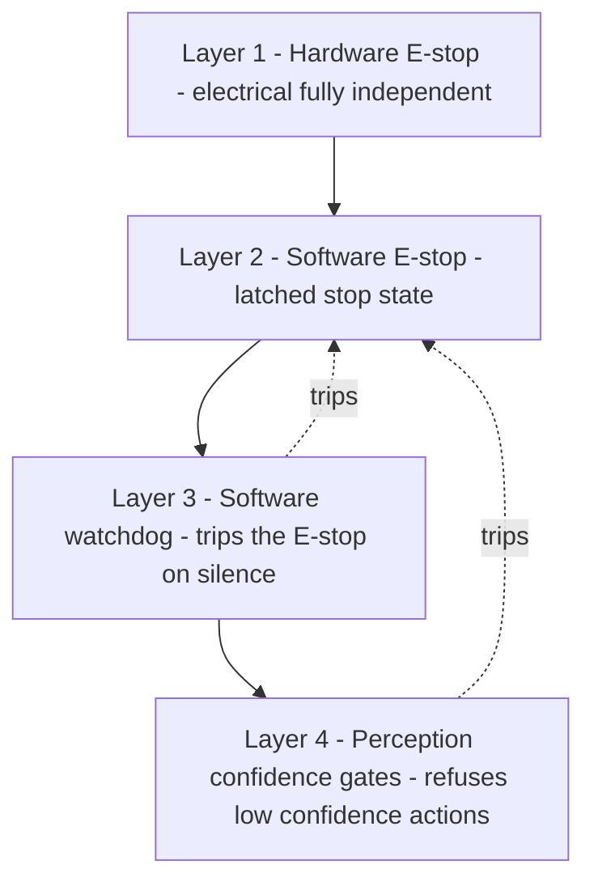
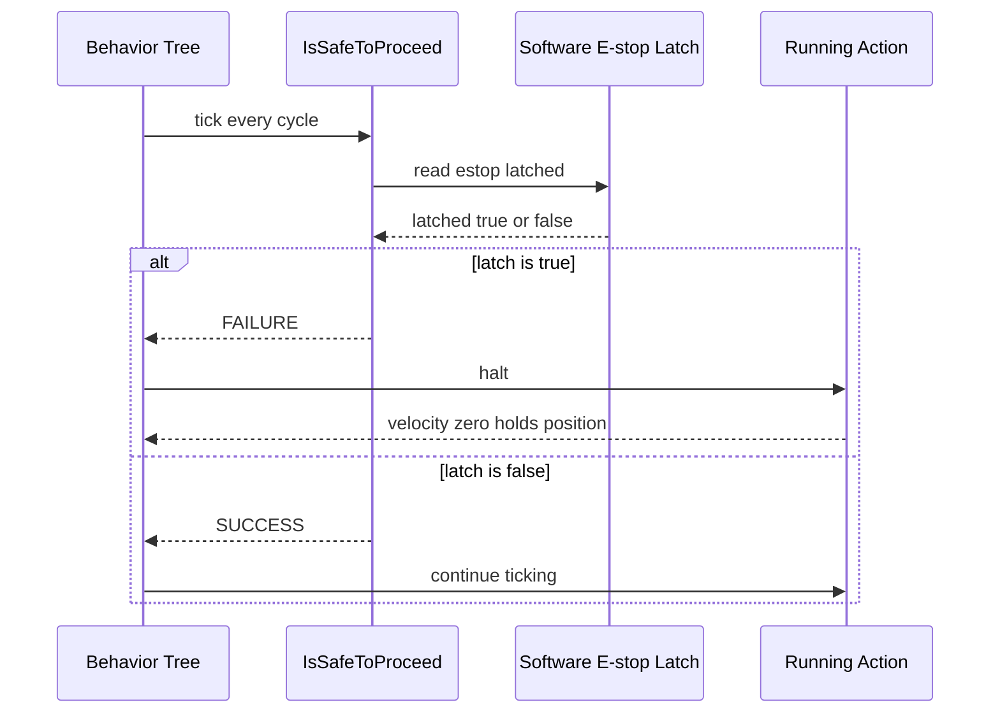

# Lecture 2 — Pre-flight Checklists and the Mitigation Stack

> **Duration:** ~2 hours of reading + wiring against your own stack.
> **Outcome:** You can run the path-appropriate pre-flight checklist (hardware bring-up for Path A, sim-production-grade for Path B) as a gate before the robot moves, and you can design, implement, and argue a four-layer defense-in-depth mitigation stack — hardware E-stop, software E-stop, software watchdog, perception confidence gates — including each layer's independence, failure mode, and the residual risk that remains after all four.

If lecture 1 was "find the hazards and rate them," this lecture is "stop them, prove it, and admit what's left." One sentence to carry:

> **A mitigation you cannot point to in the running system, and cannot test, is not a mitigation — it is a hope.** Every layer below has code, a heartbeat, or a continuity check behind it. Hopes don't go in safety cases.

---

## 1. Why a pre-flight checklist exists

Aviation does not let a 200-million-dollar aircraft leave the gate on the pilot's memory. It runs a checklist — out loud, item by item, every single time — because the cost of a missed item is a smoking hole. A robot that drives near people is a (much cheaper) version of the same bet, and the pre-flight checklist is how you keep the bet honest.

The checklist is the *entry gate* to every session where the robot moves. It is not optional, it is not "I'll skip it because I ran it yesterday," and it is not a thing you do once and write down. It runs **before every bring-up** and it has hard stops: if an item fails, the robot does not move until the item is green. The reason is the same reason aviation runs it: the items that kill you are the boring ones you "know" are fine — the E-stop you assume is wired, the contactor you assume opens, the watchdog you assume is alive.

You are on Path A (hardware) or Path B (sim-production-grade). The checklists differ; the *discipline* — hard stops, every time, out loud or in CI — is identical.

---

## 2. Path A — the hardware bring-up pre-flight checklist

This is the checklist you run on the bench (and again on the floor) before a real robot moves under your stack. Order matters: you verify the things that *stop* the robot before you ever enable the things that *move* it.

### Phase 0 — power and emergency stop (before anything is energized to move)

- [ ] **Hardware E-stop continuity.** With the E-stop *pressed*, confirm the motor-power contactor is open — measure it, do not assume. A multimeter across the contactor output reads no bus voltage. This is the single most important item; if it fails, nothing else matters.
- [ ] **E-stop release behavior.** Releasing the E-stop must *not* spontaneously re-energize motion. A reset/re-arm step is required (a latched stop that needs a deliberate re-arm, not auto-recovery).
- [ ] **Battery state.** Voltage above the low-cutoff; no cell imbalance warning; charger disconnected; battery temperature nominal. (Lithium is an energy source — treat it like one.)
- [ ] **Arm brake-on-power-loss.** Cut motor power deliberately and confirm the arm *holds* (brake engages) rather than falling under gravity. If it falls, this is a top-RPN hazard and motion is forbidden until fixed.

### Phase 1 — sensors and estimation (before the planner is allowed to plan)

- [ ] **All sensor topics publishing at expected rate.** `ros2 topic hz /scan`, `/imu/data`, `/odom`, `/camera/depth/image_rect_raw` — each within tolerance. A sensor that is silent now will be silent mid-task.
- [ ] **IMU bias / calibration sane.** Stationary, the IMU reports near-zero angular velocity and ~9.81 m/s² on the gravity axis. A bad IMU bias poisons the EKF.
- [ ] **Encoder sanity.** Push the base by hand a known distance; `/odom` moves the right direction and roughly the right magnitude. A reversed or scaled encoder is a silent killer.
- [ ] **TF tree complete.** `ros2 run tf2_tools view_frames` shows `map → odom → base_link → sensor frames` with no gaps and no stale transforms.
- [ ] **Localization converged.** AMCL (or your localizer) has converged to a tight covariance before you trust a goal. A diffuse pose cloud means the robot does not know where it is.

### Phase 2 — safety stack liveness (before autonomy is enabled)

- [ ] **Software watchdog alive and tripping.** Kill a sensor node on purpose and confirm the watchdog trips the software E-stop within its deadline. A watchdog you have never seen trip is a watchdog you do not have.
- [ ] **Software E-stop commands zero.** Trigger the software E-stop and confirm commanded velocity goes to zero / the arm holds — observed on the wire (`ros2 topic echo /cmd_vel`), not assumed.
- [ ] **Perception confidence gate active.** Confirm low-confidence detections are being suppressed (force a low-confidence case and watch the gate refuse to act).
- [ ] **Collision monitor / safety zones loaded.** Nav2 collision_monitor (or equivalent) is running and its zones are configured to your ODD speeds.
- [ ] **Network / DDS healthy.** No QoS-mismatch warnings on the velocity topic; `ros2 doctor` clean; no orphaned nodes from a previous crashed session.

### Phase 3 — go / no-go

- [ ] **A human is assigned to the hardware E-stop and is within reach.** Not "someone is around" — a *named* person whose only job for the next run is the red button.
- [ ] **The area is clear / bystanders briefed.** People in the test area know the robot is about to move and what to do.
- [ ] **The session is logged.** `ros2 bag record` is rolling so a postmortem is possible.

Only when every box is green does the robot get an autonomy goal. If you find yourself wanting to skip Phase 0 because "the E-stop was fine yesterday," that is exactly the thought that precedes the incident. Run it.

---

## 3. Path B — the sim-production-grade pre-flight checklist

Path B treats the simulator (Gz Sim or Isaac Sim) as the deployment target and holds it to *production* standards, not "it ran on my laptop once." The hazards are different — nobody loses a finger to a simulated gripper — but the engineering discipline of a clean, deterministic, observable system is the entire point, and it is exactly what Week 42 hardens further.

### Phase 0 — deterministic launch graph

- [ ] **Clean cold boot in under 60 seconds.** From `colcon` build to "all nodes up, localized, ready for a goal" in under a minute, repeatably. Time it. (Week 42 makes this a hard requirement; start measuring now.)
- [ ] **No orphaned nodes.** After `Ctrl+C` on the launch file, `ros2 node list` is empty. A launch graph that leaks nodes will deadlock on the next boot.
- [ ] **Deterministic node startup order.** Lifecycle nodes come up in dependency order (sensors → localization → planning → behavior tree); no node races ahead of its inputs.
- [ ] **Single source of truth for parameters.** All tunables (speeds, gate thresholds, watchdog deadlines) come from one params file, version-controlled, not scattered across launch arguments.

### Phase 1 — observability

- [ ] **Telemetry up.** Pose, costmap, policy actions, and safety-filter triggers are publishing and visible (Foxglove or rqt). You cannot validate what you cannot see; Week 43 builds the full dashboard, but the streams exist now.
- [ ] **Diagnostics aggregated.** `diagnostic_aggregator` shows every critical node as OK; a stale heartbeat shows up as a visible WARN/ERROR, not a silent gap.
- [ ] **Logs structured and captured.** Node logs go somewhere you can grep after a failure.

### Phase 2 — fault injection wired

- [ ] **Sensor dropout is injectable.** You can kill `/scan` on command (this is literally the Week 46 chaos drill — wire the lever now) and watch the system degrade.
- [ ] **The watchdog trips on injected silence.** Same item as Path A: kill a sensor, confirm the software E-stop latches within deadline.
- [ ] **The confidence gate suppresses a forced low-confidence detection.**
- [ ] **A clean software E-stop and re-arm cycle works** — stop latches, re-arm is deliberate, no auto-recovery.

### Phase 3 — go / no-go

- [ ] **A determinism seed is set** so a failure is reproducible (sim noise seeded).
- [ ] **The run is recorded** (`ros2 bag` + sim state) for postmortem.
- [ ] **The success criterion for this session is written down** before the run, not rationalized after.

The Path B checklist looks softer because nobody gets hurt, but it is the foundation of the *production hardening* that Weeks 42–43 grade. A sim deployment that cold-boots in 8 seconds, leaks no nodes, surfaces every fault on a dashboard, and reproduces failures from a seed is a deployable system. One that "usually comes up if you run the launch file twice" is not.

---

## 4. The mitigation stack: defense in depth

Now the heart of the lecture. A single mitigation is a single point of failure. The whole discipline of safety engineering is **defense in depth**: independent layers, such that no *single* failure defeats all of them. For an autonomy stack near people, the canonical four layers are:

1. **Hardware E-stop** — physical, safety-rated, opens the motor contactor.
2. **Software E-stop** — a latched stop state in the stack that commands zero motion.
3. **Software watchdog** — a deadline monitor that *trips* the software E-stop when a node goes silent.
4. **Perception confidence gates** — refuse to act on perception the system is not confident in.

The order is deliberate: it runs from most-trustworthy-but-coarse (hardware E-stop: always works, but stops *everything*) to least-trustworthy-but-precise (confidence gate: subtle and surgical, but lives in the same software that might be failing). Let's take them one at a time, because the *independence* and *failure mode* of each is what makes or breaks your case.


*Four layers, most trustworthy and coarse at top, most precise and least independent at bottom.*

### Layer 1 — the hardware E-stop

A hardware E-stop is a safety-rated circuit that *physically removes motor power*. Press the mushroom button; a contactor (a big relay) opens; the motors lose bus voltage; the robot coasts/brakes to a stop. The defining property: **it works even if every line of your software is wedged, the Linux box has kernel-panicked, and the DDS is dead.** It is independent of the autonomy stack by construction, because it is wired in series with motor power, not commanded over a topic.

- **Independence:** total — it is electrical, not software. This is its entire value.
- **Failure modes:** a stuck contactor (welded contacts), a cut wire, a button that doesn't latch, a brake that doesn't engage when power drops. This is why Path A Phase 0 *measures* contactor-open with the button pressed: a hardware E-stop you have not verified is a decoration. To claim a Category 3 / PL d argument (ISO 13849-1), you need redundancy and monitoring in this channel — two contactors, monitored, so a single welded contact does not defeat the stop.
- **Limitation:** it is coarse (stops everything, ungracefully) and it requires a *human to press it*. It does not help against a hazard the human did not see coming in time. That is what layers 2–4 are for.

A safety case whose only hard, independent layer is a human pressing a button is weak — humans are slow and not always looking. The strong version adds an *automatic* opening of the same contactor: a safety-rated scanning LiDAR that opens the contactor through a safety relay when a person enters a stop zone, entirely outside ROS2. That is the inherently-trustworthy layer doing its job without waiting for a human.

### Layer 2 — the software E-stop

A software E-stop is a **latched stop state inside the stack**. When set, every motion-commanding path checks it and commands zero velocity / holds position, and the behavior tree halts running actions. It is set by: an operator button on the dashboard, the watchdog (layer 3), a confidence-gate violation (layer 4), or any node that detects an unsafe condition.

- **Independence:** *not* independent of the software — it lives in the same process space as the thing it might need to stop. If the node that owns the latch hangs, the latch is stuck wherever it was. This is the key honesty in your case: a software E-stop is a real, valuable layer, but it is *not* a substitute for the hardware one, because it shares a common cause (the computer) with most of what it's stopping.
- **Failure modes:** the latch node hangs; a motion path forgot to check the latch (a *new* node ships that drives the wheels without consulting the stop state — this is alarmingly common); the latch is set but a stale `cmd_vel` keeps the robot moving because the controller is republishing the last command. The mitigation for that last one is a *velocity-timeout* in the lowest motion layer: if no fresh command arrives within N ms, command zero. (Path A motor driver, or micro-ROS on the MCU, should enforce this independent of the higher stack.)
- **Design rule:** the software E-stop must be **latching** — once tripped, it stays tripped until a *deliberate* re-arm. A stop that auto-clears the moment the triggering condition passes will chatter the robot on and off and is worse than no stop. Re-arm is a human decision.

Here is the minimal shape (the full runnable node is exercise 2):

```python
import rclpy
from rclpy.node import Node
from std_msgs.msg import Bool
from geometry_msgs.msg import Twist


class SoftwareEStop(Node):
    """Latches a stop state; while latched, publishes zero Twist at a fixed rate.

    The latch is set by any trigger (operator, watchdog, confidence gate) and
    is only cleared by an explicit re-arm on /safety/rearm. This node owns the
    last word on /cmd_vel: a downstream mux gives it priority over autonomy.
    """

    def __init__(self) -> None:
        super().__init__("software_estop")
        self._latched = False
        self.create_subscription(Bool, "/safety/trip", self._on_trip, 10)
        self.create_subscription(Bool, "/safety/rearm", self._on_rearm, 10)
        self._zero_pub = self.create_publisher(Twist, "/cmd_vel_safe", 10)
        # 50 Hz: faster than any controller, so a latched zero always wins.
        self.create_timer(0.02, self._tick)

    def _on_trip(self, msg: Bool) -> None:
        if msg.data and not self._latched:
            self._latched = True
            self.get_logger().error("SOFTWARE E-STOP LATCHED")

    def _on_rearm(self, msg: Bool) -> None:
        # Re-arm is deliberate and only ever clears the latch, never sets it.
        if msg.data and self._latched:
            self._latched = False
            self.get_logger().warn("Software E-stop re-armed by operator")

    def _tick(self) -> None:
        if self._latched:
            self._zero_pub.publish(Twist())  # all-zero velocity, held at 50 Hz
```

### Layer 3 — the software watchdog

The watchdog is what makes the software E-stop *automatic* instead of "wait for a human." It monitors deadlines: each critical node publishes a heartbeat (or the watchdog subscribes to the node's data topic and times the gaps), and if any expected message is later than its deadline, the watchdog trips the software E-stop. This is your defense against the most insidious failure mode of all — **silent death**, where a node stops publishing and the rest of the stack happily keeps acting on the last stale data.

- **Independence:** partial. The watchdog is software, so it shares the common cause (the computer) with what it monitors — but it is a *separate node/process*, so it survives the death of the node it watches. A watchdog in the same process as the thing it watches is worse than useless; it dies with its patient.
- **Failure modes:** the watchdog process itself dies (mitigate: run it under a supervisor that restarts it, *or* — Path A — host the ultimate watchdog on the micro-ROS MCU so a full Linux hang still trips the contactor); a deadline set too loose to catch the failure in time; a deadline set too tight so it false-trips on normal jitter and gets disabled by a frustrated engineer (the worst outcome — a disabled safety function).
- **Design rule:** integrate with `diagnostic_updater` rather than reinventing heartbeats. Publish liveness from each critical node; let `diagnostic_aggregator` raise the alarm; have the watchdog subscribe to the aggregated diagnostics. This is the production pattern and it gives you the dashboard panel for free in Week 43.

The deadline math is part of the safety argument: if your perception cycle is 30 ms and your base does 0.5 m/s, a 200 ms watchdog deadline means the robot can travel up to 10 cm on stale data before the stop latches — state that number in the case, and check it is acceptable for your inflation radius. "The watchdog trips eventually" is not an argument; "the watchdog trips within 200 ms, during which the base travels ≤ 10 cm, which is inside the 30 cm inflation radius" is.

### Layer 4 — perception confidence gates

The most autonomy-specific layer. A confidence gate **refuses to act on perception the system is not confident in.** A detection below a confidence threshold does not get acted on; a depth image full of NaNs in glare does not get treated as "clear"; a policy action whose inputs are out-of-distribution gets vetoed by the classical fallback. This is the layer that addresses the FMEA rows about misperception and policy grounding errors — the rows the EU Machinery Regulation 2023/1230 now explicitly requires you to confront.

- **Independence:** weak — it is deep inside the same perception software whose mistakes it is trying to catch. A confidence gate cannot catch a *confidently wrong* perception (the EKF that diverges to a tight-but-false covariance, the detector that is 0.98 sure the knife is a cup). That blind spot is real and your case must name it; the confidence gate is necessary but it is the *least* independent of the four layers, which is exactly why it is the bottom of the stack and not the top.
- **Failure modes:** confidently-wrong perception (the gate sees high confidence and lets it through); a threshold tuned so high the robot refuses to do anything useful; a gate on the wrong signal (gating on detection confidence when the real risk is localization confidence).
- **Design rule:** gate on the *right* signal, and gate *conservatively* — when confidence is low, the safe action is usually to slow down or stop and ask the operator, not to guess. A confidence gate that, on low confidence, *reduces speed and requests assist* is doing exactly what a person does when they're not sure: slow down and look harder.

The minimal gate (full version in exercise 2):

```python
def gate_action(detection_confidence: float,
                depth_valid_fraction: float,
                min_conf: float = 0.6,
                min_depth_valid: float = 0.7) -> bool:
    """Return True only if it is safe to act on this perception.

    Conservative by construction: any signal below threshold vetoes the action.
    A vetoed action should slow/stop and request operator assist, not guess.
    """
    if detection_confidence < min_conf:
        return False                 # not sure what we're looking at
    if depth_valid_fraction < min_depth_valid:
        return False                 # too many NaNs (glare/reflective surface)
    return True
```

---

## 5. Wiring the software E-stop into the behavior tree (BT.CPP)

In C24 your task logic lives in a BehaviorTree.CPP (BT.CPP) tree (weeks 24–25). The software E-stop and the confidence gate are not separate from the tree — they *pre-empt* it. The mechanism is a **reactive sequence** with a safety **condition node** at the front: BT.CPP re-ticks the condition on every tick, and the moment it returns `FAILURE`, the running action below it is `halt()`-ed. That halt is how a latched stop actually stops a *running* manipulation action mid-motion, not just the next one.

A minimal safety condition node that reads the latch:

```cpp
#include "behaviortree_cpp/condition_node.h"

// Returns SUCCESS while it is safe to proceed, FAILURE the instant the
// software E-stop is latched. Placed at the front of a ReactiveSequence so
// a FAILURE here halts whatever action is currently running below it.
class IsSafeToProceed : public BT::ConditionNode
{
public:
  IsSafeToProceed(const std::string & name, const BT::NodeConfig & config)
  : BT::ConditionNode(name, config) {}

  static BT::PortsList providedPorts()
  {
    // The latch state is mirrored into the blackboard by a subscriber node
    // listening on /safety/estop_state. Read it here every tick.
    return { BT::InputPort<bool>("estop_latched") };
  }

  BT::NodeStatus tick() override
  {
    bool latched = false;
    if (!getInput("estop_latched", latched)) {
      // If we cannot even read the safety state, FAIL SAFE: assume unsafe.
      return BT::NodeStatus::FAILURE;
    }
    return latched ? BT::NodeStatus::FAILURE : BT::NodeStatus::SUCCESS;
  }
};
```

The corresponding tree fragment — note the `ReactiveSequence`, which is what makes the condition re-evaluated on *every* tick rather than once:

```xml
<root BTCPP_format="4">
  <BehaviorTree ID="MainTask">
    <ReactiveSequence>
      <!-- Re-checked every tick: a latch here halts the action below. -->
      <IsSafeToProceed estop_latched="{estop_latched}"/>
      <!-- The real task. Halted the instant IsSafeToProceed fails. -->
      <Sequence>
        <NavigateTo   goal="{pick_pose}"/>
        <PickObject   target="{target_object}"/>
        <NavigateTo   goal="{place_pose}"/>
        <PlaceObject  pose="{place_pose}"/>
      </Sequence>
    </ReactiveSequence>
  </BehaviorTree>
</root>
```

Two design rules a reviewer will check:

1. **Fail safe on read failure.** If the condition node cannot read the latch state (blackboard miss, stale value), it returns `FAILURE`, not `SUCCESS`. The safe default is "stop," never "proceed." A condition that defaults to proceeding when it doesn't know is the autonomy equivalent of a brake that releases when the cable is cut.
2. **The action must actually honor `halt()`.** A `ReactiveSequence` will *call* `halt()` on the running action, but only an action node that *implements* `halt()` to command zero velocity / hold position will actually stop. An action that ignores halt and runs to completion defeats the whole mechanism — this is the BT-level version of "the unchecked motion path" failure mode. Test it: latch mid-pick and confirm the arm stops, not finishes.

This is *also* where the confidence gate lives in a tree-based stack: a second condition (e.g. `PerceptionConfident`) at the front of the pick subtree, so a low-confidence detection fails the condition and halts the pick before the arm commits. The pattern is the same — reactive condition, fail safe, honor halt.


*The reactive sequence re-checks the latch every tick, so a trip mid-motion halts a running action, not just the next one.*

---

## 6. Independence and common-cause failure — the thing reviewers attack

The whole value of four layers is that they are *independent*: no single failure defeats more than one. Reviewers attack exactly this, so you must get it right.

Lay your four layers against their common causes:

| Layer | Lives in | Dies when… |
|---|---|---|
| Hardware E-stop | Electrical / contactor | Contactor welds; wire cut; (mitigated by redundant monitored contactors) |
| Software E-stop | Linux / ROS2 process | The Linux box hangs; the latch node hangs |
| Software watchdog | Linux / ROS2 process (separate) | The Linux box hangs; (mitigated by MCU-hosted ultimate watchdog) |
| Confidence gate | Perception software | Perception is confidently wrong; the Linux box hangs |

Read the right-hand column. Three of the four layers die when **the Linux box hangs**. That is a *common cause*: a single event (kernel panic, OOM kill, thermal shutdown) defeats the software E-stop, the watchdog, *and* the confidence gate simultaneously. Counting them as "three independent layers" against that event is a lie, and a good reviewer will say so.

The honest argument is: against most failures you have four independent layers; against a *full computer hang* you have exactly one — the hardware E-stop, and (if you built it) the safety-scanner-triggered automatic contactor open. That is *why* the hardware layer is non-negotiable and why a case that relies on software alone is not credible. State the common cause explicitly. A reviewer trusts a case that says "these three share a common cause, here is the one independent layer that survives it" far more than one that pretends four software-ish layers are four independent ones.

This is also why "two software mitigations" never equals "two layers" in your hazard log. If both die together, they are one layer with a backup copy, not two layers.

---

## 7. Residual risk — what's left, and who accepts it

You have applied four layers. The risk is lower. It is not zero — it is *never* zero — and pretending otherwise is the fastest way to fail the week. The residual-risk section states, honestly, what remains.

Three things make a residual-risk statement credible:

1. **It quantifies the remainder.** Not "low risk" but "the worst credible outcome after mitigation is a low-speed contact at ≤ 0.25 m/s producing ≤ 25 N on the forearm, below the ISO/TS 15066 quasi-static threshold of ~140 N for that region." Numbers, tied to a standard.
2. **It invokes ALARP.** "As Low As Reasonably Practicable" (UK/EU principle) means you have reduced risk until further reduction would be grossly disproportionate to the benefit. You argue that the remaining risk is ALARP: you considered further mitigations (a full safety cage, a second redundant scanner) and they were disproportionate for this use, *or* you adopt them. ALARP is the honest middle between "zero risk" (impossible) and "good enough" (negligent).
3. **It is accepted by a named person, on a stated basis, on a date.** This is the signature line. Risk acceptance is a *decision by a human*, not a property of the system. The decision-maker reads the residual risk and the evidence and signs.

The C24 marker for a complete residual-risk statement:

```
Residual risk: ACCEPTED by Jane Roe on 2026-06-12
  basis: validation plan §4 — all hazards with post-mitigation rating ≥ Medium tested and passed;
         worst credible contact ≤ 0.25 m/s, ≤ 25 N forearm, below ISO/TS 15066 threshold
  ALARP: yes — full enclosure considered and judged disproportionate for an indoor assistive use
  conditions of acceptance: ODD enforced; hardware E-stop verified each pre-flight; quarterly re-validation
```

If your safety case ends without a line of that shape, it is not finished. A signature with a basis is the difference between "we think it's safe" and "a named human accepts this specific residual risk for this specific use." The panel looks for this line first.

---

## 8. The validation plan — turning belief into evidence

A mitigation you have not tested is a hope. The validation plan is where each top hazard becomes a concrete, runnable test with a measured pass/fail criterion. It is the *evidence* layer of the safety case.

Each validation entry ties one hazard (and its mitigations) to a test:

| Field | Example |
|---|---|
| VP ID | VP-07 |
| Validates hazard | HZ-07 (arm strikes a bystander reaching in) |
| Mitigation under test | Speed gate + 15066 force limit + software E-stop |
| Method | Place a calibrated force rig in the arm's path; command a pick; person-proxy at 1.5 / 1.0 / 0.5 m to trigger the speed gate |
| Measurement | TCP speed (from `/joint_states` + FK) and peak contact force (rig load cell) |
| Pass criterion | TCP ≤ 0.25 m/s when proxy < 1.5 m; peak force ≤ 25 N; software E-stop latches when proxy < 0.5 m, observed on `/cmd_vel_safe` |
| Result | (filled in after running — speed 0.23 m/s, force 21 N, latch confirmed → PASS) |
| Evidence | rosbag link / plot / the test log |

Good validation plans share a property: **a skeptic could re-run the test and get the same answer.** The method is specific enough to reproduce, the measurement is on a real signal (the wire, a load cell, a stopwatch), and the pass criterion is a number, not a feeling. "We drove it around and it seemed fine" is not validation. "We measured TCP speed at three separation distances and it never exceeded 0.25 m/s across 50 trials" is.

Priority: validate every hazard whose *post-mitigation* rating is Medium or above, and every FMEA row above the criticality cutoff. You do not have to validate the negligible ones; you absolutely have to validate the ones whose residual risk you are asking a human to accept. The acceptance signature in §6 is only credible if the validation plan behind it actually ran.

---

## 9. How the whole week fits together

Step back and see the chain you have built:

```
Intended use / ODD  ──bounds──▶  Hazard log (energy-source walk)
                                        │
                                        ├──cross-refs──▶  FMEA (RPN, criticality cutoff)
                                        ▼
                              Mitigation stack (4 layers, defense in depth)
                                        │
                                        ├──independence argument (name the common cause)
                                        ▼
                              Residual risk (quantified, ALARP, SIGNED)
                                        │
                                        ▼
                              Validation plan (each top hazard → a runnable test → evidence)
```

That chain *is* the safety case. The claim ("acceptably safe for this use") sits at the top; the argument is the arrows; the evidence is the validation results at the bottom. A reviewer walks it both ways: top-down ("show me you considered this hazard") and bottom-up ("show me this test result actually backs that mitigation"). If the chain is unbroken and the signature is real, you have a portfolio-grade safety case. That is the Week 41 artifact.

---

## 10. Common ways the mitigation work goes wrong

- **Software-only defense in depth.** Four layers, all software, all die when the box hangs. One layer with three copies. Add the hardware contactor.
- **The non-latching stop.** A stop that auto-clears chatters the robot. Latch it; re-arm deliberately.
- **The unchecked motion path.** A new node ships that drives the wheels without consulting the software E-stop. Enforce the stop at a *mux* the autonomy cannot bypass, and velocity-timeout the lowest layer.
- **The never-tripped watchdog.** A watchdog nobody has watched trip. Trip it on purpose in every pre-flight.
- **The disproportionate confidence threshold.** A gate so strict the robot refuses to work, so someone disables it. A disabled safety function is the worst outcome — tune it to slow/assist, not to freeze.
- **Residual risk waved to zero.** "After mitigations the risk is eliminated." No. Quantify the remainder and sign it.
- **The untested mitigation.** A validation plan full of "will test" with no results. Run them; paste the numbers.

---

## 11. Recap

You should now be able to:

- Run the path-appropriate pre-flight checklist as a hard gate, with the safety-first ordering (verify what stops the robot before enabling what moves it).
- Distinguish a hardware E-stop (independent, electrical, coarse) from a software E-stop (in-process, precise, *not* independent), and explain why the software one is never a substitute.
- Build a software watchdog that makes the stop automatic, with a deadline you can justify in distance-on-stale-data terms.
- Design perception confidence gates that fail safe (slow / assist) and name their blind spot (confidently-wrong perception).
- Lay all four layers against their common causes, name the full-computer-hang common cause, and argue honestly about independence.
- Write a residual-risk statement that quantifies, invokes ALARP, and ends in a named signature on a stated basis.
- Write a validation plan where each top hazard maps to a reproducible test with a measured pass criterion.

That is the complete method. The rest of the week is you instantiating it for *your* capstone, in the exercises, the challenge, and the graded mini-project. Go build the case you would be willing to sign — because in the capstone, you are the one signing it.

---

## References

- *ISO 13849-1:2023 — safety-related parts of control systems (PL / Category)*: <https://www.iso.org/standard/73481.html>
- *ISO/TS 15066:2016 — collaborative robots (force/pressure thresholds)*: <https://www.iso.org/standard/62996.html>
- *Nav2 collision monitor*: <https://docs.nav2.org/configuration/packages/collision-monitor/configuration.html>
- *ROS 2 `diagnostic_updater`*: <https://docs.ros.org/en/jazzy/p/diagnostic_updater/>
- *micro-ROS (MCU-side watchdog / E-stop input)*: <https://micro.ros.org/>
- *HSE — ALARP*: <https://www.hse.gov.uk/managing/theory/alarpglance.htm>
- *BehaviorTree.CPP — reactive sequences for safety pre-emption*: <https://www.behaviortree.dev/>
