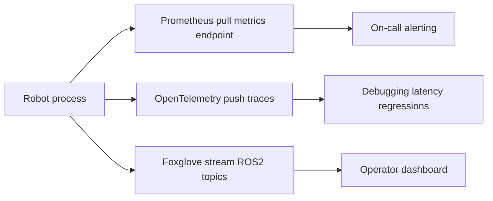
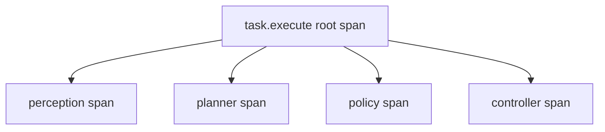

# Lecture 1 — The Operator Dashboard: Streaming Pose, Costmap, Policy Actions, and Safety Triggers

> **Duration:** ~2 hours of reading + hands-on.
> **Outcome:** You can explain the three telemetry pillars and which job each does; instrument an `rclpy` node with a Prometheus `/metrics` endpoint and an OpenTelemetry trace; and build a Foxglove dashboard that streams live pose, the Nav2 costmap, the policy's chosen action, and a latched safety-filter banner — the dashboard a remote operator stares at on shift.

If you only remember one thing from this lecture, remember this:

> **Telemetry is not logging.** Logging is text you read after a failure. Telemetry is structured, numeric, time-aligned signal you watch *while the robot runs* so you can act *before* the failure. A robot you cannot see is a robot you cannot trust in a shared space.

---

## 1. The three pillars, and why you run all three

New engineers ask "Prometheus, OpenTelemetry, or Foxglove — which one?" The senior answer is *yes*. They are not competitors; they answer three different questions, and a serious robot fleet runs all three at once.

| Pillar | Model | Answers the question | Data shape | Who looks at it |
|--------|-------|----------------------|------------|-----------------|
| **Prometheus** | Pull (scrape) | "Is the robot healthy *right now*, and alert me if not." | Numeric time-series (gauges, counters, histograms) | On-call, alerting rules |
| **OpenTelemetry** | Push (export) | "Where did the 80 ms in this task execution go?" | Traces (spans) + structured metrics | Debugging a latency regression |
| **Foxglove** | Stream (WebSocket / MCAP) | "What is the robot *seeing and doing* right now?" | Live ROS messages rendered as panels | The operator on shift |

The mapping to Google's **four golden signals** (latency, traffic, errors, saturation) is exact and worth internalizing, because it is the vocabulary every SRE who reviews your capstone will use:

- **Latency** — your perception/planner/policy cycle time. A Prometheus *histogram*; a Foxglove *plot*; an OTel *span duration*.
- **Traffic** — tasks per minute, goals accepted. A Prometheus *counter*.
- **Errors** — safety-filter triggers, planner failures, dropped sensor frames. A Prometheus *counter* and a Foxglove *indicator banner*.
- **Saturation** — CPU%, GPU%, thermal headroom, battery. A Prometheus *gauge* and a Foxglove *gauge panel*.


*The same robot process feeds three telemetry pillars, each reaching a different consumer.*

The mistake to avoid is "just publish everything on ROS2 topics and call it telemetry." ROS2 topics are great for *live* data the robot consumes, and Foxglove reads them directly. But ROS2 has no retention, no query language, and no alerting. You cannot ask a ROS2 topic "what was the p99 cycle latency over the last hour" or "page me when the heartbeat goes stale." That is Prometheus's job, and it is why we run it alongside the topic graph rather than instead of it.

Install the Python-side dependencies now:

```bash
pip install prometheus-client opentelemetry-sdk \
    opentelemetry-exporter-otlp-proto-grpc psutil
sudo apt install ros-jazzy-foxglove-bridge
```

---

## 2. Prometheus on a robot

Prometheus *pulls*. Your robot exposes an HTTP endpoint — conventionally `/metrics` on a port like `9100` — and a Prometheus server scrapes it every few seconds. The robot does not push; it just exposes. This is deliberate: a scrape that fails *is itself a signal* ("the robot stopped answering"), which a push model hides.

### 2.1 The three metric types you actually use

- **Counter** — monotonically increasing. Tasks completed, safety triggers fired, frames dropped. You never decrement a counter; you reset it only on process restart. You query *rates* of counters (`rate(safety_triggers_total[5m])`), never the raw value.
- **Gauge** — a value that goes up and down. CPU%, GPU%, battery percent, heartbeat age, current cycle latency. The number you read *is* the current state.
- **Histogram** — a distribution. Cycle latency is the canonical one: you want p50/p95/p99, not a mean, because a mean of 20 ms hides the 90 ms tail that blows your 30 ms perception budget once a second.

### 2.2 Instrumenting an `rclpy` node

Here is a self-contained telemetry node for the capstone. It exposes a `/metrics` endpoint, times its own work loop into a histogram, and tracks CPU and a synthetic cycle as gauges. Drop it in `capstone_ops/capstone_ops/metrics_node.py`.

```python
#!/usr/bin/env python3
"""Prometheus metrics endpoint for the capstone robot.

Exposes /metrics on :9100. A Prometheus server scrapes it; Grafana or the
Prometheus expression browser graphs it; an Alertmanager rule pages on it.
"""
import time

import psutil
import rclpy
from prometheus_client import Counter, Gauge, Histogram, start_http_server
from rclpy.node import Node
from std_msgs.msg import Float64

# Module-level registry objects. Label cardinality is deliberately LOW:
# on an embedded box, every distinct label combination is a separate time
# series in RAM. "robot" is fine (one value); "task_id" would be a footgun.
CYCLE_LATENCY = Histogram(
    "capstone_cycle_latency_seconds",
    "Wall-clock duration of one perception->policy cycle.",
    buckets=(0.005, 0.010, 0.020, 0.030, 0.050, 0.080, 0.120, 0.250),
    labelnames=("robot",),
)
CPU_PERCENT = Gauge(
    "capstone_cpu_percent", "Whole-box CPU utilisation.", ("robot",)
)
SAFETY_TRIGGERS = Counter(
    "capstone_safety_triggers_total",
    "Count of safety-filter activations since boot.",
    ("robot", "reason"),
)


class MetricsNode(Node):
    def __init__(self) -> None:
        super().__init__("capstone_metrics")
        self.declare_parameter("robot_id", "capstone-01")
        self.declare_parameter("metrics_port", 9100)
        self._robot = self.get_parameter("robot_id").value
        port = int(self.get_parameter("metrics_port").value)

        # One HTTP server thread serves /metrics for the lifetime of the node.
        start_http_server(port)
        self.get_logger().info(f"Prometheus /metrics live on :{port}")

        # Subscribe to the real cycle-latency signal the autonomy stack
        # publishes (seconds). If your stack does not publish this yet,
        # exercise-02 shows how to add it.
        self.create_subscription(
            Float64, "/perf/cycle_latency", self._on_cycle, 10
        )
        # Sample the CPU once a second on a wall-clock timer.
        self.create_timer(1.0, self._sample_cpu)

    def _on_cycle(self, msg: Float64) -> None:
        CYCLE_LATENCY.labels(robot=self._robot).observe(msg.data)

    def _sample_cpu(self) -> None:
        # interval=None means "since the last call" — non-blocking.
        CPU_PERCENT.labels(robot=self._robot).set(psutil.cpu_percent(interval=None))

    def record_safety_trigger(self, reason: str) -> None:
        """Call this from the safety filter when it fires."""
        SAFETY_TRIGGERS.labels(robot=self._robot, reason=reason).inc()


def main() -> None:
    rclpy.init()
    node = MetricsNode()
    try:
        rclpy.spin(node)
    except KeyboardInterrupt:
        pass
    finally:
        node.destroy_node()
        rclpy.shutdown()


if __name__ == "__main__":
    main()
```

A few load-bearing decisions in that code:

- **Label cardinality is kept tiny.** `robot` has one value; `reason` has maybe five. We would *never* add a `task_id` label — Prometheus would create a new time series per task and exhaust the Orin's RAM in a day. This is the single most common Prometheus mistake on embedded boxes.
- **The histogram buckets are chosen around the 30 ms budget**, with explicit buckets at 30 ms and 50 ms so the p95/p99 query has resolution exactly where you care. Default buckets (which top out around 10 s) would put your entire distribution in one bucket and tell you nothing.
- **`psutil.cpu_percent(interval=None)`** is non-blocking — it reports utilisation since the previous call. Passing `interval=1.0` would *block the executor for a second*, which on a single-threaded executor would stall every callback. Never do blocking work in a timer callback.

### 2.3 The scrape config and one alert rule

Point a local Prometheus at the robot. `prometheus.yml`:

```yaml
global:
  scrape_interval: 5s

scrape_configs:
  - job_name: capstone
    static_configs:
      - targets: ["robot.local:9100"]
        labels:
          fleet: crunch-capstone

rule_files:
  - alerts.yml
```

And the alert that matters most this week — the robot has gone silent or its cycle is blowing budget. `alerts.yml`:

```yaml
groups:
  - name: capstone
    rules:
      - alert: RobotUnreachable
        expr: up{job="capstone"} == 0
        for: 10s
        labels: { severity: page }
        annotations:
          summary: "Capstone robot stopped answering scrapes"
      - alert: CycleBudgetBlown
        expr: |
          histogram_quantile(0.95,
            rate(capstone_cycle_latency_seconds_bucket[1m])) > 0.030
        for: 30s
        labels: { severity: page }
        annotations:
          summary: "p95 cycle latency over the 30ms budget"
```

`up == 0` is the most important alert you will ever write for a robot: it fires when the scrape *itself* fails, which is exactly the "the robot fell off the network mid-task" failure the pull model surfaces for free.

---

## 3. OpenTelemetry for the autonomy pipeline

Prometheus tells you *that* the cycle is slow. OpenTelemetry tells you *where*. A trace is a tree of spans; each span is a timed unit of work with a name, a start, a duration, and attributes. For a robot, the right trace granularity is **one task execution**, with a child span per pipeline stage: perception, planner, policy, controller. When the p95 alert fires, you open the trace and see instantly that the policy span ballooned from 8 ms to 70 ms — and you go look at the policy, not the LiDAR driver.


*One trace per task execution, with a child span per pipeline stage.*

```python
"""OpenTelemetry tracing for the autonomy pipeline.

One trace per task; one span per stage. Export over OTLP to a collector
running on the operator workstation (or localhost during development).
"""
from opentelemetry import trace
from opentelemetry.exporter.otlp.proto.grpc.trace_exporter import OTLPSpanExporter
from opentelemetry.sdk.resources import Resource
from opentelemetry.sdk.trace import TracerProvider
from opentelemetry.sdk.trace.export import BatchSpanProcessor


def init_tracing(robot_id: str, collector: str = "localhost:4317") -> trace.Tracer:
    resource = Resource.create({"service.name": "capstone-autonomy",
                                "robot.id": robot_id})
    provider = TracerProvider(resource=resource)
    # BatchSpanProcessor buffers spans and exports them off the hot path,
    # so tracing does not add latency to the cycle it is measuring.
    provider.add_span_processor(
        BatchSpanProcessor(OTLPSpanExporter(endpoint=collector, insecure=True))
    )
    trace.set_tracer_provider(provider)
    return trace.get_tracer("capstone")


tracer = init_tracing("capstone-01")


def execute_task(instruction: str) -> bool:
    # The root span covers the whole task; child spans cover each stage.
    with tracer.start_as_current_span("task.execute") as task_span:
        task_span.set_attribute("instruction", instruction)

        with tracer.start_as_current_span("perception"):
            objects = run_perception()

        with tracer.start_as_current_span("planner") as plan_span:
            plan = plan_path(objects)
            plan_span.set_attribute("plan.length_m", plan.length)

        with tracer.start_as_current_span("policy") as policy_span:
            action = policy.act(objects, plan)
            policy_span.set_attribute("action.type", action.kind)

        with tracer.start_as_current_span("controller"):
            ok = controller.execute(action)

        task_span.set_attribute("task.success", ok)
        return ok
```

The reason `BatchSpanProcessor` matters: it buffers and exports spans on a *background* thread. If you exported synchronously at the end of each span, you would add the export latency to the very cycle you are trying to measure — the observer would change the observed. Use the batch processor on a robot, always.

You do not need a full OTel Collector deployment for the capstone. Running `otelcol --config otel-config.yaml` on your laptop with an OTLP receiver and a `debug` exporter is enough to *see* the traces during development; the resources page links the collector docs if you want to fan out to Jaeger.

---

## 4. Foxglove: the operator's eyes

Prometheus and OTel are for engineers. **Foxglove is for the operator** — the person on shift who needs to glance at a screen and know what the robot is doing and whether it is about to do something stupid. Foxglove connects to your running robot through the **`foxglove_bridge`** node, which exposes every ROS2 topic over a WebSocket the Foxglove app subscribes to. Launch it:

```bash
ros2 run foxglove_bridge foxglove_bridge --ros-args -p port:=8765
```

Then in Foxglove (desktop or web): **Open connection → Foxglove WebSocket → `ws://robot.local:8765`**. Every topic the robot publishes is now available to drop into a panel.

The capstone dashboard has exactly five things on it, mapped to the five required streams from the syllabus:

| Stream | ROS2 topic | Message type | Foxglove panel |
|--------|-----------|--------------|----------------|
| **Pose** | `/amcl_pose` or `/localization/pose` | `geometry_msgs/PoseWithCovarianceStamped` | 3D |
| **Costmap** | `/global_costmap/costmap` | `nav_msgs/OccupancyGrid` | 3D (as a map layer) |
| **Policy action** | `/policy/action_marker` | `visualization_msgs/Marker` | 3D (overlay arrow) |
| **Safety trigger** | `/safety/trigger` | custom `SafetyTrigger` (latched) | Indicator (banner) |
| **CPU/GPU load** | `/diagnostics` | `diagnostic_msgs/DiagnosticArray` | Gauge + Indicator |

### 4.1 Pose, costmap — already on the wire

If your Week 18 Nav2 stack and Week 7/Week 32 localization are integrated, `/amcl_pose` and `/global_costmap/costmap` already publish. In Foxglove's **3D panel**, add a topic for each: the costmap renders as a colored occupancy layer, the pose as a coordinate frame. Set the panel's **fixed frame** to `map`. If the costmap does not appear, check that it is latched (transient-local QoS) — `nav_msgs/OccupancyGrid` is published with transient-local durability so a late-joining subscriber (Foxglove just connected) still gets the last map.

### 4.2 Rendering the policy's chosen action

The policy node already decides an action each cycle. To *show* it, publish a `visualization_msgs/Marker` arrow pointing the way the policy chose to go (or a sphere at the grasp target for a manipulation action). This is a tiny adapter node:

```python
"""Render the policy's chosen action as a Foxglove-visible Marker."""
import rclpy
from geometry_msgs.msg import Point
from rclpy.node import Node
from visualization_msgs.msg import Marker

from capstone_msgs.msg import PolicyAction  # your Week-32 action message


class ActionMarkerNode(Node):
    def __init__(self) -> None:
        super().__init__("action_marker")
        self._pub = self.create_publisher(Marker, "/policy/action_marker", 10)
        self.create_subscription(
            PolicyAction, "/policy/action", self._on_action, 10
        )

    def _on_action(self, action: PolicyAction) -> None:
        m = Marker()
        m.header.frame_id = "base_link"
        m.header.stamp = self.get_clock().now().to_msg()
        m.ns = "policy"
        m.id = 0
        m.type = Marker.ARROW
        m.action = Marker.ADD
        # Arrow from the base origin toward the commanded direction.
        m.points = [
            Point(x=0.0, y=0.0, z=0.1),
            Point(x=float(action.linear_x), y=float(action.linear_y), z=0.1),
        ]
        m.scale.x = 0.05   # shaft diameter
        m.scale.y = 0.10   # head diameter
        m.scale.z = 0.0
        # Green for a normal action; the safety filter recolors on override.
        m.color.r, m.color.g, m.color.b, m.color.a = 0.1, 0.9, 0.2, 0.9
        self._pub.publish(m)


def main() -> None:
    rclpy.init()
    node = ActionMarkerNode()
    rclpy.spin(node)
    node.destroy_node()
    rclpy.shutdown()
```

Now the operator sees, in real time, *which way the policy wants to go* — a green arrow on the 3D panel that swings as the robot reasons. When the safety filter overrides the policy, exercise 1 recolors that arrow red, and the operator sees the override happen.

### 4.3 The latched safety-filter banner

The single most operationally important panel is the **safety banner**: a big red indicator that lights up the instant the safety filter overrides the policy (an obstacle too close, a confidence gate failed, a velocity clamp engaged). Define a tiny custom message so the banner carries *why*:

```
# capstone_msgs/msg/SafetyTrigger.msg
bool active            # true while the filter is overriding
string reason          # "obstacle_proximity", "low_confidence", "velocity_clamp", ...
float32 severity       # 0.0 .. 1.0
builtin_interfaces/Time stamp
```

Publish it **latched** (transient-local, depth 1) so a freshly-connected Foxglove instantly knows the current safety state rather than waiting for the next event:

```python
from rclpy.qos import QoSProfile, DurabilityPolicy

latched = QoSProfile(depth=1)
latched.durability = DurabilityPolicy.TRANSIENT_LOCAL
self._safety_pub = self.create_publisher(SafetyTrigger, "/safety/trigger", latched)
```

In Foxglove, an **Indicator panel** bound to `/safety/trigger.active` shows green when `false` and red when `true`, with `/safety/trigger.reason` as the label. That banner is the thing the operator's eye is drawn to. In Week 46's chaos drill, when the LiDAR dies and the safety filter clamps velocity, this banner is how the operator *detects the event inside 60 seconds* — which is the literal pass condition for the gameday.

---

## 5. Putting the layout together (and version-controlling it)

A Foxglove **layout** is JSON. Build it once — a 3D panel (pose + costmap + action arrow), an Indicator (safety banner), a Plot (cycle latency from `/perf/cycle_latency`), and the Gauge panels from the CPU/GPU diagnostics (Lecture-1 exercise 2 builds those) — then **export it** (`⋯ → Export layout`) and commit the JSON to your capstone repo at `dashboard/capstone_layout.json`. This matters because the layout *is a deliverable*: anyone who clones your repo and runs the robot should be able to import that JSON and get the exact operator view, and the week-48 panel imports it to grade you.

Recording is one button. Foxglove records the live connection to an **MCAP** file. A single MCAP replays every panel deterministically — scrub backward and the safety banner, the pose, the costmap, and the latency plot all rewind together. Your **week-48 dashboard recording is exactly this**: a 3-minute MCAP (or screen recording of one) of a real task execution. We do a dry run of it in the mini-project.

---

## 6. The "operator can see it" line, decoded

The week's recurring marker:

```
[ops] heartbeat OK · authority=AUTONOMY · cycle p99=27ms · gpu=61% · thermal=58°C
```

Every field on that line now has a home:

- **`heartbeat OK`** — the `/fleet/heartbeat` consumer reports the robot's heartbeat age is under threshold (Lecture 2 / exercise builds the heartbeat; the staleness check scrapes into Prometheus).
- **`authority=AUTONOMY`** — the control-authority arbiter's latched state, shown as a banner (Lecture 2).
- **`cycle p99=27ms`** — `histogram_quantile(0.99, ...)` on `capstone_cycle_latency_seconds`, plotted in Foxglove and alerted in Prometheus.
- **`gpu=61%` / `thermal=58°C`** — the `DiagnosticArray` from the CPU/GPU panel (exercise 2), rendered as Foxglove gauges.

If your dashboard cannot show every one of those fields live, you are not done. That is the whole contract of the week, and the rest of the capstone is flown on this instrument panel.

---

## 7. What we deliberately did not build here

- **A Grafana deployment.** Prometheus's own expression browser is enough to verify scrapes this week; Grafana is a stretch goal and a Week 46 tool. The numbers are the point, not the dashboarding chrome.
- **A full OTel Collector fan-out to Jaeger.** We export traces to a local collector with a debug exporter so you *see* spans. Production trace storage is out of scope for one capstone robot.
- **Securing the WebSocket bridge across a WAN.** `foxglove_bridge` here runs on the LAN. Remote teleop over the public internet (DTLS, TURN, jitter buffers) is named in Lecture 2 and left for a specialist week.

The point of Lecture 1 is a narrow, sharp capability: three pillars wired, four streams plus the load panel on a Foxglove layout you can commit, and a safety banner an operator's eye is drawn to. Lecture 2 makes the robot *operable* — the takeover and the OTA — on top of this observability.

---

## Check yourself

1. Why does Prometheus *pull* rather than have the robot *push*, and what failure does the pull model surface for free?
2. You add a `task_id` label to a Prometheus counter. Why is this a footgun on an Orin Nano?
3. The p95 cycle-latency alert fires. Which pillar do you open next to find out *where* the time went, and what is the right trace granularity?
4. Why is `/safety/trigger` published with transient-local (latched) QoS rather than the default?
5. Why must you use `BatchSpanProcessor` rather than a synchronous exporter when tracing a robot's hot loop?
6. The costmap does not appear when Foxglove connects mid-run. What QoS property is the likely cause, and how do you confirm it?

Answers are in the quiz and the exercise solutions. When you can build the layout from a cold start and explain every panel's data source, move to [Lecture 2 — OTA Updates and Teleop Assist](./02-ota-updates-and-teleop-assist.md).
