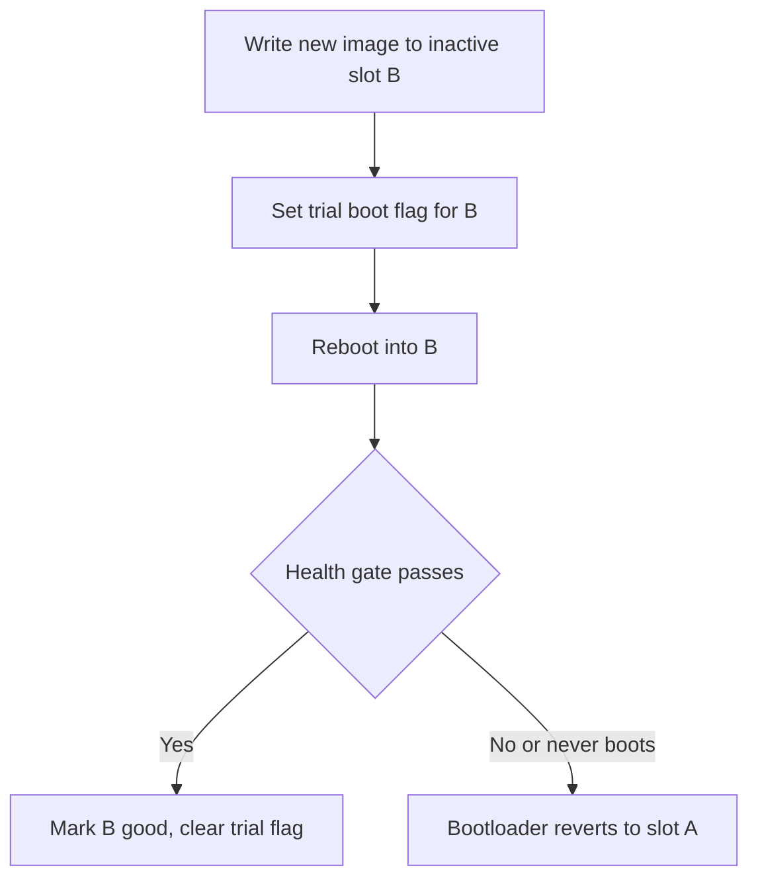
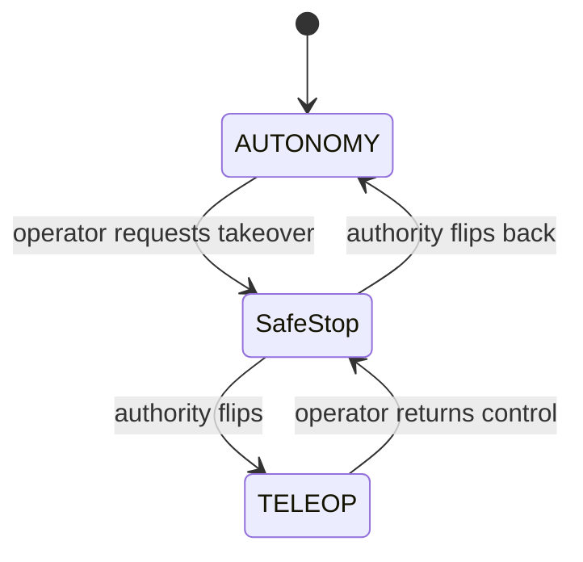

# Lecture 2 — OTA Updates for Robots and Remote Teleop Assist

> **Duration:** ~1 hour of reading + hands-on, plus the arbiter build in the exercises.
> **Outcome:** You can design an OTA-update procedure that does not brick the robot (extending C7's A/B-partition and health-gate patterns), and you can build a lifecycle-managed control-authority arbiter that powers a one-click teleop takeover with an atomic, safe-stopped transition that the dashboard shows.

If you only remember one thing from this lecture, remember this:

> **A takeover is a state machine, not a button.** The button is trivial. The hard part is the transition: autonomy must stop driving *atomically* with teleop starting to drive — no blind coast, no two-publisher fight over `/cmd_vel`. The clean way is a single arbiter that owns the output and a defined one-cycle safe-stop on every authority flip.

---

## 1. Why robots brick, and the two rules that prevent it

You learned the embedded version of this in C7. The robot version has the same physics. A robot is a Linux box (a Jetson Orin on Path A) running a ROS2 graph. Updating it means replacing software on a machine that you cannot walk over to and re-flash with a USB stick — it might be in a warehouse three states away. Get the update wrong and the robot does not boot, or boots into a broken graph, and now it is a 40 kg paperweight blocking an aisle.

Two rules prevent every brick:

> **Rule 1 — Never modify the running system in place.** `apt upgrade` on a live robot is how you brick a fleet. A package upgrade that fails halfway leaves a half-installed system that may not boot. The fix is *update a copy, then switch* — the A/B pattern.
>
> **Rule 2 — Never trust an update until it proves itself healthy.** After switching to the new software, the robot must *pass a health gate* before the switch is made permanent. If the gate fails — the graph does not come up, the heartbeat goes stale, the perception cycle blows budget — the robot rolls back automatically to the known-good version.

These are the same two rules C7 taught for MCU firmware (A/B flash banks + a bootloader watchdog that rolls back if the new image fails to "kick" the watchdog). We are lifting them up the stack to a full Linux robot.

---

## 2. Two OTA strategies for a ROS2 robot

There are two industry-standard ways to do "update a copy, then switch" on a robot. Pick one for your capstone and document it; both clear the bar.

### 2.1 Strategy A — A/B system partitions (RAUC / Mender)

The rootfs lives on one of two partitions, slot **A** and slot **B**. The robot is running slot A. To update:

1. Download the new full rootfs image and write it to the **inactive** slot B. The running system on A is untouched, so a failed or interrupted download cannot brick anything.
2. Tell the bootloader "next boot, try B, but only *once* (a trial boot)."
3. Reboot. The bootloader brings up B with a *trial* flag set.
4. On B, a health-gate service runs (next section). If it passes, it marks B "good" and the trial flag is cleared — B is now the permanent active slot.
5. If the health gate fails, or B never reaches the point of clearing the trial flag (because it did not boot, or the graph crashed), the bootloader's watchdog **reverts to A on the next reboot**.

This is what RAUC and Mender do. It is the most robust option because a bad update *cannot* take down the robot — the worst case is one failed trial boot and an automatic revert. It is heavier to set up (you need a bootloader that supports slot switching — U-Boot or GRUB with a boot-count mechanism, which the Jetson Orin's bootloader supports).


*Strategy A: update the inactive slot, trial boot it, and only promote after the health gate passes.*

### 2.2 Strategy B — Container-image swap (balena-style)

The autonomy stack runs in containers. To update, you pull a new image to the inactive tag, start the new container, health-gate it, and only then stop the old one and repoint the "current" symlink. The OS underneath never changes. This is lighter to set up on a dev box and is what a lot of robot startups actually ship, at the cost that you are *not* protected against a bad kernel or driver update (those live in the host OS, which this strategy does not touch). For a sim-only Path B capstone, Strategy B is the natural choice — you are updating a `colcon`-built workspace inside a container, not a Jetson rootfs.

A minimal container-swap script that honors both rules:

```bash
#!/usr/bin/env bash
# ota-apply.sh — container-image OTA with health gate and rollback.
# Extends the C7 A/B + health-gate pattern to a containerised ROS2 stack.
set -euo pipefail

NEW_IMAGE="$1"                       # e.g. registry/capstone:2026.06.09
CURRENT_LINK="/srv/capstone/current" # symlink to the running container's tag
HEALTH_TIMEOUT=90                    # seconds the gate has to pass

echo "[ota] pulling ${NEW_IMAGE}"
docker pull "${NEW_IMAGE}"

OLD_CONTAINER="$(readlink -f "${CURRENT_LINK}" 2>/dev/null || echo none)"

echo "[ota] starting candidate container (autonomy paused on boot)"
docker run -d --name capstone-candidate \
    --network host --restart no \
    -e START_PAUSED=1 \
    "${NEW_IMAGE}"

# --- Rule 2: health gate. The candidate must prove itself. ---
echo "[ota] running health gate (${HEALTH_TIMEOUT}s budget)"
if ! timeout "${HEALTH_TIMEOUT}" docker exec capstone-candidate \
        /opt/capstone/health_gate.py; then
    echo "[ota] HEALTH GATE FAILED — rolling back, keeping ${OLD_CONTAINER}"
    docker rm -f capstone-candidate
    exit 1
fi

echo "[ota] health gate passed — promoting candidate"
docker stop capstone || true
docker rm   capstone || true
docker rename capstone-candidate capstone
ln -sfn "${NEW_IMAGE}" "${CURRENT_LINK}"
echo "[ota] promotion complete — now running ${NEW_IMAGE}"
```

The structure is the whole lesson: **the old container is never touched until the new one passes the gate**, and a gate failure leaves the old container running and exits non-zero. You cannot brick the robot with this script; the worst case is "the update did not take and the old version kept running," which is exactly what you want.

---

## 3. The health gate

A health gate is a script that runs *after* the new software comes up and returns 0 (healthy, promote) or non-zero (sick, roll back). For a ROS2 robot, a good gate checks the things that actually matter operationally — and the dashboard you built in Lecture 1 already publishes all of them:

```python
#!/usr/bin/env python3
"""health_gate.py — post-update health check. Exit 0 to promote, non-zero to roll back."""
import sys
import time

import rclpy
from rclpy.node import Node

from capstone_msgs.msg import Heartbeat  # the /fleet/heartbeat type


class HealthGate(Node):
    def __init__(self) -> None:
        super().__init__("ota_health_gate")
        self._last_heartbeat = None
        self.create_subscription(Heartbeat, "/fleet/heartbeat",
                                 self._on_heartbeat, 10)

    def _on_heartbeat(self, msg: Heartbeat) -> None:
        self._last_heartbeat = msg


def main() -> int:
    rclpy.init()
    gate = HealthGate()
    deadline = time.monotonic() + 30.0
    healthy = False
    while time.monotonic() < deadline:
        rclpy.spin_once(gate, timeout_sec=0.5)
        hb = gate._last_heartbeat
        if hb is None:
            continue
        # The graph is up if we are getting heartbeats and the robot
        # reports itself nominal with no active safety override at idle.
        if hb.health == Heartbeat.HEALTH_NOMINAL and not hb.safety_active:
            healthy = True
            break
    gate.destroy_node()
    rclpy.shutdown()
    if healthy:
        print("[gate] PASS — heartbeat nominal, no safety override")
        return 0
    print("[gate] FAIL — no nominal heartbeat within budget", file=sys.stderr)
    return 1
```

Notice the gate reuses the **`/fleet/heartbeat`** topic and the **safety** state from Lecture 1. This is not a coincidence — the same observability signals that let an operator watch the robot are the signals an automated gate uses to decide whether an update is healthy. Build the telemetry once; it pays for itself three times.

> **The "never brick" rules, restated for your capstone OTA doc.** (1) Download/build to the inactive slot/tag; the running system is untouched. (2) Switch only after a trial. (3) Health-gate the trial. (4) Auto-revert on gate failure or boot failure. (5) Keep the previous known-good available for one full update cycle so a *second* bad update still has somewhere to fall back to. Your week-48 capstone requires a *documented* OTA procedure; these five rules are its skeleton.

---

## 4. Remote teleop assist: the takeover is a state machine

Now the operable half. A remote operator watching your Lecture-1 dashboard sees the robot wedge itself against a doorframe (Week 46's drill 2). They need to **take over**: pause autonomy, drive the robot clear by hand, and hand control back. The plumbing for this is the **control-authority arbiter**.

### 4.1 The naive version, and why it is unsafe

The obvious approach: have a teleop node publish to `/cmd_vel` when the operator drives. The problem is that autonomy *also* publishes to `/cmd_vel`. Now two nodes publish to the same topic and the base receives an interleaved stream of conflicting velocity commands — it jerks, it fights itself, and which command "wins" depends on message timing. This is the classic two-publisher race, and on a 40 kg robot it is dangerous.

### 4.2 The correct version: one arbiter owns the output

The robot has exactly **one** node that publishes to the base's command topic — call it `/cmd_vel_out`. That node is the **arbiter**. Autonomy publishes to `/cmd_vel_auto`; teleop publishes to `/cmd_vel_teleop`. The arbiter subscribes to both, holds a latched **control-authority** state (`AUTONOMY` or `TELEOP`), and forwards exactly one source to `/cmd_vel_out`. Nobody else touches the base.

```
  autonomy ──▶ /cmd_vel_auto ──┐
                               ▼
                          ┌──────────┐
                          │ ARBITER  │  authority ∈ {AUTONOMY, TELEOP}
                          └──────────┘
                               ▲
   teleop ──▶ /cmd_vel_teleop ─┘
                               │
                               ▼
                          /cmd_vel_out ──▶ base
```

This is `twist_mux` with a brain. `twist_mux` selects by static priority; our arbiter selects by an *operator-commanded, lifecycle-managed* authority state, and — critically — does a **defined safe-stop on every transition**.

### 4.3 The atomic flip with a one-cycle safe-stop

When the operator presses "take over," the arbiter must:

1. **Zero the output for exactly one cycle.** Publish a zero `Twist` to `/cmd_vel_out`. This is the safe-stop: for one control period the robot is commanded to hold still, which guarantees there is no instant where a stale autonomy command and a fresh teleop command overlap.
2. **Flip the latched authority** from `AUTONOMY` to `TELEOP`.
3. **Tell autonomy to yield.** Publish the new authority on `/control/authority` (latched). The autonomy behavior tree has a condition node watching this topic; when authority is not `AUTONOMY`, the BT halts its driving actions so autonomy *stops computing* commands, not just stops being forwarded.
4. **Surface the state to the dashboard.** The same latched `/control/authority` topic drives a Foxglove Indicator banner: blue for TELEOP, green for AUTONOMY. The operator always knows who is driving.

Returning control is the mirror image: zero one cycle, flip authority back to `AUTONOMY`, the BT condition node un-halts, autonomy resumes from its *current* state (re-localizing if needed — autonomy never assumes it is where it was before the takeover). The exercise and the challenge build and prove this; here is the heart of the arbiter:


*Every authority flip passes through a one-cycle safe-stop before the new source takes over.*

```python
"""Control-authority arbiter. One node owns /cmd_vel_out.
Atomic flips with a one-cycle safe-stop. See exercise 3 for the full node."""
from enum import Enum

from geometry_msgs.msg import Twist


class Authority(Enum):
    AUTONOMY = "AUTONOMY"
    TELEOP = "TELEOP"


def safe_stop(pub) -> None:
    """Publish a single zero Twist — the defined transition state."""
    pub.publish(Twist())  # all-zero linear and angular


def request_authority(self, who: Authority) -> None:
    if who == self._authority:
        return                      # idempotent: no-op if already there
    safe_stop(self._cmd_out_pub)    # one-cycle safe-stop BEFORE the flip
    self._authority = who           # flip the latched state
    self._publish_authority()       # tell autonomy + the dashboard
    self.get_logger().warn(f"control authority -> {who.value}")
```

### 4.4 Why a lifecycle node, and the BT.CPP condition

We make the arbiter a **managed (lifecycle) node** for a concrete reason: lifecycle gives us a clean `activate`/`deactivate` transition that the launch system and the OTA health gate can drive. An arbiter in the `inactive` state publishes *nothing* — which is the safe default during boot and during an OTA trial, before anyone should be driving. Only when explicitly `activate`d does it begin forwarding. This means a half-booted robot never drives, which is exactly the property you want during an update.

On the autonomy side, the yielding is one **BT.CPP condition node** that the capstone behavior tree (from your Week 19/20 planning work) checks before any driving action:

```cpp
// AutonomyHasAuthority.hpp — a BT.CPP condition node.
// Returns SUCCESS only while control authority is AUTONOMY.
// Wrap the navigation subtree in a Fallback under this condition so
// the tree halts cleanly the instant the operator takes over.
#include "behaviortree_cpp/condition_node.h"
#include "rclcpp/rclcpp.hpp"
#include "std_msgs/msg/string.hpp"

class AutonomyHasAuthority : public BT::ConditionNode
{
public:
  AutonomyHasAuthority(const std::string & name, const BT::NodeConfig & cfg,
                       rclcpp::Node::SharedPtr node)
  : BT::ConditionNode(name, cfg), node_(node)
  {
    // Latched (transient-local) so a late tick still sees current authority.
    rclcpp::QoS qos(1);
    qos.transient_local();
    sub_ = node_->create_subscription<std_msgs::msg::String>(
      "/control/authority", qos,
      [this](std_msgs::msg::String::SharedPtr msg) { authority_ = msg->data; });
  }

  static BT::PortsList providedPorts() { return {}; }

  BT::NodeStatus tick() override
  {
    return authority_ == "AUTONOMY" ? BT::NodeStatus::SUCCESS
                                    : BT::NodeStatus::FAILURE;
  }

private:
  rclcpp::Node::SharedPtr node_;
  rclcpp::Subscription<std_msgs::msg::String>::SharedPtr sub_;
  std::string authority_{"AUTONOMY"};
};
```

When this condition returns `FAILURE`, the BT halts the navigation subtree under it — which calls `halt()` on the Nav2 action client, cancelling the in-flight goal *cleanly* rather than abandoning it. That clean cancellation is the difference between "autonomy paused" and "autonomy left a dangling action server goal that fights teleop." The challenge checks precisely this.

---

## 5. The `/fleet/heartbeat` schema (wired here, checked at week 48)

Capstone requirement 7: the robot reports identity, capabilities, and health on `/fleet/heartbeat` at 1 Hz, Open-RMF-style. We design and publish it now. The schema:

```
# capstone_msgs/msg/Heartbeat.msg
builtin_interfaces/Time stamp

# --- identity ---
string robot_id              # "capstone-01"
string software_version      # the OTA image tag currently running

# --- capabilities (Open-RMF style) ---
string[] capabilities        # ["navigate", "pick", "place"]

# --- health ---
uint8 HEALTH_NOMINAL=0
uint8 HEALTH_DEGRADED=1
uint8 HEALTH_FAULT=2
uint8 health

# --- operational state ---
string control_authority     # "AUTONOMY" or "TELEOP"
bool safety_active           # mirrors /safety/trigger.active
float32 battery_percent      # 0.0 .. 100.0
geometry_msgs/Pose2D pose    # last known map-frame pose
```

The heartbeat ties the whole week together: `software_version` is what the OTA procedure stamps; `control_authority` is the arbiter's state; `safety_active` is the Lecture-1 banner; `health` is what the OTA health gate reads. One message, every operational signal, at 1 Hz. A fleet operator scrapes its *age* into Prometheus (`heartbeat_age_seconds = time.now - stamp`) and alerts when it goes stale — which is how the operator knows a robot fell off the network, the failure the chaos drill induces.

Align the field names with Open-RMF's `rmf_fleet_msgs/RobotState` where you can (`robot_id`, `battery_percent`, `mode`); the resources page links the exact definitions. The point is that a robot that speaks this schema can be dropped into an Open-RMF fleet later with minimal adaptation — which is the "fleet-ready" half of "fleet ops."

---

## 5b. Staged rollouts: the canary, and why you never update the whole fleet at once

The capstone is one robot, so a single `ota-apply.sh` run is the whole story. But the moment there are *two* robots, the never-brick rules are not enough — you also need a **staged rollout**, because a bad image that passes its health gate on the bench can still misbehave in the field in a way the gate did not catch (a perception regression that only shows up on the warehouse's particular lighting, a planner change that only deadlocks at one specific doorway). You catch those by updating *slowly* and watching.

The standard shape is a **canary**:

1. **Canary stage.** Update exactly one robot (the canary). Activate it. Then *do not promote the image to anyone else* for a soak window — ten minutes, an hour, a shift, depending on your risk tolerance. During the soak, watch the canary's telemetry: its `/fleet/heartbeat` health, its `capstone_cycle_latency_seconds` p95, its `capstone_safety_triggers_total` rate. The exact metrics you wired in Lecture 1 are the canary's vital signs.
2. **Promotion gate.** Only if the canary's metrics stay nominal across the soak do you promote the image to the next group. A canary whose safety-trigger rate doubled, or whose cycle latency crept up, fails the promotion gate and gets rolled back — and the rest of the fleet never saw the bad image.
3. **Progressive waves.** Promote in waves (1 robot → 10% → 50% → 100%), watching the aggregate metrics at each wave. If any wave regresses, halt the rollout and roll the updated robots back. This is the robot version of a progressive-delivery deploy, and it is exactly what a fleet-ops engineer spends a release day doing.

A minimal canary-promotion check, reusing the Prometheus metrics:

```python
#!/usr/bin/env python3
"""canary_gate.py — decide whether to promote an OTA image past the canary.

Queries Prometheus for the canary robot's vital signs over the soak window and
returns 0 (promote) or non-zero (halt + roll back). Run after ota-apply.sh on the
canary, once the soak window has elapsed.
"""
import sys

import requests  # the Prometheus HTTP API is plain JSON over HTTP

PROM = "http://localhost:9090"
CANARY = "capstone-01"
SOAK = "10m"


def query(expr: str) -> float:
    r = requests.get(f"{PROM}/api/v1/query", params={"query": expr}, timeout=5)
    r.raise_for_status()
    result = r.json()["data"]["result"]
    return float(result[0]["value"][1]) if result else 0.0


def main() -> int:
    # p95 cycle latency must stay under the 30 ms budget across the soak.
    p95 = query(
        f'histogram_quantile(0.95, rate('
        f'capstone_cycle_latency_seconds_bucket{{robot="{CANARY}"}}[{SOAK}]))'
    )
    # Safety triggers must not spike — compare the soak rate to a sane ceiling.
    trig_rate = query(
        f'rate(capstone_safety_triggers_total{{robot="{CANARY}"}}[{SOAK}])'
    )
    healthy = p95 <= 0.030 and trig_rate <= 0.05
    print(f"[canary] p95={p95*1000:.1f}ms trig_rate={trig_rate:.3f}/s "
          f"-> {'PROMOTE' if healthy else 'HALT'}")
    return 0 if healthy else 1


if __name__ == "__main__":
    sys.exit(main())
```

The lesson is that the canary gate is *the same metrics* as the per-robot health gate, just evaluated over a window across the fleet instead of a single boot. Observability is the substrate every layer of OTA safety stands on. This is why we built the telemetry first: without it, a staged rollout is flying blind, and a blind rollout is how a single bad image takes down a whole fleet on a Friday afternoon.

For the capstone you implement the single-robot path and *document* the canary stage in `OTA-PROCEDURE.md` as the next step for fleet scale — the stretch goal in the README walks through actually doing it with one simulated extra robot.

---

## 6. Remote teleop assist as a fleet posture

The plumbing you just built is *local* — arbiter, mux, BT condition all run on the robot. Remote teleop assist adds one thing: the teleop commands and the dashboard come over a network from an operator who is not next to the robot. The posture that makes this safe:

- **Assist, don't replace.** The remote operator nudges the robot out of a stuck state and hands it back; they do not drive it across the warehouse over a laggy link. The arbiter's clean return-to-autonomy is what makes "assist" possible.
- **Latency-aware safe-stop.** If teleop commands stop arriving (the operator's link dropped) while authority is `TELEOP`, the arbiter must safe-stop after a short watchdog timeout — a robot driven by a dead link must halt, not coast. This is a one-line extension of the arbiter (a watchdog timer on `/cmd_vel_teleop`) and the exercise includes it.
- **The safety filter still runs.** Teleop does not bypass the safety filter. Even under operator control, the obstacle-proximity clamp from your safety case is in the loop — a remote operator cannot drive the robot into a wall any more than autonomy can. The arbiter forwards teleop *through* the safety filter, not around it.

Securing that remote link across a WAN (DTLS, TURN for NAT traversal, a jitter buffer for the command stream) is real work we name and leave for a specialist week; for the capstone the link is the LAN and the `foxglove_bridge` WebSocket.

---

## 7. What we deliberately did not build

- **A production OTA orchestrator.** We documented a *robot-side* procedure that cannot brick the box. Fleet-wide staged rollouts, signing keys (TUF), and delta updates are named in resources and are a fleet-scale topic, not a one-robot capstone topic.
- **WAN-secured remote teleop.** LAN only here; the security layer is named, not implemented.
- **A second `/cmd_vel` priority tier.** Real `twist_mux` deployments have a joystick-override-everything tier above autonomy. Our arbiter has two sources; adding an emergency third (a hardware E-stop that always wins) is a homework extension and lives in your safety case from Week 41.

The point of Lecture 2 is two operable capabilities on top of Lecture 1's observability: an OTA procedure that honors the two never-brick rules, and a takeover that is a clean state machine with a defined safe-stop — both visible on the dashboard, both wired to the `/fleet/heartbeat` schema your capstone is graded against.

---

## Check yourself

1. State the two rules that prevent every robot brick, and map each to a step in the container-swap script.
2. Why does the OTA health gate subscribe to `/fleet/heartbeat` rather than running its own checks from scratch?
3. Two nodes publish to `/cmd_vel`. Describe the failure and the arbiter design that fixes it.
4. Why does the arbiter zero the output for exactly one cycle on a flip, and what would happen if it skipped that step?
5. Why is the arbiter a *lifecycle* node, and what does it publish while `inactive`?
6. The operator's teleop link drops while authority is `TELEOP`. What must the arbiter do, and why?
7. Which field of `/fleet/heartbeat` does the OTA procedure stamp, and which does the arbiter set?

Answers are in the quiz and the challenge. When you can flip authority cleanly in both directions with the banner changing on the dashboard, you are ready for [Challenge 1](../challenges/challenge-01-clean-takeover-and-return.md).
