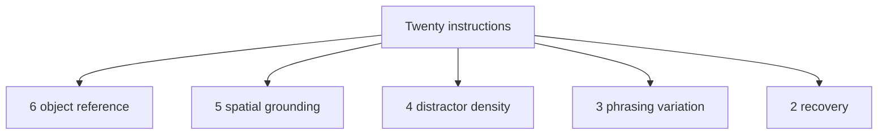
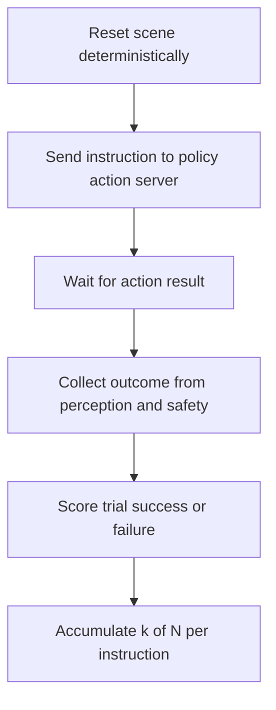

# Lecture 1 — Curating the Twenty-Instruction Evaluation Suite

> **Duration:** ~2 hours of reading + hands-on.
> **Outcome:** You can author and freeze a twenty-instruction evaluation suite for your capstone — stratified across the axes that actually break VLA policies, with deterministic scene resets, a binary success rubric, and a `rclpy` eval-runner that produces a citable per-instruction report.

If you only remember one thing from this lecture, remember this:

> **The eval suite is a contract you write down before you touch the training code, and you do not edit it afterward.** The number it produces is only worth something because the suite was frozen. Tune the suite to flatter the model and the number means nothing.

---

## 1. Why you cannot just "run it a few times and see"

Here is the trap almost every first-time policy engineer falls into. The robot does the demo task in the team meeting, everyone claps, and the engineer reports "it works." Then a panel — or a customer — gives it a slightly different instruction, in a slightly different scene, and it fails. The engineer is surprised. The panel is not.

The problem is that "it works" was never measured. It was *observed*, once, under conditions the engineer happened to set up. A single successful run tells you the success rate is somewhere above zero. It tells you nothing about whether it is 20% or 95%, and the entire capstone acceptance bar — **15 of 20** — lives in that range.

A vision-language-action policy is a stochastic function of a noisy observation. The same instruction, in a scene reset to the same nominal poses, will succeed on some trials and fail on others, because the camera noise differs, the grasp approaches from a slightly different angle, the controller's first solve lands a millimeter off. The honest unit of measurement is therefore not "did it work" but **`k` successes out of `N` trials**, and the honest summary across a suite is a per-instruction table of those `k/N` values.

This week we build the apparatus that produces that table repeatably. The apparatus has four parts, and we will build them in order:

1. **The instructions** — twenty of them, stratified across failure axes.
2. **The scene resets** — a deterministic start state per instruction.
3. **The success rubric** — a binary, operational definition of success.
4. **The eval-runner** — a `rclpy` node that ties the three together and emits a report.

---

## 2. The suite is a frozen contract

Before any of the four parts, internalize the governance rule, because it is the part people violate without noticing.

You will maintain **two** suites:

- A **dev slice** — a handful of instructions you may iterate on freely. You use it to debug the harness, to pick which fine-tuned checkpoint to keep, to sanity-check a change before the expensive full run. You may edit it whenever you like.
- A **frozen acceptance suite** — the twenty instructions the capstone is graded on. You author it once, commit it to Git, and **never edit it after you have run a model against it.**

Why so strict about the frozen suite? Because the failure mode of in-house evaluation is *suite drift toward the model*. You run the baseline, instruction 12 fails every time, and the temptation is overwhelming to decide instruction 12 was "unfairly phrased" and reword it. Do that and you have converted an honest 9/20 into a flattering 13/20 by moving the goalposts. The week-48 panel will ask to see the suite's Git history. If the suite changed after the baseline run, every number you report is void and you will have to start over in front of them. Far better to discover that now.

The frozen suite lives in one file — `eval_suite.yaml` — under version control. Every run records the **commit hash** of that file in its report header. That hash is the proof that the baseline and the fine-tuned run were scored against the same target. Exercise 1 builds this file; here is the shape it takes:

```yaml
# eval_suite.yaml  — capstone acceptance suite, FROZEN. Do not edit after first run.
suite_version: "1.0.0"
robot: "capstone-mobile-manipulator"
trials_per_instruction: 5
timeout_s: 90.0
success_distance_m: 0.05          # named object within 5 cm of named destination
instructions:
  - id: 1
    text: "bring me the red cup from the left bench"
    axis: [object_reference, spatial_grounding]
    target_object: red_cup
    destination: operator_handoff
    scene_reset: reset_left_bench_cups
  - id: 2
    text: "put the blue block on the right shelf"
    axis: [spatial_grounding, placement]
    target_object: blue_block
    destination: right_shelf
    scene_reset: reset_blocks_shelves
  # ... eighteen more ...
```

Note what each instruction carries: the literal `text` the policy receives, the `axis` tags that record *why this instruction is in the suite*, the ground-truth `target_object` and `destination` the rubric scores against, and the name of the `scene_reset` that establishes its start state. The runner needs all of it.

---

## 3. Stratifying across the axes that actually break VLA policies

A suite of twenty instructions that are all "bring me the red cup" with trivial rewording tells you one thing repeated twenty times. A good suite is *designed* so that when it produces, say, 11/20, the pattern of which eleven succeeded tells you **where** the policy is weak. That is the difference between a thermometer and a diagnosis.

VLA policies fail along recognizable axes. Stratify your twenty instructions so each axis is exercised by several of them. The five axes that matter for a capstone mobile manipulator:

### Axis 1 — Object reference

How is the target named? Generic ("the cup"), attributed ("the red cup"), superlative ("the leftmost cup"), or relational ("the cup next to the box"). Attributed and relational references stress the grounding pathway — the policy has to bind the noun phrase to the right region of the image. A suite that only ever says "the cup" never tests whether the policy can tell red from blue.

### Axis 2 — Spatial grounding

Where is the object, or where does it go, expressed spatially? "On the left bench", "behind the box", "the far shelf". Spatial language is where language-conditioned policies are weakest, because "left" depends on the robot's frame and the policy has to resolve it. Several instructions should hinge on a spatial preposition.

### Axis 3 — Distractor density

How many objects are in the scene, and how confusable are they? One red cup alone is easy. One red cup among four cups of other colors tests color grounding. One red cup among three other *red* objects of different shapes tests shape-plus-color grounding. Escalate density across the suite.

### Axis 4 — Phrasing variation

The same task, phrased as a curt imperative ("red cup, left bench"), a full sentence ("bring me the red cup from the left bench"), and a polite request ("could you grab the red cup off the left bench for me?"). A robust policy is invariant to phrasing; a brittle one over-fits to the phrasing in its training data. Include at least three instructions that are paraphrases of tasks the policy *should* know, to measure phrasing robustness directly.

### Axis 5 — Recovery

The object is not where the instruction implies, or a distractor blocks the approach. "Bring me the red cup from the left bench" when the red cup is actually on the right. A graceful policy detects the mismatch and either searches, asks, or aborts cleanly; a brittle one grasps the wrong thing or flails. Two or three recovery instructions keep the suite honest about the long tail.

A balanced twenty might allocate roughly: 6 object-reference, 5 spatial-grounding, 4 distractor-density, 3 phrasing, 2 recovery — with overlap, since one instruction can tag multiple axes. The exact split is yours; the discipline is that you *decided* it on purpose and wrote the axis tags down.


*A balanced twenty spreads trials across the five failure axes, on purpose.*

> **Why this matters for the fix step.** When lecture 2's fine-tuning run drives your number from 9 to 16, the four still-failing instructions will almost always cluster on one axis — "all my failures are recovery cases" or "all my failures are dense-distractor color grounding." That cluster *is* your next data collection target. A suite without axis tags hides the cluster; a stratified one hands it to you.

---

## 4. Scene resets and determinism

A success rate is only reproducible if the start state is reproducible. This is the part real teams cut corners on and then wonder why their numbers wobble.

### Path B (sim) — a reset service

In Gz Sim or Isaac Sim you have it easy: expose a world-reset that teleports every object to a fixed pose and re-seeds every RNG. Drive it from a ROS2 service so the eval-runner can call it between trials. The contract is: after `reset_left_bench_cups`, the red cup is *always* at the same pose, the distractors are *always* at the same poses, and the only variation between trials is the seeded sensor noise and the policy's own stochasticity. A reset that leaves objects in random poses is testing two things at once — the policy *and* your scene generator — and you can no longer attribute a failure.

Here is the reset service contract a sim eval-runner expects:

```python
# A ROS2 service the sim exposes; the eval-runner calls it before each trial.
# srv/ResetScene.srv:
#   string scene_name      # e.g. "reset_left_bench_cups"
#   uint32 seed            # determinism: same seed -> same sensor-noise stream
#   ---
#   bool   ok
#   string message         # human-readable confirmation or error

# In the sim node, the handler teleports objects to the named layout's fixed poses
# and seeds the noise generators. Object poses come from a layouts dict, NOT random.
```

### Path A (real hardware) — a taped template and a photo

On real hardware you cannot teleport objects, so you reset by hand — and you make the by-hand reset *reproducible* with two cheap tools:

1. **A floor/bench template.** Tape outlines (or a printed mat) marking exactly where each object goes for each layout. Resetting `reset_left_bench_cups` means placing the red cup on its taped outline and the distractors on theirs. A stranger with the template and the layout photo can reproduce your scene.
2. **A reference photo per layout.** Commit a photo of each reset, named for its scene, into the repo. The photo is the ground truth a panel checks your real run against.

The real-world reset will never be pixel-identical to the sim, and that is fine — the point is that *your* run and *the panel's verification* see the same nominal scene, within the tolerance the rubric allows. Document the reset procedure in the suite repo's README so it is replicable.

### Seeds everywhere

Whether sim or real, every source of pseudo-randomness the eval touches gets a fixed, recorded seed: the policy's sampling (if it samples actions), the sensor-noise model in sim, the trial ordering. The report header records the master seed. "I ran it again and got a different number" should only ever be explained by physical hardware variation, never by an un-seeded RNG you forgot about.

---

## 5. The success rubric — binary, operational, replicable

The rubric is the most argued-about part of an eval and the easiest to get wrong. Two rules:

### Rule 1 — Binary, not partial credit

Score each trial **success or failure**, full stop. The temptation toward partial credit — "it grasped the cup but placed it 8 cm off, give it half" — destroys comparability, because everyone's notion of "half" differs and the half-points hide whether the task was actually accomplished. The capstone bar is "the task got done," so the rubric scores "the task got done." Partial outcomes are *failures that you tag with a failure mode* (lecture 2), which is far more useful than a half-point.

### Rule 2 — Operational, computed from the state estimate

"Success" must be a predicate a machine can evaluate from sensors, not a human's gut call. For the capstone pick-and-place, the operational definition is:

> A trial **succeeds** iff: the named `target_object` ends within `success_distance_m` (5 cm) of the named `destination`, **and** no collision was registered during execution, **and** the robot reported task-complete within `timeout_s` (90 s). Otherwise the trial **fails**.

Every clause is checkable. Object-final-pose comes from your perception stack's object pose estimate (or the sim ground truth on Path B). Collision comes from the safety filter's collision flag (you built it weeks ago). Time comes from the runner's clock. A stranger reading this rubric and watching your bag replay would score the trial identically — that is the bar.

Here is the scorer as code; it is deliberately small, because a complicated scorer is a scorer you cannot trust:

```python
from dataclasses import dataclass
import numpy as np


@dataclass(frozen=True)
class TrialOutcome:
    object_final_xyz: np.ndarray   # estimated final position of the target object
    destination_xyz: np.ndarray    # ground-truth destination position
    collided: bool                 # any collision flag raised during execution
    elapsed_s: float               # wall time from instruction issue to task-complete
    reported_complete: bool        # did the policy/BT report it finished at all


def score_trial(o: TrialOutcome, *, success_distance_m: float, timeout_s: float) -> bool:
    """Binary success per the operational rubric. No partial credit."""
    if o.collided:
        return False
    if not o.reported_complete:
        return False
    if o.elapsed_s > timeout_s:
        return False
    dist = float(np.linalg.norm(o.object_final_xyz - o.destination_xyz))
    return dist <= success_distance_m
```

That is the entire rubric. Five lines of logic. If your rubric needs fifty, you are scoring something other than "the task got done."

---

## 6. The eval-runner — tying it together in rclpy

The runner is a `rclpy` node that, for each instruction in the frozen suite, runs `trials_per_instruction` trials. Each trial: reset the scene, issue the instruction to the policy action server, wait for the result, read the state to build a `TrialOutcome`, score it. It accumulates `k/N` per instruction and writes a report.

The policy is exposed as a ROS2 **action** (you wired this in the VLA weeks): the goal carries the instruction string, the feedback streams progress, the result reports completion. The runner is an action *client*. Using an action — not a service or a topic — matters because instructions are long-running, preemptable, and feedback-bearing, which is exactly what actions are for.

```python
import rclpy
from rclpy.action import ActionClient
from rclpy.node import Node

from capstone_msgs.action import ExecuteInstruction   # goal: string instruction; result: bool reported_complete
from capstone_msgs.srv import ResetScene


class EvalRunner(Node):
    """Drives the policy across the frozen suite and accumulates k/N per instruction."""

    def __init__(self, suite: dict):
        super().__init__("eval_runner")
        self._suite = suite
        self._policy = ActionClient(self, ExecuteInstruction, "execute_instruction")
        self._reset = self.create_client(ResetScene, "reset_scene")
        self._policy.wait_for_server()
        self._reset.wait_for_service()

    def run_trial(self, instruction: dict, seed: int) -> bool:
        # 1. Deterministic reset.
        req = ResetScene.Request()
        req.scene_name = instruction["scene_reset"]
        req.seed = seed
        reset_future = self._reset.call_async(req)
        rclpy.spin_until_future_complete(self, reset_future)
        if not reset_future.result().ok:
            self.get_logger().error(f"reset failed: {reset_future.result().message}")
            return False

        # 2. Issue the instruction to the policy and wait for the result.
        goal = ExecuteInstruction.Goal()
        goal.instruction = instruction["text"]
        send_future = self._policy.send_goal_async(goal)
        rclpy.spin_until_future_complete(self, send_future)
        goal_handle = send_future.result()
        if not goal_handle.accepted:
            self.get_logger().error("policy rejected the goal")
            return False
        result_future = goal_handle.get_result_async()
        rclpy.spin_until_future_complete(self, result_future, timeout_sec=self._suite["timeout_s"] + 10.0)

        # 3. Build the outcome from the result + perception and score it.
        outcome = self._collect_outcome(instruction, result_future.result())
        return score_trial(
            outcome,
            success_distance_m=self._suite["success_distance_m"],
            timeout_s=self._suite["timeout_s"],
        )
```


*Each trial runs reset, act, observe, score before the runner moves to the next instruction.*

The full, runnable runner — including `_collect_outcome`, the per-instruction loop, the report writer, and the report header that pins the suite commit hash — is exercise 2. The skeleton above is the shape; do not stop here.

The output is a per-instruction report. The machine-readable half is a CSV/JSON keyed by instruction id; the human-readable half is a Markdown table you paste into your week's report:

```
suite: capstone-acceptance v1.0.0   commit: 4f2a9c1   seed: 20260609
policy: openvla-7b baseline (no fine-tune)   date: 2026-06-09

| id | instruction                              | axis                          | k/N |
|---:|------------------------------------------|-------------------------------|----:|
|  1 | bring me the red cup from the left bench | object_reference, spatial     | 3/5 |
|  2 | put the blue block on the right shelf    | spatial_grounding, placement  | 1/5 |
| ...                                                                              |
| -- | SUITE TOTAL                              |                               |9/20 |
```

"Suite total" here counts **instructions passed**, where an instruction "passes" at your chosen threshold — for the capstone we count an instruction as passed if it succeeds on a majority of trials (≥ 3/5). The acceptance bar is on instructions-passed (15 of 20), not raw trial successes; lecture 2 returns to why majority-of-five is the right granularity and how to report the confidence interval honestly.

---

## 7. Common ways this goes wrong

You will save yourself a day by avoiding these. Every one of them has bitten a real team.

- **The suite leaks into training.** If any instruction text or scene from the frozen suite appears in your fifty fine-tuning demos, you are testing on the training set and your number is fiction. Keep demo instructions and scenes *adjacent to but distinct from* the suite — same families, different specific phrasings and layouts. Lecture 2 makes this concrete.
- **Non-deterministic resets.** Objects spawned at random poses mean every trial is a different task. Fix the poses; vary only the seeded noise.
- **A rubric a human has to adjudicate.** "It mostly worked" is not a score. If you cannot write the predicate as code over the state estimate, the rubric is underspecified.
- **Reporting one run.** `k/N` with N=1 is a coin flip you got to keep. Run all five trials per instruction even when it is tedious — *especially* when it is tedious, because the tedious instructions are the ones near the threshold where the extra trials change the verdict.
- **Editing the suite after the baseline.** Covered above, repeated here because it is the cardinal sin. If you must change the suite, bump `suite_version`, note it loudly, and re-run the baseline too. Old numbers are void.
- **Scoring placement with the wrong frame.** The destination position and the object's final position must be in the *same* frame (typically `map` or `odom`). A 30 cm "failure" that is really a frame mismatch will send you debugging the policy when the bug is in your scorer. Unit-test the scorer against a known-good and known-bad trial before you trust it.

---

## 8. What you should have by the end of Monday/Tuesday

A senior engineer's checklist for the eval apparatus:

1. `eval_suite.yaml` exists, holds exactly twenty instructions, is committed, and each instruction carries `text`, `axis`, `target_object`, `destination`, and `scene_reset`.
2. The twenty instructions are stratified — you can point at which axis each one exercises and the distribution is intentional, not accidental.
3. A reset mechanism exists and is deterministic: sim service or real taped-template-plus-photo, documented in the repo README.
4. The success rubric is binary, operational, and implemented as a small scorer you unit-tested against a known-good and known-bad trial.
5. The `rclpy` eval-runner runs the full suite end to end and writes a per-instruction report whose header pins the suite commit hash, the policy identity, the seed, and the date.
6. You have a **baseline number** — the honest `9/20`-style result for the *un-tuned* policy. You do not yet know if it is good. You know it is *true*, which is the whole point of this lecture.

With the apparatus built and the baseline measured, lecture 2 collects the fifty demos, runs the LoRA fine-tune, re-runs the *same frozen suite*, and produces the diff that drives the capstone toward 15 of 20.

---

## Further reading

- OpenVLA paper, the evaluation sections — for how a published VLA reports per-task success: <https://arxiv.org/abs/2406.09246>
- SIMPLER — a reproducible manipulation-eval harness; steal its reset-and-score structure: <https://simpler-env.github.io/>
- CALVIN — instruction stratification done at benchmark scale: <http://calvin.cs.uni-freiburg.de/>
- The Wilson score interval — the right CI for `k/N`: <https://en.wikipedia.org/wiki/Binomial_proportion_confidence_interval#Wilson_score_interval>
