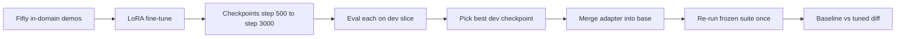
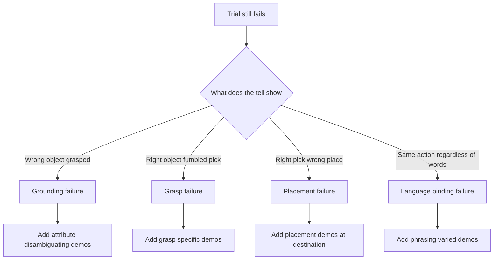

# Lecture 2 — Fine-Tuning the VLA on Capstone-Specific Demos

> **Duration:** ~2 hours of reading + hands-on (plus an afternoon of unattended GPU time).
> **Outcome:** You can collect fifty in-domain demonstrations in the episode format the trainer expects, fine-tune an OpenVLA-class policy with LoRA, select a checkpoint on eval success rather than on training loss, re-run the frozen suite, and produce an honest baseline-vs-fine-tuned per-instruction diff.

If you only remember one thing from this lecture, remember this:

> **Fifty good in-domain demonstrations beat five hundred sloppy ones, and the eval suite — not the loss curve — tells you whether the fine-tune worked.** Training loss going down is necessary and not remotely sufficient. The number that matters is `k/N` on the frozen suite, measured after, compared to before.

---

## 1. Why fine-tune at all — and why only a little

The base policy you carried in from the VLA weeks (OpenVLA-7B or equivalent) was trained on a million-plus trajectories across many robots and scenes. It already knows, in a general sense, what "pick up the cup" means and roughly how an arm approaches a graspable object. What it does *not* know is the specific reality of your capstone:

- Your bench heights and shelf positions.
- Your camera intrinsics and extrinsics — where the wrist camera actually sits.
- Your gripper's geometry and the offset between its TCP and the object it can hold.
- The specific noun phrases your eval uses and the specific objects on your benches.
- Your action representation's exact scaling — a "+2 cm in x" delta means something physical that depends on your controller.

Fine-tuning is teaching it those specifics, cheaply. The base model's broad prior plus a thin layer of your-robot-specific adaptation is far stronger than either alone. You are not retraining manipulation from scratch; you are *aligning* a competent generalist to your bench.

The reason you do it with only fifty demos is partly budget and partly discipline. Fifty teleop or verified-scripted episodes is roughly an afternoon of careful collection — achievable in a capstone. More importantly, fifty *clean, in-distribution* demos teach the right thing, while five hundred demos collected sloppily — wrong camera, inconsistent gripper, half of them failed grasps you forgot to filter — teach the policy your collection bugs. The skill this week is collecting fifty demos that are all worth learning from, not grinding out volume.

> **The base architecture is fixed.** This lecture assumes OpenVLA-class. If your capstone base is Octo, Diffusion Policy, or ACT, the *discipline* is identical — collect in-domain demos, adapt with a small parameter-efficient method, select on eval — and only the trainer call changes. Where the recipe is OpenVLA-specific (LoRA target modules, the action detokenizer), it is flagged.

---

## 2. The observation and action space must match deployment exactly

This is the single most common fine-tuning bug and it produces a policy that trains beautifully and fails on the robot. The episodes you train on must have the **same observation and action space as the deployed policy sees at inference.** If deployment feeds the policy a 224×224 RGB from the wrist camera plus the instruction string and expects a 7-DoF end-effector delta plus a gripper command, then every training episode must carry exactly that observation and exactly that action.

Concretely, pin these and verify them before you collect a single demo:

- **Cameras:** the same set, the same resolution, the same preprocessing (the OpenVLA image transform, center-crop, normalization). If deployment uses the wrist cam at 224×224, do not collect demos from the overhead cam at 480×640.
- **Proprioception:** if the policy consumes joint angles or end-effector pose as part of the observation, the demos must carry it, in the same units and frame.
- **Action representation:** the same. OpenVLA emits 7 normalized action tokens that detokenize to a 6-DoF end-effector delta plus a 1-DoF gripper. Your demos' actions must be expressed in that representation, with the *same normalization statistics*. A demo recorded in raw meters when the policy expects normalized deltas will train to a confidently wrong scale.
- **Control rate:** the action chunking / horizon must match. If deployment queries the policy at 5 Hz and executes the predicted action open-loop for 200 ms, your demos should be sampled to that cadence.

The cheap way to guarantee the match is to **record demos through the exact same observation pipeline the policy uses at inference.** Reuse the deployment node's observation builder; do not write a parallel one for data collection. If the inference path applies a particular crop and normalization, the collection path gets it for free because it is the same code.

---

## 3. Collecting fifty demonstrations

You collect demos by producing successful trajectories and recording the (observation, action, instruction) stream. Two paths.

### Path A (real) — teleoperation

Drive the robot through the task with the teleop takeover you built in week 43. The operator issues themselves the instruction ("bring me the red cup from the left bench"), then teleoperates a clean, successful execution while a recorder node logs every observation and the commanded action at each step. One successful execution = one episode.

Discipline points:
- **Only record successes.** A failed teleop run is not a demonstration; discard it. The policy learns to imitate what you show it, and showing it a fumble teaches the fumble.
- **Vary within a family.** For the "red cup from left bench" family, collect a few episodes with the cup at slightly different bench positions and the distractors rearranged. You are teaching the family, not memorizing one pose.
- **Keep the instructions adjacent to, not identical to, the frozen suite.** If the suite says "bring me the red cup from the left bench", a demo might be "get the red cup off the left bench" with the cup in a different spot. Same skill family; different specific instance. This is how you avoid training on the test set while still teaching the right thing.

### Path B (sim) — scripted-and-verified

In sim you can script the task with your planner + grasp pipeline, run it, and **keep only the episodes that the rubric scores as successes.** This is "scripted-and-verified": the script is not assumed correct; it is run and its output is filtered through the same success scorer from lecture 1. A scripted episode that placed the object 12 cm off is discarded exactly like a fumbled teleop.

Either way, the output is fifty episodes in the trainer's format.

---

## 4. The episode format

We record into the **LeRobot `v2`** dataset format — a parquet-backed, Hugging Face-native episode store the OpenVLA/LeRobot trainers consume directly. Each episode is a sequence of steps; each step carries the observation dict, the action vector, the language instruction (constant across the episode), and bookkeeping (episode index, frame index, timestamp, a terminal `next.done` flag, and a `next.success` flag).

The recorder that turns a live `rclpy` session into a LeRobot episode looks like this:

```python
import numpy as np
from lerobot.common.datasets.lerobot_dataset import LeRobotDataset


class EpisodeRecorder:
    """Accumulates a single demonstration and appends it to a LeRobot v2 dataset."""

    def __init__(self, repo_id: str, fps: int = 5):
        # Declare the feature schema ONCE; it must match the deployment obs/action space.
        features = {
            "observation.images.wrist": {
                "dtype": "video", "shape": (224, 224, 3), "names": ["height", "width", "channel"],
            },
            "observation.state": {
                "dtype": "float32", "shape": (7,), "names": ["eef_xyz_rpy_grip"],
            },
            "action": {
                "dtype": "float32", "shape": (7,), "names": ["d_xyz_d_rpy_grip"],
            },
            "task": {"dtype": "string", "shape": (1,), "names": None},
        }
        self._ds = LeRobotDataset.create(repo_id=repo_id, fps=fps, features=features)

    def add_step(self, wrist_rgb: np.ndarray, state: np.ndarray,
                 action: np.ndarray, instruction: str) -> None:
        """One control step of one demonstration."""
        self._ds.add_frame({
            "observation.images.wrist": wrist_rgb,     # uint8 HxWx3, already 224x224
            "observation.state": state.astype(np.float32),
            "action": action.astype(np.float32),
            "task": instruction,
        })

    def end_episode(self, success: bool) -> None:
        """Close the episode. Only call with success=True for demos you keep."""
        if not success:
            self._ds.clear_episode_buffer()            # discard a fumble; do not save it
            return
        self._ds.save_episode()
```

The schema is declared once and is the contract. If the deployment observation is a 224×224 wrist RGB plus a 7-vector state, the schema says so, and any episode that does not match raises at `add_frame` time instead of silently training a mismatched policy. The `end_episode(success=False)` path is the "only record successes" rule made mechanical.

---

## 5. LoRA fine-tuning — the recipe that works for fifty demos

You fine-tune with **LoRA** (Low-Rank Adaptation): freeze the 7B base weights, inject small trainable low-rank matrices into the attention projections, and train only those. The payoff is enormous for a capstone: the trainable parameter count drops from billions to millions, the run fits on a single GPU, and the artifact is a few-hundred-MB adapter you can version and hot-load instead of a 14 GB full checkpoint.

The OpenVLA LoRA recipe, adapted for the small-data capstone regime:

```python
import torch
from peft import LoraConfig, get_peft_model
from transformers import AutoModelForVision2Seq, AutoProcessor

# 1. Load the frozen base policy in bf16.
processor = AutoProcessor.from_pretrained("openvla/openvla-7b", trust_remote_code=True)
base = AutoModelForVision2Seq.from_pretrained(
    "openvla/openvla-7b",
    torch_dtype=torch.bfloat16,
    low_cpu_mem_usage=True,
    trust_remote_code=True,
)

# 2. Wrap it with LoRA. Rank 32 / alpha 64 is the OpenVLA fine-tune default and a good
#    starting point for ~50 demos; lower the rank if you overfit, raise it if you underfit.
lora_cfg = LoraConfig(
    r=32,
    lora_alpha=64,
    lora_dropout=0.05,
    target_modules="all-linear",        # adapt every linear; OpenVLA's documented default
    init_lora_weights="gaussian",
)
policy = get_peft_model(base, lora_cfg)
policy.print_trainable_parameters()      # expect ~1-2% of params trainable, the rest frozen
```

The training-loop hyperparameters that work for ~50 demos:

- **Learning rate:** `5e-4` for the LoRA params (higher than a full fine-tune because the base is frozen and the adapters start near zero). The OpenVLA guide uses this; it is robust.
- **Batch size:** as large as the GPU allows; gradient-accumulate to an effective 8–16 if memory is tight.
- **Steps:** with fifty demos of a few hundred steps each, **a few thousand gradient steps** is plenty. This is where small-data discipline bites: train *too* long and the adapter memorizes your fifty trajectories and generalizes worse. You will watch for this with eval, not loss (section 6).
- **Precision:** bf16. The base loads in bf16; LoRA matrices train in bf16/fp32 mix via the PEFT defaults.
- **Action loss:** OpenVLA trains with a next-action-token cross-entropy over the discretized action tokens — the same objective as pretraining. You do not invent a loss; you reuse the trainer's.

On an RTX 4090 / 5090 this run is one to two hours. On a Jetson Orin it is an overnight job — start it Thursday evening. This is why the README tells you to reserve GPU time early: the fine-tune is the long pole, and you cannot diagnose failures (lecture 1's report) on a checkpoint that is still training.

---

## 6. Checkpoint selection on eval, not on loss

Here is the discipline that separates a real policy engineer from someone who read a tutorial.

**Training loss lies about manipulation success.** The cross-entropy over action tokens can keep dropping while the actual task success rate plateaus or even *falls*, because the model is getting better at reproducing your exact demo trajectories (memorization) rather than better at accomplishing the task under the trial-time variation the suite throws at it. A checkpoint with lower loss can be a *worse* policy.

So you do not ship the lowest-loss checkpoint. You **save checkpoints periodically** (say every 500 steps), evaluate each on a **dev slice** — a separate small set of held-out instructions, *never* the frozen acceptance suite — and ship the checkpoint with the best dev success rate. The frozen suite is touched exactly once per candidate policy, for the final reported number; if you tuned checkpoint selection on it, you would be overfitting to it and your reported number would be inflated.

```python
# Pseudocode of the selection loop — the dev slice is NOT the frozen acceptance suite.
best_ckpt, best_dev_success = None, -1.0
for ckpt in saved_checkpoints:                 # e.g. step-500, step-1000, ... step-3000
    dev_success = run_eval(ckpt, suite=DEV_SLICE)   # k/N over the dev instructions
    if dev_success > best_dev_success:
        best_dev_success, best_ckpt = dev_success, ckpt
ship(best_ckpt)                                 # only THIS checkpoint sees the frozen suite, once
```

If you have so little compute that you can only evaluate one checkpoint, evaluate the *last* one and accept the small risk — but never let "lowest training loss" pick your checkpoint. That choice has cost more capstones than any single bug.

---

## 7. Hot-loading the adapter into the action server

The fine-tuned artifact is a LoRA adapter directory (a few hundred MB), not a new full model. Your deployment action server already loads the base policy; deploying the fine-tune is loading the base and *applying* the adapter:

```python
from peft import PeftModel
from transformers import AutoModelForVision2Seq

base = AutoModelForVision2Seq.from_pretrained(
    "openvla/openvla-7b", torch_dtype=torch.bfloat16, trust_remote_code=True,
)
# Apply the fine-tuned adapter. For lowest inference latency, merge it into the base weights.
policy = PeftModel.from_pretrained(base, "checkpoints/capstone-lora/step-2000")
policy = policy.merge_and_unload()             # fold LoRA into the base -> no per-call adapter overhead
policy = policy.eval()
```

`merge_and_unload()` folds the low-rank deltas into the base weights so inference has zero adapter overhead — the deployed policy runs at exactly the base model's latency, which matters for your perception-to-action budget. The action server's interface does not change: it still receives an instruction string and an observation and emits a 7-DoF action. Only the weights behind it are now your-bench-aligned.

This is also why LoRA is the right tool for a capstone you have to *defend*: you can show the panel the base model, the adapter, and the merge, and the entire fine-tune is a few-hundred-MB diff they can inspect — not an opaque 14 GB blob.

---

## 8. The baseline-vs-fine-tuned diff — the week's headline artifact

Now you re-run the **same frozen suite, same commit hash, same seeds** on the fine-tuned policy and put the two reports side by side. This diff is what the mini-project ships and what the panel reads.


*From fifty demos to a single honest number: the dev slice picks the checkpoint, the frozen suite scores it once.*

```
suite: capstone-acceptance v1.0.0   commit: 4f2a9c1   seed: 20260609
baseline: openvla-7b (no fine-tune)        fine-tuned: openvla-7b + capstone-lora step-2000

| id | instruction                              | axis                     | base | tuned | Δ        |
|---:|------------------------------------------|--------------------------|-----:|------:|----------|
|  1 | bring me the red cup from the left bench | object_ref, spatial      | 3/5  | 5/5   | +2  ✓    |
|  2 | put the blue block on the right shelf    | spatial, placement       | 1/5  | 4/5   | +3  ✓ fix|
|  7 | grab the cup next to the toolbox         | object_ref (relational)  | 2/5  | 1/5   | -1  ⚠ REGRESSION |
| 14 | bring whatever's on the far shelf        | recovery                 | 0/5  | 0/5   |  0  ✗ still failing |
| ...                                                                                          |
| -- | INSTRUCTIONS PASSED (≥3/5)               |                          | 9/20 | 16/20 | +7       |
```

Three things this artifact must do, and a report missing any of them is incomplete:

1. **Report `k/N`, never a single run.** Every cell is out of five trials. Quote the suite-total instructions-passed *and* a confidence interval on it (section 9).
2. **Call out regressions explicitly.** Instruction 7 got *worse*. Fine-tuning on cup-grasping demos can degrade an instruction the base happened to handle, and hiding that is dishonest. Flag every Δ < 0 in red and explain it in the failure-diagnosis section.
3. **Tag every still-failing instruction with a failure mode and a next fix** (section 10). "Still 0/5" is not a conclusion; "still 0/5, *grounding* failure — it never attends to the far shelf — fix is ten demos of far-shelf instructions" is.

---

## 9. Reporting an honest number with a confidence interval

Your suite total is a proportion — instructions passed out of 20, or if you prefer the finer grain, trial successes out of 100 (20 instructions × 5 trials). A proportion from a finite sample has uncertainty, and at N=100 trials it is not negligible. Report it.

Do **not** use the naive normal approximation (`p ± 1.96·sqrt(p(1-p)/n)`); it misbehaves near 0 and 1 and at small N — exactly your regime. Use the **Wilson score interval**:

```python
from math import sqrt


def wilson_interval(k: int, n: int, z: float = 1.96) -> tuple[float, float]:
    """95% Wilson score interval for k successes in n trials. Honest at small n and near 0/1."""
    if n == 0:
        return (0.0, 1.0)
    p = k / n
    denom = 1.0 + z * z / n
    center = (p + z * z / (2 * n)) / denom
    half = (z * sqrt(p * (1 - p) / n + z * z / (4 * n * n))) / denom
    return (max(0.0, center - half), min(1.0, center + half))


# Example: 80 trial-successes out of 100 -> point estimate 0.80, CI roughly [0.71, 0.87].
lo, hi = wilson_interval(80, 100)
print(f"success rate 0.80, 95% Wilson CI [{lo:.2f}, {hi:.2f}]")
```

The report sentence is then: *"16 of 20 instructions pass (80 of 100 trials succeed); 95% Wilson CI on the trial-success rate is [0.71, 0.87]."* That is a number a panel cannot poke a hole in, because it states its own uncertainty. "It gets 80%" with no interval and no trial count is a number that invites — and deserves — skepticism.

---

## 10. Diagnosing every still-failing instruction

The fine-tune will not get you to 20/20, and it is not supposed to. The deliverable for every instruction still below threshold is a diagnosis with two parts: **the failure mode** and **the next fix.** Tag each failed trial with one of the four failure modes from lecture 1:

- **Grounding** — the policy attended to the wrong object. *Tell:* it confidently manipulates a distractor. *Fix:* more demos that disambiguate the attribute (color/position) the suite cares about; check whether the wrist camera even sees the target.
- **Grasp** — right object, failed pick. *Tell:* it reaches the right thing and fumbles the grasp. *Fix:* grasp-specific demos at the problem object's geometry; revisit the gripper TCP calibration before adding data.
- **Placement** — right pick, wrong place. *Tell:* it holds the right object and puts it in the wrong location, or 8 cm off. *Fix:* placement demos at the destination; check the destination frame in your scorer is not the actual culprit.
- **Language-binding** — it ignored the instruction and did a generic behavior. *Tell:* same action regardless of what you say. *Fix:* phrasing-varied demos for that family; verify the instruction string actually reaches the policy and is not being dropped.


*Diagnosis picks the fix: what the robot actually did points to one of four failure modes.*

The next fix is always *concrete and small*: "ten demos of X", "recalibrate Y", "add a search-then-ask scaffold for the recovery cases". A diagnosis that ends in "needs more work" is not a diagnosis. The challenge this week (challenge 1) is exactly this discipline — drive the number to 15/20 and, for each remaining failure, name the mode and the next change. That is the artifact that turns into a great interview answer in week 45 and a confident defense in week 48.

---

## 11. What you should have by the end of Thursday/Friday

The senior checklist for the fine-tune:

1. Fifty in-domain demonstrations, all successes, in LeRobot v2 format, with the *exact* deployment observation/action space, and *adjacent to but distinct from* the frozen suite.
2. A LoRA fine-tune run that completed, with a tracked loss curve **and** a tracked dev-eval-success curve (the second is the one you act on).
3. A selected checkpoint — chosen on dev-slice success, not on lowest loss — merged into the action server.
4. A re-run of the frozen suite (same commit, same seeds) producing the fine-tuned report.
5. The baseline-vs-fine-tuned diff table, with `k/N` cells, regressions flagged, and a Wilson CI on the suite total.
6. A failure-mode tag and a concrete next fix for every still-failing instruction.

If your number went from 9 to 16, congratulations — you are over the bar with margin and your remaining work is hardening. If it went from 9 to 12, you have a clear, axis-clustered list of what to fix and a weekend (and weeks 45–47) to fix it. Either way you now have something no amount of "it works in the demo" ever gave you: a true measurement and a plan.

---

## Further reading

- OpenVLA fine-tuning guide — the canonical LoRA recipe: <https://github.com/openvla/openvla#fine-tuning-openvla>
- LeRobot dataset v2 format — the episode schema: <https://huggingface.co/docs/lerobot/en/lerobot-dataset-v2>
- PEFT LoraConfig docs — the knobs in section 5: <https://huggingface.co/docs/peft/en/index>
- LoRA paper — why low-rank adaptation works: <https://arxiv.org/abs/2106.09685>
- Wilson score interval — the honest CI for `k/N`: <https://en.wikipedia.org/wiki/Binomial_proportion_confidence_interval#Wilson_score_interval>
