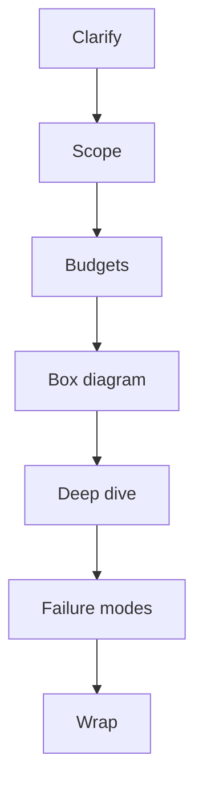
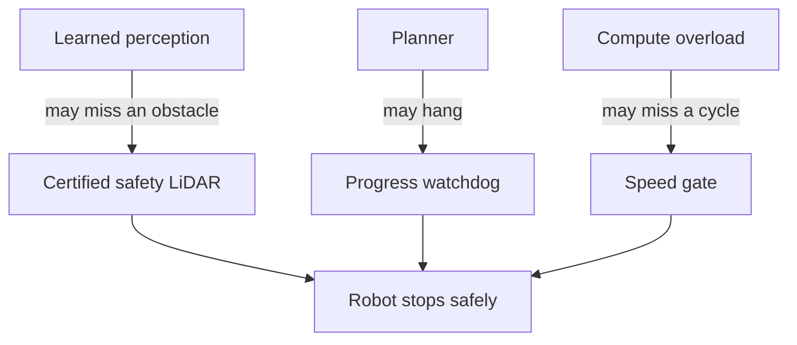

# Lecture 1 — Robotics-Startup System Design on the Whiteboard

> **Duration:** ~2 hours of reading + one timed run-through.
> **Outcome:** You can take a one-line robotics design prompt ("design the autonomy stack for a warehouse AMR") and produce a structured, defensible, forty-five-minute whiteboard answer — requirements, budgets, box diagram, failure modes, safety story — without freezing, hand-waving, or running out of time.

If you remember one thing from this lecture, remember this:

> **A system-design interview is not a test of whether you know the right answer. There is no right answer.** It is a test of whether you can drive an open-ended design conversation: clarify the problem, make and state assumptions, work within budgets, draw the box diagram, enumerate failure modes, and defend your choices when pushed. The candidate who draws the "best" architecture in silence loses to the candidate who draws a decent one *out loud, with the reasoning visible.*

You have built the actual thing — a perception-to-policy mobile manipulator. That is a massive advantage. Most candidates have never integrated a real stack and it shows the moment you ask "what happens when the LiDAR drops out?" Your job this week is to learn to *narrate* the engineering you already did.

---

## 1. The shape of a robotics-startup loop in 2026

Before the whiteboard, know the board you are playing on. A typical robotics-startup interview loop has six stages. They are not all technical, and they are not all won the same way.

| Stage | Length | What they're testing | How it's won |
|-------|--------|----------------------|--------------|
| Recruiter screen | 30 min | Basics, motivation, comp expectations | Be coherent, know the band (levels.fyi). |
| Technical phone | 45–60 min | One coding question + a few sensor/math questions | Correct code, clear narration, no overclaiming. |
| **System design** | 45–60 min | Can you architect a stack and defend trade-offs? | **This lecture.** Method > answer. |
| Technical deep-dive | 45–60 min | Kinematics, controls, estimation, your résumé | **Lecture 2.** Know your own stack cold. |
| Résumé / behavioral | 45 min | The "five projects" conversation; how you work | STAR stories; honesty under follow-up. |
| Founder / culture | 30–45 min | Will you survive a startup; do you care | Genuine interest; sharp questions back. |

The system-design and deep-dive rounds are where most offers are decided, and they are the two we drill this week. The good news: at a robotics startup, the system-design prompt is almost always *the company's own product reworded.* If you are interviewing at a warehouse-robotics company, you will be asked to design a warehouse AMR. If it's last-mile delivery, you'll design a sidewalk rover. The domain shifts; the **method does not.** Learn the method once.

---

### 1.1 Why robotics system design is not web system design

If you've prepped for software-engineering interviews, you know the web system-design playbook: estimate QPS, pick a database, add a cache, shard, add a queue, talk about consistency. Almost none of that transfers, and reaching for it is a tell that you've never designed a robot. The differences that matter:

- **The constraint is physics, not scale.** A web system fails by getting slow under load. A robot fails by hitting a person, missing a deadline in a control loop, or running out of battery. Your budgets are sensors, compute, latency, and power — not QPS and storage.
- **Latency is hard, not soft.** A 200 ms web response is annoying. A 200 ms control loop on a 1.5 m/s robot is a crash. Latency has physical consequences you must quantify.
- **Safety is a first-class subsystem, not an afterthought.** No web design gets failed for "you forgot rate limiting." Every robotics design gets failed for "you forgot the safety layer." People die; the interviewer screens for whether you feel that.
- **The state estimate is the heart.** Web systems mostly know their own state. A robot has to *estimate* where it is and what's around it from noisy sensors, and most of the interesting failure modes live in that estimation. There's no web equivalent of "the localization diverged."
- **Autonomy-by-default.** A web service can depend on its backend. A robot in a shared space must be safe even when the network and the fleet backend are gone. Centralization is a convenience, never a safety dependency.

Lead with this framing if you sense the interviewer expects a web-style answer. Saying "this is a physical system, so I'm going to think in sensor, compute, latency, and power budgets, and I'm going to treat safety as its own subsystem" immediately positions you as a roboticist rather than a backend engineer cosplaying as one.

## 2. The requirements-first method

The single biggest mistake candidates make is jumping straight to "okay so I'd use Nav2 and a RealSense and—" within ten seconds of hearing the prompt. **Do not draw anything for the first five minutes.** The first five minutes are requirements and constraints. An interviewer who watches you nail the requirements phase has already half-decided to pass you.

Here is the method, as a fixed sequence. Internalize the order; you will run it under stress.

```
1. CLARIFY      (2–4 min)  — turn the vague prompt into a concrete problem
2. SCOPE        (1–2 min)  — state what you will and won't design today
3. BUDGETS      (4–6 min)  — sensor, compute, latency, power, cost
4. BOX DIAGRAM  (10–15 min) — the autonomy stack, drawn and labelled
5. DEEP-DIVE    (8–12 min)  — go deep on the 1–2 boxes they care about
6. FAILURE      (5–8 min)   — enumerate failure modes + the safety story
7. WRAP         (2 min)     — summarize, name the biggest risk, name next steps
```


*The seven-phase sequence that structures a robotics system design answer.*

The interviewer will steer you — they may skip straight to "let's go deep on perception" — and that is fine. But if *they* don't steer, *you* run this sequence. It is your script for the silence.

### 2.1 Clarify — turn the prompt into a problem

The prompt is deliberately underspecified. "Design a warehouse AMR" could mean a 200 kg pallet mover or a shelf-to-station tote carrier. These have completely different stacks. Your first move is to ask the questions that pin it down. Out loud. Write the answers on the board.

Good clarifying questions for the warehouse AMR:

- **What does it move?** Totes (5 kg) or pallets (500 kg)? This sets the base, the payload, the dynamics, the safety envelope.
- **Shared space with humans, or caged/segregated?** This is *the* safety question. Shared-space means ISO 3691-4 (driverless industrial trucks) and a much harder perception-and-stopping problem.
- **How big is the fleet?** One robot or two hundred? Fleet size decides whether you need centralized traffic management, shared maps, and a fleet-ops backend.
- **Greenfield or brownfield?** Can we put markers/reflectors on the floor (infrastructure-assisted) or must we be infrastructure-free (natural-feature SLAM)?
- **What's the throughput target?** Picks per hour drives speed, which drives stopping distance, which drives sensor range.
- **Indoor only?** Lighting, floor type (concrete vs epoxy — affects wheel odometry), Wi-Fi coverage.

You will not ask all of these. Ask the three that most change the design — payload, shared-space, fleet size — and state assumptions for the rest: *"I'll assume tote-class payload, shared human space, a fleet of ~50, brownfield with no floor markers. Stop me if you wanted pallet-class."* That sentence alone signals seniority.

Here is what the clarify phase sounds like as an actual exchange. Practice making it this crisp:

> **Interviewer:** "Design the autonomy stack for a warehouse AMR."
> **You:** "Before I start drawing — a few questions so I design the right robot. What does it move: totes or pallets?"
> **Interviewer:** "Totes."
> **You:** "And is it in a caged area or sharing floor space with people?"
> **Interviewer:** "Shared with people."
> **You:** "Okay, that's the big one — that pulls in a certified safety story. How big is the fleet, roughly?"
> **Interviewer:** "Call it fifty robots in one building."
> **You:** "Last one: can we put markers or reflectors on the floor, or is it infrastructure-free?"
> **Interviewer:** "No floor markers."
> **You:** "Got it. So: tote-class, shared human space, fifty robots, brownfield with natural-feature localization. I'll assume up to about 1.5 m/s and decent Wi-Fi unless you tell me otherwise. Let me design the onboard stack and I'll flag where the fleet layer plugs in."

Four questions, fifteen seconds each, and you've pinned the entire design space and signalled seniority before drawing a single box. That exchange is worth more than the prettiest diagram drawn from wrong assumptions.

### 2.2 Scope — say what you're NOT doing

You have forty-five minutes. You cannot design the whole company. State the boundary: *"I'm going to focus on the onboard autonomy stack — perception, localization, planning, control, and the safety layer. I'll touch the fleet backend and the charging/docking but won't design them in depth unless you want me to."* This is not a cop-out; it is scoping, and scoping is the skill being tested. The candidate who tries to design everything designs nothing well.

---

## 3. The four budgets

This is where robotics system design diverges hardest from web system design. A web designer estimates QPS and storage. A robotics designer estimates **sensors, compute, latency, and power**, and these four are coupled — a bigger sensor suite needs more compute, which burns more power, which shortens runtime. Show that you think in budgets and you have already out-performed most candidates.

### 3.1 Sensor budget

What does the robot need to perceive, and what's the minimal sensor set that covers it? For a shared-space warehouse AMR:

| Need | Sensor | Why |
|------|--------|-----|
| Obstacle detection, safety stop | 2D safety LiDAR (e.g. SICK/Hokuyo, safety-rated) | ISO-3691-4 protective field; this is a *certified* sensor, not your perception LiDAR. |
| Localization + mapping | 2D/3D LiDAR | Natural-feature SLAM / AMCL against a known map. |
| Object & pallet detection | RGB-D camera (front) | Learned detection, pallet-pocket finding, tote ID. |
| Drift-bounded ego-motion | IMU + wheel encoders | Dead reckoning between LiDAR/camera updates. |
| Low obstacles, fork tines, edges | Depth camera (downward) or 3D LiDAR | The "ground-truthing the floor plane" sensor; catches the dropped pallet. |

State the key decision: **the safety LiDAR is separate from the perception LiDAR.** Safety functions ride on a certified, redundant path; perception rides on the rich-but-uncertified path. Conflating them is a classic junior mistake and a great thing to get right unprompted.

### 3.2 Compute budget

Name the compute target and defend it. For an AMR you are almost certainly on a Jetson Orin-class module (you used an Orin Nano/NX all year). Say so, and say why: enough GPU for one or two learned models in a 30–50 ms cycle, automotive-grade thermals, ROS 2 supported. Then sketch the rough split:

```
Orin NX 16GB  (≈ 100 TOPS INT8)
  ├── Perception (detection + depth)   ~ 60% GPU, 25 ms/cycle
  ├── Localization (LiDAR SLAM/AMCL)   ~ CPU-bound, 4 cores
  ├── Planning (Nav2 BT + controller)  ~ 1–2 cores
  ├── Safety monitor (separate proc)   ~ 1 core, hard-real-time-ish
  └── Telemetry / fleet comms          ~ best-effort
```

The interviewer may push: "what if the model doesn't fit the latency budget?" Have an answer ready — TensorRT + INT8 quantization, drop input resolution, run detection at a lower rate than the control loop, or move the heavy model to a lower-frequency "deliberative" thread while a cheap classical check runs at control rate. You did this in Phase 2; cite it.

### 3.3 Latency budget

This is the one that separates roboticists from everyone else. Draw the end-to-end perception-to-action latency and *budget each stage*:

```
sensor capture → driver → perception → fusion → planner → controller → actuator
   5 ms      →  3 ms  →   25 ms    →  5 ms  →  8 ms  →   2 ms    →  servo loop
                                                              total ≈ 48 ms
```

Now connect it to physics: at 1.5 m/s, 48 ms of latency is 7 cm of travel before the robot reacts. Plus stopping distance. Plus a safety margin. That is *why* the safety LiDAR runs its protective field independently of this pipeline — the certified stop cannot wait on a 48 ms software stack. This connection — latency to stopping distance to safety architecture — is the single most impressive thing you can say in the whole interview. Practice it.

Working the stopping-distance number out loud is worth the thirty seconds. At 1.5 m/s with a 48 ms control-stack latency, the robot travels `1.5 × 0.048 ≈ 0.072 m` — about 7 cm — before the software even begins to react. Then add braking distance: at a comfortable 1.0 m/s² deceleration, stopping from 1.5 m/s takes `v/a = 1.5 s` and covers `v²/2a ≈ 1.1 m`. So the *total* clear distance the robot needs in front of a suddenly-appearing person is roughly 7 cm of reaction plus 1.1 m of braking plus a safety margin — call it 1.5 m. That number is *why* the safety LiDAR's protective field is sized the way it is, and *why* the certified stop cannot wait on a 48 ms software pipeline. If you can produce that calculation at the board, you have demonstrated in sixty seconds that you understand robots as physical systems with consequences, not as software diagrams. That is the single most differentiating thing you can do in the budget phase.

### 3.4 Power / cost budget (lightning round)

You usually only touch these if asked, but have one sentence each. Power: the sensor+compute draw sets battery size, which sets runtime, which sets the charge/swap strategy and therefore fleet sizing. Cost: at 50 robots, the bill of materials matters; a $4,000 3D LiDAR per robot is $200k, so you justify it or you find a cheaper sensing strategy. Mentioning cost unprompted signals you understand this is a *business*, not a lab.

---

## 4. The box diagram

Now you draw. The box diagram is the centerpiece deliverable, and it should look like the stack you actually built, because it *is* the stack you built. Draw it left to right, sensors in, actuators out, with the safety layer as a visible band underneath everything.

```
 SENSORS              PERCEPTION            STATE                PLANNING            CONTROL        ACTUATION
┌─────────┐         ┌────────────┐      ┌────────────┐       ┌────────────┐     ┌─────────┐    ┌────────┐
│ IMU     │──┐      │ detection  │      │            │       │ global     │     │         │    │ wheels │
│ encoders│──┤      │ (TensorRT) │─────▶│  EKF /     │──────▶│ planner    │────▶│  MPC /  │───▶│ (base) │
│ 2D LiDAR│──┼─────▶│ depth/     │      │  factor    │       │ (Nav2 BT)  │     │  PID    │    │        │
│ RGB-D   │──┤      │ pointcloud │      │  graph     │       │ + local    │     │         │    └────────┘
│ 3D LiDAR│──┘      │            │      │ (pose,vel) │       │ planner    │     │  arm:   │    ┌────────┐
└─────────┘         └────────────┘      └────────────┘       └────────────┘     │ MoveIt2 │───▶│  arm   │
                                                                    │           └─────────┘    │ (6-DOF)│
                          ┌─────────────────┐                       │                          └────────┘
                          │ VLA / language  │───────────────────────┘  (task: "bring tote 7")
                          │ policy (OpenVLA)│
                          └─────────────────┘
 ════════════════════════════════════════════════════════════════════════════════════════════════════
   SAFETY LAYER:  safety-rated LiDAR protective field  │  software watchdog  │  E-stop  │  speed gate
 ════════════════════════════════════════════════════════════════════════════════════════════════════
                          ┌─────────────────┐
                          │ TELEMETRY / FLEET│  pose, costmap, policy actions, safety triggers → Foxglove
                          └─────────────────┘
```

Notes on drawing this *live*:

- **Draw the boxes first, arrows second, labels third.** A half-drawn diagram with you talking is better than a perfect diagram drawn in silence.
- **The safety band underneath is non-negotiable.** Most candidates forget it. You won't, because you wrote a safety case in Week 41. Draw it and say "this rides on a separate, certified path that can stop the robot regardless of what the software stack is doing."
- **Label the data on the arrows.** "pose, vel" on the EKF output; "task" on the VLA arrow. Unlabelled arrows invite "what flows here?" — answer it before they ask.
- **Match it to ROS 2 reality.** Each box is a node or a node group. If asked, you can say "perception is a composable container so the pointcloud doesn't get copied across process boundaries; planning and control are separate so a planner hang can't stall the control loop." That sentence proves you've actually run this.

---

### 4.1 Ground the diagram in ROS 2 reality

Because you built this on ROS 2 Jazzy, you can make the box diagram concrete in a way most candidates can't — and a sharp interviewer will reward it. Be ready to say how the boxes actually talk:

- **Each box is a node or a composable node.** Perception (detector, depth, pointcloud) lives in a single **composable container** so the heavy pointcloud message passes intra-process with zero copy via `rclcpp` intra-process comms and loaned messages, instead of serializing across process boundaries.
- **The arrows are topics, services, or actions.** Sensor streams and the state estimate are **topics** (continuous data). "Navigate to pose" is an **action** (long-running, with feedback and cancellation — exactly what Nav2 exposes). "Is it safe to proceed?" is a **service** (request/response).
- **QoS is a design choice, not a default.** Sensor data uses `BEST_EFFORT` with a small depth — you want the freshest scan, not a backlog of stale ones. The map and the safety-relevant state use `RELIABLE` + `TRANSIENT_LOCAL` so a late-joining node still gets the latest. Saying "I'd set the LiDAR topic to best-effort, keep-last-1, because a dropped scan is better than a stale one in a control loop" is a sentence that proves you've run this under packet loss.
- **Lifecycle and isolation.** Planning and control run in **separate processes** so a planner that hangs can't stall the 100 Hz control loop, and the safety monitor runs in its own process with elevated priority. The control loop owning its own process and priority is the same "safety doesn't depend on the smart parts" idea expressed in the process architecture.

You don't volunteer all of this unprompted — it would blow your time budget. But when the interviewer asks "how do these actually communicate?" or "what happens to your stack under Wi-Fi packet loss?", this is the answer, and it lands hard precisely because it's specific and lived-in rather than recited.

A final note on the DDS layer: ROS 2 runs on DDS, and at fleet scale the default multicast discovery can melt a network as nodes flood it with participant announcements. If the interviewer pushes on networking, mention that you'd use a **discovery server** (or restrict the discovery range) so fifty robots don't drown each other in discovery traffic. That's a real, current (2026) operational concern and the kind of detail that separates someone who ran a fleet from someone who ran one robot on a bench.

## 5. Deep-dive: go where they point

After the box diagram, the interviewer picks a box and says "go deeper." You must be able to go deep on *any* of them, but the most common deep-dives are perception, localization, and the safety layer. Here is how a localization deep-dive should sound:

> "For localization I'd run AMCL against a pre-built map for global pose, with the EKF in `robot_localization` fusing wheel odometry and IMU for a smooth, high-rate local estimate between LiDAR updates. AMCL gives me the absolute fix; the EKF gives me the 100 Hz continuous pose the controller needs. I fuse them through the standard `map → odom → base_link` TF convention — AMCL publishes the `map → odom` correction, the EKF owns `odom → base_link`. If AMCL's particle cloud spreads — say we're in a long featureless aisle — I detect that from the covariance, slow down, and lean harder on odometry until features come back. If it diverges entirely, I trigger a relocalization behavior and, failing that, a safe stop and an operator alert."

That paragraph hits: the two-estimator design, the TF convention, the failure detection (covariance), the graceful degradation, and the escalation to a human. It is the localization box, defended to the third layer, in thirty seconds. You can give that paragraph because you *built* it. Build the equivalent paragraph for every box this week.

---

### 5.1 A second deep-dive paragraph: perception

Localization is the most common deep-dive; perception is the second. Have this paragraph ready too:

> "Perception runs on the front RGB-D plus the perception LiDAR. The RGB-D feeds a learned detector — I'd run a YOLO-family or DETR model exported to TensorRT INT8 so it fits a ~25 ms GPU window on the Orin. That gives me 2D detections; I lift them to 3D by associating each detection with the depth image and the LiDAR points in its frustum, so I get a metric position, not just a pixel box. For the pallet-pocket and tote-edge geometry I lean on the point cloud — RANSAC for the floor plane, Euclidean clustering for obstacles above it. The key design choice is that detection runs at a lower rate than control: the deliberative perception runs at maybe 15–20 Hz, while a cheap geometric obstacle check on the raw cloud runs at control rate, so even if the model is mid-inference the robot still won't drive into something. And none of this is safety-critical — the certified safety LiDAR's protective field is the real backstop. Perception's job is to be *smart*; safety's job is to be *certain*, and those are different systems."

That paragraph hits the model choice, the 2D-to-3D lift, the classical/learned split, the multi-rate architecture, and — again — the safety-doesn't-depend-on-the-smart-parts thesis. Notice how often that thesis recurs; it is the spine of every good robotics answer.

### 5.2 Managing the clock

A word specifically about time, because it's where good candidates self-destruct. Forty-five minutes goes fast. The two ways to die are spending twenty minutes clarifying (you never get to the diagram) and spending the whole time on the diagram (you never get to failure modes). Keep a rough internal clock: if you're past minute eight and haven't started the box diagram, accelerate. If the interviewer pulls you into a deep-dive that eats time, that's *their* choice and it's fine — but if *you're* the one rambling, cut it. A useful habit: narrate your time management out loud. "I'm going to spend about ten minutes on the diagram, then I want to make sure we get to failure modes and the safety story." That sentence tells the interviewer you think about scope and budget under pressure — which is, again, the whole skill.

## 6. Failure-mode enumeration and the safety story

Robotics interviewers care about failure more than features, because robots hurt people and break things. After the deep-dive, *volunteer* a failure analysis — don't wait to be asked. Walk the stack and name what breaks and what you do about it:

| Failure | Detection | Response |
|---------|-----------|----------|
| LiDAR dropout mid-task | Topic timeout / watchdog | Degrade to camera+odom, slow down, alert; safe-stop if camera also gone. |
| Localization divergence | AMCL covariance spike | Slow, attempt relocalize, escalate to operator. |
| Perception false-negative (missed obstacle) | Cross-check safety LiDAR vs camera | Safety LiDAR protective field is the backstop; it stops regardless. |
| Planner deadlock at a doorway | Progress watchdog (no motion N sec) | Replan, request assist, abort. (This is literally your Week 46 drill.) |
| Compute overload / missed cycle | Loop-duration monitor | Shed load (drop model rate), alert; the control loop has priority. |
| Network loss to fleet backend | Heartbeat timeout | Robot is autonomous-by-default; continues task, buffers telemetry, no remote dependency for safety. |

The unifying principle — say this out loud — is **"safety does not depend on the smart parts."** The certified stop, the watchdog, the E-stop, and the speed gate are simple, independent, and certifiable. The learned policy and the planner are allowed to fail because the safety layer catches them. This is the entire thesis of your Week 41 safety case, and it is the most senior thing you can say in a robotics interview.


*Every smart subsystem is allowed to fail because a simple, independent safety layer catches all of them.*

---

## 7. The wrap

With two minutes left, summarize. Do not just trail off. Say: *"So: tote-class shared-space AMR, Orin NX compute, AMCL+EKF localization, Nav2 planning, MPC base control, a separate certified safety layer, telemetry to a fleet dashboard. The biggest risk I'd want to de-risk first is perception false-negatives in cluttered aisles, which is why I put the certified safety LiDAR as an independent backstop. If I had more time I'd design the fleet traffic-management layer and the charge/swap logistics."*

That wrap does three things: it confirms you held the whole design in your head, it names the single biggest risk (shows judgment), and it names what you'd do next (shows you know it's unfinished). Always name the biggest risk. Interviewers remember the candidate who knew where the bodies were buried.

---

## 7.5 The fleet-ops curveball: "now make it 200 robots"

Almost every warehouse-AMR design ends with the interviewer scaling the problem: "great, now it's two hundred robots across three buildings — what changes?" This is a deliberate test of whether your single-robot answer secretly assumed a single robot. A good answer pivots cleanly from onboard autonomy to fleet architecture without throwing away anything you already drew.

What changes when you go from one robot to a fleet:

- **Traffic management.** Two hundred robots in shared aisles will deadlock at intersections and doorways if each plans selfishly. You need a fleet traffic manager — a centralized (or sharded) service that hands out reservations for contested zones (intersections, narrow aisles, charging queues). The robots stay autonomous-by-default but request a reservation before entering a contested cell. Name the standard: VDA 5050 is the 2026 interoperability protocol for AMR-fleet-to-master communication, and mentioning it signals you know the domain.
- **Shared mapping.** You do not want two hundred robots each building their own map. One canonical map, versioned, distributed; robots localize against it and report map deltas (a moved shelf, a new obstacle) that get merged centrally and re-pushed.
- **Task allocation.** A dispatcher assigns tote-moves to robots — nearest-available, battery-aware, deadline-aware. This is an assignment problem (Hungarian algorithm or a greedy heuristic at scale), and it's where throughput is won or lost.
- **Charge/swap logistics.** At fifty robots you could hand-wave charging; at two hundred it's a queueing system. Robots must bid for charger slots before their battery hits the floor, and the dispatcher must keep enough robots charged to meet throughput.
- **Observability at scale.** Your single-robot Foxglove dashboard becomes a fleet view: a heat-map of where robots stall, per-robot health, a paging system for the on-call operator. The Week 43 telemetry generalizes here.
- **Rollout safety.** You cannot push a software update to two hundred robots at once. Canary it: ten robots, watch the metrics, then ring-deploy. This is the OTA-rollback story from Week 43.

The key sentence: *"The onboard stack I drew doesn't change — each robot is still autonomous-by-default with its own safety layer. What I add on top is a fleet layer: traffic reservations, a shared versioned map, a task dispatcher, charge queueing, and a canary rollout system. Safety stays onboard and local so a fleet-service outage can never make a robot unsafe — it just makes the fleet less efficient."* That last clause — fleet-service failure degrades efficiency, never safety — is the senior move, and it's the same "safety doesn't depend on the smart parts" thesis applied one level up.

## 7.6 Reading the interviewer and handling pushback

The interviewer is not a tape recorder; they are steering, and reading the steering is half the skill.

- **When they go quiet and let you talk**, they're giving you rope. Use it — but don't ramble. Hit your method and pause for direction at each phase boundary.
- **When they interrupt with "let's go deeper on X,"** drop your script and follow. They've found something they want to probe; the worst thing you can do is say "I'll get to that" and continue your outline. Their interest is your scoreboard.
- **When they say "why?" repeatedly**, they are not necessarily disagreeing — they're testing depth. Stay calm, give the next layer, and don't get defensive. (This is the whole challenge this week.)
- **When they assert something subtly wrong** — "but a 2D LiDAR sees the dropped pallet fine, right?" — *catch it.* A 2D LiDAR scans one plane; a pallet on the floor below that plane is invisible to it, which is exactly why you put a downward depth sensor in the budget. Correcting a wrong premise *politely and correctly* is one of the highest-scoring moves available. Agreeing to be agreeable is a quiet fail.
- **When you genuinely don't know**, say so and say how you'd find out. "I haven't sized the charger queue for two hundred robots — I'd model it as an M/M/c queue with the charge time and the arrival rate and find the number of chargers that keeps wait below my throughput budget." That's a pass. Bluffing is not.

The meta-skill: treat it as a *collaboration*, not an interrogation. The best system-design rounds feel like two engineers whiteboarding a real problem. Interviewers pass the candidate they'd want in the room when the real design review happens.

### 7.7 Picking the "biggest risk" well

Your wrap names the single biggest risk. Choosing it well is a judgment test — the risk you name reveals whether you understand where robots actually break. A weak candidate names a generic risk ("the code might have bugs"). A strong candidate names the risk that is *specific to this design and genuinely hard to mitigate*. For the warehouse AMR, the strongest choices are:

- **Perception false-negatives in clutter** — a person partly occluded by a stack of totes that the detector misses. This is the right answer because it's both likely and dangerous, and your mitigation (the independent certified safety LiDAR) is exactly the safety thesis you've been building all interview.
- **Localization failure in long featureless aisles** — the natural-feature SLAM has nothing to lock onto. Good because it's specific to the brownfield/no-markers constraint you established in clarification.
- **Fleet deadlock at chokepoints** — fifty robots converging on one doorway. Good because it shows you're thinking about the fleet, and it's literally the Week 46 chaos drill.

The meta-skill: the biggest risk should be something the *interviewer was about to ask you about.* Naming it first denies them the gotcha and shows you see the same holes they do. That's the difference between a candidate defending a design and a candidate who co-owns it.

### 7.8 Transferring the method to other prompts

The warehouse AMR is the most common prompt, but you may get a different robot. The method is identical; only the budgets and the dominant risk shift. Keep this map in your head:

| Prompt | What changes | Dominant risk |
|--------|--------------|---------------|
| Last-mile sidewalk delivery | Outdoor: GPS+RTK, weather, pedestrians, curbs; intermittent connectivity | Pedestrian safety + localization in GPS-shadowed urban canyons |
| Hospital delivery bot | Tight corridors, elevators, sterile zones, vulnerable people | Door/elevator integration + never-touch-a-patient safety |
| Orchard / field scouting drone | 3D, wind, battery-bound, no aisles | Power budget + GPS-denied flight under canopy |
| Autonomous forklift | Heavy payload, high pallet picks, mixed human traffic | Load stability + stopping distance under heavy load |
| Surgical assist arm | Sub-millimeter precision, no mobility, human-in-loop | Hard-real-time control + fail-safe under fault |

For any of these, you run the same seven phases. Clarify the payload and the shared-space story. Set the four budgets — and notice which budget dominates (power for the drone, precision for the surgical arm, stopping distance for the forklift). Draw the same six-column box diagram. Name the dominant risk. The reason the method generalizes is that *every* robot is a sense-estimate-plan-control-act loop with a safety layer underneath. Learn the loop once and you can design any of them at a whiteboard.

## 8. Anti-patterns that fail the round

- **Designing in silence.** If the interviewer can't hear your reasoning, you get zero credit for it. Narrate everything.
- **Jumping to components before requirements.** "I'd use a RealSense" in the first ten seconds is a tell. Clarify first.
- **No budgets.** A stack with no latency/compute/power thinking reads as someone who's only done sim toys.
- **Forgetting the safety layer.** In robotics this is disqualifying. People die. Draw the band.
- **Refusing to commit.** "It depends" on everything is as bad as committing blindly. State an assumption and move; you can revise.
- **Overclaiming.** Do not say "I'd train a custom diffusion policy" if you can't then defend the data pipeline. The deep-dive will find it.
- **Running out of time on the box diagram.** Budget your forty-five minutes. If you're twenty minutes in and still clarifying, you've mismanaged the clock.

---

## 9. Worked micro-example: the prompt in one breath

To close, here's the warehouse-AMR answer compressed to its skeleton — the thing you should be able to say in ninety seconds if asked for the "elevator version," then expand on demand:

> "Tote-class AMR, shared human space, fleet of fifty, brownfield. Sensors: safety-rated 2D LiDAR for the certified stop, a perception LiDAR plus front RGB-D for detection and localization, IMU and encoders for dead reckoning. Compute is an Orin NX; perception runs TensorRT-quantized in a 25 ms window, control runs at 100 Hz on CPU. Localization is AMCL plus an EKF on the standard TF tree. Planning is Nav2 with a behavior tree; base control is MPC for the constrained aisle following, the arm uses MoveIt2 for tote pick. A separate certified safety layer — protective field, watchdog, E-stop, speed gate — backstops the whole thing and can stop the robot regardless of software state. Telemetry streams pose, costmap, and safety triggers to a Foxglove fleet dashboard. Biggest risk: perception false-negatives in clutter, mitigated by the independent safety LiDAR."

Notice: that is your capstone. You already built it. The interview is just learning to *say* it. Lecture 2 takes the technical half — the math you'll be asked to derive and the résumé conversation where you defend the very stack you just described.

---

## Key takeaways

1. System design grades **method, not answer**: clarify → scope → budgets → diagram → deep-dive → failure → wrap.
2. The four robotics budgets — **sensor, compute, latency, power** — are coupled, and connecting latency to stopping distance to the safety architecture is the highest-value move you can make.
3. The box diagram is your capstone stack drawn live; **draw boxes first, narrate always, and always include the safety band.**
4. **Safety does not depend on the smart parts** — the certified stop is simple, independent, and catches every failure of the learned components.
5. **Volunteer the failure analysis** and **name the biggest risk in your wrap.** Senior candidates show you where it breaks before you ask.
6. The **fleet curveball** doesn't change your onboard stack — it adds a traffic/mapping/dispatch/charge layer on top, and a fleet outage degrades efficiency, never safety.
7. **Read the steering, catch wrong premises, collaborate.** The best rounds feel like two engineers whiteboarding a real problem.

---

## Self-assessment before Wednesday's mock

Before you sit down for the graded system-design mock, you should be able to do all of the following from memory, out loud, without notes. If any of these makes you hesitate, re-read the relevant section.

- [ ] Recite the **seven-phase method** in order (clarify → scope → budgets → diagram → deep-dive → failure → wrap).
- [ ] List **three clarifying questions** that most change the warehouse-AMR design and say why each matters.
- [ ] Name the **four budgets** and explain how they're coupled.
- [ ] Connect **48 ms of latency to ~7 cm of travel** at 1.5 m/s and to the independent safety layer.
- [ ] Draw the **box diagram** — all six column groups plus the safety band — in under three minutes.
- [ ] Give the **localization deep-dive paragraph** (AMCL + EKF, TF convention, covariance-based degradation, escalation).
- [ ] Walk the **failure table** — six failure modes, each with detection and response.
- [ ] Deliver the **wrap** with a named biggest risk and a named next step.
- [ ] Pivot to the **fleet layer** on the 200-robot curveball.

This checklist *is* the rubric the interviewer scores. Practice it until it's reflexive. The candidate who can run this script under pressure has already separated themselves from the field.

---

## A final reframe

The whole reason this works is that you are not bluffing. You spent forty-four weeks building exactly the stack the warehouse-AMR question asks you to design. Most candidates have read about autonomy stacks; you have integrated one, debugged its TF tree at midnight, watched its EKF diverge and fixed it, and written its safety case. The system-design interview is not asking you to invent something new under pressure. It is asking you to *narrate what you already did*, in a structured way, while someone pokes at it. Walk in with your own box diagram memorized and the seven-phase method as your spine, and the round becomes a conversation about your own work — which is the easiest conversation in the world to win.
