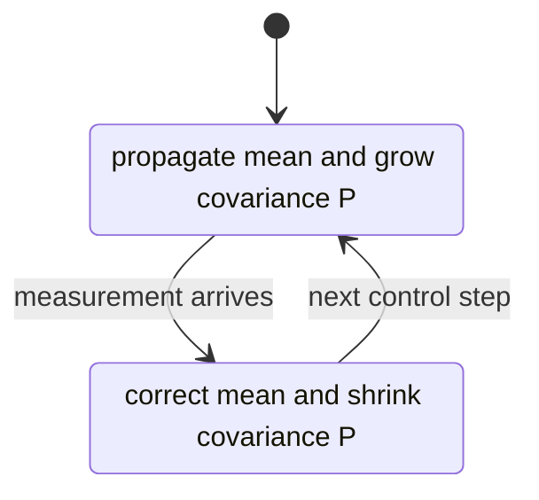
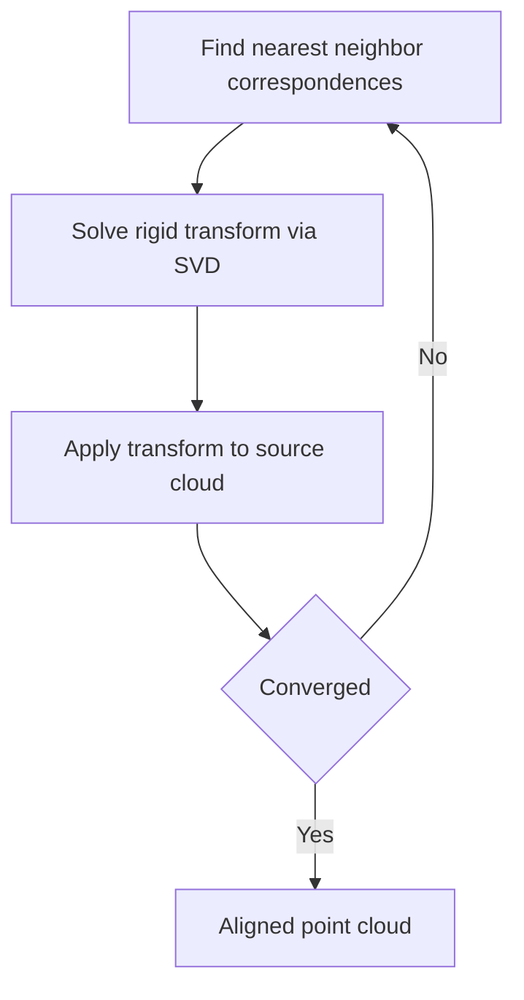

# Lecture 2 — The Robotics Technical Interview: Kinematics, Controls, Sensor Fusion, and the Résumé Conversation

> **Duration:** ~2 hours of reading + one whiteboard derivation done from memory.
> **Outcome:** You can answer the four core technical-interview categories — kinematics, controls, state estimation, perception — write the EKF predict step on a board without notes, defend a clean coding question under a timer, and run the "five technical projects" résumé conversation without overclaiming.

The system-design round (Lecture 1) tests whether you can architect. The technical round tests whether you actually understand the math under your own stack. These are different failure modes. Plenty of candidates can draw a beautiful box diagram and then cannot write the equation for the very EKF box they drew. The interviewer's job is to find that gap. This lecture closes it.

If you remember one thing:

> **The technical round is won by people who can derive, not recite.** "The EKF predicts then updates" is a recitation. Writing `P⁻ = F P Fᵀ + Q` and explaining every symbol *is* understanding. Reciters get caught on the first follow-up. Derivers don't, because they can rebuild the answer from the structure.

---

## 1. The four categories

Robotics technical interviews sample from four buckets. Know which bucket each question is in, because the *kind* of answer differs.

| Category | Typical question | What's really being tested |
|----------|------------------|----------------------------|
| **Kinematics** | "Forward kinematics of a 2-link arm." "What's the Jacobian for?" | SE(3), transforms, the velocity map, singularities. |
| **Controls** | "PID vs LQR vs MPC — when each?" "Is your controller stable?" | Feedback, optimality, constraints, stability arguments. |
| **State estimation** | "Explain an EKF. Write the predict step." | Bayesian filtering, linearization, covariance, tuning. |
| **Perception / coding** | "How does ICP work?" + a timed coding problem. | Geometry, a clean algorithm, idiomatic code. |

You will get one or two from each bucket in a 45-minute round. The EKF question is the single most common in the estimation bucket and the one we drill hardest, because it is also the most *derivable* — and therefore the one where reciters get exposed.

---

## 2. Kinematics, fast

You learned this in Phase 1 and Phase 3. Here's the interview-shaped refresher.

### 2.1 Forward kinematics

Forward kinematics maps joint angles **q** to an end-effector pose **T ∈ SE(3)**. For a serial chain it's a product of per-joint transforms:

```
T(q) = T₀₁(q₁) · T₁₂(q₂) · ... · Tₙ₋₁ₙ(qₙ)
```

Each `Tᵢ₋₁ᵢ` is a 4×4 homogeneous transform combining a rotation (the joint motion) and a fixed link offset. If asked to do a planar 2-link arm with link lengths `l₁, l₂`:

```python
import numpy as np

def fk_planar_2link(q1, q2, l1, l2):
    """End-effector (x, y) and orientation for a planar 2-link arm."""
    x = l1 * np.cos(q1) + l2 * np.cos(q1 + q2)
    y = l1 * np.sin(q1) + l2 * np.sin(q1 + q2)
    theta = q1 + q2
    return np.array([x, y, theta])
```

That's the whole answer for the planar case. For a real 6-DOF arm you'd cite DH parameters or the product-of-exponentials (screw) formulation — and you'd say "in practice I let the URDF + KDL/MoveIt2 do this; I derive it by hand for a 2-link to show I understand it."

### 2.2 The Jacobian — the question behind the question

The manipulator Jacobian **J(q)** maps joint velocities to end-effector velocities:

```
ẋ = J(q) · q̇
```

Why interviewers love it: it connects four things at once. It is used for (1) Cartesian velocity control, (2) static force mapping via `τ = Jᵀ F`, (3) singularity analysis (where `J` loses rank and the arm loses a DOF or needs infinite joint speed), and (4) the basis of Jacobian-transpose / damped-least-squares IK. The planar 2-link Jacobian:

```python
def jacobian_planar_2link(q1, q2, l1, l2):
    """∂(x, y) / ∂(q1, q2) for the planar 2-link arm."""
    J = np.array([
        [-l1*np.sin(q1) - l2*np.sin(q1+q2), -l2*np.sin(q1+q2)],
        [ l1*np.cos(q1) + l2*np.cos(q1+q2),  l2*np.cos(q1+q2)],
    ])
    return J
```

The killer follow-up: "what happens at a singularity?" Answer: `det(J) → 0`, the arm is fully stretched or folded, you lose a Cartesian DOF, and naive inverse `q̇ = J⁻¹ ẋ` blows up. The fix is damped least squares (Levenberg-Marquardt): `q̇ = Jᵀ(J Jᵀ + λ²I)⁻¹ ẋ`, which trades a little tracking error for bounded joint velocities near the singularity. If you can say *that* sentence you've answered a question most candidates fumble.

---

## 3. Controls: PID vs LQR vs MPC

The controls question is almost always "compare these and tell me when you'd use each." Here is the answer, compressed, with the trade-off that matters.

| Controller | What it is | Use when | Can't do |
|------------|-----------|----------|----------|
| **PID** | Error feedback: `u = Kp·e + Ki·∫e + Kd·ė` | SISO, fast loops, no model needed (wheel velocity, joint torque) | Handle constraints; coordinate coupled states optimally. |
| **LQR** | Closed-form optimal for linear system + quadratic cost; `u = -Kx` from the Riccati equation | MIMO, you have a linear(ized) model, no hard constraints | Respect actuator limits, obstacle constraints, or nonlinearity directly. |
| **MPC** | Re-solve a finite-horizon constrained optimization every cycle | You have constraints (actuator limits, lane/aisle bounds, obstacles) and a model | Run if your solver can't hit the control rate; needs compute. |

The senior framing: **"PID is the workhorse for the fast inner loops, LQR is what you reach for when you have a clean linear MIMO model and want optimality cheaply, and MPC is what you use when constraints are first-class — which on a mobile base in a tight aisle, they are."** Then the trade-off: MPC pays for constraint-handling with compute, because it solves an optimization at every control step. That's why your control thread budget mattered in the Lecture-1 design.

The stability follow-up: for LQR, the Riccati solution gives you a Lyapunov function for free, so closed-loop stability is provable for the linearized system. For MPC, stability needs a terminal cost / terminal constraint to guarantee recursive feasibility. For PID, you argue stability via gain/phase margin or root locus. Know *which argument goes with which controller* — that's the depth they're probing.

The "why did you pick MPC for your base?" question is a Lecture-1-style defense and the subject of this week's challenge. Have the answer: constrained aisle-following with actuator limits and a kinematic model, where PID couldn't enforce the lateral bound and LQR couldn't enforce the actuator saturation. If your real answer is "the tutorial used it," fix that this week.

---

## 4. The EKF on the whiteboard — the centerpiece

This is the one you will be asked to *write*. "Explain how an EKF works and write the predict step on the board" is a verbatim prompt from the syllabus and a verbatim prompt in real loops. Let's build it so you can reproduce it from memory.

### 4.1 The setup

You have a nonlinear system. State **x** evolves under a motion model `f` with control **u**; you get measurements **z** through a model `h`:

```
xₖ = f(xₖ₋₁, uₖ) + wₖ      w ~ N(0, Q)   process noise
zₖ = h(xₖ)      + vₖ      v ~ N(0, R)   measurement noise
```

The Kalman filter is exact for *linear* `f` and `h`. The world isn't linear (a robot's heading makes the motion model nonlinear). The EKF's one idea: **linearize `f` and `h` around the current estimate using their Jacobians, then run the linear KF equations.** That's it. Everything else is bookkeeping.

### 4.2 The two Jacobians

```
F = ∂f/∂x  evaluated at (x̂ₖ₋₁, uₖ)    — the state-transition Jacobian
H = ∂h/∂x  evaluated at x̂ₖ⁻            — the measurement Jacobian
```

`F` propagates the covariance forward; `H` maps state-space uncertainty into measurement space. The whole EKF is "KF, but replace the linear `A` and `C` matrices with the Jacobians `F` and `H` evaluated at the current estimate."

### 4.3 The predict step — write this from memory

This is the step you write on the board. Two lines:

```
x̂ₖ⁻ = f(x̂ₖ₋₁, uₖ)              (1) propagate the mean through the nonlinear model
Pₖ⁻ = Fₖ Pₖ₋₁ Fₖᵀ + Qₖ         (2) propagate the covariance through the linearized model
```

Say every symbol out loud as you write it:

- `x̂ₖ⁻` — the *a priori* (predicted, pre-measurement) state estimate. The minus superscript means "before the update."
- `f(x̂ₖ₋₁, uₖ)` — push the previous best estimate through the **full nonlinear** motion model. Note: the *mean* uses the real `f`, not the linearization. Only the *covariance* gets linearized.
- `Pₖ⁻` — the predicted covariance. It grew, because (a) the linearized dynamics `F Pₖ₋₁ Fᵀ` reshape and rotate the uncertainty ellipse, and (b) `+ Qₖ` injects new uncertainty from process noise. Prediction always *increases* uncertainty.
- `Qₖ` — process-noise covariance. The "how much do I trust my motion model" knob.

If you write those two lines and narrate those four bullets, you have answered the question better than 80% of candidates. The number-one mistake people make: they write the covariance line but propagate the mean with `F x̂` (the linear form) instead of `f(x̂, u)` (the nonlinear form). Get that right and you've shown you understand *why* it's "extended."

### 4.4 The update step (have it ready for the follow-up)

```
yₖ = zₖ − h(x̂ₖ⁻)                       innovation (measurement residual)
Sₖ = Hₖ Pₖ⁻ Hₖᵀ + Rₖ                    innovation covariance
Kₖ = Pₖ⁻ Hₖᵀ Sₖ⁻¹                       Kalman gain
x̂ₖ = x̂ₖ⁻ + Kₖ yₖ                       corrected state
Pₖ = (I − Kₖ Hₖ) Pₖ⁻                    corrected covariance (uncertainty shrinks)
```

The intuition for the gain `K`: it's the trust ratio. Big `Pₖ⁻` (uncertain prediction) or small `R` (precise sensor) → big `K` → trust the measurement. Small `Pₖ⁻` or big `R` → small `K` → trust the prediction. Predict grows `P`; update shrinks it. That oscillation is the whole filter.


*The EKF cycle alternates predict and update, growing then shrinking the uncertainty each step.*

### 4.5 A runnable reference — the 2D range-bearing EKF

You'll write this in `exercise-02`, but read it here first so the board version is muscle memory. State is `[x, y, θ]`; control is `[v, ω]`; measurement is range/bearing to a known landmark.

```python
import numpy as np

def ekf_predict(x, P, u, dt, Q):
    """EKF predict for a unicycle robot. x=[px,py,theta], u=[v,omega]."""
    px, py, th = x
    v, w = u

    # (1) propagate the MEAN through the full nonlinear motion model
    x_pred = np.array([
        px + v * np.cos(th) * dt,
        py + v * np.sin(th) * dt,
        th + w * dt,
    ])

    # F = ∂f/∂x evaluated at (x, u): the state-transition Jacobian
    F = np.array([
        [1.0, 0.0, -v * np.sin(th) * dt],
        [0.0, 1.0,  v * np.cos(th) * dt],
        [0.0, 0.0,  1.0],
    ])

    # (2) propagate the COVARIANCE through the linearized model
    P_pred = F @ P @ F.T + Q
    return x_pred, P_pred


def ekf_update(x_pred, P_pred, z, landmark, R):
    """EKF update against a range-bearing measurement to a known landmark."""
    lx, ly = landmark
    dx, dy = lx - x_pred[0], ly - x_pred[1]
    q = dx * dx + dy * dy
    r = np.sqrt(q)

    # expected measurement h(x): [range, bearing]
    z_hat = np.array([r, np.arctan2(dy, dx) - x_pred[2]])

    # H = ∂h/∂x: the measurement Jacobian
    H = np.array([
        [-dx / r,  -dy / r,   0.0],
        [ dy / q,  -dx / q,  -1.0],
    ])

    y = z - z_hat
    y[1] = np.arctan2(np.sin(y[1]), np.cos(y[1]))   # wrap bearing to (-pi, pi]

    S = H @ P_pred @ H.T + R
    K = P_pred @ H.T @ np.linalg.inv(S)

    x_upd = x_pred + K @ y
    P_upd = (np.eye(3) - K @ H) @ P_pred
    return x_upd, P_upd
```

Two details that prove you've actually shipped one: the **angle wrap** on the bearing innovation (forget it and the filter diverges every time the robot points near ±π), and the fact that the **mean uses the nonlinear `f`/`h`** while only the covariance uses `F`/`H`. Interviewers who've built filters will check both.

### 4.6 The three follow-ups that always come

1. **"When does linearization break?"** When the model is strongly nonlinear over one timestep relative to the uncertainty — the first-order Taylor expansion misses curvature, the covariance is wrong, the filter gets overconfident and can diverge. Fix: shorter timestep, or switch to a UKF (sigma points, no Jacobians, captures the nonlinearity better) or an iterated EKF.

2. **"How do you tune Q and R?"** `R` you often *know* — it's the sensor datasheet noise. `Q` you tune: too small and the filter ignores real motion and lags reality (overconfident, diverges on a bump); too large and it's jumpy and noisy. Tune by checking the **normalized innovation squared (NIS)** lies inside its chi-squared bounds — a real, quantitative answer that lands hard.

3. **"Why EKF instead of a factor graph / GTSAM?"** EKF marginalizes the past into a single Gaussian — cheap, constant-time, great for real-time on-robot. A factor graph (iSAM2) *smooths* over a window, relinearizing past states, so it's more accurate and handles loop closures, at higher cost. You use the EKF for the 100 Hz local estimate and a factor graph for the SLAM back-end. *That's* the answer, and it's the same EKF-vs-smoother trade-off from your own stack.

---

## 5. The timed coding question

Robotics loops still include one clean coding problem — often geometry- or algorithm-flavored. Recent real examples: "compute IoU of two axis-aligned boxes," "given a point cloud, voxel-downsample it," "implement a ring buffer for sensor timestamps." Treat it like any coding interview: clarify, state approach, write it, test it, state complexity. A clean one:

```python
def iou_aabb(a, b):
    """IoU of two axis-aligned boxes, each (x1, y1, x2, y2). O(1)."""
    ix1, iy1 = max(a[0], b[0]), max(a[1], b[1])
    ix2, iy2 = min(a[2], b[2]), min(a[3], b[3])
    iw, ih = max(0.0, ix2 - ix1), max(0.0, iy2 - iy1)
    inter = iw * ih
    area_a = (a[2] - a[0]) * (a[3] - a[1])
    area_b = (b[2] - b[0]) * (b[3] - b[1])
    union = area_a + area_b - inter
    return inter / union if union > 0 else 0.0
```

Narrate as you go: "boxes are `(x1,y1,x2,y2)`; intersection is the overlap rectangle, clamped to zero when disjoint; union is sum minus intersection; guard the divide-by-zero. O(1) time and space." The narration is graded as heavily as the code. Silence loses points even with correct code.

---

## 6. The "five technical projects" résumé conversation

The last category is the résumé deep-dive, and it's where your capstone earns its keep. The interviewer says "walk me through a project you're proud of," and then they *dig*. The structure:

### 6.1 Pick the five

From forty-eight weeks you have many candidates. Pick five that are (a) technically deep, (b) yours, (c) defensible to the third "why," and (d) spread across the stack so you can steer toward your strengths. A strong C24 five:

1. **The perception cycle** (Week 16) — fused IMU+LiDAR+RGB-D, learned detection inside a 30 ms Orin budget.
2. **The learned-policy stack** (Week 32) — imitation/RL policy completing a constrained pick with a classical fallback.
3. **The language-conditioned capstone** (Weeks 41–48) — the full mobile manipulator taking a natural-language instruction.
4. **The safety case** (Week 41) — the ISO-framed hazard log, FMEA, and fail-safe design.
5. **The eval suite + fine-tune** (Week 44) — the twenty-instruction eval, baseline-vs-fine-tuned per-instruction reporting.

### 6.2 The two-minute STAR story

Each project gets a two-minute story in STAR shape: **Situation** (one sentence of context), **Task** (what you specifically had to do), **Action** (the technical meat — the decisions, the trade-offs, the things that went wrong), **Result** (the number — latency hit, success rate, what shipped). Example, compressed:

> "**S:** My capstone perception node had to fuse three sensors and detect objects inside a 30 ms cycle on an Orin Nano. **T:** I owned the whole pipeline — fusion, detection, and the latency budget. **A:** I ran an EKF in `robot_localization` for the IMU+odom fusion, ran the detector in TensorRT INT8 to fit the GPU window, and put perception in a composable container so the pointcloud didn't get copied across processes. The first version blew the budget at 45 ms; I profiled it, found the copy, and the container fixed it. **R:** Final cycle was 28 ms p95, and the detector held mAP within 2 points of the FP16 baseline after quantization."

That's two minutes, it's specific, it has numbers, and every sentence is a door the interviewer can open. Which is the point.

### 6.3 Surviving the deep dive without overclaiming

After the story, they dig: "you said TensorRT INT8 — what's the accuracy cost of INT8 vs FP16, and how did you calibrate?" "You said EKF — write the predict step." "You said composable container — what's the actual mechanism that avoids the copy?" (Answer: intra-process zero-copy via `rclcpp` intra-process comms / loaned messages, when QoS is compatible.)

The rule: **never claim what you can't defend to one level deeper than the story.** If you say "EKF," you must be able to write §4.3. If you say "INT8 quantization," you must know it's a calibrated post-training quant with a representative dataset and a small accuracy hit. If you said "OpenVLA for the policy" you must be able to say *why not a scripted grasp* (generalization to novel objects and language) and *what its failure modes are* (out-of-distribution objects, long-horizon drift). The candidate who says less but defends all of it beats the candidate who name-drops and folds on the first follow-up.

And the honest move when you hit your edge: **"I didn't go deeper than X on that — here's how I'd find out."** That is a *passing* answer. "I'm not sure, but I'd measure it by Y" reads as senior. Bluffing reads as junior and gets caught. The whole defense against overclaiming is knowing exactly where your real knowledge stops and saying so.

---

## 6.5 The perception / geometry questions

The estimation bucket overlaps with a perception bucket, and a few geometry questions come up so often they're worth having canned. None is hard; the test is whether you can state the *idea* cleanly and know the failure mode.

**"How does ICP work?"** Iterative Closest Point aligns two point clouds. Loop: (1) for each point in the source cloud, find its nearest neighbor in the target; (2) solve for the rigid transform (R, t) that minimizes the sum of squared distances between those correspondences — closed-form via SVD of the cross-covariance matrix; (3) apply it; (4) repeat until convergence. The failure mode: it's a *local* optimizer, so a bad initial guess converges to a wrong alignment. That's why you seed ICP with an odometry prior, and why point-to-plane ICP (minimizing distance to the local surface, not the point) converges faster and more robustly than point-to-point. You used this in Phase 1 for LiDAR registration; cite it.


*ICP alternates correspondence search and rigid alignment until the clouds converge.*

```python
import numpy as np

def best_fit_transform(src, dst):
    """Closed-form rigid (R, t) aligning src->dst given correspondences. SVD."""
    cs, cd = src.mean(axis=0), dst.mean(axis=0)
    H = (src - cs).T @ (dst - cd)          # cross-covariance
    U, _, Vt = np.linalg.svd(H)
    R = Vt.T @ U.T
    if np.linalg.det(R) < 0:               # reflection guard
        Vt[-1] *= -1
        R = Vt.T @ U.T
    t = cd - R @ cs
    return R, t
```

**"How does RANSAC fit a plane to a point cloud?"** Randomly sample three points, fit the plane they define, count inliers within a distance threshold, keep the best model over N iterations, refit on all inliers. The point of the question is robustness: RANSAC tolerates a high outlier fraction, which is why it's the standard for ground-plane segmentation before clustering obstacles. The failure mode: a wrong inlier threshold — too tight rejects the real plane, too loose merges the floor with low obstacles.

**"What's the difference between extrinsic and intrinsic calibration?"** Intrinsics describe the camera itself (focal length, principal point, distortion) — the `K` matrix and distortion coefficients you get from a checkerboard. Extrinsics describe where the sensor *is* relative to the robot — the `T_base_camera` transform in your TF tree. You need both: intrinsics to turn pixels into rays, extrinsics to turn rays into robot-frame geometry. A miscalibrated extrinsic is the classic reason "the robot grasps two centimeters left of the cup."

These are quick wins. State the idea in two sentences, name the failure mode, cite where you used it.

## 6.6 The behavioral and culture signals

The résumé conversation bleeds into the behavioral round, and robotics startups screen hard for a specific temperament. Know what they're listening for, because the questions are predictable and the wrong answer disqualifies you regardless of your technical depth.

- **"Tell me about a time the robot failed in the field."** They want to hear that you've shipped something real enough to fail, that you debugged it methodically (not by guessing), and that you took responsibility. The trap answer is "it never failed" — that means you never shipped. Use a real failure from your capstone: the EKF that diverged, the policy that grasped the wrong object, the planner that deadlocked. Tell the debugging story and the fix.
- **"How do you decide when something is safe enough to deploy?"** This is the safety-culture screen. The right answer references your Week 41 safety case: a hazard log, a residual-risk argument, a validation plan — not "I tested it a bunch and it seemed fine." Robotics companies that hurt someone go out of business; they screen for engineers who feel that weight.
- **"Walk me through a disagreement with a teammate on a technical decision."** They want collaboration, not stubbornness or pushover-ness. The strong answer: you disagreed, you proposed a way to *measure* who was right, you ran the experiment, and you committed to the outcome either way. "We'd measure it" is the senior reflex in behavioral questions too.
- **"Why robotics? Why this company?"** Generic enthusiasm reads as a candidate who'll leave in a year. Specific enthusiasm — you read their engineering blog, you have a real opinion about their sensor choice, you built something adjacent to their product — reads as someone who'll stay and care.

The unifying temperament robotics startups hire for: **rigorous, safety-serious, measurement-driven, and collaborative.** Every behavioral answer should radiate at least one of those. The capstone gives you true stories for all four — use them.

## 7. Putting it together

The technical round is four buckets — kinematics, controls, estimation, perception/coding — plus the résumé deep-dive. You pass it by *deriving* rather than reciting, by writing the EKF predict step cold, by having the controller trade-offs and stability arguments ready, and by telling five tight STAR stories you can defend to the third layer. Everything you need, you built in the last forty-four weeks. This week is learning to put it on a board, out loud, under a clock.

The challenge this week makes you defend one capstone decision through three "why" layers; the mini-project makes you run both this round and the system-design round for real and grade them. Do them. The gap between a candidate who *built* a robot and one who can *defend* it is exactly the gap between the no and the offer.

---

## Key takeaways

1. The technical round samples **kinematics, controls, estimation, and perception/coding** — plus the résumé deep-dive. Know which bucket each question is in.
2. **Derive, don't recite.** Write the EKF predict step (`x̂⁻ = f(x̂,u)`, `P⁻ = F P Fᵀ + Q`) from memory, propagate the *mean through the nonlinear model* and only the *covariance through the Jacobian*.
3. Have the **controller trade-off and stability argument** ready: PID for fast loops, LQR for cheap linear optimality, MPC when constraints are first-class.
4. The Jacobian question is really four questions: **velocity control, force mapping, singularities, and IK.** Know damped least squares.
5. The résumé conversation is won by **STAR stories with numbers** and lost by **overclaiming** — never claim what you can't defend one level past the story; "I'd measure it by Y" beats a bluff.

---

## Self-assessment before Thursday's technical mock

You are ready for the technical mock when you can do every one of these cold, on a board, no notes:

- [ ] Write the EKF **predict** step (`x̂⁻ = f(x̂, u)`, `P⁻ = F P Fᵀ + Q`) and narrate every symbol, propagating the mean through the *nonlinear* model.
- [ ] Write the EKF **update** step (innovation, `S`, gain `K`, corrected `x̂` and `P`) and explain the gain as a trust ratio.
- [ ] Derive **`F` and `H`** as Jacobians and remember to **angle-wrap** the bearing innovation.
- [ ] Answer the three EKF follow-ups: **linearization breakdown**, **tuning Q/R via NIS**, **EKF-vs-factor-graph**.
- [ ] Compare **PID / LQR / MPC** with the right *use-case* and the right *stability argument* for each.
- [ ] State what the **Jacobian** is for (velocity control, force mapping, singularities, IK) and what **damped least squares** fixes.
- [ ] Explain **ICP** and **RANSAC plane fit** in two sentences each, with the failure mode.
- [ ] Tell **five STAR stories** with quantified results and survive two deep-dive follow-ups on each.
- [ ] Hit the genuine edge of your knowledge and say **"here's how I'd find out"** instead of bluffing.

If any EKF item makes you hesitate, re-run `exercises/exercise-02-ekf-predict-on-the-board.py` until the math is reflexive. That exercise is not optional prep — it is the literal centerpiece of the round.

---

## A final reframe

The technical round feels scarier than the system-design round because there's a "right answer" you can get wrong. But every question in it samples material you have already implemented and debugged. You wrote an EKF in Phase 2. You tuned a controller in Phase 3. You aligned point clouds with ICP in Phase 1. You built and evaluated a learned policy in Phase 4. The interviewer is not testing whether you can learn robotics — you already did that. They're testing whether you *retained the why*. The fix for that is not cramming new material; it's re-deriving your own stack until the math is in your hands and not just your notes. Do `exercise-02` until the predict step writes itself, tell your five stories until they're tight, and the round becomes a tour of work you already did.
