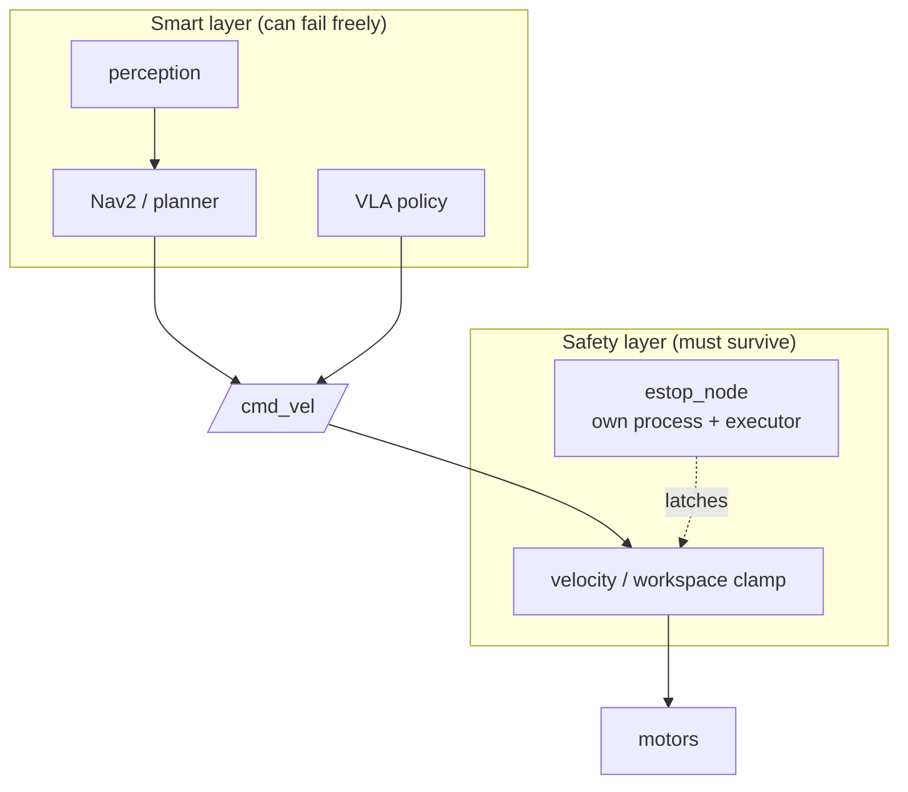

# Lecture 2 — The Two Drills, the Recovery Ladders, and the Postmortem

> **Duration:** ~2 hours of reading + hands-on.
> **Outcome:** You can run both gameday drills end to end — sensor dropout mid-task and planner deadlock at a doorway — walk the recovery ladder for each, hit the 60-second operator-detectable bar, and write a blameless postmortem against the template that feeds back into your safety case.

Lecture 1 gave you detection and degradation. This lecture is the playbook for the two drills the syllabus and the capstone acceptance criteria specify, and the postmortem that turns surviving them into a portfolio artifact. We walk each drill as a timeline, because gameday is graded on a timeline.

---

## 1. The one invariant: the safety path survives every injection

Before either drill, one rule governs everything: **the safety path must be outside the blast radius of any failure you inject.** The software E-stop (the 200 ms latch from Week 41), the velocity/workspace clamps, and the controlled-stop logic must keep working when the LiDAR dies, when the planner deadlocks, when the policy node crashes. If killing the LiDAR can also take down the E-stop, you do not have a safety path — you have a single point of failure dressed up as one.

Concretely: the E-stop runs in its own node (its own process, ideally its own executor), subscribes to nothing that a fault can poison, and its action — stop the base, clamp the arm — depends only on signals that survive. You test this *first*, before gameday: inject each failure and confirm the E-stop still latches. A safety path you have not chaos-tested is a hope, not a mitigation.

The architectural pattern that makes this true:



Notice the clamp sits on the `/cmd_vel` path *between* the smart layer and the motors — so no matter what garbage the smart layer emits (a bad policy action, a planner that went haywire after losing perception), the clamp bounds it before it reaches the wheels. And the E-stop reaches the clamp through a path that does not touch perception or the policy. This is what "safety doesn't depend on the smart parts" looks like in a node graph: the dangerous outputs are funneled through a layer that does not trust them. (Lecture 2 §1 of Week 48 returns to this for the defense.)

---

## 2. Drill 1 — Sensor dropout mid-task (the timeline)

The setup: the robot is mid-execution of a language-conditioned pick ("bring me the red cup from the left bench"), driving toward the bench. At T+0 the instructor `kill -9`s the LiDAR driver. The clock starts.

Here is the timeline of a *passing* run, with the engineering behind each event:

```text
T+0.0s   LiDAR driver killed (-9). /scan stops mid-stream.
T+0.15s  Deadline event fires on the /scan subscriber (QoS deadline 150 ms).
         sensor_health['lidar'] = 'DEAD'.   [detection]
T+0.2s   Health aggregator: lidar DEAD, camera+imu OK -> can_degrade() = True
         -> overall = DEGRADED.            [diagnosis]
T+0.4s   BT reacts to DEGRADED: drop the LiDAR costmap layer (mark invalid,
         remove — do NOT freeze it), inflate the camera costmap, cap velocity
         at 0.2 m/s, widen goal tolerance. [graceful degradation]
T+2.1s   Operator dashboard shows: robot-health DEGRADED, fault "LiDAR dropout",
         action "degraded nav on camera, 0.2 m/s". A human can SEE it. [operator-detectable]
T+18s    Robot reaches a safe waypoint; because the bench approach needs LiDAR
         for the final align, the BT chooses safe-abort over a blind grasp.
         Controlled stop, arm clamped, task marked FAILED-SAFE. [safe response]
                                          --> PASS (recovered/aborted < 60s,
                                              operator-detectable, no blind action)
```

The graded events are the three in the README's marker line: **detection time, operator-alert time, recovery/abort time inside 60 s.** Note three things that separate this pass from a lucky fail:

- **The costmap layer was *removed*, not frozen.** A frozen LiDAR layer would let Nav2 plan against a stale snapshot — the silent-success trap. Removing it forces the planner to reason with what it actually has.
- **The robot chose safe-abort for the final grasp**, because the grasp needed the dead sensor. Continuing to a blind grasp would have been the lucky-fail path. Stopping was the *correct* answer, and "we aborted the grasp because it required the sensor we lost" is a clean defense.
- **The operator saw it within 2 seconds.** A recovery the operator cannot see is not a recovery you can defend (§4).

A *failing* run of the same drill: the costmap was cached with a 5-second TTL, so the robot drove the next two meters on the stale map, never flipped to DEGRADED, and happened to reach the bench. Smooth, and a failure — it never detected the dropout, so in a different layout it would have driven into the obstacle the stale map didn't show.

The variant that catches people who *do* detect: detection fires, health flips to DEGRADED, the dashboard lights up — and the robot keeps driving at full speed anyway, because the BT subscribed to robot-health but no node actually *acted* on DEGRADED. This is the "alert and pray" anti-pattern (Lecture 1 §5). The dashboard makes it look handled; the velocity trace proves it wasn't. The grader's diff test — did commanded velocity and active costmap layers change at the fault? — catches it. Wiring the detection to a *behavior change* is the half people forget; detection alone is a log line, not a mitigation.

---

## 3. Drill 2 — Planner deadlock at a doorway (the timeline and the recovery ladder)

The setup: the robot must pass through a narrow corridor to reach the goal. At T+0 the instructor `ros2 topic pub`s a moved obstacle that partially blocks the doorway — not fully (that would be a trivial "goal unreachable"), but enough that the planner's first solution is infeasible and it starts *cycling*: plan, fail, replan, fail.

The deadlock signature is the thing to detect: the planner produces a new plan repeatedly without the robot making forward progress. You detect it with two signals together — **replan count climbing** and **forward progress near zero** — over a window:

```python
def check_deadlock(self):  # on a 1 Hz timer
    progressed = self.distance_moved_last(window_s=5.0) > 0.1   # meters
    replanning = self.replan_count_last(window_s=5.0) >= 3
    if replanning and not progressed:
        self.deadlock = True   # cycling without progress -> deadlock
```

Either signal alone is a false positive: replanning while progressing is *normal* (dynamic obstacles), and no progress while not replanning is just a robot waiting at a light. The *conjunction* — replanning *and* not progressing — is the deadlock signature.

Tuning the thresholds matters and is where false positives hide. Set them against a *normal* run first:

- **The progress window** (here 5 s) must be long enough that a momentary pause (yielding to a person, a slow turn) does not read as "stuck," but short enough to catch a real deadlock inside the 60-second bar. 5 seconds is a reasonable start; tune it.
- **The replan threshold** (here ≥ 3) must be above the normal replan rate. If your planner legitimately replans twice a second avoiding dynamic obstacles, a threshold of 3-per-5-seconds will false-positive constantly. Measure your normal rate, then set the threshold well above it.
- **The progress threshold** (here 0.1 m) must exceed sensor/odometry noise so that a *stationary* robot reliably reads as "not progressing" and a *crawling* robot reads as "progressing." Too tight and noise looks like progress; too loose and a genuine crawl-out reads as stuck.

The meta-point: a detector you did not tune against a normal run will either miss deadlocks (thresholds too lax) or cry wolf (too tight). Run the robot through the doorway *successfully* a few times first, watch the replan-count and progress traces, and set the thresholds in the gap between "normal" and "stuck."

Once detected, you walk the **recovery ladder**, escalating only when the cheaper rung fails:

1. **Replan with relaxed constraints.** Inflate the goal tolerance, shrink the costmap inflation radius slightly, allow a tighter turn. Often the doorway is passable with a less conservative plan. (This is what Nav2's recovery behaviors do — spin, back up, clear the costmap — your ladder is a custom version.)
2. **Clear the costmap and re-perceive.** A stale obstacle in the costmap (the moved object's *old* position) can block a doorway that is now clear. Clearing forces fresh perception.
3. **Request operator assist.** If the robot cannot solve it autonomously within the budget, it raises an operator-assist request on the dashboard — "stuck at doorway, requesting teleop or path approval" — and waits, *stopped*, for a human. This is not a failure; in a fleet, escalating to a human is the correct, designed behavior.
4. **Controlled stop (last resort).** If no assist comes and no plan is found, the robot stops in place, safely, and marks the task blocked. It does *not* keep grinding the planner forever or attempt a desperate squeeze.

A passing timeline:

```text
T+0s    Moved obstacle published; doorway partially blocked.
T+8s    Deadlock detected: 3rd replan cycle in 5 s window, < 0.1 m progress. [detection]
T+9s    Ladder rung 1: replan with relaxed goal tolerance + reduced inflation.
        Operator dashboard shows "deadlock at doorway, attempting relaxed replan". [operator-detectable]
T+41s   Relaxed plan found a feasible path through the wider side of the doorway;
        robot proceeds. Forward progress resumes.                      [recovery]
                                          --> PASS (recovered < 60s, operator-detectable)
```

If rung 1 and 2 fail, the *correct* passing outcome is rung 3 — a clean operator-assist request, stopped and waiting — well inside 60 seconds. The drill does not require the robot to solve every deadlock alone; it requires the robot to *recognize* it is stuck and escalate safely and visibly. A robot that grinds the planner silently for two minutes *fails*, even if it eventually squeaks through, because no operator could have known it needed help.

The ladder maps onto Nav2's existing recovery machinery, which is worth knowing because the panel may ask "did you build this or reuse Nav2?":

- **Nav2's behavior server** already ships recovery behaviors: `Spin`, `BackUp`, `Wait`, `ClearCostmap`. The navigation behavior tree invokes them when the controller or planner reports failure.
- **Rung 1 (relaxed replan)** is a custom tweak — adjusting planner tolerances — that you wire as a BT condition before falling to Nav2's stock recoveries.
- **Rung 2 (clear costmap)** is literally Nav2's `ClearCostmap` recovery.
- **Rung 3 (operator-assist)** is *your* addition — Nav2 has no concept of "ask a human," so you add a BT branch that publishes an assist request and waits. This is the fleet-ops touch most candidate stacks lack.
- **Rung 4 (controlled stop)** is the terminal: when the navigation BT exhausts recoveries, it returns failure; your top-level BT catches that and triggers the safe stop rather than letting the failure propagate uncaught.

The honest framing for the panel: "I reused Nav2's recovery behaviors for rungs 1–2 and added the operator-assist and controlled-stop rungs on top, because Nav2 stops at 'I failed' and a shared-space robot needs 'I failed, so I'm asking a human and standing still.'" That sentence shows you understand both what you reused and what you had to build — exactly the judgment a senior reviewer probes for.

---

## 4. The 60-second operator-detectable bar

Both drills share the acceptance bar from the syllabus: **recovered with an operator-detectable event within 60 seconds.** Two halves, both required:

- **Within 60 seconds.** The recovery (or the safe-abort, or the operator-assist request) must happen inside a minute. This is not arbitrary: a minute is roughly the window in which a human operator, alerted, can take over before the situation compounds. Measure it from the bag, not from memory.
- **Operator-detectable.** The fault and the recovery action must appear on the dashboard — a health indicator flipping to DEGRADED/FAULT, a fault label, the recovery action in progress, ideally with a sound or color change a human notices peripherally. A recovery that happens entirely inside the robot's logs, invisible to the operator, *fails this half* even if it was fast and correct. The reason is operational: in a fleet, the operator is the safety net, and a safety net they cannot see is not there.

Wire this into your Week 43 Foxglove dashboard: a robot-health panel (OK/DEGRADED/FAULT, color-coded), an active-fault text panel, and a recovery-action panel. During gameday, the grader watches the dashboard, not your terminal. If they cannot tell from the dashboard that something broke and the robot handled it, you did not pass the operator-detectable half.

The panels that earn the operator-detectable half, concretely:

- **A health indicator** that is impossible to miss — a large, color-coded tile (green/amber/red) for OK/DEGRADED/FAULT, ideally with a state-change sound. A number buried in a plot does not count; the operator is watching ten robots and needs peripheral-vision-detectable state.
- **An active-fault banner** — text naming the current fault ("LiDAR dropout") the instant it is detected. This is what tells the operator *what* broke, not just *that* something did.
- **A recovery-action panel** — what the robot is *doing about it* ("degraded nav, camera-only, 0.2 m/s" or "requesting operator assist at doorway"). This is what tells the operator whether to intervene or let the robot handle it.
- **The teleop-takeover button** (Week 43) — visible and one-click, so when the dashboard shows a fault the robot can't handle, the operator can take over immediately. A dashboard that shows the problem but offers no action is half a tool.

The 60-second clock is generous on purpose: it is roughly how long a human, alerted, takes to assess and decide whether to take over. A recovery that beats it comfortably (the LiDAR drill at ~18 s) gives the operator margin; one that just scrapes in at 58 s gives them none. Aim to beat the bar with room, not to meet it exactly.

### 4.1 Why the operator is the last layer of the safety case

It is worth stating why the operator-detectable requirement is a *safety* requirement and not a UX nicety. In the layered defense (Lecture 2 §2's Swiss cheese), the human operator is the *outermost* slice — the last layer that catches what every automatic layer missed. But a human can only be a safety layer for failures they can *see*. A fault that recovers (or fails) entirely inside the robot's logs removes the operator from the defense entirely, collapsing your layers by one. So "operator-detectable" is not "nice for the demo" — it is "keep the human in the loop as the final mitigation." A reviewer who understands this grades the dashboard as part of the safety case, which is exactly how the Week 48 panel will treat it.

---

### 4.2 A checklist for "operator-detectable"

Before gameday, walk this checklist for each drill — these are the exact things the grader looks for on the dashboard:

- [ ] Within 1 second of detection, a color-coded health tile changes (green → amber/red).
- [ ] A fault banner names the specific fault in plain language.
- [ ] A recovery-action panel shows what the robot is doing about it.
- [ ] The change is noticeable in *peripheral vision* (color/size/sound), not only on close reading.
- [ ] The teleop-takeover control is visible and the operator could click it now.
- [ ] All of the above happen well inside the 60-second bar, with margin.

If you cannot tick all six from the dashboard alone — with your terminal hidden — you have not met the operator-detectable bar, regardless of how correctly the robot handled the fault internally.

## 5. Recover vs degrade-and-continue vs safe-abort: choosing correctly

Lecture 1 §5 introduced the three responses. The choice is graded, so be deliberate:

- **Recover** (fix it and carry on at full capability) — correct when the fault is transient and you can restore full function, e.g. clearing a stale costmap unblocks the doorway. Best outcome when achievable.
- **Degrade-and-continue** (carry on at reduced capability) — correct when the remaining sensors/planners *can* do the job more conservatively, e.g. camera-only nav at 0.2 m/s in a known map. Strong outcome when safe.
- **Safe-abort** (controlled stop, task failed safely) — correct when continuing would require trusting state you do not have, e.g. a grasp that needs the dead LiDAR, or any fault in a shared space where the conservative choice is warranted.

The single most common grading mistake learners make is treating safe-abort as a *failure*. It is not. In the right context — a shared space, a fault that compromises the exact capability the next action needs — safe-abort is the *correct* and most defensible answer. "We stopped because continuing would have meant grasping on a sensor we'd lost, and we were in a shared aisle" is a senior answer. "We pushed through on stale data and got lucky" is the fail. Choose by context, and *say why you chose* in the postmortem.

---

## 6. What "passing" really means (and the lucky-fail trap, restated)

Because it is the crux of the whole week: the drill grades **detection and response**, not "did the robot avoid a crash." Restating the trap one more time, because learners fall into it every cohort:

> A robot that detected the fault and came to a controlled stop **passed**. A robot that sailed through the fault on stale/cached state and happened not to crash **failed** — it never detected the failure, so its non-crash was luck, and luck does not generalize to the next layout, the next obstacle, the next person.

When you analyze your run, the first question is never "did it crash?" It is "did it *notice*?" A robot that noticed and responded conservatively beats a robot that didn't notice and got away with it, every time, on the rubric and in the real world.

A useful way to internalize this: imagine running the same drill a hundred times with slightly different obstacle layouts. The robot that *detected* and stopped has the same safe outcome all hundred times — its safety does not depend on the layout. The robot that *sailed through on stale data* had a safe outcome this once because of where the obstacles happened to be; in some fraction of the hundred layouts it hits something. The grader is, in effect, asking "would this be safe across all layouts, or just this one?" — and only detection-plus-response generalizes. Luck is a property of one run; resilience is a property of the design. The drill grades the design.

---

## 7. The blameless postmortem (the real deliverable)

Surviving the drill is half the grade. The postmortem is the other half, and it is the artifact the Week 47 interviewer and the Week 48 panel will actually read. It is **blameless** — it explains *what and why* without assigning fault to a person — because the goal is a better system, and blame makes people hide the truth that fixes it.

The template, per the production runbook and the SRE postmortem culture:

```markdown
# Postmortem: <Drill name> — <date>

## Summary
One paragraph: what failed, what the robot did, the outcome (recovered / degraded /
safe-abort), and the headline numbers (detected T+_, operator-alert T+_, recovered T+_).

## Timeline (from the bag, not memory)
T+0.0s  <injection>
T+0.15s <detection event>
...
T+_s    <recovery / abort>
(Every line cited to the rosbag timestamp or the dashboard recording.)

## Root cause
The single technical reason the steady-state hypothesis was violated. ONE thing.
(e.g. "the LiDAR driver process was killed; /scan stopped.")

## Contributing factors
The things that made it better or worse but were not THE cause.
(e.g. "the deadline QoS was set, so detection was fast" — a GOOD contributing factor;
 "the costmap TTL was 5 s, which would have masked the dropout if we hadn't also had
 the deadline event" — a contributing RISK we found.)

## What worked
The mitigations that did their job. Be specific and proud here — this is evidence.

## What didn't
The mitigations that didn't, the surprises, the things slower or worse than predicted.
This is the most valuable section. An empty "what didn't" section means you weren't honest.

## Action items
| # | Action | Owner | Due | Safety-case impact |
Each item is concrete, owned, dated, and notes whether it closes a hazard-log gap.
```

Two things separate a real postmortem from a lab journal:

- **Root cause vs contributing factors are distinct.** The root cause is the *one* thing without which the failure does not happen (the LiDAR died). Contributing factors are everything that shaped the outcome (the deadline QoS was set → fast detection; the costmap TTL was long → a latent risk). Conflating them is the most common postmortem error; it makes you "fix" a contributing factor and leave the root cause live.
### 7.1 A worked postmortem (abbreviated)

So you have a model of the bar, here is a filled-in postmortem for Drill 1:

```markdown
# Postmortem: LiDAR Dropout Mid-Task — 2026-06-12

## Summary
During a "bring the red cup from the left bench" run, the LiDAR driver was killed
(-9) at T+0 while the robot drove toward the bench. The robot detected the dropout
in 1.2 s (deadline event), flipped to DEGRADED, dropped the LiDAR costmap layer,
capped velocity at 0.2 m/s, alerted the operator at T+2.1s, and safe-aborted the
grasp at T+18s because the final bench-align needs LiDAR. Outcome: safe-abort.
Headline: detected T+1.2s · operator-alert T+2.1s · safe-abort T+18s → PASS (< 60s).

## Timeline (from rosbag drill1_2026-06-12.db3)
T+0.00s  lidar_driver SIGKILL; /scan stops.
T+1.20s  /scan deadline event fires; sensor_health[lidar]=DEAD.
T+1.35s  aggregator: lidar DEAD, camera+imu OK → DEGRADED (can_degrade=True).
T+1.60s  BT removes LiDAR costmap layer; max_vel 0.5→0.2; inflation +0.15m.
T+2.10s  dashboard shows DEGRADED + fault "LiDAR dropout" + action "camera-only nav".
T+18.0s  bench reached; grasp requires LiDAR align → BT chooses safe-abort.
T+18.4s  controlled stop; arm clamped; task = FAILED-SAFE.

## Root cause
The LiDAR driver process was terminated; /scan ceased. (One thing.)

## Contributing factors
- GOOD: /scan had a 150 ms QoS deadline set → 1.2 s detection (vs ~0.5 s staleness).
- RISK FOUND: the costmap layer's default TTL was 5 s. Had the deadline event not
  fired, the stale layer would have masked the dropout for up to 5 s — a latent
  silent-failure path. We only had fast detection because the deadline was set.

## What worked
Deadline detection, the DEGRADED encoding, the layer removal, the operator alert,
and the decision to safe-abort rather than blind-grasp.

## What didn't
The 0.9 s gap between detection (T+1.2) and the operator alert (T+2.1) was longer
than predicted (we predicted < 0.5 s alert-after-detect). The dashboard publish was
on a 1 Hz timer; a fault should preempt the timer and publish immediately.

## Action items
| # | Action | Owner | Due | Safety-case impact |
|---|--------|-------|-----|--------------------|
| 1 | Reduce costmap TTL to 0.5 s so it can't mask a dropout | me | 06-14 | closes latent silent-failure hazard H-07 |
| 2 | Make fault events preempt the 1 Hz dashboard timer | me | 06-15 | tightens operator-detect time |
```

Notice what the worked example demonstrates: a *single* root cause, contributing factors that include both a good one and a *found risk*, a "what didn't" that is honest about a real gap (the slow alert), and action items that point at hazard-log rows. That found-risk in the contributing factors — the 5 s TTL that *would* have masked the dropout — is the single most valuable thing in the postmortem, because it is a hazard you would never have noticed without the drill.

### 7.2 Feeding the safety case

The discipline that closes the loop to Week 41:

- **The action items feed the safety case.** This closes the loop to Week 41. Every surprise in "what didn't" should become a hazard-log entry or a new mitigation. A drill that surfaced a gap and a postmortem that turned it into a dated, owned action item is the *whole point* — it is how the safety case stops being a document you wrote once and becomes a living artifact the chaos drill keeps honest.

---

## 8. What you can now do

You can run both gameday drills end to end: kill a sensor mid-task and have the robot detect, degrade or safe-abort, and alert the operator inside 60 seconds; and induce a doorway deadlock and have the robot recognize the replan-without-progress signature and walk a recovery ladder — relax, clear, request assist, controlled stop — visibly and inside the bar. You can choose recover vs degrade vs safe-abort by context and defend the choice. And you can write a blameless postmortem that distinguishes root cause from contributing factors and feeds its action items back into the safety case.

Bring all of it to the challenge — the graded live gameday — and the mini-project, where the two postmortems you write become the artifacts your Week 48 panel reads and your Week 47 interviewer probes. Write them as portfolio pieces, because that is exactly what they are.

One last reframe to carry into gameday: the drill is not adversarial *toward you* — it is adversarial *toward your robot's hidden assumptions*. Every assumption your stack quietly makes ("the LiDAR will always be there," "the planner will always find a path," "the costmap is always fresh") is a place a real deployment will eventually break. The chaos drill is the cheapest possible way to find those assumptions — in a padded test cell with a stopwatch, not in a warehouse with a person. A robot that survives gameday is a robot whose assumptions you have *tested* rather than *hoped*. That distinction is the whole difference between a demo and a deployable robot, and it is exactly what the Week 48 panel is checking when they ask, "and what happened when the sensor died?"

---

### Section recap

| § | The one thing to take away |
|---|---|
| 1 | The safety path (E-stop, clamps) must survive every injection — chaos-test it first. |
| 2 | Drill 1: detect dropout fast, remove (don't freeze) dependent layers, degrade or safe-abort, alert in < 2 s. |
| 3 | Drill 2: detect deadlock via replan-without-progress, walk the ladder (relax → clear → operator-assist → stop). |
| 4 | The 60-second bar has two halves: fast *and* operator-detectable on the dashboard — both required. |
| 5 | Choose recover / degrade / safe-abort by context; safe-abort in a shared space is a strong answer, not a failure. |
| 6 | Passing = detected and responded; a lucky non-crash on stale data is a fail. |
| 7 | The blameless postmortem distinguishes root cause from contributing factors and feeds action items into the safety case. |

A final note on grading, so there are no surprises in gameday. The rubric scores four things, in roughly this priority:

1. **Detection** — did the robot notice, and how fast? (The bar; a miss here fails the drill.)
2. **Response** — was the action a deliberate, detected choice (recover / degrade / safe-abort), and was it safe?
3. **Operator-detectability** — was the fault and recovery visible on the dashboard within the 60-second bar?
4. **The postmortem** — blameless, bag-cited, root-cause-vs-factors, honest "what didn't," owned action items.

Notice that detection is the gate and the postmortem is half the grade. A robot that detected and stopped, with a sharp postmortem, beats a robot that "looked smooth" with a vague write-up — every time. The week is not testing whether your robot is impressive when it works; it is testing whether your robot, and you, handle it well when it doesn't.

That, finally, is why gameday is the most predictive single exercise in the track for real-world readiness. Anyone can demo a robot that works. The engineers companies actually want are the ones whose robots fail *safely and visibly*, and who can write down precisely why. Pass gameday and you have proof — bag-backed, postmortem-documented — that you are one of them.

*Now do the exercises and run the challenge — the live gameday is the point of the week.*
