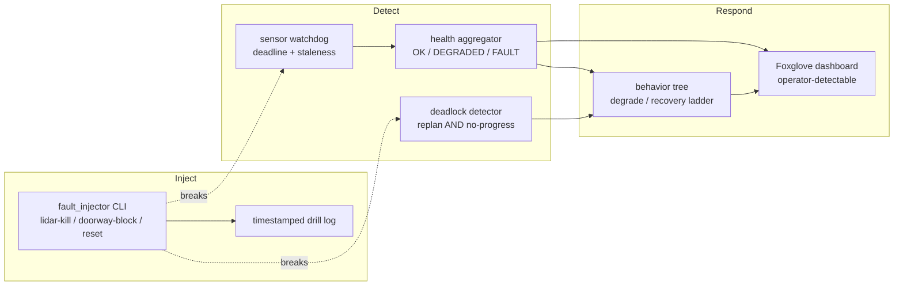

# Mini-Project — The Reproducible Chaos Harness + Two Graded Postmortems

> **Phase 6 / Week 46 deliverable.** This mini-project produces the reusable chaos-injection harness and the two postmortems that are graded capstone artifacts. They are read by the **Week 48 defense panel** and probed by the **Week 47 interviewer**. Do them as portfolio pieces — these two documents are, for many graduates, the artifact that wins the second-round interview.

## What you're building

Two things: a **reproducible chaos harness** (so the drills are not a one-time live event you can never re-run) and the **two postmortems** that turn surviving gameday into evidence.

By the end you will have:

1. A `crunchbot_chaos/` package — a scripted, reversible fault injector that can, on command, kill the LiDAR (`kill -9` or lifecycle shutdown) and spawn a doorway-blocking obstacle, with timestamps logged so a drill is reproducible and self-graded against the 60-second bar.
2. The **sensor watchdog + health aggregator** (Exercise 2, productionized into a ROS2 node) wired into your capstone, with QoS deadline detection.
3. The **deadlock detector + recovery ladder** (Exercise 3, productionized) wired into your Nav2 stack.
4. The **two postmortems**, against the Lecture 2 §7 template, each tracing its timeline to a rosbag and each ending in action items that feed your Week 41 safety case.

This is not throwaway code. `crunchbot_chaos` rides into the capstone repo as the regression harness that re-runs both drills on demand — a strong fleet-ops touch, and exactly what a robotics company means by "do you chaos-test your stack?"

## Why this is the mini-project (and not more robot features)

You have forty-five weeks of robot features. What you do not yet have is *proof your robot fails well*, and that proof is worth more in a defense and an interview than another feature. A robotics company does not ask "can your robot do the task?" — they assume that. They ask "what does it do when the LiDAR dies?" The chaos harness and the two postmortems are your answer, and a *reproducible* harness ("I can re-run the drill right now") beats a story ("it worked that one time in the lab"). The mini-project's value is entirely in how seriously you take the postmortems: a postmortem you sanitized to look good is a lie the Week 48 panel will read straight through.

## Honoring the compounding chain

This week's drills test the whole stack you have built:

- **Week 5** gave you QoS deadline/liveliness — the fast-detection mechanism (Lecture 1 §3.1). The watchdog node *is* Week 5 finally earning its keep.
- **Week 17–19** gave you Nav2 and the behavior tree — the deadlock recovery ladder is a custom set of Nav2 recovery behaviors, ticked by your BT.
- **Week 41** gave you the safety case — its hazard log is the list of failures you *claimed* to anticipate, and the drill tests whether you actually did. Every surprise becomes a new hazard-log entry.
- **Week 43** gave you the telemetry dashboard — the operator-detectable half of the bar lives there. The drill grades on whether the fault is *visible*.
- **Week 45** gave you the interview ramp — defending the postmortem afterward is the "tell me about a time your robot failed" question, rehearsed.

Every postmortem action item should reach into that chain. That traceability is what makes the postmortem a defense artifact, not a lab note.

Concretely, here is how a single drill touches the chain: the LiDAR-dropout drill exercises the Week 5 QoS deadline (detection), the Week 16 perception fusion (which loses a sensor), the Week 17 Nav2 costmap (which must drop a layer), the Week 41 safety case (which must already list the hazard), and the Week 43 dashboard (which must show it). A drill that surfaces a gap in any of those is a gap you close *now*, with the whole stack assembled and one week before the defense — the cheapest possible time to find it.

---

## Architecture of the harness



The injector breaks things; the detectors notice; the aggregator decides; the BT responds; the dashboard makes it operator-detectable. Build it in that order — and note the injector's drill log is what makes the 60-second bar measurable from data instead of a stopwatch.

## Part 1 — The chaos harness

Build `crunchbot_chaos/`:

- A `fault_injector` node/CLI with subcommands: `lidar-kill` (SIGKILL the driver), `lidar-shutdown` (lifecycle), `doorway-block` (publish a moved obstacle at a configured pose), and `reset` (reverse each injection).
- Every injection logs a timestamped event to a drill log so the timeline is reproducible and the 60-second bar is measured from data, not a stopwatch someone watched.
- A `--dry-run` that prints what it *would* do — so you confirm the blast radius before you pull the trigger.

**Acceptance:** `ros2 run crunchbot_chaos fault_injector lidar-kill` stops `/scan` and logs the timestamp; `reset` brings it back. The doorway-block spawns an obstacle that makes the planner cycle.

The injector's CLI shape:

```bash
ros2 run crunchbot_chaos fault_injector lidar-kill --dry-run   # print blast radius, do nothing
ros2 run crunchbot_chaos fault_injector lidar-kill             # SIGKILL the driver, log T+0
ros2 run crunchbot_chaos fault_injector doorway-block --pose "x=2.1 y=0.4"
ros2 run crunchbot_chaos fault_injector reset                  # reverse all injections
ros2 run crunchbot_chaos fault_injector log                    # print the timestamped drill log
```

The `--dry-run` is not optional polish — it is the blast-radius check from Lecture 1 §2.2 made executable. Before you pull the trigger on hardware, `--dry-run` tells you exactly what the injection will touch, so you confirm the E-stop is outside it *before* the robot is moving.

A note on the injector's safety: it must be *impossible* for the injector to disable the safety path. Give it an allowlist of targets (the LiDAR driver, the obstacle topic) and refuse anything that would touch the E-stop node, the clamp, or the controlled-stop logic. A chaos tool that can kill the safety layer is a foot-gun, not a test harness — the whole premise (Lecture 2 §1) is that the safety path survives every injection, so the injector should be incapable of violating it.

## Part 2 — Wire in the watchdog and deadlock detector

Productionize Exercises 2 and 3 into ROS2 nodes in your capstone:

- The watchdog uses a QoS `deadline` callback (fast) plus a staleness timer (portable), publishes per-sensor status, and the aggregator publishes one robot-health topic the BT and dashboard consume.
- The deadlock detector subscribes to your planner's replan count and `/odom`, trips on the conjunction (replanning ∧ not-progressing), and drives the recovery-ladder BT branch.

**Acceptance:** with the harness from Part 1, both detectors fire correctly, health/deadlock state appears on the dashboard, and the recovery ladder escalates as designed.

## Part 3 — Run both drills (the challenge, folded in)

Run the live gameday from the challenge — both drills, on the clock, safety-path-checked first, bagged. Record the detection/operator-alert/recovery times.

**Acceptance:** both drills pass (detected, operator-detectable, recovered/aborted < 60 s), bagged, with the marker line filled in.

## Part 3.5 — Run the safety-path check first

Before either graded drill, run the safety invariant check (Lecture 2 §1) and record it:

- Inject each fault *off the clock* and confirm the software E-stop still latches within 200 ms.
- Confirm the controlled stop still engages with the fault active.
- Trace, in the launch file, that the E-stop node shares no process/executor with anything the fault poisons.

**Acceptance:** `safety-path-check.md` records, for each fault, that the E-stop latched and the controlled stop worked with the fault active. If either failed, that is a single-point-of-failure to fix before gameday — and a far more important finding than any drill result.

## Part 4 — The two postmortems

Write `postmortem-drill-1.md` and `postmortem-drill-2.md` against the Lecture 2 §7 template:

- Timeline cited to the rosbag.
- Root cause distinct from contributing factors.
- An honest "what didn't" section (an empty one means you weren't honest).
- Action items: owned, dated, with the safety-case impact noted.

---

## A worked example of the deliverable folder

By the end, your `interview-prep`-equivalent folder for gameday — committed beside the capstone — looks like:

```text
gameday-w46/
├── README.md                  # the two marker lines, top of file
├── drill-design.md            # Exercise 1: both drills, 5 parts each, E-stop proof
├── crunchbot_chaos/           # the reversible injector package
├── bags/
│   ├── drill1_2026-06-12.db3  # the sensor-dropout rosbag
│   └── drill2_2026-06-12.db3  # the deadlock rosbag
├── postmortem-drill-1.md      # blameless, bag-cited, root-cause-vs-factors
├── postmortem-drill-2.md      # ditto
├── dashboard-recording.mp4    # both faults + recoveries, operator-detectable
└── safety-case-update.md      # the hazard-log rows the drills added
```

A Week 47 reviewer or Week 48 panelist could pick up this folder and, in five minutes, know exactly how your robot fails and how you think about failure. That legibility is the point — the folder is a portfolio artifact, not a scratch directory.

## Grading rubric (100 points)

| Component | Points | Full marks |
|---|---:|---|
| Chaos harness | 18 | Reversible injector for both faults, timestamped drill log, `--dry-run` blast-radius check |
| Watchdog + aggregator wired in | 16 | QoS deadline + staleness detection; one robot-health signal the BT and dashboard consume |
| Deadlock detector + ladder wired in | 16 | Conjunction detection; recovery ladder escalates correctly; dashboard-visible |
| Both drills pass | 22 | Detected (not lucky), operator-detectable, recovered/aborted < 60 s, safety path survived, bagged |
| Postmortem quality | 22 | Blameless; bag-cited timeline; root cause vs contributing factors distinct; honest "what didn't"; owned/dated action items feeding the safety case |
| Marker line + reproducibility | 6 | Marker line filled honestly; the harness can re-run the drills on demand |

**Pass threshold: 75/100.** Note the weighting: passing both drills (22) and the postmortem quality (22) carry the most, because surviving the failure and being able to explain it are the two things this week exists to prove. A drill the robot "passed" by never detecting the fault, or a postmortem sanitized to hide what didn't work, fails those components regardless of the rest.

## A note on honesty

The single most common way this mini-project goes wrong is a robot that *looked* like it handled the failure because it never noticed it (the lucky fail, Lecture 2 §6), paired with a postmortem that papers over the gap. The Week 48 panel will read the bag, see the robot drove two meters on a stale costmap, and ask why your postmortem called that a "graceful recovery." A drill where the robot detected the fault and chose a controlled stop — and a postmortem that says so plainly, including what surprised you — is worth far more than a polished story about a robot that got lucky. Optimize for noticing, and write down what actually happened.

## Common failure modes of this mini-project

So you can avoid them:

- **The robot "passed" by never detecting.** The most common and the most dangerous. Check the velocity/costmap diff at the fault; if nothing changed, you have a lucky fail.
- **The postmortem timeline is from memory.** It must come from the bag. If you didn't bag the drill, you cannot honestly post-mortem it — re-run it with `ros2 bag record -a`.
- **An empty "what didn't" section.** If nothing surprised you, you either didn't push hard enough or aren't being honest. A real drill on a real robot always surfaces *something*.
- **The harness isn't reversible.** If `reset` doesn't reliably restore the system, your drills are outages, not experiments. Test `reset` before you test the injections.
- **The dashboard shows it but the robot didn't act.** "Alert and pray" — the fault is visible but the behavior didn't change. The operator-detectable half is necessary but not sufficient; the *response* half is what keeps the robot safe.

## The end-to-end workflow, once it's built

Tying the parts together, a full drill run looks like this:

1. `ros2 bag record -a` and launch the capstone with the watchdog, deadlock detector, aggregator, and dashboard all running.
2. `fault_injector lidar-kill --dry-run` to confirm the blast radius, then `lidar-kill` for real, logging T+0.
3. The watchdog fires (deadline event), the aggregator flips to DEGRADED, the BT degrades or safe-aborts, the dashboard lights up.
4. `fault_injector log` prints the timestamped events; you cross-check against the bag for the precise timeline.
5. `fault_injector reset` restores the system; you write the postmortem from the bag.

Run that twice — once per drill — and you have the two bags, the two postmortems, the dashboard recording, and the marker lines. That is the deliverable. The harness makes it *repeatable*, which is the difference between "it worked once" and "I can re-run my chaos suite on demand" — the latter is what a robotics company means by chaos-testing.

## Stretch goals

- Add a **drill-replay mode** to the harness that re-runs a recorded injection sequence against a fresh boot of the stack, so the chaos drill becomes a CI regression test ("does the robot still degrade gracefully after this week's changes?").
- Wire the **action items** from your postmortems directly into your Week 41 hazard log as new rows, closing the loop the way a real safety case stays alive.
- Run the drills at **three speeds** (robot at 0.2, 0.5, 1.0 m/s when the LiDAR dies) and report how detection-to-stop *distance* scales with speed — the safety argument for a speed cap in shared space.
