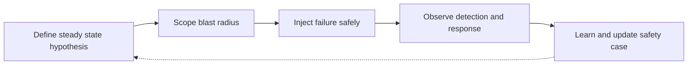
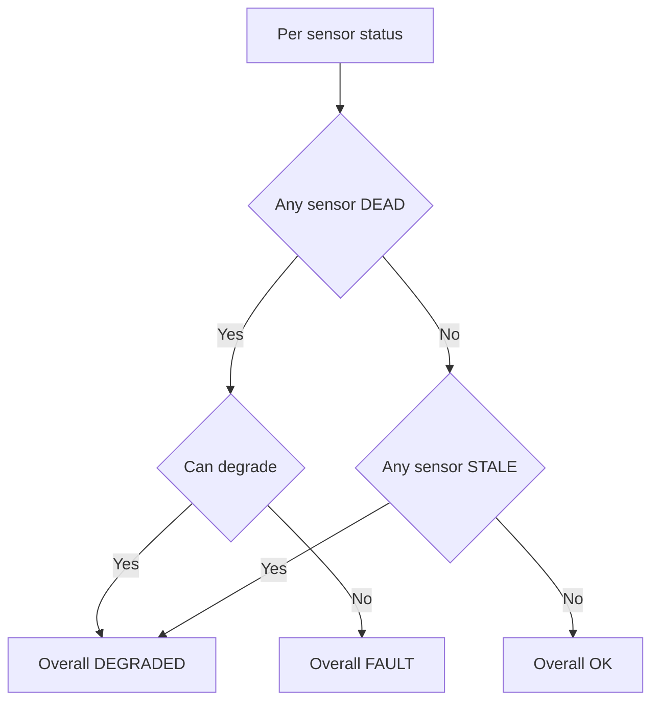

# Lecture 1 — Chaos Engineering for Robots: Break It On Purpose, Before It Breaks On Its Own

> **Duration:** ~2 hours of reading + hands-on.
> **Outcome:** You can state a steady-state hypothesis for your robot, scope a blast radius, inject a controlled failure, detect a sensor dropout in software with a watchdog, fuse per-sensor health into one robot-health signal, and make a robot degrade gracefully instead of either failing or — worse — sailing on under undetected failure.

If you remember one sentence from this week, remember this one:

> **A robot's quality is not what it does when everything works — it is what it does when something breaks, and the only way to know is to break it on purpose, in a safe place, before the world breaks it for you.**

Chaos engineering came from the cloud. Netflix's Chaos Monkey killed random production servers during business hours, deliberately, to force engineers to build systems that survived the death of any one machine. The insight transfers exactly to robots: a robot you have only ever seen succeed is a robot whose failure behavior is *unknown*, and unknown failure behavior on a machine that moves through shared space with people is not a risk you get to leave untested. This lecture is the method for testing it.

---

## 1. Why robots need this more than web services do

When a web service fails, a request 500s and a user retries. When a robot fails, a 30 kg machine with a moving arm is in a room with a person. The blast radius of an undetected robot failure includes *injury*. That raises the stakes on three things the cloud also cares about, but a robot cares about more:

1. **Detection must be fast.** A web service can take seconds to notice a dead backend. A robot driving at 1 m/s covers a meter a second; a two-second-late detection of a LiDAR dropout is two meters driven blind. Detection latency is a safety number.

2. **The default response is *stop*, not *retry*.** A web service retries because retrying is cheap and safe. A robot's safe default is a *controlled stop*, because continuing on possibly-bad state is the dangerous option. "When in doubt, stop" is the opposite of the cloud's "when in doubt, retry," and getting that inversion wrong is how robots hurt people.

3. **Silent success is a failure.** This is the subtle one. If the LiDAR dies and the robot keeps driving on a cached costmap and happens not to hit anything, the cloud-trained instinct says "great, it was resilient." It was not. It was *undetected failure that got lucky*. The drill grades you on detection and response, not on whether the robot crashed (Lecture 2 §6). A robot that detected the fault and stopped *passed*; one that sailed through blind *failed*.

Hold those three. Everything else in this week is machinery for fast detection, a safe default response, and never confusing luck with resilience.

There is a fourth difference that is easy to miss: a robot is a *distributed system that moves*. A web service's failures are mostly about data; a robot's are about data *and physics*. A dropped sensor message is a data failure with a physical consequence — the robot is now moving with stale perception. You cannot retry your way out of being two meters down a hallway you could not see. This is why the cloud's "retry" reflex is exactly wrong here and the "stop" reflex is exactly right.

### 1.1 A short history, because the lineage matters

Chaos engineering is not a stunt; it is a discipline with a decade of production evidence behind it. Netflix built Chaos Monkey in 2011 to kill random production instances during business hours, on purpose, so that engineers could no longer build systems that quietly assumed any single machine would stay up. The result was a fleet that survived instance death routinely, because every service had been forced to handle it. The "Simian Army" extended this to whole-availability-zone failures (Chaos Gorilla) and network latency (Latency Monkey).

The transfer to robotics is direct, with one amplification: in the cloud, the worst case of an un-handled failure is a dropped request; on a robot, it is a collision with a person. So robotics takes the cloud's method — hypothesis, blast radius, controlled injection, learn — and runs it with *more* care about the blast radius and *more* conservatism in the default response. The method is borrowed; the stakes are raised. When you present your chaos drills in the Week 48 defense, framing them in this lineage ("this is chaos engineering, the Netflix discipline, applied to a safety-critical robot") signals you understand that resilience is engineered, not hoped for.

---

## 2. The chaos method, adapted to a robot

The cloud chaos method has four steps. Here they are, instantiated for the LiDAR-dropout drill.

### 2.1 Define the steady-state hypothesis

State, *measurably*, what "healthy" means — before you break anything. Vague ("the robot works") is useless; you cannot test it. Measurable:

> **Steady-state hypothesis:** during a language-conditioned pick task, the robot publishes `/scan` at ≥ 9 Hz, maintains a fused state estimate with covariance trace below `X`, keeps the costmap fresh (< 0.5 s old), and makes forward progress toward the goal at ≥ 0.1 m/s. The robot-health topic reads `OK`.

This is the thing you assert holds and then test by killing the LiDAR. After the injection, the hypothesis *should* be violated in a *detected, controlled* way — health flips to `DEGRADED`, not silently to garbage.

### 2.2 Define the blast radius (keep it small and reversible)

What can this injection affect, and how do you undo it? For the LiDAR drill: the blast radius is the LiDAR topic and everything downstream of it (costmap, Nav2, the task). It does *not* touch the E-stop path (that must survive independently — Lecture 2 §1) or the dashboard. Reversible: `ros2 lifecycle set lidar_driver activate` brings it back, or you restart the process. **Always know how to undo an injection before you make it.** A chaos experiment you cannot reverse is not an experiment; it is an accident.

### 2.3 Inject the failure in a safe environment

You run gameday in sim, or on hardware in an empty, padded test cell with a physical E-stop in a human's hand — *never* in a shared space the first time. The injection itself, for a sensor dropout, is one of:

- `ros2 lifecycle set lidar_driver shutdown` — the graceful "node went away" version.
- `kill -9 <lidar_pid>` — the brutal real-world version: the process is just *gone*, mid-publish, no cleanup. This is the one that finds the bugs, because real sensors die this way (a USB disconnect, a power glitch), not politely.

A catalogue of robot-relevant injections, beyond the two graded ones, so you understand the space the method covers:

- **Sensor dropout** — a sensor process dies (`kill -9`) or its USB disconnects. Tests detection + degradation. (Drill 1.)
- **Sensor degradation** — the sensor publishes but slowly, or with garbage (NaNs, a frozen frame). Nastier than a clean death because a naive staleness check still sees "recent" messages.
- **Planner deadlock** — a partial blockage makes the planner cycle. Tests deadlock detection + the recovery ladder. (Drill 2.)
- **Compute starvation** — a runaway process eats CPU/GPU and the control loop misses its deadline. Tests the latency budget's regression behavior (Week 39).
- **Network partition** — in a multi-process or multi-robot system, DDS discovery breaks between two nodes. Tests whether the robot notices it lost a peer.
- **Clock jump** — the system clock jumps (NTP correction, sim-time glitch). Tests whether time-dependent code (TF, the EKF) degrades sanely.
- **Localization loss** — AMCL diverges; the robot believes it is somewhere it is not. The scariest, because the robot is *confident* and *wrong*.

Each is a hypothesis-blast-radius-injection-learn experiment. The two graded drills are representatives; a mature robot program runs many of these on a schedule.

### 2.4 Observe, then learn

Watch the health signal, the dashboard, and the robot's behavior. Did detection fire? How fast? Did the robot degrade or sail on blind? Then — the part most people skip — *write down what you learned and feed it back into the safety case* (Lecture 2 §7). A chaos drill you do not learn from is just vandalism with extra steps.


*The four-step chaos loop: every injection runs hypothesis, blast radius, inject, learn — then feeds the next one.*

---

## 3. Detecting a sensor dropout: three mechanisms, fastest first

The robot must *notice* the LiDAR is gone. There are three mechanisms, and you want the fastest one your stack supports.

### 3.1 QoS deadline events (the fast one — this is Week 5 finally earning its keep)

In Week 5 you learned the `deadline` QoS policy: the maximum expected gap between samples. You set it, and most people never use it. Here is where it pays off. Set the `/scan` subscriber's deadline to, say, 150 ms (the LiDAR publishes at 10 Hz, so a healthy gap is ~100 ms):

```python
from rclpy.qos import QoSProfile, ReliabilityPolicy, QoSPolicyKind
from rclpy.duration import Duration
from rclpy.qos_event import SubscriptionEventCallbacks

def on_deadline_missed(event):
    # Fires within ~one deadline period of the LiDAR going silent — fast.
    self.get_logger().warn(f"/scan deadline missed: {event.total_count} times")
    self.sensor_health['lidar'] = 'DEAD'

qos = QoSProfile(depth=5, reliability=ReliabilityPolicy.BEST_EFFORT,
                 deadline=Duration(seconds=0.15))
callbacks = SubscriptionEventCallbacks(deadline=on_deadline_missed)
self.create_subscription(LaserScan, '/scan', self.on_scan, qos,
                         event_callbacks=callbacks)
```

When the LiDAR dies, DDS notices no sample arrived within the deadline and fires `on_deadline_missed` — typically within one deadline period (~150 ms). That is far faster than polling, and it is *event-driven*, so it costs nothing when the sensor is healthy. This is the mechanism the README's stretch goal points you at to get detection under 500 ms.

A few implementation notes that bite people:

- The deadline must be *looser* than the publish period or it will fire spuriously. A 10 Hz LiDAR (100 ms period) needs a deadline around 150 ms, not 100 ms — jitter alone would trip a 100 ms deadline constantly.
- The publisher and subscriber deadlines must be QoS-*compatible* (Week 5): the offered deadline must be ≤ the requested deadline. If they are incompatible, the subscription silently does not connect — the exact Week 5 failure mode, now wearing a chaos-engineering hat.
- The callback fires on the executor thread, so keep it light: set a flag, do not block. The heavy work (deciding DEGRADED vs FAULT) happens in the aggregator's own timer.

### 3.2 Timestamp-staleness check (the portable one)

Not every transport gives you reliable deadline events on every platform, so the belt-and-suspenders check is a timer that looks at the age of the last message's *acquisition timestamp* (Week 5: stamp at acquisition, not receipt):

```python
def check_staleness(self):  # runs on a 50 ms timer
    if self.last_scan is None:
        return
    age = (self.get_clock().now() - Time.from_msg(self.last_scan.header.stamp)).nanoseconds / 1e9
    if age > 0.5:  # half a second of no fresh scan
        self.sensor_health['lidar'] = 'STALE'
```

The staleness check catches the dropout even on a transport without deadline events, and it catches a *slow* sensor (publishing but late) that a binary deadline might miss. Use both: deadline for speed, staleness as the portable backstop.

It also catches the *frozen-frame* attack that a deadline misses entirely: a sensor that keeps publishing the same stale frame at full rate. The deadline never fires (messages keep arriving) but the *content* is dead. The staleness-of-content check for that is one more layer — compare consecutive frames and flag if they are byte-identical for N cycles:

```python
def check_frozen(self, msg):
    if self.last_frame is not None and msg.data == self.last_frame:
        self.frozen_count += 1
        if self.frozen_count > 5:           # 5 identical frames in a row
            self.sensor_health['camera'] = 'FROZEN'   # treat as DEAD
    else:
        self.frozen_count = 0
    self.last_frame = msg.data
```

The general principle: each detection mechanism has a blind spot (deadline misses frozen frames; staleness misses fast-garbage; content-check misses slow-but-fresh), so a real robot layers two or three. This is the Swiss-cheese model (Lecture 2 §2) applied to *detection*, not just mitigation.

### 3.3 Liveliness (the writer-is-gone one)

The `liveliness` QoS policy lets a subscriber learn the *publisher* (writer) is gone, distinct from "no data arrived." It is most useful for a hard `kill -9`, where the writer vanishes entirely. It complements the deadline check: deadline says "no data," liveliness says "no writer." Together they distinguish "sensor is slow" from "sensor process is dead," which can matter for the recovery decision (a slow sensor might recover; a dead process needs a restart).

### 3.4 Why detection latency is a safety number, with arithmetic

It is worth the arithmetic that makes detection latency concrete, because it reframes "fast detection" from a nice-to-have into a safety requirement. If the robot drives at `v` and your detection-to-stop pipeline takes `t_detect + t_stop`, the distance driven *blind* — on possibly-bad state — is `v × (t_detect + t_stop)`:

| Speed | Detection (staleness 0.5 s) | Detection (deadline 0.15 s) | Stop 0.2 s | Blind dist (staleness) | Blind dist (deadline) |
|---|---|---|---|---|---|
| 0.2 m/s | 0.5 s | 0.15 s | 0.2 s | 14 cm | 7 cm |
| 0.5 m/s | 0.5 s | 0.15 s | 0.2 s | 35 cm | 18 cm |
| 1.0 m/s | 0.5 s | 0.15 s | 0.2 s | 70 cm | 35 cm |

Two lessons jump out. First, the deadline event (fast detection) roughly *halves* the blind distance versus polling staleness — exactly why the README stretch goal pushes you toward it. Second, blind distance scales with speed, which is the engineering argument for a *speed cap in shared space*: at 0.2 m/s worst-case blind travel is centimeters, recoverable; at 1 m/s it is most of a meter, a collision in an aisle. This turns "be careful near people" into a number for the safety case: "max 0.3 m/s in shared space, because worst-case blind travel after a dropout stays under 20 cm."

---

## 4. The health aggregator: one signal the whole robot acts on

Three sensors, each with its own watchdog, is three opinions. The robot needs *one* answer. The health aggregator is a node that subscribes to every per-sensor status and fuses them into a single robot-health signal — the standard ROS2 pattern is `diagnostic_aggregator` publishing a `DiagnosticArray`, but the concept is what matters:

```python
# Per-sensor watchdogs publish status; the aggregator fuses them.
def aggregate(self):
    statuses = self.sensor_health  # {'lidar': 'DEAD', 'camera': 'OK', 'imu': 'OK'}
    if any(s == 'DEAD' for s in statuses.values()):
        overall = 'DEGRADED' if self.can_degrade(statuses) else 'FAULT'
    elif any(s == 'STALE' for s in statuses.values()):
        overall = 'DEGRADED'
    else:
        overall = 'OK'
    self.health_pub.publish(RobotHealth(overall=overall, per_sensor=statuses))
```

Two design points make this aggregator load-bearing:

- **It decides DEGRADED vs FAULT.** Losing the LiDAR when the camera and IMU survive may be *degradable* (you can still navigate slowly on camera) → `DEGRADED`. Losing the LiDAR *and* the camera leaves no safe perception → `FAULT` → controlled stop. The aggregator encodes which sensor losses are survivable; that encoding *is* part of your safety case.
- **Everyone subscribes to the one signal.** The behavior tree, the safety filter, and the dashboard all read robot-health, not the individual sensor topics. One source of truth means the BT and the operator never disagree about whether the robot is healthy.

The standard ROS2 building block here is `diagnostic_updater` / `diagnostic_aggregator`: each driver publishes a `diagnostic_msgs/DiagnosticStatus` (OK/WARN/ERROR with key-value detail), and the aggregator rolls them up by a configured hierarchy. You can use it directly, or — more common on a focused capstone — write a small purpose-built aggregator like the one above, because the off-the-shelf aggregator's hierarchy config is more machinery than a single robot needs. Either way, the *interface* is the lesson: one published health signal, consumed by everyone, with the survivability logic in one place you can point a reviewer at.

A worked example of the survivability encoding, because this is the part that *is* your safety case:

```python
def can_degrade(self, statuses):
    dead = {n for n, s in statuses.items() if s == 'DEAD'}
    # The IMU is load-bearing: no IMU -> no reliable state estimate -> FAULT.
    if 'imu' in dead:
        return False
    # Navigation needs at least one exteroceptive sensor (lidar OR camera).
    exteroceptive_alive = (statuses.get('lidar') == 'OK') or (statuses.get('camera') == 'OK')
    return exteroceptive_alive
```

Read that and you can recite, exactly, which sensor losses your robot survives and which trigger a controlled stop. That recitation is what the Week 48 panel wants when they ask "what happens when the LiDAR dies?" — and the fact that it lives in *one auditable function* rather than scattered across the codebase is itself the safety argument.


*How the aggregator turns three per-sensor statuses into one robot-health decision.*

---

## 5. Graceful degradation: the difference between a pass and a lucky fail

Detection is half the skill. The other half is *what the robot does next*. Graceful degradation is a spectrum, and you want the robot as far up it as is safe:

| Response | What it looks like for a LiDAR dropout | Verdict |
|---|---|---|
| **Sail on blind** | Keeps driving the cached costmap as if nothing happened. | **FAIL** (undetected failure that got lucky) |
| **Crash / freeze uncontrolled** | A node throws, the executor dies, the robot coasts. | **FAIL** (uncontrolled state) |
| **Detect + safe-abort** | Notices, stops in a controlled way, flags the operator. | **PASS** (safe, if conservative) |
| **Detect + degrade-and-continue** | Notices, drops LiDAR costmap layers, slows to a crawl, widens margins, continues on camera + IMU, flags degraded mode. | **PASS** (best, when safe) |

Degrade-and-continue is the senior answer, and it is concrete engineering, not a vibe:

- **Drop the dependent layers cleanly.** The LiDAR costmap layer goes stale → mark it invalid and *remove* it from the costmap, rather than letting Nav2 plan against a frozen snapshot. A frozen layer is worse than no layer because it lies.
- **Widen the safety margins.** Without LiDAR, your obstacle confidence is lower → inflate the costmap, slow the max velocity, increase the goal-tolerance. You trade speed for safety margin explicitly.
- **Continue only if the remaining sensors *can* do the job.** Camera-only navigation in a known map may be fine at 0.2 m/s; camera-only in a cluttered unknown space may not be. The aggregator's `can_degrade()` is where you encode that judgment.
- **Never silently trust stale data.** The cardinal sin. If you cannot get fresh, trustworthy state, you stop. Stale-but-continuing is the failure that hurts people.

There is a fifth response worth naming so you can *reject* it: **escalate-with-no-degradation** — the robot notices, does nothing different, but logs a warning and keeps driving at full speed. This is the "alert and pray" anti-pattern. It *looks* like a response (there's a log line!) but it changes none of the robot's behavior, so it is functionally identical to sailing on blind. A response that does not alter what the robot *does* is not a response. The test for whether you have real degradation: if you diff the robot's commanded velocity and active costmap layers before and after the fault, do they differ? If not, you have "alert and pray," and the drill will fail you for it.

Here is the BT branch, in pseudo-code, that implements the degrade decision when robot-health flips:

```text
Fallback(on DEGRADED):
    Sequence:
        Condition: can_degrade AND next_action_does_not_need_dead_sensor
        Action: drop_dead_sensor_costmap_layers   # remove, not freeze
        Action: set_max_velocity(0.2)              # widen the safety margin
        Action: inflate_costmap(+0.15 m)
        Action: continue_task
    # if the Sequence fails (can't degrade, or the next action needs the dead sensor):
    Action: controlled_stop + operator_alert       # safe-abort
```

The structure encodes the priority: *try* to degrade-and-continue, but only if it is safe (`can_degrade`) and the immediate next action does not depend on the sensor you just lost; otherwise safe-abort. This is the difference between a robot that thoughtfully continues and one that blindly pushes on — the condition node is where the thought lives.

The choice between degrade-and-continue and safe-abort is *context-dependent*, and context is mostly about the space. In an empty test cell, continue. In a shared aisle with people, the conservative safe-abort is often the correct, defensible answer — and "we chose to stop because we were in a shared space" is a *strong* gameday answer, not a weak one. The drill does not reward bravado; it rewards a defensible response to a detected fault.

---

## 6. Designing an injection you can defend

Before gameday, you write the experiment down (Exercise 1). A defensible injection has five parts:

1. **The steady-state hypothesis** (§2.1) — measurable "healthy."
2. **The injection** — exactly what you do (`kill -9` the lidar driver at T+0, mid-task).
3. **The blast radius** — what it can affect, and the proof the E-stop path is *outside* it.
4. **The expected detection + response** — your *prediction*: "detected within 500 ms via deadline event, health → DEGRADED, robot drops LiDAR layer and slows to 0.2 m/s, operator alert within 2 s."
5. **The abort plan** — the human's finger on the physical E-stop and the command to reverse the injection, in case the robot does *not* degrade gracefully.

Writing the prediction (part 4) before the drill is what makes it science instead of a demo. If the robot does something other than your prediction, you have learned something — and that surprise is a gap in your safety case you now get to close (Lecture 2 §7). A drill where you had no prediction teaches nothing, because anything that happens can be rationalized after the fact.

A fully worked injection design, so you see the shape:

```text
DRILL: LiDAR dropout mid-task
1. Steady-state hypothesis: during a fetch task, /scan >= 9 Hz, costmap age < 0.5 s,
   forward progress >= 0.1 m/s, robot-health = OK.
2. Injection: `kill -9 $(pgrep -f lidar_driver)` at T+0, robot mid-drive toward bench.
   (kill -9, not lifecycle shutdown, because real sensors die ungracefully —
    USB disconnect, power glitch — and that's the case that finds bugs.)
3. Blast radius: /scan -> costmap -> Nav2 -> task. E-stop is OUTSIDE: it runs in
   estop_node (separate process + executor), subscribes only to /safety/estop and
   /cmd_vel echo, neither of which the LiDAR feeds. PROOF: traced in the launch file.
4. Prediction: detected < 500 ms (deadline event); health -> DEGRADED; BT drops the
   LiDAR costmap layer, caps velocity at 0.2 m/s; operator alert < 2 s; safe-abort
   the grasp (needs LiDAR for final align). Recovery/abort well under 60 s.
5. Abort plan: human's finger on the physical E-stop; reverse with
   `ros2 lifecycle set lidar_driver activate` or restart the driver.
```

The discipline is in part 3's *proof* and part 4's *committed prediction*. Without the proof you might be about to expose a safety single-point-of-failure live; without the prediction you cannot tell a pass from a rationalization.

### 6.1 The common ways a chaos drill goes wrong

Worth naming the failure modes of the *drill itself*, not just the robot:

- **No written prediction.** Anything that happens gets called a "success" after the fact. Fix: commit the prediction first (Exercise 1).
- **An irreversible injection.** You kill something you cannot bring back and now the drill is an outage. Fix: know the reversal command before you inject.
- **The blast radius includes the safety path.** Killing the sensor also kills the E-stop, so the "drill" is genuinely dangerous. Fix: prove the E-stop is outside the blast radius first.
- **Grading on crash-avoidance instead of detection.** The robot got lucky and you called it resilient. Fix: the first question is "did it *notice*," not "did it crash."
- **No recording.** The postmortem is from memory of a stressful two minutes. Fix: `ros2 bag record -a` before every drill.

---

## 7. The on-call mindset (a preview of Lecture 2 and the runbook)

Gameday is a rehearsal for being on call for a fleet. The mindset it trains:

- **Triage by severity.** P0 (safety-relevant, robot could hurt someone or itself) → stop the robot now, investigate later. P1 (mission-blocking, no safety risk) → degrade or pause. P2 (degraded but operating) → log and continue. The alert taxonomy from the production runbook maps onto every fault you inject.
- **Do not make it worse.** The first rule of incident response. A frantic operator who SSHes in and restarts the wrong node mid-fault can turn a contained P1 into a P0. The robot's *automatic* response should be conservative precisely because the human's manual response under stress is unreliable.
- **Bag everything.** `ros2 bag record -a` before the drill. The postmortem timeline must come from data, not from anyone's memory of a stressful two minutes. A gameday you did not record is a gameday you cannot honestly post-mortem.

### 7.1 The alert taxonomy, calibrated to a robot

The production runbook (C24's `production-runbook.md`) defines a P0/P1/P2 alert taxonomy. Calibrated to a single robot, it reads:

- **P0 — safety-relevant.** The robot could hurt someone or itself, or is operating on state it cannot trust near people. *Response:* immediate controlled stop; the robot's automatic safety layer handles this without waiting for a human. Examples: lost all exteroceptive sensing while moving; E-stop path degraded; clamp not engaging.
- **P1 — mission-blocking, no immediate safety risk.** The robot cannot complete the task but is not dangerous. *Response:* degrade or pause, alert the operator, do not stop the whole fleet. Examples: the doorway deadlock; the VLA failing an instruction class; a lost-but-recoverable localization.
- **P2 — degraded but operating.** The robot is doing the job at reduced capability. *Response:* log, surface on the dashboard, continue; address at the next maintenance window. Examples: camera-only degraded nav while one redundant sensor is down; elevated but in-budget latency.

The discipline this taxonomy enforces is *not over-reacting*. A P2 treated as a P0 (slamming to a stop every time a redundant sensor hiccups) makes the robot useless; a P0 treated as a P1 (continuing to drive after losing all perception) makes it dangerous. The health aggregator's DEGRADED-vs-FAULT decision (§4) is, in effect, the P-level classifier for sensor faults: DEGRADED is P1/P2, FAULT is P0. Getting that classification right *is* the safety engineering.

---

## 8. What you can now do

You can state a measurable steady-state hypothesis, scope a reversible blast radius, and inject a controlled failure with a written prediction. You can detect a sensor dropout three ways — deadline events (fast), staleness (portable), liveliness (writer-gone) — and fuse per-sensor health into one robot-health signal that decides DEGRADED vs FAULT. And you can make a robot degrade gracefully — drop the dependent layers, widen the margins, slow down, or safe-abort — instead of sailing on blind, which is the lucky fail the drill is designed to catch.

Lecture 2 takes this and runs both drills end to end — the sensor dropout and the doorway deadlock — with their recovery ladders, the 60-second operator-detectable bar, and the postmortem template that is this week's real deliverable.

Before you move on, internalize the one-sentence test you will apply to every drill this week:

> **Did the robot notice, and did noticing change what it did?**

If the answer to either half is no, the robot did not pass — no matter how smooth the run looked. Detection without a behavior change is "alert and pray"; a behavior change without detection is impossible (you cannot respond to what you did not notice); and a smooth run with neither is luck. Only "noticed *and* responded" is a pass.

Carry that test into everything this week: the watchdog you build is the "noticed" half; the degraded-mode and recovery-ladder behavior is the "responded" half; the dashboard is how a human verifies both; and the postmortem is how you prove, with data, that both happened inside the bar.

---

### Section recap

| § | The one thing to take away |
|---|---|
| 1 | A robot's quality is its failure behavior; detection must be fast, the default is *stop*, and silent success is a fail. |
| 2 | The chaos method: measurable steady-state hypothesis, small reversible blast radius, safe injection, learn and feed back. |
| 3 | Detect dropout three ways — deadline (fast), staleness (portable), liveliness (writer-gone); use deadline + staleness together. |
| 4 | The health aggregator fuses per-sensor status into one signal and encodes which losses are survivable (DEGRADED vs FAULT). |
| 5 | Graceful degradation: drop dependent layers, widen margins, slow down, never trust stale data; safe-abort is a strong answer in shared space. |
| 6 | Write the prediction before the injection — that is what makes it science, and surprises are safety-case gaps. |
| 7 | The on-call mindset: triage by severity, do not make it worse, bag everything. |

*Read Lecture 2 next; it runs both drills and gives you the postmortem template.*
