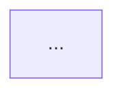
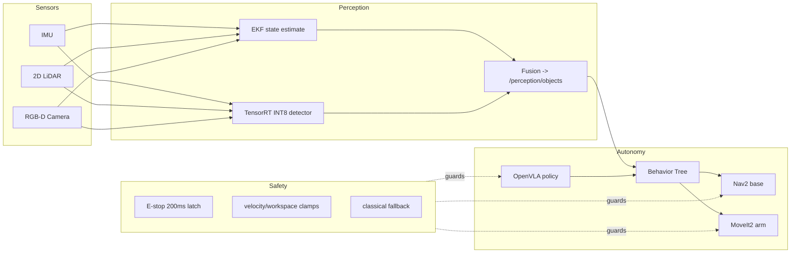

# Lecture 2 — Portfolio Polish: The README, the Diagram, and the Video

> **Duration:** ~2 hours of reading + hands-on.
> **Outcome:** You can polish a portfolio project to the senior bar — a README a stranger can follow, a Mermaid architecture diagram that reads correctly to someone who has never seen your code, and a sub-three-minute walkthrough video a busy reviewer can watch at 1.5x — and tie your three flagship projects into one coherent progression.

Lecture 1 was the conversation. This lecture is what the reviewer reads *before* the conversation, and often instead of it for the first cut. A recruiter screening fifty candidates opens your repo, spends ninety seconds, and forms an opinion. This lecture is about making those ninety seconds work for you.

If you remember one sentence:

> **Your portfolio is read by a tired stranger in ninety seconds; if they can't tell what the project does and why it's good in that time, the quality of the underlying work does not matter.**

---

## 1. The senior-bar README

A junior README is an install dump. A senior README answers, in order, the questions a reviewer actually has. The section order *is* the skill:

### 1.0 What "senior" means in a README

Before the sections, the mindset. A junior README documents *the code*; a senior README serves *the reader*. The difference shows up everywhere:

- A junior writes "## Installation" first; a senior writes what-and-why first, because the reader needs context before instructions.
- A junior says "it works well"; a senior says "44 ms p95," because a reader trusts numbers, not adjectives.
- A junior hides the rough edges; a senior documents them in a limitations section, because a reader who finds an undocumented limitation trusts you less, not more.
- A junior writes for someone who already understands the project; a senior writes for a stranger with ninety seconds.

Hold that frame — *serve the reader* — through every section below, and the structure follows naturally.

### 1.1 The what-and-why paragraph (the most important 80 words)

The top of the README, before any install step, is one paragraph: **what this is and why it exists.** Example, for the perception cycle:

> **The 30-ms perception cycle.** A fused, real-time perception node for a mobile manipulator: it takes IMU, 2D LiDAR, and RGB-D, runs an EKF state estimate and a TensorRT-INT8 object detector, and publishes detected objects in the `map` frame inside a 50 ms cycle on a Jetson Orin Nano. Built for the C24 capstone, where the grasp policy needs fresh, fused perception to act on. Profiled, budgeted, and quantized — the latency report is in `docs/`.

That paragraph tells the reviewer what it does, what it runs on, why it exists, and that you measured it. If they read nothing else, they know whether to keep reading. Most candidate READMEs bury this under "## Installation" and lose the reader.

### 1.2 The architecture diagram (right after the paragraph)

A Mermaid diagram (§2) immediately after the what-and-why. A reviewer is visual; a box diagram of the data flow communicates the design faster than three paragraphs. It also signals you can *think* in architecture, which is what they're hiring.

The architecture diagram earns its prime placement because a reviewer is visual and time-pressed: a glance at a well-grouped box diagram conveys the system's shape faster than any paragraph. It also quietly signals architectural thinking — a candidate who can draw their stack cleanly is one who *understands* it as a system, not just a pile of nodes.

### 1.3 The quickstart that actually runs

The minimal commands to clone and run, tested *cold* on a fresh machine. The single fastest way to lose a reviewer's trust is a quickstart that fails on the first command. If it needs a specific ROS2 distro, a model download, a dataset — say so, exactly, with the commands. "It works on my machine" is not a quickstart.

### 1.4 Results, with numbers

Not "it works well" — the numbers. "17/20 eval instructions, < 0.5 m drift over 20 m, 44 ms p95 cycle." Link the artifacts (the latency report, the eval results, the postmortems). Numbers are what separate a portfolio from a hobby project.

### 1.5 The limitations section (the senior tell)

The honest "what this doesn't do / where it fails." "Camera-only degraded mode is validated to 0.3 m/s in a known map, not in unmapped clutter. The VLA fine-tune is on 50 demos; it generalizes within the eval distribution, not far outside it." A limitations section is the single clearest signal of a senior engineer, because juniors hide limitations and seniors document them. It also defuses the interview — a reviewer can't "catch" a limitation you already stated.

### 1.5b A full senior-bar README, annotated

Here is the skeleton of a passing capstone README, with each section doing its job:

```markdown
# Crunch Robotics Capstone — Language-Conditioned Mobile Manipulator

<!-- WHAT-AND-WHY: the 80 words that earn the next 90 seconds -->
An autonomous mobile manipulator that takes a spoken instruction ("bring me the red
cup from the left bench") and carries it out, safely, in a shared indoor space. Built
for C24, it fuses IMU/LiDAR/RGB-D into an EKF state estimate, navigates with Nav2,
manipulates with MoveIt2, and selects grasps with an OpenVLA policy — all under a
safety layer that bounds any action regardless of what the smart components do.

## Architecture
<!-- the Mermaid diagram, including the safety layer -->


## Quickstart
<!-- cold-boot in one command; tested on a fresh machine -->
```bash
git clone ... && cd capstone
docker compose up        # brings the full stack up in < 60 s
ros2 run capstone send_instruction "bring me the red cup"
```

## Results
<!-- numbers, against the acceptance criteria -->
- 17/20 language instructions (≥15 required)
- 0.38 m drift over 20 m (<0.5 m required)
- 44 ms p95 perception cycle on Orin Nano (15 W)
- 2/2 chaos drills recovered, operator-detectable < 60 s
- Cold-boot 52 s (<60 s required)

## Safety
<!-- link the signed safety case; one-line thesis -->
Safety does not depend on the learned policy. See [safety-case.pdf](docs/safety-case.pdf).

## Limitations
<!-- the senior tell -->
- The VLA fine-tune (50 demos) generalizes within the eval distribution, not far outside it.
- Camera-only degraded mode is validated to 0.3 m/s in a known map, not unmapped clutter.
- Path B (sim): the hardware target is documented but not physically validated.

## Repo map · Videos · Postmortems · Portfolio
<!-- navigation to every other deliverable -->
```

Every section is load-bearing: the what-and-why hooks, the diagram orients, the quickstart invites the skeptic to try it, the results prove it, the limitations defuse the gotcha, and the map routes the reviewer to the rest. A reviewer who reads only the top third already knows whether to keep going — and the answer is yes.

### 1.6 The section order, and why it is the order

The order is not arbitrary — it mirrors the questions a reviewer asks, in sequence:

1. **What is this and why does it exist?** → the what-and-why paragraph. (If they can't answer this, nothing else matters.)
2. **How is it built?** → the architecture diagram. (Now that they care, show the shape.)
3. **Can I run it?** → the quickstart. (The skeptical reviewer tries it.)
4. **Is it any good?** → results with numbers. (Evidence it works, quantified.)
5. **What are the catches?** → limitations. (The senior tell; pre-empts the "gotcha.")

A README that answers these out of order — quickstart first, what-and-why buried at the bottom — forces the reviewer to hunt for the context they need to make sense of everything else, and a hunting reviewer is a leaving reviewer. The order *is* the empathy: you're handing them each answer exactly when they want it.

A common anti-pattern worth naming: the README that is really a *changelog* or a *dev diary* — "added feature X, fixed bug Y, refactored Z." That's writing for yourself (or for git history), not for the reviewer, who does not care about your development sequence. They care what it does now and how to use it. Keep the diary in commits; make the README a product.

> **The mental model:** write the README for the tired stranger, not for yourself. You know what it does; they have ninety seconds and fifty other tabs. Every section earns its place by answering a question they actually have, in the order they have it.

---

## 2. The Mermaid architecture diagram

The syllabus requires a Mermaid architecture diagram (in-repo source + PNG export) for the capstone and each portfolio project. The skill is drawing one that reads correctly to a stranger.

### 2.1 The syntax you need

Mermaid renders directly in GitHub Markdown. The `flowchart` with `subgraph` is almost always the right tool for an autonomy stack:



### 2.2 What makes a diagram *read*

- **Group with `subgraph`.** Sensors, perception, autonomy, safety — the groups carry the mental model. An undifferentiated mess of twenty boxes communicates nothing.
- **Show the data flow direction.** Arrows go the way the data goes. Sensors → perception → autonomy. A reader traces the flow with their eye.
- **Put the safety layer in the diagram.** Most candidate diagrams omit safety. Drawing the E-stop/clamps/fallback as a layer that *guards* the autonomy (dashed arrows) signals you architect for safety, not just function — exactly the Week 41 thinking the panel rewards.
- **Don't draw every topic.** A diagram is a *map*, not the territory. Show the load-bearing data flow; leave the `/clock` and `/tf` plumbing out. If the diagram needs a legend to read, it's too detailed.

Draft it in the Mermaid Live Editor, then paste the source into the README (renders on GitHub) and export a PNG (the syllabus wants both).

### 2.3 The three diagram mistakes

Watch for these — they're what makes a diagram fail the "stranger can read it" test:

- **The hairball.** Twenty boxes, forty arrows, no grouping. The reader sees complexity, not structure. Fix: subgraph by layer; collapse plumbing.
- **No direction.** Arrows pointing every which way so the data flow is ambiguous. Fix: lay it out left-to-right or top-to-bottom following the data, and keep arrows consistent.
- **Missing the safety layer.** The most common omission, and the most telling. A diagram with perception → planning → control but no E-stop/clamp/fallback layer reads as a candidate who thinks about capability but not safety. Fix: always draw the safety layer, guarding the actuators.

A good test: show the diagram (only the diagram, no narration) to a peer and ask them to describe what the system does. If they get it roughly right, the diagram reads. If they're confused, it's a hairball or missing direction — fix it before it goes in front of a reviewer who won't have you there to explain.

---

## 3. The sub-three-minute walkthrough video

The syllabus wants a ≤ 3-minute walkthrough video per flagship project, with voiceover. A reviewer watches it at 1.5x; it has to survive that.

### 3.0 Why a video at all

A README and diagram convey the *what* and the *how*; the video conveys the *that it actually works*. There is a difference between a reviewer believing your robot does the task and a reviewer *seeing* it do the task — the second is far more persuasive, and far harder to fake, which is exactly why it's compelling. A fifteen-second clip of the robot fetching the cup does more for your credibility than three paragraphs claiming it can. The video is your proof-of-life.

### 3.1 Structure: result first

The cardinal rule of a demo: **show the result first, then how.** Open with the robot doing the thing — "here it is taking 'bring me the red cup' and executing it" — in the first fifteen seconds. *Then* walk the stack. A video that spends two minutes on setup before showing anything working loses the reviewer at 1.5x.

A three-minute structure:

- **0:00–0:15** — the result. The robot completing the task (or the perception cycle running, or the policy grasping). Hook them.
- **0:15–1:30** — the stack walkthrough, narrated over the architecture diagram and a screen recording: perception → planning → policy → safety. Tie it to the diagram from §2.
- **1:30–2:30** — one interesting moment: the chaos-drill recovery on the dashboard, or the latency panel, or a multimodal-action visualization. The thing that makes *your* project memorable.
- **2:30–3:00** — the results and the limitation. "17/20, < 0.5 m drift, and here's what it doesn't do yet."

### 3.2 Production that's good enough

You are not making a film. Good-enough is:

- **A script.** Write the voiceover first, time it, cut to fit three minutes. Unscripted rambling always runs long and meanders.
- **A clean screen recording** (OBS) — close the noisy tabs, use a readable terminal font, record the Foxglove dashboard for the telemetry segment.
- **A voiceover, not just captions.** A reviewer often listens while doing something else; the voice carries the story. Record it in a quiet room; re-record the segments where you stumbled.
- **The 1.5x test.** Watch it back at 1.5x. If it's still followable, it's good. If it's a blur, you packed too much in — cut.

### 3.3 A worked video script

A three-minute capstone-video voiceover, sketched, so you see the pacing:

```text
[0:00, robot already mid-task on screen]
"This robot just heard 'bring me the red cup from the left bench' — watch it go."
[robot drives, detects, grasps, returns — 15 seconds of the result FIRST]

[0:15, cut to architecture diagram]
"Here's how. Fused IMU, LiDAR, and depth feed an EKF and a TensorRT detector..."
[trace the diagram left to right as you name each stage — 75 seconds]

[1:30, cut to Foxglove dashboard, replay a chaos drill]
"And here's the part I'm proudest of: we killed the LiDAR mid-task. Watch the health
panel flip to DEGRADED — the robot dropped to camera-only, slowed down, and aborted
the grasp safely. Detected in 1.2 seconds." [60 seconds]

[2:30, results card on screen]
"It clears 17 of 20 instructions, drifts under half a meter over 20 meters, and
boots in under a minute. What it doesn't do yet: generalize far outside the training
distribution — that's next." [end on the number + the honest limitation]
```

Notice it never shows code. A walkthrough video shows the *system behaving* and the *architecture*, not a scroll through source — the reviewer reads code in the repo, not the video. The video's job is to make them *want* to read the code.

---

## 4. The progression: three projects, one story

The syllabus names three flagship projects, and the portfolio's power is that they tell *one story*, a trajectory, not three unrelated demos:

1. **The 30-ms perception cycle (Week 16, + Week 39 profiling).** "I can build a fused, real-time perception pipeline that fits an edge latency budget." The foundation.
2. **The learned-policy + classical-fallback stack (Week 32).** "I can train and deploy a learned policy *and* wrap it in the safety scaffolding real deployment needs." The judgment.
3. **The capstone (Week 48).** "I integrated all of it into one robot that takes a language instruction, runs safely in shared space, and survives chaos drills." The synthesis.

State the progression explicitly — in a top-level `portfolio.md` and in your pitch: "These three build on each other: perception I can trust, a policy I can ship safely, and the integrated robot that uses both." A reviewer who sees the trajectory reads you as an engineer who *grew*, which is more compelling than three impressive-but-disconnected artifacts. The whole is worth more than the parts when you connect them.

The `portfolio.md` that frames the progression:

```markdown
# Portfolio — Three Projects, One Trajectory

I built a robotics autonomy stack in three escalating steps:

1. **The 30 ms perception cycle** — proof I can build fused, real-time perception
   that fits an edge latency budget. (Foundation: can I trust what the robot sees?)
2. **The learned-policy + classical-fallback stack** — proof I can train a policy
   AND wrap it in the safety scaffolding deployment demands. (Judgment: can I ship
   a learned component responsibly?)
3. **The capstone** — proof I can integrate both into one robot that takes a language
   instruction, runs safely in shared space, and survives chaos drills. (Synthesis.)

Each builds on the last: the capstone's perception is project 1; its policy is
project 2; together they're the robot. Links and 3-minute videos below.
```

Notice the parenthetical framing — foundation, judgment, synthesis — which tells the reviewer not just *what* each project is but *what capability it demonstrates*. That mapping (artifact → capability) is what turns a list into a narrative of growth.

### 4.1 Tailoring the progression to the role

The same three projects can be framed slightly differently for different robotics companies — not by lying, but by *leading* with the relevant strength:

- **A perception-heavy company** (AVs, inspection): lead with project 1 (the 30 ms cycle, the profiling, the edge optimization).
- **A manipulation/embodied-AI company** (humanoids, learned policies): lead with project 2 (the policy + safety wrapper + eval).
- **A fleet/operations company** (warehouse, delivery): lead with project 3's operational story (telemetry, chaos drills, the safety case).

The projects don't change; the order and emphasis do. This is the same altitude-matching skill from Lecture 1 §7.2, applied to the portfolio — you're meeting the reader where their interest is, which is empathy, not spin.

---

## 5. The clone-and-run test (the thing that quietly decides it)

Before you call the portfolio done, do the test that separates portfolios that survive contact with a reviewer from those that don't: **clone each project to a fresh machine (or a clean container) and run the quickstart cold, exactly as written.** Time it.

What you'll find, almost always: a missing dependency you had installed globally, a hardcoded path, a model file that isn't in the repo and isn't documented, a ROS2 distro assumption. Every one of those is a reviewer forming a bad opinion in real time. The fix is cheap *now* and expensive *never* — a reviewer who hits a broken quickstart rarely files a bug; they just close the tab. The clone-and-run test is the highest-leverage thirty minutes in the whole week's polish.

The specific failures the test catches, and the fix for each:

- **Implicit global dependency.** You `pip install`ed something months ago and forgot; the fresh machine doesn't have it. Fix: pin everything in `requirements.txt` / a Dockerfile, and test in a clean container.
- **Hardcoded path.** `/home/you/models/...` works for you, fails for everyone. Fix: relative paths or a config, and a documented default.
- **Undocumented model file.** The checkpoint is on your disk, not in the repo (too big for git), and the README doesn't say where to get it. Fix: document the download, or use Git LFS / a release asset.
- **Distro assumption.** "Works on Jazzy" but you never said so, and the reviewer is on Humble. Fix: state the exact ROS2 distro and OS in the quickstart prerequisites.
- **A service that must already be running.** The quickstart assumes a sim or a daemon is up. Fix: include the command to start it, or have the quickstart start it.

The cheapest way to run this test honestly is a fresh Docker container or a clean VM, because your own machine is contaminated by everything you've ever installed. If `docker run` + the quickstart works cold, a reviewer's machine will too — and "it runs in one `docker compose up`" is itself a strong signal of operational maturity.

### 5.1 Why legibility is the actual gate

It's worth being blunt about why this lecture exists at all, when the robot is already built. A recruiter or hiring manager screening candidates does not run your robot, read your code, or watch your full demo. They spend ninety seconds on your README and maybe fifteen on your video, and that decides whether you advance. The brutal arithmetic: the *quality of your work* and the *quality of its presentation* are multiplied, not added. A 10/10 robot with a 2/10 presentation scores a 20; a 7/10 robot with an 8/10 presentation scores a 56. You spent forty-six weeks maximizing the first factor; this week is the cheapest possible investment in the second, and it has more leverage on the outcome than another week of robot work would. Legibility is not vanity — it is the gate, and this week is how you clear it.

---

## 6. What you can now do

You can polish a portfolio project to the senior bar: a what-and-why paragraph that earns the next ninety seconds, an architecture diagram that includes the safety layer and reads to a stranger, a quickstart that runs cold, results with numbers, and a limitations section that signals seniority. You can draw a Mermaid autonomy-stack diagram and produce a sub-three-minute walkthrough that shows the result first and survives 1.5x. And you can tie your three flagship projects into one progression that reads as a trajectory.

Bring all of it to the challenge — the full-loop mock — and the mini-project, where the polished portfolio and the loop debrief become the artifacts your Week 48 panel reads first. The robot is the work; this week is making the work *legible* to the people who decide your career.

---

### Section recap

| § | The one thing to take away |
|---|---|
| 1 | The senior README answers the reviewer's questions in order: what-and-why → diagram → quickstart → results-with-numbers → limitations. |
| 2 | A Mermaid diagram groups with subgraphs, shows data-flow direction, includes the safety layer, and is a map (not every topic). |
| 3 | The video shows the result first, runs ≤ 3 min, has a script + voiceover, and survives the 1.5x test. |
| 4 | Three projects, one progression: perception → safely-shipped policy → integrated capstone; state the trajectory. |
| 5 | Clone-and-run cold on a fresh machine — the highest-leverage 30 minutes; a broken quickstart closes the tab. |
| — | Legibility multiplies with work quality, not adds; presenting well is the cheapest high-leverage investment this week. |

A final practical note on sequencing your week: polish the *capstone* README and video first, because it is the project the Week 48 panel reads and the one a recruiter most wants to see. Then projects 1 and 2, which compound the story. Then the `portfolio.md` that ties them together. And run the clone-and-run test on at least the capstone before Saturday — a broken quickstart in front of the panel is the worst possible time to discover it. The exercises this week give you a runnable README scorer (so you don't have to guess whether each one clears the bar) and a loop scorecard (so your mock is graded honestly); use both before you call the portfolio done.

*Now do the exercises and run the full-loop challenge — the portfolio is what the panel reads first.*
