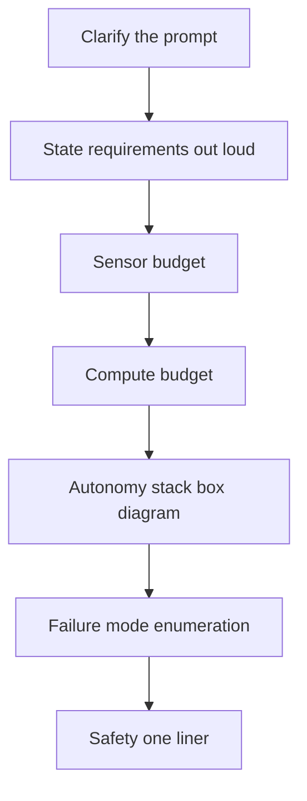

# Lecture 1 — The Full Loop and the Five-Minute Pitch

> **Duration:** ~2 hours of reading + hands-on.
> **Outcome:** You can run a complete robotics-startup interview loop as the candidate — managing five rounds and your own energy — deliver the "tell me about your capstone" story in under five minutes, and defend any decision in your stack through three layers of "why" with a number, not a tutorial citation.

If you remember one sentence from this week, remember this one:

> **Two candidates with identical capstones get different offers, and the difference is almost never the robot — it is whether they can tell the story clearly and defend it honestly under pressure.**

Week 45 ramped you into two isolated mocks. This week is the *full loop*, the real thing: five rounds, back to back, with a senior reviewer whose job is to find the gap between what your portfolio claims and what you actually know. This lecture is the map of that loop and the script for its centerpiece — the five-minute capstone pitch.

---

## 1. The anatomy of the loop (what each round is really testing)

A robotics-startup loop in 2026 has five rounds. Each tests something different, and candidates lose by mis-reading what a round is *for*.

| Round | Length | What it looks like | What it's *actually* testing |
|---|---|---|---|
| **Intro** | 15–20 min | Recruiter or hiring manager; "walk me through your background." | Can you tell a coherent story and read the room? Sets the tone for the whole loop. |
| **Technical deep-dive** | 45 min | "Explain how your EKF works; write the predict step." / "Why a VLA not a scripted grasp?" | Do you *understand* what you built, or did you wire it together? Depth, not breadth. |
| **System design** | 45 min | "Design the autonomy stack for a warehouse AMR." | Judgment under ambiguity: requirements, budgets, trade-offs, failure modes. |
| **Behavioral / portfolio** | 45 min | "Tell me about your capstone." / "Tell me about a time it failed." | Communication, honesty, ownership. The chaos-drill postmortem lives here. |
| **Founder / culture** | 30 min | "Why robotics? Why us?" Often with a founder. | Motivation and fit. Hard to fake, easy to under-prepare. |


*Five rounds, back to back, each testing a different register.*

Three loop-level truths:

1. **It is an endurance event.** Five rounds is three to four hours of being "on." Candidates who are sharp in round one and foggy in round four lose round four. Manage your energy: eat, hydrate, and treat the intro as a warm-up, not the main event.
2. **Each round has a different register.** The deep-dive wants depth on *your* work; the system-design wants breadth and judgment on a *new* problem; the behavioral wants honest narrative. Bringing system-design breadth to a deep-dive (hand-waving) or deep-dive depth to a system-design (rat-holing on one component) both lose.
3. **The interviewers compare notes.** A claim you made in the intro ("I optimized the perception cycle") will be probed in the deep-dive. Consistency matters; the loop is one conversation across five people.

### 1.1 What the company is actually buying

Underneath the five rounds, a robotics startup hiring you as a peer engineer is assessing four things, and every round triangulates on them:

- **Can you build it?** (Technical depth — the deep-dive.) Did you understand what you built, or wire libraries together?
- **Can you design it?** (Judgment — system design.) Given a new, ambiguous problem, can you make sound trade-offs?
- **Can you operate it?** (Maturity — behavioral + your chaos drills.) Do you think about failure, safety, and what happens at 3 a.m.?
- **Do you fit, and will you grow?** (Culture + your retro.) Will you be good to work with, and do you learn from your mistakes?

A candidate strong on "build" but weak on "operate" reads as a junior who hasn't shipped to production. A candidate strong on "design" but who bluffs in the deep-dive reads as someone who talks a good game but can't deliver. The loop is engineered to catch those mismatches, which is why you cannot fake your way through it — and why the honest, evidenced answer beats the impressive-sounding one every time.

---

### 1.2 The intro round: the warm-up that sets the tone

The intro is low-stakes on content and high-stakes on tone. "Walk me through your background" is not a trick — but how you answer calibrates the interviewer's expectations for the whole loop. A strong intro is a *narrative*, not a résumé reading:

- **A through-line, not a list.** "I started in firmware on C7, got tired of devices that didn't *decide* anything, and spent the last year building autonomy — which is how I ended up shipping a language-conditioned mobile manipulator." That's a story with a why; "I did C1, then C5, then C7, then C24" is a list.
- **Land on the capstone.** The intro should funnel toward the thing you most want to talk about, so the interviewer's natural next question is the one you're ready for.
- **Calm and concise.** Two minutes, not ten. Rambling here makes you look like you'll ramble in the deep-dive. Tight here sets the expectation that you're tight throughout.

Use the intro to settle your own nerves, too — it's the round where stakes are lowest, so let it warm you up and set a confident baseline that carries into the harder rounds.

## 2. The technical deep-dive: depth, not breadth

The deep-dive is where overclaiming dies. The interviewer picks one thing you built and digs until they find the edge of your knowledge. The Week 45 EKF-on-the-board drill was rehearsal for exactly this.

Why do they dig until they find your edge? Not to embarrass you — to *locate* you. A senior engineer's edge is deep; a junior's is shallow; someone who wired libraries without understanding has almost no depth at all. The interviewer is mapping where your real knowledge ends, and the *location* of that edge is the signal. So hitting your edge is not failing the round — it is the round working as designed. What you do *at* the edge is what's graded.

The rules:

- **They will go deeper than you expect.** "Explain your EKF" → "write the predict step" → "derive the Jacobian" → "what happens when the linearization error grows?" → "how did you tune Q and R?" Each layer is a chance to show you understand or to expose that you wired a library and moved on. Expect at least one more layer than you feel ready for; that last layer is the interviewer finding your edge, and how you handle it is the whole point.
- **Hitting your edge is fine; bluffing is fatal.** When you reach the genuine limit of what you know, say so: "I didn't derive the full 15-state Jacobian by hand; I used `robot_localization` and validated it against the 2D sub-block, which I *can* derive — here it is." That is a *pass*. "Uh, it just... works?" is the fail.
- **Bring a number to every claim.** "The detector is fast" is breadth; "the detector is 11.6 ms p95 in INT8, costing 1.4 mAP points, here's the latency report" is depth. Your Week 39 latency report and Week 44 eval suite are your ammunition.
- **Show the structure, then the detail.** When asked to explain a system, give the one-sentence shape first ("it's a noise-prediction model that outputs action chunks"), then drill in. Diving straight into detail without the frame loses the interviewer; they can't place the detail without the map.
- **Narrate your thinking.** When you derive or reason on the spot, say it out loud — "the Jacobian's first row is the partial of `x` w.r.t. the state, so..." The interviewer is grading your *process*, and silent derivation hides exactly what they want to see.

The deep-dive maps directly onto the three-layer "why" drill (§4). Treat every deep-dive as that drill, applied to whatever the interviewer chose.

A worked deep-dive, so you feel the escalation:

> **Interviewer:** "You said you fused IMU and wheel odometry with an EKF. Walk me through the predict step."
> **You:** "Sure — the state is `[x, y, θ]`, the control is `[v, ω]`, and the predict propagates the mean through the nonlinear unicycle model `f(x, u)` and the covariance through `P⁻ = F P Fᵀ + Q`, where `F` is the Jacobian of `f`..." *(write it)*
> **Interviewer:** "Derive `F`."
> **You:** *(derive the 3×3, showing the `−v sin θ dt` and `v cos θ dt` terms)*
> **Interviewer:** "What happens as the heading uncertainty grows?"
> **You:** "The linearization is around the mean heading, so as `σ_θ` grows the first-order approximation gets worse — the EKF underestimates the true covariance and can become overconfident. I watched the covariance trace in the bag; when it grew I knew I was approaching the regime where a UKF would've been more honest, but I stayed within it."
> **Interviewer:** "How did you tune `Q`?"
> **You:** "Empirically against ground truth — I drove the 20 m trajectory, compared filtered pose to motion-capture, and raised `Q` until the filter stopped being overconfident (the NEES test sat in its chi-square bounds). The number's in my drift report: 0.38 m over 20 m."

Five layers, and every one is either a derivation or a measured number. That is what "depth" means. The interviewer stops not because they ran out of questions but because they've confirmed you understand it. Contrast the candidate who, at "derive `F`," says "I used `robot_localization` so I didn't derive it" — which is fine *if* followed by "but here's the 2D sub-block I can derive," and fatal if followed by silence.

---

## 3. The system-design round: the seven-phase method

System design is open-ended, and candidates freeze because there is no single right answer. The defense is a *method* you run every time, regardless of the prompt. (Method beats inspiration precisely when you're tired — which is why you rehearse it until it's automatic.) This is the Week 45 method; here it is, compressed, because the loop tests whether you can run it under more pressure:

1. **Clarify the prompt.** "Design an AMR for a warehouse" — how big? How many robots? Shared with humans? What's the task? Spend two minutes here; the interviewer is watching whether you scope before you build.
2. **State requirements and constraints out loud.** Throughput, safety (shared space → hard safety case), latency, the compute budget. Write them on the board.
3. **The sensor budget.** What does it need to perceive, and what sensors at what cost/latency get you there? LiDAR + RGB-D + IMU + wheel odom, and *why each*.
4. **The compute budget.** Edge (Orin) vs offboard; the latency budget (your Week 39 material — a 50 ms cycle, allocated). This is where your edge-ML week pays off in the interview.
5. **The autonomy stack box diagram.** Perception → state estimation → planning (Nav2 + MoveIt2) → control → policy → safety, with the data flow. This is the Mermaid diagram from Lecture 2, drawn live.
6. **Failure-mode enumeration.** What breaks, and what does the robot do? Sensor dropout → degrade or safe-abort (your Week 46 material). This is where you stand out — most candidates forget failure modes entirely.
7. **The safety one-liner.** "In a shared space this needs a documented safety case: software E-stop with a 200 ms latch, velocity clamps, a classical fallback." One sentence that signals you think about safety, not just capability.


*The seven-phase method, run in order every time regardless of the prompt.*

Run all seven, out loud, managing the clock (the README's marker line flagged "system-design pacing" as the common weak round — it is, because candidates rat-hole in phase 5 and never reach failure modes). Steer toward the parts you know cold; the interviewer wants to see judgment, and choosing where to go deep *is* judgment.

The clock discipline, concretely, for a 45-minute system-design round:

- **0–5 min:** clarify + requirements. Resist the urge to start drawing; the candidates who skip this draw the wrong thing.
- **5–12 min:** sensor + compute + latency budgets. This is where your Week 39 edge-ML knowledge differentiates you — most candidates hand-wave compute.
- **12–28 min:** the box diagram. The meat. Draw the stack, narrate the data flow, justify each component briefly.
- **28–38 min:** failure modes. The differentiator. "What if the LiDAR drops? The planner deadlocks? The policy rejects?" Most candidates never get here; reaching it confidently is what makes you look senior.
- **38–45 min:** the safety one-liner + wrap. "In shared space this needs a documented safety case." Land the plane.

If you find yourself at minute 30 still polishing the box diagram, *stop* and jump to failure modes — an incomplete diagram plus a failure-mode discussion beats a perfect diagram with no failure analysis. The interviewer is grading breadth of judgment, and "I'd run out of time, so let me make sure I cover failure modes" is itself a senior move (it shows you prioritize under a deadline, which is the job).

---

### 3.1 The warehouse-AMR, lightly worked

To make the seven phases concrete, here is the skeleton of the most common prompt:

```text
PROMPT: "Design the autonomy stack for a warehouse AMR."

1. CLARIFY: How big is the warehouse? How many robots? Shared with people/forklifts?
   What's the payload and the task — shelf-to-dock transport? What's the uptime target?
   (Pin assumptions: 10,000 m², 50 robots, shared with people, 50 kg totes, 99% uptime.)

2. REQUIREMENTS: throughput (totes/hr), safety (shared space -> hard safety case),
   localization accuracy (dock to ±2 cm), latency (control loop deadline), availability.

3. SENSOR BUDGET: 2D safety LiDAR (certified, for the protective stop) + 3D LiDAR
   (localization) + wheel odom + IMU + a forward depth cam (obstacle/person detection).
   Each justified by what it perceives and its cost/latency.

4. COMPUTE BUDGET: an edge SoC (Orin-class) per robot; the 50 ms perception cycle
   allocated (this is the Week 39 material — and where you out-detail most candidates);
   fleet coordination offboard (Open-RMF).

5. BOX DIAGRAM: sensors -> EKF/AMCL localization -> Nav2 (planner+controller) ->
   behavior tree -> /cmd_vel -> certified safety layer -> drives. Fleet manager above.

6. FAILURE MODES: LiDAR dropout -> protective stop; localization loss -> stop + relocalize;
   narrow-aisle deadlock -> fleet reroutes; person detected -> slow/stop. (The differentiator.)

7. SAFETY ONE-LINER: "Shared-space AMR needs a certified safety LiDAR driving an
   independent protective stop — the autonomy can fail; the safety stop cannot."
```

Notice phase 6 reuses your Week 46 chaos-drill thinking and phase 7 your Week 41 safety-case thinking — the capstone weeks are not separate from the interview, they *are* your interview answers. A candidate who has built and chaos-tested a shared-space robot answers the warehouse-AMR prompt from experience, not theory, and it shows.

## 4. Three-layer "why," across the whole stack

Week 45's challenge had you defend *one* decision three layers deep. The loop probes *any* decision, so this week you rehearse the whole stack. The bar (from the Week 45 challenge):

- Hold up through at least three "why" layers without a non-answer.
- At least one layer connects to a measurement or artifact you actually have.
- Name the alternative you rejected and *why*.
- At your genuine edge, say "I didn't go deeper than X; here's how I'd find out" — a pass, not a fail.
- Catch a false premise if the interviewer plants one (e.g. "an EKF is exact for nonlinear systems, right?"). Agreeing is a quiet fail; correcting it scores.

The decisions a loop will probe, and the one-line spine of each defense (you fill in *your* numbers):

- **Why an EKF, not a factor graph?** "Bounded compute on Orin, my motion is mildly nonlinear, the EKF was within my drift budget (< 0.5 m over 20 m — here's the number); a factor graph buys accuracy I didn't need at a compute cost I couldn't spend."
- **Why MPC (or PID) for the base?** (Week 45's worked example — hard actuator/corridor constraints inside the horizon; the solve-time number from your dashboard.)
- **Why a VLA, not a scripted grasp?** "The task is language-conditioned across 20 instructions; a scripted grasp doesn't generalize across object/instruction pairs. I wrapped it with a safety filter and a classical fallback for when the policy is rejected — here's the intervention rate."
- **Why INT8 on the detector?** "It cleared the 50 ms cycle budget; cost 1.4 mAP, within my 3-point floor — here's the report. FP16 alone didn't fit."

The failure mode is collapsing to "it's what the lecture used." Every one of those is a real engineering decision with a real trade-off and a real number behind it. The loop finds out whether you know the trade-off or just the default.

A reference card of the decisions a loop probes and the rejected alternative you must name for each:

| Decision | Why you chose it | The alternative you rejected, and why |
|---|---|---|
| EKF for state estimation | Bounded constant-time compute; mildly nonlinear motion; met drift budget | Factor graph — more accurate but more compute than the budget allowed |
| MPC for the base | Hard actuator/corridor constraints inside the optimization | LQR — can't enforce the lateral bound; clamping breaks its optimality |
| VLA policy for grasp selection | Generalizes across 20 language instructions | Scripted grasp — doesn't generalize across object/instruction pairs |
| INT8 detector | Cleared the 50 ms cycle budget; cost 1.4 mAP, within floor | FP16 alone — didn't fit the budget |
| AMCL for global localization | Robust relocalization against a known map | Pure runtime SLAM — heavier, drifts without loop closure |
| Behavior tree for task logic | Auditable, composable, reactive | A hand-rolled state machine — harder to audit and extend |

The pattern in every row: *the choice, a reason grounded in a constraint or a number, and the named alternative with why it lost.* Memorize this shape, not the rows — the interviewer can probe any decision in your actual stack, and the shape is what holds up regardless of which one they pick.

---

## 5. The five-minute capstone pitch (the centerpiece)

"Tell me about your capstone" opens the behavioral round and often the whole loop. You get five minutes, and the first thirty seconds decide whether the interviewer leans in or checks the clock. The structure:

1. **The problem (20 s).** "I built an autonomous mobile manipulator that takes a natural-language instruction — 'bring me the red cup from the left bench' — and carries it out, safely, in a shared space." One sentence; concrete; the *what* before any *how*.
2. **The stack (90 s).** The spine: fused IMU+LiDAR+RGB-D perception → EKF state estimate → Nav2 for the base, MoveIt2 for the arm → an OpenVLA policy that picks the grasp from the instruction → a behavior tree on top → a safety layer underneath. Name the layers, don't explain each — you're giving the map, not the tour.
3. **One hard decision (60 s).** Pick the decision you can defend best and tell it as a trade-off: "The hardest call was the base controller. I chose MPC over LQR because the aisles have hard lateral constraints I wanted *inside* the optimization..." This is the hook that invites the deep-dive *you* are ready for.
4. **One failure survived (60 s).** Your chaos drill. "In gameday, the LiDAR was killed mid-task. The robot detected the dropout in 1.2 seconds via a QoS deadline event, dropped to camera-only nav, flagged the operator, and safe-aborted the grasp because it needed the sensor it lost. Here's the postmortem." This single answer covers "tell me about a failure" preemptively, and it shows operational maturity.
5. **The result (30 s).** A number. "It completes 17 of 20 eval instructions, drifts under 0.5 m over 20 meters, and cold-boots in under a minute — all against the capstone acceptance criteria."

Five parts, five minutes, and notice what it does: it *seeds* the deep-dive (part 3) toward ground you're confident on, and it *pre-answers* the failure question (part 4) with your strongest story. You are steering the loop. Practice it until it's under five minutes without rushing — the README's marker line is the proof you timed it.

The two most common pitch failures, and the fix for each:

- **The problem sentence is a list, not a sentence.** "It uses a VLA and Nav2 and MoveIt2 and..." — that tells the listener nothing about *what the robot does*. Fix: lead with the user-facing capability ("takes a spoken instruction and fetches the object"), then the components. The interviewer needs the *what* before they can place the *how*.
- **The result is an adjective.** "It works really well." Fix: a number against the acceptance criteria. "17 of 20 instructions, sub-0.5 m drift." The number is what separates an engineer from an enthusiast, and you have the numbers — they're in your Week 44 eval suite and Week 39 latency report.

Two more refinements that separate a good pitch from a great one: vary your pace (slow down on the hard decision, the part you want them to remember), and *end on the number* — finishing on "17 of 20, under 0.5 m drift, cold-boots in under a minute" leaves the quantified result ringing, which is exactly what you want the interviewer to carry into the deep-dive.

---

### 5.1 A full pitch, written out

So you have a model to adapt (swap in *your* components and numbers):

> "I built an autonomous mobile manipulator that takes a spoken instruction — like 'bring me the red cup from the left bench' — and carries it out, safely, in a shared indoor space. *(problem, 1 sentence)*
>
> Underneath, it's a fused perception stack — IMU, 2D LiDAR, and an RGB-D camera into an EKF state estimate, with a TensorRT-INT8 detector for objects. Nav2 drives the base, MoveIt2 the arm, and an OpenVLA policy picks the grasp pose from the language instruction. A behavior tree sits on top sequencing it, and a safety layer sits underneath — a software E-stop, velocity and workspace clamps, and a classical fallback. *(stack, ~90 s)*
>
> The hardest decision was the base controller. I went with MPC over LQR because the bench approach has hard lateral constraints I wanted *inside* the optimization — an LQR would happily command a velocity into the constraint and I'd have to clamp it, which breaks LQR's optimality near saturation. The MPC plans a feasible trajectory instead. I budgeted 8 ms for it and measured the solver at 5.2 ms p95. *(one hard decision, ~60 s)*
>
> It's been through a chaos drill: we killed the LiDAR mid-task. The robot detected the dropout in 1.2 seconds off a QoS deadline event, dropped to camera-only nav at 0.2 m/s, alerted the operator, and safe-aborted the grasp because the final align needs the LiDAR. That's the kind of failure handling I'm proudest of. *(one failure survived, ~60 s)*
>
> End result: it completes 17 of 20 language instructions, the fused estimate drifts under 0.5 m over 20 meters, and it cold-boots in under a minute — all against the acceptance criteria I set up front." *(result, ~30 s)*

Read that aloud and time it — it lands around 4:30 at a measured pace, leaving margin. Notice the deliberate seeds: the MPC paragraph invites the controls deep-dive you've rehearsed; the chaos paragraph pre-empts "tell me about a failure." You are not just answering "tell me about your capstone" — you are choosing which doors the interviewer walks through next.

## 6. The behavioral round beyond the pitch

After the pitch, the behavioral round probes ownership and honesty. The questions and their spine:

- **"Tell me about a time it failed."** Your *other* chaos drill (the doorway deadlock), or a real integration bug. The structure is the postmortem: what happened, root cause, what you did, what you learned. Blameless even about yourself — "I'd set the inflation radius too conservatively, which made the doorway look blocked; I found it in the postmortem and fixed it."
- **"What would you do differently?"** This is the capstone retro (a Week 48 deliverable). Have a real answer — "I'd have built the latency budget in week 1 instead of week 39; retrofitting it was painful." A candidate with no regrets sounds like one who didn't reflect.
- **"What was the hardest bug?"** Specific, technical, with the debugging *process*: how you localized it (the profiler, the bag, the bisect), not just the fix. The process is what they're hiring.

A bank of behavioral prompts to prepare an answer for, each anchored to a real artifact you have:

- "Tell me about your capstone." → the five-minute pitch (§5).
- "Tell me about a time it failed." → a chaos-drill postmortem (Week 46).
- "What would you do differently?" → the capstone retro (Week 48 deliverable).
- "Walk me through your hardest bug." → the thermal-throttle STAR story (or your real one).
- "Tell me about a time you disagreed with a design decision." → a real trade-off you argued.
- "What's a thing you're proud of and a thing you'd change?" → one win + one regret, both specific.
- "How do you decide when something is good enough?" → your acceptance criteria + latency floor.

The pattern: every behavioral answer should *point at an artifact*. "Tell me about a failure" answered with "here's my chaos-drill postmortem, let me walk you through it" is unbeatable, because it's not a story you might have embellished — it's a document with a bag-backed timeline. Candidates without artifacts tell stories; candidates with artifacts show evidence. You have the artifacts; use them.

The throughline of the whole round is *honesty under follow-up*. The reviewer is calibrating how much to trust your claims, and a candidate who says "I'm not sure, here's how I'd find out" earns more trust than one who confidently bluffs and gets caught.

The STAR structure keeps these answers tight under pressure:

- **Situation:** one sentence of context. "During capstone integration, the arm kept missing grasps in the afternoon but not the morning."
- **Task:** what you had to do. "I had to find why grasp success degraded over a session."
- **Action:** the technical meat — what you actually did, with the *process*. "I bagged a failing run, correlated grasp error with `tegrastats`, and found the Orin was thermal-throttling, which stretched the perception cycle past its budget and stale-stamped the detections."
- **Result:** a number. "Adding a fan and pinning the power mode held the cycle at 44 ms p95 all session; grasp success went from 60% afternoon to 85%."

The Action is where you spend your words, because that's where the *engineering* is. A STAR story that's all Situation and no Action ("it was hard, but I figured it out") tells the interviewer nothing about how you work. Lead them through the debugging — the bag, the correlation, the root cause — because the *process* is what they're hiring, not the heroic outcome.

---

### 6.1 Questions to ask *them* (yes, this is graded)

Every round ends with "do you have questions for me?" — and a blank "no" is a small but real negative. Good questions signal you're evaluating *them* as a peer, which is exactly the frame you want. A few that work in a robotics startup:

- "What does on-call look like for the autonomy team? How often does a robot actually page someone?" (Shows you think about operations, the Week 46 mindset.)
- "How do you decide what's safe enough to deploy in a shared space? Who signs off?" (Shows you take the safety case seriously, the Week 41 mindset.)
- "What's the hardest unsolved problem on the autonomy stack right now?" (Shows you want the hard work, and tells you what you'd be doing.)
- "How do sim and real diverge for you in practice?" (Shows sim2real awareness, the Week 33–34 mindset.)

The questions double as evidence: each one maps to a part of the track you've internalized, so asking them is one more way to demonstrate the depth the loop is assessing — while genuinely learning whether you'd want to work there.

## 7. Managing the loop as a performance

The culture/founder round deserves its own note, because tired candidates under-prepare it and it can swing a close decision. The questions are soft — "why robotics?", "why us?", "where do you want to grow?" — but the assessment is real: will you be good to work with, and are you motivated by the actual work? Prepare three honest sentences on why robotics genuinely pulls you (not "it's a growing field" — something specific, like "I want my code to touch the physical world, not just move text around"), and one specific thing about *this* company that drew you (read their engineering blog; reference something concrete). Energy matters here more than precision; by round five you're tired, but the founder is reading whether you still light up about robots. Save a little genuine enthusiasm for it.

Five rounds is a performance you have to pace:

- **Warm up on the intro.** Low-stakes; use it to settle your nerves and set a confident, calm tone that carries.
- **Spend your sharpness on the deep-dive and system design.** These are the highest-information rounds; they decide the offer. Don't burn out before them.
- **The behavioral is a relief round if you prepared.** Your pitch and postmortems are written; you're recalling, not inventing. Let it recharge you.
- **The culture close is about energy and motivation.** By now you're tired; the founder is reading whether you still light up about robots. Save a little genuine enthusiasm for it.

Practical energy management that interviewees overlook:

- **Eat and hydrate before and between rounds.** A four-hour loop on an empty stomach fades exactly when the high-information rounds land. Treat it like the endurance event it is.
- **Reset between rounds.** Thirty seconds of deliberate breathing between rooms resets your baseline so round four starts as sharp as round one.
- **Don't relitigate a round.** If the deep-dive went poorly, it's over — carrying it into system design makes two rounds bad instead of one. Each room is a fresh start; the interviewers mostly score independently.
- **It's a conversation, not an interrogation.** Ask the interviewer questions, react to their answers, treat it as two engineers talking. Candidates who engage read as future colleagues; candidates who only answer read as test-takers.

And across all of it: **bring your artifacts.** The latency report, the eval-suite results, the postmortems, the architecture diagram. When a reviewer asks "how do you know it's fast?" the senior answer is not a recollection — it's "here, let me show you the panel." Candidates who can produce the number win the trust that candidates who recall the number do not.

### 7.1 The loop mistakes that sink strong candidates

Capable engineers fail loops for avoidable reasons. The big ones:

- **Overclaiming.** The single most common failure (Week 45 warned you; the full loop tests it harder). You say more than you can defend, the deep-dive finds the gap, and now the interviewer discounts *every* claim. Fix: claim exactly what you can defend to three layers, and flag the edges yourself.
- **Rat-holing in system design.** Spending 30 minutes on the perfect box diagram and never reaching failure modes. Fix: the clock budget in §3; jump to failure modes by minute 28 no matter what.
- **Fading across the loop.** Sharp in round one, foggy in round four, and round four was the one that mattered. Fix: pace your energy; treat the intro as a warm-up, save sharpness for the deep-dive and system design.
- **Inconsistency.** A claim in the intro that contradicts the deep-dive, because you didn't have one coherent story. Fix: the five-minute pitch *is* your coherent story; everything else is consistent with it.
- **Bluffing at the edge.** Confident-wrong instead of "here's how I'd find out." Fix: name your knowledge boundary; it reads as senior, not weak.
- **No numbers.** "It works well" throughout. Fix: every claim gets a number from an artifact you can show.
- **Treating it as a test, not a conversation.** Only answering, never engaging. Fix: ask questions, react, treat the interviewer as a future colleague — because that's exactly what they're evaluating.
- **Under-preparing the culture round.** Arriving with no real "why robotics / why us." Fix: three honest specific sentences, prepared in advance, with something concrete about *this* company.

Notice that four of the six are honesty failures, not knowledge failures. The loop is, more than anything, a test of whether your self-presentation matches your actual ability — and the fix for all four is the same: say exactly what's true, show the number, and own the edge.

### 7.2 Calibrating to the interviewer

A small skill that pays off: read who is across the table and adjust register. A founder in the culture round wants vision and energy; a staff engineer in the deep-dive wants rigor and humility; a recruiter in the intro wants a clear, jargon-light narrative. The *content* of your stack doesn't change, but the *altitude* does — you'd explain the EKF to the staff engineer with the Jacobian and to the recruiter as "it fuses the sensors into one best-guess of where the robot is." Matching altitude to audience is itself a signal of communication maturity, and it is the same skill you'll use every day explaining your work to teammates with different backgrounds.

---

## 8. What you can now do

You can run a five-round robotics-startup loop as the candidate, reading what each round tests and pacing your energy across all of them. You can deliver the five-minute capstone pitch that seeds the deep-dive toward your strengths and pre-answers the failure question with your chaos drill. You can run the system-design seven-phase method under pressure, and defend any decision in your stack three layers deep with a number and a named rejected alternative. And you know the difference between hitting your knowledge edge gracefully (a pass) and bluffing past it (the fail).

Lecture 2 turns to the other half of the week: the portfolio a reviewer reads *before* they meet you — the senior-bar README, the Mermaid architecture diagram, and the sub-three-minute walkthrough video.

One last framing to carry in. The whole loop, all five rounds, is answering a single question for the company: *would I trust this person on a robot that operates near people, as a peer?* Every round is a different lens on it — can you build it, design it, operate it, fit. You spent forty-six weeks earning the *yes*; this week is about making sure the loop can *see* the yes. The robot is real. The skill this week adds is letting a stranger, across a table, in a few hours, come to know that it is.

---

### Section recap

| § | The one thing to take away |
|---|---|
| 1 | Five rounds, each testing something different; it's an endurance event and one conversation across five people. |
| 2 | The deep-dive tests depth, not breadth; bring a number to every claim; bluffing is the only fatal move. |
| 3 | Run the system-design seven-phase method every time; don't rat-hole — reach failure modes and the safety one-liner. |
| 4 | Defend any decision three layers deep, with a number and a named rejected alternative. |
| 5 | The five-minute pitch: problem → stack → one hard decision → one failure survived → quantified result; it steers the loop. |
| — | The intro warms you up and sets tone; the culture round needs saved enthusiasm; pace energy across all five. |
| 6 | The behavioral round tests honesty under follow-up; your postmortems and retro are the material. |
| 7 | Pace the loop like a performance; bring your artifacts and *show* the numbers. |

Practical sequencing for the week: run the full-loop mock early (Thursday in the schedule), because its debrief tells you which round to spend your remaining prep on. Don't save the mock for the end — its entire value is finding the weak round while you still have days to fix it. Then drill the weak round, polish the artifacts you'll bring (Lecture 2), and re-rehearse the pitch until it's automatic. The exercises give you a pitch-timer, a README scorer, and a loop scorecard so each piece is measured, not guessed.

*Read Lecture 2 next; it's the portfolio the reviewer opens before you say a word.*
