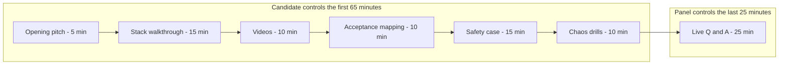
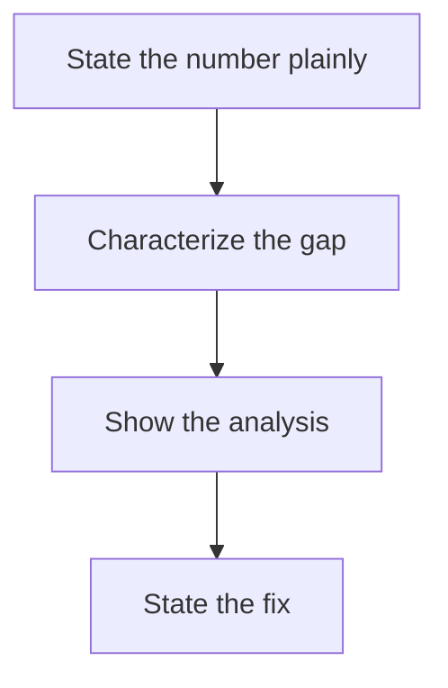

# Lecture 1 — The Defense Package and the Ninety Minutes

> **Duration:** ~2 hours of reading + hands-on.
> **Outcome:** You can assemble the complete capstone defense package (the seven required deliverables), structure the ninety-minute defense with time budgets, and map your robot against every acceptance criterion honestly — knowing, before the panel does, exactly where you stand and what you'd say about any gap.

If you remember one sentence from this final week, remember this one:

> **The defense is the moment you stop being a learner and become a peer engineer; the panel signs the rubric when they would trust you on a robot that operates near people — and that trust is built from a robot that works, a safety case that proves you thought about how it hurts someone if it goes wrong, and a defense where you can answer "why" without bluffing.**

You have built everything. This lecture is about *presenting* it — assembling the package and structuring the ninety minutes so the panel can see, in the time they have, that you are ready.

A reframe to carry through the week: the panel is not an adversary. They are not trying to fail you — failing you is work for them and a loss for the program. They are trying to confirm a *yes*: that you are an engineer they would trust on a robot near people. Your job this week is not to "beat" them; it is to make the yes easy to see — to assemble the evidence and rehearse the defense so that, in ninety minutes, the conclusion is obvious. Everything below serves that: a legible package so the evidence is findable, a structured ninety minutes so nothing important gets cut, and an honest acceptance table so they trust your numbers. Make the yes easy.

---

## 1. The seven required deliverables (the package)

The capstone spec lists exactly what the panel reads. Assemble all seven; a missing deliverable is a fail before you say a word. They are:

1. **The integrated repo** — everything from week 1 forward, public, GPL-3.0, with a top-level README. Not a dump of folders; a navigable repo where the README routes a reader to the autonomy stack, the safety case, the eval results, and the videos.
2. **The Mermaid architecture diagram** — the autonomy stack (in-repo source + a PNG export), the Week 47 §2 diagram: sensors → perception → state estimation → planning → control → policy → safety, with the data flow and the safety layer drawn in. This is the diagram you'll narrate in the stack walkthrough, so it does double duty as artifact and presentation aid — make it readable from across a room.
3. **Two videos** (each ≤ 5 min, voiceover): a sim run and a real run (Path A), or two clearly-labelled sim runs (one sim, one sim-hardened, on a documented hardware target — Path B). Result first, then the walkthrough (Week 47 §3). Path B learners: label the two runs *unambiguously* ("Sim — nominal" and "Sim — hardened on Jetson Orin target") so the panel can tell which is which; an ambiguous pair of sim videos undermines the deliverable's credibility.
4. **The signed safety case** (8–15 pages) — hazard list, FMEA, mitigations, validation plan, residual risk, signed by a peer reviewer. This is the Week 41 artifact, finalized.
5. **The two chaos-drill postmortems** — sensor-dropout-mid-task and planner-deadlock-at-doorway, each 2–4 pages, each passing the rubric. The Week 46 artifacts.
6. **The operator-dashboard recording** (3 min) — the Foxglove dashboard streaming pose, costmap, policy actions, safety-filter status, and CPU/GPU load, ideally showing a chaos-drill recovery. The Week 43 artifact, recorded. The safety-relevant panels (filter status, robot health) must be visible — a recording that shows only a pose plot misses the point, which is that an operator can *see* the robot's safety state.
7. **The polished portfolio** — three projects under `portfolio.md`, the Week 47 deliverable: the perception cycle, the learned-policy + classical-fallback stack, and the capstone, framed as one progression with READMEs, diagrams, and videos.

Plus the **public retro** — the one-page "what I'd do differently" (Lecture 2 §6), which the spec calls for at week 48.

A note on each deliverable's quality bar, because "present" is not the same as "good":

- **The repo** must be navigable, not just complete. A reviewer should reach any deliverable from the top README in one or two clicks.
- **The diagram** must read to a stranger and include the safety layer (Week 47 §2). A hairball fails even if it's "complete."
- **The videos** must show the result first and be labelled unambiguously (especially Path B's two sim runs). A reviewer who can't tell which video is which discounts both.
- **The safety case** must be signed and have a *non-empty* residual-risk section. A safety case claiming zero residual risk reads as one that didn't think hard enough.
- **The postmortems** must be bag-cited and honest about what didn't work. A sanitized postmortem is worth less than none, because it signals you'll sanitize the truth on a real robot.
- **The dashboard recording** must show the safety-relevant panels (filter status, health), not just a pretty pose plot.
- **The portfolio** must pass the Week 47 README scorer and state the progression.
- **The retro** must have specific, technical regrets — not platitudes.

The meta-point: the defense grades the *quality* of each artifact, not its mere existence. A complete package of mediocre artifacts is a weaker defense than a complete package of crisp ones, and the crisp version costs only the care you put into this week.

Exercise 1 is the audit checklist for this package. Run it early in the week; assembling the package always surfaces one deliverable that is "basically done" but not actually committed and navigable.

### 1.1 How a panel actually reads the package

It helps to know the reading order, because it tells you what to make excellent first:

1. **The top-level README** (30 seconds). The panel forms a first impression here. If it doesn't route them to everything else, the rest of the package might as well not exist.
2. **The architecture diagram** (1 minute). They orient on the stack. A clear diagram earns goodwill; a hairball costs it.
3. **The acceptance-criteria table** (1 minute). They check, immediately, whether you cleared the bar — and whether you're honest about any miss.
4. **The videos** (10 minutes, during the session). They watch the robot work.
5. **The safety case** (read before and during). The document they scrutinize most, because it's where trust-near-people is earned.
6. **The chaos postmortems** (read before). Evidence the robot fails well.
7. **The portfolio + retro** (skimmed). The polish and the reflection.

The lesson: the README, diagram, and acceptance table are the first three things read and the cheapest to get excellent. A package whose first three artifacts are crisp buys you a panel that arrives wanting to pass you. A package whose README is a folder-dump starts you in a hole.

### 1.2 The integrated repo as a year-long artifact

The integrated repo is not a Week-48 throwaway — it is the single most valuable thing you take from C24, the artifact at the top of your résumé. So it earns real care:

- **One coherent history.** Everything from week 1 forward, in one place, navigable. Not forty-eight disconnected folders, but a repo with a clear structure and a README that maps it.
- **Public and licensed.** GPL-3.0, public on GitHub, so a recruiter can actually open it. A private repo you describe is worth a fraction of a public one they can read.
- **A tagged release.** Tag the defense state (`v1.0-defense`) so there's a frozen, citable version. Future-you will keep developing; the defense version should be permanent.
- **Reproducible.** The cold-boot quickstart works on a fresh machine (the clone-and-run test from Week 47). A repo that only runs on your laptop is a demo, not an artifact.

---

## 2. The ninety-minute structure

Ninety minutes feels long until you're in it; then it's tight. The structure below is a *workable default*, not a mandate — adapt it to your panel's format, but keep three invariants: the pitch opens (it frames everything), the safety case gets real time (it's where trust is earned), and the Q&A gets the largest block (it's where you pass). Budget it, rehearse it, and don't let the demo eat the Q&A. A workable structure:

| Segment | Time | What happens |
|---|---|---|
| **Opening pitch** | 5 min | Your Week 47 five-minute pitch: problem → stack → one hard decision → one failure survived → quantified result. Sets the frame. |
| **Stack walkthrough** | 15 min | Over the architecture diagram: perception, state estimation, planning, control, policy, safety. Narrated, not exhaustive. |
| **The videos** | 10 min | Play the sim and real (or sim-hardened) runs; narrate what to watch for. |
| **Acceptance-criteria mapping** | 10 min | Walk each criterion with its measured number and the evidence (§4). This is where you control the honesty narrative. |
| **Safety case** | 15 min | Present the hazard log, FMEA, mitigations, validation, residual risk (Lecture 2 §1–3). |
| **Chaos drills** | 10 min | The two postmortems as evidence the robot fails well (Lecture 2 §4). |
| **Live Q&A** | 25 min | The panel probes. Three-layer "why," knowledge-edge honesty, false-premise catching (Lecture 2 §5). |

Two structural rules:

- **The Q&A is the largest single block, and it's where you pass or fail.** A flawless walkthrough with a weak Q&A loses to a solid walkthrough with a strong Q&A. Reserve your energy for it; don't spend yourself on a perfect demo narration.
- **You control the first 65 minutes; the panel controls the last 25.** Use the part you control to *seed* the Q&A — mention the decisions and trade-offs you're ready to defend, so the panel's questions land on ground you've rehearsed (Week 47 §5, the steering principle).


*The ninety-minute sequence — the candidate drives the first six segments, then the panel takes the largest block.*

### 2.1 Each segment, with what to do and what to avoid

- **Opening pitch (5 min).** Deliver the rehearsed five-minute pitch verbatim — problem, stack, hard decision, failure survived, result. *Avoid:* improvising; this is the one segment you've timed to the second, so use it. Seed the hard-decision and failure here so the Q&A follows where you're strong.
- **Stack walkthrough (15 min).** Narrate the architecture diagram top to bottom; spend more time on the parts you want probed. *Avoid:* exhaustive detail — this is the map, not the territory. If you're explaining every topic, you're too deep.
- **Videos (10 min).** Tell them what to watch *before* you play each clip ("watch the health panel flip when the LiDAR dies"). *Avoid:* silent playback; narrate so they see what matters.
- **Acceptance-criteria mapping (10 min).** Walk the table yourself, criterion by criterion, with the measured number and the evidence. *Avoid:* waiting to be asked — presenting it proactively frames the honesty narrative on your terms (§4).
- **Safety case (15 min).** The thesis, the hazard log, the FMEA, the residual risk (Lecture 2). *Avoid:* claiming zero residual risk — quantify what remains.
- **Chaos drills (10 min).** Present the two postmortems as validation evidence. *Avoid:* sanitizing the "what didn't" — the found gap is your strongest evidence you tested honestly.
- **Live Q&A (25 min).** Three-layer "why," knowledge-edge honesty, false-premise catching. *Avoid:* bluffing; the only fatal move.

### 2.2 The rehearsal arithmetic

The reason to budget the segments tightly is that you *will* run long the first time — everyone does. If your walkthrough drifts from 15 to 25 minutes, you've eaten 10 minutes that should have been Q&A, and the Q&A is where you pass. The full mock defense (§6) is where you discover your overrun and trim it. A common, useful discovery: cut the stack walkthrough to its load-bearing parts and let the Q&A draw out the detail, because detail you're *asked* for lands better than detail you volunteer.

The fix for an overrun is never "talk faster" — that reads as panic and loses the panel. It is "cut to the load-bearing content." Concretely:

- In the **walkthrough**, name every layer but only *explain* the two or three you most want probed; let the rest be one sentence each.
- In the **safety case**, lead with the thesis and the FMEA highlights, not every hazard-log row; the panel can read the full document.
- In the **acceptance mapping**, state each number and its evidence in one line; don't narrate how you measured it unless asked.

The Q&A will expand whatever the panel finds interesting, so a tight walkthrough that *seeds* their curiosity is more effective than an exhaustive one that exhausts the clock. Rehearsing out loud, to a timer, is the only way to find where to cut — which is the single most valuable thing the full mock (§6) does for you.

---

## 3. The integrated repo and the top-level README

The repo is the artifact that outlives the defense — it goes on your résumé. The top-level README is the panel's (and a future recruiter's) entry point, held to the Week 47 senior bar:

- **What-and-why paragraph** at the top: what the robot is and the one-sentence why.
- **The architecture diagram** immediately after.
- **A navigation table** routing to: the autonomy stack packages, the safety case, the eval results, the latency report, the chaos postmortems, the videos, and `portfolio.md`.
- **The acceptance-criteria table** (§4) with the measured numbers — the panel wants to see, up front, where you stand against the spec.
- **A cold-boot quickstart** — the spec requires < 60 s cold-boot; the README should show the one command that does it, because the panel may ask you to run it.

The cold-boot is worth a moment because it's a criterion the panel can test on the spot. "Cold-boot" means power-off to operational — the full launch graph up, sensors publishing, the safety layer armed, ready to accept an instruction. Under 60 seconds is the bar, and the common bottlenecks are: loading large model weights (lazy-load them so navigation comes up while the policy loads), sequential node bring-up (parallelize independent subsystems), and waiting on a slow sensor to initialize (start it early, in parallel). Have a one-command launch that does the whole thing, timed, and be ready to run it live — "let me cold-boot it for you" is a confident answer; "I don't have that set up" is not.

A repo with forty-eight week-folders and no top-level map is a fail of legibility even if every folder is excellent. The README is what makes a year of work navigable in five minutes.

The navigation table is worth getting right, because it's the panel's index into everything else:

```markdown
## Repository map
| What | Where |
|------|-------|
| Autonomy stack (perception → policy) | `src/crunchbot_*/` |
| Architecture diagram | `docs/architecture.md` (+ `.png`) |
| Safety case (signed) | `docs/safety-case.pdf` |
| Latency report | `docs/latency-report.md` |
| Chaos-drill postmortems | `docs/postmortems/` |
| Videos (sim + real) | `docs/videos/` |
| Operator-dashboard recording | `docs/dashboard-demo.mp4` |
| Portfolio (3 projects) | `portfolio.md` |
| Public retro | `RETRO.md` |
```

Every required deliverable is one row, one click. A panelist who wants the safety case finds it in two seconds; a recruiter who wants the videos finds them as fast. That findability is the difference between a repo that showcases a year of work and one that buries it.

---

## 4. Mapping the robot to the acceptance criteria (the honest table)

The spec's acceptance criteria are pass/fail and live-graded. Build the table *before* the defense so you know exactly where you stand — and so does the panel, from you, not from catching you:

| Criterion (from the spec) | Bar | Your measured result | Evidence | Status |
|---|---|---|---|---|
| Language-conditioned instructions | ≥ 15/20 | 17/20 | Week 44 eval bag + per-instruction table | PASS |
| Fused-estimate drift | < 0.5 m / 20 m | 0.38 m | `/odometry/filtered` vs ground truth, bagged | PASS |
| Cold-boot to operational | < 60 s | 52 s | timed launch, logged | PASS |
| Two chaos drills recovered | both, operator-detectable, < 60 s | 2/2 | Week 46 postmortems + dashboard recording | PASS |
| Safety case signed | peer + panel | peer-signed; panel pending | the safety-case PDF | PASS (pending panel) |
| No unaddressed safety-relevant defect | none | none | the hazard log | PASS |

Three disciplines make this table your friend instead of your trap:

- **Every number is measured and evidenced.** "17/20" links to the eval bag and the per-instruction table. "0.38 m" links to the bagged comparison. A claimed-but-unevidenced number is the thing the panel reruns and catches.
- **You present it; you don't wait to be asked.** Walking the table yourself, in the 10-minute mapping segment, frames the honesty narrative on your terms. The panel respects a candidate who says "here's exactly where I stand against the spec" far more than one who makes them dig.
- **A partial miss gets a plan, not a fudge.** If you're at 14/20, the table says 14/20, and you say: "I'm one short; the two failing instruction classes are [X] and [Y]; here's the failure analysis and what I'd fix." That is a *strong* position (Lecture 2 §5 and the honesty note). The one unforgivable row is the last one — a safety-relevant defect unaddressed in the safety case fails the capstone regardless of every other PASS (per the spec). Never have an unaddressed safety defect; if you find one this week, fixing it is the highest-priority work, ahead of polish.

Exercise 2 is a runnable checker for this table — feed it your measured numbers and it flags any criterion that fails, so you walk in knowing.

### 4.1 Each criterion, how it's measured, and how to defend it

The panel measures these live or from your bags, so know exactly how each number was produced:

- **≥ 15/20 instructions.** Measured by running the twenty-instruction eval suite (Week 44) and counting successes. *Defense:* a per-instruction table showing which passed and, for failures, the failure mode. "I'm at 17; the three failures are all in the 'ambiguous referent' class — 'the cup' when there are two cups — and here's why." Honest and specific beats a round number.
- **< 0.5 m drift over 20 m.** Measured by comparing the fused estimate to ground truth (motion-capture, or a surveyed path) over a 20 m trajectory. *Defense:* the bagged comparison and the EKF tuning rationale. "0.38 m, and here's the NEES plot showing the filter is consistent, not just lucky."
- **< 60 s cold-boot.** Measured by timing `launch` from power-off to operational. *Defense:* be ready to run it live; the panel may ask. "52 s — the bottleneck was the policy weights load, which I lazy-load so nav comes up first."
- **2/2 chaos drills recovered.** Measured from the Week 46 bags: detected, operator-detectable, recovered within 60 s. *Defense:* the two postmortems and the dashboard recording.
- **Safety case signed.** Peer-signed before the defense; the panel signs live. *Defense:* the document and the presentation (Lecture 2).
- **No unaddressed safety-relevant defect.** The one that fails you outright if violated. *Defense:* the hazard log showing every identified hazard is mitigated or accepted.

### 4.2 How to talk about a criterion you miss

This is the most important honesty skill of the defense. Suppose you're at 14/20, one short. The wrong move is to fudge it — the panel may rerun the eval and catch you, and a caught fudge poisons trust in *every* claim. The right move is a structured honest answer:

1. **State the number plainly.** "I'm at 14 of 20, one short of the bar."
2. **Characterize the gap.** "The two failures beyond my expected set are both [X class] — here's the per-instruction breakdown."
3. **Show the analysis.** "I traced it to [root cause]; it's a [data / model / integration] issue, not a fundamental one."
4. **State the fix.** "With another [time], I'd [specific fix], and I'd expect it to clear the bar."


*The four-step move for presenting a criterion you missed honestly, instead of fudging it.*

A candidate who does this reads as a senior engineer who knows exactly where their system stands — which is *more* impressive than a candidate who scraped a 15 they can barely defend. The panel is not only checking whether you cleared the bar; they're checking whether you'd be honest about it on a real robot near real people. An honest miss with a plan can still be a strong defense; a hidden miss caught live is a failed one.

This honest-table discipline is also a dress rehearsal for real engineering culture: shipping a robot into a shared space *requires* a culture where "here's exactly where we stand, including the gaps" is normal and rewarded. The defense checks whether you can do that — state your system's true state, gaps included — because that habit is what keeps real robots from hurting people. The panel would rather pass an engineer who says "14, here's why, here's the fix" than one who hides a 14 behind a confident claim, precisely because the first one is who they want operating a robot at 3 a.m.

---

## 5. The system properties (the deeper spec)

Beyond the headline acceptance criteria, the spec lists eight system properties the panel may probe. Have a one-line, evidenced answer for each:

1. **Perception** — fused IMU+LiDAR+RGB-D, 2D+3D detection, ≤ 50 ms end-to-end. *Evidence:* the Week 39 latency report (44 ms p95).
2. **Planning** — Nav2 (base) + MoveIt2 (arm) + a behavior tree on top. *Evidence:* the launch graph and the BT XML.
3. **Control** — PID minimum for the base (MPC bonus); MoveIt2-managed for the arm. *Evidence:* the controller config and the tracking-error plot.
4. **Policy** — an open-weight VLA (OpenVLA or equivalent) selecting the grasp from the instruction. *Evidence:* the Week 44 fine-tune and per-instruction results.
5. **Safety** — software E-stop with 200 ms latch, runtime velocity/workspace clamps, classical fallback after 3 policy rejections, hardware E-stop documented. *Evidence:* the safety case + the Week 46 drills.
6. **Telemetry** — Foxglove dashboard (pose, costmap, policy actions, safety status, CPU/GPU) + remote teleop takeover. *Evidence:* the dashboard recording.
7. **Fleet readiness** — `/fleet/heartbeat` at 1 Hz, conformant to a documented schema. *Evidence:* the topic + the schema doc.
8. **OTA-ready** — a documented update procedure that doesn't brick the robot. *Evidence:* the procedure doc.

To make these defensible, rehearse the one-liner for each until it's automatic. A sample set for the capstone:

- "Perception fuses IMU, LiDAR, and RGB-D in an EKF, runs an INT8 detector, and publishes objects in `map` frame at 44 ms p95 — here's the latency report."
- "Planning is Nav2 for the base, MoveIt2 for the arm, with a BT.CPP behavior tree on top — here's the navigator BT XML."
- "Control is MPC for the base, MoveIt2-managed for the arm; the MPC solves at 5.2 ms p95, here's the panel."
- "The policy is a fine-tuned OpenVLA that maps the instruction to a grasp pose, with a classical fallback after three rejections."
- "Safety is a 200 ms-latch software E-stop plus velocity and workspace clamps on the `/cmd_vel` path, independent of the smart layer."
- "Telemetry streams pose, costmap, policy actions, and safety status to Foxglove, with a one-click teleop takeover."
- "Fleet readiness is a 1 Hz `/fleet/heartbeat` with identity, capabilities, and health, conformant to a documented Open-RMF-style schema."
- "OTA is a documented A/B update with a rollback that can't brick the robot."

Eight crisp, evidenced sentences. A candidate who can produce these on demand reads as someone who knows their robot completely — which is exactly the read you want.

The panel will not ask all eight, but they will ask *some*, and the candidate who has a crisp, evidenced one-liner for each reads as someone who knows their own robot completely. The candidate who fumbles "how does your fleet heartbeat work?" reveals a stack they assembled without understanding.

### 5.1 The map back to the curriculum

Notice that every system property traces to a specific earlier week — which is the point of the whole track converging here:

- Perception → Weeks 9–16 (fusion, learned perception) + Week 39 (edge optimization).
- Planning → Weeks 17–19 (Nav2, BT) + Week 23 (MoveIt2).
- Control → Weeks 20–22 (PID, LQR, MPC).
- Policy → Weeks 27–31 (imitation, RL, Diffusion, ACT, VLA) + Weeks 37, 44 (VLA integration, fine-tune).
- Safety → Week 41 (safety case) + Week 46 (chaos drills validating it).
- Telemetry → Week 43 (dashboard).
- Fleet → Weeks 35–36 (multi-robot, Open-RMF).
- OTA → the C7 wire-extension referenced in Week 43.

When a panelist probes a property, they are really asking "did you understand the week that taught it?" A defense is, in this sense, a viva over the entire forty-eight weeks — and the candidate who built each piece with understanding answers from memory, while the one who copied tutorials hits an edge fast. There is no shortcut here; the defense rewards the understanding you accumulated, week by week.

---

## 6. The full mock defense (do it before the real one)

The single highest-value thing you do this week is run the *full* mock defense against the *real* rubric before the real defense (the challenge). Not a casual run-through — the whole ninety minutes, with a panel, scored. It does three things no amount of solo prep can:

- **It finds the gap while it's cheap.** The acceptance criterion you're quietly short on, the safety-case hazard you hand-waved, the system property you can't explain — the mock surfaces them with days left to fix, not minutes.
- **It calibrates your timing.** You will run long. Everyone runs long the first time. The mock teaches you to cut the walkthrough so the Q&A survives.
- **It rehearses the Q&A under real pressure.** A peer asking "why an EKF and not a factor graph?" cold is the only way to find out whether your three-layer defense holds when you're tired and on the spot.

Treat the mock as the real thing. A mock you sandbagged — easy panel, softball questions, generous scoring — teaches you nothing and sets you up to discover the gaps live. The whole point is to find the holes now.

### 6.1 What the mock typically surfaces

In practice, the full mock reliably finds a handful of gap types, and knowing them lets you look for them:

- **An overrun.** The walkthrough ate the Q&A. Fix: trim to load-bearing parts.
- **An unevidenced number.** You claimed something you can't immediately show. Fix: assemble the artifact, or stop claiming it.
- **A hand-waved safety hazard.** "I think that's fine" instead of a quantified residual risk. Fix: quantify it (Lecture 2 §3) — and if it's a real unaddressed defect, *that's the priority*, ahead of all polish.
- **A weak three-layer defense.** A decision you collapse to "the tutorial did it" by layer two. Fix: drill that decision (the Week 47 Q&A bank).
- **A bluff at the edge.** You bluffed instead of naming your boundary. Fix: rehearse the "here's how I'd find out" answer until it's reflexive.

Each is cheap to fix with days left and expensive to discover live. The mock's entire value is converting "discovered live, no recovery" into "discovered Thursday, fixed Friday."

### 6.2 Logistics, so nothing technical sinks you

The avoidable, non-content ways defenses go wrong:

- **A demo that won't boot.** Test the full cold-boot on the actual defense machine the day before. Have a recorded fallback video in case the live system fails.
- **A bag that won't play.** Confirm every video and recording plays on the presentation setup, not just your laptop.
- **A repo the panel can't open.** Confirm it's public and the README renders. A "private, let me add you" scramble at the start wastes your goodwill.
- **No backup.** Have the package on a second machine or a drive. The one time the primary fails is the worst possible time.

None of these is about robotics, and all of them have ended otherwise-strong defenses. Treat the logistics with the same rigor as the content.

---

## 7. What you can now do

By now the shape of the week is clear: assemble the package, measure honestly, mock, fix, defend. Concretely:

You can assemble the complete defense package — the seven deliverables plus the retro — into a navigable, legible whole. You can structure the ninety minutes so the Q&A (where you pass) gets the time and energy it needs, and so the part you control seeds the part the panel controls. And you can map your robot against every acceptance criterion and system property honestly, with measured, evidenced numbers, knowing exactly where you stand — including where you fall short and what you'd say about it.

Lecture 2 takes the two highest-stakes parts of the ninety minutes — presenting the safety case and surviving the live Q&A — and gives you the playbook for each, plus the public retro that closes the year.

One ordering note for the week: assemble and audit the package (Exercise 1) and build the acceptance table (Exercise 2) *first*, because you cannot rehearse a defense of a package you haven't assembled or a robot you haven't honestly measured. Then run the full mock (the challenge) mid-week, so its gaps have days to close. Then close them — safety holes first, always — and present. The sequence is: assemble, measure, mock, fix, defend. Skip the mock and you discover the gaps in the one place you cannot fix them: live, in front of the panel.

---

### 7.1 A pre-defense checklist

The day before, walk this list:

- [ ] All seven deliverables + retro committed, public, navigable from the top README.
- [ ] The acceptance-criteria table is in the repo with measured, evidenced numbers.
- [ ] No unaddressed safety-relevant defect (the one that fails you outright).
- [ ] The five-minute pitch is rehearsed and under five minutes.
- [ ] The Q&A bank (Exercise 3) is drilled; I can hold three layers on every major decision and catch the planted false premises.
- [ ] The safety-case presentation is rehearsed (thesis, Swiss-cheese answers, quantified residual risk).
- [ ] The full mock ran; its gaps are closed.
- [ ] The cold-boot works on the defense machine; a fallback video exists.
- [ ] Every video and bag plays on the presentation setup.
- [ ] The package is backed up on a second machine.

If every box is checked, you are ready. If a safety box is unchecked, that is the only thing that matters until it is fixed — a safety-relevant defect fails the capstone regardless of how well everything else goes.

### Section recap

| § | The one thing to take away |
|---|---|
| 1 | Assemble all seven deliverables + the retro; a missing one fails before you speak. |
| 2 | Budget the ninety minutes; the Q&A is the largest block and where you pass; you control the first 65, the panel the last 25. |
| 3 | The integrated repo needs a top-level README that routes a reader and shows the acceptance table and a cold-boot quickstart. |
| 4 | Build the acceptance-criteria table with measured, evidenced numbers; present it yourself; a partial miss gets a plan, never a fudge. |
| 5 | Have a crisp evidenced one-liner for each of the eight system properties. |
| 6 | Run the full mock defense against the real rubric first — it finds the gaps while they're cheap to fix. |
| 7 | Walk the pre-defense checklist; safety holes are the only unforgivable gap. |
| 8 | Preparation converts nerves to calm; you know your robot better than anyone in the room; the honest answer is always available. |

### 8. A word on nerves

It is a ninety-minute high-stakes exam at the end of a year; you will be nervous. Three things help:

- **Preparation converts to calm.** The single biggest source of defense anxiety is uncertainty about whether you can answer the questions. The mock (§6) and the Q&A drill (Exercise 3) remove that uncertainty by *showing* you that you can. Anxiety shrinks in proportion to rehearsal.
- **You know your robot better than anyone in the room.** The panel read your package for an hour; you built it for a year. On any question about *your* stack, you are the expert. Speak from that.
- **The honest answer is always available.** When you hit a hard question, you never have to bluff — "here's what I know, here's my edge, here's how I'd find out" is always a valid, senior answer. Knowing that the safe answer is always there is itself calming.

The panel is not looking for perfection; they are looking for a peer engineer who built a real robot, knows it deeply, is honest about its limits, and thinks about safety. You are that engineer. The defense is just the room where you show it.

*Read Lecture 2 next; it's the safety-case presentation, the live Q&A, and the retro.*
