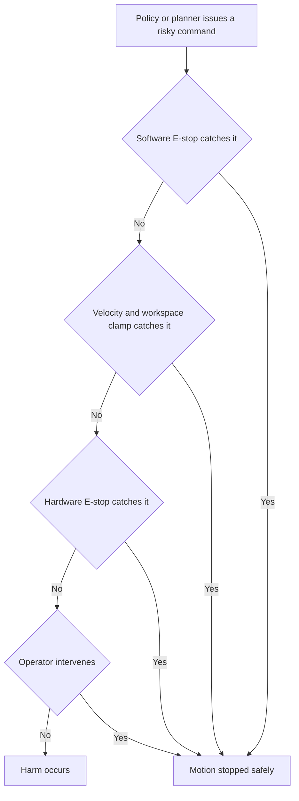
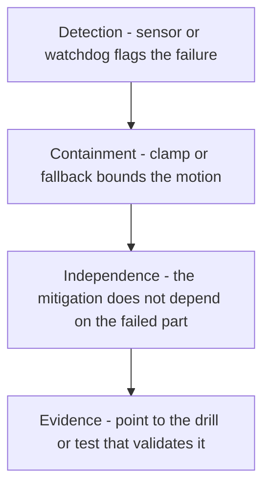

# Lecture 2 — Defending the Safety Case and Surviving the Live Q&A

> **Duration:** ~2 hours of reading + hands-on.
> **Outcome:** You can present a robotics safety case to a review panel as a structured argument they can audit, walk the claims-arguments-evidence (or GSN) spine that ties every hazard to its evidence, present your two chaos drills as validation evidence that the robot fails well, manage the risk of a live demo with rehearsed fallbacks, survive a twenty-five-minute live Q&A with three-layer "why" defense and graceful knowledge-edge handling, anticipate the hard questions on failure modes / edge cases / test coverage, understand the assessor's mindset, recognize the common defense failures, and write the public retro that closes the year.

Lecture 1 was the package and the structure. This lecture is the two parts that carry the most weight in the panel's decision: the safety case (because it's where they decide whether to trust you near people) and the live Q&A (because it's where they find the edge of what you actually know). It treats the safety case not as a document to recite but as an *argument to defend* — with the same rigor a functional-safety assessor brings to a real product. And it closes with the retro — the reflective coda that turns a year of work into wisdom.

If you remember one sentence from this lecture, remember this one:

> **A safety case is an argument, not a claim; you do not assert that the robot is safe — you build a chain from "the robot is acceptably safe in its operating context" down through sub-claims and reasoning to evidence that a skeptic can audit, and the defense is where the panel audits it.**

---

## 1. The safety case as a structured argument, not a document dump

Your Week 41 safety case is 8–15 pages. You will not read it to the panel; you will *present* it as an argument that walks them from "what could hurt someone" to "and here's why it won't, and here's the evidence." The spine:

> **The thesis: safety does not depend on the smart parts.**

This is the single most important sentence in your safety presentation. The learned policy can be wrong. The VLA can hallucinate a grasp. The planner can deadlock. The perception can drop a sensor. *None of those is allowed to cause harm*, because the safety layer — the software E-stop, the velocity/workspace clamps, the classical fallback — sits *underneath* all the smart parts and does not trust them. A panel hears a hundred candidates say "my robot is safe because the policy is good." The senior answer is the inverse: "my robot is safe *because it doesn't depend on the policy being good* — the safety layer bounds what any component, smart or dumb, is allowed to do." That inversion is what earns the signature.

Present it in this order:

1. **Intended use and the operational design domain (ODD).** What the robot is for ("language-conditioned fetch in a shared indoor space"), the conditions it's rated for (flat floors, walking-pace pedestrians, lit environments, no children unsupervised), and — explicitly — what's *outside* the ODD. A safety case that doesn't bound its own ODD is claiming the robot is safe everywhere, which no panel believes.
2. **Foreseeable misuse.** How it might be misused or encounter the unexpected: a child grabs it, an instruction it can't parse, a person steps into its path, an operator leaves it running unattended. ISO 12100 calls this "reasonably foreseeable misuse," and naming it is the difference between a hazard analysis and a wish.
3. **The hazard list.** The things that could cause harm: collision with a person, the arm striking someone, the base trapping a foot, an uncontrolled motion from a bad policy action, a dropped payload. Each hazard has an ID you'll reference for the rest of the presentation.
4. **The FMEA.** For each failure mode: the cause, the effect, the severity, the likelihood, the detectability, and the mitigation. This is the table the panel reads most carefully — it's where they check whether you *enumerated* failures or just hoped.
5. **The mitigations, layered.** Software E-stop (200 ms latch), velocity and workspace clamps, perception-confidence gates, the classical fallback, the hardware E-stop. Each hazard maps to one or more mitigations, and each mitigation maps back to the hazard(s) it covers — the mapping is bidirectional and complete, or the panel finds the hole.
6. **The validation plan and evidence.** How you tested each mitigation — including the chaos drills, which are *validation evidence* (the sensor-dropout drill validates the degraded-mode mitigation; the deadlock drill validates the recovery ladder). Evidence is bagged, dated, and citable, not "I tried it and it worked."
7. **The residual risk.** What's left after mitigations, stated and explicitly accepted. A safety case with *no* residual risk is a safety case that's lying; honesty about what remains is a strength.

The order is not arbitrary. It is the order of the argument: *here is what the robot does → here is how it could hurt someone → here is how I stop each one → here is my proof → here is what I couldn't fully eliminate and why it's acceptable.* Present it in any other order and the panel has to reassemble the logic themselves, which costs you the goodwill you want them spending on the hard questions.

---

## 2. Structuring the safety argument: GSN and Claims-Arguments-Evidence

The single biggest upgrade you can make to your safety presentation is to stop presenting a *list* of mitigations and start presenting an *argument with structure*. Two notations do this, and you should be fluent enough in at least one to sketch it on a whiteboard when a panelist asks "how does this all hang together?"

### 2.1 Claims-Arguments-Evidence (CAE)

CAE is the simplest structured-argument notation and the one to default to. It has exactly three element types:

- **Claim** — a proposition you assert is true. The top claim is "the robot is acceptably safe in its ODD." Sub-claims decompose it.
- **Argument** — the reasoning that connects a claim to its sub-claims or to evidence. This is the *why this decomposition is valid* step, and it's the part juniors skip.
- **Evidence** — the artifacts (test results, drill bags, analyses, standards conformance) that ground a leaf claim.

A worked fragment of your capstone's CAE:

```text
CLAIM (top): The mobile manipulator is acceptably safe in its ODD
  (indoor, flat-floor, walking-pace shared space).

  ARGUMENT: Safety is decomposed by hazard; each identified hazard is
  either eliminated, mitigated to an acceptable residual, or accepted.
  The hazard list is complete for the ODD (per the HAZOP/FMEA process).

    CLAIM 1: Collision-with-person hazards cannot produce harmful contact force.
      ARGUMENT: Contact energy is bounded below the ISO 13482 / ISO/TS 15066
      threshold by independent velocity clamping that does not trust the policy.
        EVIDENCE 1a: Velocity-clamp unit test — /cmd_vel capped at 0.5 m/s, 200 runs.
        EVIDENCE 1b: Bump-test bag — measured contact force 38 N < 65 N threshold.
        EVIDENCE 1c: Sensor-dropout chaos drill — degraded mode holds the clamp.

    CLAIM 2: A failed perception input cannot cause uncontrolled motion.
      ARGUMENT: Perception-confidence gating + the classical fallback bound
      motion when the smart layer is untrustworthy.
        EVIDENCE 2a: Confidence-gate test bag.
        EVIDENCE 2b: Sensor-dropout postmortem (detected 1.2 s, safe-abort).

    CLAIM 3: Residual risks are identified, quantified, and accepted.
      ARGUMENT: Each residual is bounded against a standard and signed off.
        EVIDENCE 3a: Residual-risk register, peer-signed.
```

When you present, you walk *this tree*, not the document's page order. The power of CAE is that it makes the panel's audit job legible: they can point at any node and ask "is the argument under this claim actually valid?" or "is that evidence sufficient?" — and you have a place to stand for every question, because every claim has its argument and evidence right there.

### 2.2 Goal Structuring Notation (GSN)

GSN is the richer, graphical cousin used in regulated industries (automotive ISO 26262, rail, aerospace). It's the same idea with named box types and a diagram instead of an outline. You don't need to produce a full GSN diagram for the capstone, but you should know the vocabulary because a panelist from industry may use it:

- **Goal** (rectangle) — a claim, same as CAE's claim. The top goal: "robot is acceptably safe in its ODD."
- **Strategy** (parallelogram) — the argument step; how a goal is broken into sub-goals. "Argument over each identified hazard."
- **Solution** (circle) — the evidence node; a test result, analysis, or drill.
- **Context** (rounded rectangle) — the scope a goal is interpreted in: the ODD, the definition of "acceptable," the standard invoked.
- **Assumption / Justification** (ovals) — the things the argument *rests on* that you're not proving here: "assume the hardware E-stop meets its rated SIL," "justification: ISO 13482 is the applicable standard for personal-care mobile servants."

The reason GSN matters for the defense even if you sketch CAE: the **context and assumption nodes are where panels attack.** A goal "robot is safe" with no context node is undefined — safe *where*, against *what*, to *whose* definition of acceptable? Naming the context ("in this ODD, against ISO 13482 contact limits, with 'acceptable' meaning residual risk below the standard's threshold") pre-empts the attack and shows assessor-grade thinking. The assumptions are where a sharp panelist finds the unstated dependency — "you assume the hardware E-stop works; what's your evidence for *that*?" — so surface your assumptions before they're surfaced for you.

### 2.3 What structure buys you in the room

Three concrete things, every one of which scores:

- **It makes "what if X fails?" answerable by navigation.** The panelist names a failure; you walk to the claim it threatens, show the argument and evidence that hold under that failure, and you've answered without flailing.
- **It exposes your own gaps before the panel does.** Building the argument tree forces you to find the leaf claim with no evidence — the mitigation you never actually tested. That's the gap you want to find Thursday, not live.
- **It signals maturity.** A candidate who says "here's my hazard list and here's what I did about each" is competent. A candidate who says "here's my top claim, here's how I decompose it, here's the evidence under each leaf, and here are the assumptions the whole thing rests on" is *thinking like an assessor*, and that read is worth a letter grade.

---

## 3. The Swiss-cheese model: why layers, not a perfect defense

When the panel pushes on "but what if the E-stop fails?", the answer is the Swiss-cheese model, and you should reach for it explicitly. No single mitigation is perfect — each is a slice of cheese with holes. Safety comes from *layering* slices so that the holes don't line up: for harm to occur, the software E-stop *and* the velocity clamp *and* the hardware E-stop *and* the operator all have to fail at once. Each layer catches what the others miss.


*Harm only occurs if all four independent layers fail in sequence — the Swiss-cheese model.*

This framing does three things in the defense:

- **It answers the "what if X fails" question structurally.** You don't claim X never fails; you show that X failing alone doesn't cause harm because layer Y catches it. "If the software E-stop hangs, the hardware E-stop is independent and the velocity clamp has already bounded the worst-case motion."
- **It demonstrates defense-in-depth thinking**, which is exactly the maturity the panel is checking for. A candidate who claims one mitigation is sufficient reveals they don't understand that mitigations fail; a candidate who layers them and reasons about the holes lining up reveals they do.
- **It sets up the independence question, which is the real one.** The Swiss-cheese model only works if the slices fail *independently*. The senior follow-up — and the one the best panelists ask — is "are your layers actually independent, or do they share a failure mode?" If your software E-stop and your velocity clamp both run on the same node, the same crash takes out two slices at once and the holes are aligned by construction. The strong answer names the independence explicitly: "the hardware E-stop is on a separate microcontroller with its own power; the velocity clamp runs in the real-time control process, separate from the planning process that hosts the software E-stop; a single process crash takes at most one slice." If two of your layers *do* share a substrate, say so and treat it as a residual risk — that honesty is worth more than a layered diagram that quietly lies about independence.

This is also where you cite **common-cause failure** by name. Power loss, a kernel panic, a shared library bug, a single sensor feeding two "independent" checks — these are the holes that line up across slices. A safety case that lists five mitigations but routes them all through one ROS 2 node has one slice wearing five labels. Knowing the difference, and being able to say which of your layers are *genuinely* independent and which share a substrate, is the difference between a diagram and an argument.

---

## 4. Defending residual risk

The residual-risk section is where junior candidates flinch and senior candidates shine. The flinch is to claim there's no residual risk — which no panel believes, because every real robot has some. The senior move is to state the residual risk precisely and argue it's *acceptable*:

> "The residual risk is a collision at up to 0.2 m/s in degraded camera-only mode, in the gap between perception-confidence dropping and the velocity clamp engaging — about 80 ms. At 0.2 m/s that's 1.6 cm of travel, below the contact-force threshold in ISO 13482 for the contact area. I've bounded it, measured it, and accepted it, and the validation plan includes the bump test that confirms the force stays under the threshold."

Notice what that does: it names the risk, quantifies it, frames it against a standard, and points to the validation that confirms the bound. That is a defensible residual risk. "I don't think anything bad can happen" is not — and the panel will keep pushing until they get either the quantified version or the admission that you haven't thought it through. Have the quantified version.

The structure of a defensible residual-risk argument is always the same four moves:

1. **Name it precisely** — the exact scenario, mode, and window. Not "collisions," but "a contact in degraded camera-only mode in the 80 ms gap before the clamp engages."
2. **Quantify it** — the worst-case number. Velocity, energy, travel distance, force. A residual risk you can't put a number on is one you haven't actually bounded.
3. **Frame it against a threshold** — a standard (ISO 13482 / ISO/TS 15066 contact limits), a measured human-tolerance figure, or an internal acceptance criterion. The threshold is what makes "acceptable" mean something.
4. **Point at the evidence** — the test, bag, or analysis that confirms you're under the threshold. The bump test, the NEES plot, the timing measurement.

And then the part most candidates miss: **state who accepted the residual risk and on what basis.** In a real product a residual risk is signed off by a named person with the authority to accept it. In your capstone that's you and your peer reviewer; say so. "This residual is documented in the risk register and signed by my peer reviewer on [date]" closes the loop the way a real safety case does. Risk acceptance is a *decision by an accountable person*, not a property of the robot, and showing you understand that is assessor-grade.

The trap to avoid: do not let "residual risk" become a dumping ground for hazards you didn't want to mitigate. A residual risk is what's left *after* you've applied reasonable mitigations — it is the irreducible remainder, accepted because reducing it further costs more than the risk warrants (the ALARP principle: As Low As Reasonably Practicable). A hazard you *could* cheaply mitigate but parked in the residual section is a defect, and a sharp panel will ask "why didn't you just clamp harder / gate sooner / add the second sensor?" Have the ALARP answer — "reducing it further would cost X and the residual is already below the threshold" — or fix it.

---

## 5. The chaos drills as validation evidence

Your two Week 46 postmortems are not a separate topic in the defense — they are *evidence in the safety case*. Present them as: "Here is how I validated that the robot fails well." For each drill:

- **The hazard it validates.** The sensor-dropout drill validates the "perception failure must not cause uncontrolled motion" mitigation (Claim 2 in the CAE tree). The deadlock drill validates the "the robot must not grind or force its way through a blockage" mitigation. State the claim each drill grounds, so the panel sees the drill as evidence under a specific leaf, not a war story.
- **The result, with the timeline.** Detected in 1.2 s, degraded mode, operator alert, safe-abort — from the bag, not memory. The timeline is the evidence; "it recovered" without the numbers is an anecdote.
- **What it surfaced.** The honest "what didn't" from the postmortem, and the hazard-log update it drove (the Week 46 §6 feedback loop). A drill that found a gap and closed it is *stronger* evidence than one where nothing surprised you, because it proves the validation process actually exercises the system rather than confirming what you already believed.

The follow-up the panel always asks: **"what else could break that you didn't drill?"** Have an answer — the unannounced-third-failure stretch from Week 46, or a reasoned "the next drill I'd run is X, because it stresses the Y mitigation I'm least sure of." A candidate who can name the drill they *haven't* run yet, and why, demonstrates they think in failure modes continuously, not just for the two graded drills.

The deeper point a strong panel is probing: **two drills is not test coverage of a safety case; it's two data points.** Be ready to talk about your coverage *argument*. You didn't drill every failure mode — nobody can — so why are these two the right two? The honest answer ties to your FMEA: "I drilled the two highest-severity-times-likelihood failure modes from the FMEA — sensor dropout because it's the most common real-world failure and feeds the perception layer, and doorway deadlock because it's the failure most likely to make the robot force its way and contact a person. The next tier I'd drill is [X]." That answer reframes "you only ran two drills" from a weakness into evidence of *risk-prioritized* testing, which is exactly how real validation is scoped under a time budget.

---

## 6. Anticipating the hard questions

The panel's questions are not random. They cluster into a small number of categories, and a prepared candidate has rehearsed an answer to each *category* rather than trying to predict every specific question. Know the categories, and the specific question becomes an instance you've already thought about.

### 6.1 Failure-mode questions

These probe whether your safety argument holds when something breaks. The shape is always "what happens when X fails / drops / lies / lags?"

- *"What happens if the LiDAR dies mid-task?"* → degraded mode, the confidence gate, the clamp, the sensor-dropout drill as evidence.
- *"What if the policy commands a full-speed motion toward a person?"* → the velocity clamp bounds it regardless of what the policy commands; the policy is not trusted; this is the thesis.
- *"What if the localization diverges and the robot thinks it's somewhere it isn't?"* → the workspace clamp is in the *robot's own* frame for the arm, the costmap is local and sensor-driven for the base, and the NEES consistency check would flag the divergence to the operator.

The meta-answer to every failure-mode question is the same move: *name the layer that catches it, show it doesn't trust the failed component, point at the evidence.* If you find yourself answering a failure-mode question by explaining why the failure won't happen, stop — the panel doesn't care whether it happens, they care what happens *when* it does. "It won't fail" is the junior answer; "when it fails, here's what bounds the harm" is the senior one.

### 6.2 Edge-case questions

These probe the boundary of your ODD. "What about a child? A glass door the LiDAR can't see? A person in a wheelchair below your detection class? Two instructions at once? An object heavier than you tested?" The strong answer has three possible shapes, and you pick the honest one:

1. **In-ODD and handled** — "wheelchairs are in-ODD; the detector class covers seated people, here's the eval."
2. **Out-of-ODD and bounded** — "glass doors are outside my ODD; the robot isn't rated for environments with transparent obstacles the LiDAR can't see, and the safety case states that limit explicitly. In-ODD I'd require them to be marked."
3. **In-ODD and a known gap** — "children are in-ODD and a real gap; my detector wasn't trained on child-height people, so I treat any unexpected close obstacle conservatively with the clamp, and 'validate child detection' is the top item on my residual-risk register."

The failure here is pretending every edge case is handled. Panels plant edge cases *specifically to find the one you'll bluff on.* "That's outside my ODD and here's why that's a defensible boundary" is a strong answer; "uh, it would probably be fine" is a fatal one.

### 6.3 Test-coverage questions

These probe whether your evidence actually supports your claims. "How do you know the clamp engages in 80 ms — did you measure it or compute it? How many runs? Under what conditions? What's your coverage of the instruction space — 20 instructions out of how many possible? Did you test the clamp and the E-stop *together* or only separately?"

The senior reflex: **distinguish what you measured from what you argued.** "The 80 ms is measured — here's the bag, 200 runs, p95 is 78 ms. The contact-force bound is measured by bump test. The claim that the layers are independent is *argued* from the architecture, not measured, because I can't easily inject a kernel panic — that's a known limit of my validation and it's in the residual register." A candidate who can cleanly separate "I measured this" from "I reasoned this" from "I assumed this" is demonstrating exactly the epistemic discipline a safety assessor lives by. Blurring them — claiming measured certainty for something you only reasoned about — is the thing a sharp panel will catch and the thing that, on a real robot, gets people hurt.

### 6.4 The "what happens if X fails" question, drilled

This question deserves its own treatment because it's the single most common safety question and the one with the cleanest rehearsable structure. Whatever X is, answer in four beats:

1. **Detection** — "the [sensor health monitor / confidence gate / watchdog] detects it in [time], here's the bag."
2. **Containment** — "the [clamp / fallback / E-stop] bounds the motion to [number] regardless of the failure."
3. **Independence** — "that mitigation doesn't depend on X, because [it runs in a separate process / on separate hardware / from a separate input]."
4. **Evidence** — "I validated this in [the drill / the unit test], here's the timeline."


*The four-beat structure for answering any "what if X fails" question.*

Detect, contain, independence, evidence. Drill that four-beat structure until it's reflexive, and *any* "what if X fails" question becomes a fill-in-the-blank rather than an improvisation. The four-beat answer also self-diagnoses: if you can't fill in beat 3 (independence) for some X, you've just found a place where two of your layers share a substrate — a real finding worth surfacing.

---

## 7. Demo risk management

The live demo is the highest-variance, lowest-information part of the defense, and managing its risk is itself a skill the panel reads. A robot that won't boot in front of the panel doesn't prove your robot doesn't work — but it *does* burn your time and your composure, and it signals you didn't rehearse the logistics. Manage it like an engineer.

### 7.1 The demo is evidence, not theater

A demo's job in a safety-focused defense is narrow: show that the robot does what your bags and videos claim, live, so the panel trusts the recorded evidence. It is not the place to attempt something you've never reliably done. The cardinal rule: **never demo live what you can only do sometimes.** If an instruction succeeds 7 times in 10, do not run it live as your headline; show the bagged success and the per-instruction eval, and live-demo something that succeeds 10 in 10. The live demo should be the *most* reliable thing you do, not the most impressive.

### 7.2 The fallback ladder

Have a pre-planned ladder of fallbacks, from best to worst, and know in advance the threshold at which you drop to the next rung. Deciding live, under panel pressure, is how a thirty-second hiccup becomes a five-minute death spiral.

```text
Rung 1 (best):  Live on the real robot / live in sim on the defense machine.
Rung 2:         The live run hangs > 30 s → switch to the recorded run of the
                same task ("here's this exact instruction from yesterday's bag").
Rung 3:         Recording won't play on the defense setup → screen-share the
                bag replay from your own laptop.
Rung 4 (floor): Total AV failure → walk the architecture diagram and the
                per-instruction eval table; the numbers stand without the video.
```

The point of the ladder is that you *never freeze.* Every rung is a confident, prepared sentence, not a scramble. "The live run's hanging — let me show you the bagged version of this exact instruction, then I'll come back to live if it recovers" is a senior recovery. Staring at a frozen terminal for ninety seconds is not.

### 7.3 The logistics that sink demos

These are not robotics, and every one has ended an otherwise-strong defense:

- **Cold-boot on the actual defense machine, the day before.** The spec's < 60 s cold-boot is a criterion the panel can test live; the worst time to discover it doesn't boot on the projector laptop is live.
- **Every video and bag plays on the presentation setup**, not just your laptop. Codecs, resolutions, and missing fonts kill recordings.
- **The repo is public and the README renders** — a "private, let me add you" scramble at the start spends goodwill you want for the Q&A.
- **A second machine and a drive** with the whole package. The one time the primary fails is the worst possible time.
- **The E-stop is reachable and tested** if you demo the real robot near people. A demo where you can't instantly stop the robot is a safety failure *in the demo itself*, which the panel will note.

### 7.4 Demoing the safety behavior on purpose

The strongest demo move in a safety defense is to demo a *failure*, not a success. Trigger the sensor dropout live (pull the LiDAR's power, or inject the fault) and let the panel watch the robot detect it, alert the operator, and safe-abort. A successful fetch shows the robot works; a successful *safe failure* shows the robot fails well — which is the thing the safety case actually claims. If you can do exactly one live thing reliably, consider making it a chaos drill rather than a fetch. "Watch the health panel flip and the robot stop when I kill the LiDAR" is the most convincing thirty seconds in the whole defense, because it's the thesis made visible.

---

## 8. The assessor mindset

To defend a safety case well, spend a few minutes inside the head of the person assessing it. A functional-safety assessor — and a good panel borrows the assessor's posture — is not asking "is this robot impressive?" They are asking a different question entirely:

> **"If I sign this and someone gets hurt, will my signature have been defensible?"**

That single question explains almost everything about how the panel behaves. It tells you:

- **They are looking for the gap, not the polish.** An assessor's job is to find the unmitigated hazard, the unsupported claim, the assumption that doesn't hold. They will spend more time on the one hazard you hand-waved than on the nine you nailed, because the one is where the signature becomes indefensible. Don't be wounded when they dwell on your weakest point — that's the job.
- **They trust evidence over assertion, and structure over both.** "I tested it and it's fine" is an assertion. "Here's the bag, 200 runs, p95 under the threshold" is evidence. An argument tree that ties the evidence to the claim is structure. The assessor weights these in that order, ascending.
- **They are checking your *honesty* as much as your robot.** An assessor has to be able to trust your numbers, because they can't re-derive everything. A single caught overclaim poisons every other claim, because now they have to wonder what else you fudged. This is why an honest gap beats a hidden one by a wide margin: the honest gap *builds* the trust that makes the rest of your evidence credible.
- **They respect the engineer who'd push back on them.** The flip side of common-cause failure is common-cause *agreement* — a candidate who agrees with everything the panel says is as useless as a safety layer that trusts the policy. Assessors have signed off on systems that hurt people; the ones who didn't get hurt were the engineers who said "actually, that assumption doesn't hold." (This is §10.3, the false premise.)

The reframe this gives you: the panel is not your adversary, and they are not your audience either. They are your **co-signers** — people about to attach their professional judgment to your robot — and your job is to give them an argument solid enough that signing is defensible. Every honest gap you surface, every quantified residual, every cleanly-separated "measured vs. argued," makes their signature safer. Present *for* the assessor, not *at* them.

---

## 9. Common defense failures

These are the recurring ways defenses go wrong in the safety presentation and the Q&A. Each is avoidable, and knowing the pattern is most of the cure.

| Failure | What it looks like | The fix |
|---|---|---|
| **The zero-residual-risk claim** | "There's no real risk left." | Quantify a residual and frame it against a standard (§4). No real robot has zero residual risk; claiming it reads as not having looked. |
| **The list-not-argument** | Reciting mitigations with no claim structure tying them to hazards. | Present the CAE/GSN tree (§2); every mitigation maps to a hazard and grounds a claim. |
| **The single-slice safety case** | Five "independent" mitigations all in one ROS 2 node. | Name which layers are genuinely independent and which share a substrate; treat shared substrates as residual risk (§3). |
| **"It won't fail"** | Answering a failure-mode question by arguing the failure won't happen. | Assume it fails; show what bounds the harm when it does (§6.1). |
| **The bluffed edge case** | "That'd probably be fine" for an out-of-ODD scenario. | Name the ODD boundary or the known gap honestly (§6.2). |
| **Measured/argued blur** | Claiming measured certainty for something only reasoned about. | Separate "I measured / I argued / I assumed" cleanly (§6.3). |
| **The collapsing "why"** | "It's what the tutorial used" by the second why-layer. | Drill three-layer "why" on every major decision (§10.1). |
| **The bluff at the edge** | Confident-wrong instead of "here's my boundary." | The knowledge-edge answer (§10.2); confident-wrong is the only fatal answer. |
| **The agreeable nod** | Agreeing with a planted false premise to be agreeable. | Catch and correct it (§10.3). |
| **The sanitized postmortem** | A chaos drill where "nothing went wrong." | Present the gap the drill found and the hazard-log update it drove (§5). |
| **The demo death-spiral** | Ninety seconds frozen on a hung terminal. | The fallback ladder (§7.2); never decide live. |
| **The hidden gap** | Fudging 14/20 to 15. | State the real number with a failure analysis; honest gaps beat hidden ones (Lecture 1 §4). |

The thread through all of them: defenses fail not because the robot is weak but because the *argument* is weak — unstructured, overclaimed, or dishonest. A modest robot defended with a tight, honest, structured argument passes; an impressive robot defended with a list of assertions and a bluffed edge case does not.

---

## 10. Surviving the live Q&A

The twenty-five-minute Q&A is where the defense is won or lost (Lecture 1 §2). It is the Week 45 challenge and the Week 47 deep-dive, at the highest stakes. The four core skills, plus the structure for keeping calm under fire.

### 10.1 Three-layer "why," across the whole stack

The panel picks a decision and digs three layers. The bar (from Week 45): hold up three "why" layers without a non-answer, connect at least one layer to a measured artifact, name the rejected alternative. You rehearsed this in Week 45 (one decision) and Week 47 (the whole stack). The panel may probe *any* decision — EKF vs factor graph, MPC vs LQR, VLA vs scripted grasp, INT8 vs FP16 — so the whole stack must be three-layers-deep defensible. The failure is collapsing to "it's what the tutorial used."

A worked three-layer descent on a real decision:

> **Panel:** "Why an EKF for the local estimate and not a factor graph?"
> **You (layer 1):** "Because the local estimate has to run at 100 Hz on the Orin, and the EKF is constant-time — it marginalizes the past into one Gaussian — while a factor graph relinearizes a window and costs more per step."
> **Panel:** "But the factor graph is more accurate — why give that up?"
> **You (layer 2):** "I don't give it up where it matters — I run the EKF for the 100 Hz local estimate and a factor-graph SLAM back-end for the map and loop closures, which is where smoothing's accuracy actually pays. The local loop doesn't need loop closures; it needs to be fast and consistent."
> **Panel:** "How do you know it's consistent and not just fast?"
> **You (layer 3, to a measured artifact):** "The NEES sits inside its chi-squared bounds across the 20 m run — here's the plot. If it were overconfident from a bad Q, NEES would blow through the upper bound; it doesn't. So it's consistent, not just lucky."

Three layers, the rejected alternative named (factor graph) *and* re-incorporated where it belongs, and the third layer grounded in a measured artifact (the NEES plot). That descent is the bar. Notice it never bluffs and never collapses to authority — each "why" goes one level deeper into the actual reasoning.

### 10.2 The knowledge-edge answer

You *will* hit the edge of what you know — the panel's job is to find it. Hitting it is not the failure; bluffing past it is. The pass: "I didn't derive the full 15-state Jacobian by hand — I used `robot_localization` and validated the 2D sub-block, which I can derive; here it is. To go deeper I'd [specific next step]." That answer shows you know the boundary of your knowledge, which is itself senior. Confident-wrong is the only fatal answer.

The anatomy of a strong knowledge-edge answer has three parts:

1. **State what you *do* know, concretely** — "I validated the 2D sub-block and can derive it."
2. **Name the boundary precisely** — "I did not derive the full 15-state Jacobian by hand."
3. **Give the path past the boundary** — "to go deeper I'd derive it symbolically with SymPy and check it against the library's numerical Jacobian."

The third part is what converts "I don't know" from a stop into a senior answer. "I don't know, but here's exactly how I'd find out" is the answer of someone who's hit the edge of their knowledge a thousand times in real engineering and has a *reflex* for it. That reflex is what the panel is checking for, because on a real robot you will constantly be at the edge of what you know, and the engineers who don't get people hurt are the ones who *say so* and go find out.

### 10.3 Catching the false premise

Panels test intellectual honesty by asserting something false: "an EKF is exact for nonlinear systems, right?" or "INT8 has no accuracy cost, correct?" or "your hardware E-stop guarantees safety, so the software layer is redundant, isn't it?" Agreeing to be agreeable is a quiet fail. Catching and correcting it — "actually, the EKF linearizes, so it's *not* exact for nonlinear systems; that's the approximation error I tune Q to absorb" — scores enormously. The panel is checking whether you'll defend the truth against authority, because on a real robot, agreeing with a senior engineer's wrong assertion gets people hurt.

The safety-flavored false premise is the most important one to catch, because it's the one that maps to real harm: "since you have a hardware E-stop, the software E-stop is redundant — you could drop it." The catch: "they're not redundant, they're *layered with different coverage* — the software E-stop reacts to conditions the hardware one can't see, like a perception-confidence drop, in software-fast time; the hardware E-stop is the independent last resort for when software itself fails. Dropping either aligns the holes in the Swiss cheese." Catching *that* premise shows you understand your own safety architecture well enough to defend it against an authority who's trying to talk you out of a layer — which is exactly the situation that gets safety layers deleted on real products under schedule pressure.

### 10.4 Steering toward your strengths

You can't control which decision the panel probes, but your opening pitch and walkthrough *seed* the questions (Lecture 1 §2). Mention the trade-offs you're ready to defend; the panel's curiosity follows what you flag as interesting. A candidate who says "the hardest call was the base controller" invites the MPC question they've rehearsed, instead of a question they haven't.

### 10.5 Composure under recursive pressure

The Q&A is recursive — every answer invites a deeper question — and the pressure compounds. Three habits keep you steady:

- **It's fine to take three seconds.** A short pause before a hard question reads as *thinking*, not floundering. Rushing reads as panic. "Let me think about that for a second" buys you the time and costs you nothing.
- **Answer the question they asked, then stop.** Over-answering — volunteering a tangent — opens new attack surface you didn't need to expose. Answer crisply, then let them choose the next thread. You control more of the Q&A by saying less.
- **A hard question is a compliment.** Panels dig hardest where they think you're strong enough to go deep. When the questions get harder, you're usually doing well — they've stopped checking whether you're competent and started exploring how deep you go. Read the escalation as a sign you're passing, not failing.

---

## 11. A worked mock defense transcript

Here is a compressed transcript of a Q&A segment, annotated, so you can see the skills land in sequence. This is the kind of exchange the full mock (the challenge) rehearses. P is a panelist; C is the candidate.

> **P:** "Walk me to the safety layer on your diagram. What's actually stopping the robot from hitting someone?"
>
> **C:** "Three independent things, layered. The top claim of my safety case is that the robot can't produce harmful contact in its ODD, and it decomposes into: the velocity clamp on `/cmd_vel` bounds speed to 0.5 m/s regardless of what the planner or policy commands; the perception-confidence gate drops to a slower degraded mode when the inputs aren't trustworthy; and the hardware E-stop is the independent last resort on its own microcontroller. The key property is that *none of these trusts the smart layer* — the clamp bounds the policy whether or not the policy is right."
>
> *[Annotation: thesis stated, CAE top claim named, independence flagged proactively. This seeds the independence question — which the candidate wants, because they've rehearsed it.]*
>
> **P:** "The clamp runs in software. What happens if that process crashes?"
>
> **C:** "Detect, contain, independence, evidence. Detection: a watchdog on the control process flags a missed deadline in under 100 ms. Containment: the hardware E-stop is independent of that process — it's on a separate microcontroller with its own power — so a crash of the software clamp doesn't take it out. Independence: the planning process, the real-time control process where the clamp lives, and the hardware E-stop are three separate fault domains; one crash takes at most one slice. Evidence: I validated the watchdog timing in a unit test — here's the bag — though I'll be honest that I haven't injected a real kernel panic, so the 'a crash takes one slice' claim is *argued from the architecture*, not measured. That limit is in my residual-risk register."
>
> *[Annotation: the four-beat failure answer, the Swiss-cheese independence argument, and — critically — the clean separation of measured (watchdog timing) from argued (fault-domain independence), with the gap surfaced honestly. This is the assessor-grade move.]*
>
> **P:** "Since the hardware E-stop is independent and always there, the software clamp is redundant. You could drop it, couldn't you?"
>
> **C:** "I'd push back on that — they're not redundant, they have different coverage. The hardware E-stop is a physical button and a watchdog cutoff; it can't see a perception-confidence drop or bound velocity *proportionally*. The software clamp reacts to conditions the hardware layer is blind to, in software-fast time, and it bounds the robot to a safe speed continuously rather than just cutting power. Dropping it would align the holes in the Swiss cheese — I'd lose the layer that catches the failures the hardware E-stop can't detect."
>
> *[Annotation: false premise caught and corrected against authority, tied back to the architecture and the Swiss-cheese model. This is the highest-scoring move in the segment.]*
>
> **P:** "What's the residual risk on that contact path, then?"
>
> **C:** "A contact in degraded camera-only mode, in the roughly 80 ms gap between the confidence dropping and the clamp engaging. Worst case that's 0.2 m/s, which is 1.6 cm of travel and a measured contact force of 38 N in the bump test — under the 65 N ISO/TS 15066 threshold for that contact area. It's named, quantified, framed against the standard, and the bump-test bag confirms the bound. It's in the residual register, signed by my peer reviewer on the 6th."
>
> *[Annotation: the four-move residual-risk argument — name, quantify, frame against standard, point at evidence — plus the named risk acceptance. Defensible residual.]*
>
> **P:** "Last one. How do you *know* your detector sees a person standing still in a dark hallway? That's in your ODD."
>
> **C:** "Honestly — partially. I have eval numbers for standing people in lit conditions, here's the table, and the detector holds in those. Low light is the edge: I tested down to about 50 lux and it degrades below that, which is *inside* my stated ODD, so it's a real gap, not an out-of-ODD dodge. My mitigation today is that the confidence gate drops to degraded mode when detection confidence falls, so a person it can't cleanly see still triggers the slow-and-cautious path rather than a confident full-speed move. But 'validate detection below 50 lux' is the top open item on my residual register, and if I'm honest it's the thing I'd fix first with another week."
>
> *[Annotation: a real edge-case / test-coverage question answered with the honest "in-ODD known gap" shape (§6.2 case 3), separating measured (lit-condition eval) from the gap, naming the mitigation that holds in the meantime, and not bluffing. An honest gap with a mitigation and a plan beats a confident "it's fine" every time.]*

What makes this transcript a *pass* is not that the candidate's robot is flawless — it has a real detection gap in low light. It's that every answer is structured, every claim is honestly tagged as measured or argued, the failure answers follow the four beats, the false premise is caught, and the residual risk is quantified and accepted. The panel finishes this segment knowing exactly where the robot stands, including its gap — and *that knowledge is what lets them sign.* You don't pass by having no gaps; you pass by being the engineer who knows precisely where the gaps are and bounds them honestly.

---

## 12. The public retro

The spec calls for a one-page public retro — "what I'd do differently" — written at week 48. It is the reflective coda, and a stronger artifact than a list of wins because it demonstrates the thing employers most want and most struggle to assess: the ability to learn from your own work.

A strong retro:

- **Is specific and technical.** Not "I'd manage my time better" but "I'd have built the latency budget in week 1 instead of week 39 — retrofitting it meant re-profiling a graph I could have been measuring all along."
- **Picks real regrets.** A retro with no regrets reads as someone who didn't reflect. Name two or three things you genuinely got wrong and what they cost.
- **Extracts the transferable lesson.** Each regret ends in a principle you'll carry: "measure from day one," "set the accuracy floor before optimizing," "chaos-test the safety path before trusting it."
- **Is honest about what you'd keep.** Reflection isn't only regret; name the decision you're proud of and *why it held up*, because knowing what worked is as important as knowing what didn't.

The safety-flavored retro line is the one a robotics employer reads closest: the regret about your *safety* process. "I treated the safety case as a Week-41 deliverable instead of a Week-1 design constraint, and it showed — I had to retrofit the velocity clamp into a control loop that wasn't built to host it, when designing the clamp first would have shaped the whole architecture." A candidate who has internalized that safety is an architecture-time concern, not a documentation-time one, is exactly the candidate a robotics company wants near its product. The retro is where you prove you learned that.

The retro is the last thing you write in C24, and it's the one a thoughtful interviewer reads most closely — because it's the clearest window into whether you grow from experience.

---

## 13. What you can now do

You can present a safety case as a structured argument — CAE or GSN — built on the thesis "safety doesn't depend on the smart parts," with every mitigation mapped to a hazard and every leaf claim grounded in cited evidence. You can walk the hazard log and FMEA, defend residual risk with a quantified, standard-framed, accepted argument, and use the Swiss-cheese model — including the independence and common-cause questions — to answer "what if X fails." You can present your two chaos drills as validation evidence with a coverage argument, and name the drill you haven't run yet. You can anticipate the panel's questions by category — failure mode, edge case, test coverage — and answer the "what if X fails" question with the four-beat detect-contain-independence-evidence structure. You can manage the risk of a live demo with a fallback ladder and demo a safe failure on purpose. You understand the assessor's mindset and the common ways defenses fail. And you can survive the live Q&A — three-layer "why" across the whole stack, the graceful knowledge-edge answer, catching the false premise against authority, and steering toward your strengths — then write the public retro that closes the year with the reflection an employer respects.

Everything in C24 has led here. Bring the package from Lecture 1 and the defense from this lecture to the challenge — the full mock defense — close the gaps it finds, and present. When the panel signs the rubric, you are a Crunch Robotics graduate.

---

### Section recap

| § | The one thing to take away |
|---|---|
| 1 | Present the safety case as a structured argument on the thesis "safety does not depend on the smart parts," in argument order, not page order. |
| 2 | Give the safety argument a CAE/GSN structure — claim, argument, evidence — and name your context and assumptions before the panel attacks them. |
| 3 | The Swiss-cheese model answers "what if X fails," but only if the slices are independent — name common-cause failures and shared substrates honestly. |
| 4 | Defend residual risk in four moves — name, quantify, frame against a standard, point at evidence — and state who accepted it; "no residual risk" is the flinch. |
| 5 | The chaos drills are validation evidence under specific claims; have the coverage argument for why those two drills were the right two. |
| 6 | Anticipate questions by category — failure mode, edge case, test coverage — and answer "what if X fails" with detect, contain, independence, evidence. |
| 7 | Manage demo risk with a fallback ladder; never demo what you can only do sometimes; demo a safe failure on purpose. |
| 8 | The assessor asks "will my signature be defensible?" — present *for* your co-signers, with evidence over assertion and honesty over both. |
| 9 | Know the common defense failures; they all reduce to a weak *argument*, not a weak robot. |
| 10 | The Q&A is won with three-layer "why," the knowledge-edge answer, catching the false premise, steering toward strengths, and composure under recursive pressure. |
| 11 | The worked transcript: you pass by knowing exactly where your gaps are and bounding them honestly, not by having none. |
| 12 | The public retro is specific, has real regrets with transferable lessons — especially about safety-as-architecture — and is the artifact a thoughtful interviewer reads closest. |

*Now run the full mock defense — close its gaps, and present. You earned this.*
